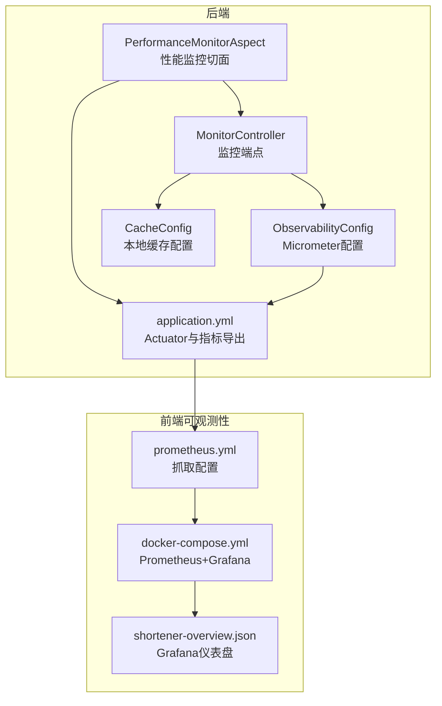
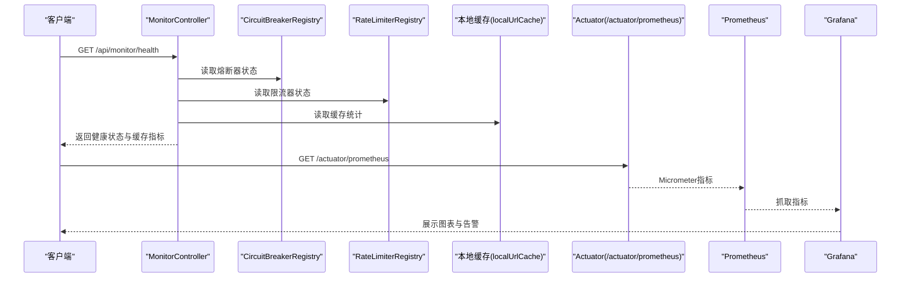
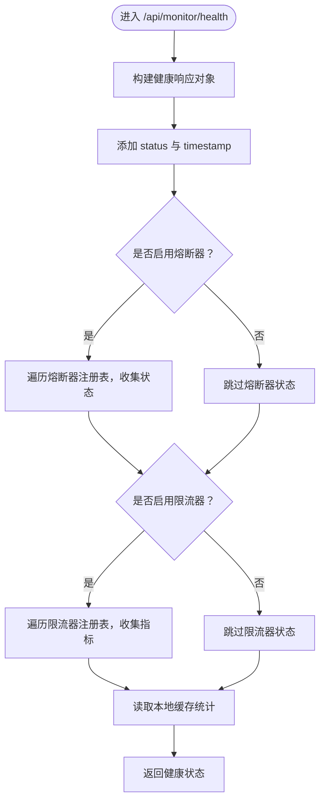
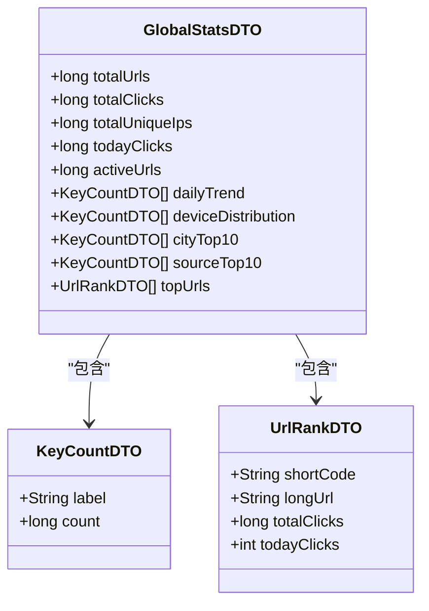
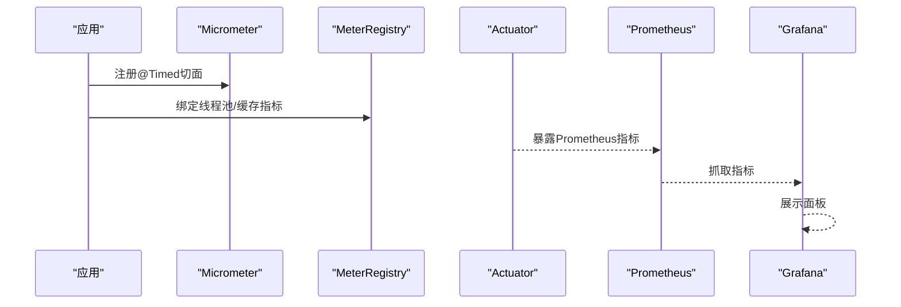
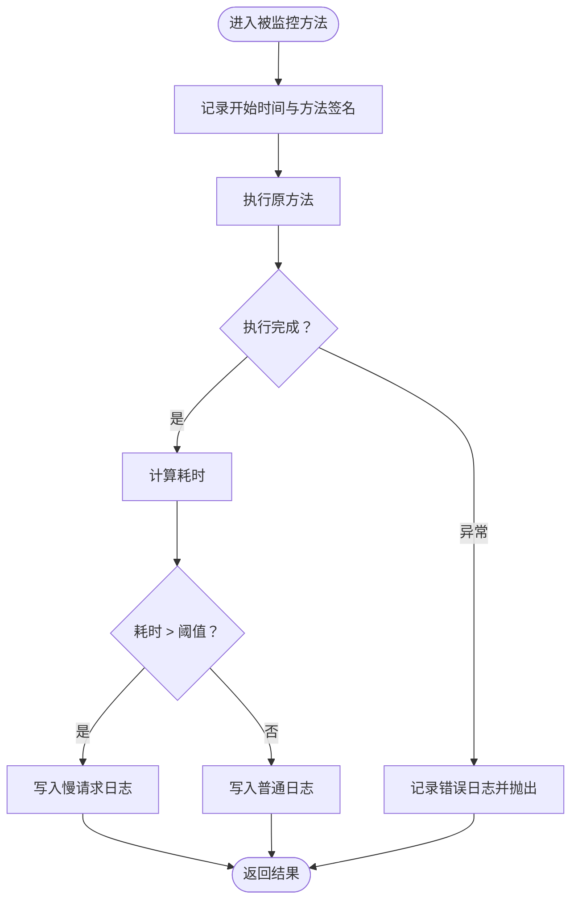
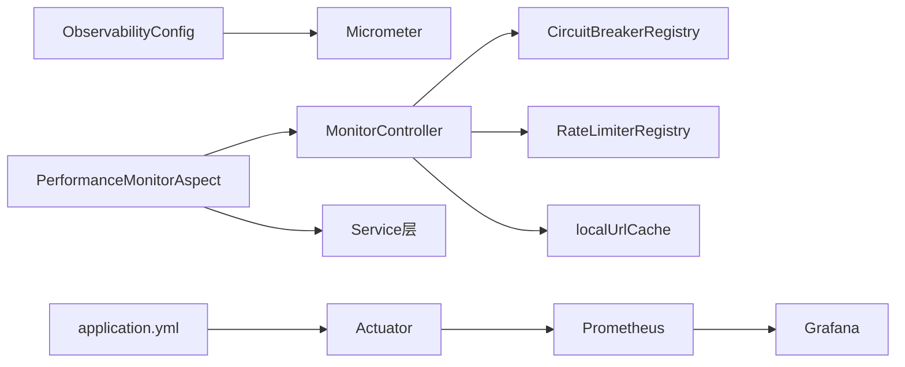

# 监控API

<cite>
**本文引用的文件**
- [MonitorController.java](file://src/main/java/com/layor/tinyflow/Controller/MonitorController.java)
- [GlobalStatsDTO.java](file://src/main/java/com/layor/tinyflow/entity/GlobalStatsDTO.java)
- [KeyCountDTO.java](file://src/main/java/com/layor/tinyflow/entity/KeyCountDTO.java)
- [UrlRankDTO.java](file://src/main/java/com/layor/tinyflow/entity/UrlRankDTO.java)
- [ObservabilityConfig.java](file://src/main/java/com/layor/tinyflow/config/ObservabilityConfig.java)
- [PerformanceMonitorAspect.java](file://src/main/java/com/layor/tinyflow/aspect/PerformanceMonitorAspect.java)
- [CacheConfig.java](file://src/main/java/com/layor/tinyflow/config/CacheConfig.java)
- [application.yml](file://src/main/resources/application.yml)
- [prometheus.yml](file://web/infra/observability/prometheus.yml)
- [docker-compose.yml](file://web/infra/observability/docker-compose.yml)
- [shortener-overview.json](file://web/infra/observability/dashboards/shortener-overview.json)
- [OBSERVABILITY.md](file://OBSERVABILITY.md)
- [ShortUrlService.java](file://src/main/java/com/layor/tinyflow/service/ShortUrlService.java)
</cite>

## 目录
1. [简介](#简介)
2. [项目结构](#项目结构)
3. [核心组件](#核心组件)
4. [架构总览](#架构总览)
5. [详细组件分析](#详细组件分析)
6. [依赖关系分析](#依赖关系分析)
7. [性能考量](#性能考量)
8. [故障排查指南](#故障排查指南)
9. [结论](#结论)
10. [附录](#附录)

## 简介
本文件围绕TinyFlow的系统监控与健康检查能力展开，重点覆盖以下目标：
- 解释`/api/monitor/system`与`/api/monitor/health`两个端点的设计意图与返回结构，明确其与前端监控页面的对接关系。
- 说明监控指标如何通过Micrometer与Prometheus暴露，以及与Grafana的可视化联动。
- 阐述AOP切面如何自动采集Controller与Service层的执行耗时，支撑性能分析。
- 提供运维与可观测性实践建议，包括Actuator端点、熔断器与限流器状态、缓存命中率等。

## 项目结构
监控相关代码主要分布在后端控制器、配置与切面层，同时结合前端可观测性基础设施（Prometheus与Grafana）共同构成完整的监控体系。

图表来源
- [MonitorController.java](file://src/main/java/com/layor/tinyflow/Controller/MonitorController.java#L1-L114)
- [ObservabilityConfig.java](file://src/main/java/com/layor/tinyflow/config/ObservabilityConfig.java#L1-L60)
- [PerformanceMonitorAspect.java](file://src/main/java/com/layor/tinyflow/aspect/PerformanceMonitorAspect.java#L1-L64)
- [CacheConfig.java](file://src/main/java/com/layor/tinyflow/config/CacheConfig.java#L1-L19)
- [application.yml](file://src/main/resources/application.yml#L88-L132)
- [prometheus.yml](file://web/infra/observability/prometheus.yml#L1-L9)
- [docker-compose.yml](file://web/infra/observability/docker-compose.yml#L1-L21)
- [shortener-overview.json](file://web/infra/observability/dashboards/shortener-overview.json#L1-L55)

章节来源
- [MonitorController.java](file://src/main/java/com/layor/tinyflow/Controller/MonitorController.java#L1-L114)
- [application.yml](file://src/main/resources/application.yml#L88-L132)

## 核心组件
- 监控控制器：提供系统健康状态、缓存统计与清空等端点，便于运维快速掌握系统运行状况。
- 观测性配置：启用Micrometer的@Timed切面与线程池、缓存指标绑定，统一暴露到Actuator。
- 性能监控切面：以AOP方式对Controller与Service层方法进行耗时统计，输出慢请求日志，辅助定位性能瓶颈。
- 缓存配置：本地Caffeine缓存开启统计，配合Micrometer导出命中率等指标。
- 应用配置：Actuator暴露Prometheus指标端点，Prometheus按配置抓取，Grafana可视化。

章节来源
- [MonitorController.java](file://src/main/java/com/layor/tinyflow/Controller/MonitorController.java#L1-L114)
- [ObservabilityConfig.java](file://src/main/java/com/layor/tinyflow/config/ObservabilityConfig.java#L1-L60)
- [PerformanceMonitorAspect.java](file://src/main/java/com/layor/tinyflow/aspect/PerformanceMonitorAspect.java#L1-L64)
- [CacheConfig.java](file://src/main/java/com/layor/tinyflow/config/CacheConfig.java#L1-L19)
- [application.yml](file://src/main/resources/application.yml#L88-L132)

## 架构总览
下图展示了监控API在系统中的位置与数据流向，以及与可观测性栈的集成关系。

图表来源
- [MonitorController.java](file://src/main/java/com/layor/tinyflow/Controller/MonitorController.java#L34-L75)
- [ObservabilityConfig.java](file://src/main/java/com/layor/tinyflow/config/ObservabilityConfig.java#L18-L59)
- [application.yml](file://src/main/resources/application.yml#L88-L132)
- [prometheus.yml](file://web/infra/observability/prometheus.yml#L1-L9)
- [docker-compose.yml](file://web/infra/observability/docker-compose.yml#L1-L21)

## 详细组件分析

### 监控端点：/api/monitor/health
- 功能概述
  - 返回系统健康状态，包含服务存活标识、时间戳、熔断器状态、限流器状态与本地缓存统计。
  - 便于运维快速判断系统整体健康度与关键依赖的可用性。
- 关键返回字段
  - status：服务状态（如UP）。
  - timestamp：当前时间戳。
  - circuitBreakers：各熔断器名称与状态。
  - rateLimiters：各限流器名称与可用权限、等待线程数等。
  - caffeineCache：缓存命中/缺失计数、命中率、淘汰次数、缓存大小等。
- 实现要点
  - 通过注入的CircuitBreakerRegistry与RateLimiterRegistry读取运行时状态。
  - 通过本地缓存的stats()获取命中率等指标，估算缓存规模。
- 与前端监控页面的关系
  - 健康检查结果可直接用于监控页的状态卡片与告警联动。

图表来源
- [MonitorController.java](file://src/main/java/com/layor/tinyflow/Controller/MonitorController.java#L34-L75)

章节来源
- [MonitorController.java](file://src/main/java/com/layor/tinyflow/Controller/MonitorController.java#L34-L75)

### 监控端点：/api/monitor/cache/stats 与 /api/monitor/cache/clear
- /api/monitor/cache/stats
  - 返回更详细的缓存统计，包括命中/缺失计数、加载成功/失败次数、总加载时间、平均加载惩罚、淘汰次数与权重、命中/缺失比率、缓存规模等。
- /api/monitor/cache/clear
  - 清空本地缓存并返回清理结果（成功标志、移除条目数、提示信息），便于在缓存异常或需要强制刷新时使用。

章节来源
- [MonitorController.java](file://src/main/java/com/layor/tinyflow/Controller/MonitorController.java#L77-L114)

### 全局统计DTO：GlobalStatsDTO
- 用途
  - 作为系统全局统计的数据载体，用于监控页面展示。
- 字段说明
  - 基础汇总：总短链数、总点击数、总独立访客、今日点击、活跃短链数。
  - 趋势数据：日趋势列表。
  - 分布数据：设备分布、城市Top10、来源Top10。
  - 排行榜：热门短链Top10。
- 与监控页面的关系
  - 该DTO用于承载MonitorPage所需的关键指标，便于前端聚合展示。

图表来源
- [GlobalStatsDTO.java](file://src/main/java/com/layor/tinyflow/entity/GlobalStatsDTO.java#L1-L34)
- [KeyCountDTO.java](file://src/main/java/com/layor/tinyflow/entity/KeyCountDTO.java#L1-L11)
- [UrlRankDTO.java](file://src/main/java/com/layor/tinyflow/entity/UrlRankDTO.java#L1-L19)

章节来源
- [GlobalStatsDTO.java](file://src/main/java/com/layor/tinyflow/entity/GlobalStatsDTO.java#L1-L34)
- [KeyCountDTO.java](file://src/main/java/com/layor/tinyflow/entity/KeyCountDTO.java#L1-L11)
- [UrlRankDTO.java](file://src/main/java/com/layor/tinyflow/entity/UrlRankDTO.java#L1-L19)

### 观测性配置：Micrometer与Prometheus
- @Timed切面
  - 通过ObservabilityConfig启用@TimedAspect，为标注了@Timed的方法自动生成指标，便于按方法维度观察性能。
- 线程池指标
  - 当存在ThreadPoolTaskExecutor时，自动注册线程池指标，标记类型为async，便于区分异步任务的负载情况。
- 缓存指标
  - 将本地缓存绑定到MeterRegistry，命名为localUrlCache，标签为cache=l1，导出命中率、加载耗时等指标。
- Actuator暴露
  - application.yml中启用/actuator/prometheus端点，暴露Micrometer指标给Prometheus抓取。
- Prometheus抓取
  - prometheus.yml配置job_name为tinyflow-backend，抓取路径为/actuator/prometheus，目标地址指向后端服务。
- Grafana可视化
  - docker-compose启动Prometheus与Grafana；shortener-overview.json定义了请求速率、延迟分位数、错误率等面板表达式，便于实时监控。

图表来源
- [ObservabilityConfig.java](file://src/main/java/com/layor/tinyflow/config/ObservabilityConfig.java#L18-L59)
- [application.yml](file://src/main/resources/application.yml#L88-L132)
- [prometheus.yml](file://web/infra/observability/prometheus.yml#L1-L9)
- [docker-compose.yml](file://web/infra/observability/docker-compose.yml#L1-L21)
- [shortener-overview.json](file://web/infra/observability/dashboards/shortener-overview.json#L1-L55)

章节来源
- [ObservabilityConfig.java](file://src/main/java/com/layor/tinyflow/config/ObservabilityConfig.java#L1-L60)
- [application.yml](file://src/main/resources/application.yml#L88-L132)
- [prometheus.yml](file://web/infra/observability/prometheus.yml#L1-L9)
- [docker-compose.yml](file://web/infra/observability/docker-compose.yml#L1-L21)
- [shortener-overview.json](file://web/infra/observability/dashboards/shortener-overview.json#L1-L55)

### 性能监控切面：AOP自动记录执行时间
- 监控范围
  - 对Controller与Service包下的所有方法进行环绕监控。
- 采集逻辑
  - 记录方法签名与开始时间，执行后计算耗时；超过阈值（默认100ms）输出慢请求日志；异常时记录错误日志并抛出。
- 输出日志
  - 慢请求写入performance.log，便于后续分析与告警。
- 与Micrometer的互补
  - 切面关注“单次调用耗时”，Micrometer关注“指标直方图与分位数”，二者结合可从不同维度审视性能。

图表来源
- [PerformanceMonitorAspect.java](file://src/main/java/com/layor/tinyflow/aspect/PerformanceMonitorAspect.java#L1-L64)

章节来源
- [PerformanceMonitorAspect.java](file://src/main/java/com/layor/tinyflow/aspect/PerformanceMonitorAspect.java#L1-L64)

### 与全局统计API的关系
- 全局统计由服务层计算，返回GlobalStatsDTO，用于监控页面展示。
- 监控端点health则提供系统级健康与缓存状态，二者互补：前者面向业务指标，后者面向系统健康度。

章节来源
- [ShortUrlService.java](file://src/main/java/com/layor/tinyflow/service/ShortUrlService.java#L596-L614)
- [GlobalStatsDTO.java](file://src/main/java/com/layor/tinyflow/entity/GlobalStatsDTO.java#L1-L34)

## 依赖关系分析
- 组件耦合
  - MonitorController依赖CircuitBreakerRegistry、RateLimiterRegistry与本地缓存，耦合度较低，职责清晰。
  - ObservabilityConfig通过条件化装配与指标绑定，避免不必要的开销。
  - PerformanceMonitorAspect通过AOP横切Controller与Service，无侵入地提供性能观测。
- 外部依赖
  - Micrometer与Prometheus负责指标采集与持久化。
  - Grafana负责可视化与告警。
- 潜在风险
  - 若熔断器/限流器未启用，MonitorController会跳过对应字段，需确保配置正确。
  - 缓存统计依赖recordStats开关，需确保application.yml中已开启。

图表来源
- [MonitorController.java](file://src/main/java/com/layor/tinyflow/Controller/MonitorController.java#L1-L114)
- [ObservabilityConfig.java](file://src/main/java/com/layor/tinyflow/config/ObservabilityConfig.java#L1-L60)
- [PerformanceMonitorAspect.java](file://src/main/java/com/layor/tinyflow/aspect/PerformanceMonitorAspect.java#L1-L64)
- [application.yml](file://src/main/resources/application.yml#L88-L132)
- [prometheus.yml](file://web/infra/observability/prometheus.yml#L1-L9)
- [docker-compose.yml](file://web/infra/observability/docker-compose.yml#L1-L21)

章节来源
- [MonitorController.java](file://src/main/java/com/layor/tinyflow/Controller/MonitorController.java#L1-L114)
- [ObservabilityConfig.java](file://src/main/java/com/layor/tinyflow/config/ObservabilityConfig.java#L1-L60)
- [PerformanceMonitorAspect.java](file://src/main/java/com/layor/tinyflow/aspect/PerformanceMonitorAspect.java#L1-L64)
- [application.yml](file://src/main/resources/application.yml#L88-L132)

## 性能考量
- 指标粒度
  - Micrometer提供HTTP请求计数、延迟直方图与分位数，适合评估整体性能与SLA达标情况。
  - AOP切面补充单次调用耗时，便于定位热点方法与异常慢调用。
- 缓存命中率
  - 通过MonitorController的health与cache/stats端点，以及Micrometer导出的缓存指标，持续监控命中率变化，及时调整缓存策略。
- 熔断与限流
  - 健康端点展示熔断器与限流器状态，有助于在高负载或下游异常时快速识别问题根因。
- 日志与告警
  - performance.log记录慢请求，结合Grafana告警规则，可实现自动化预警与处置。

[本节为通用性能讨论，无需列出具体文件来源]

## 故障排查指南
- 健康端点返回为空或缺少字段
  - 检查application.yml中Actuator暴露的端点是否包含prometheus、circuitbreakers、ratelimiters。
  - 确认ObservabilityConfig已启用@Timed切面与缓存指标绑定。
- 缓存命中率异常
  - 使用/cache/stats查看命中/缺失计数与命中率；必要时执行/cache/clear验证缓存行为。
  - 检查CacheConfig中的缓存规格与recordStats开关。
- 指标未出现在Prometheus/Grafana
  - 确认Prometheus抓取配置与目标地址正确；检查容器网络与端口映射。
  - 在Grafana中核对数据源连接与查询表达式。
- 慢请求日志缺失
  - 检查PerformanceMonitorAspect的阈值设置与日志级别；确认日志文件路径与轮转策略。

章节来源
- [application.yml](file://src/main/resources/application.yml#L88-L132)
- [ObservabilityConfig.java](file://src/main/java/com/layor/tinyflow/config/ObservabilityConfig.java#L1-L60)
- [MonitorController.java](file://src/main/java/com/layor/tinyflow/Controller/MonitorController.java#L77-L114)
- [CacheConfig.java](file://src/main/java/com/layor/tinyflow/config/CacheConfig.java#L1-L19)
- [prometheus.yml](file://web/infra/observability/prometheus.yml#L1-L9)
- [docker-compose.yml](file://web/infra/observability/docker-compose.yml#L1-L21)
- [PerformanceMonitorAspect.java](file://src/main/java/com/layor/tinyflow/aspect/PerformanceMonitorAspect.java#L1-L64)

## 结论
- /api/monitor/health提供了系统级健康快照，结合熔断器、限流器与缓存指标，帮助运维快速定位问题。
- Micrometer与Prometheus/Grafana形成闭环，既可观察整体性能，又可聚焦单次调用耗时。
- AOP切面与服务层统计相辅相成，既能满足宏观SLA监控，也能支撑微观性能优化。
- 建议在生产环境持续监控命中率、错误率与延迟分位数，结合告警策略实现主动运维。

[本节为总结性内容，无需列出具体文件来源]

## 附录
- 使用示例与参考文档
  - 参考OBSERVABILITY.md中的使用示例与端点说明，了解如何调用监控端点与查看Prometheus指标。
  - Grafana仪表盘示例可直接导入shortener-overview.json，快速搭建监控看板。

章节来源
- [OBSERVABILITY.md](file://OBSERVABILITY.md#L1-L257)
- [shortener-overview.json](file://web/infra/observability/dashboards/shortener-overview.json#L1-L55)