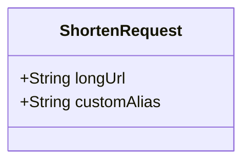
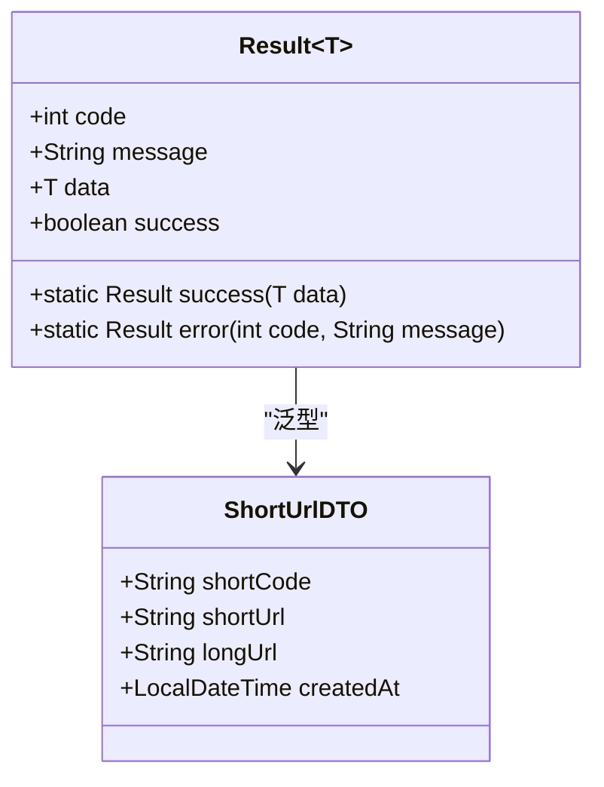
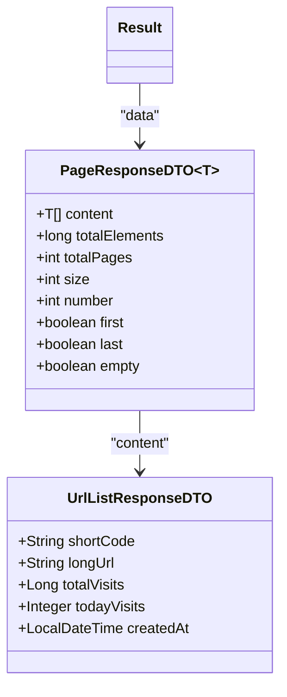
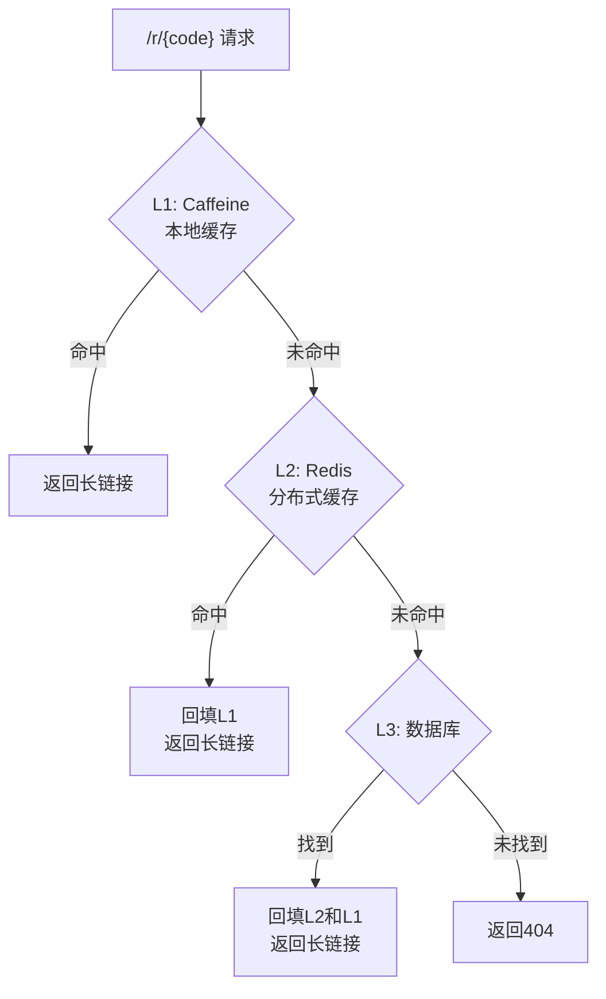
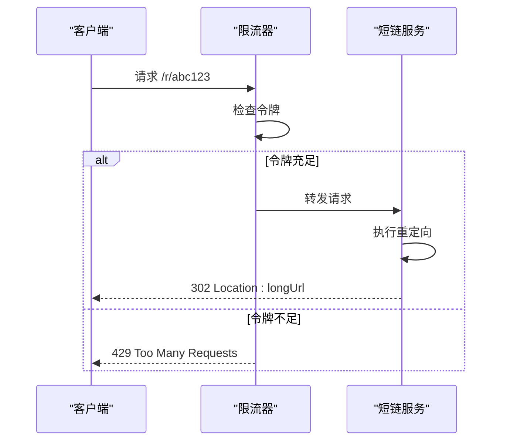
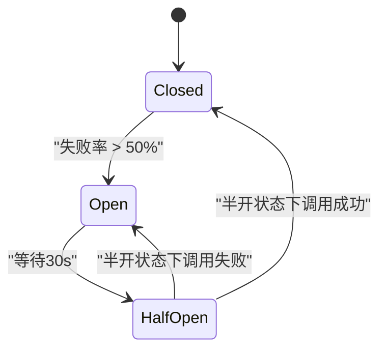
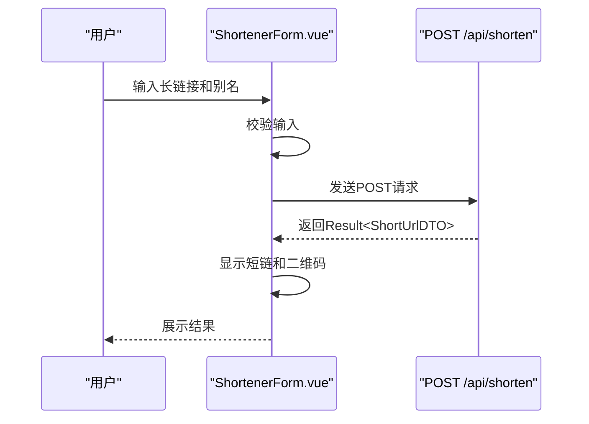

# 短链API

<cite>
**本文档引用文件**  
- [ShortUrlController.java](file://src/main/java/com/layor/tinyflow/Controller/ShortUrlController.java)
- [ShortenRequest.java](file://src/main/java/com/layor/tinyflow/entity/ShortenRequest.java)
- [ShortUrlDTO.java](file://src/main/java/com/layor/tinyflow/entity/ShortUrlDTO.java)
- [UrlListResponseDTO.java](file://src/main/java/com/layor/tinyflow/entity/UrlListResponseDTO.java)
- [Result.java](file://src/main/java/com/layor/tinyflow/entity/Result.java)
- [ShortUrlService.java](file://src/main/java/com/layor/tinyflow/service/ShortUrlService.java)
- [shortener-core.md](file://web/docs/shortener-core.md)
- [ShortenerForm.vue](file://web/src/components/ShortenerForm.vue)
- [application.yml](file://src/main/resources/application.yml)
</cite>

## 目录
1. [简介](#简介)
2. [核心API端点](#核心api端点)
3. [请求与响应结构](#请求与响应结构)
4. [短码生成与缓存机制](#短码生成与缓存机制)
5. [限流与高可用策略](#限流与高可用策略)
6. [前端集成示例](#前端集成示例)
7. [错误模型与状态码](#错误模型与状态码)

## 简介
TinyFlow短链服务提供高并发、高可用的短链创建与跳转功能。本API文档详细说明了`ShortUrlController`中实现的核心端点，包括短链创建、列表获取和跳转重定向。系统结合了本地缓存（Caffeine）、分布式缓存（Redis）和熔断降级机制，确保在高负载下的稳定性和低延迟。

**Section sources**
- [shortener-core.md](file://web/docs/shortener-core.md#L1-L155)

## 核心API端点

### 创建短链（POST /api/shorten）
用于将长链接转换为短链接。

- **HTTP方法**: `POST`
- **URL路径**: `/api/shorten`
- **请求头**: `Content-Type: application/json;charset=utf-8`
- **成功响应**: HTTP 200
- **失败响应**: 400（参数错误）、409（别名冲突）、500（服务器错误）

### 获取短链列表（GET /api/urls）
获取当前用户创建的所有短链及其统计信息。

- **HTTP方法**: `GET`
- **URL路径**: `/api/urls`
- **分页参数**: 支持标准分页（page, size）
- **成功响应**: HTTP 200
- **失败响应**: 500（服务器错误）

### 短链跳转（GET /r/{code}）
通过短码进行302重定向到原始长链接。

- **HTTP方法**: `GET`
- **URL路径**: `/r/{code}`
- **行为**: 302重定向，设置`Location`头
- **成功响应**: HTTP 302
- **失败响应**: 404（未找到）、429（限流）

**Section sources**
- [ShortUrlController.java](file://src/main/java/com/layor/tinyflow/Controller/ShortUrlController.java#L24-L81)

## 请求与响应结构

### 请求体结构（ShortenRequest）
| 字段名 | 类型 | 是否必填 | 说明 |
|--------|------|----------|------|
| longUrl | string | 是 | 原始长链接，必须以http://或https://开头 |
| customAlias | string | 否 | 自定义短码，支持中文，若已存在则返回409冲突 |



**Diagram sources**
- [ShortenRequest.java](file://src/main/java/com/layor/tinyflow/entity/ShortenRequest.java#L8-L17)

### 响应体结构
#### 创建短链响应（Result<ShortUrlDTO>）



**Diagram sources**
- [Result.java](file://src/main/java/com/layor/tinyflow/entity/Result.java#L11-L34)
- [ShortUrlDTO.java](file://src/main/java/com/layor/tinyflow/entity/ShortUrlDTO.java#L11-L16)

#### 获取短链列表响应（Result<PageResponseDTO<UrlListResponseDTO>>）



**Diagram sources**
- [UrlListResponseDTO.java](file://src/main/java/com/layor/tinyflow/entity/UrlListResponseDTO.java#L10-L17)
- [PageResponseDTO.java](file://src/main/java/com/layor/tinyflow/entity/PageResponseDTO.java)

**Section sources**
- [ShortUrlController.java](file://src/main/java/com/layor/tinyflow/Controller/ShortUrlController.java#L46-L68)

## 短码生成与缓存机制

### 短码生成策略
- **自定义优先**: 用户可指定`customAlias`，系统会校验其唯一性。
- **自动生成**: 若未指定别名，使用`HashidsStrategy`基于ID生成6位Base62短码。
- **冲突处理**: 生成时检查数据库，若冲突则重试最多3次，失败则抛出异常。

### 多级缓存架构
系统采用L1-L2-L3三级缓存架构，显著提升读取性能：



**Diagram sources**
- [ShortUrlService.java](file://src/main/java/com/layor/tinyflow/service/ShortUrlService.java#L304-L353)
- [CacheConfig.java](file://src/main/java/com/layor/tinyflow/config/CacheConfig.java)

**Section sources**
- [shortener-core.md](file://web/docs/shortener-core.md#L82-L90)
- [application.yml](file://src/main/resources/application.yml#L141-L147)

## 限流与高可用策略

### IP维度限流
`/r/{code}`端点应用了令牌桶限流，防止恶意刷量。



**Diagram sources**
- [ShortUrlService.java](file://src/main/java/com/layor/tinyflow/service/ShortUrlService.java#L288-L290)
- [application.yml](file://src/main/resources/application.yml#L149-L155)

### 熔断与降级
当Redis服务不可用时，系统自动降级到数据库查询，保证核心功能可用。



**Diagram sources**
- [ShortUrlService.java](file://src/main/java/com/layor/tinyflow/service/ShortUrlService.java#L302-L304)
- [application.yml](file://src/main/resources/application.yml#L156-L176)

**Section sources**
- [shortener-core.md](file://web/docs/shortener-core.md#L93-L97)

## 前端集成示例

### curl命令示例
创建一个带自定义别名的短链：

```bash
curl -X POST http://localhost:8080/api/shorten \
  -H "Content-Type: application/json;charset=utf-8" \
  -d '{
    "longUrl": "https://www.example.com",
    "customAlias": "我的短链"
  }'
```

### 前端组件调用
`ShortenerForm.vue`组件通过axios调用API：



**Diagram sources**
- [ShortenerForm.vue](file://web/src/components/ShortenerForm.vue#L107-L125)

**Section sources**
- [ShortenerForm.vue](file://web/src/components/ShortenerForm.vue)

## 错误模型与状态码

### HTTP状态码
| 状态码 | 含义 | 说明 |
|--------|------|------|
| 200 | OK | 请求成功 |
| 302 | Found | 重定向到长链接 |
| 400 | Bad Request | 参数错误 |
| 404 | Not Found | 短码不存在 |
| 409 | Conflict | 自定义别名冲突 |
| 429 | Too Many Requests | 超过限流阈值 |
| 500 | Internal Server Error | 服务器内部错误 |

### 通用错误模型
```json
{
  "code": 1,
  "message": "自定义别名已存在",
  "success": false,
  "data": null
}
```

**Section sources**
- [shortener-core.md](file://web/docs/shortener-core.md#L70-L78)
- [Result.java](file://src/main/java/com/layor/tinyflow/entity/Result.java)