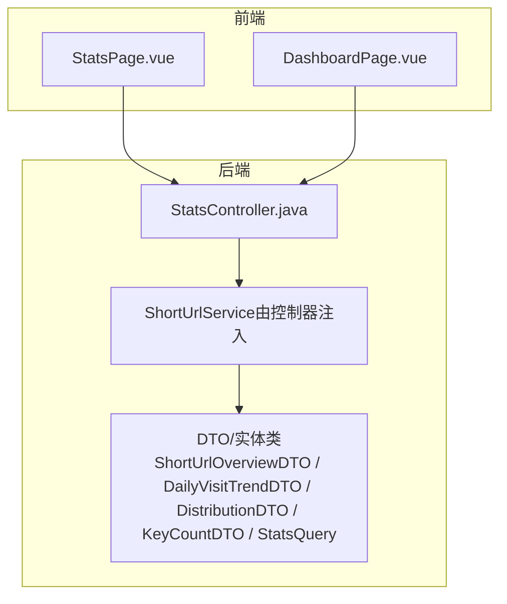
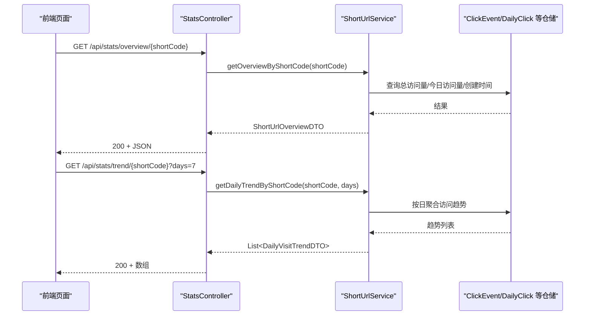
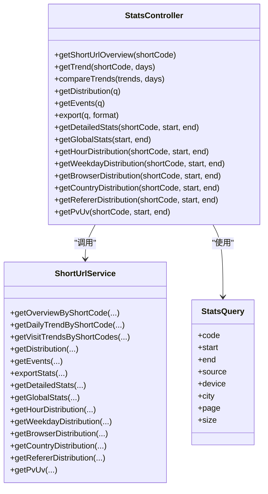

# 统计API

<cite>
**本文引用的文件**
- [StatsController.java](file://src/main/java/com/layor/tinyflow/Controller/StatsController.java)
- [StatsQuery.java](file://src/main/java/com/layor/tinyflow/dto/StatsQuery.java)
- [ShortUrlOverviewDTO.java](file://src/main/java/com/layor/tinyflow/entity/ShortUrlOverviewDTO.java)
- [DailyVisitTrendDTO.java](file://src/main/java/com/layor/tinyflow/entity/DailyVisitTrendDTO.java)
- [DistributionDTO.java](file://src/main/java/com/layor/tinyflow/entity/DistributionDTO.java)
- [KeyCountDTO.java](file://src/main/java/com/layor/tinyflow/entity/KeyCountDTO.java)
- [StatsControllerTest.java](file://src/test/java/com/layor/tinyflow/Controller/StatsControllerTest.java)
- [statistics-api.md](file://web/docs/statistics-api.md)
- [StatsPage.vue](file://web/src/pages/StatsPage.vue)
- [DashboardPage.vue](file://web/src/pages/DashboardPage.vue)
- [application.yml](file://src/main/resources/application.yml)
</cite>

## 目录
1. [简介](#简介)
2. [项目结构](#项目结构)
3. [核心组件](#核心组件)
4. [架构总览](#架构总览)
5. [详细组件分析](#详细组件分析)
6. [依赖关系分析](#依赖关系分析)
7. [性能考量](#性能考量)
8. [故障排查指南](#故障排查指南)
9. [结论](#结论)
10. [附录](#附录)

## 简介
本文件为 TinyFlow 的统计分析 API 文档，聚焦于后端控制器 StatsController 中与前端 StatsPage.vue 和 DashboardPage.vue 直接对接的统计接口。文档严格依据仓库中的接口定义与前端消费方式，明确各接口的路径参数、查询参数、请求体参数、响应数据结构、HTTP 状态码以及鉴权要求，并给出 curl 示例与性能优化建议。

## 项目结构
- 后端控制器位于 Controller 层，负责接收前端请求并调用服务层获取统计结果。
- DTO 与实体类定义了统一的响应数据结构，确保前后端契约稳定。
- 前端页面通过 axios 发起请求，消费后端返回的数据并渲染图表与表格。

**图表来源**
- [StatsController.java](file://src/main/java/com/layor/tinyflow/Controller/StatsController.java#L1-L180)
- [StatsPage.vue](file://web/src/pages/StatsPage.vue#L388-L486)
- [DashboardPage.vue](file://web/src/pages/DashboardPage.vue#L282-L373)

**章节来源**
- [StatsController.java](file://src/main/java/com/layor/tinyflow/Controller/StatsController.java#L1-L180)
- [StatsQuery.java](file://src/main/java/com/layor/tinyflow/dto/StatsQuery.java#L1-L16)
- [ShortUrlOverviewDTO.java](file://src/main/java/com/layor/tinyflow/entity/ShortUrlOverviewDTO.java#L1-L17)
- [DailyVisitTrendDTO.java](file://src/main/java/com/layor/tinyflow/entity/DailyVisitTrendDTO.java#L1-L10)
- [DistributionDTO.java](file://src/main/java/com/layor/tinyflow/entity/DistributionDTO.java#L1-L14)
- [KeyCountDTO.java](file://src/main/java/com/layor/tinyflow/entity/KeyCountDTO.java#L1-L11)

## 核心组件
- StatsController：提供统计相关 REST 接口，包括概览、趋势、分布、事件、导出、全局统计、多短码对比等。
- StatsQuery：作为 POST 接口的请求体参数载体，封装 code、start、end、source、device、city、page、size 等筛选条件。
- DTO 实体：统一响应结构，如 ShortUrlOverviewDTO、DailyVisitTrendDTO、DistributionDTO、KeyCountDTO。

**章节来源**
- [StatsController.java](file://src/main/java/com/layor/tinyflow/Controller/StatsController.java#L1-L180)
- [StatsQuery.java](file://src/main/java/com/layor/tinyflow/dto/StatsQuery.java#L1-L16)
- [ShortUrlOverviewDTO.java](file://src/main/java/com/layor/tinyflow/entity/ShortUrlOverviewDTO.java#L1-L17)
- [DailyVisitTrendDTO.java](file://src/main/java/com/layor/tinyflow/entity/DailyVisitTrendDTO.java#L1-L10)
- [DistributionDTO.java](file://src/main/java/com/layor/tinyflow/entity/DistributionDTO.java#L1-L14)
- [KeyCountDTO.java](file://src/main/java/com/layor/tinyflow/entity/KeyCountDTO.java#L1-L11)

## 架构总览
后端通过 StatsController 提供统计接口，前端页面通过 axios 调用这些接口，解析响应并在图表组件中渲染。控制器内部委托服务层完成数据聚合与查询。

**图表来源**
- [StatsController.java](file://src/main/java/com/layor/tinyflow/Controller/StatsController.java#L20-L33)
- [StatsControllerTest.java](file://src/test/java/com/layor/tinyflow/Controller/StatsControllerTest.java#L53-L108)

## 详细组件分析

### 接口清单与规范
以下接口均位于后端控制器中，遵循统一的响应风格与鉴权要求。前端页面通过 axios 调用，消费响应数据并渲染图表与表格。

- GET /api/stats/overview/{shortCode}
  - 用途：统计详情页顶部卡片展示的核心指标（总访问量、今日访问量、创建时间）。
  - 路径参数：shortCode（短码标识，URL 编码）。
  - 响应：ShortUrlOverviewDTO。
  - 状态码：200 成功；404 短码不存在；403 当前用户无权查看该短码统计。
  - curl 示例：参见“附录”的 curl 示例。

- GET /api/stats/trend/{shortCode}
  - 用途：统计详情页折线图，默认最近 7 天。
  - 路径参数：shortCode。
  - 查询参数：days（默认 7，建议支持 7/14/30/90）。
  - 响应：List<DailyVisitTrendDTO>，元素包含 date（YYYY-MM-DD）与 visits。
  - 状态码：200 成功；404 短码不存在；403 无权限。
  - curl 示例：参见“附录”。

- GET /api/stats/distribution/{shortCode}
  - 用途：设备、地域、来源等维度分布（柱状/水平条/简化饼图）。
  - 路径参数：shortCode。
  - 响应：DistributionDTO，包含 device、city、referer 三个维度的列表，元素为 KeyCountDTO（label、count）。
  - 状态码：200 成功；404 短码不存在；403 无权限。
  - curl 示例：参见“附录”。

- GET /api/stats/compare
  - 用途：看板页左侧多折线对比，前端通过勾选多短码调用此接口。
  - 查询参数：trends（逗号分隔的短码列表，如 demo123,abC9）、days（默认 7）。
  - 响应：Map<String, List<DailyVisitTrendDTO>>，以短码为 key，值为其趋势数组。
  - 状态码：200 成功；400 参数错误（如 trends 为空）；404 短码不存在；403 无权限。
  - curl 示例：参见“附录”。

- POST /api/stats/distribution
  - 用途：带筛选条件的分布数据查询（设备、地域、来源等）。
  - 请求体：StatsQuery（code、start、end、source、device、city、page、size）。
  - 响应：DistributionDTO。
  - 状态码：200 成功；400 参数错误；404 短码不存在；403 无权限。
  - curl 示例：参见“附录”。

- POST /api/stats/events
  - 用途：点击事件详情列表（支持分页与筛选）。
  - 请求体：StatsQuery（code、start、end、source、device、city、page、size）。
  - 响应：List<ClickEventDTO>。
  - 状态码：200 成功；400 参数错误；404 短码不存在；403 无权限。
  - curl 示例：参见“附录”。

- POST /api/stats/export
  - 用途：导出点击事件明细（CSV/JSON）。
  - 请求体：StatsQuery（code、start、end、source、device、city、page、size）。
  - 查询参数：format（默认 csv，支持 csv/json）。
  - 响应：二进制流（Content-Type 根据 format 设置），Content-Disposition 为附件下载。
  - 状态码：200 成功；400 参数错误；404 短码不存在；403 无权限。
  - curl 示例：参见“附录”。

- GET /api/stats/detailed/{shortCode}
  - 用途：详细统计数据（包含所有维度，如小时分布、星期分布、设备/浏览器/城市/国家/来源/Referer 等）。
  - 路径参数：shortCode。
  - 查询参数：start、end（可选）。
  - 响应：DetailedStatsDTO（字段包含 pv、uv、pvUvRatio、各分布数组等）。
  - 状态码：200 成功；404 短码不存在；403 无权限。
  - curl 示例：参见“附录”。

- GET /api/stats/global
  - 用途：全局统计数据（总短链数、总点击、独立访客、今日点击、活跃短链、每日趋势、设备分布、城市/来源 Top10、热门短链等）。
  - 查询参数：start、end（可选）。
  - 响应：GlobalStatsDTO（字段包含上述指标与数组）。
  - 状态码：200 成功；400 参数错误；404 短码不存在；403 无权限。
  - curl 示例：参见“附录”。

- GET /api/stats/hour/{shortCode}
  - 用途：24 小时分布。
  - 路径参数：shortCode。
  - 查询参数：start、end（可选）。
  - 响应：List<KeyCountDTO>。
  - 状态码：200 成功；404 短码不存在；403 无权限。
  - curl 示例：参见“附录”。

- GET /api/stats/weekday/{shortCode}
  - 用途：星期分布。
  - 路径参数：shortCode。
  - 查询参数：start、end（可选）。
  - 响应：List<KeyCountDTO>。
  - 状态码：200 成功；404 短码不存在；403 无权限。
  - curl 示例：参见“附录”。

- GET /api/stats/browser/{shortCode}
  - 用途：浏览器分布。
  - 路径参数：shortCode。
  - 查询参数：start、end（可选）。
  - 响应：List<KeyCountDTO>。
  - 状态码：200 成功；404 短码不存在；403 无权限。
  - curl 示例：参见“附录”。

- GET /api/stats/country/{shortCode}
  - 用途：国家/地区分布。
  - 路径参数：shortCode。
  - 查询参数：start、end（可选）。
  - 响应：List<KeyCountDTO>。
  - 状态码：200 成功；404 短码不存在；403 无权限。
  - curl 示例：参见“附录”。

- GET /api/stats/referer/{shortCode}
  - 用途：Referer 详情。
  - 路径参数：shortCode。
  - 查询参数：start、end（可选）。
  - 响应：List<KeyCountDTO>。
  - 状态码：200 成功；404 短码不存在；403 无权限。
  - curl 示例：参见“附录”。

- GET /api/stats/pvuv/{shortCode}
  - 用途：返回 PV/UV 数据。
  - 路径参数：shortCode。
  - 查询参数：start、end（可选）。
  - 响应：Map<String, Long>，键为 "pv"、"uv"。
  - 状态码：200 成功；404 短码不存在；403 无权限。
  - curl 示例：参见“附录”。

**章节来源**
- [StatsController.java](file://src/main/java/com/layor/tinyflow/Controller/StatsController.java#L20-L178)
- [StatsControllerTest.java](file://src/test/java/com/layor/tinyflow/Controller/StatsControllerTest.java#L53-L483)
- [statistics-api.md](file://web/docs/statistics-api.md#L1-L185)

### 前端消费方式
- StatsPage.vue
  - 顶部卡片与核心指标：调用 /api/stats/overview/{shortCode} 与 /api/stats/detailed/{shortCode}。
  - 访问趋势：调用 /api/stats/trend/{shortCode}，支持 days 切换（7/14/30）。
  - 分布图表：调用 /api/stats/hour/{shortCode}、/api/stats/weekday/{shortCode}、/api/stats/browser/{shortCode}、/api/stats/country/{shortCode}、/api/stats/referer/{shortCode} 等。
  - 访问事件列表：POST /api/stats/events，携带 StatsQuery。
  - 导出：POST /api/stats/export，携带 StatsQuery 与 format。
- DashboardPage.vue
  - 全局统计概览：GET /api/stats/global。
  - 热门短链列表：GET /api/urls（分页参数 page、size，q 搜索关键字）。
  - 多短码对比：GET /api/stats/compare（trends、days）。

**章节来源**
- [StatsPage.vue](file://web/src/pages/StatsPage.vue#L388-L486)
- [DashboardPage.vue](file://web/src/pages/DashboardPage.vue#L282-L373)
- [statistics-api.md](file://web/docs/statistics-api.md#L22-L185)

### StatsQuery DTO 在查询参数处理中的作用
- StatsQuery 作为 POST 接口的统一请求体参数载体，封装 code、start、end、source、device、city、page、size 等筛选条件。
- 控制器在处理 POST /api/stats/distribution、POST /api/stats/events、POST /api/stats/export 时，直接从 StatsQuery 中读取字段，传递给服务层。
- 对于 GET /api/stats/compare，控制器使用 @RequestParam 接收 trends（逗号分隔）与 days（默认 7），随后拆分为短码列表并调用服务层。

**章节来源**
- [StatsQuery.java](file://src/main/java/com/layor/tinyflow/dto/StatsQuery.java#L1-L16)
- [StatsController.java](file://src/main/java/com/layor/tinyflow/Controller/StatsController.java#L35-L44)
- [StatsControllerTest.java](file://src/test/java/com/layor/tinyflow/Controller/StatsControllerTest.java#L131-L158)

### 响应数据结构
- ShortUrlOverviewDTO：totalVisits（long）、todayVisits（int）、createdAt（Instant/时间戳）。
- DailyVisitTrendDTO：date（String，YYYY-MM-DD）、visits（int）。
- DistributionDTO：referer（List<KeyCountDTO>）、device（List<KeyCountDTO>）、city（List<KeyCountDTO>）。
- KeyCountDTO：label（String）、count（long）。
- DetailedStatsDTO、GlobalStatsDTO、ClickEventDTO 等实体由服务层构造并返回，字段详见单元测试与实体定义。

**章节来源**
- [ShortUrlOverviewDTO.java](file://src/main/java/com/layor/tinyflow/entity/ShortUrlOverviewDTO.java#L1-L17)
- [DailyVisitTrendDTO.java](file://src/main/java/com/layor/tinyflow/entity/DailyVisitTrendDTO.java#L1-L10)
- [DistributionDTO.java](file://src/main/java/com/layor/tinyflow/entity/DistributionDTO.java#L1-L14)
- [KeyCountDTO.java](file://src/main/java/com/layor/tinyflow/entity/KeyCountDTO.java#L1-L11)
- [StatsControllerTest.java](file://src/test/java/com/layor/tinyflow/Controller/StatsControllerTest.java#L190-L248)

### HTTP 状态码与错误处理
- 通用状态码：
  - 200 OK：成功
  - 400 Bad Request：参数错误
  - 401 Unauthorized：未鉴权或令牌失效
  - 403 Forbidden：无权限访问该短码数据
  - 404 Not Found：资源不存在（短码不存在）
  - 500 Internal Server Error：服务器异常
- 特定接口：
  - /api/stats/compare：当 trends 为空时抛出参数错误（400）。
  - /api/stats/distribution、/api/stats/events、/api/stats/export：当 code 无效或无权限时返回 404/403。

**章节来源**
- [statistics-api.md](file://web/docs/statistics-api.md#L12-L19)
- [StatsControllerTest.java](file://src/test/java/com/layor/tinyflow/Controller/StatsControllerTest.java#L110-L129)

### 鉴权要求
- 文档建议使用 Authorization: Bearer <token> 进行鉴权（企业环境默认需要鉴权）。
- 前端页面在发起请求时应携带 Bearer Token，控制器会基于安全配置进行鉴权校验（具体实现由 Spring Security/JWT 过滤器负责）。

**章节来源**
- [statistics-api.md](file://web/docs/statistics-api.md#L8-L11)

## 依赖关系分析
- StatsController 依赖 ShortUrlService 完成统计计算与数据聚合。
- DTO/实体类在控制器与服务层之间传递，确保前后端契约一致。
- 前端页面通过 axios 调用后端接口，StatsPage.vue 与 DashboardPage.vue 分别消费不同接口集合。

**图表来源**
- [StatsController.java](file://src/main/java/com/layor/tinyflow/Controller/StatsController.java#L1-L178)
- [StatsQuery.java](file://src/main/java/com/layor/tinyflow/dto/StatsQuery.java#L1-L16)

**章节来源**
- [StatsController.java](file://src/main/java/com/layor/tinyflow/Controller/StatsController.java#L1-L178)
- [StatsQuery.java](file://src/main/java/com/layor/tinyflow/dto/StatsQuery.java#L1-L16)

## 性能考量
- 缓存策略：建议对趋势与分布数据按短码+天数维度缓存 1–5 分钟，降低查询成本。
- 速率限制：按 IP/用户维度做 rate limit，防止批量拉取导致压力。
- 分页：/api/urls 建议启用服务端分页与排序；返回总数以便前端渲染。
- 数据库与 Redis：应用配置中包含 Redis 与 Caffeine 缓存配置，可用于热点数据缓存与降载。

**章节来源**
- [statistics-api.md](file://web/docs/statistics-api.md#L164-L169)
- [application.yml](file://src/main/resources/application.yml#L141-L147)

## 故障排查指南
- 401/403：检查 Authorization 头是否正确设置 Bearer Token；确认当前用户拥有该短码的统计权限。
- 404：确认 shortCode 是否存在；确认查询的时间范围与筛选条件是否有效。
- 400：检查 /api/stats/compare 的 trends 参数是否为空；检查 POST 接口的 StatsQuery 字段是否完整。
- 响应格式不符：确认前端是否正确解析响应结构（如趋势数组、分布列表、事件列表）。

**章节来源**
- [statistics-api.md](file://web/docs/statistics-api.md#L12-L19)
- [StatsControllerTest.java](file://src/test/java/com/layor/tinyflow/Controller/StatsControllerTest.java#L110-L129)

## 结论
本文档基于仓库中的 StatsController 与前端页面实现，系统性梳理了统计分析 API 的接口规范、数据结构、鉴权要求与性能优化建议。前端通过 axios 直接消费这些接口，实现了概览、趋势、分布、事件与导出等功能。建议在企业环境中启用鉴权与缓存，并结合速率限制保障系统稳定性。

## 附录

### curl 示例
以下示例均携带 Authorization: Bearer <token>，请替换为实际令牌。

- 获取我的短链列表
  - curl -H "Authorization: Bearer <token>" "http://localhost:8080/api/urls?q=&page=1&pageSize=10&orderBy=&order="
- 获取短码概览
  - curl -H "Authorization: Bearer <token>" "http://localhost:8080/api/stats/overview/demo123"
- 获取短码趋势（最近 7 天）
  - curl -H "Authorization: Bearer <token>" "http://localhost:8080/api/stats/trend/demo123?days=7"
- 获取短码趋势（最近 30 天）
  - curl -H "Authorization: Bearer <token>" "http://localhost:8080/api/stats/trend/demo123?days=30"
- 获取短码分布
  - curl -H "Authorization: Bearer <token>" "http://localhost:8080/api/stats/distribution/demo123"
- 多短码趋势对比
  - curl -H "Authorization: Bearer <token>" "http://localhost:8080/api/stats/compare?trends=demo123,abC9&days=7"

**章节来源**
- [statistics-api.md](file://web/docs/statistics-api.md#L170-L185)