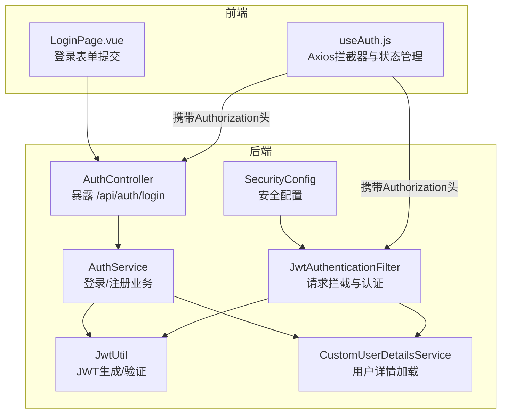
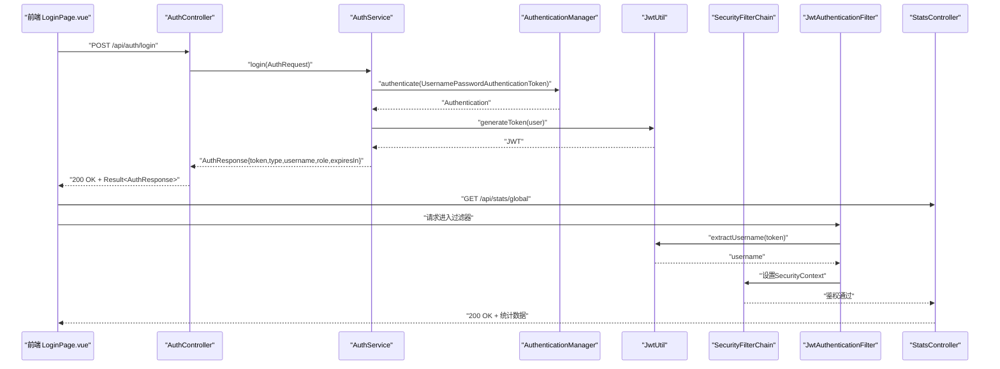
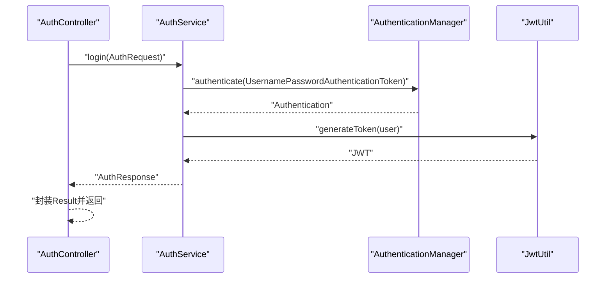
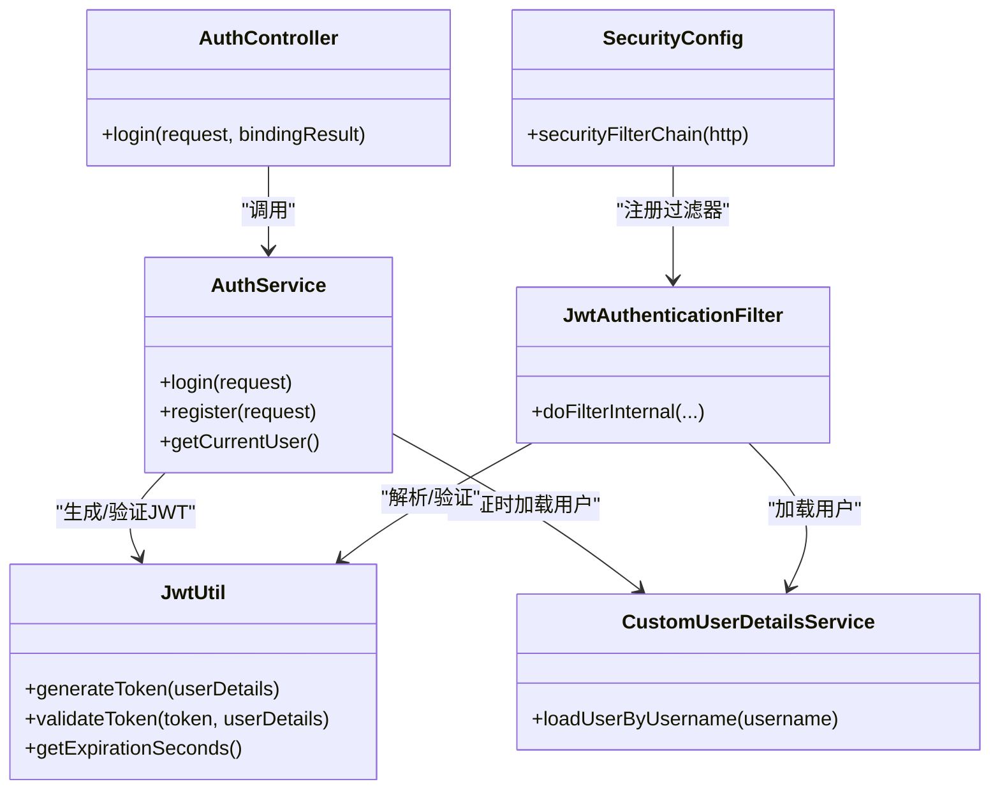
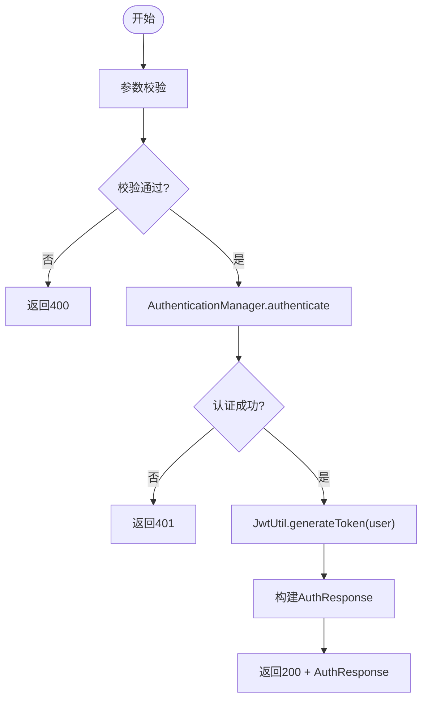

# 认证API

<cite>
**本文引用的文件**
- [AuthController.java](file://src/main/java/com/layor/tinyflow/Controller/AuthController.java)
- [AuthService.java](file://src/main/java/com/layor/tinyflow/service/AuthService.java)
- [AuthRequest.java](file://src/main/java/com/layor/tinyflow/entity/AuthRequest.java)
- [AuthResponse.java](file://src/main/java/com/layor/tinyflow/entity/AuthResponse.java)
- [JwtUtil.java](file://src/main/java/com/layor/tinyflow/security/JwtUtil.java)
- [JwtAuthenticationFilter.java](file://src/main/java/com/layor/tinyflow/security/JwtAuthenticationFilter.java)
- [CustomUserDetailsService.java](file://src/main/java/com/layor/tinyflow/service/CustomUserDetailsService.java)
- [SecurityConfig.java](file://src/main/java/com/layor/tinyflow/config/SecurityConfig.java)
- [application.yml](file://src/main/resources/application.yml)
- [LoginPage.vue](file://web/src/pages/LoginPage.vue)
- [useAuth.js](file://web/src/composables/useAuth.js)
- [StatsController.java](file://src/main/java/com/layor/tinyflow/Controller/StatsController.java)
</cite>

## 目录
1. [简介](#简介)
2. [项目结构](#项目结构)
3. [核心组件](#核心组件)
4. [架构总览](#架构总览)
5. [详细组件分析](#详细组件分析)
6. [依赖关系分析](#依赖关系分析)
7. [性能考量](#性能考量)
8. [故障排查指南](#故障排查指南)
9. [结论](#结论)
10. [附录](#附录)

## 简介
本文件为TinyFlow用户认证系统的权威API文档，聚焦于后端控制器AuthController中的“POST /api/auth/login”端点。文档详细说明：
- 请求体结构：AuthRequest（包含username与password字段）
- 成功响应体：AuthResponse（包含token、type、username、role、expiresIn）
- 失败场景与HTTP状态码（401 Unauthorized）
- JWT（JSON Web Token）生成与验证流程
- JwtUtil工具类如何生成带过期时间的令牌
- JwtAuthenticationFilter如何在后续请求中解析“Authorization: Bearer <token>”头实现无状态认证
- 与前端LoginPage.vue与useAuth.js的集成方式
- curl示例：登录请求与使用token访问受保护的统计API
- CustomUserDetailsService在用户凭证验证中的角色

## 项目结构
认证相关代码主要分布在以下模块：
- 控制层：AuthController（暴露登录、注册、当前用户信息等端点）
- 业务层：AuthService（封装注册/登录业务逻辑，调用认证管理器与JWT工具）
- 实体模型：AuthRequest、AuthResponse（请求/响应数据传输对象）
- 安全与认证：JwtUtil（JWT生成/解析/验证）、JwtAuthenticationFilter（请求拦截与认证上下文设置）、CustomUserDetailsService（用户详情加载）、SecurityConfig（Spring Security配置）
- 前端：LoginPage.vue（登录页）、useAuth.js（认证状态与Axios拦截器）

图表来源
- [AuthController.java](file://src/main/java/com/layor/tinyflow/Controller/AuthController.java#L88-L135)
- [AuthService.java](file://src/main/java/com/layor/tinyflow/service/AuthService.java#L76-L112)
- [JwtUtil.java](file://src/main/java/com/layor/tinyflow/security/JwtUtil.java#L81-L114)
- [JwtAuthenticationFilter.java](file://src/main/java/com/layor/tinyflow/security/JwtAuthenticationFilter.java#L32-L90)
- [CustomUserDetailsService.java](file://src/main/java/com/layor/tinyflow/service/CustomUserDetailsService.java#L21-L33)
- [SecurityConfig.java](file://src/main/java/com/layor/tinyflow/config/SecurityConfig.java#L46-L95)
- [LoginPage.vue](file://web/src/pages/LoginPage.vue#L251-L296)
- [useAuth.js](file://web/src/composables/useAuth.js#L37-L71)

章节来源
- [AuthController.java](file://src/main/java/com/layor/tinyflow/Controller/AuthController.java#L88-L135)
- [AuthService.java](file://src/main/java/com/layor/tinyflow/service/AuthService.java#L76-L112)
- [SecurityConfig.java](file://src/main/java/com/layor/tinyflow/config/SecurityConfig.java#L46-L95)

## 核心组件
- AuthController
  - 暴露POST /api/auth/login端点，接收AuthRequest，调用AuthService.login，返回Result<AuthResponse>。
  - 参数校验失败返回400；凭据错误返回401；其他异常返回500。
- AuthService
  - login：通过AuthenticationManager进行用户名/密码认证，成功后使用JwtUtil生成JWT，并返回包含token、type、username、role、expiresIn的AuthResponse。
- AuthRequest/AuthResponse
  - AuthRequest：username、password、email（注册时使用）。
  - AuthResponse：token、type（默认Bearer）、username、role、expiresIn（秒）。
- JwtUtil
  - 生成JWT：基于用户名与角色（或UserDetails）生成带过期时间的令牌。
  - 验证JWT：解析并校验签名、过期时间，以及用户名一致性。
- JwtAuthenticationFilter
  - 从请求头Authorization中提取Bearer token，解析用户名，加载UserDetails，验证token有效性，设置Spring Security上下文。
- CustomUserDetailsService
  - 根据username从数据库加载用户详情（含角色等），供认证与授权使用。
- SecurityConfig
  - 配置无状态会话、CORS、公开端点（/api/auth/**）、JWT过滤器位置、认证提供者等。

章节来源
- [AuthController.java](file://src/main/java/com/layor/tinyflow/Controller/AuthController.java#L88-L135)
- [AuthService.java](file://src/main/java/com/layor/tinyflow/service/AuthService.java#L76-L112)
- [AuthRequest.java](file://src/main/java/com/layor/tinyflow/entity/AuthRequest.java#L12-L26)
- [AuthResponse.java](file://src/main/java/com/layor/tinyflow/entity/AuthResponse.java#L11-L42)
- [JwtUtil.java](file://src/main/java/com/layor/tinyflow/security/JwtUtil.java#L81-L148)
- [JwtAuthenticationFilter.java](file://src/main/java/com/layor/tinyflow/security/JwtAuthenticationFilter.java#L32-L90)
- [CustomUserDetailsService.java](file://src/main/java/com/layor/tinyflow/service/CustomUserDetailsService.java#L21-L33)
- [SecurityConfig.java](file://src/main/java/com/layor/tinyflow/config/SecurityConfig.java#L46-L95)

## 架构总览
下图展示了登录与后续请求的端到端流程，包括前端发起登录请求、后端生成JWT、前端保存token并通过Authorization头访问受保护资源。

图表来源
- [AuthController.java](file://src/main/java/com/layor/tinyflow/Controller/AuthController.java#L88-L135)
- [AuthService.java](file://src/main/java/com/layor/tinyflow/service/AuthService.java#L76-L112)
- [JwtUtil.java](file://src/main/java/com/layor/tinyflow/security/JwtUtil.java#L81-L114)
- [JwtAuthenticationFilter.java](file://src/main/java/com/layor/tinyflow/security/JwtAuthenticationFilter.java#L32-L90)
- [StatsController.java](file://src/main/java/com/layor/tinyflow/Controller/StatsController.java#L97-L106)
- [LoginPage.vue](file://web/src/pages/LoginPage.vue#L251-L296)
- [useAuth.js](file://web/src/composables/useAuth.js#L37-L71)

## 详细组件分析

### POST /api/auth/login 端点
- 方法与路径
  - POST /api/auth/login
- 请求体
  - AuthRequest：包含username与password字段（email仅注册时使用）
- 成功响应
  - Result<AuthResponse>，其中AuthResponse包含：
    - token：JWT字符串
    - type：默认Bearer
    - username：当前登录用户名
    - role：用户角色
    - expiresIn：过期时间（秒）
- 失败响应
  - 参数校验失败：400 Bad Request
  - 凭据错误：401 Unauthorized
  - 其他异常：500 Internal Server Error

章节来源
- [AuthController.java](file://src/main/java/com/layor/tinyflow/Controller/AuthController.java#L88-L135)
- [AuthRequest.java](file://src/main/java/com/layor/tinyflow/entity/AuthRequest.java#L12-L26)
- [AuthResponse.java](file://src/main/java/com/layor/tinyflow/entity/AuthResponse.java#L11-L42)

### AuthController.login 调用链

图表来源
- [AuthController.java](file://src/main/java/com/layor/tinyflow/Controller/AuthController.java#L88-L135)
- [AuthService.java](file://src/main/java/com/layor/tinyflow/service/AuthService.java#L76-L112)
- [JwtUtil.java](file://src/main/java/com/layor/tinyflow/security/JwtUtil.java#L81-L114)

章节来源
- [AuthController.java](file://src/main/java/com/layor/tinyflow/Controller/AuthController.java#L88-L135)
- [AuthService.java](file://src/main/java/com/layor/tinyflow/service/AuthService.java#L76-L112)

### JWT生成与验证流程
- 生成
  - AuthService.login成功认证后，使用JwtUtil.generateToken(user)生成JWT，设置签发时间与过期时间（来自配置），并包含角色等声明。
- 验证
  - JwtUtil.validateToken(token, userDetails)解析并校验签名、过期时间与用户名一致性。
- 过期时间
  - application.yml中配置jwt.expiration（毫秒，默认7天），JwtUtil.getExpirationSeconds()返回秒数。

章节来源
- [AuthService.java](file://src/main/java/com/layor/tinyflow/service/AuthService.java#L76-L112)
- [JwtUtil.java](file://src/main/java/com/layor/tinyflow/security/JwtUtil.java#L81-L148)
- [application.yml](file://src/main/resources/application.yml#L212-L218)

### JwtAuthenticationFilter 无状态认证
- 请求拦截
  - 从Authorization头提取Bearer token，若存在且未认证上下文为空，则解析用户名并加载UserDetails。
- 认证设置
  - 使用JwtUtil.validateToken(token, userDetails)验证通过后，创建UsernamePasswordAuthenticationToken并设置到SecurityContextHolder。
- 作用范围
  - SecurityConfig中将JwtAuthenticationFilter置于UsernamePasswordAuthenticationFilter之前，确保在Spring Security认证前完成JWT解析与上下文设置。

章节来源
- [JwtAuthenticationFilter.java](file://src/main/java/com/layor/tinyflow/security/JwtAuthenticationFilter.java#L32-L90)
- [SecurityConfig.java](file://src/main/java/com/layor/tinyflow/config/SecurityConfig.java#L46-L95)

### CustomUserDetailsService 在凭证验证中的角色
- 用户详情加载
  - 根据username从数据库加载User（包含角色等），供认证与授权使用。
- 与认证流程配合
  - JwtAuthenticationFilter在验证JWT时需要UserDetails；SecurityConfig的DaoAuthenticationProvider在登录时也依赖UserDetailsService加载用户。

章节来源
- [CustomUserDetailsService.java](file://src/main/java/com/layor/tinyflow/service/CustomUserDetailsService.java#L21-L33)
- [SecurityConfig.java](file://src/main/java/com/layor/tinyflow/config/SecurityConfig.java#L120-L128)

### 前端集成：LoginPage.vue 与 useAuth.js
- LoginPage.vue
  - 表单提交至POST /api/auth/login，解析响应中的token（优先从Authorization头，其次从data.data.token），调用useAuth.setToken保存并跳转首页。
- useAuth.js
  - 请求拦截器自动在headers中附加Authorization: Bearer token。
  - 响应拦截器处理401未授权：清除本地token并跳转登录页。
  - 提供isAuthenticated计算属性与logout方法。

章节来源
- [LoginPage.vue](file://web/src/pages/LoginPage.vue#L251-L296)
- [useAuth.js](file://web/src/composables/useAuth.js#L1-L72)

### curl 示例
- 登录请求
  - curl -X POST http://localhost:8080/api/auth/login -H "Content-Type: application/json" -d '{"username":"your_username","password":"your_password"}'
- 使用token访问受保护的统计API
  - curl -X GET http://localhost:8080/api/stats/global -H "Authorization: Bearer YOUR_JWT_TOKEN"
- 注意
  - 若后端返回的响应体中包含token字段，前端也可从data.data.token获取；若响应头包含Authorization: Bearer，则优先使用该头。

章节来源
- [AuthController.java](file://src/main/java/com/layor/tinyflow/Controller/AuthController.java#L88-L135)
- [LoginPage.vue](file://web/src/pages/LoginPage.vue#L251-L296)
- [useAuth.js](file://web/src/composables/useAuth.js#L37-L71)
- [StatsController.java](file://src/main/java/com/layor/tinyflow/Controller/StatsController.java#L97-L106)

## 依赖关系分析
- 控制层依赖业务层：AuthController依赖AuthService执行登录/注册。
- 业务层依赖安全工具与认证：AuthService依赖JwtUtil生成JWT、AuthenticationManager进行认证。
- 安全过滤链依赖工具与用户详情：JwtAuthenticationFilter依赖JwtUtil与CustomUserDetailsService。
- 配置层统一装配：SecurityConfig配置过滤器链、CORS、认证提供者与会话策略。

图表来源
- [AuthController.java](file://src/main/java/com/layor/tinyflow/Controller/AuthController.java#L88-L135)
- [AuthService.java](file://src/main/java/com/layor/tinyflow/service/AuthService.java#L76-L112)
- [JwtUtil.java](file://src/main/java/com/layor/tinyflow/security/JwtUtil.java#L81-L148)
- [JwtAuthenticationFilter.java](file://src/main/java/com/layor/tinyflow/security/JwtAuthenticationFilter.java#L32-L90)
- [CustomUserDetailsService.java](file://src/main/java/com/layor/tinyflow/service/CustomUserDetailsService.java#L21-L33)
- [SecurityConfig.java](file://src/main/java/com/layor/tinyflow/config/SecurityConfig.java#L46-L95)

章节来源
- [AuthController.java](file://src/main/java/com/layor/tinyflow/Controller/AuthController.java#L88-L135)
- [AuthService.java](file://src/main/java/com/layor/tinyflow/service/AuthService.java#L76-L112)
- [JwtUtil.java](file://src/main/java/com/layor/tinyflow/security/JwtUtil.java#L81-L148)
- [JwtAuthenticationFilter.java](file://src/main/java/com/layor/tinyflow/security/JwtAuthenticationFilter.java#L32-L90)
- [CustomUserDetailsService.java](file://src/main/java/com/layor/tinyflow/service/CustomUserDetailsService.java#L21-L33)
- [SecurityConfig.java](file://src/main/java/com/layor/tinyflow/config/SecurityConfig.java#L46-L95)

## 性能考量
- 无状态认证
  - 采用JWT无状态设计，避免服务器端会话存储，降低横向扩展复杂度。
- 过滤器链顺序
  - 将JwtAuthenticationFilter置于UsernamePasswordAuthenticationFilter之前，减少不必要的认证开销。
- 密码编码
  - 使用BCryptPasswordEncoder，兼顾安全性与性能平衡。
- 过期时间
  - 合理设置jwt.expiration（默认7天），结合前端刷新策略与短期令牌使用场景，平衡安全与用户体验。

章节来源
- [SecurityConfig.java](file://src/main/java/com/layor/tinyflow/config/SecurityConfig.java#L46-L95)
- [application.yml](file://src/main/resources/application.yml#L212-L218)

## 故障排查指南
- 401 Unauthorized
  - 可能原因：用户名或密码错误、token无效或过期、请求头未携带Authorization或格式不正确。
  - 排查步骤：
    - 确认请求体字段username与password符合规则（长度、字符集）。
    - 确认Authorization头格式为“Bearer <token>”，且token未过期。
    - 检查JwtUtil.validateToken与JwtAuthenticationFilter日志输出。
- 400 Bad Request
  - 可能原因：请求体参数校验失败（如用户名/密码格式不符）。
  - 排查步骤：查看AuthController对BindingResult的处理与日志。
- 500 Internal Server Error
  - 可能原因：认证异常、数据库异常、JWT生成异常。
  - 排查步骤：查看AuthController与AuthService的异常分支与日志。

章节来源
- [AuthController.java](file://src/main/java/com/layor/tinyflow/Controller/AuthController.java#L88-L135)
- [AuthService.java](file://src/main/java/com/layor/tinyflow/service/AuthService.java#L76-L112)
- [JwtAuthenticationFilter.java](file://src/main/java/com/layor/tinyflow/security/JwtAuthenticationFilter.java#L32-L90)
- [JwtUtil.java](file://src/main/java/com/layor/tinyflow/security/JwtUtil.java#L116-L148)

## 结论
本文档围绕“POST /api/auth/login”端点，系统梳理了请求体与响应体结构、JWT生成与验证流程、前后端集成方式及常见问题排查。通过Spring Security无状态认证与JWT无状态会话，TinyFlow实现了安全、可扩展的用户认证体系。建议在生产环境中妥善保管JWT密钥、合理设置过期时间，并结合前端拦截器完善token刷新与失效处理。

## 附录

### API定义摘要
- 端点：POST /api/auth/login
- 请求体：AuthRequest（username、password、email仅注册时使用）
- 成功响应体：AuthResponse（token、type、username、role、expiresIn）
- 失败状态码：401 Unauthorized（凭据错误）

章节来源
- [AuthController.java](file://src/main/java/com/layor/tinyflow/Controller/AuthController.java#L88-L135)
- [AuthRequest.java](file://src/main/java/com/layor/tinyflow/entity/AuthRequest.java#L12-L26)
- [AuthResponse.java](file://src/main/java/com/layor/tinyflow/entity/AuthResponse.java#L11-L42)

### 关键流程算法说明
- 登录流程（简化）
  - 输入：AuthRequest
  - 步骤：
    1) 参数校验
    2) AuthenticationManager.authenticate
    3) 设置SecurityContext
    4) JwtUtil.generateToken(user)
    5) 返回AuthResponse
  - 输出：AuthResponse

图表来源
- [AuthService.java](file://src/main/java/com/layor/tinyflow/service/AuthService.java#L76-L112)
- [AuthController.java](file://src/main/java/com/layor/tinyflow/Controller/AuthController.java#L88-L135)