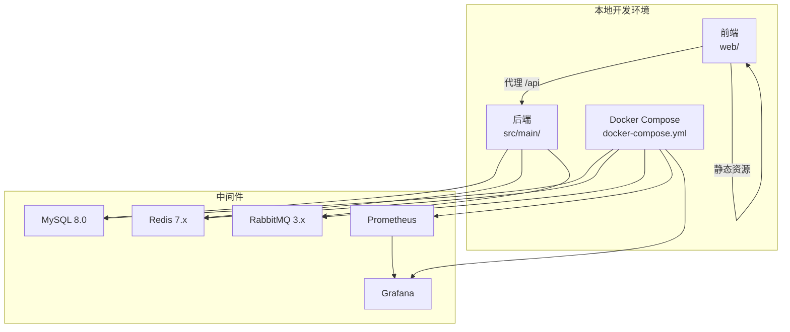
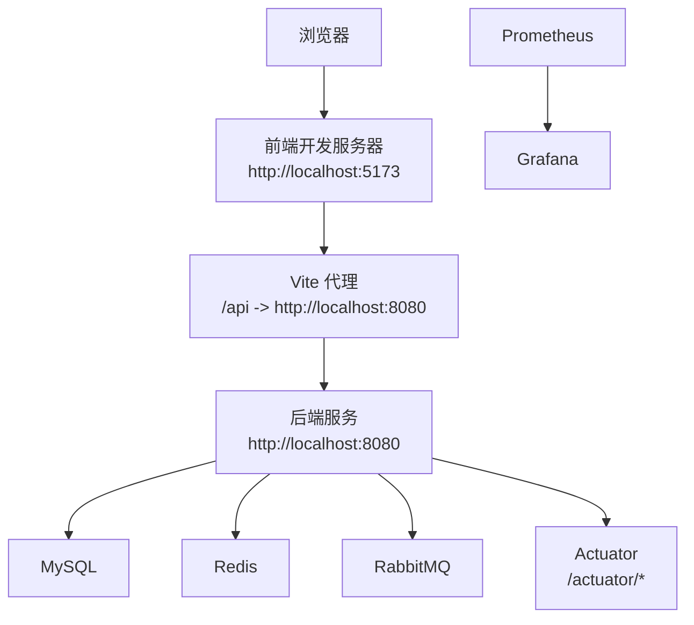
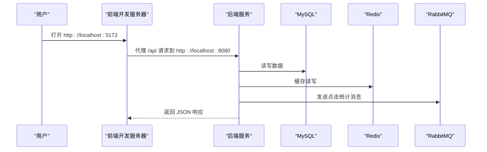
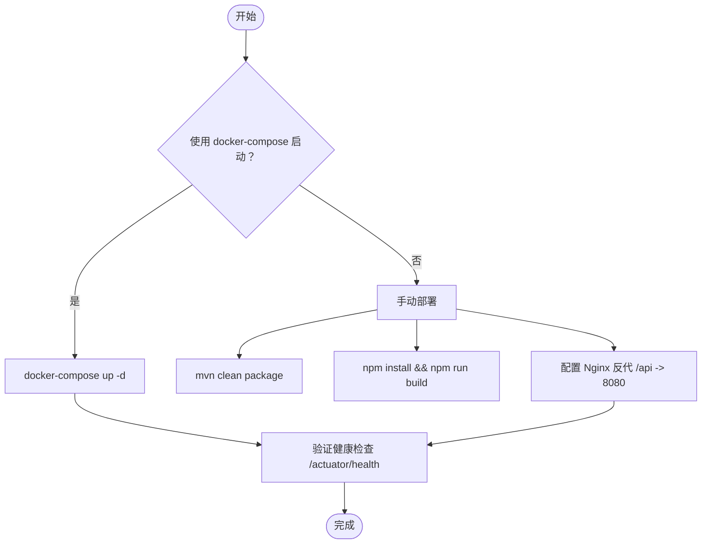
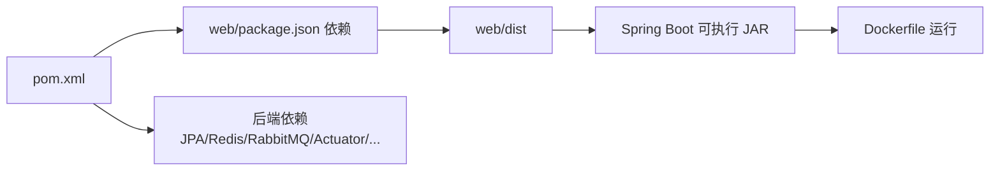

# 快速开始

<cite>
**本文引用的文件**
- [README.md](file://README.md)
- [web/.env.development](file://web/.env.development)
- [docker-compose.yml](file://docker-compose.yml)
- [deploy.sh](file://deploy.sh)
- [pom.xml](file://pom.xml)
- [src/main/resources/application.yml](file://src/main/resources/application.yml)
- [web/package.json](file://web/package.json)
- [web/vite.config.js](file://web/vite.config.js)
- [Dockerfile](file://Dockerfile)
- [web/README.md](file://web/README.md)
</cite>

## 目录
1. [简介](#简介)
2. [项目结构](#项目结构)
3. [核心组件](#核心组件)
4. [架构总览](#架构总览)
5. [详细组件分析](#详细组件分析)
6. [依赖关系分析](#依赖关系分析)
7. [性能注意事项](#性能注意事项)
8. [故障排查指南](#故障排查指南)
9. [结论](#结论)
10. [附录](#附录)

## 简介
本指南面向首次接触 TinyFlow 的用户，帮助你在本地快速完成克隆、依赖安装、数据库与中间件准备、开发与生产环境运行，并提供常见问题与排障建议。TinyFlow 是一款高并发短链接生成与统计系统，前端基于 Vue 3 + Vite，后端基于 Spring Boot，配合 MySQL、Redis、RabbitMQ 以及可观测性组件（Prometheus/Grafana/Zipkin）实现高性能与可运维性。

## 项目结构
- 后端（Spring Boot）位于 src/main/java/com/layor/tinyflow，核心配置在 src/main/resources/application.yml。
- 前端位于 web 目录，使用 Vite 作为开发服务器与构建工具。
- 顶层提供 docker-compose.yml 用于一键启动 MySQL、Redis、RabbitMQ、Prometheus、Grafana 等中间件。
- 提供 deploy.sh 一键部署脚本，适合在 Linux 服务器上自动化安装与部署。

**章节来源**
- file://README.md#L150-L163
- file://web/README.md#L59-L63

## 核心组件
- 前端（Vue 3 + Vite）
  - 开发服务器端口：5173（或 5174/5175）
  - 代理配置：将 /api 与 /shorten 代理到后端 8080 端口
  - 环境变量：VITE_SHORT_BASE、VITE_API_BASE 指向后端 API
- 后端（Spring Boot 3.5.7 + Java 17）
  - 默认端口：8080
  - 数据源、Redis、RabbitMQ 通过 application.yml 配置，支持环境变量注入
  - Actuator 暴露健康检查、指标、熔断器等
- 中间件（Docker Compose）
  - MySQL、Redis、RabbitMQ、Prometheus、Grafana
  - 通过环境变量与挂载卷持久化数据

**章节来源**
- file://web/vite.config.js#L1-L19
- file://web/.env.development#L1-L4
- file://src/main/resources/application.yml#L1-L120
- file://docker-compose.yml#L1-L67

## 架构总览
开发环境典型拓扑：
- 前端开发服务器监听 5173，代理 /api 到后端 8080
- 后端监听 8080，连接本地 MySQL、Redis、RabbitMQ
- 可选：Prometheus 采集指标，Grafana 可视化

**图表来源**
- [web/vite.config.js](file://web/vite.config.js#L1-L19)
- [src/main/resources/application.yml](file://src/main/resources/application.yml#L1-L120)
- [docker-compose.yml](file://docker-compose.yml#L1-L67)

**章节来源**
- file://README.md#L150-L163
- file://web/README.md#L59-L63

## 详细组件分析

### 开发环境运行步骤
- 克隆仓库
  - 使用 Git 克隆项目到本地
- 启动中间件（MySQL、Redis、RabbitMQ、Prometheus、Grafana）
  - 进入项目根目录，执行 docker-compose 启动
- 启动后端
  - 进入后端目录，使用 Maven 启动 Spring Boot 应用
- 启动前端
  - 进入 web 目录，安装依赖并启动开发服务器
- 访问应用
  - 前端：http://localhost:5173
  - 后端 API：http://localhost:8080
  - Grafana：http://localhost:3000（默认账号 admin/admin）
  - Prometheus：http://localhost:9090

**图表来源**
- [web/vite.config.js](file://web/vite.config.js#L1-L19)
- [src/main/resources/application.yml](file://src/main/resources/application.yml#L1-L120)
- [docker-compose.yml](file://docker-compose.yml#L1-L67)

**章节来源**
- file://README.md#L377-L401

### 生产环境运行步骤
- 使用 docker-compose 一键启动（推荐）
  - 该方式会同时启动应用容器与中间件容器，应用容器通过环境变量连接中间件
- 使用 deploy.sh 一键部署（Linux 服务器）
  - 脚本会自动安装 Java、Maven、Node.js、Nginx、MySQL、Redis，构建前后端并配置 Nginx 与 Systemd 服务
- 手动部署（可选）
  - 后端：mvn 清理打包后以 JAR 方式运行
  - 前端：npm 构建后由 Nginx 提供静态资源，Nginx 反向代理 /api 到后端 8080

**图表来源**
- [docker-compose.yml](file://docker-compose.yml#L1-L67)
- [deploy.sh](file://deploy.sh#L333-L360)
- [pom.xml](file://pom.xml#L157-L236)
- [web/package.json](file://web/package.json#L1-L38)
- [Dockerfile](file://Dockerfile#L1-L7)

**章节来源**
- file://README.md#L497-L574
- file://README.md#L575-L633

### 环境变量与配置要点
- 前端环境变量（开发）
  - VITE_SHORT_BASE、VITE_API_BASE 指向后端 API 地址
- 后端配置
  - 数据源、Redis、RabbitMQ、Actuator、Prometheus、Zipkin、JWT、缓存与熔断等均在 application.yml 中配置
  - 支持通过环境变量覆盖敏感配置（如 DB_PASSWORD、REDIS_PASSWORD、JWT_SECRET）
- Docker Compose
  - 应用容器通过环境变量连接 MySQL、Redis、RabbitMQ，并映射 8080 端口

**章节来源**
- file://web/.env.development#L1-L4
- file://src/main/resources/application.yml#L1-L218
- file://docker-compose.yml#L37-L60

## 依赖关系分析
- 前端依赖
  - Vue 3、Vite、Tailwind CSS、Axios、Vue Router、Vue I18n、ECharts、QRCode 等
- 后端依赖
  - Spring Boot、Spring Data JPA、MySQL Connector、Redis、RabbitMQ、Resilience4j、Micrometer（Prometheus）、JWT、Zipkin 等
- 构建与打包
  - Maven 插件负责前端依赖安装与构建，并将 dist 目录复制到后端资源中，最终生成可执行 JAR
  - Dockerfile 以 JRE 运行后端 JAR，默认暴露 8080 端口

**图表来源**
- [pom.xml](file://pom.xml#L157-L236)
- [web/package.json](file://web/package.json#L1-L38)
- [Dockerfile](file://Dockerfile#L1-L7)

**章节来源**
- file://pom.xml#L1-L156
- file://web/package.json#L1-L38
- file://Dockerfile#L1-L7

## 性能注意事项
- 开发环境默认启用代理与本地资源，注意浏览器跨域与缓存刷新
- 生产环境建议使用 Nginx 反向代理静态资源与 API，开启 gzip 压缩
- 后端已内置 Prometheus 指标与 Zipkin 链路追踪，可通过 Grafana 可视化
- RabbitMQ 消息队列采用手动确认与死信队列，降低消息丢失风险

[本节为通用建议，不直接分析具体文件]

## 故障排查指南
- 前端无法访问后端接口
  - 检查 Vite 代理配置是否正确指向 8080 端口
  - 确认后端已启动且端口未被占用
- 后端启动报错（数据库连接失败）
  - 检查 application.yml 中的数据源配置与环境变量
  - 确认 MySQL 已启动并通过 docker-compose 连接
- Redis 连接异常
  - 检查 Redis 密码与网络连通性
  - 若使用 docker-compose，确认容器名称与端口映射
- RabbitMQ 未启用
  - application.yml 中相关配置默认注释，若未安装 RabbitMQ 会禁用相关健康检查
- 前端短链地址与后端域名不一致
  - 在前端构建时注入环境变量，或在运行时调整 API 基础地址
- 首次运行验证
  - 使用 curl 检查后端健康状态与短链生成接口
  - 访问短链端点验证重定向与统计记录

**章节来源**
- file://web/vite.config.js#L1-L19
- file://src/main/resources/application.yml#L1-L120
- file://README.md#L452-L466
- file://web/README.md#L321-L330

## 结论
通过本指南，你可以快速在本地完成 TinyFlow 的克隆、依赖安装、中间件启动与前后端运行。开发环境推荐使用 docker-compose 一键启动中间件，再分别启动后端与前端；生产环境可选择 docker-compose 或 deploy.sh 脚本进行自动化部署。遇到问题时，可依据“故障排查指南”逐步定位并解决。

[本节为总结性内容，不直接分析具体文件]

## 附录

### 开发环境访问地址
- 前端：http://localhost:5173
- 后端 API：http://localhost:8080
- Grafana：http://localhost:3000（默认账号 admin/admin）
- Prometheus：http://localhost:9090

**章节来源**
- file://README.md#L396-L401
- file://web/README.md#L59-L63

### 环境变量清单（开发）
- 前端（web/.env.development）
  - VITE_SHORT_BASE
  - VITE_API_BASE

**章节来源**
- file://web/.env.development#L1-L4

### 环境变量清单（生产）
- 后端（application.yml）
  - spring.datasource.url/username/password
  - spring.data.redis.host/port/password
  - spring.rabbitmq.host/port/username/password
  - jwt.secret
  - APP_DOMAIN

**章节来源**
- file://src/main/resources/application.yml#L1-L218

### 常用命令速查
- 克隆与启动中间件
  - docker-compose up -d
- 启动后端
  - cd src/main && mvn spring-boot:run
- 启动前端
  - cd web && npm install && npm run dev
- 构建生产包
  - cd web && npm run build
  - mvn clean package -DskipTests

**章节来源**
- file://README.md#L377-L401
- file://README.md#L435-L451
- file://pom.xml#L157-L236
- file://web/package.json#L1-L38