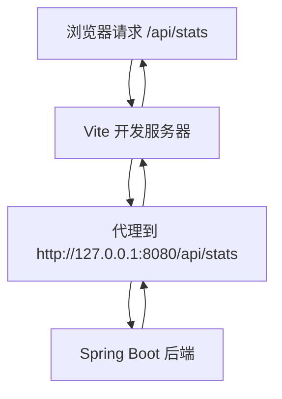
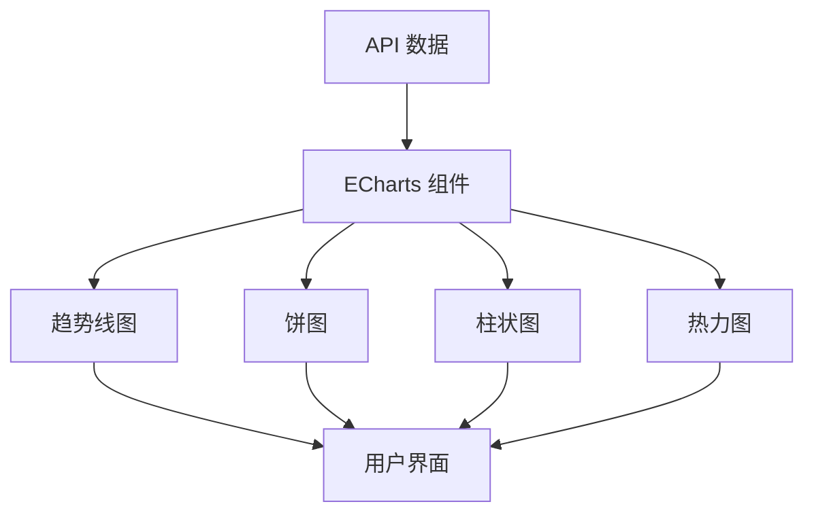
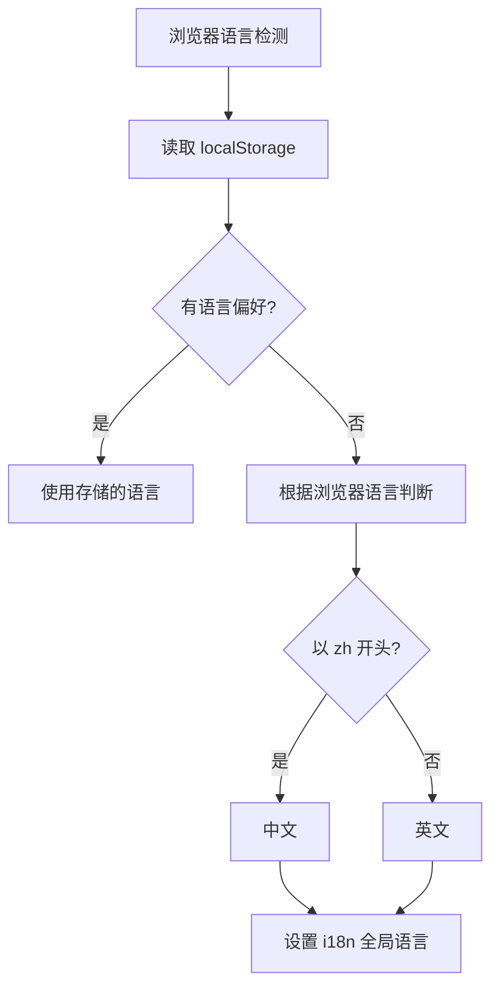
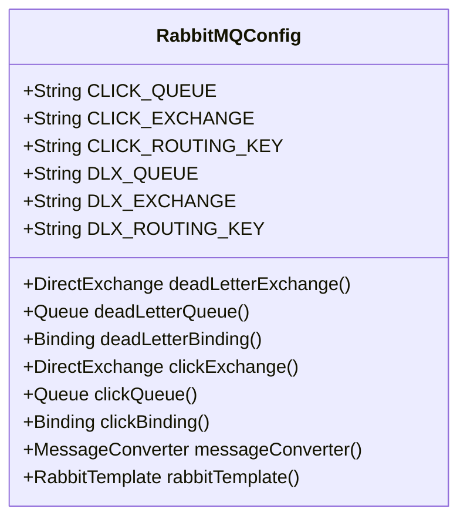
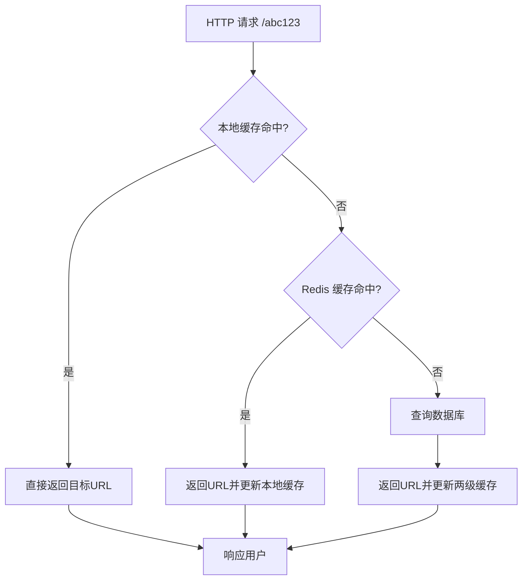
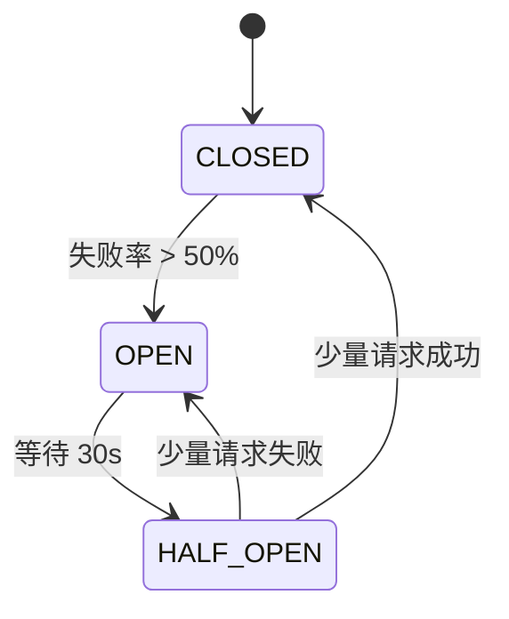
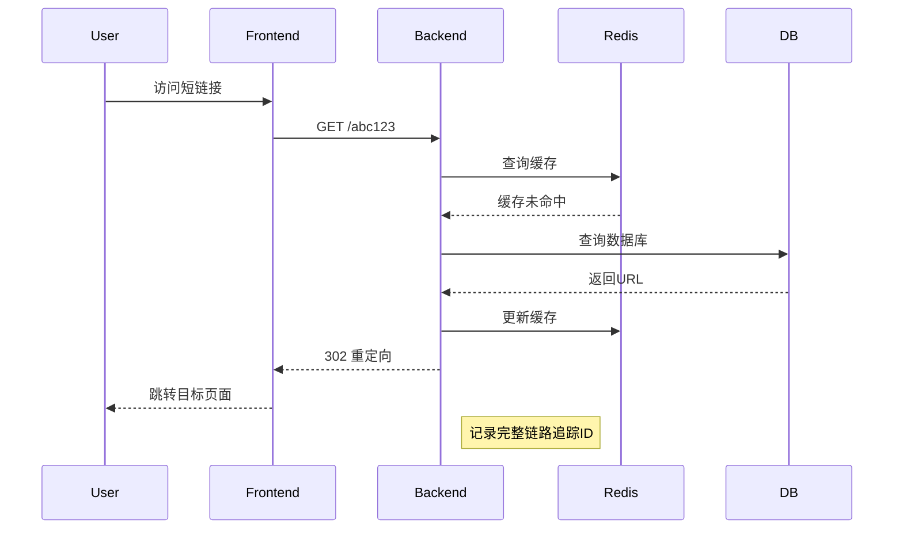
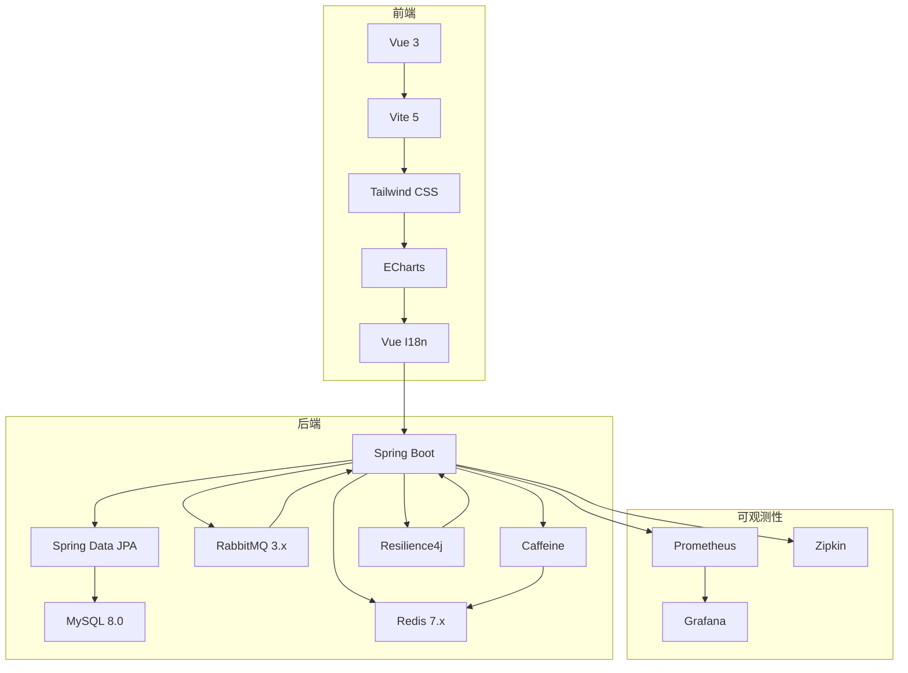

# 技术栈

<cite>
**本文档引用的文件**  
- [pom.xml](file://pom.xml)
- [package.json](file://web/package.json)
- [application.yml](file://src/main/resources/application.yml)
- [vite.config.js](file://web/vite.config.js)
- [tailwind.config.js](file://web/tailwind.config.js)
- [CacheConfig.java](file://src/main/java/com/layor/tinyflow/config/CacheConfig.java)
- [RabbitMQConfig.java](file://src/main/java/com/layor/tinyflow/config/RabbitMQConfig.java)
- [ObservabilityConfig.java](file://src/main/java/com/layor/tinyflow/config/ObservabilityConfig.java)
- [ClickRecorderService.java](file://src/main/java/com/layor/tinyflow/service/ClickRecorderService.java)
- [i18n.js](file://web/src/i18n.js)
- [main.js](file://web/src/main.js)
- [useStats.js](file://web/src/composables/useStats.js)
</cite>

## 目录
1. [简介](#简介)
2. [前端技术栈](#前端技术栈)
3. [后端技术栈](#后端技术栈)
4. [可观测性技术栈](#可观测性技术栈)
5. [技术全景图](#技术全景图)

## 简介
TinyFlow 是一个高性能短链接生成与统计系统，采用现代化全栈技术构建。本项目从前端到后端，从数据存储到服务治理，均选用了业界领先的技术方案，旨在提供高并发、低延迟、易维护的短链接服务。系统采用前后端分离架构，前端基于 Vue 3 和 Vite 构建响应式用户界面，后端基于 Spring Boot 提供 RESTful API 服务，结合多级缓存、异步处理和熔断机制保障系统稳定性。

## 前端技术栈

### Vue 3（Composition API）
前端框架采用 Vue 3，充分利用其 Composition API 提供的逻辑复用和代码组织能力。通过 `setup()` 函数和 `ref`、`computed` 等响应式 API，实现了组件逻辑的模块化封装。项目中的 `useStats.js` 和 `useApi.js` 等组合式函数（Composables）充分体现了这一优势，将数据获取、状态管理和业务逻辑抽象为可复用的函数。

**Section sources**
- [main.js](file://web/src/main.js#L1-L12)
- [useStats.js](file://web/src/composables/useStats.js#L1-L255)
- [useApi.js](file://web/src/composables/useApi.js#L1-L28)

### Vite 5 构建工具
项目使用 Vite 5 作为前端构建工具，替代传统的 Webpack。Vite 利用现代浏览器原生 ES 模块支持，实现极速的冷启动和热更新。配置文件 `vite.config.js` 中定义了开发服务器代理，将 `/api` 和 `/shorten` 请求代理到后端服务，解决了开发环境跨域问题。

**Diagram sources**
- [vite.config.js](file://web/vite.config.js#L1-L19)

**Section sources**
- [vite.config.js](file://web/vite.config.js#L1-L19)

### Tailwind CSS 原子化样式
样式系统采用 Tailwind CSS 原子化 CSS 框架，通过 `tailwind.config.js` 配置内容源，扫描所有 Vue 组件文件生成所需样式。这种"实用优先"（Utility-First）的开发方式，使样式直接内联在 HTML 模板中，提高了开发效率和样式一致性。

**Section sources**
- [tailwind.config.js](file://web/tailwind.config.js#L1-L11)

### ECharts 数据可视化库
数据统计页面使用 ECharts 作为可视化库，实现丰富的图表展示。项目中包含多种图表组件，如 `TrendLineChart.vue`（趋势线图）、`DevicePieChart.vue`（设备分布饼图）、`CityBarChart.vue`（城市分布柱状图）等，通过 ECharts 提供的强大渲染能力，直观展示短链接的访问趋势和分布情况。

**Diagram sources**
- [TrendLineChart.vue](file://web/src/components/charts/TrendLineChart.vue#L1-L38)

**Section sources**
- [TrendLineChart.vue](file://web/src/components/charts/TrendLineChart.vue#L1-L38)
- [components/charts/](file://web/src/components/charts/)

### Vue I18n 国际化方案
项目采用 Vue I18n 实现国际化支持，通过 `i18n.js` 配置中英文双语。系统根据浏览器语言或用户选择自动切换语言，并将偏好存储在 `localStorage` 中。国际化配置覆盖了导航、表单、按钮、提示等所有用户界面元素，确保全球用户都能获得良好的使用体验。

**Diagram sources**
- [i18n.js](file://web/src/i18n.js#L1-L134)

**Section sources**
- [i18n.js](file://web/src/i18n.js#L1-L134)
- [main.js](file://web/src/main.js#L5)

## 后端技术栈

### Spring Boot 3.5.7
后端核心框架采用 Spring Boot 3.5.7，基于 Spring Framework 6 和 Java 17 构建。通过 `pom.xml` 中的 `spring-boot-starter-parent` 父POM，统一管理依赖版本。项目包含多个 Starter 模块，如 `spring-boot-starter-web`（Web 服务）、`spring-boot-starter-data-jpa`（数据访问）、`spring-boot-starter-security`（安全认证）等，快速构建生产级应用。

**Section sources**
- [pom.xml](file://pom.xml#L1-L238)
- [TinyFlowApplication.java](file://src/main/java/com/layor/tinyflow/TinyFlowApplication.java)

### Spring Data JPA
数据持久层采用 Spring Data JPA，通过 `JpaRepository` 接口简化数据库操作。项目中定义了 `ShortUrlRepository`、`DailyClickRepository` 等接口，继承 `JpaRepository` 获得基本的 CRUD 功能，并通过方法名约定或 `@Query` 注解实现复杂查询，减少模板代码。

**Section sources**
- [pom.xml](file://pom.xml#L64-L67)
- [ShortUrlRepository.java](file://src/main/java/com/layor/tinyflow/repository/ShortUrlRepository.java)
- [DailyClickRepository.java](file://src/main/java/com/layor/tinyflow/repository/DailyClickRepository.java)

### MySQL 8.0
数据库采用 MySQL 8.0，通过 `application.yml` 配置连接信息。使用 HikariCP 作为连接池，配置最大连接数 100，最小空闲连接 20，确保高并发下的数据库连接性能。JPA 配置指定使用 `MySQL8Dialect` 方言，充分利用 MySQL 8.0 的新特性。

**Section sources**
- [application.yml](file://src/main/resources/application.yml#L4-L15)
- [pom.xml](file://pom.xml#L80-L83)

### Redis 7.x
缓存系统采用 Redis 7.x，通过 `spring-boot-starter-data-redis` 集成。在 `application.yml` 中配置主机、端口和密码，使用 Lettuce 作为客户端，连接池配置最大活跃连接 600。Redis 主要用于缓存短链接映射和点击计数快照，减轻数据库压力。

**Section sources**
- [application.yml](file://src/main/resources/application.yml#L22-L33)
- [pom.xml](file://pom.xml#L39-L42)

### RabbitMQ 3.x
消息队列采用 RabbitMQ 3.x，通过 `spring-boot-starter-amqp` 集成。`RabbitMQConfig.java` 配置了点击事件队列、死信队列和交换机，实现异步处理点击事件。消息采用 JSON 格式，配置生产者确认和消费者手动确认机制，确保消息不丢失。

**Diagram sources**
- [RabbitMQConfig.java](file://src/main/java/com/layor/tinyflow/config/RabbitMQConfig.java#L1-L125)

**Section sources**
- [RabbitMQConfig.java](file://src/main/java/com/layor/tinyflow/config/RabbitMQConfig.java#L1-L125)
- [pom.xml](file://pom.xml#L109-L113)

### Caffeine 本地缓存
本地缓存采用 Caffeine，通过 `com.github.ben-manes.caffeine` 依赖集成。`CacheConfig.java` 配置了名为 `localUrlCache` 的缓存实例，基于 `maximumSize=50000,expireAfterWrite=30m` 的策略，缓存短链接映射，实现毫秒级响应。

**Diagram sources**
- [CacheConfig.java](file://src/main/java/com/layor/tinyflow/config/CacheConfig.java#L1-L20)

**Section sources**
- [CacheConfig.java](file://src/main/java/com/layor/tinyflow/config/CacheConfig.java#L1-L20)
- [pom.xml](file://pom.xml#L106-L108)

### Resilience4j 熔断器
系统韧性采用 Resilience4j 实现，通过 `resilience4j-spring-boot3` 依赖集成。`application.yml` 配置了 Redis 和数据库的熔断器实例，当失败率超过阈值时自动熔断，防止故障扩散。同时配置了重试机制，在 Redis 连接失败时进行指数退避重试。

**Diagram sources**
- [application.yml](file://src/main/resources/application.yml#L148-L211)

**Section sources**
- [application.yml](file://src/main/resources/application.yml#L148-L211)
- [pom.xml](file://pom.xml#L101-L104)

## 可观测性技术栈

### Prometheus 指标采集
监控指标采集采用 Prometheus，通过 `micrometer-registry-prometheus` 依赖集成。`application.yml` 配置暴露 `/actuator/prometheus` 端点，收集 JVM、HTTP 请求、缓存、熔断器等指标。Micrometer 自动将 Spring Boot Actuator 指标转换为 Prometheus 格式。

**Section sources**
- [application.yml](file://src/main/resources/application.yml#L88-L126)
- [pom.xml](file://pom.xml#L55-L57)

### Grafana 监控大盘
监控展示采用 Grafana，通过 `web/infra/observability/dashboards/` 目录下的 JSON 配置文件定义监控大盘。系统预置了短链接服务概览大盘，展示 QPS、延迟、错误率、缓存命中率等关键指标，帮助运维人员实时掌握系统健康状况。

**Section sources**
- [shortener-overview.json](file://web/infra/observability/dashboards/shortener-overview.json)
- [k6-load-results.json](file://web/infra/observability/dashboards/k6-load-results.json)

### Zipkin 链路追踪
分布式链路追踪采用 Zipkin，通过 `micrometer-tracing` 和 `zipkin-reporter-brave` 依赖集成。`application.yml` 配置将追踪数据发送到 `http://localhost:9411/api/v2/spans`，实现请求的全链路追踪。结合 `@Timed` 注解，可以精确测量方法执行时间，定位性能瓶颈。

**Diagram sources**
- [application.yml](file://src/main/resources/application.yml#L126-L132)
- [ObservabilityConfig.java](file://src/main/java/com/layor/tinyflow/config/ObservabilityConfig.java#L1-L60)

**Section sources**
- [application.yml](file://src/main/resources/application.yml#L126-L132)
- [ObservabilityConfig.java](file://src/main/java/com/layor/tinyflow/config/ObservabilityConfig.java#L1-L60)
- [pom.xml](file://pom.xml#L137-L148)

## 技术全景图
TinyFlow 项目构建了一个完整的技术生态，从前端到后端，从数据到服务，形成了一个高性能、高可用的短链接系统。前端采用 Vue 3 + Vite + Tailwind CSS + ECharts + Vue I18n 技术栈，提供现代化的用户界面和数据可视化。后端采用 Spring Boot + JPA + MySQL + Redis + RabbitMQ + Caffeine + Resilience4j 技术栈，确保系统的高性能和高可用性。通过 Prometheus + Grafana + Zipkin 可观测性技术栈，实现全面的监控、告警和链路追踪。Caffeine 和 Redis 构成 L1/L2 多级缓存，RabbitMQ 用于异步处理点击事件，Resilience4j 提供熔断和重试保护，共同保障系统在高并发场景下的稳定运行。

**Diagram sources**
- [pom.xml](file://pom.xml)
- [package.json](file://web/package.json)
- [application.yml](file://src/main/resources/application.yml)