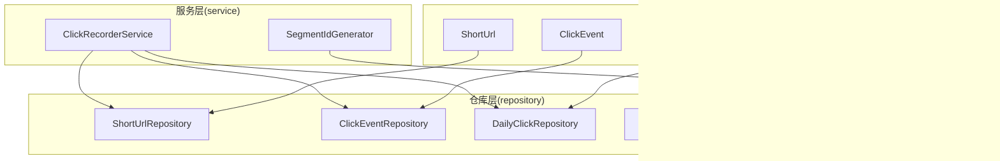

# 数据模型

<cite>
**本文引用的文件**
- [ShortUrl.java](file://src/main/java/com/layor/tinyflow/entity/ShortUrl.java)
- [ClickEvent.java](file://src/main/java/com/layor/tinyflow/entity/ClickEvent.java)
- [User.java](file://src/main/java/com/layor/tinyflow/entity/User.java)
- [DailyClick.java](file://src/main/java/com/layor/tinyflow/entity/DailyClick.java)
- [IdSegment.java](file://src/main/java/com/layor/tinyflow/entity/IdSegment.java)
- [ShortUrlRepository.java](file://src/main/java/com/layor/tinyflow/repository/ShortUrlRepository.java)
- [ClickEventRepository.java](file://src/main/java/com/layor/tinyflow/repository/ClickEventRepository.java)
- [DailyClickRepository.java](file://src/main/java/com/layor/tinyflow/repository/DailyClickRepository.java)
- [UserRepository.java](file://src/main/java/com/layor/tinyflow/repository/UserRepository.java)
- [IdSegmentRepository.java](file://src/main/java/com/layor/tinyflow/repository/IdSegmentRepository.java)
- [ClickRecorderService.java](file://src/main/java/com/layor/tinyflow/service/ClickRecorderService.java)
- [SegmentIdGenerator.java](file://src/main/java/com/layor/tinyflow/service/SegmentIdGenerator.java)
</cite>

## 目录
1. [简介](#简介)
2. [项目结构与数据模型定位](#项目结构与数据模型定位)
3. [核心实体与字段定义](#核心实体与字段定义)
4. [实体关系与映射](#实体关系与映射)
5. [JPA 注解与数据库表映射](#jpa-注解与数据库表映射)
6. [索引与性能设计](#索引与性能设计)
7. [聚合与统计流程](#聚合与统计流程)
8. [依赖与调用关系](#依赖与调用关系)
9. [ER 图](#er-图)
10. [结论](#结论)

## 简介
本文件系统性梳理 TinyFlow 的核心数据模型，聚焦以下实体：
- ShortUrl：短链实体，包含短码、原始 URL、创建者、创建时间、点击计数等
- ClickEvent：点击事件明细，记录每次点击的 IP、UA、时间戳、来源、设备、城市、国家等
- DailyClick：按短码与日期聚合的每日点击量
- User：用户实体，用户名、密码、邮箱、角色及账户状态
- IdSegment：号段 ID 生成器的持久化载体，支持高并发自增 ID 分配

文档还解释 DailyClick 如何通过聚合实现“每日访问量”统计，并说明 IdSegment 在号段 ID 生成器中的作用；最后以 ER 图展示实体关系，并给出 JPA 注解与数据库表映射说明，为数据库管理与查询优化提供依据。

## 项目结构与数据模型定位
数据模型位于 Java 工程的 entity 包中，对应的 Spring Data JPA 仓库位于 repository 包中，服务层在 service 包中负责统计与聚合逻辑。

图表来源
- [ShortUrl.java](file://src/main/java/com/layor/tinyflow/entity/ShortUrl.java#L1-L46)
- [ClickEvent.java](file://src/main/java/com/layor/tinyflow/entity/ClickEvent.java#L1-L48)
- [DailyClick.java](file://src/main/java/com/layor/tinyflow/entity/DailyClick.java#L1-L32)
- [User.java](file://src/main/java/com/layor/tinyflow/entity/User.java#L1-L132)
- [IdSegment.java](file://src/main/java/com/layor/tinyflow/entity/IdSegment.java#L1-L42)
- [ShortUrlRepository.java](file://src/main/java/com/layor/tinyflow/repository/ShortUrlRepository.java#L1-L68)
- [ClickEventRepository.java](file://src/main/java/com/layor/tinyflow/repository/ClickEventRepository.java#L1-L121)
- [DailyClickRepository.java](file://src/main/java/com/layor/tinyflow/repository/DailyClickRepository.java#L1-L51)
- [UserRepository.java](file://src/main/java/com/layor/tinyflow/repository/UserRepository.java#L1-L35)
- [IdSegmentRepository.java](file://src/main/java/com/layor/tinyflow/repository/IdSegmentRepository.java#L1-L41)
- [ClickRecorderService.java](file://src/main/java/com/layor/tinyflow/service/ClickRecorderService.java#L1-L253)
- [SegmentIdGenerator.java](file://src/main/java/com/layor/tinyflow/service/SegmentIdGenerator.java#L1-L139)

章节来源
- [ShortUrl.java](file://src/main/java/com/layor/tinyflow/entity/ShortUrl.java#L1-L46)
- [ClickEvent.java](file://src/main/java/com/layor/tinyflow/entity/ClickEvent.java#L1-L48)
- [DailyClick.java](file://src/main/java/com/layor/tinyflow/entity/DailyClick.java#L1-L32)
- [User.java](file://src/main/java/com/layor/tinyflow/entity/User.java#L1-L132)
- [IdSegment.java](file://src/main/java/com/layor/tinyflow/entity/IdSegment.java#L1-L42)
- [ShortUrlRepository.java](file://src/main/java/com/layor/tinyflow/repository/ShortUrlRepository.java#L1-L68)
- [ClickEventRepository.java](file://src/main/java/com/layor/tinyflow/repository/ClickEventRepository.java#L1-L121)
- [DailyClickRepository.java](file://src/main/java/com/layor/tinyflow/repository/DailyClickRepository.java#L1-L51)
- [UserRepository.java](file://src/main/java/com/layor/tinyflow/repository/UserRepository.java#L1-L35)
- [IdSegmentRepository.java](file://src/main/java/com/layor/tinyflow/repository/IdSegmentRepository.java#L1-L41)
- [ClickRecorderService.java](file://src/main/java/com/layor/tinyflow/service/ClickRecorderService.java#L1-L253)
- [SegmentIdGenerator.java](file://src/main/java/com/layor/tinyflow/service/SegmentIdGenerator.java#L1-L139)

## 核心实体与字段定义
本节逐条说明各实体的字段、类型、约束与用途。

- ShortUrl
  - 字段
    - id：主键，自增
    - longUrl：原始 URL，非空
    - shortCode：短码，唯一且非空
    - userId：创建者（用户 ID），可空（匿名短链）
    - createdAt：创建时间
    - clickCount：点击计数，默认 0
  - 约束
    - 主键：id
    - 唯一索引：short_code
    - 索引：user_id
  - 用途
    - 存储短链与创建者关联，维护点击计数

- ClickEvent
  - 字段
    - id：主键，自增
    - shortCode：短码，非空
    - ts：时间戳，非空
    - referer：来源页面
    - ua：用户代理
    - ip：客户端 IP
    - sourceHost：来源主机
    - deviceType：设备类型
    - city：城市
    - country：国家
  - 约束
    - 主键：id
    - 索引：short_code, ts（联合索引）
  - 用途
    - 记录每次点击的详细信息，用于多维统计

- DailyClick
  - 字段
    - id：主键，自增
    - shortCode：短码，非空
    - date：日期，非空
    - clicks：当日点击数，默认 0
  - 约束
    - 主键：id
    - 唯一约束：short_code + date
  - 用途
    - 按短码与日期聚合每日访问量，避免重复插入

- User
  - 字段
    - id：主键，自增
    - username：用户名，唯一且非空，长度限制
    - password：密码，非空
    - email：邮箱，唯一且非空，长度限制
    - role：角色，非空，长度限制
    - enabled/accountNonExpired/accountNonLocked/credentialsNonExpired：账户状态标志位
    - createdAt/updatedAt：创建与更新时间（自动维护）
  - 约束
    - 主键：id
    - 唯一索引：username、email
  - 用途
    - 用户认证与授权基础

- IdSegment
  - 字段
    - bizTag：业务标签，主键，长度限制
    - maxId：当前号段上限，非空
    - step：步长，非空
    - version：版本，非空
    - createdAt/updatedAt：创建与更新时间
  - 约束
    - 主键：bizTag
  - 用途
    - 支持高并发自增 ID 分配，配合号段 ID 生成器

章节来源
- [ShortUrl.java](file://src/main/java/com/layor/tinyflow/entity/ShortUrl.java#L1-L46)
- [ClickEvent.java](file://src/main/java/com/layor/tinyflow/entity/ClickEvent.java#L1-L48)
- [DailyClick.java](file://src/main/java/com/layor/tinyflow/entity/DailyClick.java#L1-L32)
- [User.java](file://src/main/java/com/layor/tinyflow/entity/User.java#L1-L132)
- [IdSegment.java](file://src/main/java/com/layor/tinyflow/entity/IdSegment.java#L1-L42)

## 实体关系与映射
- ShortUrl 与 User
  - 关系：一对多（用户可创建多个短链），但实体未显式声明外键或关联注解
  - 语义：userId 字段作为逻辑外键，表示创建者
- ShortUrl 与 ClickEvent
  - 关系：一对多（一个短码对应多次点击）
  - 证据：ClickEvent 中的 shortCode 与 ShortUrl 的 shortCode 对应
- DailyClick 与 ShortUrl
  - 关系：一对多（一个短码对应多天的点击）
  - 证据：DailyClick 的 shortCode 与 ShortUrl 的 shortCode 对应
- IdSegment 与 SegmentIdGenerator
  - 关系：一对一（每个 bizTag 对应一个号段记录）
  - 证据：IdSegmentRepository 以 bizTag 为主键操作

图表来源
- [ShortUrl.java](file://src/main/java/com/layor/tinyflow/entity/ShortUrl.java#L1-L46)
- [ClickEvent.java](file://src/main/java/com/layor/tinyflow/entity/ClickEvent.java#L1-L48)
- [DailyClick.java](file://src/main/java/com/layor/tinyflow/entity/DailyClick.java#L1-L32)
- [User.java](file://src/main/java/com/layor/tinyflow/entity/User.java#L1-L132)
- [IdSegment.java](file://src/main/java/com/layor/tinyflow/entity/IdSegment.java#L1-L42)

## JPA 注解与数据库表映射
- 实体注解
  - @Entity：声明为 JPA 实体
  - @Table(name = "...", indexes = {...})：指定表名与索引
  - @Id + @GeneratedValue：主键与自增策略
  - @Column(...)：字段映射，含 nullable、unique、length、updatable 等约束
  - @UniqueConstraint：复合唯一约束
- 映射关系
  - ShortUrl -> 表 short_url
  - ClickEvent -> 表 click_event
  - DailyClick -> 表 daily_click
  - User -> 表 users
  - IdSegment -> 表 id_segment
- 索引与约束
  - short_url：索引 idx_user_id、idx_short_code；short_code 唯一
  - click_event：索引 idx_code_ts（联合索引）
  - daily_click：唯一约束 short_code + date
  - users：索引 idx_username、idx_email
  - id_segment：主键 biz_tag

章节来源
- [ShortUrl.java](file://src/main/java/com/layor/tinyflow/entity/ShortUrl.java#L1-L46)
- [ClickEvent.java](file://src/main/java/com/layor/tinyflow/entity/ClickEvent.java#L1-L48)
- [DailyClick.java](file://src/main/java/com/layor/tinyflow/entity/DailyClick.java#L1-L32)
- [User.java](file://src/main/java/com/layor/tinyflow/entity/User.java#L1-L132)
- [IdSegment.java](file://src/main/java/com/layor/tinyflow/entity/IdSegment.java#L1-L42)

## 索引与性能设计
- short_url
  - idx_user_id：加速按用户过滤短链
  - idx_short_code：加速按短码查询与去重
- click_event
  - idx_code_ts：加速按短码与时间范围的统计查询
- daily_click
  - 唯一约束 short_code + date：避免重复插入，保障聚合准确性
- users
  - idx_username、idx_email：加速登录与检索

章节来源
- [ShortUrl.java](file://src/main/java/com/layor/tinyflow/entity/ShortUrl.java#L1-L46)
- [ClickEvent.java](file://src/main/java/com/layor/tinyflow/entity/ClickEvent.java#L1-L48)
- [DailyClick.java](file://src/main/java/com/layor/tinyflow/entity/DailyClick.java#L1-L32)
- [User.java](file://src/main/java/com/layor/tinyflow/entity/User.java#L1-L132)

## 聚合与统计流程
- 点击事件明细 ClickEvent
  - 服务层通过 ClickRecorderService 将点击事件写入数据库（批量缓冲与定时刷新）
  - ClickEventRepository 提供按来源、设备、城市、国家、UA、小时、星期、总 PV/UV 等统计接口
- 每日访问量 DailyClick
  - ClickRecorderService 将 Redis 快照同步到数据库，使用 DailyClickRepository 的原生 SQL 插入或更新
  - DailyClickRepository 提供按短码与日期查询、近期趋势、今日活跃短码等接口
- 总点击数 ShortUrl.clickCount
  - ClickRecorderService 通过 Redis 快照后刷库，调用 ShortUrlRepository 的增量更新接口

图表来源
- [ClickRecorderService.java](file://src/main/java/com/layor/tinyflow/service/ClickRecorderService.java#L1-L253)
- [ShortUrlRepository.java](file://src/main/java/com/layor/tinyflow/repository/ShortUrlRepository.java#L1-L68)
- [DailyClickRepository.java](file://src/main/java/com/layor/tinyflow/repository/DailyClickRepository.java#L1-L51)
- [ClickEventRepository.java](file://src/main/java/com/layor/tinyflow/repository/ClickEventRepository.java#L1-L121)

章节来源
- [ClickRecorderService.java](file://src/main/java/com/layor/tinyflow/service/ClickRecorderService.java#L1-L253)
- [ShortUrlRepository.java](file://src/main/java/com/layor/tinyflow/repository/ShortUrlRepository.java#L1-L68)
- [DailyClickRepository.java](file://src/main/java/com/layor/tinyflow/repository/DailyClickRepository.java#L1-L51)
- [ClickEventRepository.java](file://src/main/java/com/layor/tinyflow/repository/ClickEventRepository.java#L1-L121)

## 依赖与调用关系
- ClickRecorderService
  - 依赖：DailyClickRepository、ShortUrlRepository、ClickEventRepository、RedisTemplate、RabbitTemplate、IpLocationService
  - 角色：点击事件落库、Redis 快照、DB 同步、统计聚合
- SegmentIdGenerator
  - 依赖：IdSegmentRepository
  - 角色：基于 IdSegment 的号段 ID 生成器，双缓冲 + 原子更新 max_id

图表来源
- [ClickRecorderService.java](file://src/main/java/com/layor/tinyflow/service/ClickRecorderService.java#L1-L253)
- [SegmentIdGenerator.java](file://src/main/java/com/layor/tinyflow/service/SegmentIdGenerator.java#L1-L139)
- [IdSegmentRepository.java](file://src/main/java/com/layor/tinyflow/repository/IdSegmentRepository.java#L1-L41)
- [DailyClickRepository.java](file://src/main/java/com/layor/tinyflow/repository/DailyClickRepository.java#L1-L51)
- [ShortUrlRepository.java](file://src/main/java/com/layor/tinyflow/repository/ShortUrlRepository.java#L1-L68)
- [ClickEventRepository.java](file://src/main/java/com/layor/tinyflow/repository/ClickEventRepository.java#L1-L121)

章节来源
- [ClickRecorderService.java](file://src/main/java/com/layor/tinyflow/service/ClickRecorderService.java#L1-L253)
- [SegmentIdGenerator.java](file://src/main/java/com/layor/tinyflow/service/SegmentIdGenerator.java#L1-L139)
- [IdSegmentRepository.java](file://src/main/java/com/layor/tinyflow/repository/IdSegmentRepository.java#L1-L41)
- [DailyClickRepository.java](file://src/main/java/com/layor/tinyflow/repository/DailyClickRepository.java#L1-L51)
- [ShortUrlRepository.java](file://src/main/java/com/layor/tinyflow/repository/ShortUrlRepository.java#L1-L68)
- [ClickEventRepository.java](file://src/main/java/com/layor/tinyflow/repository/ClickEventRepository.java#L1-L121)

## ER 图
综合以上实体与关系，形成如下 ER 图：

图表来源
- [ShortUrl.java](file://src/main/java/com/layor/tinyflow/entity/ShortUrl.java#L1-L46)
- [ClickEvent.java](file://src/main/java/com/layor/tinyflow/entity/ClickEvent.java#L1-L48)
- [DailyClick.java](file://src/main/java/com/layor/tinyflow/entity/DailyClick.java#L1-L32)
- [User.java](file://src/main/java/com/layor/tinyflow/entity/User.java#L1-L132)
- [IdSegment.java](file://src/main/java/com/layor/tinyflow/entity/IdSegment.java#L1-L42)

## 结论
- ShortUrl、ClickEvent、DailyClick、User、IdSegment 构成短链服务的核心数据模型
- 通过索引与唯一约束保障查询效率与数据一致性
- ClickRecorderService 采用“本地计数 + Redis 快照 + 定时持久化”的策略，结合仓库层的原生 SQL，高效完成点击事件明细与每日聚合统计
- SegmentIdGenerator 基于 IdSegment 的号段机制，利用数据库行锁原子更新 max_id，实现高并发自增 ID 分配
- 建议在生产环境持续监控 Redis 快照与 DB 同步延迟，确保统计数据的实时性与准确性