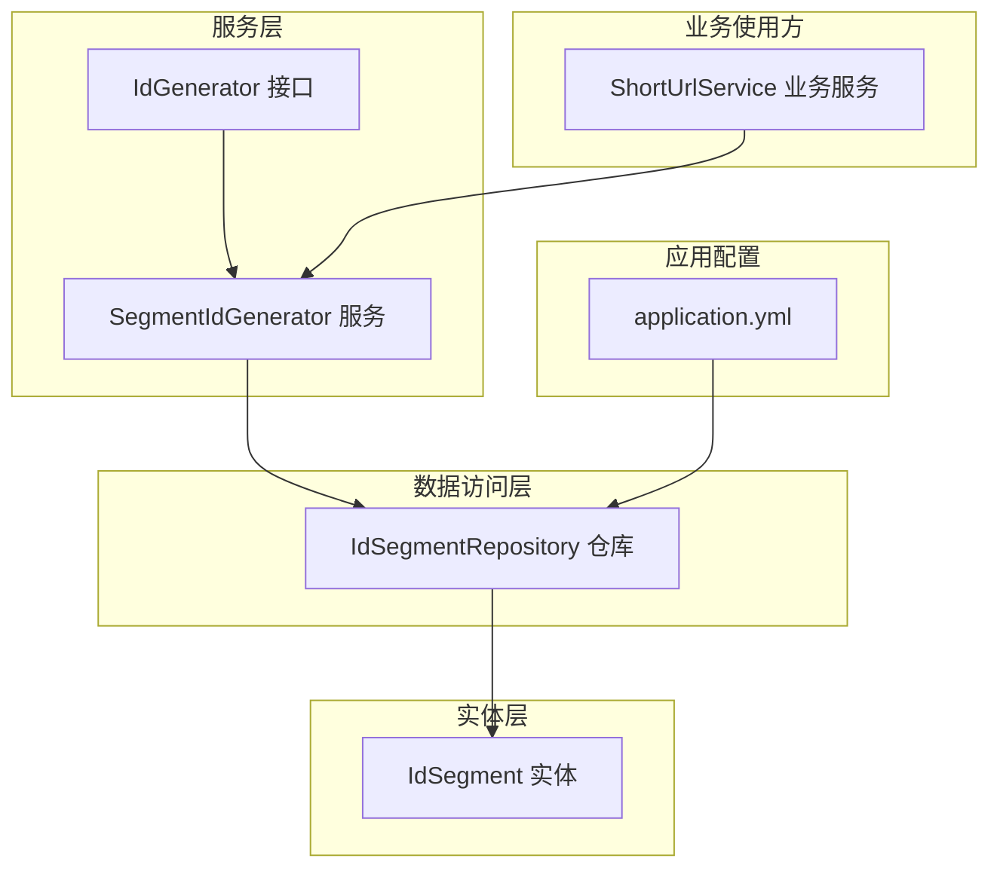
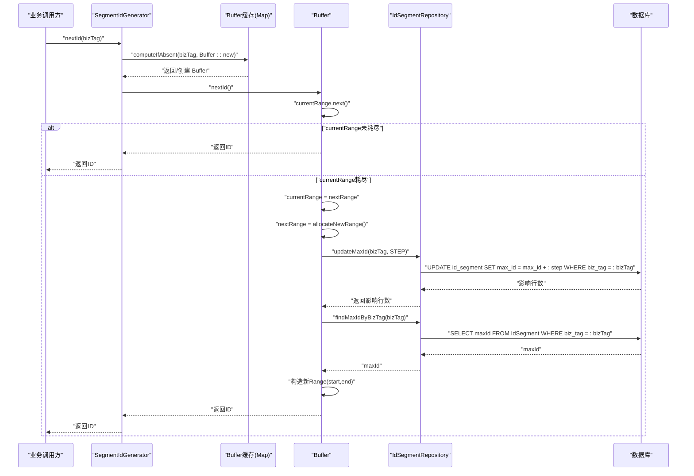
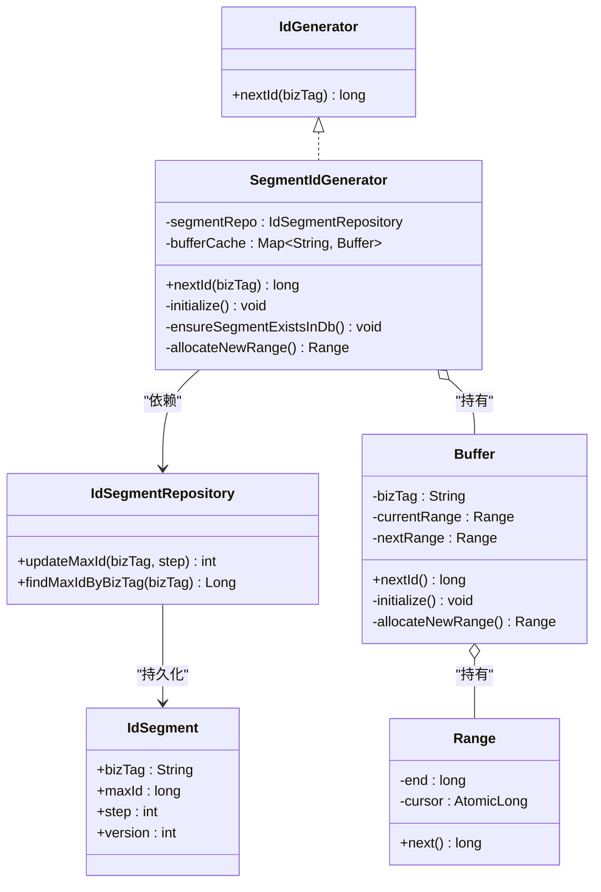
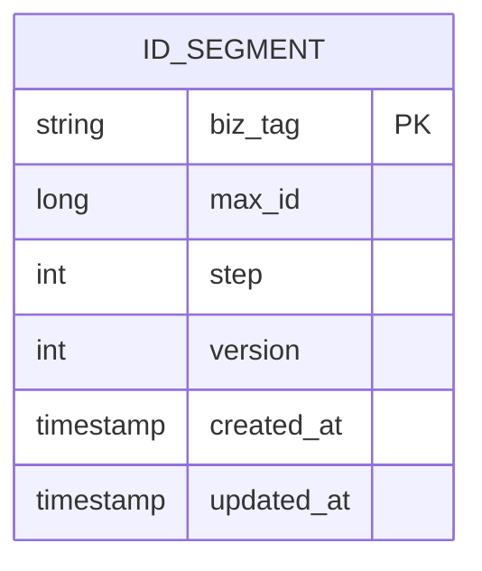

# 号段ID生成器

<cite>
**本文引用的文件列表**
- [SegmentIdGenerator.java](file://src/main/java/com/layor/tinyflow/service/SegmentIdGenerator.java)
- [IdSegmentRepository.java](file://src/main/java/com/layor/tinyflow/repository/IdSegmentRepository.java)
- [IdSegment.java](file://src/main/java/com/layor/tinyflow/entity/IdSegment.java)
- [IdGenerator.java](file://src/main/java/com/layor/tinyflow/service/IdGenerator.java)
- [application.yml](file://src/main/resources/application.yml)
- [ShortUrlService.java](file://src/main/java/com/layor/tinyflow/service/ShortUrlService.java)
- [ShortUrlServiceTest.java](file://src/test/java/com/layor/tinyflow/service/ShortUrlServiceTest.java)
</cite>

## 目录
1. [简介](#简介)
2. [项目结构](#项目结构)
3. [核心组件](#核心组件)
4. [架构总览](#架构总览)
5. [详细组件分析](#详细组件分析)
6. [依赖关系分析](#依赖关系分析)
7. [性能考量](#性能考量)
8. [故障排查指南](#故障排查指南)
9. [结论](#结论)
10. [附录](#附录)

## 简介
本架构文档围绕号段ID生成器“SegmentIdGenerator”展开，系统性阐述其如何通过“双缓冲（current/next Range）+ 数据库存储 + 原子更新”的组合实现高性能、高可用的分布式ID生成。重点包括：
- 双缓冲设计：通过Buffer内部类维护current与next两个Range，避免切换时阻塞。
- 并发安全：利用数据库行级锁与updateMaxId原子操作，保障多实例并发下的唯一性与一致性。
- 预取策略：每次从数据库预取固定步长（STEP=100,000）的ID区间，降低数据库访问频率。
- 内存分配：使用AtomicLong在内存中高效分配ID，减少锁竞争。
- 缓存隔离：以bizTag为键的ConcurrentHashMap为不同业务标签提供独立缓冲区，避免跨业务干扰。
- 懒加载初始化：computeIfAbsent按需创建Buffer，首次使用时完成数据库记录校验与两段号段的预加载。

## 项目结构
与号段ID生成器直接相关的模块与文件如下：
- 服务层：SegmentIdGenerator（ID生成核心）、IdGenerator接口（统一入口）
- 数据访问层：IdSegmentRepository（JPA仓库，提供原子更新与查询）
- 实体层：IdSegment（持久化表结构）
- 应用配置：application.yml（数据源、连接池、线程池等）
- 使用方：ShortUrlService（业务侧调用nextId）

图表来源
- [SegmentIdGenerator.java](file://src/main/java/com/layor/tinyflow/service/SegmentIdGenerator.java#L1-L139)
- [IdSegmentRepository.java](file://src/main/java/com/layor/tinyflow/repository/IdSegmentRepository.java#L1-L41)
- [IdSegment.java](file://src/main/java/com/layor/tinyflow/entity/IdSegment.java#L1-L42)
- [application.yml](file://src/main/resources/application.yml#L1-L120)
- [ShortUrlService.java](file://src/main/java/com/layor/tinyflow/service/ShortUrlService.java#L50-L75)

章节来源
- [SegmentIdGenerator.java](file://src/main/java/com/layor/tinyflow/service/SegmentIdGenerator.java#L1-L139)
- [IdSegmentRepository.java](file://src/main/java/com/layor/tinyflow/repository/IdSegmentRepository.java#L1-L41)
- [IdSegment.java](file://src/main/java/com/layor/tinyflow/entity/IdSegment.java#L1-L42)
- [application.yml](file://src/main/resources/application.yml#L1-L120)
- [ShortUrlService.java](file://src/main/java/com/layor/tinyflow/service/ShortUrlService.java#L50-L75)

## 核心组件
- SegmentIdGenerator：实现IdGenerator接口，负责bizTag到Buffer的映射、懒加载、nextId分发与Buffer生命周期管理。
- Buffer：每个bizTag对应一个Buffer，内部包含current与next两个Range，负责同步获取ID、切换号段与预取新号段。
- Range：表示一个连续ID区间[start, end]，使用AtomicLong作为游标，提供无锁的内存分配能力。
- IdSegmentRepository：提供原子更新max_id与查询最新max_id的能力，配合数据库行锁保证并发安全。
- IdSegment：持久化实体，包含biz_tag、max_id、step、version等字段。
- IdGenerator：统一的ID生成接口，便于替换实现与测试。

章节来源
- [SegmentIdGenerator.java](file://src/main/java/com/layor/tinyflow/service/SegmentIdGenerator.java#L1-L139)
- [IdSegmentRepository.java](file://src/main/java/com/layor/tinyflow/repository/IdSegmentRepository.java#L1-L41)
- [IdSegment.java](file://src/main/java/com/layor/tinyflow/entity/IdSegment.java#L1-L42)
- [IdGenerator.java](file://src/main/java/com/layor/tinyflow/service/IdGenerator.java#L1-L8)

## 架构总览
号段ID生成器的整体工作流如下：
- 业务侧调用nextId(bizTag)，通过ConcurrentHashMap按需创建Buffer。
- Buffer内部维护current与next两个Range，优先从current分配。
- 当current耗尽时，同步切换到next，并立即预取新的Range。
- 新Range通过updateMaxId原子更新数据库max_id，随后查询最新max_id计算[start, end]。
- 分配过程在内存中使用AtomicLong进行自增，避免锁竞争。
- 不同bizTag拥有独立Buffer，互不影响。

图表来源
- [SegmentIdGenerator.java](file://src/main/java/com/layor/tinyflow/service/SegmentIdGenerator.java#L32-L116)
- [IdSegmentRepository.java](file://src/main/java/com/layor/tinyflow/repository/IdSegmentRepository.java#L21-L38)
- [IdSegment.java](file://src/main/java/com/layor/tinyflow/entity/IdSegment.java#L18-L33)

## 详细组件分析

### SegmentIdGenerator 类
- 职责
  - 提供统一的nextId(bizTag)入口，按bizTag隔离缓冲区。
  - 通过ConcurrentHashMap实现懒加载，首次使用时初始化Buffer。
- 关键点
  - computeIfAbsent(bizTag, Buffer::new)：按需创建Buffer，避免不必要的初始化。
  - Buffer内部的synchronized nextId()：保证切换current/next时的可见性与原子性。
  - initialize()：确保数据库记录存在，并预加载两段号段，减少首次延迟。
  - ensureSegmentExistsInDb()：并发插入由数据库唯一约束兜底，异常被忽略以保证后续流程继续。
  - allocateNewRange()：原子更新max_id并查询最新max_id，计算[start, end]，返回新Range。
- 复杂度
  - nextId()：O(1)（内存分配），数据库操作仅在号段耗尽时触发。
  - allocateNewRange()：单次数据库写+读，受数据库性能影响。

章节来源
- [SegmentIdGenerator.java](file://src/main/java/com/layor/tinyflow/service/SegmentIdGenerator.java#L32-L116)

### Buffer 内部类
- 设计要点
  - 双缓冲：currentRange用于当前分配；nextRange用于预加载，避免切换阻塞。
  - volatile修饰：保证currentRange与nextRange的可见性。
  - synchronized nextId()：在切换与分配之间保持原子性。
- 生命周期
  - initialize()：ensureSegmentExistsInDb()后，立即allocateNewRange两次，形成初始的current与next。
  - nextId()：先从current分配，耗尽则交换current与next，并重新allocateNewRange。
- 性能收益
  - 切换时无需阻塞其他线程，提升吞吐。
  - 预取新号段，减少数据库访问次数。

章节来源
- [SegmentIdGenerator.java](file://src/main/java/com/layor/tinyflow/service/SegmentIdGenerator.java#L41-L116)

### Range 类
- 设计要点
  - 使用AtomicLong作为cursor，初始值为start-1，使第一次incrementAndGet得到start。
  - next()：自增后判断是否超过end，未超限返回ID，否则返回-1表示耗尽。
- 复杂度
  - next()：O(1)，无锁自增，适合高并发场景。
- 并发特性
  - 由于cursor是AtomicLong，Range内部分配天然无锁，避免了synchronized带来的竞争。

章节来源
- [SegmentIdGenerator.java](file://src/main/java/com/layor/tinyflow/service/SegmentIdGenerator.java#L120-L139)

### IdSegmentRepository 与 IdSegment 实体
- 原子更新
  - updateMaxId(@Param("bizTag") String, @Param("step") int)：使用原生SQL对max_id进行原子累加，配合WHERE条件确保只更新匹配biz_tag的记录。
  - findMaxIdByBizTag(@Param("bizTag") String)：查询最新max_id，作为新区间的end。
- 实体字段
  - biz_tag：业务标识，主键。
  - max_id：当前最大ID，原子更新的目标。
  - step：每次预取步长（默认100,000）。
  - version：乐观锁版本号（实体定义中存在，但仓库未使用）。
- 并发安全
  - 数据库行锁与原子更新保证同一biz_tag的并发安全。
  - findMaxIdByBizTag在事务内执行，确保读到最新值。

章节来源
- [IdSegmentRepository.java](file://src/main/java/com/layor/tinyflow/repository/IdSegmentRepository.java#L21-L38)
- [IdSegment.java](file://src/main/java/com/layor/tinyflow/entity/IdSegment.java#L18-L33)

### 使用方：ShortUrlService
- 调用链
  - ShortUrlService在创建短链时，通过注入的SegmentIdGenerator获取bizTag="shorturl"的ID。
  - 该调用在单元测试中被模拟，验证ID生成与编码策略的协作。
- 隔离性
  - 业务侧通过bizTag隔离不同业务的ID生成，避免冲突。

章节来源
- [ShortUrlService.java](file://src/main/java/com/layor/tinyflow/service/ShortUrlService.java#L50-L75)
- [ShortUrlServiceTest.java](file://src/test/java/com/layor/tinyflow/service/ShortUrlServiceTest.java#L90-L110)

## 依赖关系分析

图表来源
- [SegmentIdGenerator.java](file://src/main/java/com/layor/tinyflow/service/SegmentIdGenerator.java#L1-L139)
- [IdSegmentRepository.java](file://src/main/java/com/layor/tinyflow/repository/IdSegmentRepository.java#L1-L41)
- [IdSegment.java](file://src/main/java/com/layor/tinyflow/entity/IdSegment.java#L1-L42)
- [IdGenerator.java](file://src/main/java/com/layor/tinyflow/service/IdGenerator.java#L1-L8)

## 性能考量
- 号段预取（STEP=100,000）
  - 减少数据库写入与查询次数，显著降低热点时段的数据库压力。
  - 在高并发场景下，内存中的AtomicLong分配几乎无锁，吞吐极高。
- 双缓冲切换
  - 切换时无需阻塞其他线程，提升整体QPS。
  - 预加载nextRange，避免切换瞬间的等待。
- 并发安全
  - updateMaxId采用原子更新与行锁，确保同一biz_tag的唯一性。
  - findMaxIdByBizTag在事务内执行，读到最新max_id。
- 连接池与线程池
  - application.yml配置了较大的Hikari连接池与Tomcat线程池，有利于支撑高并发请求。
- 潜在瓶颈
  - 数据库写入峰值：当大量bizTag同时耗尽号段时，可能出现写入竞争。
  - 预取步长：STEP过大可能导致max_id增长过快，STEP过小会增加数据库访问频率。
  - 缓存命中：bufferCache为每个bizTag维护独立Buffer，避免跨业务干扰，但需关注bizTag数量与内存占用。

章节来源
- [SegmentIdGenerator.java](file://src/main/java/com/layor/tinyflow/service/SegmentIdGenerator.java#L41-L116)
- [IdSegmentRepository.java](file://src/main/java/com/layor/tinyflow/repository/IdSegmentRepository.java#L21-L38)
- [application.yml](file://src/main/resources/application.yml#L1-L120)

## 故障排查指南
- 数据库更新失败
  - allocateNewRange()在updateMaxId返回0时抛出异常，通常表示biz_tag不存在或更新被阻塞。
  - 建议检查biz_tag是否正确、数据库连接状态与事务隔离级别。
- 号段耗尽
  - 若业务频繁调用导致号段快速耗尽，可适当增大STEP或优化业务侧缓存策略。
- 并发插入重复
  - ensureSegmentExistsInDb()在并发插入时由数据库唯一约束保证最终只有一个成功，异常被忽略以保证后续流程继续。
- 事务与锁
  - updateMaxId与findMaxIdByBizTag均在事务内执行，确保一致性。
- 使用方集成问题
  - ShortUrlService在单元测试中通过mock注入idGenerator，验证nextId("shorturl")返回预期值。

章节来源
- [SegmentIdGenerator.java](file://src/main/java/com/layor/tinyflow/service/SegmentIdGenerator.java#L78-L116)
- [IdSegmentRepository.java](file://src/main/java/com/layor/tinyflow/repository/IdSegmentRepository.java#L21-L38)
- [ShortUrlServiceTest.java](file://src/test/java/com/layor/tinyflow/service/ShortUrlServiceTest.java#L90-L110)

## 结论
SegmentIdGenerator通过“双缓冲+原子更新+内存分配”的组合，在保证并发安全的前提下实现了极高的吞吐与低延迟。其核心优势在于：
- 高效的内存分配（AtomicLong）与预取策略（STEP=100,000）。
- 数据库行锁与原子更新确保唯一性与一致性。
- 按bizTag隔离的Buffer缓存，避免跨业务干扰。
- 懒加载初始化，按需创建，降低启动成本。

在高并发场景下，建议结合数据库连接池、线程池配置与合理的STEP大小，持续监控数据库写入峰值与号段耗尽频率，以获得最佳性能与稳定性。

## 附录

### 调用链示例路径
- nextId(bizTag) 调用链
  - [SegmentIdGenerator.nextId](file://src/main/java/com/layor/tinyflow/service/SegmentIdGenerator.java#L32-L36)
  - [Buffer.nextId](file://src/main/java/com/layor/tinyflow/service/SegmentIdGenerator.java#L57-L67)
  - [Buffer.allocateNewRange](file://src/main/java/com/layor/tinyflow/service/SegmentIdGenerator.java#L100-L116)
  - [IdSegmentRepository.updateMaxId](file://src/main/java/com/layor/tinyflow/repository/IdSegmentRepository.java#L21-L27)
  - [IdSegmentRepository.findMaxIdByBizTag](file://src/main/java/com/layor/tinyflow/repository/IdSegmentRepository.java#L31-L38)

### 数据模型图

图表来源
- [IdSegment.java](file://src/main/java/com/layor/tinyflow/entity/IdSegment.java#L18-L41)