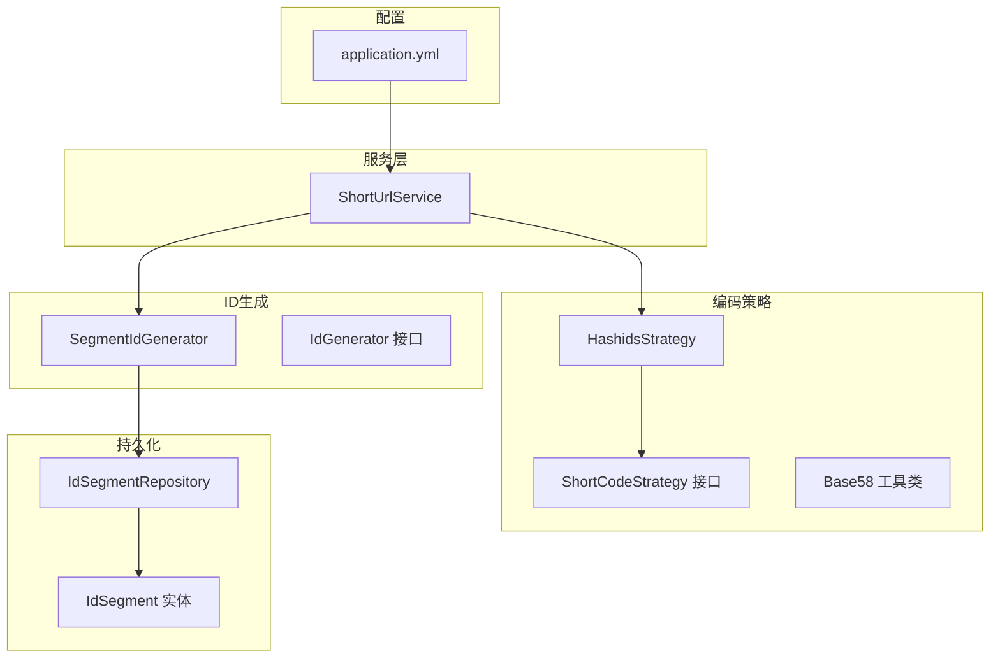
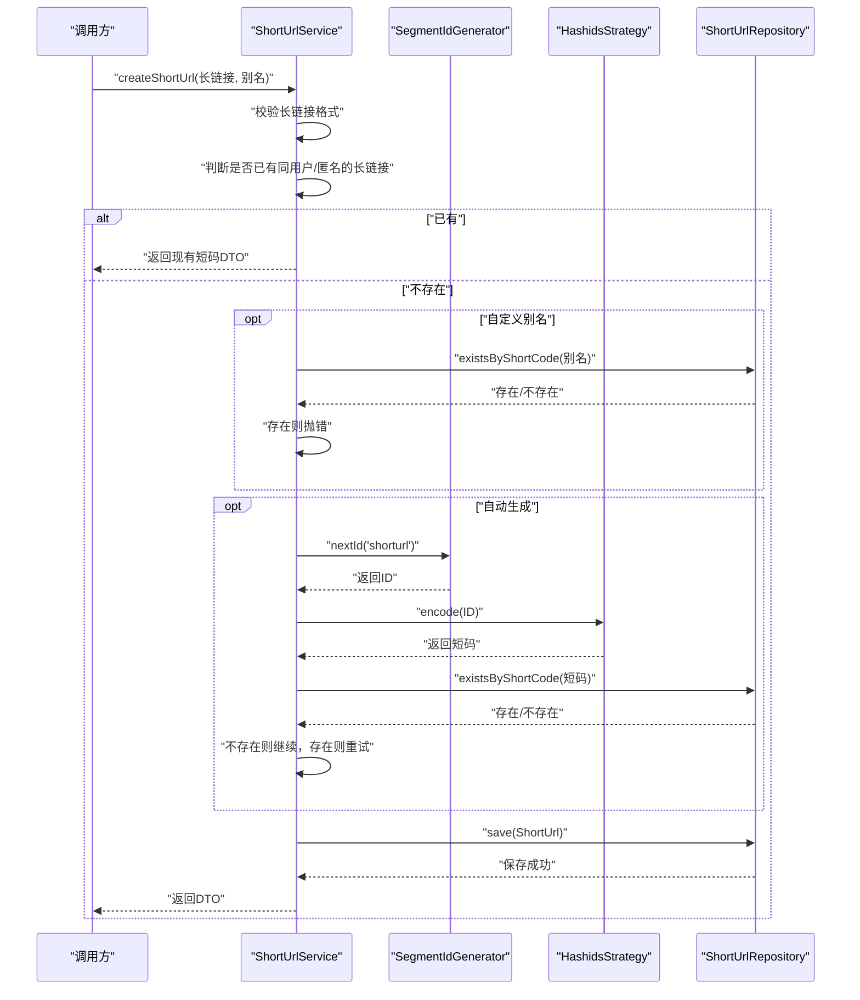
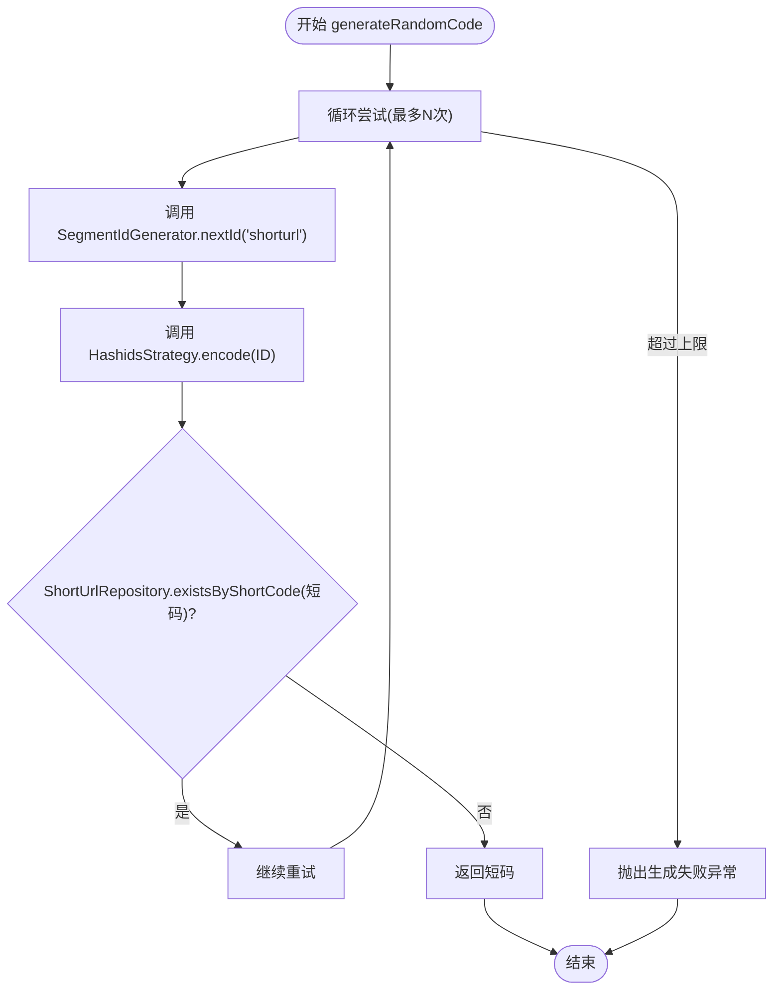
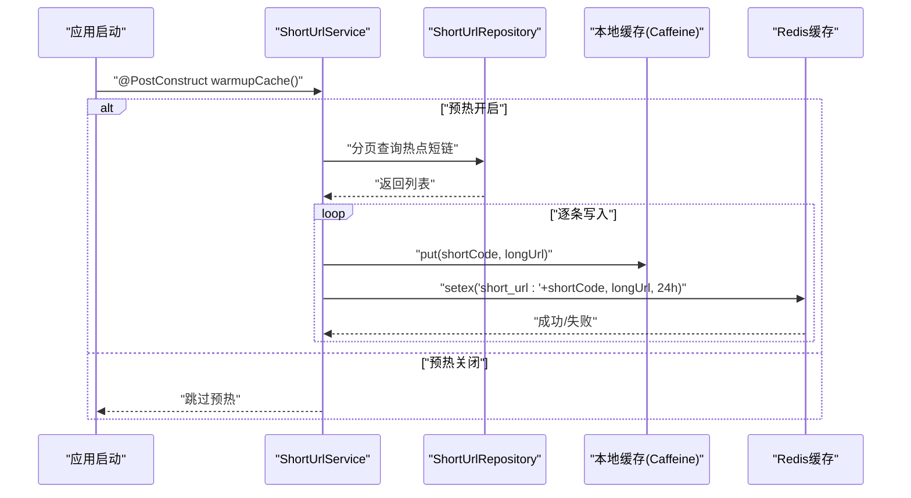
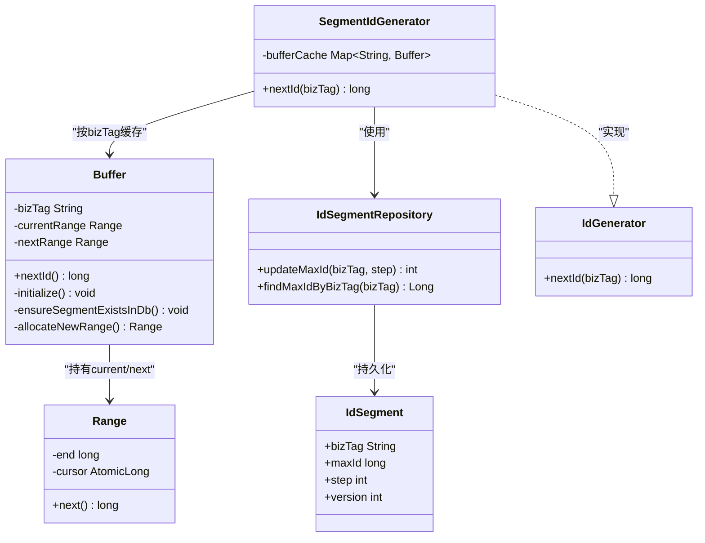
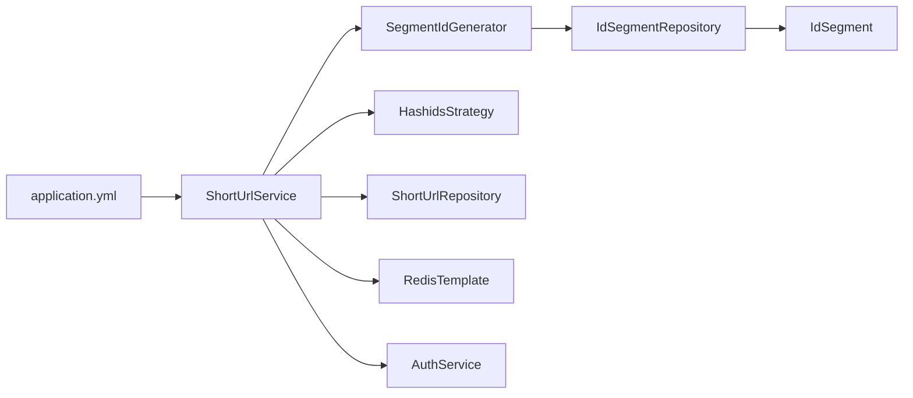

# 短码生成

<cite>
**本文引用的文件**
- [ShortUrlService.java](file://src/main/java/com/layor/tinyflow/service/ShortUrlService.java)
- [SegmentIdGenerator.java](file://src/main/java/com/layor/tinyflow/service/SegmentIdGenerator.java)
- [IdSegmentRepository.java](file://src/main/java/com/layor/tinyflow/repository/IdSegmentRepository.java)
- [IdSegment.java](file://src/main/java/com/layor/tinyflow/entity/IdSegment.java)
- [HashidsStrategy.java](file://src/main/java/com/layor/tinyflow/Strategy/HashidsStrategy.java)
- [ShortCodeStrategy.java](file://src/main/java/com/layor/tinyflow/Strategy/ShortCodeStrategy.java)
- [Base58.java](file://src/main/java/com/layor/tinyflow/Util/Base58.java)
- [IdGenerator.java](file://src/main/java/com/layor/tinyflow/service/IdGenerator.java)
- [application.yml](file://src/main/resources/application.yml)
- [ShortUrlServiceTest.java](file://src/test/java/com/layor/tinyflow/service/ShortUrlServiceTest.java)
</cite>

## 目录
1. [简介](#简介)
2. [项目结构与定位](#项目结构与定位)
3. [核心组件总览](#核心组件总览)
4. [架构概览](#架构概览)
5. [详细组件分析](#详细组件分析)
6. [依赖关系分析](#依赖关系分析)
7. [性能与可用性特性](#性能与可用性特性)
8. [故障排查指南](#故障排查指南)
9. [结论](#结论)

## 简介
本篇文档聚焦于短链接服务中的“短码生成机制”。围绕以下目标展开：
- 深入解析 ShortUrlService 中 createShortUrl 方法的全流程：长链接校验、别名冲突检测、短码生成与落库。
- 详解 SegmentIdGenerator 实现的号段模式 ID 生成器：双 Buffer（current/next Range）预分配、数据库行锁保证并发安全、updateMaxId 原子操作与高可用。
- 解释 HashidsStrategy 如何将长整型 ID 通过 Hashids 算法编码为短字符串；结合 Base58 工具类（如适用）进行进一步编码以生成 6 位可读短码。
- 展示 generateRandomCode 方法中 ID 生成、编码与冲突重试的完整调用链。
- 说明 @PostConstruct 注解的 warmupCache 方法如何预热缓存以提升性能。

## 项目结构与定位
- 短码生成相关代码主要位于 service 层与 Strategy 层：
  - 服务层：ShortUrlService 负责对外接口、业务编排、缓存与持久化交互。
  - ID 生成：SegmentIdGenerator 提供基于号段的高并发 ID 分配。
  - 编码策略：HashidsStrategy 将 ID 编码为短字符串；Base58 作为可选工具类。
  - 配置：application.yml 提供缓存、限流、熔断等运行参数。

图表来源
- [ShortUrlService.java](file://src/main/java/com/layor/tinyflow/service/ShortUrlService.java#L70-L138)
- [SegmentIdGenerator.java](file://src/main/java/com/layor/tinyflow/service/SegmentIdGenerator.java#L32-L116)
- [IdSegmentRepository.java](file://src/main/java/com/layor/tinyflow/repository/IdSegmentRepository.java#L21-L38)
- [IdSegment.java](file://src/main/java/com/layor/tinyflow/entity/IdSegment.java#L11-L42)
- [HashidsStrategy.java](file://src/main/java/com/layor/tinyflow/Strategy/HashidsStrategy.java#L12-L16)
- [ShortCodeStrategy.java](file://src/main/java/com/layor/tinyflow/Strategy/ShortCodeStrategy.java#L4-L6)
- [Base58.java](file://src/main/java/com/layor/tinyflow/Util/Base58.java#L1-L21)
- [application.yml](file://src/main/resources/application.yml#L141-L147)

章节来源
- [ShortUrlService.java](file://src/main/java/com/layor/tinyflow/service/ShortUrlService.java#L70-L138)
- [SegmentIdGenerator.java](file://src/main/java/com/layor/tinyflow/service/SegmentIdGenerator.java#L32-L116)
- [application.yml](file://src/main/resources/application.yml#L141-L147)

## 核心组件总览
- ShortUrlService：对外提供 createShortUrl、redirectCode、getLongUrlByShortCode 等能力；内置三级缓存（本地 Caffeine + Redis + DB）与预热。
- SegmentIdGenerator：基于号段的 ID 生成器，采用双 Buffer 预取、数据库行锁保证并发安全、原子更新 max_id。
- HashidsStrategy：将长整型 ID 编码为短字符串；可配合 Base58 工具类进行进一步编码。
- IdSegmentRepository/IdSegment：持久化号段元数据，提供原子更新 max_id 与查询最新 max_id。

章节来源
- [ShortUrlService.java](file://src/main/java/com/layor/tinyflow/service/ShortUrlService.java#L70-L138)
- [SegmentIdGenerator.java](file://src/main/java/com/layor/tinyflow/service/SegmentIdGenerator.java#L32-L116)
- [HashidsStrategy.java](file://src/main/java/com/layor/tinyflow/Strategy/HashidsStrategy.java#L12-L16)
- [IdSegmentRepository.java](file://src/main/java/com/layor/tinyflow/repository/IdSegmentRepository.java#L21-L38)
- [IdSegment.java](file://src/main/java/com/layor/tinyflow/entity/IdSegment.java#L11-L42)

## 架构概览
短码生成的关键调用链如下：
- createShortUrl：长链接校验 → 别名冲突检测 → 自动短码生成（ID 生成 + 编码 + 冲突重试）→ 落库 → 返回 DTO。
- generateRandomCode：循环尝试（最多若干次）→ 从 SegmentIdGenerator 获取 ID → 用 HashidsStrategy 编码 → 检查短码是否已存在 → 不存在则返回，否则继续重试。
- warmupCache：启动时预热本地与 Redis 缓存，减少冷启动延迟。

图表来源
- [ShortUrlService.java](file://src/main/java/com/layor/tinyflow/service/ShortUrlService.java#L70-L138)
- [SegmentIdGenerator.java](file://src/main/java/com/layor/tinyflow/service/SegmentIdGenerator.java#L32-L116)
- [HashidsStrategy.java](file://src/main/java/com/layor/tinyflow/Strategy/HashidsStrategy.java#L12-L16)

## 详细组件分析

### ShortUrlService.createShortUrl 流程
- 长链接校验：使用 URI 解析与协议前缀判断，确保输入合法。
- 用户归属：获取当前登录用户 ID；若未登录则尝试绑定默认用户。
- 已有长链接复用：若同一用户（或匿名）已存在相同长链接，则直接返回现有短码。
- 别名处理：
  - 若传入自定义别名，先检查是否已存在，存在则抛错。
  - 若为空或未传入，则进入自动生成流程。
- 自动短码生成：调用 generateRandomCode，内部循环尝试获取可用短码。
- 落库与返回：保存 ShortUrl 记录并构造 DTO 返回。

章节来源
- [ShortUrlService.java](file://src/main/java/com/layor/tinyflow/service/ShortUrlService.java#L70-L138)

### generateRandomCode 调用链与冲突重试
- 循环上限：最多尝试若干次（例如多次）。
- 步骤：
  1) SegmentIdGenerator.nextId("shorturl") 获取下一个 ID。
  2) HashidsStrategy.encode(ID) 将 ID 编码为短字符串。
  3) 检查 ShortUrlRepository 是否已存在该短码；若存在则继续重试，直至可用或达到上限。
  4) 返回可用短码。
- 异常：若多次重试仍不可用，抛出异常提示生成失败。

图表来源
- [ShortUrlService.java](file://src/main/java/com/layor/tinyflow/service/ShortUrlService.java#L140-L148)
- [SegmentIdGenerator.java](file://src/main/java/com/layor/tinyflow/service/SegmentIdGenerator.java#L32-L67)
- [HashidsStrategy.java](file://src/main/java/com/layor/tinyflow/Strategy/HashidsStrategy.java#L12-L16)

章节来源
- [ShortUrlService.java](file://src/main/java/com/layor/tinyflow/service/ShortUrlService.java#L140-L148)

### warmupCache 预热缓存
- 启动时按配置决定是否启用预热与预热规模。
- 从数据库分页拉取热点短链，填充本地 Caffeine 缓存与 Redis 缓存。
- 异常处理：Redis 预热失败会记录告警但不影响整体流程。

图表来源
- [ShortUrlService.java](file://src/main/java/com/layor/tinyflow/service/ShortUrlService.java#L162-L200)
- [application.yml](file://src/main/resources/application.yml#L141-L147)

章节来源
- [ShortUrlService.java](file://src/main/java/com/layor/tinyflow/service/ShortUrlService.java#L162-L200)
- [application.yml](file://src/main/resources/application.yml#L141-L147)

### SegmentIdGenerator 号段模式 ID 生成器
- 双 Buffer 机制：
  - 每个 bizTag 对应一个 Buffer，内部维护 currentRange 与 nextRange。
  - currentRange 正在使用，nextRange 预加载，避免切换时阻塞。
- 预分配策略：
  - 初始化时加载两段号段；每次耗尽后同步切换并拉取新段。
  - 每段大小固定（例如 100000），减少数据库更新频率。
- 并发安全与原子性：
  - allocateNewRange 中通过 updateMaxId 原子更新 max_id，配合数据库行锁，保证多实例并发下的唯一性。
  - 更新后查询最新 max_id，计算新区间 [start, end]。
- Range 游标：
  - 使用原子游标 cursor 控制当前分配位置，越界返回 -1 触发切换。

图表来源
- [SegmentIdGenerator.java](file://src/main/java/com/layor/tinyflow/service/SegmentIdGenerator.java#L32-L116)
- [IdSegmentRepository.java](file://src/main/java/com/layor/tinyflow/repository/IdSegmentRepository.java#L21-L38)
- [IdSegment.java](file://src/main/java/com/layor/tinyflow/entity/IdSegment.java#L11-L42)
- [IdGenerator.java](file://src/main/java/com/layor/tinyflow/service/IdGenerator.java#L1-L8)

章节来源
- [SegmentIdGenerator.java](file://src/main/java/com/layor/tinyflow/service/SegmentIdGenerator.java#L32-L116)
- [IdSegmentRepository.java](file://src/main/java/com/layor/tinyflow/repository/IdSegmentRepository.java#L21-L38)
- [IdSegment.java](file://src/main/java/com/layor/tinyflow/entity/IdSegment.java#L11-L42)
- [IdGenerator.java](file://src/main/java/com/layor/tinyflow/service/IdGenerator.java#L1-L8)

### HashidsStrategy 与 Base58 编码
- HashidsStrategy：
  - 实现 ShortCodeStrategy 接口，将长整型 ID 通过 Hashids.encode 编码为短字符串。
- Base58 工具类：
  - 提供将长整型数值编码为 Base58 字符串的能力；在本仓库中未直接用于短码生成，但可作为可读性增强的备选方案。
- 短码长度：
  - 代码中定义了固定长度常量，用于控制短码长度（例如 6 位），具体策略可结合 Hashids 的输出长度与业务需求调整。

章节来源
- [HashidsStrategy.java](file://src/main/java/com/layor/tinyflow/Strategy/HashidsStrategy.java#L12-L16)
- [ShortCodeStrategy.java](file://src/main/java/com/layor/tinyflow/Strategy/ShortCodeStrategy.java#L4-L6)
- [Base58.java](file://src/main/java/com/layor/tinyflow/Util/Base58.java#L1-L21)
- [ShortUrlService.java](file://src/main/java/com/layor/tinyflow/service/ShortUrlService.java#L37-L40)

## 依赖关系分析
- ShortUrlService 依赖：
  - SegmentIdGenerator（ID 生成）、HashidsStrategy（短码编码）、ShortUrlRepository（持久化）、RedisTemplate（缓存）、AuthService（用户上下文）。
- SegmentIdGenerator 依赖：
  - IdSegmentRepository（数据库原子更新与查询）、IdSegment（实体映射）。
- 配置依赖：
  - application.yml 中的 cache.warmup.* 与 resilience4j 配置影响预热与运行稳定性。

图表来源
- [ShortUrlService.java](file://src/main/java/com/layor/tinyflow/service/ShortUrlService.java#L50-L66)
- [SegmentIdGenerator.java](file://src/main/java/com/layor/tinyflow/service/SegmentIdGenerator.java#L22-L30)
- [IdSegmentRepository.java](file://src/main/java/com/layor/tinyflow/repository/IdSegmentRepository.java#L10-L38)
- [IdSegment.java](file://src/main/java/com/layor/tinyflow/entity/IdSegment.java#L11-L42)
- [application.yml](file://src/main/resources/application.yml#L141-L147)

章节来源
- [ShortUrlService.java](file://src/main/java/com/layor/tinyflow/service/ShortUrlService.java#L50-L66)
- [application.yml](file://src/main/resources/application.yml#L141-L147)

## 性能与可用性特性
- 号段预分配与双 Buffer：
  - 减少数据库更新频率，提高吞吐；切换时无需阻塞，降低尾延迟。
- 数据库行锁与原子更新：
  - updateMaxId 原子更新 + 查询最新 max_id，保证并发安全与全局唯一。
- 三级缓存：
  - 本地 Caffeine + Redis + DB，命中优先级逐级下降，显著降低 DB 压力。
- 启动预热：
  - warmupCache 在启动时批量加载热点短链，缩短首请求延迟。
- 限流与熔断：
  - application.yml 中配置了限流与熔断参数，保障系统在高负载下的稳定性。

章节来源
- [SegmentIdGenerator.java](file://src/main/java/com/layor/tinyflow/service/SegmentIdGenerator.java#L32-L116)
- [ShortUrlService.java](file://src/main/java/com/layor/tinyflow/service/ShortUrlService.java#L162-L200)
- [application.yml](file://src/main/resources/application.yml#L141-L147)

## 故障排查指南
- 短码生成失败：
  - 检查 generateRandomCode 的重试次数与冲突检测逻辑是否生效。
  - 关注 HashidsStrategy 编码后的短码长度是否符合预期。
- ID 分配异常：
  - 核对 IdSegmentRepository.updateMaxId 是否成功执行；确认数据库连接与事务配置。
- 缓存预热失败：
  - Redis 预热失败会被记录告警，不影响主流程；可检查 Redis 连接与容量。
- 长链接校验失败：
  - 确认输入 URL 符合 http/https 且可解析。

章节来源
- [ShortUrlService.java](file://src/main/java/com/layor/tinyflow/service/ShortUrlService.java#L140-L148)
- [SegmentIdGenerator.java](file://src/main/java/com/layor/tinyflow/service/SegmentIdGenerator.java#L100-L116)
- [application.yml](file://src/main/resources/application.yml#L141-L147)

## 结论
短码生成机制通过“ID 生成 + 编码 + 冲突重试”的组合，在保证高并发与一致性的前提下，实现了稳定高效的短链创建流程。SegmentIdGenerator 的号段模式与双 Buffer 预分配策略有效降低了数据库压力；HashidsStrategy 提供简洁可读的短码输出；warmupCache 与三级缓存进一步提升了性能与用户体验。建议在生产环境中结合 application.yml 的限流与熔断配置，持续监控短码生成与重定向路径的延迟与错误率，以维持系统的高可用与高性能。