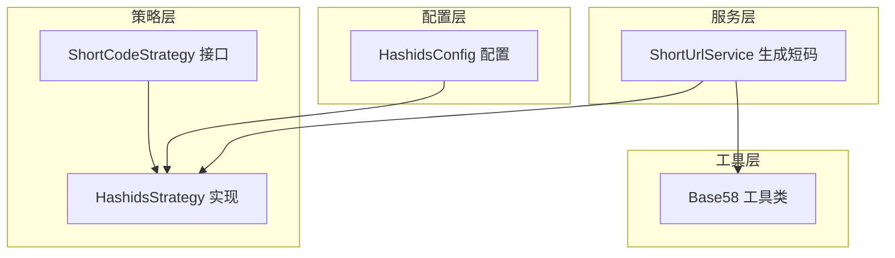
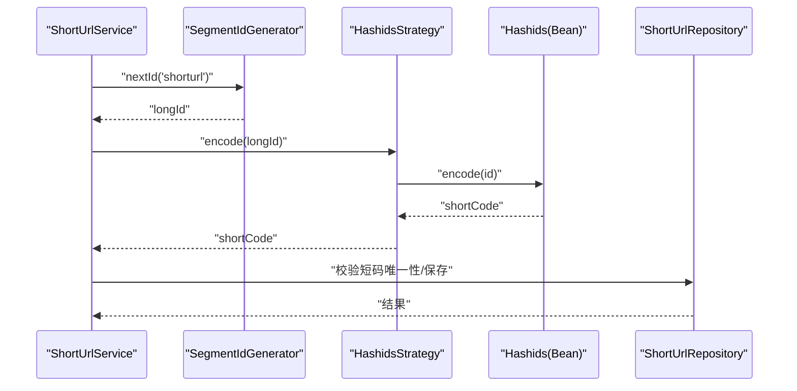
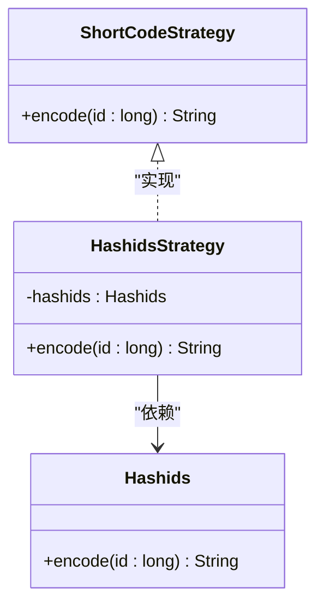
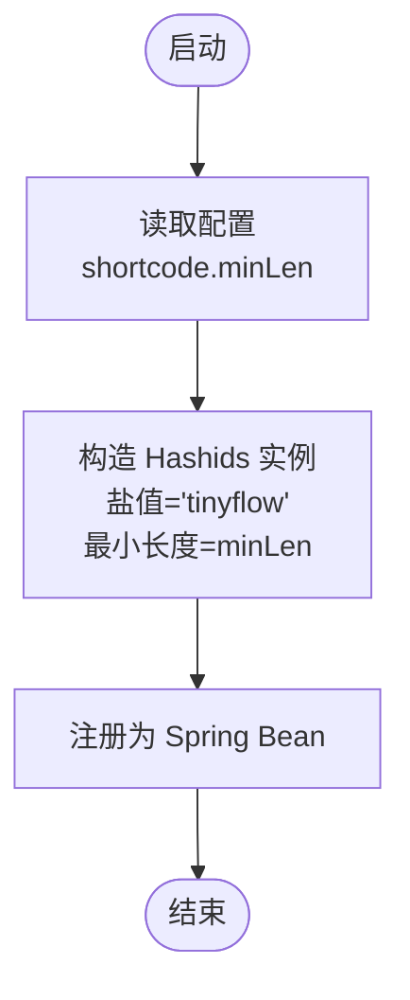
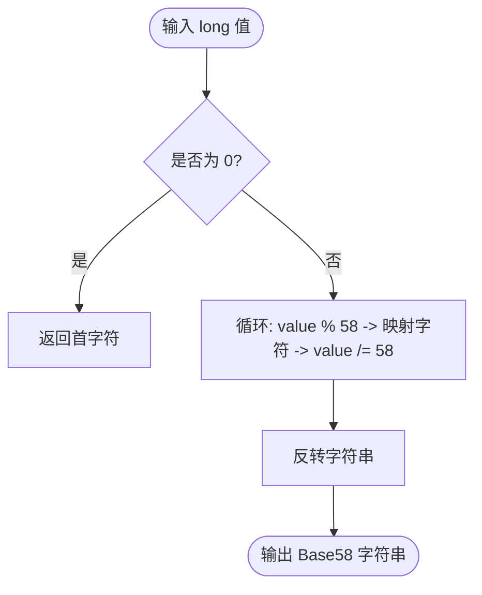
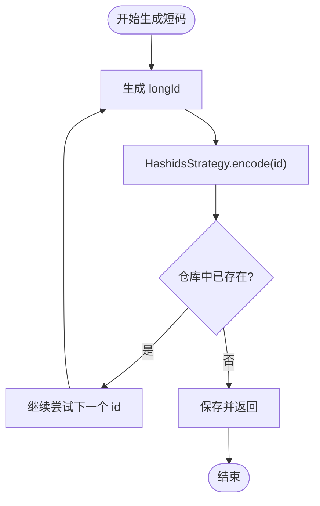
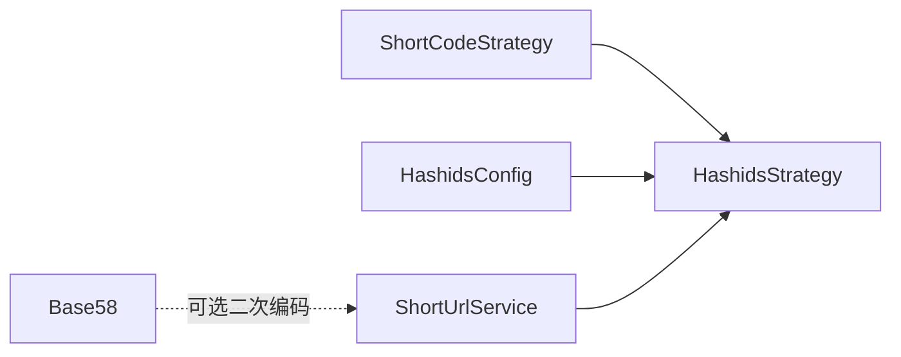

# 短码编码策略

<cite>
**本文引用的文件**
- [HashidsStrategy.java](file://src/main/java/com/layor/tinyflow/Strategy/HashidsStrategy.java)
- [ShortCodeStrategy.java](file://src/main/java/com/layor/tinyflow/Strategy/ShortCodeStrategy.java)
- [HashidsConfig.java](file://src/main/java/com/layor/tinyflow/config/HashidsConfig.java)
- [Base58.java](file://src/main/java/com/layor/tinyflow/Util/Base58.java)
- [ShortUrlService.java](file://src/main/java/com/layor/tinyflow/service/ShortUrlService.java)
- [HashidsStrategyTest.java](file://src/test/java/com/layor/tinyflow/Strategy/HashidsStrategyTest.java)
- [application.yml](file://src/main/resources/application.yml)
</cite>

## 目录
1. [简介](#简介)
2. [项目结构](#项目结构)
3. [核心组件](#核心组件)
4. [架构总览](#架构总览)
5. [详细组件分析](#详细组件分析)
6. [依赖关系分析](#依赖关系分析)
7. [性能考量](#性能考量)
8. [故障排查指南](#故障排查指南)
9. [结论](#结论)
10. [附录](#附录)

## 简介
本文件围绕短码编码策略展开，重点解析 HashidsStrategy 类如何通过依赖注入的 Hashids 实例，将长整型 ID（例如 123456）编码为短字符串（例如 “k3j2f1”）。我们将解释 Hashids 算法的关键特性，包括盐值（salt）与最小长度（minLength）配置对安全性和可读性的增强作用；同时说明 Base58 工具类在去除易混淆字符（0, O, I, l）方面的优化；最后给出 encode 方法的调用流程示意，并对比 Hashids 与直接使用 Base62 编码在安全性、长度与性能上的差异与取舍。

## 项目结构
短码策略位于 Strategy 层，采用接口 + 具体实现的分层设计；Hashids 的 Bean 在配置层按应用配置进行装配；服务层在生成短码时调用策略接口，确保生成逻辑与业务解耦。

图表来源
- [HashidsStrategy.java](file://src/main/java/com/layor/tinyflow/Strategy/HashidsStrategy.java#L1-L16)
- [ShortCodeStrategy.java](file://src/main/java/com/layor/tinyflow/Strategy/ShortCodeStrategy.java#L1-L6)
- [HashidsConfig.java](file://src/main/java/com/layor/tinyflow/config/HashidsConfig.java#L1-L15)
- [ShortUrlService.java](file://src/main/java/com/layor/tinyflow/service/ShortUrlService.java#L139-L148)
- [Base58.java](file://src/main/java/com/layor/tinyflow/Util/Base58.java#L1-L21)

章节来源
- [HashidsStrategy.java](file://src/main/java/com/layor/tinyflow/Strategy/HashidsStrategy.java#L1-L16)
- [ShortCodeStrategy.java](file://src/main/java/com/layor/tinyflow/Strategy/ShortCodeStrategy.java#L1-L6)
- [HashidsConfig.java](file://src/main/java/com/layor/tinyflow/config/HashidsConfig.java#L1-L15)
- [ShortUrlService.java](file://src/main/java/com/layor/tinyflow/service/ShortUrlService.java#L139-L148)
- [Base58.java](file://src/main/java/com/layor/tinyflow/Util/Base58.java#L1-L21)

## 核心组件
- ShortCodeStrategy 接口：定义统一的编码入口，约定 encode(long) 方法。
- HashidsStrategy 实现：通过 @Autowired 注入 Hashids，委托其完成编码。
- HashidsConfig 配置：基于 application.yml 中的 shortcode.minLen 参数，构造带盐值的 Hashids 实例。
- Base58 工具类：提供自定义字母表的编码实现，移除了易混淆字符，提升可读性。
- ShortUrlService：在生成短码时调用策略接口，确保生成逻辑与业务解耦。

章节来源
- [ShortCodeStrategy.java](file://src/main/java/com/layor/tinyflow/Strategy/ShortCodeStrategy.java#L1-L6)
- [HashidsStrategy.java](file://src/main/java/com/layor/tinyflow/Strategy/HashidsStrategy.java#L1-L16)
- [HashidsConfig.java](file://src/main/java/com/layor/tinyflow/config/HashidsConfig.java#L1-L15)
- [Base58.java](file://src/main/java/com/layor/tinyflow/Util/Base58.java#L1-L21)
- [ShortUrlService.java](file://src/main/java/com/layor/tinyflow/service/ShortUrlService.java#L139-L148)

## 架构总览
短码生成的调用链路如下：ShortUrlService 在需要自动生成短码时，从 SegmentIdGenerator 获取一个长整型 ID，然后通过 HashidsStrategy.encode 将其编码为短码；若系统中存在 Base58 的使用场景，则可在需要去除易混淆字符时作为二次编码手段。

图表来源
- [ShortUrlService.java](file://src/main/java/com/layor/tinyflow/service/ShortUrlService.java#L139-L148)
- [HashidsStrategy.java](file://src/main/java/com/layor/tinyflow/Strategy/HashidsStrategy.java#L1-L16)
- [HashidsConfig.java](file://src/main/java/com/layor/tinyflow/config/HashidsConfig.java#L1-L15)

## 详细组件分析

### HashidsStrategy 组件分析
- 依赖注入：通过 @Autowired 注入 Hashids Bean，确保策略实现与具体算法解耦。
- 编码行为：直接委托 Hashids.encode(id) 返回短码字符串。
- 可测试性：单元测试通过 Mock Hashids，验证 encode 调用与返回值。

图表来源
- [ShortCodeStrategy.java](file://src/main/java/com/layor/tinyflow/Strategy/ShortCodeStrategy.java#L1-L6)
- [HashidsStrategy.java](file://src/main/java/com/layor/tinyflow/Strategy/HashidsStrategy.java#L1-L16)

章节来源
- [HashidsStrategy.java](file://src/main/java/com/layor/tinyflow/Strategy/HashidsStrategy.java#L1-L16)
- [HashidsStrategyTest.java](file://src/test/java/com/layor/tinyflow/Strategy/HashidsStrategyTest.java#L1-L66)

### HashidsConfig 组件分析
- Bean 定义：通过 @Bean 提供 Hashids 实例，使用盐值与最小长度参数。
- 配置来源：从 application.yml 读取 shortcode.minLen，默认值为 4。
- 算法特性：
  - 盐值（salt）：用于区分不同应用或环境下的编码结果，避免跨系统碰撞。
  - 最小长度（minLength）：保证输出至少达到指定长度，提升可读性与抗推测性。

图表来源
- [HashidsConfig.java](file://src/main/java/com/layor/tinyflow/config/HashidsConfig.java#L1-L15)
- [application.yml](file://src/main/resources/application.yml#L80-L86)

章节来源
- [HashidsConfig.java](file://src/main/java/com/layor/tinyflow/config/HashidsConfig.java#L1-L15)
- [application.yml](file://src/main/resources/application.yml#L80-L86)

### Base58 工具类分析
- 字母表设计：移除易混淆字符（0, O, I, l），仅保留 58 个清晰字符，提高人工可读性与输入准确性。
- 编码流程：将 long 值按 58 进制转换，逆序拼接得到最终字符串。
- 使用建议：当需要更严格的可读性与防误读场景时，可在 Hashids 输出后进行二次 Base58 编码。

图表来源
- [Base58.java](file://src/main/java/com/layor/tinyflow/Util/Base58.java#L1-L21)

章节来源
- [Base58.java](file://src/main/java/com/layor/tinyflow/Util/Base58.java#L1-L21)

### ShortUrlService 生成短码流程
- 自动短码生成：在 createShortUrl 流程中，若未提供自定义别名，则循环调用 idGenerator.nextId 并通过 HashidsStrategy.encode 生成短码，直到生成唯一且可用的短码为止。
- 唯一性校验：生成后检查 ShortUrlRepository 是否已存在相同 shortCode，避免冲突。
- 异常处理：若多次尝试仍无法生成唯一短码，抛出异常提示生成失败。

图表来源
- [ShortUrlService.java](file://src/main/java/com/layor/tinyflow/service/ShortUrlService.java#L139-L148)

章节来源
- [ShortUrlService.java](file://src/main/java/com/layor/tinyflow/service/ShortUrlService.java#L139-L148)

## 依赖关系分析
- 接口与实现：ShortCodeStrategy 是策略接口，HashidsStrategy 实现该接口，便于替换其他编码策略。
- 配置与 Bean：HashidsConfig 通过 @Bean 注册 Hashids，Spring 容器自动注入到 HashidsStrategy。
- 服务与策略：ShortUrlService 通过策略接口依赖 HashidsStrategy，保持业务与编码实现解耦。
- 工具与策略：Base58 作为独立工具类，可在需要时用于二次编码，提升可读性。

图表来源
- [ShortCodeStrategy.java](file://src/main/java/com/layor/tinyflow/Strategy/ShortCodeStrategy.java#L1-L6)
- [HashidsStrategy.java](file://src/main/java/com/layor/tinyflow/Strategy/HashidsStrategy.java#L1-L16)
- [HashidsConfig.java](file://src/main/java/com/layor/tinyflow/config/HashidsConfig.java#L1-L15)
- [ShortUrlService.java](file://src/main/java/com/layor/tinyflow/service/ShortUrlService.java#L139-L148)
- [Base58.java](file://src/main/java/com/layor/tinyflow/Util/Base58.java#L1-L21)

章节来源
- [ShortCodeStrategy.java](file://src/main/java/com/layor/tinyflow/Strategy/ShortCodeStrategy.java#L1-L6)
- [HashidsStrategy.java](file://src/main/java/com/layor/tinyflow/Strategy/HashidsStrategy.java#L1-L16)
- [HashidsConfig.java](file://src/main/java/com/layor/tinyflow/config/HashidsConfig.java#L1-L15)
- [ShortUrlService.java](file://src/main/java/com/layor/tinyflow/service/ShortUrlService.java#L139-L148)
- [Base58.java](file://src/main/java/com/layor/tinyflow/Util/Base58.java#L1-L21)

## 性能考量
- Hashids 编码复杂度：编码与解码均为 O(k)，k 为输出长度，通常较短码场景下开销极低。
- 最小长度影响：增大 minLength 会增加输出长度，提升可读性与抗推测性，但也会略微增加存储与传输成本。
- 二次编码成本：Base58 编码为 O(log_58 N)，在短码长度较短时几乎可忽略。
- 缓存与回源：ShortUrlService 在生成短码后会进行唯一性校验与持久化，整体性能瓶颈不在编码环节。

[本节为通用性能讨论，无需特定文件来源]

## 故障排查指南
- 编码结果不符合预期
  - 检查 HashidsConfig 中盐值与最小长度配置是否符合预期。
  - 确认 application.yml 中 shortcode.minLen 是否被正确读取。
- 短码重复
  - 检查 ShortUrlService 的生成循环是否正常执行唯一性校验。
  - 若多次尝试仍失败，关注生成失败异常提示。
- 单元测试验证
  - 使用 HashidsStrategyTest 验证 encode 行为与调用次数。

章节来源
- [HashidsConfig.java](file://src/main/java/com/layor/tinyflow/config/HashidsConfig.java#L1-L15)
- [application.yml](file://src/main/resources/application.yml#L80-L86)
- [ShortUrlService.java](file://src/main/java/com/layor/tinyflow/service/ShortUrlService.java#L139-L148)
- [HashidsStrategyTest.java](file://src/test/java/com/layor/tinyflow/Strategy/HashidsStrategyTest.java#L1-L66)

## 结论
- HashidsStrategy 通过依赖注入的 Hashids 实例，将长整型 ID 编码为短字符串，具备良好的可读性与抗推测性。
- 盐值与最小长度配置增强了安全性与一致性，适合在多环境或多应用场景下使用。
- Base58 工具类通过移除易混淆字符，进一步优化可读性，可在需要时作为二次编码手段。
- 与直接使用 Base62 编码相比，Hashids 在安全性与可读性之间取得平衡，且与 Spring 配置体系无缝集成；Base62 则更简单直接，但在安全与可读性方面略逊一筹。

[本节为总结性内容，无需特定文件来源]

## 附录

### Hashids 算法特性与配置要点
- 盐值（salt）：用于区分不同应用或环境下的编码结果，避免跨系统碰撞。
- 最小长度（minLength）：保证输出至少达到指定长度，提升可读性与抗推测性。
- 配置位置：application.yml 中的 shortcode.minLen 控制最小长度；HashidsConfig 读取该值并构造 Hashids Bean。

章节来源
- [HashidsConfig.java](file://src/main/java/com/layor/tinyflow/config/HashidsConfig.java#L1-L15)
- [application.yml](file://src/main/resources/application.yml#L80-L86)

### Base58 去除易混淆字符说明
- 移除字符：0（数字零）、O（大写字母 O）、I（大写字母 I）、l（小写字母 L）。
- 优势：降低人工输入错误率，提升可读性与可复制性。

章节来源
- [Base58.java](file://src/main/java/com/layor/tinyflow/Util/Base58.java#L1-L21)

### encode 方法调用示例路径
- 策略实现：[HashidsStrategy.encode](file://src/main/java/com/layor/tinyflow/Strategy/HashidsStrategy.java#L12-L15)
- 服务调用：[ShortUrlService.generateRandomCode](file://src/main/java/com/layor/tinyflow/service/ShortUrlService.java#L140-L148)
- 配置注入：[HashidsConfig.hashids](file://src/main/java/com/layor/tinyflow/config/HashidsConfig.java#L11-L14)

章节来源
- [HashidsStrategy.java](file://src/main/java/com/layor/tinyflow/Strategy/HashidsStrategy.java#L1-L16)
- [ShortUrlService.java](file://src/main/java/com/layor/tinyflow/service/ShortUrlService.java#L139-L148)
- [HashidsConfig.java](file://src/main/java/com/layor/tinyflow/config/HashidsConfig.java#L1-L15)