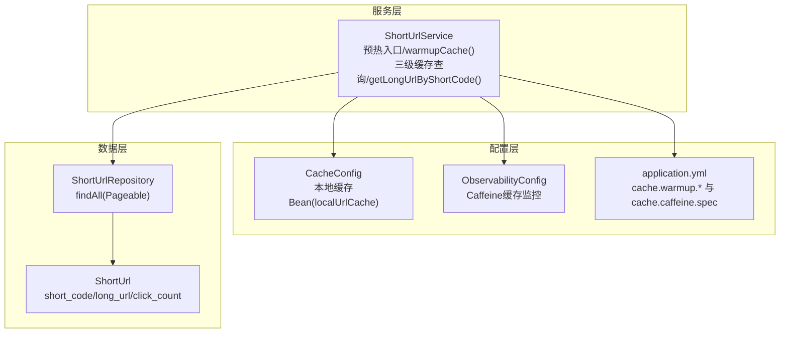
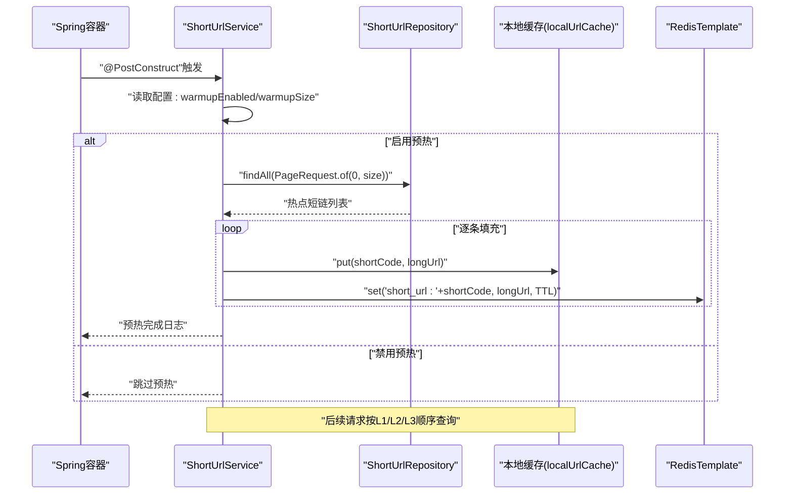
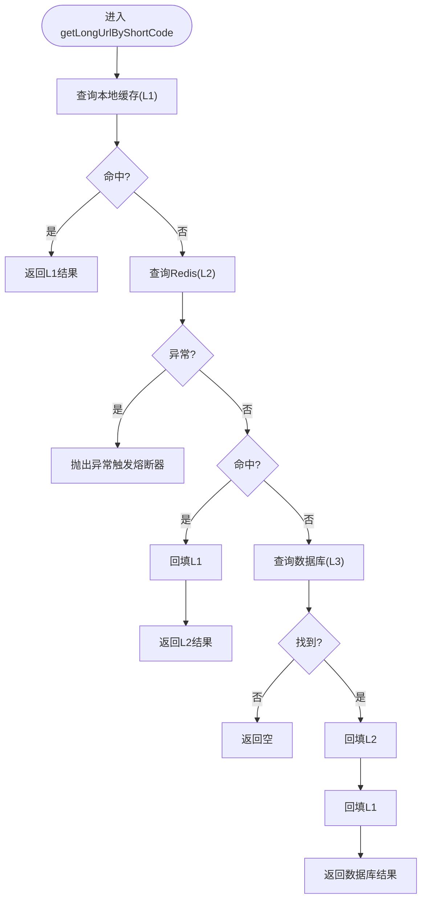
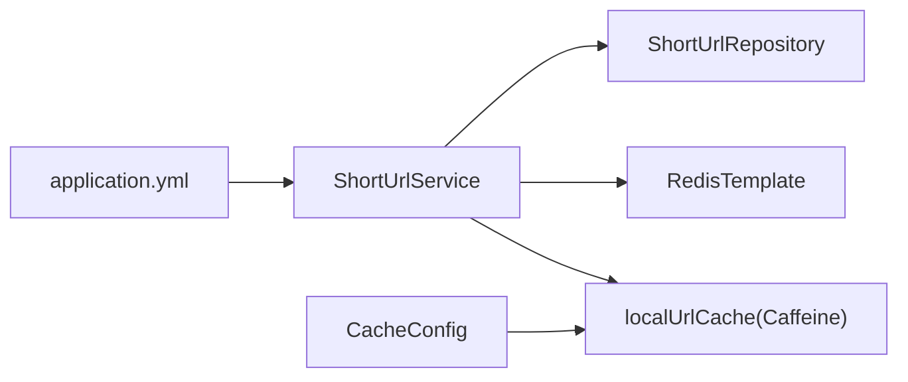

# 缓存预热机制

<cite>
**本文引用的文件**
- [ShortUrlService.java](file://src/main/java/com/layor/tinyflow/service/ShortUrlService.java)
- [CacheConfig.java](file://src/main/java/com/layor/tinyflow/config/CacheConfig.java)
- [application.yml](file://src/main/resources/application.yml)
- [ShortUrlRepository.java](file://src/main/java/com/layor/tinyflow/repository/ShortUrlRepository.java)
- [ShortUrl.java](file://src/main/java/com/layor/tinyflow/entity/ShortUrl.java)
- [ShortUrlServiceTest.java](file://src/test/java/com/layor/tinyflow/service/ShortUrlServiceTest.java)
- [ObservabilityConfig.java](file://src/main/java/com/layor/tinyflow/config/ObservabilityConfig.java)
- [MonitorController.java](file://src/main/java/com/layor/tinyflow/Controller/MonitorController.java)
</cite>

## 目录
1. [引言](#引言)
2. [项目结构](#项目结构)
3. [核心组件](#核心组件)
4. [架构总览](#架构总览)
5. [详细组件分析](#详细组件分析)
6. [依赖关系分析](#依赖关系分析)
7. [性能考量](#性能考量)
8. [故障排查指南](#故障排查指南)
9. [结论](#结论)

## 引言
本文件聚焦于短链接服务的缓存预热机制，系统性说明在应用启动时如何通过注解驱动的初始化流程，将热点短链接数据同时填充到两级缓存（本地Caffeine缓存与Redis缓存），从而显著降低冷启动阶段对数据库的压力，并在后续请求中通过L1/L2/L3三级缓存查询路径获得更优性能表现。文档还给出预热开关与规模控制参数、预热执行流程、日志输出示例及常见问题定位建议。

## 项目结构
围绕缓存预热的关键文件与职责如下：
- 服务层：负责预热入口、三级缓存查询与回源策略
- 配置层：本地缓存构建与可观测性绑定
- 数据层：热点短链查询接口
- 配置文件：预热开关与规模、本地缓存规格等
- 测试：验证三级缓存命中与回源行为

图表来源
- [ShortUrlService.java](file://src/main/java/com/layor/tinyflow/service/ShortUrlService.java#L160-L200)
- [CacheConfig.java](file://src/main/java/com/layor/tinyflow/config/CacheConfig.java#L1-L20)
- [application.yml](file://src/main/resources/application.yml#L141-L147)
- [ShortUrlRepository.java](file://src/main/java/com/layor/tinyflow/repository/ShortUrlRepository.java#L1-L68)
- [ShortUrl.java](file://src/main/java/com/layor/tinyflow/entity/ShortUrl.java#L1-L46)
- [ObservabilityConfig.java](file://src/main/java/com/layor/tinyflow/config/ObservabilityConfig.java#L49-L58)

章节来源
- [ShortUrlService.java](file://src/main/java/com/layor/tinyflow/service/ShortUrlService.java#L160-L200)
- [CacheConfig.java](file://src/main/java/com/layor/tinyflow/config/CacheConfig.java#L1-L20)
- [application.yml](file://src/main/resources/application.yml#L141-L147)
- [ShortUrlRepository.java](file://src/main/java/com/layor/tinyflow/repository/ShortUrlRepository.java#L1-L68)
- [ShortUrl.java](file://src/main/java/com/layor/tinyflow/entity/ShortUrl.java#L1-L46)
- [ObservabilityConfig.java](file://src/main/java/com/layor/tinyflow/config/ObservabilityConfig.java#L49-L58)

## 核心组件
- 预热入口与开关
  - 预热方法：在应用启动后通过注解触发，按配置决定是否执行
  - 开关参数：cache.warmup.enabled 控制是否启用预热
  - 规模参数：cache.warmup.size 决定预热条目数量
- 两级缓存填充
  - L1本地缓存：通过本地缓存Bean写入
  - L2 Redis缓存：通过RedisTemplate写入，键前缀统一
- 三级缓存查询
  - L1：本地缓存命中优先
  - L2：Redis缓存命中则回填L1
  - L3：数据库回源，命中后同时回填L2与L1

章节来源
- [ShortUrlService.java](file://src/main/java/com/layor/tinyflow/service/ShortUrlService.java#L43-L49)
- [ShortUrlService.java](file://src/main/java/com/layor/tinyflow/service/ShortUrlService.java#L160-L200)
- [ShortUrlService.java](file://src/main/java/com/layor/tinyflow/service/ShortUrlService.java#L302-L353)
- [application.yml](file://src/main/resources/application.yml#L141-L147)
- [CacheConfig.java](file://src/main/java/com/layor/tinyflow/config/CacheConfig.java#L1-L20)

## 架构总览
下图展示从应用启动到请求阶段的缓存预热与查询路径：

图表来源
- [ShortUrlService.java](file://src/main/java/com/layor/tinyflow/service/ShortUrlService.java#L160-L200)
- [ShortUrlRepository.java](file://src/main/java/com/layor/tinyflow/repository/ShortUrlRepository.java#L1-L68)
- [CacheConfig.java](file://src/main/java/com/layor/tinyflow/config/CacheConfig.java#L1-L20)
- [application.yml](file://src/main/resources/application.yml#L141-L147)

## 详细组件分析

### 预热入口与配置解析
- 注解触发：预热方法使用注解在容器完成依赖注入后自动执行
- 配置读取：
  - 开关：cache.warmup.enabled，默认开启
  - 规模：cache.warmup.size，默认1000
- 执行逻辑：
  - 若禁用则直接返回
  - 启用时按PageRequest(0, size)拉取热点短链
  - 逐条写入本地缓存与Redis缓存
  - 记录成功写入的数量与最终完成日志
  - 发生异常时记录错误日志

章节来源
- [ShortUrlService.java](file://src/main/java/com/layor/tinyflow/service/ShortUrlService.java#L43-L49)
- [ShortUrlService.java](file://src/main/java/com/layor/tinyflow/service/ShortUrlService.java#L160-L200)
- [application.yml](file://src/main/resources/application.yml#L141-L147)

### 两级缓存填充细节
- 本地缓存（L1）
  - Bean名称：localUrlCache
  - 规格：cache.caffeine.spec
  - 写入方式：直接put
- Redis缓存（L2）
  - 键命名：统一前缀"short_url:" + shortCode
  - TTL：24小时
  - 写入方式：StringRedisTemplate.opsForValue().set
  - 异常处理：捕获并记录警告日志，不影响整体预热流程

章节来源
- [CacheConfig.java](file://src/main/java/com/layor/tinyflow/config/CacheConfig.java#L1-L20)
- [application.yml](file://src/main/resources/application.yml#L141-L147)
- [ShortUrlService.java](file://src/main/java/com/layor/tinyflow/service/ShortUrlService.java#L160-L200)

### 三级缓存查询流程
- L1命中：直接返回
- L2命中：回填L1后返回
- L3回源：数据库查询后，先回填L2再回填L1
- Redis异常：抛出异常触发熔断器，避免阻塞主流程
- 降级：当Redis熔断触发时，走数据库回源并回填L1

图表来源
- [ShortUrlService.java](file://src/main/java/com/layor/tinyflow/service/ShortUrlService.java#L302-L353)

章节来源
- [ShortUrlService.java](file://src/main/java/com/layor/tinyflow/service/ShortUrlService.java#L302-L353)

### 热点短链查询策略
- 查询接口：ShortUrlRepository.findAll(PageRequest.of(0, size))
- 实体字段：包含短码与长链接，用于预热填充
- 注意：该查询并非基于点击量排序，而是基于分页全量拉取；实际业务中如需按点击量排序，可参考全局统计中的排序查询

章节来源
- [ShortUrlRepository.java](file://src/main/java/com/layor/tinyflow/repository/ShortUrlRepository.java#L1-L68)
- [ShortUrl.java](file://src/main/java/com/layor/tinyflow/entity/ShortUrl.java#L1-L46)
- [ShortUrlService.java](file://src/main/java/com/layor/tinyflow/service/ShortUrlService.java#L630-L641)

### 可观测性与监控
- 本地缓存监控：Micrometer绑定Caffeine缓存指标，便于观察命中率、淘汰等
- 监控端点：提供缓存命中统计与清空操作，便于运维验证预热效果

章节来源
- [ObservabilityConfig.java](file://src/main/java/com/layor/tinyflow/config/ObservabilityConfig.java#L49-L58)
- [MonitorController.java](file://src/main/java/com/layor/tinyflow/Controller/MonitorController.java#L68-L113)

## 依赖关系分析
- 组件耦合
  - ShortUrlService依赖本地缓存Bean与RedisTemplate
  - 预热依赖ShortUrlRepository进行热点短链拉取
  - 配置文件提供预热开关与规模、本地缓存规格
- 外部依赖
  - Caffeine本地缓存
  - Redis缓存
  - Spring Data JPA仓库接口

图表来源
- [ShortUrlService.java](file://src/main/java/com/layor/tinyflow/service/ShortUrlService.java#L160-L200)
- [CacheConfig.java](file://src/main/java/com/layor/tinyflow/config/CacheConfig.java#L1-L20)
- [application.yml](file://src/main/resources/application.yml#L141-L147)
- [ShortUrlRepository.java](file://src/main/java/com/layor/tinyflow/repository/ShortUrlRepository.java#L1-L68)

章节来源
- [ShortUrlService.java](file://src/main/java/com/layor/tinyflow/service/ShortUrlService.java#L160-L200)
- [CacheConfig.java](file://src/main/java/com/layor/tinyflow/config/CacheConfig.java#L1-L20)
- [application.yml](file://src/main/resources/application.yml#L141-L147)
- [ShortUrlRepository.java](file://src/main/java/com/layor/tinyflow/repository/ShortUrlRepository.java#L1-L68)

## 性能考量
- 预热收益
  - 减少冷启动阶段数据库压力，缩短首请求延迟
  - 提升热点短链的命中率，降低数据库与Redis的回源频率
- 缓存层级
  - L1命中为最优路径，L2命中次之，L3回源成本最高
  - 预热将热点数据提前放入L1/L2，使后续请求尽可能走L1/L2
- 参数调优
  - cache.warmup.size：根据系统QPS与热点比例调整，过大增加启动时间，过小影响命中率
  - cache.caffeine.spec：控制本地缓存容量与过期策略，平衡内存占用与命中率
- 降级与熔断
  - Redis异常触发熔断器，避免阻塞主流程
  - 降级时直接走数据库回源并回填L1，确保可用性

[本节为通用性能讨论，无需列出具体文件来源]

## 故障排查指南
- 预热未生效
  - 检查开关：cache.warmup.enabled 是否为true
  - 检查规模：cache.warmup.size 是否合理
  - 查看日志：预热开始与完成日志
- Redis写入失败
  - 观察Redis连接/超时配置与连接池设置
  - 预热过程中会记录警告日志，不影响整体预热
- 三级缓存命中异常
  - 使用监控端点查看本地缓存命中统计
  - 在单元测试中验证L1/L2命中与L3回源路径
- 热点短链排序问题
  - 当前预热使用分页全量查询，非点击量排序；如需按点击量排序，请参考全局统计中的排序查询

章节来源
- [application.yml](file://src/main/resources/application.yml#L141-L147)
- [ShortUrlService.java](file://src/main/java/com/layor/tinyflow/service/ShortUrlService.java#L160-L200)
- [ShortUrlService.java](file://src/main/java/com/layor/tinyflow/service/ShortUrlService.java#L302-L353)
- [MonitorController.java](file://src/main/java/com/layor/tinyflow/Controller/MonitorController.java#L68-L113)
- [ShortUrlServiceTest.java](file://src/test/java/com/layor/tinyflow/service/ShortUrlServiceTest.java#L247-L301)

## 结论
短链接服务通过注解驱动的预热机制，在应用启动阶段将热点短链同时填充至本地Caffeine缓存与Redis缓存，显著降低冷启动对数据库的压力。配合L1/L2/L3三级缓存查询策略与Redis熔断降级，系统在高并发场景下具备良好的响应性能与稳定性。通过合理的预热规模与本地缓存规格配置，可在命中率与资源占用之间取得平衡。