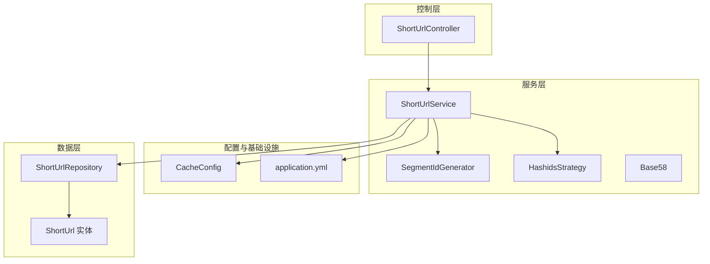
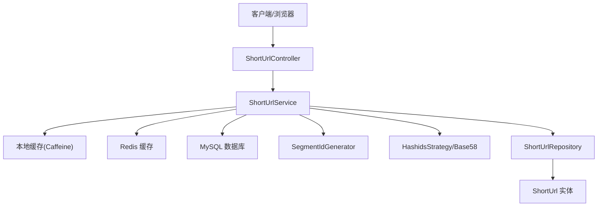
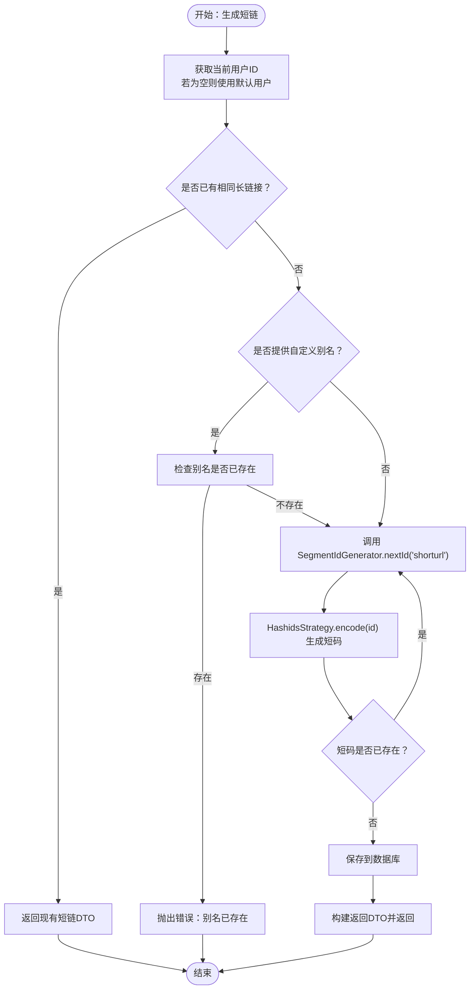
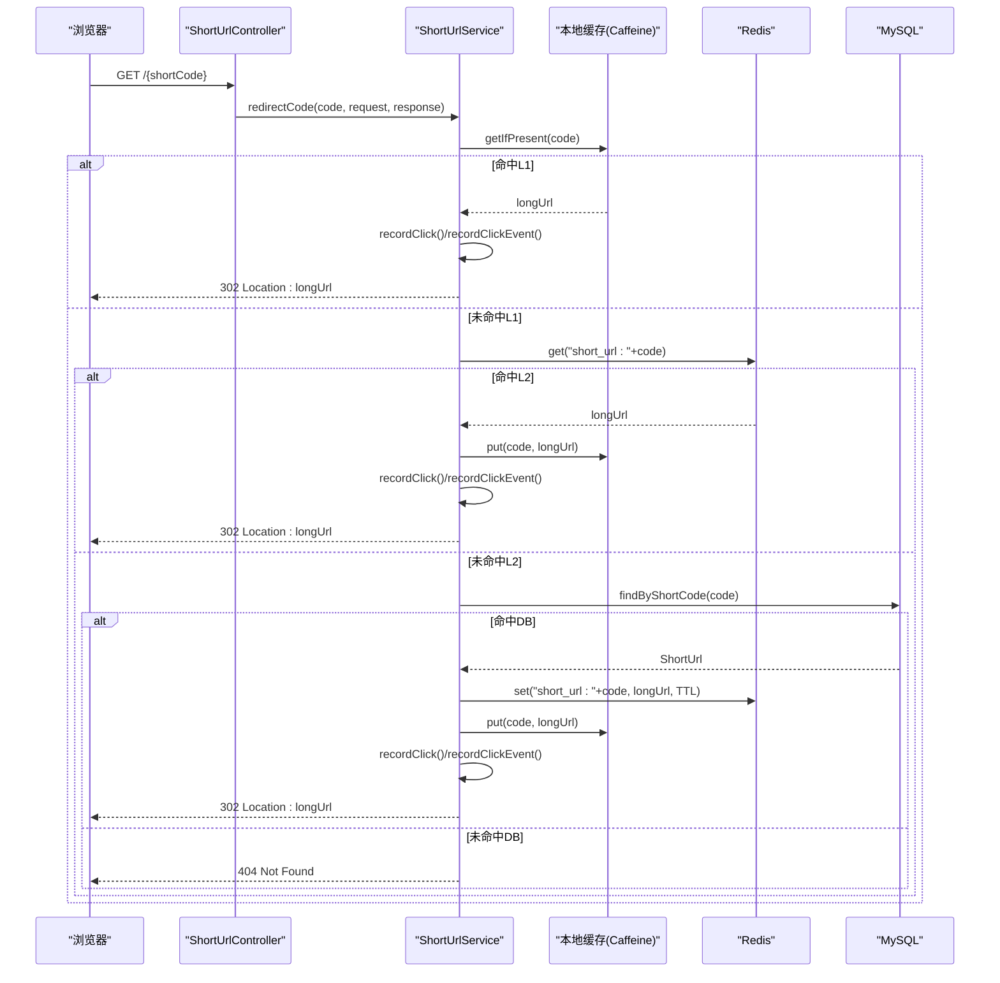
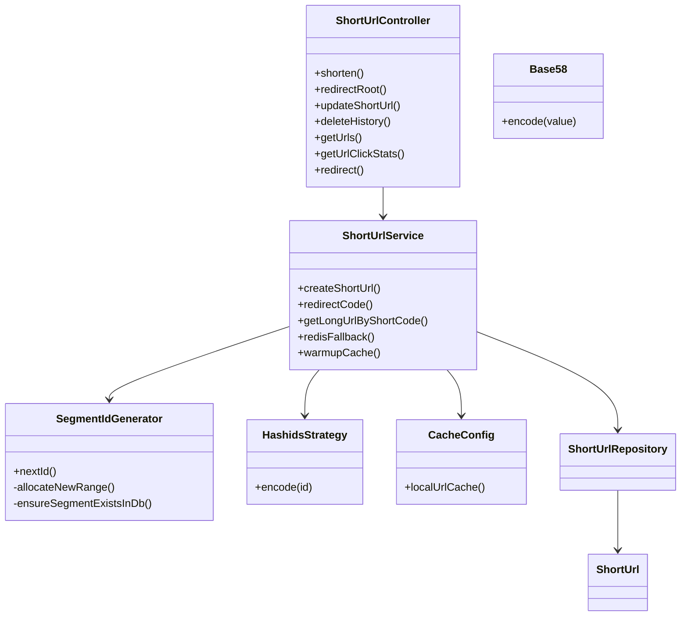

# 短链接服务

<cite>
**本文引用的文件**
- [ShortUrlController.java](file://src/main/java/com/layor/tinyflow/Controller/ShortUrlController.java)
- [ShortUrlService.java](file://src/main/java/com/layor/tinyflow/service/ShortUrlService.java)
- [HashidsStrategy.java](file://src/main/java/com/layor/tinyflow/Strategy/HashidsStrategy.java)
- [ShortCodeStrategy.java](file://src/main/java/com/layor/tinyflow/Strategy/ShortCodeStrategy.java)
- [Base58.java](file://src/main/java/com/layor/tinyflow/Util/Base58.java)
- [SegmentIdGenerator.java](file://src/main/java/com/layor/tinyflow/service/SegmentIdGenerator.java)
- [CacheConfig.java](file://src/main/java/com/layor/tinyflow/config/CacheConfig.java)
- [application.yml](file://src/main/resources/application.yml)
- [ShortUrl.java](file://src/main/java/com/layor/tinyflow/entity/ShortUrl.java)
- [ShortUrlRepository.java](file://src/main/java/com/layor/tinyflow/repository/ShortUrlRepository.java)
- [ShortUrlServiceTest.java](file://src/test/java/com/layor/tinyflow/service/ShortUrlServiceTest.java)
- [HashidsStrategyTest.java](file://src/test/java/com/layor/tinyflow/Strategy/HashidsStrategyTest.java)
</cite>

## 目录
1. [简介](#简介)
2. [项目结构](#项目结构)
3. [核心组件](#核心组件)
4. [架构总览](#架构总览)
5. [详细组件分析](#详细组件分析)
6. [依赖关系分析](#依赖关系分析)
7. [性能考量](#性能考量)
8. [故障排查指南](#故障排查指南)
9. [结论](#结论)
10. [附录](#附录)

## 简介
本文件面向“短链接服务”的核心能力进行深入讲解，重点覆盖：
- 短链生成：基于号段模式的ID生成器（SegmentIdGenerator）如何预分配ID、结合Hashids策略与Base58编码生成6位短码，以及双Buffer机制如何保障高并发下的高性能。
- 短链跳转：用户访问短链后，系统通过多级缓存（Caffeine -> Redis -> MySQL）快速查找目标URL并执行302重定向。
- API与业务逻辑：`ShortUrlController`对外暴露的API（如POST /api/shorten），以及`ShortUrlService`中的核心业务逻辑。
- 工具与策略：`HashidsStrategy`与`Base58`工具类的作用与调用流程。

## 项目结构
短链接服务位于Spring Boot工程的后端模块中，采用按职责分层组织：
- 控制层：`Controller/ShortUrlController.java`负责HTTP请求入口与响应封装。
- 服务层：`service/ShortUrlService.java`承载核心业务逻辑，包含短链生成、跳转、统计等。
- 策略与工具：`Strategy/HashidsStrategy.java`、`Strategy/ShortCodeStrategy.java`、`Util/Base58.java`提供短码生成策略与编码工具。
- ID生成：`service/SegmentIdGenerator.java`实现基于号段的高性能ID生成。
- 配置：`config/CacheConfig.java`定义本地缓存，`application.yml`定义Redis、缓存规格、熔断重试等。
- 数据模型与仓库：`entity/ShortUrl.java`、`repository/ShortUrlRepository.java`。
- 测试：`service/ShortUrlServiceTest.java`、`Strategy/HashidsStrategyTest.java`验证关键流程。

图表来源
- [ShortUrlController.java](file://src/main/java/com/layor/tinyflow/Controller/ShortUrlController.java#L1-L82)
- [ShortUrlService.java](file://src/main/java/com/layor/tinyflow/service/ShortUrlService.java#L1-L120)
- [SegmentIdGenerator.java](file://src/main/java/com/layor/tinyflow/service/SegmentIdGenerator.java#L1-L139)
- [HashidsStrategy.java](file://src/main/java/com/layor/tinyflow/Strategy/HashidsStrategy.java#L1-L17)
- [Base58.java](file://src/main/java/com/layor/tinyflow/Util/Base58.java#L1-L21)
- [CacheConfig.java](file://src/main/java/com/layor/tinyflow/config/CacheConfig.java#L1-L20)
- [application.yml](file://src/main/resources/application.yml#L1-L218)
- [ShortUrl.java](file://src/main/java/com/layor/tinyflow/entity/ShortUrl.java#L1-L46)
- [ShortUrlRepository.java](file://src/main/java/com/layor/tinyflow/repository/ShortUrlRepository.java#L1-L68)

章节来源
- [ShortUrlController.java](file://src/main/java/com/layor/tinyflow/Controller/ShortUrlController.java#L1-L82)
- [ShortUrlService.java](file://src/main/java/com/layor/tinyflow/service/ShortUrlService.java#L1-L120)
- [CacheConfig.java](file://src/main/java/com/layor/tinyflow/config/CacheConfig.java#L1-L20)
- [application.yml](file://src/main/resources/application.yml#L1-L218)

## 核心组件
- 控制器：提供短链创建、根路径跳转、管理接口（更新、删除、分页查询、统计）。
- 服务：负责短链生成、跳转缓存链路、统计与导出、权限校验、缓存预热与回填。
- 策略与工具：短码生成策略接口与实现，Base58编码工具。
- ID生成：基于号段的SegmentIdGenerator，双Buffer预取+双段切换，降低数据库压力。
- 缓存：本地Caffeine缓存、Redis二级缓存、MySQL回源。
- 配置：缓存规格、Redis连接、熔断重试、速率限制等。

章节来源
- [ShortUrlController.java](file://src/main/java/com/layor/tinyflow/Controller/ShortUrlController.java#L1-L82)
- [ShortUrlService.java](file://src/main/java/com/layor/tinyflow/service/ShortUrlService.java#L1-L200)
- [SegmentIdGenerator.java](file://src/main/java/com/layor/tinyflow/service/SegmentIdGenerator.java#L1-L139)
- [HashidsStrategy.java](file://src/main/java/com/layor/tinyflow/Strategy/HashidsStrategy.java#L1-L17)
- [Base58.java](file://src/main/java/com/layor/tinyflow/Util/Base58.java#L1-L21)
- [CacheConfig.java](file://src/main/java/com/layor/tinyflow/config/CacheConfig.java#L1-L20)
- [application.yml](file://src/main/resources/application.yml#L140-L218)

## 架构总览
短链接服务采用“控制器-服务-仓库-数据库/缓存”的分层架构，配合多级缓存与弹性治理（熔断、重试、限流）保障高并发与稳定性。

图表来源
- [ShortUrlController.java](file://src/main/java/com/layor/tinyflow/Controller/ShortUrlController.java#L1-L82)
- [ShortUrlService.java](file://src/main/java/com/layor/tinyflow/service/ShortUrlService.java#L280-L366)
- [SegmentIdGenerator.java](file://src/main/java/com/layor/tinyflow/service/SegmentIdGenerator.java#L32-L116)
- [HashidsStrategy.java](file://src/main/java/com/layor/tinyflow/Strategy/HashidsStrategy.java#L1-L17)
- [ShortUrlRepository.java](file://src/main/java/com/layor/tinyflow/repository/ShortUrlRepository.java#L1-L68)
- [ShortUrl.java](file://src/main/java/com/layor/tinyflow/entity/ShortUrl.java#L1-L46)

## 详细组件分析

### 短链生成：ID生成与短码生成
- ID生成（SegmentIdGenerator）
  - 号段模式：每次从数据库原子性地拉取一段连续ID（步长固定），并在内存中维护两个Range：current与next，实现双Buffer预取与无缝切换。
  - 双Buffer机制：当current耗尽时，立即切换到next，同时同步拉取新区段，避免切换过程中的阻塞。
  - 数据一致性：通过行级锁原子更新max_id，确保多实例并发下的ID唯一性。
- 短码生成（HashidsStrategy + Base58）
  - HashidsStrategy：封装Hashids对ID进行编码，返回字符串形式的短码。
  - Base58：提供自定义Base58编码工具（用于演示或扩展场景）。
  - 短码长度：服务层常量定义为6位。
- 自动短码生成流程
  - 服务层循环尝试生成短码，直到生成的短码在数据库中不存在为止。
  - 若用户提供了自定义别名，则先检查别名是否已存在，存在则抛错。
  - 保存到数据库后，构造返回DTO并返回。

图表来源
- [ShortUrlService.java](file://src/main/java/com/layor/tinyflow/service/ShortUrlService.java#L70-L148)
- [SegmentIdGenerator.java](file://src/main/java/com/layor/tinyflow/service/SegmentIdGenerator.java#L32-L116)
- [HashidsStrategy.java](file://src/main/java/com/layor/tinyflow/Strategy/HashidsStrategy.java#L1-L17)

章节来源
- [ShortUrlService.java](file://src/main/java/com/layor/tinyflow/service/ShortUrlService.java#L70-L148)
- [SegmentIdGenerator.java](file://src/main/java/com/layor/tinyflow/service/SegmentIdGenerator.java#L32-L116)
- [HashidsStrategy.java](file://src/main/java/com/layor/tinyflow/Strategy/HashidsStrategy.java#L1-L17)
- [ShortUrlServiceTest.java](file://src/test/java/com/layor/tinyflow/service/ShortUrlServiceTest.java#L90-L146)
- [HashidsStrategyTest.java](file://src/test/java/com/layor/tinyflow/Strategy/HashidsStrategyTest.java#L1-L66)

### 短链跳转：多级缓存与重定向
- 跳转入口：控制器提供根路径重定向与内部跳转接口，均委托给服务层。
- 跳转流程（多级缓存链路）
  - L1：本地Caffeine缓存命中则直接返回。
  - L2：若未命中，查询Redis；命中则回填L1并返回。
  - L3：若仍未命中，回源数据库；命中后回填Redis与L1。
  - 异常与降级：Redis查询异常触发熔断器，fallback方法直接回源数据库并回填L1。
  - 记录点击：命中后记录点击事件与基础点击计数。
  - 重定向：设置302状态与Location头，返回目标URL。

图表来源
- [ShortUrlController.java](file://src/main/java/com/layor/tinyflow/Controller/ShortUrlController.java#L29-L42)
- [ShortUrlService.java](file://src/main/java/com/layor/tinyflow/service/ShortUrlService.java#L288-L366)
- [application.yml](file://src/main/resources/application.yml#L148-L212)

章节来源
- [ShortUrlController.java](file://src/main/java/com/layor/tinyflow/Controller/ShortUrlController.java#L29-L42)
- [ShortUrlService.java](file://src/main/java/com/layor/tinyflow/service/ShortUrlService.java#L288-L366)
- [application.yml](file://src/main/resources/application.yml#L148-L212)

### 缓存预热与回填
- 预热：启动时根据配置加载热点短链到本地缓存与Redis，提升冷启动命中率。
- 回填：Redis命中后回填本地缓存；数据库命中后同时回填Redis与本地缓存。

章节来源
- [ShortUrlService.java](file://src/main/java/com/layor/tinyflow/service/ShortUrlService.java#L160-L200)

### API与控制器
- POST /api/shorten：创建短链，支持自定义别名。
- GET /{shortCode}：外部短链根路径重定向。
- PUT /api/{shortCode}：更新短链（支持修改别名）。
- DELETE /api/{shortCode}：删除短链。
- GET /api/urls：分页查询短链列表。
- GET /api/urls/click-stats：获取短链点击统计。
- GET /api/redirect/{shortCode}：内部跳转接口（压测/监控使用）。

章节来源
- [ShortUrlController.java](file://src/main/java/com/layor/tinyflow/Controller/ShortUrlController.java#L24-L81)

### 数据模型与仓库
- ShortUrl实体：包含长链接、短码、用户ID、创建时间、点击计数等字段，并建立索引以优化查询。
- ShortUrlRepository：提供按短码、长链接、用户ID等条件的查询与更新点击计数。

章节来源
- [ShortUrl.java](file://src/main/java/com/layor/tinyflow/entity/ShortUrl.java#L1-L46)
- [ShortUrlRepository.java](file://src/main/java/com/layor/tinyflow/repository/ShortUrlRepository.java#L1-L68)

## 依赖关系分析
- 控制器依赖服务层；服务层依赖ID生成器、短码策略、缓存配置、Redis模板、仓库与实体。
- SegmentIdGenerator依赖数据库仓库以原子更新max_id并维护号段。
- HashidsStrategy依赖Hashids库完成编码。
- Base58为独立工具类，便于扩展或演示。

图表来源
- [ShortUrlController.java](file://src/main/java/com/layor/tinyflow/Controller/ShortUrlController.java#L1-L82)
- [ShortUrlService.java](file://src/main/java/com/layor/tinyflow/service/ShortUrlService.java#L1-L120)
- [SegmentIdGenerator.java](file://src/main/java/com/layor/tinyflow/service/SegmentIdGenerator.java#L1-L139)
- [HashidsStrategy.java](file://src/main/java/com/layor/tinyflow/Strategy/HashidsStrategy.java#L1-L17)
- [Base58.java](file://src/main/java/com/layor/tinyflow/Util/Base58.java#L1-L21)
- [CacheConfig.java](file://src/main/java/com/layor/tinyflow/config/CacheConfig.java#L1-L20)
- [ShortUrlRepository.java](file://src/main/java/com/layor/tinyflow/repository/ShortUrlRepository.java#L1-L68)
- [ShortUrl.java](file://src/main/java/com/layor/tinyflow/entity/ShortUrl.java#L1-L46)

## 性能考量
- 号段模式与双Buffer：减少数据库写放大，提高ID生成吞吐。
- 多级缓存：本地缓存优先命中，Redis作为二级缓存，数据库作为最终回源，显著降低延迟。
- 熔断与重试：Redis熔断器与重试配置，避免雪崩效应，提升整体可用性。
- 缓存预热：启动时加载热点短链，缩短冷启动延迟。
- 速率限制：对跳转接口进行限流，防止突发流量冲击。

章节来源
- [SegmentIdGenerator.java](file://src/main/java/com/layor/tinyflow/service/SegmentIdGenerator.java#L32-L116)
- [ShortUrlService.java](file://src/main/java/com/layor/tinyflow/service/ShortUrlService.java#L160-L200)
- [application.yml](file://src/main/resources/application.yml#L148-L212)

## 故障排查指南
- 短链生成失败
  - 检查ID生成器是否正常工作，确认号段表是否存在并可原子更新。
  - 检查Hashids策略是否可用，短码是否重复。
- 跳转404
  - 确认短码是否存在于数据库；检查Redis键是否存在；查看日志中是否触发了降级回源。
- Redis异常
  - 观察熔断器状态与重试日志；确认连接超时与池配置合理。
- 缓存未命中
  - 检查本地缓存与Redis预热配置；确认键命名规范一致。

章节来源
- [ShortUrlService.java](file://src/main/java/com/layor/tinyflow/service/ShortUrlService.java#L288-L366)
- [application.yml](file://src/main/resources/application.yml#L148-L212)

## 结论
短链接服务通过号段模式的ID生成器、多级缓存与弹性治理策略，在保证高并发与低延迟的同时，提供了完整的短链生命周期管理能力。短链生成与跳转流程清晰、可扩展性强，适合在高流量场景下稳定运行。

## 附录
- 关键方法调用路径参考
  - 生成短链：[createShortUrl](file://src/main/java/com/layor/tinyflow/service/ShortUrlService.java#L70-L148) -> [nextId](file://src/main/java/com/layor/tinyflow/service/SegmentIdGenerator.java#L32-L67) -> [encode](file://src/main/java/com/layor/tinyflow/Strategy/HashidsStrategy.java#L12-L15)
  - 跳转重定向：[redirectCode](file://src/main/java/com/layor/tinyflow/service/ShortUrlService.java#L288-L300) -> [getLongUrlByShortCode](file://src/main/java/com/layor/tinyflow/service/ShortUrlService.java#L302-L353) -> [redisFallback](file://src/main/java/com/layor/tinyflow/service/ShortUrlService.java#L355-L366)
  - 缓存预热：[warmupCache](file://src/main/java/com/layor/tinyflow/service/ShortUrlService.java#L162-L200)