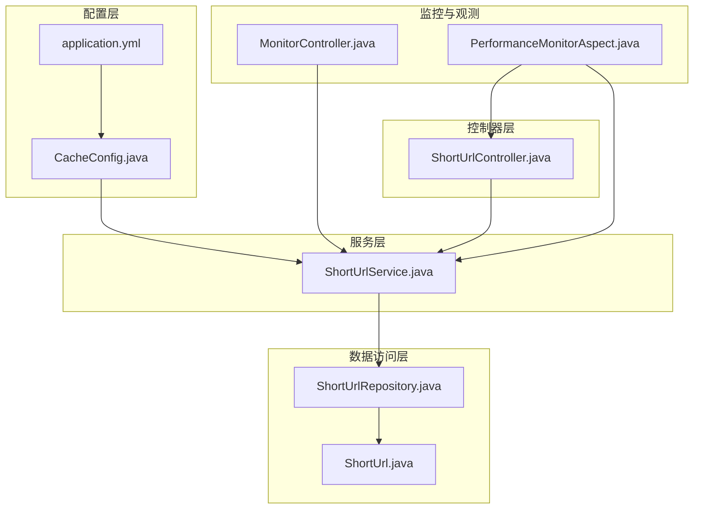
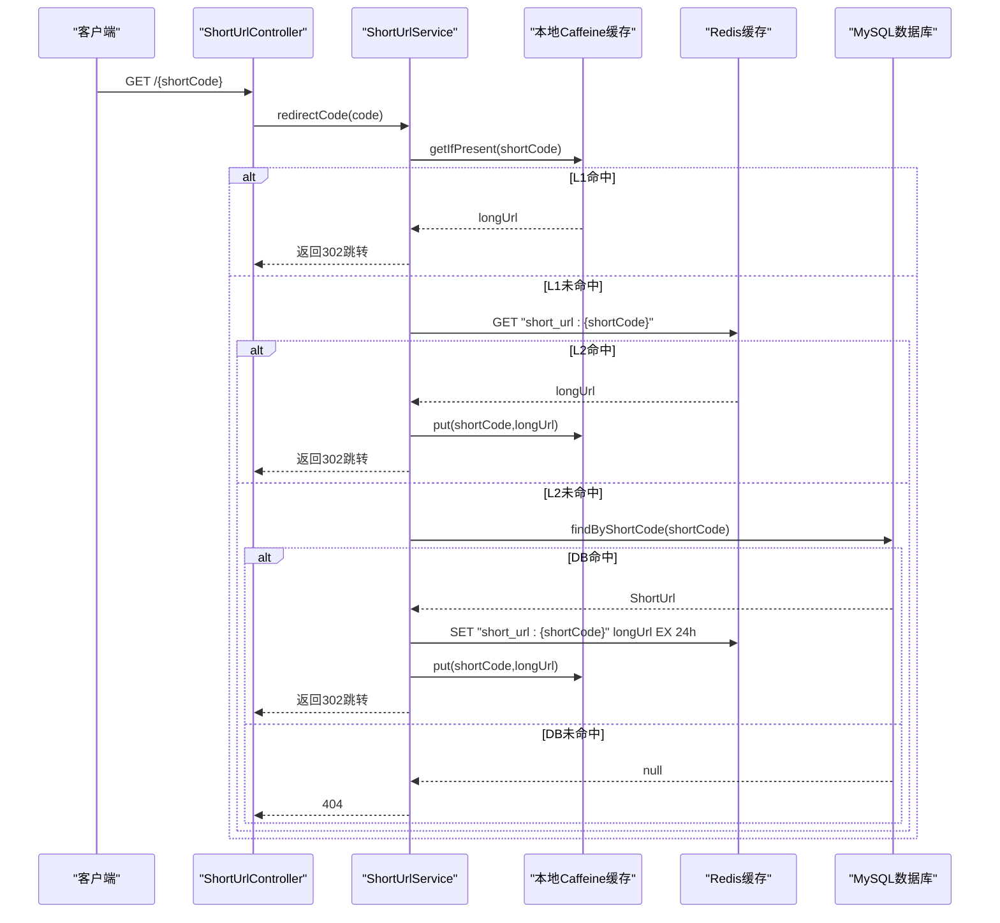
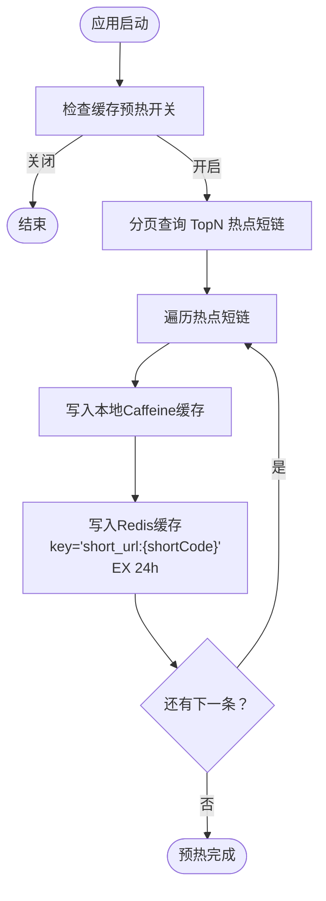
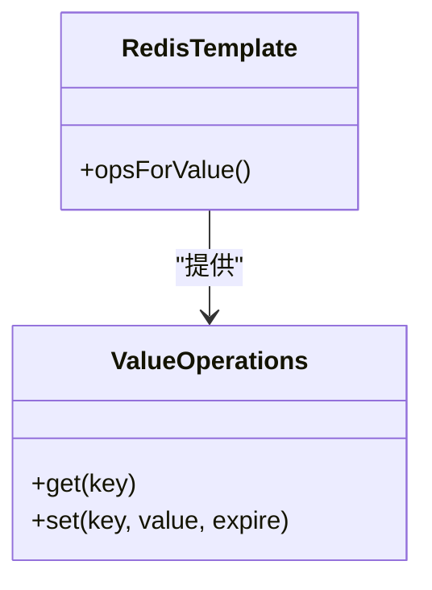
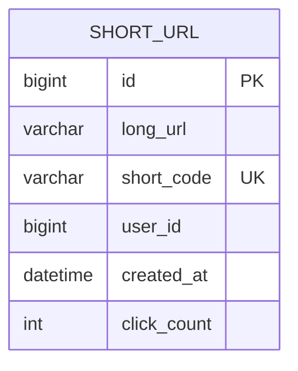
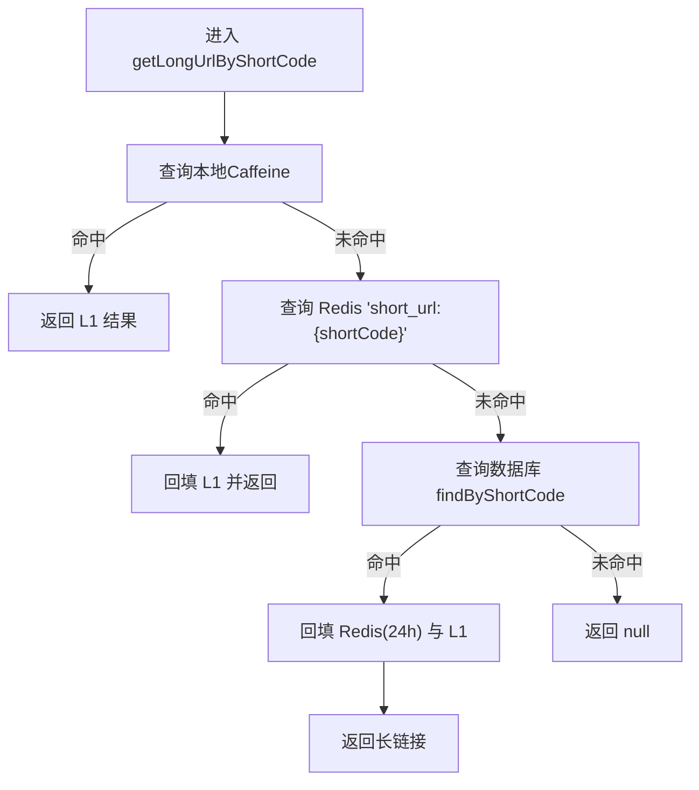
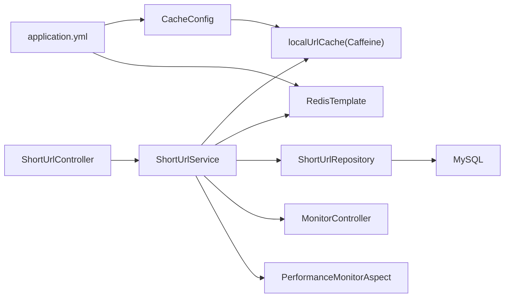
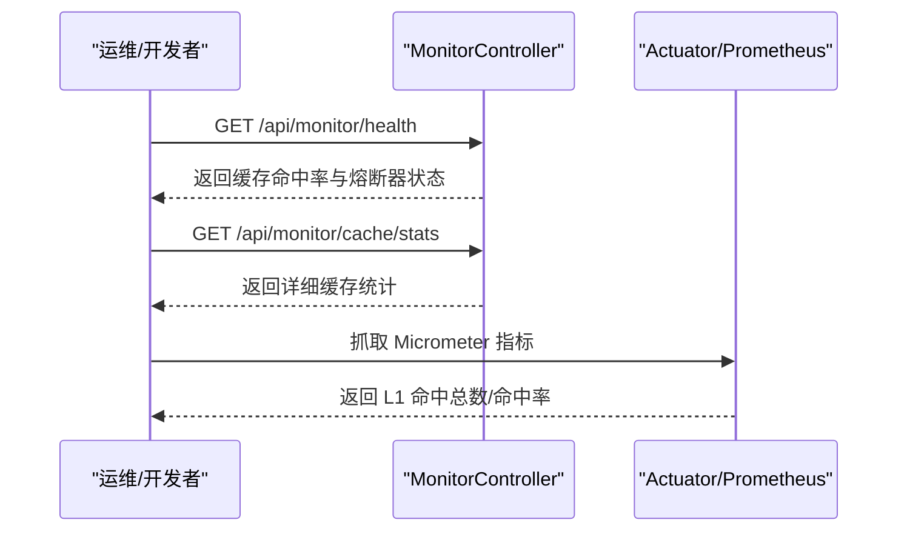

# 多级缓存架构

<cite>
**本文引用的文件**
- [CacheConfig.java](file://src/main/java/com/layor/tinyflow/config/CacheConfig.java)
- [application.yml](file://src/main/resources/application.yml)
- [ShortUrlService.java](file://src/main/java/com/layor/tinyflow/service/ShortUrlService.java)
- [ShortUrlController.java](file://src/main/java/com/layor/tinyflow/Controller/ShortUrlController.java)
- [ShortUrlRepository.java](file://src/main/java/com/layor/tinyflow/repository/ShortUrlRepository.java)
- [ShortUrl.java](file://src/main/java/com/layor/tinyflow/entity/ShortUrl.java)
- [MonitorController.java](file://src/main/java/com/layor/tinyflow/Controller/MonitorController.java)
- [PerformanceMonitorAspect.java](file://src/main/java/com/layor/tinyflow/aspect/PerformanceMonitorAspect.java)
- [OBSERVABILITY.md](file://OBSERVABILITY.md)
- [perf-optimization.md](file://web/docs/perf-optimization.md)
</cite>

## 目录
1. [简介](#简介)
2. [项目结构](#项目结构)
3. [核心组件](#核心组件)
4. [架构总览](#架构总览)
5. [组件详解](#组件详解)
6. [依赖关系分析](#依赖关系分析)
7. [性能与监控](#性能与监控)
8. [故障排查指南](#故障排查指南)
9. [结论](#结论)

## 简介
本文件围绕短链接跳转场景下的三级缓存架构进行系统化说明，涵盖：
- L1 本地 Caffeine 缓存的配置参数与行为
- L2 Redis 缓存的数据结构与过期策略
- L3 MySQL 数据库的回源机制
- getLongUrlByShortCode 方法的缓存查询顺序与回填策略
- 应用启动时的缓存预热机制
- 缓存命中率监控指标与性能优化建议（含穿透、雪崩、击穿防护）

## 项目结构
该模块位于后端服务中，涉及配置、控制器、服务、仓库与实体层，以及可观测性端点与性能监控切面。

**图表来源**
- [CacheConfig.java](file://src/main/java/com/layor/tinyflow/config/CacheConfig.java#L1-L19)
- [application.yml](file://src/main/resources/application.yml#L141-L170)
- [ShortUrlController.java](file://src/main/java/com/layor/tinyflow/Controller/ShortUrlController.java#L1-L82)
- [ShortUrlService.java](file://src/main/java/com/layor/tinyflow/service/ShortUrlService.java#L1-L120)
- [ShortUrlRepository.java](file://src/main/java/com/layor/tinyflow/repository/ShortUrlRepository.java#L1-L68)
- [ShortUrl.java](file://src/main/java/com/layor/tinyflow/entity/ShortUrl.java#L1-L46)
- [MonitorController.java](file://src/main/java/com/layor/tinyflow/Controller/MonitorController.java#L1-L114)
- [PerformanceMonitorAspect.java](file://src/main/java/com/layor/tinyflow/aspect/PerformanceMonitorAspect.java#L1-L64)

**章节来源**
- [CacheConfig.java](file://src/main/java/com/layor/tinyflow/config/CacheConfig.java#L1-L19)
- [application.yml](file://src/main/resources/application.yml#L141-L170)
- [ShortUrlController.java](file://src/main/java/com/layor/tinyflow/Controller/ShortUrlController.java#L1-L82)
- [ShortUrlService.java](file://src/main/java/com/layor/tinyflow/service/ShortUrlService.java#L1-L120)
- [ShortUrlRepository.java](file://src/main/java/com/layor/tinyflow/repository/ShortUrlRepository.java#L1-L68)
- [ShortUrl.java](file://src/main/java/com/layor/tinyflow/entity/ShortUrl.java#L1-L46)
- [MonitorController.java](file://src/main/java/com/layor/tinyflow/Controller/MonitorController.java#L1-L114)
- [PerformanceMonitorAspect.java](file://src/main/java/com/layor/tinyflow/aspect/PerformanceMonitorAspect.java#L1-L64)

## 核心组件
- L1 本地 Caffeine 缓存：基于配置注入的本地缓存实例，用于极低延迟的短链解析。
- L2 Redis 缓存：分布式缓存，键格式为 short_url:{shortCode}，带过期时间。
- L3 MySQL 数据库：回源存储，通过 JPA Repository 提供查询与更新能力。
- 服务层 ShortUrlService：实现三级缓存查询、回填与降级逻辑，包含启动预热与更新清理缓存。
- 控制器层 ShortUrlController：对外暴露重定向接口，调用服务层执行跳转。
- 监控与观测：提供健康与缓存统计端点，结合 Micrometer 对 L1 缓存进行指标绑定。

**章节来源**
- [CacheConfig.java](file://src/main/java/com/layor/tinyflow/config/CacheConfig.java#L1-L19)
- [application.yml](file://src/main/resources/application.yml#L141-L170)
- [ShortUrlService.java](file://src/main/java/com/layor/tinyflow/service/ShortUrlService.java#L160-L200)
- [ShortUrlController.java](file://src/main/java/com/layor/tinyflow/Controller/ShortUrlController.java#L29-L41)
- [MonitorController.java](file://src/main/java/com/layor/tinyflow/Controller/MonitorController.java#L36-L113)

## 架构总览
短链接跳转的整体流程如下：客户端请求根路径短码，控制器调用服务层，服务层按 L1→L2→L3 顺序查询，命中即返回，未命中则回源数据库并同步回填两级缓存；同时提供 Redis 熔断与重试、速率限制等弹性保护。

**图表来源**
- [ShortUrlController.java](file://src/main/java/com/layor/tinyflow/Controller/ShortUrlController.java#L29-L41)
- [ShortUrlService.java](file://src/main/java/com/layor/tinyflow/service/ShortUrlService.java#L288-L353)
- [ShortUrlRepository.java](file://src/main/java/com/layor/tinyflow/repository/ShortUrlRepository.java#L15-L20)

**章节来源**
- [ShortUrlController.java](file://src/main/java/com/layor/tinyflow/Controller/ShortUrlController.java#L29-L41)
- [ShortUrlService.java](file://src/main/java/com/layor/tinyflow/service/ShortUrlService.java#L288-L353)
- [ShortUrlRepository.java](file://src/main/java/com/layor/tinyflow/repository/ShortUrlRepository.java#L15-L20)

## 组件详解

### L1 本地 Caffeine 缓存
- 配置参数
  - 最大容量：由配置项 cache.caffeine.spec 决定，默认值见 application.yml 中的 cache.caffeine.spec 字段。
  - 过期策略：expireAfterWrite=30m（以实际配置为准）。
  - 统计记录：recordStats 开启，便于监控命中率与淘汰情况。
- 注入方式：通过 @Qualifier("localUrlCache") 注入到服务层，用于高频短链解析。
- 预热机制：应用启动时，@PostConstruct 执行 warmupCache，从数据库拉取 TopN 热点短链，同时写入 L1 与 L2。

**图表来源**
- [application.yml](file://src/main/resources/application.yml#L141-L147)
- [CacheConfig.java](file://src/main/java/com/layor/tinyflow/config/CacheConfig.java#L12-L18)
- [ShortUrlService.java](file://src/main/java/com/layor/tinyflow/service/ShortUrlService.java#L160-L200)

**章节来源**
- [application.yml](file://src/main/resources/application.yml#L141-L147)
- [CacheConfig.java](file://src/main/java/com/layor/tinyflow/config/CacheConfig.java#L12-L18)
- [ShortUrlService.java](file://src/main/java/com/layor/tinyflow/service/ShortUrlService.java#L160-L200)

### L2 Redis 缓存
- 数据结构设计
  - key 格式：short_url:{shortCode}
  - value：长链接字符串
  - 过期策略：写入时设置过期时间为 24 小时
- 访问方式：通过 StringRedisTemplate.opsForValue() 进行 GET/SET 操作。
- 弹性保护：对 Redis 访问启用 CircuitBreaker 与 Retry，异常时触发熔断并降级至数据库直连。

**图表来源**
- [ShortUrlService.java](file://src/main/java/com/layor/tinyflow/service/ShortUrlService.java#L184-L193)
- [ShortUrlService.java](file://src/main/java/com/layor/tinyflow/service/ShortUrlService.java#L341-L349)

**章节来源**
- [ShortUrlService.java](file://src/main/java/com/layor/tinyflow/service/ShortUrlService.java#L184-L193)
- [ShortUrlService.java](file://src/main/java/com/layor/tinyflow/service/ShortUrlService.java#L341-L349)

### L3 MySQL 数据库回源
- 查询入口：ShortUrlRepository.findByShortCode(shortCode)
- 实体模型：ShortUrl，包含 longUrl、shortCode、userId、createdAt、clickCount 等字段。
- 回源后同步更新两级缓存：先写 Redis，再写本地 Caffeine，确保后续请求命中 L1/L2。

**图表来源**
- [ShortUrl.java](file://src/main/java/com/layor/tinyflow/entity/ShortUrl.java#L1-L46)
- [ShortUrlRepository.java](file://src/main/java/com/layor/tinyflow/repository/ShortUrlRepository.java#L15-L20)

**章节来源**
- [ShortUrlRepository.java](file://src/main/java/com/layor/tinyflow/repository/ShortUrlRepository.java#L15-L20)
- [ShortUrl.java](file://src/main/java/com/layor/tinyflow/entity/ShortUrl.java#L1-L46)

### getLongUrlByShortCode 方法的缓存查询顺序
- L1 本地 Caffeine：优先命中直接返回
- L2 Redis：未命中则查询 Redis，命中后回填 L1
- L3 数据库：Redis 未命中则回源数据库，命中后同步回填 L2/L1
- 异常与降级：Redis 访问异常触发熔断器，降级为直连数据库并回填 L1

**图表来源**
- [ShortUrlService.java](file://src/main/java/com/layor/tinyflow/service/ShortUrlService.java#L302-L353)

**章节来源**
- [ShortUrlService.java](file://src/main/java/com/layor/tinyflow/service/ShortUrlService.java#L302-L353)

### 缓存预热机制
- 触发时机：应用启动后，@PostConstruct 执行 warmupCache
- 预热策略：分页拉取 TopN 热点短链，逐条写入 L1 与 L2，Redis 失败不中断主流程
- 配置开关与规模：cache.warmup.enabled 与 cache.warmup.size

**章节来源**
- [ShortUrlService.java](file://src/main/java/com/layor/tinyflow/service/ShortUrlService.java#L160-L200)
- [application.yml](file://src/main/resources/application.yml#L141-L147)

### 更新与缓存清理
- 更新短码：当短码被修改时，清理旧 key 的 L1/L2，并将新短码写入 L2/L1
- 删除短码：清理对应 L1/L2 缓存

**章节来源**
- [ShortUrlService.java](file://src/main/java/com/layor/tinyflow/service/ShortUrlService.java#L773-L787)

## 依赖关系分析
- 控制器依赖服务层：ShortUrlController 通过 redirectCode 调用服务层跳转逻辑
- 服务层依赖缓存与仓库：本地 Caffeine、Redis、JPA Repository
- 配置层提供缓存与外部系统连接：CacheConfig 注入本地缓存；application.yml 配置 Redis 连接与 Resilience4j 弹性参数
- 监控层提供健康与缓存统计端点，结合 Micrometer 绑定 L1 缓存指标

**图表来源**
- [ShortUrlController.java](file://src/main/java/com/layor/tinyflow/Controller/ShortUrlController.java#L29-L41)
- [ShortUrlService.java](file://src/main/java/com/layor/tinyflow/service/ShortUrlService.java#L1-L120)
- [CacheConfig.java](file://src/main/java/com/layor/tinyflow/config/CacheConfig.java#L1-L19)
- [application.yml](file://src/main/resources/application.yml#L141-L170)
- [MonitorController.java](file://src/main/java/com/layor/tinyflow/Controller/MonitorController.java#L36-L113)
- [PerformanceMonitorAspect.java](file://src/main/java/com/layor/tinyflow/aspect/PerformanceMonitorAspect.java#L1-L64)

**章节来源**
- [ShortUrlController.java](file://src/main/java/com/layor/tinyflow/Controller/ShortUrlController.java#L29-L41)
- [ShortUrlService.java](file://src/main/java/com/layor/tinyflow/service/ShortUrlService.java#L1-L120)
- [CacheConfig.java](file://src/main/java/com/layor/tinyflow/config/CacheConfig.java#L1-L19)
- [application.yml](file://src/main/resources/application.yml#L141-L170)
- [MonitorController.java](file://src/main/java/com/layor/tinyflow/Controller/MonitorController.java#L36-L113)
- [PerformanceMonitorAspect.java](file://src/main/java/com/layor/tinyflow/aspect/PerformanceMonitorAspect.java#L1-L64)

## 性能与监控

### 缓存命中率与指标
- L1 缓存命中率：可通过 /api/monitor/health 与 /api/monitor/cache/stats 获取 hitRate、missRate、hitCount、missCount 等
- Micrometer 指标：本地缓存已绑定 CaffeineCacheMetrics，Prometheus 可抓取命中总数与命中率
- Resilience4j：Redis 熔断器与重试、速率限制器已配置，可监控熔断状态与限流权限

**图表来源**
- [MonitorController.java](file://src/main/java/com/layor/tinyflow/Controller/MonitorController.java#L36-L113)
- [OBSERVABILITY.md](file://OBSERVABILITY.md#L69-L144)

**章节来源**
- [MonitorController.java](file://src/main/java/com/layor/tinyflow/Controller/MonitorController.java#L36-L113)
- [OBSERVABILITY.md](file://OBSERVABILITY.md#L69-L144)

### 性能优化建议
- 缓存穿透
  - 现状：未见显式空值缓存或布隆过滤器
  - 建议：对不存在的 shortCode 缓存一个短 TTL 的占位值，降低数据库压力
- 缓存雪崩
  - 现状：L1 本地缓存 + L2 Redis，且 L2 设置 24h 过期
  - 建议：为 L2 key 加随机抖动过期时间，避免同一时刻大面积失效
- 缓存击穿
  - 现状：热点短码通过预热写入 L1/L2
  - 建议：对热点 key 在 L2 设置互斥锁或热点保护，避免并发重建导致 DB 压力
- 其他优化
  - 连接池：根据压测与监控结果调整 HikariCP 与 Redis 连接池参数
  - 异步化：统计类操作异步化，保护重定向路径
  - 限流与熔断：保持现有速率限制与 Redis 熔断配置，必要时细化到短码粒度

**章节来源**
- [application.yml](file://src/main/resources/application.yml#L148-L211)
- [perf-optimization.md](file://web/docs/perf-optimization.md#L1-L45)

## 故障排查指南
- 缓存不可用
  - 检查 /api/monitor/health 中缓存命中率与 size 是否异常下降
  - 使用 /api/monitor/cache/clear 清理本地缓存，观察命中率恢复情况
- Redis 异常
  - 查看熔断器状态（redisBreaker），确认是否处于 OPEN/HALF_OPEN
  - 检查 Redis 连接参数与池配置，关注连接超时与最大等待
- 数据库异常
  - 查看 DB 熔断器状态（dbBreaker），确认慢调用阈值与失败率
  - 检查慢查询日志与索引，确认 findByShortCode 是否走索引
- 性能问题
  - 使用 PerformanceMonitorAspect 记录的慢请求日志定位热点方法
  - 结合 Grafana 仪表盘观察 p95 延迟与错误率变化

**章节来源**
- [MonitorController.java](file://src/main/java/com/layor/tinyflow/Controller/MonitorController.java#L36-L113)
- [PerformanceMonitorAspect.java](file://src/main/java/com/layor/tinyflow/aspect/PerformanceMonitorAspect.java#L1-L64)
- [OBSERVABILITY.md](file://OBSERVABILITY.md#L69-L201)

## 结论
本系统在短链接跳转场景下实现了清晰的三级缓存架构：L1 本地 Caffeine、L2 Redis、L3 MySQL 数据库。通过预热、回填与降级策略，配合 Redis 熔断与重试、速率限制等弹性保护，有效保障了高并发下的低延迟与稳定性。结合可观测性端点与 Micrometer 指标，可持续监控命中率与系统健康状况，并据此迭代优化缓存穿透、雪崩、击穿等风险场景。