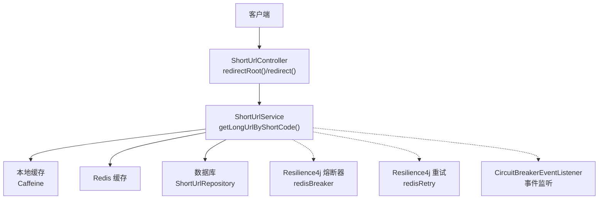
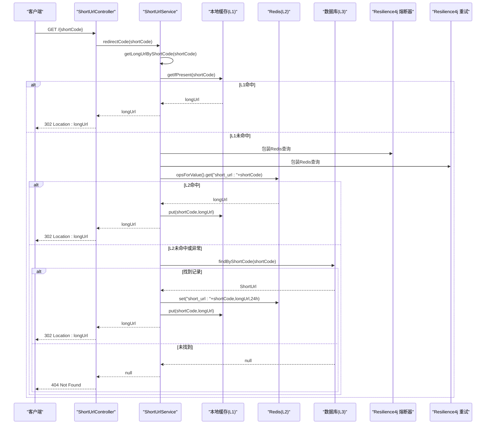
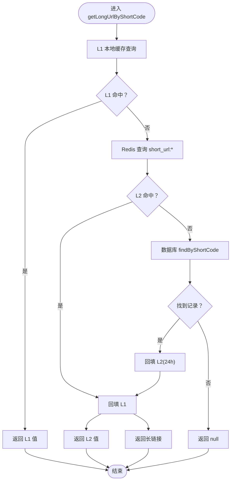
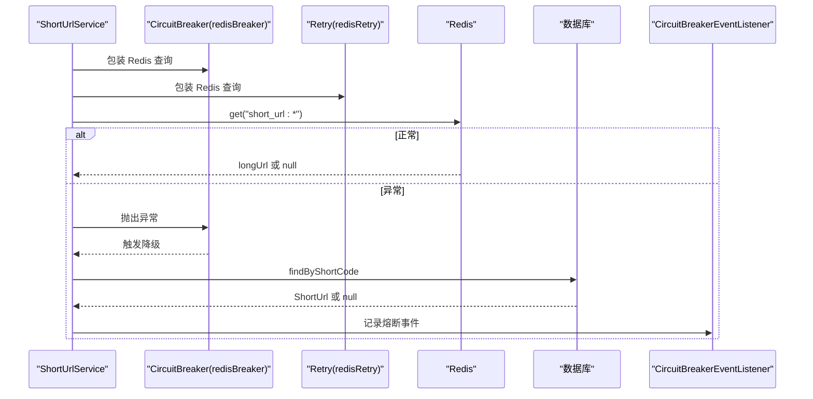
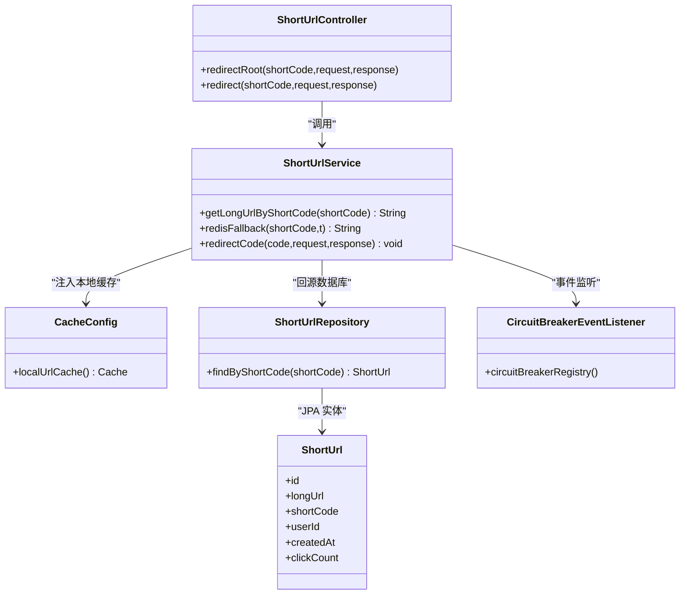
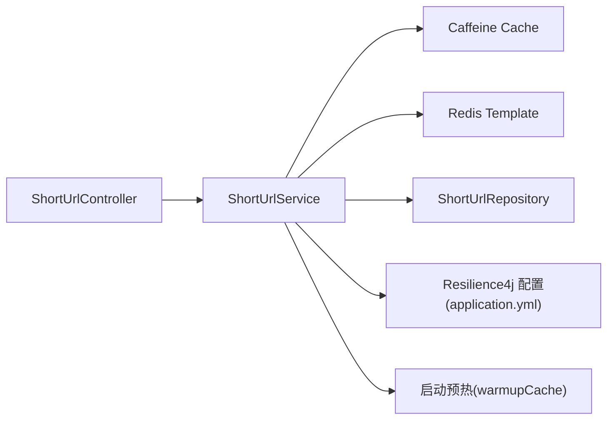

# 缓存查询流程

<cite>
**本文引用的文件**
- [ShortUrlService.java](file://src/main/java/com/layor/tinyflow/service/ShortUrlService.java)
- [ShortUrlController.java](file://src/main/java/com/layor/tinyflow/Controller/ShortUrlController.java)
- [CacheConfig.java](file://src/main/java/com/layor/tinyflow/config/CacheConfig.java)
- [ShortUrlRepository.java](file://src/main/java/com/layor/tinyflow/repository/ShortUrlRepository.java)
- [ShortUrl.java](file://src/main/java/com/layor/tinyflow/entity/ShortUrl.java)
- [application.yml](file://src/main/resources/application.yml)
- [CircuitBreakerEventListener.java](file://src/main/java/com/layor/tinyflow/listener/CircuitBreakerEventListener.java)
- [deploy.sh](file://deploy.sh)
- [ShortUrlServiceTest.java](file://src/test/java/com/layor/tinyflow/service/ShortUrlServiceTest.java)
</cite>

## 目录
1. [简介](#简介)
2. [项目结构](#项目结构)
3. [核心组件](#核心组件)
4. [架构总览](#架构总览)
5. [详细组件分析](#详细组件分析)
6. [依赖关系分析](#依赖关系分析)
7. [性能考量](#性能考量)
8. [故障排查指南](#故障排查指南)
9. [结论](#结论)

## 简介
本文件围绕 getLongUrlByShortCode 方法的三级缓存查询流程进行深入剖析，覆盖：
- L1 本地缓存（Caffeine）命中即返回
- L2 Redis 缓存命中则回填 L1 并返回
- L3 数据库回源，并同步更新 L1/L2
- 异常处理与 Resilience4j 熔断器触发降级逻辑
- 缓存穿透防护策略（空值不缓存、热点数据预热）

该流程在控制器层由 redirectCode 触发，最终将长链接写入响应头并返回 302 重定向。

## 项目结构
与缓存查询流程直接相关的模块与文件如下：
- 控制器：接收短码请求，调用服务层
- 服务层：实现三级缓存查询、回源与降级
- 配置层：本地缓存构建、Resilience4j 熔断与重试配置
- 仓储层：数据库访问接口
- 实体层：短链模型
- 监听器：熔断器事件监听

图表来源
- [ShortUrlController.java](file://src/main/java/com/layor/tinyflow/Controller/ShortUrlController.java#L30-L41)
- [ShortUrlService.java](file://src/main/java/com/layor/tinyflow/service/ShortUrlService.java#L287-L300)
- [CacheConfig.java](file://src/main/java/com/layor/tinyflow/config/CacheConfig.java#L12-L18)
- [application.yml](file://src/main/resources/application.yml#L148-L211)
- [CircuitBreakerEventListener.java](file://src/main/java/com/layor/tinyflow/listener/CircuitBreakerEventListener.java#L16-L57)

章节来源
- [ShortUrlController.java](file://src/main/java/com/layor/tinyflow/Controller/ShortUrlController.java#L30-L41)
- [ShortUrlService.java](file://src/main/java/com/layor/tinyflow/service/ShortUrlService.java#L287-L300)
- [CacheConfig.java](file://src/main/java/com/layor/tinyflow/config/CacheConfig.java#L12-L18)
- [application.yml](file://src/main/resources/application.yml#L148-L211)
- [CircuitBreakerEventListener.java](file://src/main/java/com/layor/tinyflow/listener/CircuitBreakerEventListener.java#L16-L57)

## 核心组件
- 本地缓存（L1）：基于 Caffeine 构建，键空间为 short_url:*，用于存放短码到长链接的映射
- Redis 缓存（L2）：键空间为 short_url:*，用于跨进程共享短链映射
- 数据库（L3）：通过 JPA Repository 访问 short_url 表
- 服务层（ShortUrlService）：实现三级缓存查询、回填与降级
- 控制器（ShortUrlController）：对外提供根路径重定向接口
- Resilience4j：对 Redis 查询启用熔断器与重试，异常时触发降级

章节来源
- [ShortUrlService.java](file://src/main/java/com/layor/tinyflow/service/ShortUrlService.java#L302-L353)
- [ShortUrlRepository.java](file://src/main/java/com/layor/tinyflow/repository/ShortUrlRepository.java#L15-L20)
- [ShortUrl.java](file://src/main/java/com/layor/tinyflow/entity/ShortUrl.java#L12-L21)
- [application.yml](file://src/main/resources/application.yml#L148-L211)

## 架构总览
下图展示 getLongUrlByShortCode 的完整调用链路与异常处理机制：

图表来源
- [ShortUrlController.java](file://src/main/java/com/layor/tinyflow/Controller/ShortUrlController.java#L30-L41)
- [ShortUrlService.java](file://src/main/java/com/layor/tinyflow/service/ShortUrlService.java#L287-L353)
- [application.yml](file://src/main/resources/application.yml#L148-L211)

## 详细组件分析

### 三级缓存查询流程与回填
- L1 本地缓存命中：直接返回，不访问 L2/L3
- L2 Redis 命中：回填 L1 后返回
- L3 数据库回源：成功后同时回填 L2（Redis）与 L1（本地缓存）
- 未命中：返回 null，控制器层设置 404

图表来源
- [ShortUrlService.java](file://src/main/java/com/layor/tinyflow/service/ShortUrlService.java#L302-L353)

章节来源
- [ShortUrlService.java](file://src/main/java/com/layor/tinyflow/service/ShortUrlService.java#L302-L353)

### 异常处理与 Resilience4j 熔断器降级
- Redis 查询封装在 @CircuitBreaker 和 @Retry 中
- Redis 查询异常（如连接失败、超时）会抛出异常，触发熔断器
- 熔断器打开后，fallbackMethod redisFallback 直接走数据库回源，并回填 L1
- 熔断器事件通过 CircuitBreakerEventListener 记录状态变化

图表来源
- [ShortUrlService.java](file://src/main/java/com/layor/tinyflow/service/ShortUrlService.java#L302-L353)
- [application.yml](file://src/main/resources/application.yml#L148-L211)
- [CircuitBreakerEventListener.java](file://src/main/java/com/layor/tinyflow/listener/CircuitBreakerEventListener.java#L16-L57)

章节来源
- [ShortUrlService.java](file://src/main/java/com/layor/tinyflow/service/ShortUrlService.java#L302-L353)
- [application.yml](file://src/main/resources/application.yml#L148-L211)
- [CircuitBreakerEventListener.java](file://src/main/java/com/layor/tinyflow/listener/CircuitBreakerEventListener.java#L16-L57)

### 缓存穿透防护策略
- 空值不缓存：当数据库未命中时，返回 null，不将空值写入 Redis 或本地缓存
- 热点数据预热：启动时从数据库加载 Top N 热点短链，同时填充 L1 与 L2，降低冷启动抖动
- 速率限制：对重定向接口启用限流，避免突发流量冲击缓存与数据库

章节来源
- [ShortUrlService.java](file://src/main/java/com/layor/tinyflow/service/ShortUrlService.java#L161-L199)
- [application.yml](file://src/main/resources/application.yml#L148-L155)

### 类与依赖关系

图表来源
- [ShortUrlController.java](file://src/main/java/com/layor/tinyflow/Controller/ShortUrlController.java#L30-L41)
- [ShortUrlService.java](file://src/main/java/com/layor/tinyflow/service/ShortUrlService.java#L302-L353)
- [CacheConfig.java](file://src/main/java/com/layor/tinyflow/config/CacheConfig.java#L12-L18)
- [ShortUrlRepository.java](file://src/main/java/com/layor/tinyflow/repository/ShortUrlRepository.java#L15-L20)
- [ShortUrl.java](file://src/main/java/com/layor/tinyflow/entity/ShortUrl.java#L12-L21)
- [CircuitBreakerEventListener.java](file://src/main/java/com/layor/tinyflow/listener/CircuitBreakerEventListener.java#L16-L57)

## 依赖关系分析
- 控制器依赖服务层；服务层依赖本地缓存、Redis 与数据库
- Resilience4j 在服务层对 Redis 查询进行包装，配置位于 application.yml
- 启动预热依赖数据库查询与 Redis 写入
- 测试覆盖 L1/L2 命中、数据库回源与未命中场景

图表来源
- [ShortUrlController.java](file://src/main/java/com/layor/tinyflow/Controller/ShortUrlController.java#L30-L41)
- [ShortUrlService.java](file://src/main/java/com/layor/tinyflow/service/ShortUrlService.java#L161-L199)
- [application.yml](file://src/main/resources/application.yml#L148-L211)

章节来源
- [ShortUrlController.java](file://src/main/java/com/layor/tinyflow/Controller/ShortUrlController.java#L30-L41)
- [ShortUrlService.java](file://src/main/java/com/layor/tinyflow/service/ShortUrlService.java#L161-L199)
- [application.yml](file://src/main/resources/application.yml#L148-L211)

## 性能考量
- 本地缓存命中路径最短，延迟最低
- Redis 命中时仅回填 L1，避免重复网络往返
- 数据库回源时同时回填 L2/L1，提升后续命中率
- 启动预热显著降低冷启动阶段的数据库压力
- 重试与熔断器减少瞬时异常对系统的影响
- 限流保护防止突发流量导致缓存击穿或数据库过载

## 故障排查指南
- Redis 查询异常：检查 Redis 连接参数与网络连通性；查看熔断器事件日志
- 熔断器打开：关注 CircuitBreakerEventListener 输出的状态变化日志
- 重定向 404：确认短码是否存在且未被删除
- 缓存未命中：确认是否已预热热点数据；检查 L2 键空间命名是否一致
- 降级生效：确认 redisBreaker 是否处于 OPEN 状态，fallback 是否回源数据库

章节来源
- [CircuitBreakerEventListener.java](file://src/main/java/com/layor/tinyflow/listener/CircuitBreakerEventListener.java#L16-L57)
- [application.yml](file://src/main/resources/application.yml#L148-L211)
- [deploy.sh](file://deploy.sh#L265-L277)

## 结论
getLongUrlByShortCode 采用“L1 本地缓存 + L2 Redis 缓存 + L3 数据库”的三级缓存架构，结合 Resilience4j 的熔断与重试，在保证高可用的同时最大化命中率与响应速度。通过启动预热与严格的异常处理，系统在面对 Redis 不稳定或数据库压力时仍能保持稳定运行，并通过降级逻辑确保核心功能可用。