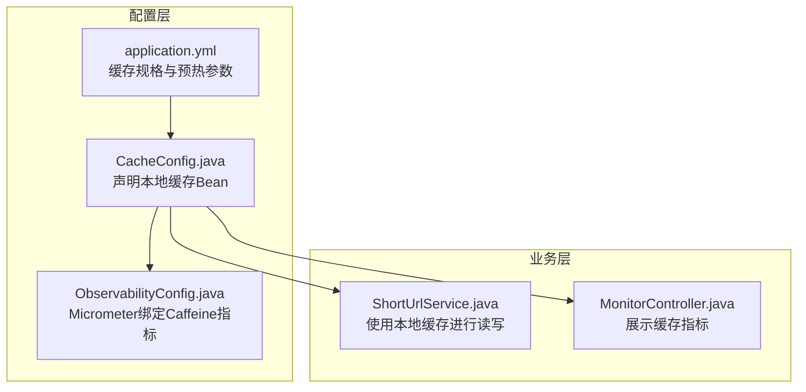
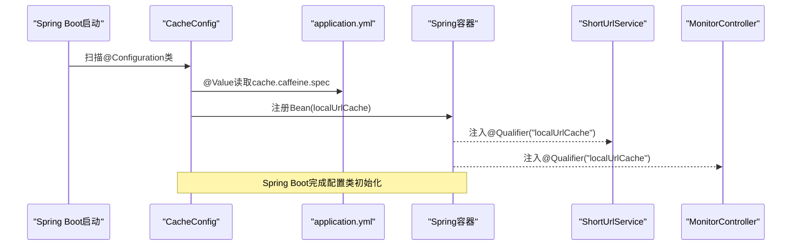
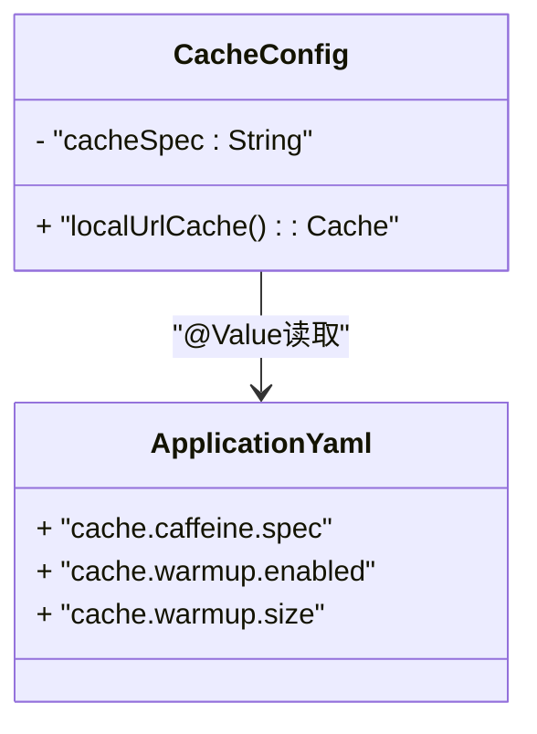
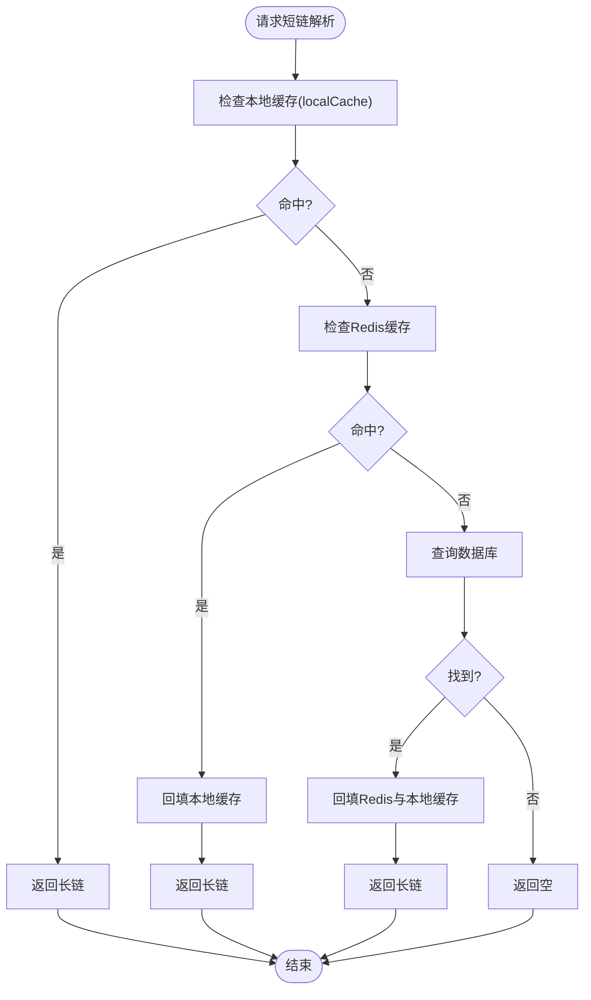
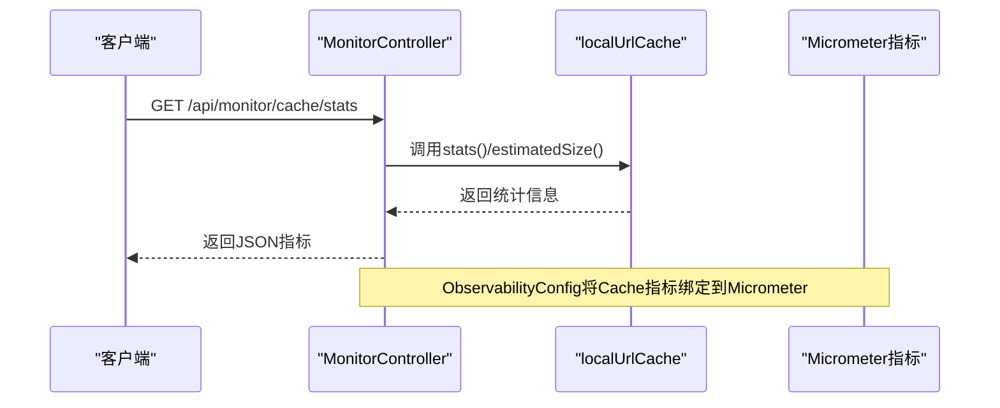
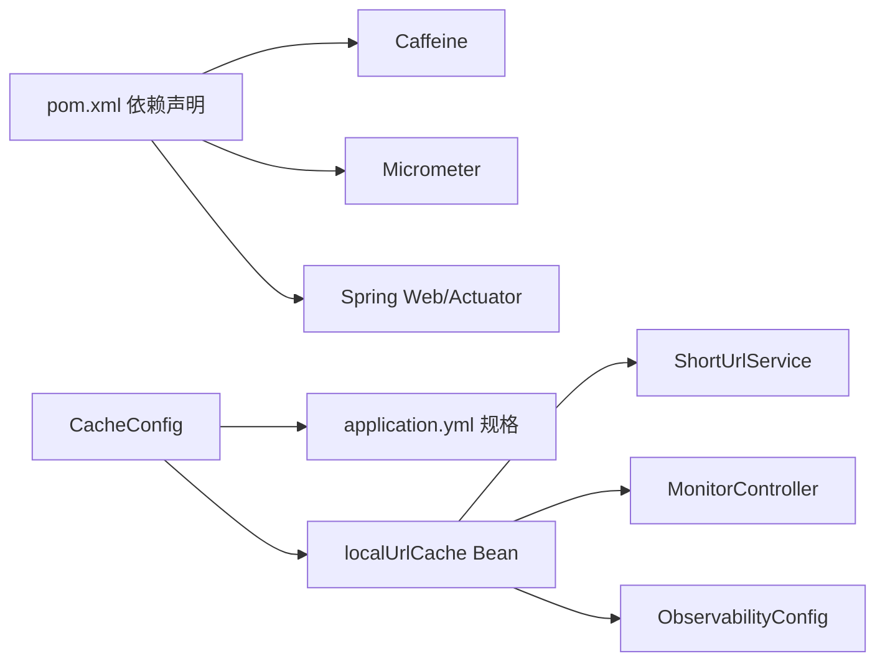

# 缓存配置详解

<cite>
**本文引用的文件**
- [CacheConfig.java](file://src/main/java/com/layor/tinyflow/config/CacheConfig.java)
- [application.yml](file://src/main/resources/application.yml)
- [ShortUrlService.java](file://src/main/java/com/layor/tinyflow/service/ShortUrlService.java)
- [MonitorController.java](file://src/main/java/com/layor/tinyflow/Controller/MonitorController.java)
- [ObservabilityConfig.java](file://src/main/java/com/layor/tinyflow/config/ObservabilityConfig.java)
- [pom.xml](file://pom.xml)
</cite>

## 目录
1. [简介](#简介)
2. [项目结构](#项目结构)
3. [核心组件](#核心组件)
4. [架构总览](#架构总览)
5. [详细组件分析](#详细组件分析)
6. [依赖关系分析](#依赖关系分析)
7. [性能考量](#性能考量)
8. [故障排查指南](#故障排查指南)
9. [结论](#结论)

## 简介
本文件围绕 CacheConfig 类的缓存配置实现进行深入解析，重点说明：
- @Value 注解如何从 application.yml 读取 Caffeine 缓存规格（maximumSize、expireAfterWrite、recordStats）
- localUrlCache() 方法如何通过 Caffeine.from() 创建具备统计功能的本地缓存实例
- 配置参数对缓存性能的影响：最大容量限制、写入后过期策略、命中率监控
- 结合 Spring Boot 自动配置机制说明该配置类的加载时机与作用范围

同时，文档还展示了该本地缓存在业务层（ShortUrlService）与可观测性（Micrometer 绑定）中的使用方式，并提供性能优化建议与常见问题排查思路。

## 项目结构
与缓存配置相关的关键文件与职责如下：
- 配置类：负责声明并注入 Caffeine 缓存 Bean
- 应用配置：提供缓存规格字符串与预热参数
- 业务服务：在运行时使用本地缓存进行读写
- 监控控制器：展示缓存命中率等指标
- 可观测性配置：将 Caffeine 缓存指标绑定到 Micrometer

图表来源
- [CacheConfig.java](file://src/main/java/com/layor/tinyflow/config/CacheConfig.java#L1-L20)
- [application.yml](file://src/main/resources/application.yml#L141-L147)
- [ShortUrlService.java](file://src/main/java/com/layor/tinyflow/service/ShortUrlService.java#L40-L43)
- [MonitorController.java](file://src/main/java/com/layor/tinyflow/Controller/MonitorController.java#L30-L33)
- [ObservabilityConfig.java](file://src/main/java/com/layor/tinyflow/config/ObservabilityConfig.java#L49-L58)

章节来源
- [CacheConfig.java](file://src/main/java/com/layor/tinyflow/config/CacheConfig.java#L1-L20)
- [application.yml](file://src/main/resources/application.yml#L141-L147)
- [ShortUrlService.java](file://src/main/java/com/layor/tinyflow/service/ShortUrlService.java#L40-L43)
- [MonitorController.java](file://src/main/java/com/layor/tinyflow/Controller/MonitorController.java#L30-L33)
- [ObservabilityConfig.java](file://src/main/java/com/layor/tinyflow/config/ObservabilityConfig.java#L49-L58)

## 核心组件
- CacheConfig：Spring 配置类，通过 @Value 注入缓存规格字符串，并以 Bean 名称 localUrlCache 暴露 Caffeine 缓存实例。
- application.yml：集中管理缓存规格（maximumSize、expireAfterWrite、recordStats）与预热开关、预热规模等参数。
- ShortUrlService：在运行时注入 localUrlCache，用于短链长链映射的本地缓存读写。
- MonitorController：通过 @Qualifier("localUrlCache") 注入本地缓存，提供健康与缓存统计接口。
- ObservabilityConfig：将本地缓存注册为 Micrometer 指标，便于 Prometheus 等导出。

章节来源
- [CacheConfig.java](file://src/main/java/com/layor/tinyflow/config/CacheConfig.java#L1-L20)
- [application.yml](file://src/main/resources/application.yml#L141-L147)
- [ShortUrlService.java](file://src/main/java/com/layor/tinyflow/service/ShortUrlService.java#L40-L43)
- [MonitorController.java](file://src/main/java/com/layor/tinyflow/Controller/MonitorController.java#L30-L33)
- [ObservabilityConfig.java](file://src/main/java/com/layor/tinyflow/config/ObservabilityConfig.java#L49-L58)

## 架构总览
下图展示了缓存配置在系统中的位置与交互关系，以及 Spring Boot 自动配置对配置类的加载时机影响。

图表来源
- [CacheConfig.java](file://src/main/java/com/layor/tinyflow/config/CacheConfig.java#L1-L20)
- [application.yml](file://src/main/resources/application.yml#L141-L147)
- [ShortUrlService.java](file://src/main/java/com/layor/tinyflow/service/ShortUrlService.java#L40-L43)
- [MonitorController.java](file://src/main/java/com/layor/tinyflow/Controller/MonitorController.java#L30-L33)

## 详细组件分析

### CacheConfig 类解析
- @Value 注解读取缓存规格
  - 语法：${cache.caffeine.spec:默认值}
  - 默认值包含 maximumSize、expireAfterWrite、recordStats
  - 实际值来自 application.yml 中 cache.caffeine.spec 字段
- localUrlCache() 方法
  - 使用 Caffeine.from(cacheSpec).build() 创建缓存实例
  - 通过 @Bean("localUrlCache") 暴露为 Spring Bean
  - 返回类型为 Cache<String, String>，键为短码，值为长链

图表来源
- [CacheConfig.java](file://src/main/java/com/layor/tinyflow/config/CacheConfig.java#L11-L18)
- [application.yml](file://src/main/resources/application.yml#L141-L147)

章节来源
- [CacheConfig.java](file://src/main/java/com/layor/tinyflow/config/CacheConfig.java#L11-L18)
- [application.yml](file://src/main/resources/application.yml#L141-L147)

### application.yml 中的缓存规格
- cache.caffeine.spec：定义 Caffeine 规格字符串，包含 maximumSize、expireAfterWrite、recordStats
- cache.warmup.enabled：控制启动时预热开关
- cache.warmup.size：控制预热加载的热点条目数量

章节来源
- [application.yml](file://src/main/resources/application.yml#L141-L147)

### 业务层使用：ShortUrlService
- 注入本地缓存
  - @Qualifier("localUrlCache") 注入 Cache<String, String>
  - 在启动时根据配置执行预热（@PostConstruct）
- 读写流程
  - 读：优先从本地缓存命中；未命中再回源至 Redis 或数据库
  - 写：命中 Redis 或数据库后，回填本地缓存

图表来源
- [ShortUrlService.java](file://src/main/java/com/layor/tinyflow/service/ShortUrlService.java#L162-L200)
- [ShortUrlService.java](file://src/main/java/com/layor/tinyflow/service/ShortUrlService.java#L319-L353)

章节来源
- [ShortUrlService.java](file://src/main/java/com/layor/tinyflow/service/ShortUrlService.java#L40-L43)
- [ShortUrlService.java](file://src/main/java/com/layor/tinyflow/service/ShortUrlService.java#L162-L200)
- [ShortUrlService.java](file://src/main/java/com/layor/tinyflow/service/ShortUrlService.java#L319-L353)

### 监控与可观测性：MonitorController 与 ObservabilityConfig
- MonitorController
  - 通过 @Qualifier("localUrlCache") 注入本地缓存
  - 提供 /api/monitor/health 与 /api/monitor/cache/stats 接口，展示缓存命中率、大小、淘汰次数等
- ObservabilityConfig
  - 将本地缓存注册为 Micrometer 指标，标签包含 cache=l1
  - 与 Actuator、Prometheus 集成，便于导出与告警

图表来源
- [MonitorController.java](file://src/main/java/com/layor/tinyflow/Controller/MonitorController.java#L30-L33)
- [MonitorController.java](file://src/main/java/com/layor/tinyflow/Controller/MonitorController.java#L80-L96)
- [ObservabilityConfig.java](file://src/main/java/com/layor/tinyflow/config/ObservabilityConfig.java#L49-L58)

章节来源
- [MonitorController.java](file://src/main/java/com/layor/tinyflow/Controller/MonitorController.java#L30-L33)
- [MonitorController.java](file://src/main/java/com/layor/tinyflow/Controller/MonitorController.java#L80-L96)
- [ObservabilityConfig.java](file://src/main/java/com/layor/tinyflow/config/ObservabilityConfig.java#L49-L58)

## 依赖关系分析
- 外部依赖
  - Caffeine：本地缓存实现
  - Micrometer：指标绑定与导出
  - Spring Boot Starter Web/Actuator：自动配置与监控端点
- 内部依赖
  - CacheConfig 依赖 application.yml 中的缓存规格
  - ShortUrlService 依赖 CacheConfig 暴露的 localUrlCache Bean
  - MonitorController 依赖 CacheConfig 暴露的 localUrlCache Bean
  - ObservabilityConfig 依赖 CacheConfig 暴露的 localUrlCache Bean

图表来源
- [pom.xml](file://pom.xml#L100-L108)
- [CacheConfig.java](file://src/main/java/com/layor/tinyflow/config/CacheConfig.java#L11-L18)
- [application.yml](file://src/main/resources/application.yml#L141-L147)
- [ShortUrlService.java](file://src/main/java/com/layor/tinyflow/service/ShortUrlService.java#L40-L43)
- [MonitorController.java](file://src/main/java/com/layor/tinyflow/Controller/MonitorController.java#L30-L33)
- [ObservabilityConfig.java](file://src/main/java/com/layor/tinyflow/config/ObservabilityConfig.java#L49-L58)

章节来源
- [pom.xml](file://pom.xml#L100-L108)
- [CacheConfig.java](file://src/main/java/com/layor/tinyflow/config/CacheConfig.java#L11-L18)
- [application.yml](file://src/main/resources/application.yml#L141-L147)
- [ShortUrlService.java](file://src/main/java/com/layor/tinyflow/service/ShortUrlService.java#L40-L43)
- [MonitorController.java](file://src/main/java/com/layor/tinyflow/Controller/MonitorController.java#L30-L33)
- [ObservabilityConfig.java](file://src/main/java/com/layor/tinyflow/config/ObservabilityConfig.java#L49-L58)

## 性能考量
- 最大容量限制（maximumSize）
  - 影响：控制本地缓存占用内存上限，避免 OOM；容量过小会导致频繁淘汰，命中率下降
  - 建议：结合业务热点数据量与峰值并发估算，预留一定冗余
- 写入后过期策略（expireAfterWrite）
  - 影响：控制缓存项的生命周期，过期后自动失效；过短会增加回源频率，过长会占用内存
  - 建议：根据短链访问模式与长链稳定性设置，例如 10 分钟到数小时不等
- 命中率监控（recordStats）
  - 影响：开启统计后可获取 hitRate、missRate、evictionCount 等指标，便于评估命中效果与容量/过期策略合理性
  - 建议：生产环境务必开启，配合 Micrometer/Prometheus 持续观察
- 预热（cache.warmup）
  - 影响：启动时加载热点短链到本地缓存，降低首请求延迟
  - 建议：结合历史访问数据设定 warmup.size，避免一次性加载过多导致启动卡顿

章节来源
- [application.yml](file://src/main/resources/application.yml#L141-L147)
- [ShortUrlService.java](file://src/main/java/com/layor/tinyflow/service/ShortUrlService.java#L162-L200)
- [MonitorController.java](file://src/main/java/com/layor/tinyflow/Controller/MonitorController.java#L80-L96)
- [ObservabilityConfig.java](file://src/main/java/com/layor/tinyflow/config/ObservabilityConfig.java#L49-L58)

## 故障排查指南
- 缓存规格未生效
  - 检查 application.yml 中 cache.caffeine.spec 是否存在且拼写正确
  - 确认 @Value 注解的占位符与实际键一致
- 缓存命中率低
  - 查看 /api/monitor/cache/stats 中的 hitRate、missRate、evictionCount
  - 调整 maximumSize 与 expireAfterWrite，或优化热点数据预热
- 指标未导出
  - 确认已引入 Micrometer 与 Prometheus 依赖，并启用 Actuator
  - 检查 ObservabilityConfig 是否正确注册本地缓存指标
- 启动预热失败
  - 查看日志中 warmup 失败提示，确认数据库连接与权限
  - 适当降低 warmup.size，避免启动阶段资源压力过大

章节来源
- [application.yml](file://src/main/resources/application.yml#L141-L147)
- [MonitorController.java](file://src/main/java/com/layor/tinyflow/Controller/MonitorController.java#L80-L96)
- [ObservabilityConfig.java](file://src/main/java/com/layor/tinyflow/config/ObservabilityConfig.java#L49-L58)
- [ShortUrlService.java](file://src/main/java/com/layor/tinyflow/service/ShortUrlService.java#L162-L200)

## 结论
- CacheConfig 通过 @Value 从 application.yml 读取 Caffeine 规格，并以 localUrlCache Bean 暴露给业务使用
- localUrlCache() 使用 Caffeine.from(cacheSpec).build() 创建具备统计能力的本地缓存实例
- 配置参数对性能有直接影响：容量决定内存占用与淘汰频率，过期策略决定数据新鲜度与回源成本，recordStats 为性能优化提供数据支撑
- 结合 Spring Boot 自动配置，该配置类在应用启动时被扫描并注册 Bean，随后在业务层与监控层被广泛使用
- 建议在生产环境中开启 recordStats 与 Micrometer 指标导出，持续监控命中率与淘汰情况，动态调整缓存规格与预热策略