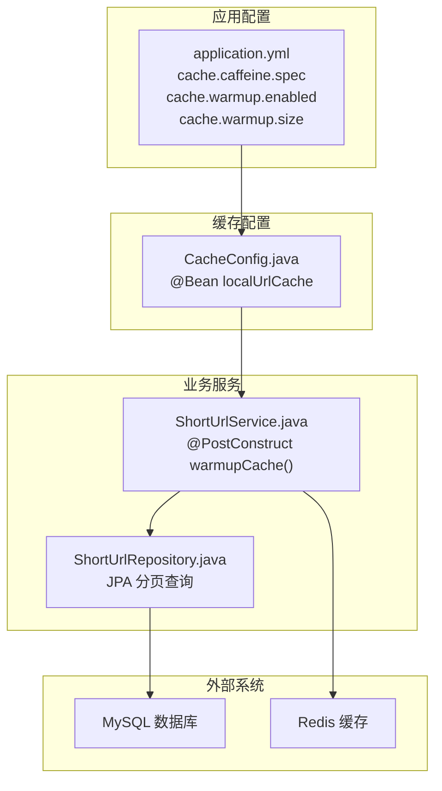
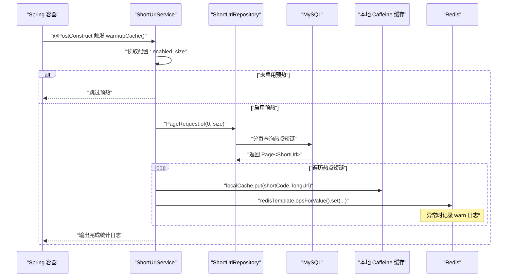
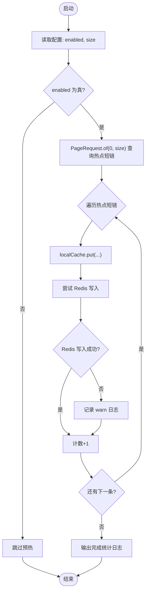
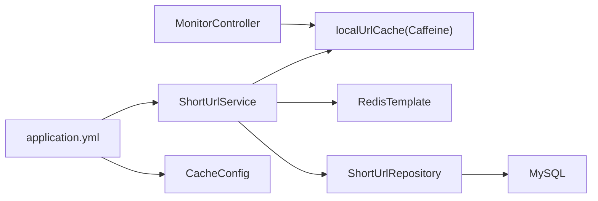

# 缓存预热机制

<cite>
**本文引用的文件**
- [ShortUrlService.java](file://src/main/java/com/layor/tinyflow/service/ShortUrlService.java)
- [application.yml](file://src/main/resources/application.yml)
- [CacheConfig.java](file://src/main/java/com/layor/tinyflow/config/CacheConfig.java)
- [MonitorController.java](file://src/main/java/com/layor/tinyflow/Controller/MonitorController.java)
- [ShortUrlRepository.java](file://src/main/java/com/layor/tinyflow/repository/ShortUrlRepository.java)
</cite>

## 目录
1. [简介](#简介)
2. [项目结构](#项目结构)
3. [核心组件](#核心组件)
4. [架构总览](#架构总览)
5. [详细组件分析](#详细组件分析)
6. [依赖关系分析](#依赖关系分析)
7. [性能考量](#性能考量)
8. [故障排查指南](#故障排查指南)
9. [结论](#结论)

## 简介
本文件围绕 Spring 容器在应用启动时通过 @PostConstruct 注解触发的 warmupCache() 方法进行深入解析，阐述其工作原理、数据流与容错策略，并结合配置项 cache.warmup.enabled 与 cache.warmup.size 的最佳实践，帮助读者理解该机制如何在系统冷启动阶段显著降低首次访问延迟、提升整体吞吐与稳定性。

## 项目结构
- 缓存预热位于业务服务层，具体实现于 ShortUrlService 中，负责在应用启动后按配置加载热点短链至本地 Caffeine 缓存与 Redis 缓存。
- 应用配置集中于 application.yml，包含缓存规格、预热开关与预热规模等关键参数。
- 本地缓存 Bean 在 CacheConfig 中声明，供服务注入使用。
- 监控端点 MonitorController 提供本地缓存命中率与容量等可观测性指标，便于评估预热效果。

图表来源
- [application.yml](file://src/main/resources/application.yml#L141-L147)
- [CacheConfig.java](file://src/main/java/com/layor/tinyflow/config/CacheConfig.java#L1-L19)
- [ShortUrlService.java](file://src/main/java/com/layor/tinyflow/service/ShortUrlService.java#L162-L200)
- [ShortUrlRepository.java](file://src/main/java/com/layor/tinyflow/repository/ShortUrlRepository.java#L1-L68)

章节来源
- [application.yml](file://src/main/resources/application.yml#L141-L147)
- [CacheConfig.java](file://src/main/java/com/layor/tinyflow/config/CacheConfig.java#L1-L19)
- [ShortUrlService.java](file://src/main/java/com/layor/tinyflow/service/ShortUrlService.java#L162-L200)
- [ShortUrlRepository.java](file://src/main/java/com/layor/tinyflow/repository/ShortUrlRepository.java#L1-L68)

## 核心组件
- 预热入口与控制
  - @PostConstruct 标记的 warmupCache() 在容器启动完成后自动执行。
  - 通过 @Value 注入配置：
    - cache.warmup.enabled：是否启用预热，默认开启。
    - cache.warmup.size：预热加载的热点短链数量上限。
- 数据源与分页
  - 使用 PageRequest.of(0, warmupSize) 从数据库查询前 N 条短链记录。
  - 查询接口来自 ShortUrlRepository，底层基于 JPA 分页能力。
- 缓存写入
  - L1 本地缓存：通过 localCache.put(key, value) 写入 Caffeine。
  - L2 Redis 缓存：通过 redisTemplate.opsForValue().set(key, value, TTL) 写入 Redis。
- 容错与日志
  - Redis 写入采用 try-catch 包裹，异常仅记录 warn 日志，不影响整体预热流程。
  - 预热开始与完成均输出 info 级日志，便于观测。
- 监控与验证
  - MonitorController 提供本地缓存命中率、大小等指标，可用于评估预热效果。

章节来源
- [ShortUrlService.java](file://src/main/java/com/layor/tinyflow/service/ShortUrlService.java#L44-L51)
- [ShortUrlService.java](file://src/main/java/com/layor/tinyflow/service/ShortUrlService.java#L162-L200)
- [ShortUrlRepository.java](file://src/main/java/com/layor/tinyflow/repository/ShortUrlRepository.java#L1-L68)
- [MonitorController.java](file://src/main/java/com/layor/tinyflow/Controller/MonitorController.java#L64-L96)

## 架构总览
下图展示预热流程在启动阶段的调用序列，以及与数据库、本地缓存、Redis 的交互关系。

图表来源
- [ShortUrlService.java](file://src/main/java/com/layor/tinyflow/service/ShortUrlService.java#L162-L200)
- [ShortUrlRepository.java](file://src/main/java/com/layor/tinyflow/repository/ShortUrlRepository.java#L1-L68)

## 详细组件分析

### 预热方法 warmupCache() 实现要点
- 启动条件
  - 仅当 cache.warmup.enabled 为真时执行预热。
- 数据加载
  - 使用 PageRequest.of(0, warmupSize) 获取第一页、大小为 warmupSize 的热点短链集合。
  - 遍历集合，逐条写入 L1 与 L2 缓存。
- L2 Redis 容错
  - 对 Redis 写入操作包裹 try-catch，捕获异常并记录 warn 日志，避免单个短链失败影响整体预热。
- 统计与日志
  - 记录 L1/L2 成功写入数量，预热完成后输出完成统计日志。
  - 预热过程中的异常统一记录 error 日志，便于问题定位。

图表来源
- [ShortUrlService.java](file://src/main/java/com/layor/tinyflow/service/ShortUrlService.java#L162-L200)

章节来源
- [ShortUrlService.java](file://src/main/java/com/layor/tinyflow/service/ShortUrlService.java#L162-L200)

### 本地缓存与 Redis 写入策略
- 本地缓存（L1）
  - 通过 CacheConfig 声明的 localUrlCache Bean 提供 Caffeine 缓存实例。
  - 预热时直接 put 到本地缓存，后续请求优先命中 L1，减少网络开销。
- Redis 缓存（L2）
  - 预热时将热点短链写入 Redis，键名采用统一前缀，便于后续查询与管理。
  - 写入失败不影响预热主流程，仅记录 warn 日志，确保系统稳定。

章节来源
- [CacheConfig.java](file://src/main/java/com/layor/tinyflow/config/CacheConfig.java#L1-L19)
- [ShortUrlService.java](file://src/main/java/com/layor/tinyflow/service/ShortUrlService.java#L162-L200)

### 查询路径与回源策略（与预热协同）
- 预热并不改变运行时查询路径，但能显著提升冷启动后的命中率。
- 运行时查询顺序：L1 → L2 → 数据库回源；Redis 异常会触发熔断器与降级逻辑，保证系统可用性。

章节来源
- [ShortUrlService.java](file://src/main/java/com/layor/tinyflow/service/ShortUrlService.java#L302-L366)

## 依赖关系分析
- 组件耦合
  - ShortUrlService 依赖本地缓存 Bean、Redis 模板、JPA Repository 与配置值。
  - CacheConfig 与 application.yml 共同决定本地缓存容量与预热规模。
- 外部依赖
  - MySQL：提供热点短链数据源。
  - Redis：提供 L2 缓存，承担跨实例共享与高并发场景下的缓存压力。
- 可观测性
  - MonitorController 暴露本地缓存命中率与容量，用于评估预热效果与缓存健康度。

图表来源
- [ShortUrlService.java](file://src/main/java/com/layor/tinyflow/service/ShortUrlService.java#L44-L51)
- [CacheConfig.java](file://src/main/java/com/layor/tinyflow/config/CacheConfig.java#L1-L19)
- [MonitorController.java](file://src/main/java/com/layor/tinyflow/Controller/MonitorController.java#L64-L96)
- [application.yml](file://src/main/resources/application.yml#L141-L147)

章节来源
- [ShortUrlService.java](file://src/main/java/com/layor/tinyflow/service/ShortUrlService.java#L44-L51)
- [CacheConfig.java](file://src/main/java/com/layor/tinyflow/config/CacheConfig.java#L1-L19)
- [MonitorController.java](file://src/main/java/com/layor/tinyflow/Controller/MonitorController.java#L64-L96)
- [application.yml](file://src/main/resources/application.yml#L141-L147)

## 性能考量
- 预热收益
  - 冷启动阶段提前填充热点短链，可显著降低首次访问延迟，提升首屏响应与吞吐。
  - L1 命中率提升，减少对 Redis 与数据库的访问压力。
- 预热规模建议
  - warmup.size 建议与系统峰值 QPS、热点短链覆盖度相匹配。过大可能导致启动时间延长与内存占用上升；过小则无法覆盖热点，收益有限。
  - 可结合 MonitorController 的命中率与容量指标进行 A/B 测试，逐步调优。
- 缓存规格
  - cache.caffeine.spec 控制本地缓存容量、过期策略与统计开关，应与 warmup.size 协同设置，避免频繁淘汰导致命中率下降。
- Redis 容错
  - Redis 写入异常仅记录 warn 日志，不影响预热主流程，但需关注 Redis 健康度与连接池配置，避免预热期间大量失败。

章节来源
- [application.yml](file://src/main/resources/application.yml#L141-L147)
- [CacheConfig.java](file://src/main/java/com/layor/tinyflow/config/CacheConfig.java#L1-L19)
- [MonitorController.java](file://src/main/java/com/layor/tinyflow/Controller/MonitorController.java#L64-L96)
- [ShortUrlService.java](file://src/main/java/com/layor/tinyflow/service/ShortUrlService.java#L162-L200)

## 故障排查指南
- 预热未生效
  - 检查 cache.warmup.enabled 是否为真。
  - 确认 warmup.size 是否合理，过大可能导致启动超时。
- Redis 写入失败
  - 查看 warn 日志，定位具体 shortCode 与异常原因。
  - 关注 Redis 连接池、超时与网络状况。
- 命中率低
  - 通过 MonitorController 的命中率与容量指标判断是否需要增大 warmup.size 或调整本地缓存规格。
- 启动时间过长
  - 减小 warmup.size 或分批预热，避免一次性加载过多热点短链。

章节来源
- [ShortUrlService.java](file://src/main/java/com/layor/tinyflow/service/ShortUrlService.java#L162-L200)
- [MonitorController.java](file://src/main/java/com/layor/tinyflow/Controller/MonitorController.java#L64-L96)

## 结论
warmupCache() 通过在应用启动阶段按配置加载热点短链，将数据同时写入本地 Caffeine 与 Redis，从而在冷启动后显著提升命中率与响应速度。其设计具备良好的容错性与可观测性：Redis 写入异常不会阻断预热，且通过日志与监控指标可量化评估效果。结合合理的 warmup.size 与本地缓存规格，可在性能与资源占用之间取得平衡，为系统稳定运行提供保障。