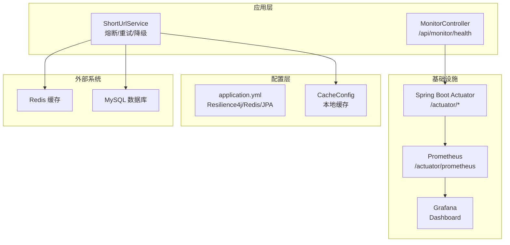
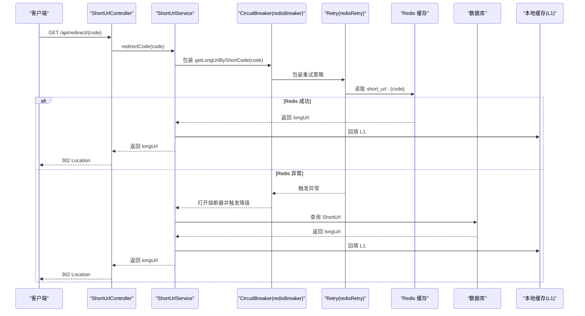
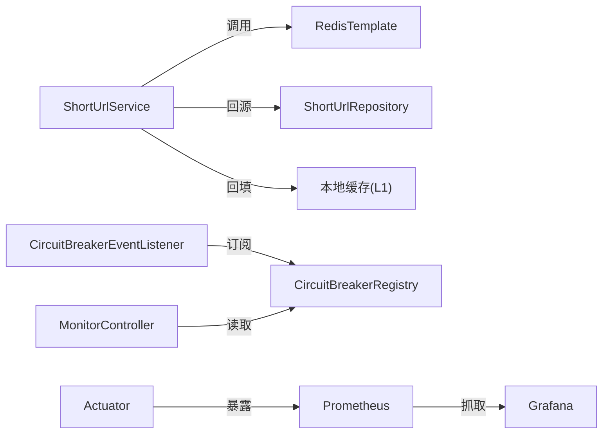
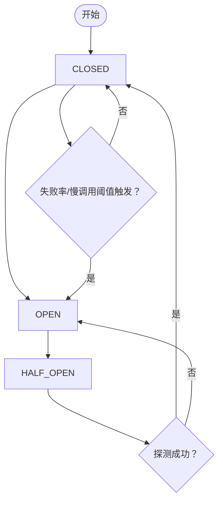

# 熔断与降级机制

<cite>
**本文引用的文件**
- [TinyFlowApplication.java](file://src/main/java/com/layor/tinyflow/TinyFlowApplication.java)
- [application.yml](file://src/main/resources/application.yml)
- [ShortUrlService.java](file://src/main/java/com/layor/tinyflow/service/ShortUrlService.java)
- [MonitorController.java](file://src/main/java/com/layor/tinyflow/Controller/MonitorController.java)
- [CircuitBreakerEventListener.java](file://src/main/java/com/layor/tinyflow/listener/CircuitBreakerEventListener.java)
- [CacheConfig.java](file://src/main/java/com/layor/tinyflow/config/CacheConfig.java)
- [ShortUrlRepository.java](file://src/main/java/com/layor/tinyflow/repository/ShortUrlRepository.java)
- [SecurityConfig.java](file://src/main/java/com/layor/tinyflow/config/SecurityConfig.java)
- [pom.xml](file://pom.xml)
- [prometheus.yml](file://web/infra/observability/prometheus.yml)
- [docker-compose.yml](file://web/infra/observability/docker-compose.yml)
- [shortener-overview.json](file://web/infra/observability/dashboards/shortener-overview.json)
- [OBSERVABILITY.md](file://OBSERVABILITY.md)
</cite>

## 目录
1. [简介](#简介)
2. [项目结构](#项目结构)
3. [核心组件](#核心组件)
4. [架构总览](#架构总览)
5. [详细组件分析](#详细组件分析)
6. [依赖关系分析](#依赖关系分析)
7. [性能考量](#性能考量)
8. [故障排查指南](#故障排查指南)
9. [结论](#结论)
10. [附录](#附录)

## 简介
本文件围绕基于 Resilience4j 的熔断与降级实现进行深入解析，重点覆盖以下内容：
- 注解配置：@CircuitBreaker(name = "redisBreaker", fallbackMethod = "redisFallback") 与 @Retry(name = "redisRetry") 的参数含义与行为
- 故障转移流程：当 Redis 异常时，熔断器如何触发降级方法 redisFallback，直接查询数据库并回填本地缓存
- 熔断器状态机：CLOSED、OPEN、HALF_OPEN 的转换条件与监控指标
- 监控端点与告警：/api/monitor/health、/actuator/* 的访问方式，以及通过 Prometheus 和 Grafana 监控熔断器状态的实践建议

## 项目结构
本项目采用 Spring Boot 结构，关键与熔断降级相关的模块如下：
- 服务层：ShortUrlService 提供短链跳转与长链解析，包含熔断与重试注解及降级方法
- 配置层：application.yml 中定义 Resilience4j 熔断器、重试、舱壁隔离等实例参数
- 监控层：MonitorController 提供系统健康与缓存状态查询；Actuator 暴露 Prometheus 指标；Prometheus/Grafana 仪表盘可视化
- 事件监听：CircuitBreakerEventListener 订阅熔断器状态转换事件并输出日志

图表来源
- [ShortUrlService.java](file://src/main/java/com/layor/tinyflow/service/ShortUrlService.java#L288-L366)
- [application.yml](file://src/main/resources/application.yml#L148-L211)
- [MonitorController.java](file://src/main/java/com/layor/tinyflow/Controller/MonitorController.java#L34-L69)
- [CacheConfig.java](file://src/main/java/com/layor/tinyflow/config/CacheConfig.java#L12-L18)
- [prometheus.yml](file://web/infra/observability/prometheus.yml#L1-L9)
- [docker-compose.yml](file://web/infra/observability/docker-compose.yml#L1-L21)

章节来源
- [application.yml](file://src/main/resources/application.yml#L148-L211)
- [ShortUrlService.java](file://src/main/java/com/layor/tinyflow/service/ShortUrlService.java#L288-L366)
- [MonitorController.java](file://src/main/java/com/layor/tinyflow/Controller/MonitorController.java#L34-L69)

## 核心组件
- 熔断器实例 redisBreaker：用于保护 Redis 缓存读写，异常类型与阈值由配置决定
- 重试实例 redisRetry：对 Redis 连接失败等异常进行指数退避重试
- 降级方法 redisFallback：当熔断器打开或重试耗尽时，直接查询数据库并回填本地缓存
- 本地缓存 localUrlCache：基于 Caffeine 的 L1 缓存，提升命中率与延迟表现
- 监控端点：/api/monitor/health 返回熔断器状态；/actuator/* 暴露 Micrometer 指标

章节来源
- [application.yml](file://src/main/resources/application.yml#L148-L211)
- [ShortUrlService.java](file://src/main/java/com/layor/tinyflow/service/ShortUrlService.java#L288-L366)
- [CacheConfig.java](file://src/main/java/com/layor/tinyflow/config/CacheConfig.java#L12-L18)
- [MonitorController.java](file://src/main/java/com/layor/tinyflow/Controller/MonitorController.java#L34-L69)

## 架构总览
下图展示从请求进入至最终返回的关键路径，以及熔断与降级在其中的作用位置。

图表来源
- [ShortUrlService.java](file://src/main/java/com/layor/tinyflow/service/ShortUrlService.java#L288-L366)
- [application.yml](file://src/main/resources/application.yml#L148-L211)

## 详细组件分析

### 注解与配置参数详解
- @CircuitBreaker(name = "redisBreaker", fallbackMethod = "redisFallback")
  - name：指定熔断器实例名为 redisBreaker
  - fallbackMethod：当熔断器打开或异常达到阈值时，调用同类中的 redisFallback 方法
- @Retry(name = "redisRetry")
  - name：指定重试实例名为 redisRetry
  - 配合指数退避策略，对 Redis 连接失败等异常进行最多若干次重试

Redis 熔断器与重试的关键参数（来自配置文件）：
- redisBreaker（COUNT_BASED 滑动窗口）
  - slidingWindowSize：滑动窗口大小为 100
  - minimumNumberOfCalls：最小请求数为 10
  - failureRateThreshold：失败率阈值为 50%
  - slowCallRateThreshold：慢调用阈值为 80%
  - slowCallDurationThreshold：慢调用阈值时间为 1000ms
  - waitDurationInOpenState：OPEN 状态持续时间为 30s
  - permittedNumberOfCallsInHalfOpenState：半开状态允许的并发调用数为 5
  - recordExceptions：记录 Redis 连接失败与 Socket 超时异常
  - ignoreExceptions：忽略非法参数异常
- redisRetry（指数退避）
  - maxAttempts：最大重试次数为 3
  - waitDuration：基础等待时间为 100ms
  - enableExponentialBackoff：启用指数退避
  - exponentialBackoffMultiplier：退避倍数为 2
  - retryExceptions：仅对 Redis 连接失败异常进行重试

章节来源
- [ShortUrlService.java](file://src/main/java/com/layor/tinyflow/service/ShortUrlService.java#L302-L304)
- [application.yml](file://src/main/resources/application.yml#L148-L211)

### 降级方法 redisFallback 的执行逻辑
当 Redis 异常导致熔断器打开或重试耗尽时，调用 redisFallback：
- 直接查询数据库（ShortUrlRepository.findByShortCode）
- 若存在记录，则将 longUrl 回填至本地缓存（L1），随后返回
- 若不存在，则返回空值

该流程确保在 Redis 不可用时仍能通过数据库回源，维持服务可用性。

章节来源
- [ShortUrlService.java](file://src/main/java/com/layor/tinyflow/service/ShortUrlService.java#L355-L366)
- [ShortUrlRepository.java](file://src/main/java/com/layor/tinyflow/repository/ShortUrlRepository.java#L16-L17)

### 缓存回填与本地缓存
- L1 本地缓存：通过 Caffeine 构建，命中后直接返回，避免对 Redis 与数据库的压力
- L2 Redis 缓存：在数据库回源后写入 Redis，并设置过期时间
- L3 数据库：作为最终回源，保证在 Redis 不可用时仍可提供服务

章节来源
- [ShortUrlService.java](file://src/main/java/com/layor/tinyflow/service/ShortUrlService.java#L308-L352)
- [CacheConfig.java](file://src/main/java/com/layor/tinyflow/config/CacheConfig.java#L12-L18)

### 熔断器状态机与转换条件
- CLOSED（闭合）：正常运行，统计请求与错误，达到阈值前保持开放
- OPEN（打开）：失败率或慢调用超过阈值，熔断器打开，后续请求直接触发降级
- HALF_OPEN（半开）：OPEN 状态持续结束后，允许少量请求探测下游健康状况，若成功则切换到 CLOSED，否则继续保持 OPEN

转换条件与配置要点：
- failureRateThreshold：失败率阈值
- slowCallRateThreshold/slowCallDurationThreshold：慢调用阈值
- minimumNumberOfCalls：最小样本数，避免样本过少导致误判
- waitDurationInOpenState：OPEN 状态持续时间
- permittedNumberOfCallsInHalfOpenState：半开状态允许的并发探测调用数
- slidingWindowType/slidingWindowSize：滑动窗口类型与大小

章节来源
- [application.yml](file://src/main/resources/application.yml#L148-L211)
- [CircuitBreakerEventListener.java](file://src/main/java/com/layor/tinyflow/listener/CircuitBreakerEventListener.java#L34-L57)

### 监控端点与告警
- /api/monitor/health：返回系统健康状态，包含各熔断器名称与当前状态
- /actuator/circuitbreakers：暴露 Resilience4j 熔断器指标
- /actuator/prometheus：暴露 Micrometer 指标，供 Prometheus 抓取
- /actuator/*：默认暴露 health、info、metrics、prometheus 等端点

访问方式与安全：
- 在安全配置中，/actuator/** 对外开放，便于监控与运维访问
- 生产环境建议限制访问来源或增加鉴权

章节来源
- [MonitorController.java](file://src/main/java/com/layor/tinyflow/Controller/MonitorController.java#L34-L69)
- [OBSERVABILITY.md](file://OBSERVABILITY.md#L69-L144)
- [SecurityConfig.java](file://src/main/java/com/layor/tinyflow/config/SecurityConfig.java#L57-L75)

### Prometheus 与 Grafana 监控实践
- Prometheus 抓取配置：job_name 指向后端服务，指标路径为 /actuator/prometheus
- Grafana 仪表盘：可参考 shortener-overview.json 中的面板配置，监控请求速率、延迟分位、错误率等

章节来源
- [prometheus.yml](file://web/infra/observability/prometheus.yml#L1-L9)
- [docker-compose.yml](file://web/infra/observability/docker-compose.yml#L1-L21)
- [shortener-overview.json](file://web/infra/observability/dashboards/shortener-overview.json#L1-L55)

## 依赖关系分析
- 熔断与重试：通过注解与配置文件驱动，作用于 ShortUrlService 的 getLongUrlByShortCode 方法
- 事件监听：CircuitBreakerEventListener 订阅所有熔断器的状态转换事件，输出日志并在 OPEN 时触发告警
- 监控集成：Actuator 暴露指标，Prometheus 抓取，Grafana 可视化
- 缓存链路：L1（本地缓存）+ L2（Redis）+ L3（数据库）

图表来源
- [ShortUrlService.java](file://src/main/java/com/layor/tinyflow/service/ShortUrlService.java#L288-L366)
- [CircuitBreakerEventListener.java](file://src/main/java/com/layor/tinyflow/listener/CircuitBreakerEventListener.java#L17-L32)
- [MonitorController.java](file://src/main/java/com/layor/tinyflow/Controller/MonitorController.java#L34-L69)
- [prometheus.yml](file://web/infra/observability/prometheus.yml#L1-L9)

章节来源
- [ShortUrlService.java](file://src/main/java/com/layor/tinyflow/service/ShortUrlService.java#L288-L366)
- [CircuitBreakerEventListener.java](file://src/main/java/com/layor/tinyflow/listener/CircuitBreakerEventListener.java#L17-L57)
- [MonitorController.java](file://src/main/java/com/layor/tinyflow/Controller/MonitorController.java#L34-L69)

## 性能考量
- 缓存层次：优先命中 L1，其次 L2，最后 L3，减少数据库压力
- 指数退避：重试等待时间随次数增长，降低对下游系统的冲击
- 半开探测：在 OPEN 后进行少量探测，尽快恢复服务
- 指标监控：通过 Micrometer 与 Prometheus/Grafana 实时观察熔断器状态与错误率，辅助容量规划与阈值优化

[本节为通用指导，不直接分析具体文件]

## 故障排查指南
- 熔断器频繁打开
  - 检查 Redis 是否可用，确认连接超时与异常类型是否被纳入 recordExceptions
  - 关注失败率与慢调用阈值，必要时调整 slidingWindowSize、minimumNumberOfCalls 或 waitDurationInOpenState
- 降级方法未生效
  - 确认 @CircuitBreaker 的 fallbackMethod 名称与方法签名一致
  - 检查异常是否被记录为失败（recordExceptions），避免被忽略
- 监控不可见
  - 确认 /actuator/* 已暴露，且 Prometheus 抓取地址正确
  - 检查 Grafana 数据源与面板配置

章节来源
- [application.yml](file://src/main/resources/application.yml#L148-L211)
- [ShortUrlService.java](file://src/main/java/com/layor/tinyflow/service/ShortUrlService.java#L302-L366)
- [MonitorController.java](file://src/main/java/com/layor/tinyflow/Controller/MonitorController.java#L34-L69)
- [OBSERVABILITY.md](file://OBSERVABILITY.md#L69-L144)

## 结论
本项目通过 Resilience4j 将 Redis 缓存异常的潜在风险隔离在可控范围内，结合指数退避重试与数据库回源降级，实现了高可用的短链跳转链路。配合本地缓存与完善的监控体系，能够在异常发生时快速感知并恢复，保障用户体验与系统稳定性。

[本节为总结，不直接分析具体文件]

## 附录

### 熔断器状态转换流程图

图表来源
- [application.yml](file://src/main/resources/application.yml#L148-L211)
- [CircuitBreakerEventListener.java](file://src/main/java/com/layor/tinyflow/listener/CircuitBreakerEventListener.java#L34-L57)

### 监控端点与访问示例
- /api/monitor/health：查看系统健康与熔断器状态
- /actuator/circuitbreakers：查看熔断器指标
- /actuator/prometheus：查看 Prometheus 指标文本

章节来源
- [MonitorController.java](file://src/main/java/com/layor/tinyflow/Controller/MonitorController.java#L34-L69)
- [OBSERVABILITY.md](file://OBSERVABILITY.md#L69-L144)