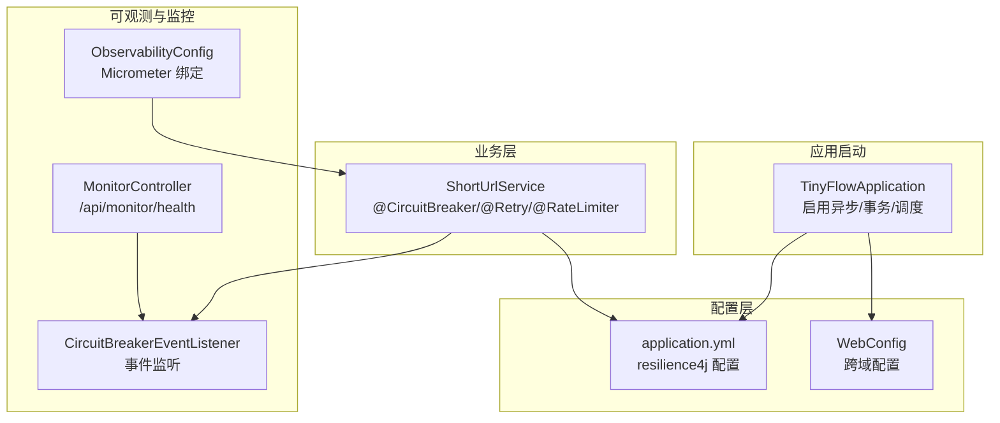
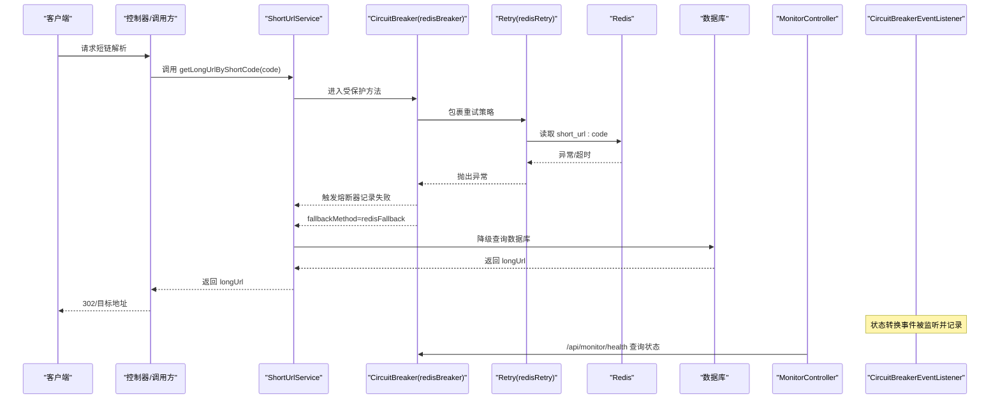
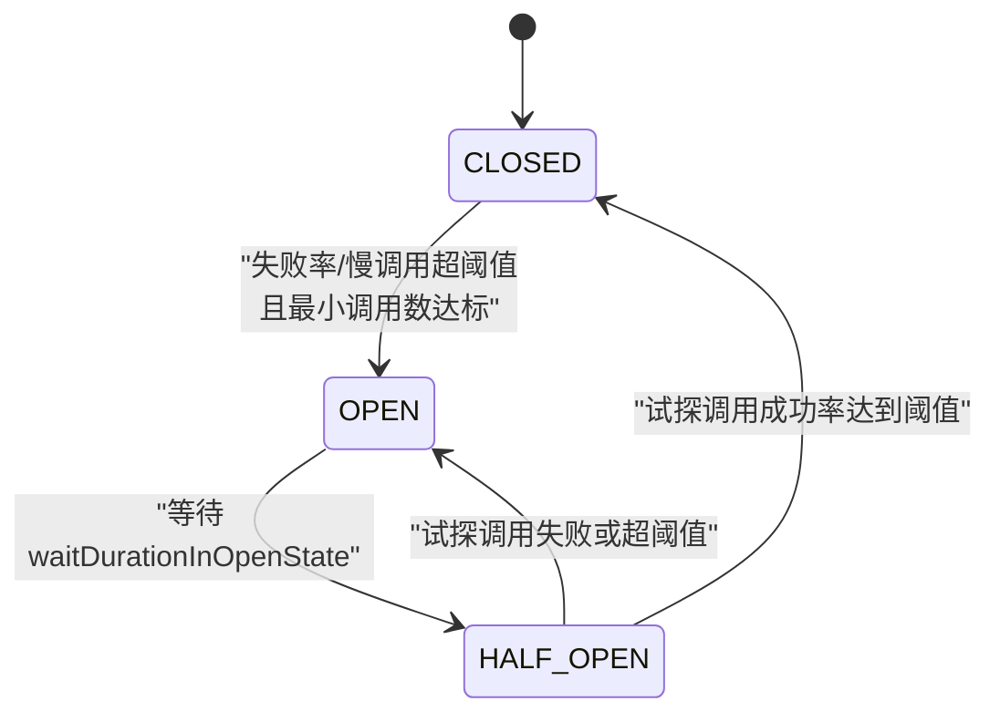
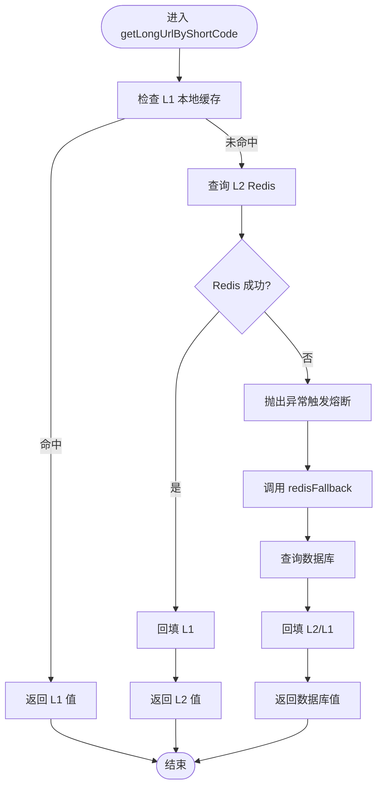
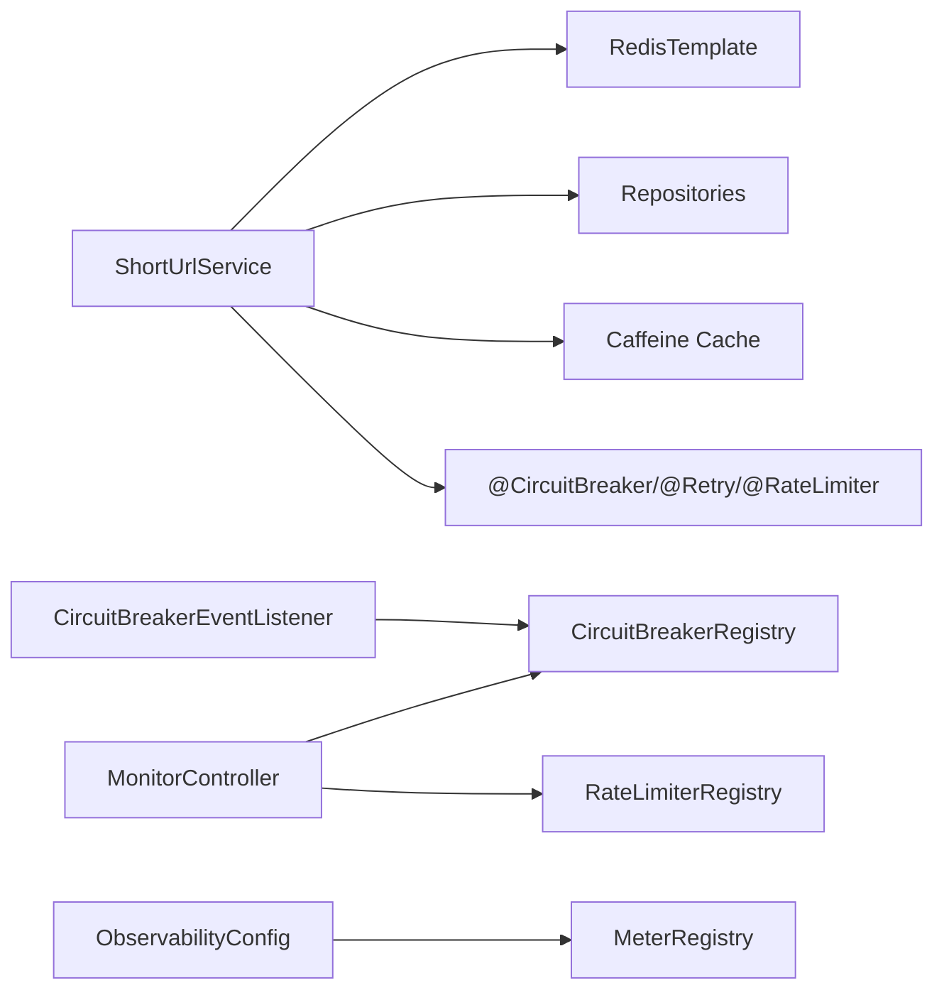

# 熔断器配置

<cite>
**本文引用的文件**
- [TinyFlowApplication.java](file://src/main/java/com/layor/tinyflow/TinyFlowApplication.java)
- [application.yml](file://src/main/resources/application.yml)
- [ShortUrlService.java](file://src/main/java/com/layor/tinyflow/service/ShortUrlService.java)
- [CircuitBreakerEventListener.java](file://src/main/java/com/layor/tinyflow/listener/CircuitBreakerEventListener.java)
- [MonitorController.java](file://src/main/java/com/layor/tinyflow/Controller/MonitorController.java)
- [pom.xml](file://pom.xml)
- [WebConfig.java](file://src/main/java/com/layor/tinyflow/config/WebConfig.java)
- [ObservabilityConfig.java](file://src/main/java/com/layor/tinyflow/config/ObservabilityConfig.java)
</cite>

## 目录
1. [简介](#简介)
2. [项目结构](#项目结构)
3. [核心组件](#核心组件)
4. [架构总览](#架构总览)
5. [详细组件分析](#详细组件分析)
6. [依赖关系分析](#依赖关系分析)
7. [性能考量](#性能考量)
8. [故障排查指南](#故障排查指南)
9. [结论](#结论)
10. [附录](#附录)

## 简介
本文件围绕 Resilience4j 在本项目中的熔断与重试配置展开，重点解析以下内容：
- 注解式配置：@CircuitBreaker 与 @Retry 的参数与行为
- 熔断器状态机（CircuitBreakerState）的配置与转换条件
- 关键阈值与窗口参数：failureRateThreshold、slowCallRateThreshold、slowCallDurationThreshold、waitDurationInOpenState、permittedNumberOfCallsInHalfOpenState 等
- 在 application.yml 中的完整配置示例及逐项说明
- 熔断与重试的协同工作流程
- 基于 AOP 的无侵入式熔断降级实现

## 项目结构
本项目采用 Spring Boot 结构，Resilience4j 通过 Spring Boot Starter 与 AOP 自动装配启用。关键位置如下：
- 配置文件：application.yml 中定义 resilience4j 的实例与参数
- 业务服务：ShortUrlService 使用注解式熔断与重试
- 监听与可观测：CircuitBreakerEventListener 订阅状态变化；MonitorController 暴露熔断器健康信息；ObservabilityConfig 注册 Micrometer 指标绑定
- 启动类：TinyFlowApplication 启用异步与事务管理

图表来源
- [TinyFlowApplication.java](file://src/main/java/com/layor/tinyflow/TinyFlowApplication.java#L1-L47)
- [application.yml](file://src/main/resources/application.yml#L148-L211)
- [ShortUrlService.java](file://src/main/java/com/layor/tinyflow/service/ShortUrlService.java#L288-L366)
- [CircuitBreakerEventListener.java](file://src/main/java/com/layor/tinyflow/listener/CircuitBreakerEventListener.java#L1-L57)
- [MonitorController.java](file://src/main/java/com/layor/tinyflow/Controller/MonitorController.java#L1-L69)
- [WebConfig.java](file://src/main/java/com/layor/tinyflow/config/WebConfig.java#L1-L22)
- [ObservabilityConfig.java](file://src/main/java/com/layor/tinyflow/config/ObservabilityConfig.java#L1-L60)

章节来源
- [TinyFlowApplication.java](file://src/main/java/com/layor/tinyflow/TinyFlowApplication.java#L1-L47)
- [application.yml](file://src/main/resources/application.yml#L148-L211)
- [ShortUrlService.java](file://src/main/java/com/layor/tinyflow/service/ShortUrlService.java#L288-L366)
- [CircuitBreakerEventListener.java](file://src/main/java/com/layor/tinyflow/listener/CircuitBreakerEventListener.java#L1-L57)
- [MonitorController.java](file://src/main/java/com/layor/tinyflow/Controller/MonitorController.java#L1-L69)
- [WebConfig.java](file://src/main/java/com/layor/tinyflow/config/WebConfig.java#L1-L22)
- [ObservabilityConfig.java](file://src/main/java/com/layor/tinyflow/config/ObservabilityConfig.java#L1-L60)

## 核心组件
- 注解式熔断与重试
  - @CircuitBreaker(name = "redisBreaker", fallbackMethod = "redisFallback")
  - @Retry(name = "redisRetry")
  - @RateLimiter(name = "redirectLimit")（用于访问重定向接口的限流）
- 熔断器实例配置
  - redisBreaker：Redis 熔断器，快速失败
  - dbBreaker：数据库熔断器，慢调用保护
- 重试实例配置
  - redisRetry：对 Redis 连接失败进行指数退避重试
- 事件监听与监控
  - CircuitBreakerEventListener：订阅状态转换与错误事件
  - MonitorController：输出熔断器状态与限流器指标
  - ObservabilityConfig：注册 Micrometer 指标绑定

章节来源
- [ShortUrlService.java](file://src/main/java/com/layor/tinyflow/service/ShortUrlService.java#L288-L366)
- [application.yml](file://src/main/resources/application.yml#L148-L211)
- [CircuitBreakerEventListener.java](file://src/main/java/com/layor/tinyflow/listener/CircuitBreakerEventListener.java#L1-L57)
- [MonitorController.java](file://src/main/java/com/layor/tinyflow/Controller/MonitorController.java#L1-L69)
- [ObservabilityConfig.java](file://src/main/java/com/layor/tinyflow/config/ObservabilityConfig.java#L1-L60)

## 架构总览
下图展示 Resilience4j 在本项目中的运行时交互：业务方法被注解保护，AOP 切面拦截执行，触发熔断与重试逻辑；事件监听器记录状态变化；监控端点暴露运行指标。

图表来源
- [ShortUrlService.java](file://src/main/java/com/layor/tinyflow/service/ShortUrlService.java#L288-L366)
- [CircuitBreakerEventListener.java](file://src/main/java/com/layor/tinyflow/listener/CircuitBreakerEventListener.java#L1-L57)
- [MonitorController.java](file://src/main/java/com/layor/tinyflow/Controller/MonitorController.java#L1-L69)

## 详细组件分析

### 注解式熔断与重试配置
- @CircuitBreaker(name = "redisBreaker", fallbackMethod = "redisFallback")
  - 指定熔断器实例名为 redisBreaker
  - 指定降级方法名为 redisFallback，当熔断器打开或失败率过高时调用
- @Retry(name = "redisRetry")
  - 指定重试实例名为 redisRetry
  - 对 Redis 连接失败进行指数退避重试
- @RateLimiter(name = "redirectLimit")
  - 用于 redirectCode 方法的限流，防止重定向接口被恶意刷量

章节来源
- [ShortUrlService.java](file://src/main/java/com/layor/tinyflow/service/ShortUrlService.java#L288-L366)

### 熔断器状态机与转换条件
- 状态枚举：CLOSED、OPEN、HALF_OPEN
- 转换条件（基于配置与调用结果）：
  - CLOSED → OPEN：失败率超过 threshold 或慢调用比例超过 threshold，且最小调用数满足 minimumNumberOfCalls
  - OPEN → HALF_OPEN：等待 waitDurationInOpenState 后，允许 permittedNumberOfCallsInHalfOpenState 次试探调用
  - HALF_OPEN → CLOSED：试探调用成功率达到阈值，熔断器恢复
  - HALF_OPEN → OPEN：试探调用失败，回到 OPEN 并延长等待时间（指数退避由 Retry 控制）

图表来源
- [application.yml](file://src/main/resources/application.yml#L148-L211)

章节来源
- [application.yml](file://src/main/resources/application.yml#L148-L211)

### 关键配置项详解（来自 application.yml）
- redisBreaker（Redis 熔断器）
  - registerHealthIndicator: true
  - slidingWindowType: COUNT_BASED
  - slidingWindowSize: 100
  - minimumNumberOfCalls: 10
  - permittedNumberOfCallsInHalfOpenState: 5
  - automaticTransitionFromOpenToHalfOpenEnabled: true
  - waitDurationInOpenState: 30s
  - failureRateThreshold: 50
  - slowCallRateThreshold: 80
  - slowCallDurationThreshold: 1000ms
  - recordExceptions: 记录 Redis 连接失败与 Socket 超时
  - ignoreExceptions: 忽略非法参数异常
  - eventConsumerBufferSize: 100
- dbBreaker（数据库熔断器）
  - slidingWindowType: TIME_BASED
  - slidingWindowSize: 60
  - minimumNumberOfCalls: 10
  - permittedNumberOfCallsInHalfOpenState: 3
  - automaticTransitionFromOpenToHalfOpenEnabled: true
  - waitDurationInOpenState: 60s
  - failureRateThreshold: 50
  - slowCallRateThreshold: 70
  - slowCallDurationThreshold: 2000ms
  - recordExceptions: 记录数据访问异常与 SQL 异常
- redisRetry（Redis 重试）
  - maxAttempts: 3
  - waitDuration: 100ms
  - enableExponentialBackoff: true
  - exponentialBackoffMultiplier: 2
  - retryExceptions: Redis 连接失败
- redisBulkhead（舱壁隔离）
  - maxConcurrentCalls: 100
  - maxWaitDuration: 50ms

章节来源
- [application.yml](file://src/main/resources/application.yml#L148-L211)

### 降级方法与回源策略
- redisFallback：当 Redis 查询失败时，直接回源数据库并回填缓存
- 缓存回源链路：
  - L1（本地 Caffeine）命中优先
  - L2（Redis）次之，失败时抛异常触发熔断
  - L3（数据库）兜底，成功后回填 L2/L1

图表来源
- [ShortUrlService.java](file://src/main/java/com/layor/tinyflow/service/ShortUrlService.java#L302-L366)

章节来源
- [ShortUrlService.java](file://src/main/java/com/layor/tinyflow/service/ShortUrlService.java#L302-L366)

### 事件监听与监控
- CircuitBreakerEventListener：订阅所有熔断器的状态转换事件与错误事件，记录日志并在 OPEN/CLOSED 时输出告警/恢复日志
- MonitorController：/api/monitor/health 输出熔断器状态与限流器指标，便于运维观察
- ObservabilityConfig：注册 Micrometer 指标绑定，便于 Prometheus 导出

章节来源
- [CircuitBreakerEventListener.java](file://src/main/java/com/layor/tinyflow/listener/CircuitBreakerEventListener.java#L1-L57)
- [MonitorController.java](file://src/main/java/com/layor/tinyflow/Controller/MonitorController.java#L1-L69)
- [ObservabilityConfig.java](file://src/main/java/com/layor/tinyflow/config/ObservabilityConfig.java#L1-L60)

### AOP 无侵入式实现
- 依赖注入
  - spring-boot-starter-aop：启用 AOP
  - resilience4j-spring-boot3：自动装配熔断与重试切面
- 行为
  - 业务方法上添加 @CircuitBreaker/@Retry/@RateLimiter 后，AOP 切面会在方法执行前后自动包裹熔断与重试逻辑，无需手动编写 try/catch 或状态判断
- 优势
  - 代码干净、关注点分离
  - 可配置性强，集中管理策略

章节来源
- [pom.xml](file://pom.xml#L96-L104)
- [ShortUrlService.java](file://src/main/java/com/layor/tinyflow/service/ShortUrlService.java#L288-L366)

## 依赖关系分析
- 组件耦合
  - ShortUrlService 依赖 RedisTemplate、Repository、Caffeine Cache，同时通过注解受 Resilience4j 保护
  - CircuitBreakerEventListener 依赖 CircuitBreakerRegistry，统一订阅事件
  - MonitorController 依赖 CircuitBreakerRegistry 与 RateLimiterRegistry，提供健康状态
  - ObservabilityConfig 依赖 MeterRegistry，注册缓存与线程池指标
- 外部依赖
  - Resilience4j Spring Boot Starter 提供注解式熔断与重试
  - Micrometer 提供指标导出能力

图表来源
- [ShortUrlService.java](file://src/main/java/com/layor/tinyflow/service/ShortUrlService.java#L288-L366)
- [CircuitBreakerEventListener.java](file://src/main/java/com/layor/tinyflow/listener/CircuitBreakerEventListener.java#L1-L57)
- [MonitorController.java](file://src/main/java/com/layor/tinyflow/Controller/MonitorController.java#L1-L69)
- [ObservabilityConfig.java](file://src/main/java/com/layor/tinyflow/config/ObservabilityConfig.java#L1-L60)

章节来源
- [ShortUrlService.java](file://src/main/java/com/layor/tinyflow/service/ShortUrlService.java#L288-L366)
- [CircuitBreakerEventListener.java](file://src/main/java/com/layor/tinyflow/listener/CircuitBreakerEventListener.java#L1-L57)
- [MonitorController.java](file://src/main/java/com/layor/tinyflow/Controller/MonitorController.java#L1-L69)
- [ObservabilityConfig.java](file://src/main/java/com/layor/tinyflow/config/ObservabilityConfig.java#L1-L60)

## 性能考量
- 熔断窗口与阈值
  - COUNT_BASED 与 TIME_BASED 窗口选择影响响应速度与稳定性
  - slidingWindowSize 与 minimumNumberOfCalls 决定统计的可靠性
- 重试策略
  - 指数退避可缓解瞬时抖动，但会增加延迟与下游压力
  - maxAttempts 与 waitDuration 需结合 SLA 与资源容量权衡
- 缓存回源
  - L1/L2/L3 三级缓存减少数据库压力，但需注意缓存一致性与回填失败的降级路径
- 监控与导出
  - 启用 circuitbreakers 指标与 Prometheus 导出，便于容量规划与告警联动

## 故障排查指南
- 熔断器频繁打开
  - 检查 failureRateThreshold 与 slowCallRateThreshold 是否过低
  - 查看 Redis 连接异常与 Socket 超时是否频繁
  - 关注 waitDurationInOpenState 是否过短导致反复试探
- 降级未生效
  - 确认 fallbackMethod 名称与签名一致
  - 检查 RedisTemplate 是否抛出 recordExceptions 中的异常
- 监控不可见
  - 确认 actuator 暴露 circuitbreakers 指标
  - 检查 Micrometer 是否正确绑定缓存与线程池指标
- 重试无效
  - 确认 @Retry 注解与 redisRetry 实例名称一致
  - 检查 retryExceptions 是否包含实际异常类型

章节来源
- [application.yml](file://src/main/resources/application.yml#L148-L211)
- [ShortUrlService.java](file://src/main/java/com/layor/tinyflow/service/ShortUrlService.java#L302-L366)
- [MonitorController.java](file://src/main/java/com/layor/tinyflow/Controller/MonitorController.java#L1-L69)
- [CircuitBreakerEventListener.java](file://src/main/java/com/layor/tinyflow/listener/CircuitBreakerEventListener.java#L1-L57)
- [ObservabilityConfig.java](file://src/main/java/com/layor/tinyflow/config/ObservabilityConfig.java#L1-L60)

## 结论
本项目通过注解式 Resilience4j 将熔断与重试以 AOP 形式无侵入地集成到业务方法中，配合事件监听与监控端点，实现了可观测、可配置、可扩展的弹性架构。针对 Redis 与数据库分别设置不同窗口与阈值，既保证快速失败又兼顾慢调用保护；重试策略与降级回源链路共同提升系统的韧性与用户体验。

## 附录

### application.yml 中的 Resilience4j 配置示例与说明
- resilience4j.circuitbreaker.instances.redisBreaker
  - registerHealthIndicator: true —— 启用健康指示器
  - slidingWindowType: COUNT_BASED —— 计数窗口
  - slidingWindowSize: 100 —— 窗口大小
  - minimumNumberOfCalls: 10 —— 最小调用数
  - permittedNumberOfCallsInHalfOpenState: 5 —— 半开试探调用数
  - automaticTransitionFromOpenToHalfOpenEnabled: true —— 自动半开转换
  - waitDurationInOpenState: 30s —— OPEN 等待时长
  - failureRateThreshold: 50 —— 失败率阈值
  - slowCallRateThreshold: 80 —— 慢调用比例阈值
  - slowCallDurationThreshold: 1000ms —— 慢调用阈值
  - recordExceptions: 记录 Redis 连接失败与 Socket 超时
  - ignoreExceptions: 忽略非法参数异常
  - eventConsumerBufferSize: 100 —— 事件缓冲区大小
- resilience4j.circuitbreaker.instances.dbBreaker
  - slidingWindowType: TIME_BASED —— 时间窗口
  - slidingWindowSize: 60 —— 窗口时长
  - 其余参数同上，适用于数据库慢调用保护
- resilience4j.retry.instances.redisRetry
  - maxAttempts: 3 —— 最大重试次数
  - waitDuration: 100ms —— 初始等待
  - enableExponentialBackoff: true —— 启用指数退避
  - exponentialBackoffMultiplier: 2 —— 退避倍数
  - retryExceptions: Redis 连接失败
- resilience4j.bulkhead.instances.redisBulkhead
  - maxConcurrentCalls: 100 —— 最大并发调用
  - maxWaitDuration: 50ms —— 最大等待时长

章节来源
- [application.yml](file://src/main/resources/application.yml#L148-L211)