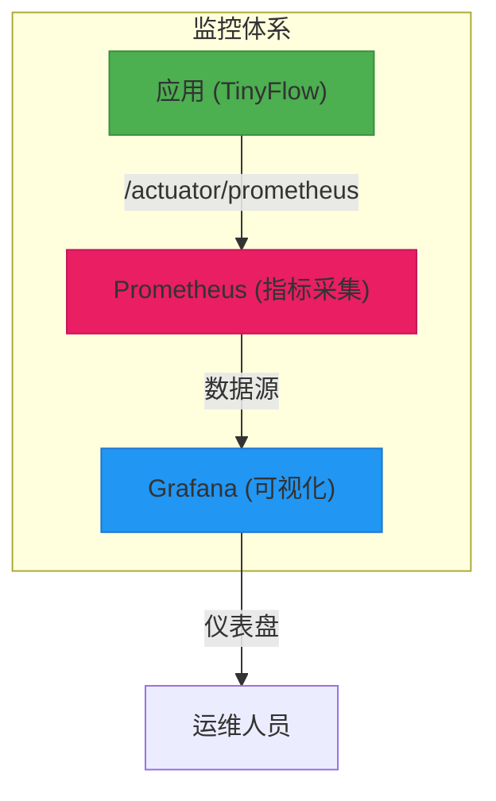
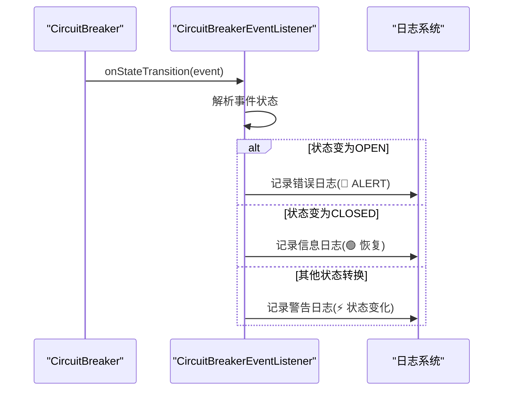
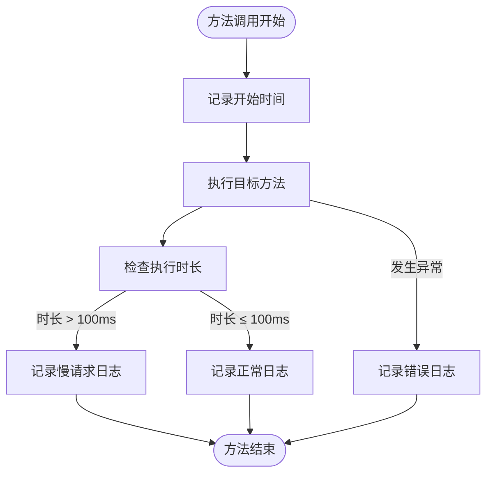

# 熔断监控

<cite>
**本文档引用的文件**  
- [CircuitBreakerEventListener.java](file://src/main/java/com/layor/tinyflow/listener/CircuitBreakerEventListener.java)
- [PerformanceMonitorAspect.java](file://src/main/java/com/layor/tinyflow/aspect/PerformanceMonitorAspect.java)
- [application.yml](file://src/main/resources/application.yml)
- [ShortUrlService.java](file://src/main/java/com/layor/tinyflow/service/ShortUrlService.java)
- [MonitorController.java](file://src/main/java/com/layor/tinyflow/Controller/MonitorController.java)
- [ObservabilityConfig.java](file://src/main/java/com/layor/tinyflow/config/ObservabilityConfig.java)
- [CacheConfig.java](file://src/main/java/com/layor/tinyflow/config/CacheConfig.java)
- [prometheus.yml](file://web/infra/observability/prometheus.yml)
- [shortener-overview.json](file://web/infra/observability/dashboards/shortener-overview.json)
- [OBSERVABILITY.md](file://OBSERVABILITY.md)
- [logback-spring.xml](file://src/main/resources/logback-spring.xml)
</cite>

## 目录
1. [引言](#引言)
2. [熔断器指标监控](#熔断器指标监控)
3. [Prometheus与Grafana集成](#prometheus与grafana集成)
4. [告警配置建议](#告警配置建议)
5. [监控组件分析](#监控组件分析)
6. [日志排查与问题定位](#日志排查与问题定位)
7. [总结](#总结)

## 引言
本文档详细说明了如何通过Resilience4j的指标端点来监控`redisBreaker`的状态，并将这些指标集成到Prometheus和Grafana中，创建可视化仪表盘。同时提供告警配置建议，并分析`PerformanceMonitorAspect`和`CircuitBreakerEventListener`在监控中的作用。

## 熔断器指标监控
通过Spring Boot Actuator提供的`/actuator/circuitbreakers`端点可以获取熔断器的详细状态信息。系统中配置了两个主要熔断器：`redisBreaker`和`dbBreaker`。

`redisBreaker`的关键配置如下：
- **滑动窗口类型**：基于请求数（COUNT_BASED）
- **滑动窗口大小**：100次请求
- **最小调用次数**：10次
- **失败率阈值**：50%
- **慢调用率阈值**：80%（超过1秒视为慢调用）
- **打开状态等待时间**：30秒

可以通过访问`/actuator/circuitbreakers`端点查看所有熔断器的状态，包括当前状态、失败率、慢调用率等关键指标。

**Section sources**
- [application.yml](file://src/main/resources/application.yml#L158-L175)
- [OBSERVABILITY.md](file://OBSERVABILITY.md#L7-L11)

## Prometheus与Grafana集成
系统已配置Micrometer与Prometheus集成，所有指标可通过`/actuator/prometheus`端点暴露。

Prometheus配置文件`prometheus.yml`中定义了抓取任务：
```yaml
scrape_configs:
  - job_name: 'tinyflow-backend'
    metrics_path: '/actuator/prometheus'
    static_configs:
      - targets: ['host.docker.internal:8080']
```

Grafana仪表盘`shortener-overview.json`包含了多个关键面板：
- **请求吞吐量**：实时QPS
- **响应延迟**：P50/P95/P99
- **错误率**：5xx状态码比例
- **重定向延迟**：P95



**Diagram sources**
- [prometheus.yml](file://web/infra/observability/prometheus.yml#L5-L9)
- [shortener-overview.json](file://web/infra/observability/dashboards/shortener-overview.json#L1-L55)

**Section sources**
- [prometheus.yml](file://web/infra/observability/prometheus.yml#L1-L9)
- [shortener-overview.json](file://web/infra/observability/dashboards/shortener-overview.json#L1-L55)
- [ObservabilityConfig.java](file://src/main/java/com/layor/tinyflow/config/ObservabilityConfig.java#L18-L24)

## 告警配置建议
当熔断器进入OPEN状态时，应立即触发告警。以下是推荐的告警规则：

1. **熔断器打开告警**：
   ```
   resilience4j_circuitbreaker_state{state="open"} == 1
   ```

2. **高错误率告警**：
   ```
   rate(http_server_requests_seconds_count{status=~"5.."}[1m]) > 0.01
   ```

3. **高延迟告警**：
   ```
   http_server_requests_seconds{quantile="0.95"} > 0.1
   ```

4. **低缓存命中率告警**：
   ```
   caffeine_cache_hit_total / (caffeine_cache_hit_total + caffeine_cache_miss_total) < 0.9
   ```

这些告警规则可以在Prometheus Alertmanager或Grafana中配置，通过邮件、钉钉、企业微信等方式通知相关人员。

**Section sources**
- [OBSERVABILITY.md](file://OBSERVABILITY.md#L214-L218)

## 监控组件分析

### CircuitBreakerEventListener分析
`CircuitBreakerEventListener`类负责监听熔断器的状态变化事件，并记录相应的日志。

主要功能包括：
- 监听熔断器状态转换事件
- 当熔断器进入OPEN状态时记录错误日志并触发告警
- 当熔断器恢复到CLOSED状态时记录恢复日志



**Diagram sources**
- [CircuitBreakerEventListener.java](file://src/main/java/com/layor/tinyflow/listener/CircuitBreakerEventListener.java#L37-L57)

**Section sources**
- [CircuitBreakerEventListener.java](file://src/main/java/com/layor/tinyflow/listener/CircuitBreakerEventListener.java#L1-L57)

### PerformanceMonitorAspect分析
`PerformanceMonitorAspect`是一个AOP切面，用于监控Controller和Service层的方法执行性能。

关键特性：
- 监控所有Controller和Service层方法
- 定义100ms为慢请求阈值
- 慢请求日志输出到独立的performance.log文件
- 记录方法执行时间、异常等信息



**Diagram sources**
- [PerformanceMonitorAspect.java](file://src/main/java/com/layor/tinyflow/aspect/PerformanceMonitorAspect.java#L40-L63)

**Section sources**
- [PerformanceMonitorAspect.java](file://src/main/java/com/layor/tinyflow/aspect/PerformanceMonitorAspect.java#L1-L64)

## 日志排查与问题定位
系统提供了多层次的日志机制用于问题排查：

### 熔断相关日志
- **状态变化日志**：使用`⚡`标识熔断器状态变化
- **打开状态告警**：使用`🔴 ALERT`标识熔断器打开
- **恢复状态日志**：使用`🟢`标识系统恢复

可通过以下命令查看熔断器相关日志：
```bash
grep "CircuitBreaker" logs/tinyflow.log
```

### 降级日志
当熔断器触发降级时，会记录带有`[FALLBACK]`前缀的日志：
```java
log.error("[FALLBACK] Redis circuit breaker triggered for shortCode={}, reason={}", 
    shortCode, t.getMessage());
```

这些日志可以帮助快速定位是哪个短码的Redis查询失败，以及失败的具体原因。

### 性能日志
慢请求会被记录到独立的`performance.log`文件中，格式如下：
```
[LAYER] SLOW - METHOD_NAME took DURATIONms
```

可通过以下命令监控慢请求：
```bash
tail -f logs/performance.log
```

**Section sources**
- [CircuitBreakerEventListener.java](file://src/main/java/com/layor/tinyflow/listener/CircuitBreakerEventListener.java#L41-L54)
- [PerformanceMonitorAspect.java](file://src/main/java/com/layor/tinyflow/aspect/PerformanceMonitorAspect.java#L50-L52)
- [ShortUrlService.java](file://src/main/java/com/layor/tinyflow/service/ShortUrlService.java#L355-L365)
- [logback-spring.xml](file://src/main/resources/logback-spring.xml#L47-L58)

## 总结
本系统通过Resilience4j、Micrometer、Prometheus和Grafana构建了完整的熔断监控体系。`redisBreaker`的状态可以通过`/actuator/circuitbreakers`端点实时监控，关键指标已集成到Grafana仪表盘中。当熔断器进入OPEN状态时，`CircuitBreakerEventListener`会记录告警日志，同时`PerformanceMonitorAspect`提供了细粒度的性能监控能力。通过[FALLBACK]前缀的日志可以快速定位降级问题，为系统的稳定运行提供了有力保障。

**Section sources**
- [OBSERVABILITY.md](file://OBSERVABILITY.md#L222-L240)