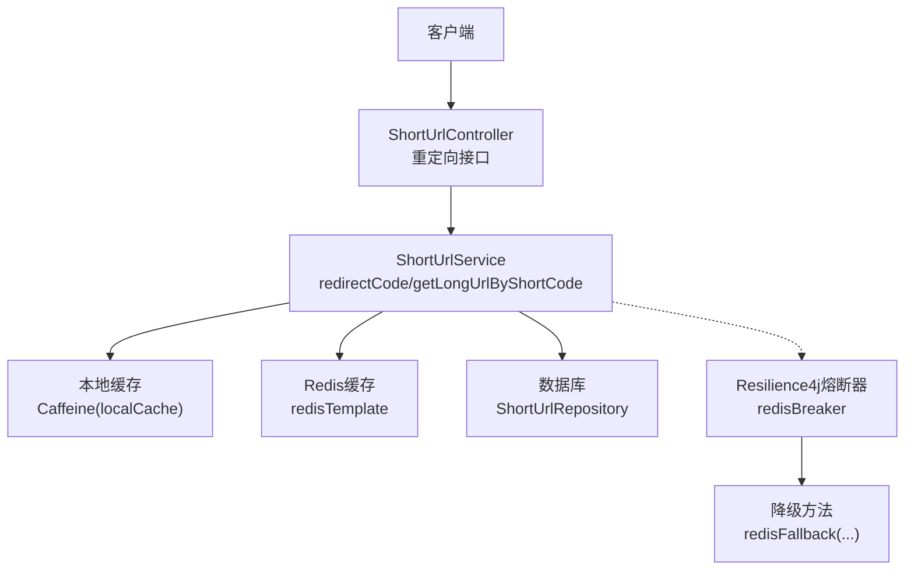
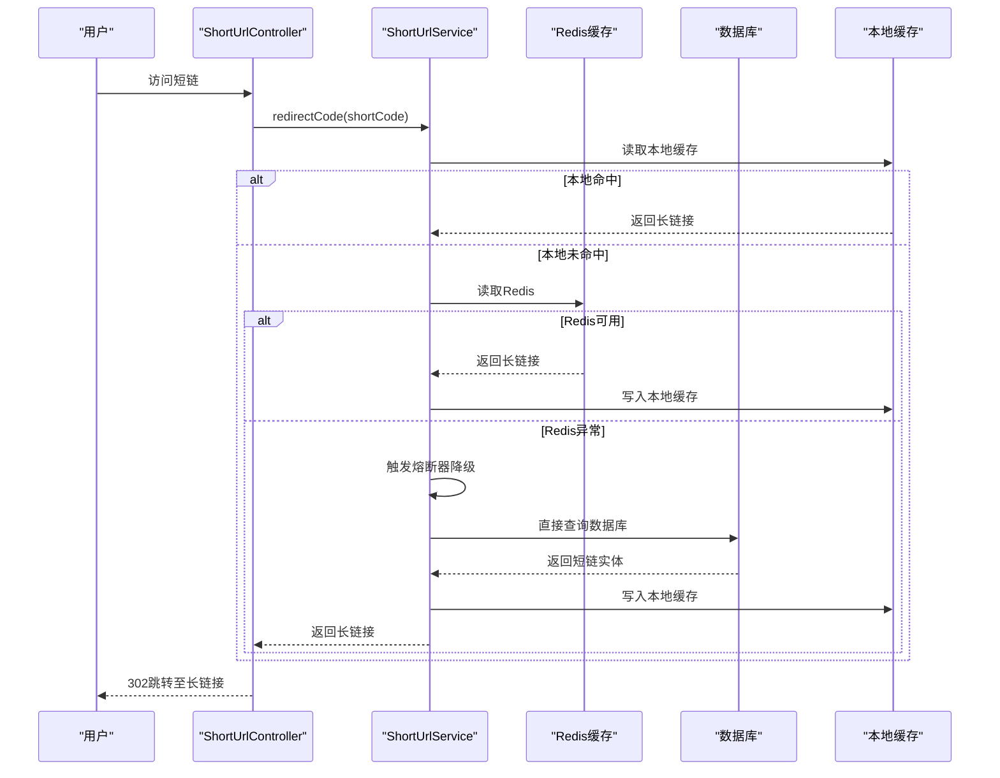
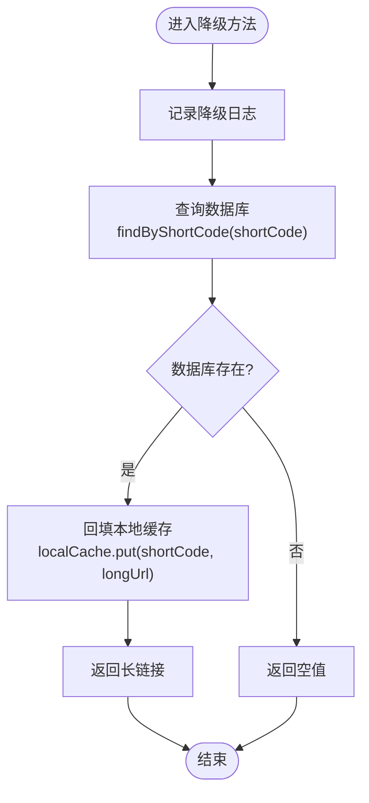
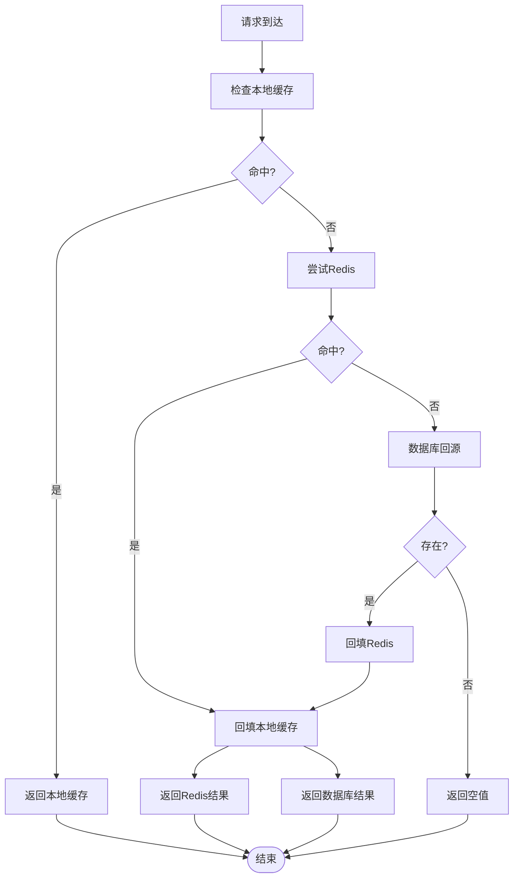
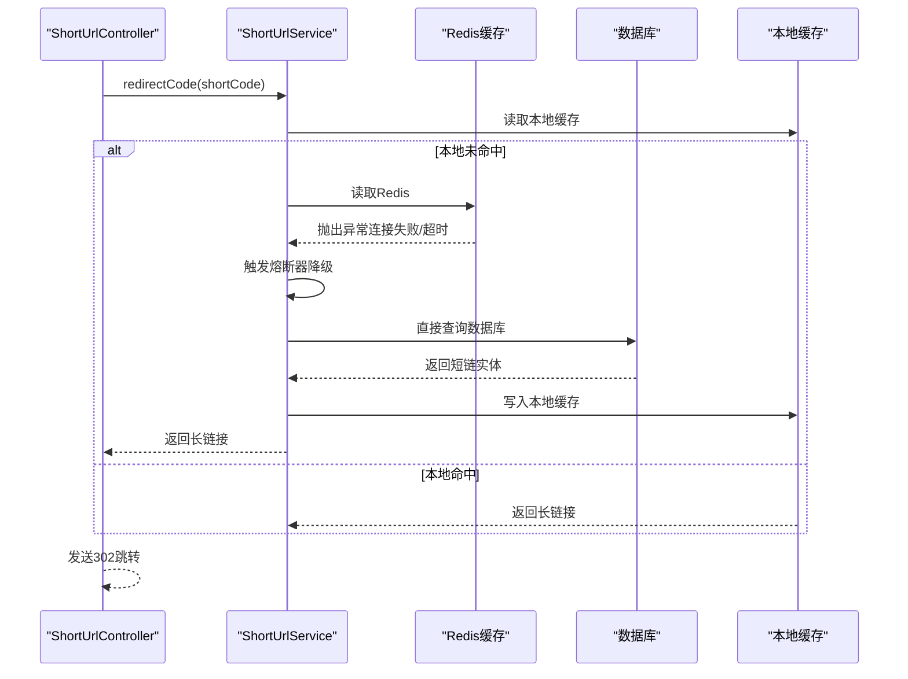
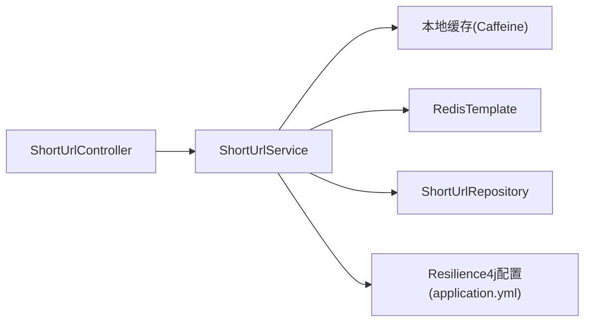

# 降级处理逻辑

<cite>
**本文引用的文件**
- [ShortUrlService.java](file://src/main/java/com/layor/tinyflow/service/ShortUrlService.java)
- [ShortUrlController.java](file://src/main/java/com/layor/tinyflow/Controller/ShortUrlController.java)
- [application.yml](file://src/main/resources/application.yml)
- [CacheConfig.java](file://src/main/java/com/layor/tinyflow/config/CacheConfig.java)
- [ShortUrlRepository.java](file://src/main/java/com/layor/tinyflow/repository/ShortUrlRepository.java)
</cite>

## 目录
1. [引言](#引言)
2. [项目结构](#项目结构)
3. [核心组件](#核心组件)
4. [架构总览](#架构总览)
5. [详细组件分析](#详细组件分析)
6. [依赖关系分析](#依赖关系分析)
7. [性能考量](#性能考量)
8. [故障排查指南](#故障排查指南)
9. [结论](#结论)

## 引言
本文件聚焦于Redis服务异常时的降级处理逻辑，围绕 public String redisFallback(String shortCode, Throwable t) 方法展开，系统性说明：
- 降级入口与触发条件（Resilience4j熔断器）
- 降级流程：直接查询数据库（shortUrlRepository.findByShortCode）
- 降级成功后的本地缓存回填（localCache.put）
- 对系统高可用性的保障与用户体验影响
- 降级调用时序图与失败处理建议

## 项目结构
- 业务入口通过控制器接收短链访问请求，调用服务层进行重定向处理
- 服务层采用多级缓存（本地Caffeine + Redis）+ 数据库回源的策略
- 当Redis不可用时，Resilience4j熔断器触发降级方法，直接走数据库回源，并回填本地缓存

图表来源
- [ShortUrlController.java](file://src/main/java/com/layor/tinyflow/Controller/ShortUrlController.java#L30-L40)
- [ShortUrlService.java](file://src/main/java/com/layor/tinyflow/service/ShortUrlService.java#L288-L300)
- [application.yml](file://src/main/resources/application.yml#L156-L176)

章节来源
- [ShortUrlController.java](file://src/main/java/com/layor/tinyflow/Controller/ShortUrlController.java#L30-L40)
- [ShortUrlService.java](file://src/main/java/com/layor/tinyflow/service/ShortUrlService.java#L288-L300)
- [application.yml](file://src/main/resources/application.yml#L156-L176)

## 核心组件
- 控制器层：负责接收HTTP请求并调用服务层进行重定向
- 服务层：实现多级缓存查询、数据库回源、降级回填等逻辑
- 配置层：定义本地缓存Bean、Redis连接参数、Resilience4j熔断与重试配置
- 数据访问层：提供短链查询能力

章节来源
- [ShortUrlController.java](file://src/main/java/com/layor/tinyflow/Controller/ShortUrlController.java#L30-L40)
- [ShortUrlService.java](file://src/main/java/com/layor/tinyflow/service/ShortUrlService.java#L40-L66)
- [CacheConfig.java](file://src/main/java/com/layor/tinyflow/config/CacheConfig.java#L1-L19)
- [application.yml](file://src/main/resources/application.yml#L1-L33)

## 架构总览
下图展示从客户端到服务层、缓存与数据库的整体交互，突出Redis异常时的降级路径。

图表来源
- [ShortUrlController.java](file://src/main/java/com/layor/tinyflow/Controller/ShortUrlController.java#L30-L40)
- [ShortUrlService.java](file://src/main/java/com/layor/tinyflow/service/ShortUrlService.java#L288-L353)
- [application.yml](file://src/main/resources/application.yml#L156-L176)

## 详细组件分析

### 降级方法 redisFallback 的实现与行为
- 触发条件：被 @CircuitBreaker 注解标注的方法在Redis操作抛出指定异常时，会触发降级方法
- 入口签名：public String redisFallback(String shortCode, Throwable t)
- 关键步骤：
  - 记录降级日志，包含短码与异常原因
  - 直接查询数据库（shortUrlRepository.findByShortCode）
  - 若存在对应短链，回填本地缓存（localCache.put），然后返回长链接
  - 若不存在，返回空值

图表来源
- [ShortUrlService.java](file://src/main/java/com/layor/tinyflow/service/ShortUrlService.java#L355-L366)

章节来源
- [ShortUrlService.java](file://src/main/java/com/layor/tinyflow/service/ShortUrlService.java#L355-L366)

### 多级缓存与数据库回源的完整流程
- 本地缓存（Caffeine）优先命中，避免任何远程调用
- Redis作为二级缓存，若命中则回填本地缓存
- Redis不可用时，直接走数据库回源，并回填Redis与本地缓存
- 该流程确保在Redis故障期间仍可正常提供服务

图表来源
- [ShortUrlService.java](file://src/main/java/com/layor/tinyflow/service/ShortUrlService.java#L302-L353)

章节来源
- [ShortUrlService.java](file://src/main/java/com/layor/tinyflow/service/ShortUrlService.java#L302-L353)

### 降级调用时序图（Redis异常场景）

图表来源
- [ShortUrlController.java](file://src/main/java/com/layor/tinyflow/Controller/ShortUrlController.java#L30-L40)
- [ShortUrlService.java](file://src/main/java/com/layor/tinyflow/service/ShortUrlService.java#L302-L353)
- [application.yml](file://src/main/resources/application.yml#L156-L176)

章节来源
- [ShortUrlController.java](file://src/main/java/com/layor/tinyflow/Controller/ShortUrlController.java#L30-L40)
- [ShortUrlService.java](file://src/main/java/com/layor/tinyflow/service/ShortUrlService.java#L302-L353)
- [application.yml](file://src/main/resources/application.yml#L156-L176)

### 降级失败的处理方案
- 降级方法返回空值：上层控制器检测到空值后返回未找到状态
- 可选增强：
  - 在降级方法中增加“数据库异常”日志与告警
  - 对数据库查询失败进行重试或熔断（当前方法未内置重试，但可按需扩展）
  - 将降级路径纳入可观测性指标，便于监控Redis故障与数据库压力

章节来源
- [ShortUrlService.java](file://src/main/java/com/layor/tinyflow/service/ShortUrlService.java#L355-L366)
- [ShortUrlController.java](file://src/main/java/com/layor/tinyflow/Controller/ShortUrlController.java#L288-L300)

## 依赖关系分析
- 组件耦合
  - ShortUrlService 依赖本地缓存（Caffeine）、RedisTemplate、ShortUrlRepository
  - 控制器仅依赖服务层，职责清晰
- 外部依赖
  - Resilience4j：熔断器与重试
  - Spring Data Redis：Redis访问
  - Spring Data JPA：数据库访问

图表来源
- [ShortUrlController.java](file://src/main/java/com/layor/tinyflow/Controller/ShortUrlController.java#L30-L40)
- [ShortUrlService.java](file://src/main/java/com/layor/tinyflow/service/ShortUrlService.java#L40-L66)
- [application.yml](file://src/main/resources/application.yml#L156-L204)

章节来源
- [ShortUrlService.java](file://src/main/java/com/layor/tinyflow/service/ShortUrlService.java#L40-L66)
- [application.yml](file://src/main/resources/application.yml#L156-L204)

## 性能考量
- 本地缓存命中：零网络开销，延迟最低
- Redis命中：一次网络往返，延迟较低
- 降级回源：一次数据库查询，延迟较高，但仅在Redis异常时发生
- 降级成功后回填本地缓存，后续请求可直接命中本地缓存，显著降低延迟
- 降级期间的数据库压力可通过合理的数据库连接池与索引设计缓解

## 故障排查指南
- 熔断器配置
  - Redis熔断器参数（滑动窗口、最小调用数、打开等待时长、失败率阈值等）在配置文件中定义
  - 通过监控端点查看熔断器状态与事件
- 降级日志
  - 降级方法会记录短码与异常原因，便于定位问题
- 缓存状态
  - 本地缓存可通过管理端点查看命中率与大小
- 数据库回源
  - 观察数据库慢查询与连接池使用情况，必要时优化索引或增加缓存预热

章节来源
- [application.yml](file://src/main/resources/application.yml#L156-L204)
- [ShortUrlService.java](file://src/main/java/com/layor/tinyflow/service/ShortUrlService.java#L355-L366)

## 结论
- redisFallback 在Redis异常时提供可靠的服务降级，直接查询数据库并回填本地缓存，确保后续请求的低延迟与高可用
- 该策略通过Resilience4j熔断器与重试机制，平衡了稳定性与性能
- 降级期间用户体验主要受数据库延迟影响，但通过本地缓存回填可快速恢复性能
- 建议持续监控熔断器状态与数据库负载，结合缓存预热与容量规划，进一步提升系统韧性