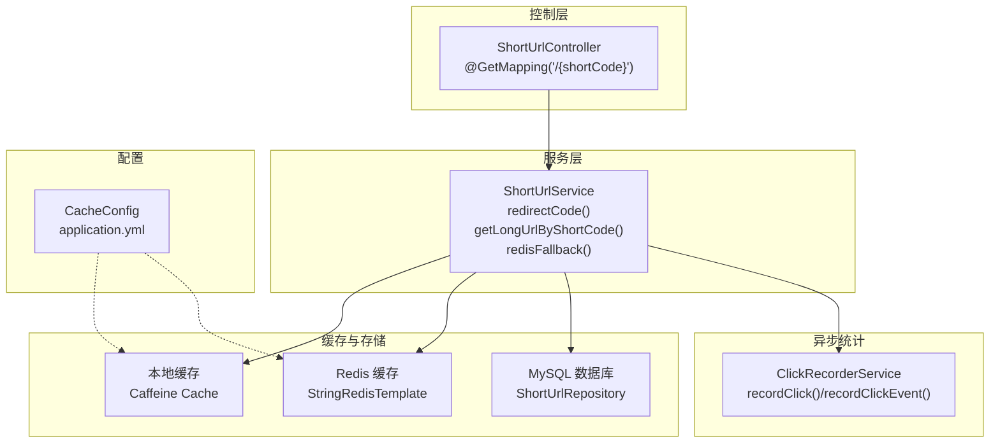
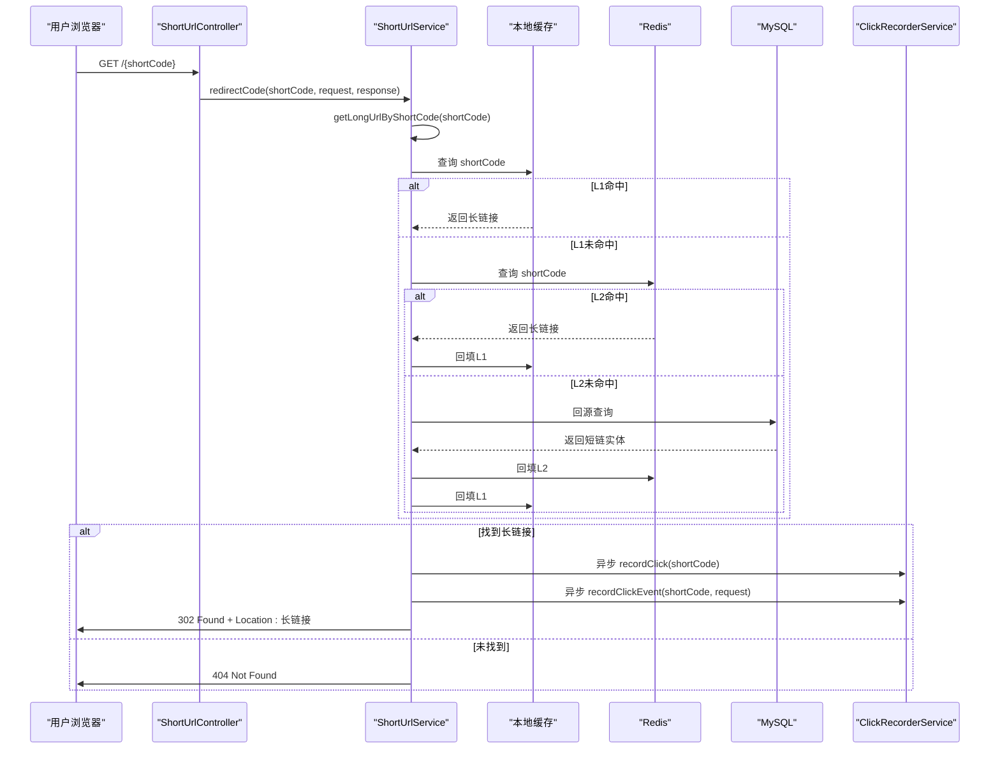
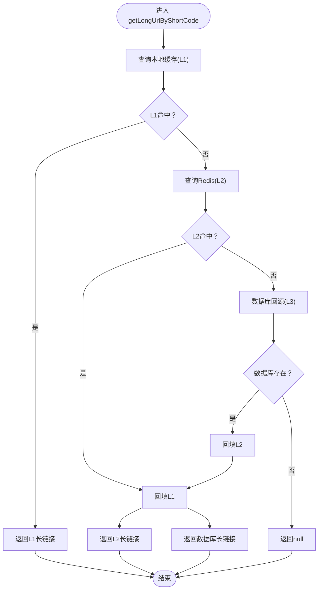
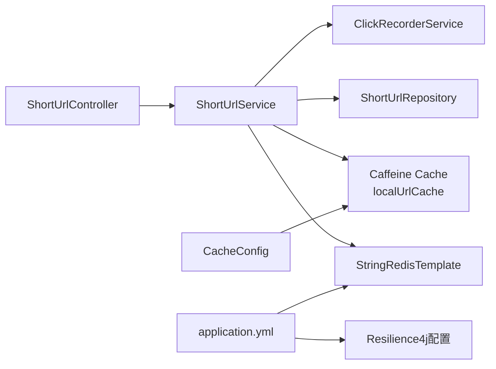

# 短链跳转

<cite>
**本文引用的文件**
- [ShortUrlController.java](file://src/main/java/com/layor/tinyflow/Controller/ShortUrlController.java)
- [ShortUrlService.java](file://src/main/java/com/layor/tinyflow/service/ShortUrlService.java)
- [ShortUrlRepository.java](file://src/main/java/com/layor/tinyflow/repository/ShortUrlRepository.java)
- [ClickRecorderService.java](file://src/main/java/com/layor/tinyflow/service/ClickRecorderService.java)
- [CacheConfig.java](file://src/main/java/com/layor/tinyflow/config/CacheConfig.java)
- [application.yml](file://src/main/resources/application.yml)
- [ShortUrlControllerTest.java](file://src/test/java/com/layor/tinyflow/Controller/ShortUrlControllerTest.java)
- [ShortUrlServiceTest.java](file://src/test/java/com/layor/tinyflow/service/ShortUrlServiceTest.java)
</cite>

## 目录
1. [简介](#简介)
2. [项目结构](#项目结构)
3. [核心组件](#核心组件)
4. [架构总览](#架构总览)
5. [详细组件分析](#详细组件分析)
6. [依赖分析](#依赖分析)
7. [性能考量](#性能考量)
8. [故障排查指南](#故障排查指南)
9. [结论](#结论)

## 简介
本文件围绕“短链接跳转”的完整流程进行深入剖析，从控制器路由入口到最终重定向与访问日志异步记录，覆盖三级缓存策略（本地Caffeine、Redis、MySQL）、Resilience4j熔断与重试、Redis故障降级处理，以及重定向响应构造与异步统计埋点。文档同时提供时序图与流程图，帮助读者快速理解端到端调用关系与异常处理路径。

## 项目结构
- 控制层：ShortUrlController 提供对外HTTP接口，负责接收短链访问请求并委派给服务层。
- 服务层：ShortUrlService 实现跳转核心逻辑，包括三级缓存查找、重定向响应构造、访问日志异步记录、以及Redis熔断与重试。
- 数据访问层：ShortUrlRepository 提供短链查询与计数更新等基础操作。
- 缓存配置：CacheConfig 定义本地Caffeine缓存实例。
- 应用配置：application.yml 提供Redis连接、Resilience4j熔断/重试/舱壁隔离等运行参数。
- 测试：控制器与服务层均有单元测试覆盖关键分支与缓存命中场景。

图表来源
- [ShortUrlController.java](file://src/main/java/com/layor/tinyflow/Controller/ShortUrlController.java#L30-L33)
- [ShortUrlService.java](file://src/main/java/com/layor/tinyflow/service/ShortUrlService.java#L288-L300)
- [ShortUrlService.java](file://src/main/java/com/layor/tinyflow/service/ShortUrlService.java#L302-L366)
- [ShortUrlRepository.java](file://src/main/java/com/layor/tinyflow/repository/ShortUrlRepository.java#L15-L20)
- [CacheConfig.java](file://src/main/java/com/layor/tinyflow/config/CacheConfig.java#L12-L18)
- [application.yml](file://src/main/resources/application.yml#L148-L211)

章节来源
- [ShortUrlController.java](file://src/main/java/com/layor/tinyflow/Controller/ShortUrlController.java#L30-L33)
- [ShortUrlService.java](file://src/main/java/com/layor/tinyflow/service/ShortUrlService.java#L288-L300)
- [CacheConfig.java](file://src/main/java/com/layor/tinyflow/config/CacheConfig.java#L12-L18)
- [application.yml](file://src/main/resources/application.yml#L148-L211)

## 核心组件
- 控制器：接收根路径短链访问请求，调用服务层执行跳转。
- 服务层：
  - redirectCode：根据短码获取长链接，构造302重定向响应，设置Location与缓存控制头，并异步记录点击与事件。
  - getLongUrlByShortCode：实现三级缓存查找策略，包含Redis熔断与重试、数据库回源与回填。
  - redisFallback：Redis熔断触发后的降级逻辑，直接走数据库回源。
  - recordClick/recordClickEvent：异步统计埋点，分别记录总点击与详细事件。
- 缓存配置：本地Caffeine缓存实例名称与规格。
- 应用配置：Redis连接参数、Resilience4j熔断/重试/舱壁隔离参数。

章节来源
- [ShortUrlController.java](file://src/main/java/com/layor/tinyflow/Controller/ShortUrlController.java#L30-L33)
- [ShortUrlService.java](file://src/main/java/com/layor/tinyflow/service/ShortUrlService.java#L288-L300)
- [ShortUrlService.java](file://src/main/java/com/layor/tinyflow/service/ShortUrlService.java#L302-L366)
- [CacheConfig.java](file://src/main/java/com/layor/tinyflow/config/CacheConfig.java#L12-L18)
- [application.yml](file://src/main/resources/application.yml#L148-L211)

## 架构总览
短链跳转的整体调用链如下：
- 客户端请求进入控制器，控制器委派服务层执行跳转。
- 服务层按L1→L2→L3顺序查找目标长链接，期间对Redis访问启用熔断与重试。
- 找到目标URL后，服务层通过HttpServletResponse设置302与Location头完成重定向。
- 同时异步调用ClickRecorderService记录点击与事件，确保主流程低延迟。

图表来源
- [ShortUrlController.java](file://src/main/java/com/layor/tinyflow/Controller/ShortUrlController.java#L30-L33)
- [ShortUrlService.java](file://src/main/java/com/layor/tinyflow/service/ShortUrlService.java#L288-L300)
- [ShortUrlService.java](file://src/main/java/com/layor/tinyflow/service/ShortUrlService.java#L302-L366)
- [ShortUrlRepository.java](file://src/main/java/com/layor/tinyflow/repository/ShortUrlRepository.java#L15-L20)
- [ClickRecorderService.java](file://src/main/java/com/layor/tinyflow/service/ClickRecorderService.java#L67-L123)

## 详细组件分析

### 控制器：ShortUrlController
- 路由：根路径GET("/{shortCode}")，调用服务层redirectCode完成跳转。
- 内部路由："/api/redirect/{shortCode}"用于内部压测与监控，行为同上。

章节来源
- [ShortUrlController.java](file://src/main/java/com/layor/tinyflow/Controller/ShortUrlController.java#L30-L33)
- [ShortUrlController.java](file://src/main/java/com/layor/tinyflow/Controller/ShortUrlController.java#L76-L79)

### 服务层：ShortUrlService
- redirectCode：
  - 调用getLongUrlByShortCode获取长链接。
  - 若为空返回404；否则异步记录点击与事件，设置302 Found与Location头，同时设置缓存控制头。
- getLongUrlByShortCode（三级缓存）：
  - L1（本地Caffeine）：命中直接返回。
  - L2（Redis）：未命中尝试查询，若成功回填L1；若异常抛出以触发熔断。
  - L3（数据库）：Redis未命中时回源查询，成功后回填Redis与L1。
- redisFallback：
  - Redis熔断触发后，直接查询数据库并回填L1，返回长链接；未命中返回null。
- 异步统计：
  - recordClick：本地内存+Redis快照+定时落库的点击计数方案。
  - recordClickEvent：采样记录详细事件，批量缓冲写库，支持地理信息解析。

图表来源
- [ShortUrlService.java](file://src/main/java/com/layor/tinyflow/service/ShortUrlService.java#L302-L366)
- [ShortUrlRepository.java](file://src/main/java/com/layor/tinyflow/repository/ShortUrlRepository.java#L15-L20)

章节来源
- [ShortUrlService.java](file://src/main/java/com/layor/tinyflow/service/ShortUrlService.java#L288-L300)
- [ShortUrlService.java](file://src/main/java/com/layor/tinyflow/service/ShortUrlService.java#L302-L366)
- [ClickRecorderService.java](file://src/main/java/com/layor/tinyflow/service/ClickRecorderService.java#L67-L123)

### 缓存与配置
- 本地缓存：通过CacheConfig定义名为localUrlCache的Caffeine缓存实例，规格来自application.yml。
- Redis：通过StringRedisTemplate访问键"short_url:{shortCode}"，回填时设置24小时过期。
- Resilience4j：
  - 熔断器redisBreaker：基于计数窗口，失败率阈值与慢调用阈值配置，记录Redis连接失败与Socket超时异常。
  - 重试redisRetry：最大重试次数、指数退避、仅对Redis连接失败异常生效。
  - 速率限制redirectLimit：每秒最大请求数，用于保护跳转接口。
  - 舱壁隔离redisBulkhead：并发调用上限与等待时长限制。

章节来源
- [CacheConfig.java](file://src/main/java/com/layor/tinyflow/config/CacheConfig.java#L12-L18)
- [application.yml](file://src/main/resources/application.yml#L148-L211)

### 异步统计与事件记录
- ClickRecorderService：
  - recordClick：本地内存计数，随后由定时任务快照至Redis并最终落库，确保高吞吐下的可靠性。
  - recordClickEvent：按采样率收集详细事件，批量写库，支持IP地理位置解析。
- 服务层在重定向前异步调用上述两个方法，避免阻塞主流程。

章节来源
- [ClickRecorderService.java](file://src/main/java/com/layor/tinyflow/service/ClickRecorderService.java#L67-L123)
- [ShortUrlService.java](file://src/main/java/com/layor/tinyflow/service/ShortUrlService.java#L288-L300)

## 依赖分析
- 控制器依赖服务层：ShortUrlController通过@Autowired注入ShortUrlService。
- 服务层依赖：
  - 本地缓存：通过@Qualifier("localUrlCache")注入Caffeine Cache。
  - Redis：通过StringRedisTemplate访问键空间。
  - 数据库：通过ShortUrlRepository查询短链与计数。
  - 异步统计：通过ClickRecorderService异步记录点击与事件。
- 配置依赖：CacheConfig提供本地缓存Bean；application.yml提供Redis与Resilience4j参数。

图表来源
- [ShortUrlController.java](file://src/main/java/com/layor/tinyflow/Controller/ShortUrlController.java#L18-L20)
- [ShortUrlService.java](file://src/main/java/com/layor/tinyflow/service/ShortUrlService.java#L40-L66)
- [CacheConfig.java](file://src/main/java/com/layor/tinyflow/config/CacheConfig.java#L12-L18)
- [application.yml](file://src/main/resources/application.yml#L148-L211)

章节来源
- [ShortUrlController.java](file://src/main/java/com/layor/tinyflow/Controller/ShortUrlController.java#L18-L20)
- [ShortUrlService.java](file://src/main/java/com/layor/tinyflow/service/ShortUrlService.java#L40-L66)
- [application.yml](file://src/main/resources/application.yml#L148-L211)

## 性能考量
- 本地缓存优先：Caffeine命中可避免网络开销，适合高并发短链访问。
- Redis回填：命中Redis后立即回填L1，降低后续L2查询压力。
- 数据库回源：仅在L1/L2均未命中时发生，且成功后回填Redis与L1，提升后续命中率。
- 异步统计：点击与事件记录采用异步与批量写入，避免阻塞主跳转路径。
- Resilience4j：熔断与重试减少Redis抖动对主流程的影响，速率限制保护接口免受突发流量冲击。

[本节为通用性能讨论，无需列出具体文件来源]

## 故障排查指南
- Redis不可用：
  - 现象：getLongUrlByShortCode抛出异常，触发熔断器redisBreaker。
  - 处理：redisFallback直接走数据库回源，若仍未命中返回404。
  - 观察：可通过应用配置中Resilience4j的熔断器状态与事件日志判断。
- 重定向失败：
  - 现象：未找到短码返回404。
  - 排查：确认短码是否正确、数据库是否存在对应记录。
- 统计缺失：
  - 现象：点击计数或事件未入库。
  - 排查：检查ClickRecorderService定时任务是否正常运行、Redis快照与落库流程是否成功。

章节来源
- [ShortUrlService.java](file://src/main/java/com/layor/tinyflow/service/ShortUrlService.java#L302-L366)
- [application.yml](file://src/main/resources/application.yml#L148-L211)
- [ClickRecorderService.java](file://src/main/java/com/layor/tinyflow/service/ClickRecorderService.java#L128-L246)

## 结论
短链跳转通过“本地缓存优先、Redis兜底、数据库回源”的三级缓存策略，在保证低延迟的同时兼顾可靠性。配合Resilience4j的熔断与重试、速率限制与舱壁隔离，系统在Redis异常或数据库压力下仍能稳定工作。服务层在重定向前异步记录点击与事件，确保主流程不被阻塞，整体具备良好的扩展性与可观测性。