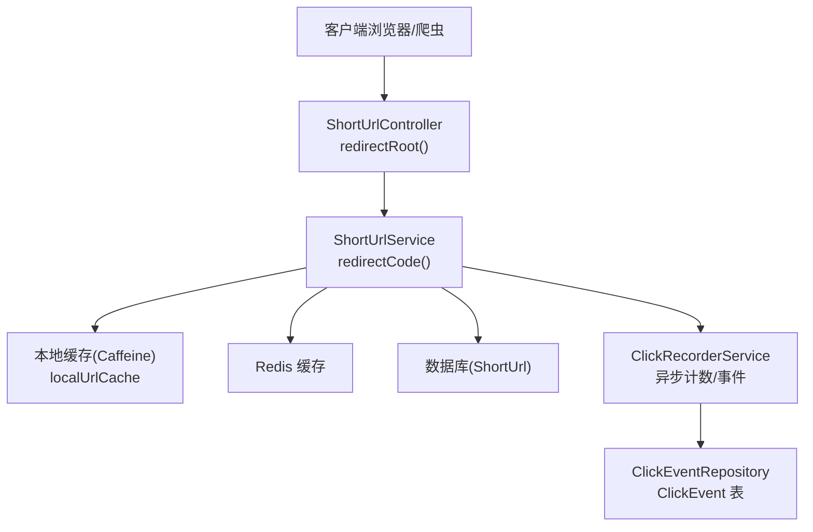
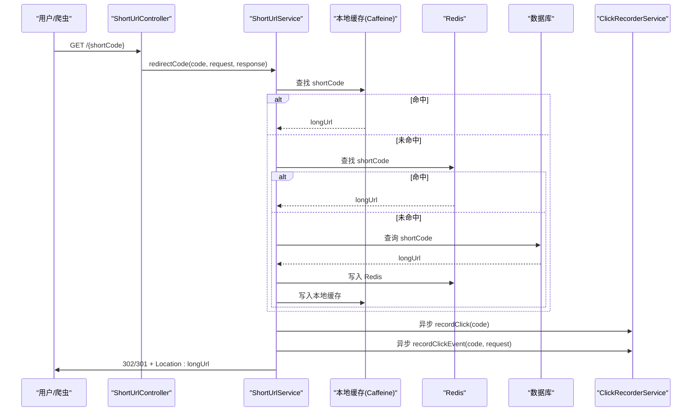
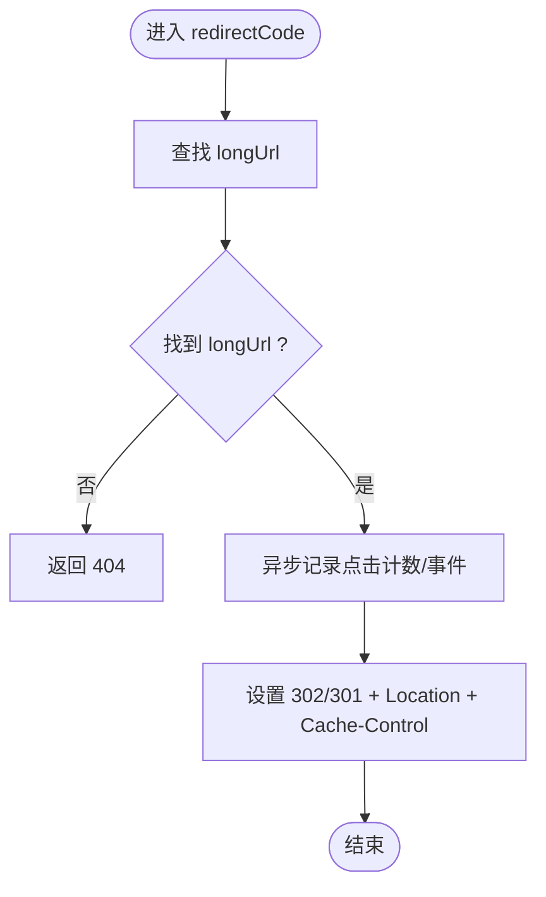
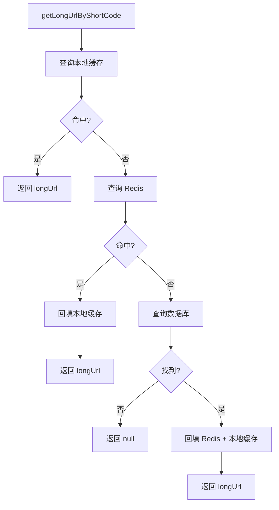
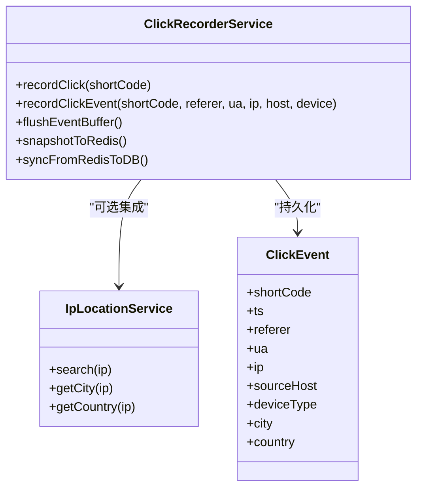
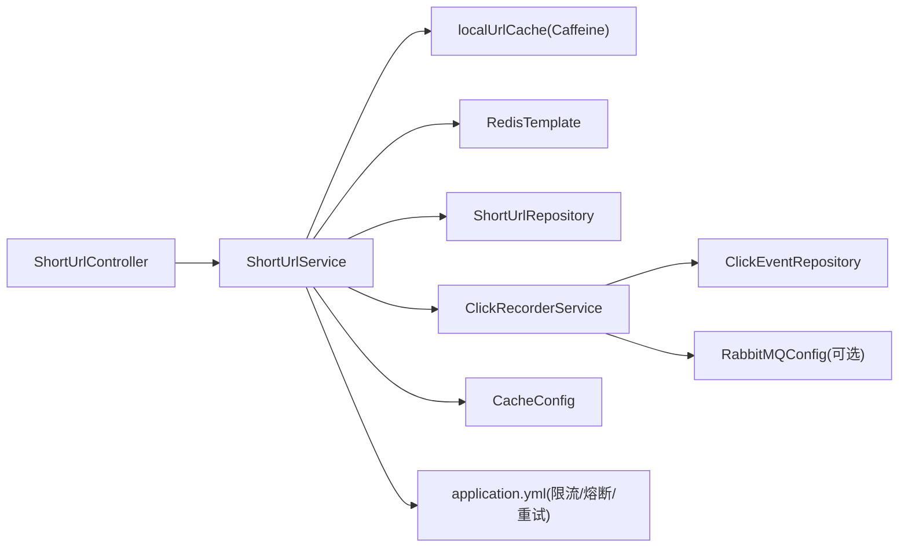

# 重定向实现

<cite>
**本文引用的文件**
- [ShortUrlController.java](file://src/main/java/com/layor/tinyflow/Controller/ShortUrlController.java)
- [ShortUrlService.java](file://src/main/java/com/layor/tinyflow/service/ShortUrlService.java)
- [ClickRecorderService.java](file://src/main/java/com/layor/tinyflow/service/ClickRecorderService.java)
- [IpLocationService.java](file://src/main/java/com/layor/tinyflow/service/IpLocationService.java)
- [ClickEvent.java](file://src/main/java/com/layor/tinyflow/entity/ClickEvent.java)
- [application.yml](file://src/main/resources/application.yml)
- [CacheConfig.java](file://src/main/java/com/layor/tinyflow/config/CacheConfig.java)
- [RabbitMQConfig.java](file://src/main/java/com/layor/tinyflow/config/RabbitMQConfig.java)
- [ClickEventRepository.java](file://src/main/java/com/layor/tinyflow/repository/ClickEventRepository.java)
- [perf-optimization.md](file://web/docs/perf-optimization.md)
</cite>

## 目录
1. [简介](#简介)
2. [项目结构](#项目结构)
3. [核心组件](#核心组件)
4. [架构总览](#架构总览)
5. [详细组件分析](#详细组件分析)
6. [依赖关系分析](#依赖关系分析)
7. [性能考虑](#性能考虑)
8. [故障排查指南](#故障排查指南)
9. [结论](#结论)

## 简介
本文围绕短链接重定向的完整实现流程进行深入说明，重点覆盖以下方面：
- 从控制器入口到重定向响应的全流程：从 ShortUrlController 的 redirectRoot 方法出发，讲解如何通过 HttpServletResponse 设置 302/301 状态码与 Location 头完成 HTTP 重定向。
- 速率限制：解释 @RateLimiter 注解如何对重定向请求进行限流，防止滥用。
- 异步记录访问日志：重定向成功后，系统如何异步调用 recordClick 和 recordClickEvent，采集 IP、User-Agent、设备类型、来源主机等上下文信息。
- 性能优化建议：结合现有缓存与可观测性配置，给出 CDN 缓存策略、HTTP/2 支持等优化思路。

## 项目结构
重定向相关的核心代码集中在控制器、服务层、缓存与统计模块之间，采用分层设计：
- 控制器层：接收外部短链访问请求，转发给服务层执行重定向逻辑。
- 服务层：负责短链解析、缓存与降级、统计计数与事件记录。
- 缓存层：本地 Caffeine + Redis 两级缓存，提升解析性能。
- 统计与事件：异步落库与快照，保障低延迟重定向路径。

**图表来源**
- [ShortUrlController.java](file://src/main/java/com/layor/tinyflow/Controller/ShortUrlController.java#L29-L33)
- [ShortUrlService.java](file://src/main/java/com/layor/tinyflow/service/ShortUrlService.java#L288-L300)
- [CacheConfig.java](file://src/main/java/com/layor/tinyflow/config/CacheConfig.java#L12-L18)
- [ClickRecorderService.java](file://src/main/java/com/layor/tinyflow/service/ClickRecorderService.java#L67-L123)
- [ClickEventRepository.java](file://src/main/java/com/layor/tinyflow/repository/ClickEventRepository.java#L1-L121)

**章节来源**
- [ShortUrlController.java](file://src/main/java/com/layor/tinyflow/Controller/ShortUrlController.java#L29-L33)
- [ShortUrlService.java](file://src/main/java/com/layor/tinyflow/service/ShortUrlService.java#L288-L300)
- [CacheConfig.java](file://src/main/java/com/layor/tinyflow/config/CacheConfig.java#L12-L18)
- [ClickRecorderService.java](file://src/main/java/com/layor/tinyflow/service/ClickRecorderService.java#L67-L123)
- [ClickEventRepository.java](file://src/main/java/com/layor/tinyflow/repository/ClickEventRepository.java#L1-L121)

## 核心组件
- 控制器：ShortUrlController 提供对外短链根路径重定向接口，将请求委托给服务层。
- 服务层：ShortUrlService 实现重定向主流程，包含缓存查找、短链解析、计数与事件记录、HTTP 响应设置。
- 缓存配置：本地 Caffeine 缓存通过 CacheConfig 注入，配合 Redis 作为二级缓存。
- 统计与事件：ClickRecorderService 提供异步计数与事件记录，支持采样与批量持久化。
- IP 地理位置：IpLocationService 提供简化版地理解析能力，便于事件统计。

**章节来源**
- [ShortUrlController.java](file://src/main/java/com/layor/tinyflow/Controller/ShortUrlController.java#L29-L33)
- [ShortUrlService.java](file://src/main/java/com/layor/tinyflow/service/ShortUrlService.java#L288-L300)
- [CacheConfig.java](file://src/main/java/com/layor/tinyflow/config/CacheConfig.java#L12-L18)
- [ClickRecorderService.java](file://src/main/java/com/layor/tinyflow/service/ClickRecorderService.java#L67-L123)
- [IpLocationService.java](file://src/main/java/com/layor/tinyflow/service/IpLocationService.java#L1-L89)

## 架构总览
重定向请求的关键路径如下：
- 客户端访问短链路径，由控制器接收。
- 服务层根据短码查询长链接，优先本地缓存，其次 Redis，最后回源数据库。
- 成功解析后，立即异步记录点击计数与点击事件，然后通过 HttpServletResponse 返回 302/301 重定向。
- 速率限制通过 Resilience4j RateLimiter 对重定向接口生效，防止滥用。

**图表来源**
- [ShortUrlController.java](file://src/main/java/com/layor/tinyflow/Controller/ShortUrlController.java#L29-L33)
- [ShortUrlService.java](file://src/main/java/com/layor/tinyflow/service/ShortUrlService.java#L288-L300)
- [ShortUrlService.java](file://src/main/java/com/layor/tinyflow/service/ShortUrlService.java#L302-L353)
- [ClickRecorderService.java](file://src/main/java/com/layor/tinyflow/service/ClickRecorderService.java#L67-L123)

**章节来源**
- [ShortUrlController.java](file://src/main/java/com/layor/tinyflow/Controller/ShortUrlController.java#L29-L33)
- [ShortUrlService.java](file://src/main/java/com/layor/tinyflow/service/ShortUrlService.java#L288-L300)
- [ShortUrlService.java](file://src/main/java/com/layor/tinyflow/service/ShortUrlService.java#L302-L353)
- [ClickRecorderService.java](file://src/main/java/com/layor/tinyflow/service/ClickRecorderService.java#L67-L123)

## 详细组件分析

### 控制器：ShortUrlController.redirectRoot
- 入口方法：@GetMapping("/{shortCode}") 将短码路径映射到 redirectRoot。
- 调用链：将请求参数与 HttpServletRequest/HttpServletResponse 传入服务层的 redirectCode 方法，交由服务层完成解析与响应设置。

**章节来源**
- [ShortUrlController.java](file://src/main/java/com/layor/tinyflow/Controller/ShortUrlController.java#L29-L33)

### 服务层：ShortUrlService.redirectCode
- 速率限制：使用 @RateLimiter(name = "redirectLimit") 对该方法进行限流，周期内最大请求数由配置决定。
- 解析与缓存：优先本地 Caffeine 缓存，再查 Redis，最后回源数据库；命中后回填缓存。
- 响应设置：若短链不存在，返回 404；解析成功后，异步记录点击计数与事件，随后设置 302/301 状态码与 Location 头，并添加 no-cache 控制头。

**图表来源**
- [ShortUrlService.java](file://src/main/java/com/layor/tinyflow/service/ShortUrlService.java#L288-L300)

**章节来源**
- [ShortUrlService.java](file://src/main/java/com/layor/tinyflow/service/ShortUrlService.java#L288-L300)

### 缓存与回源：ShortUrlService.getLongUrlByShortCode
- 本地缓存命中：直接返回 longUrl。
- Redis 命中：回填本地缓存后返回。
- 数据库回源：写入 Redis 与本地缓存，返回 longUrl。
- 熔断与重试：Redis 查询失败时触发熔断器，fallback 降级为直连数据库。

**图表来源**
- [ShortUrlService.java](file://src/main/java/com/layor/tinyflow/service/ShortUrlService.java#L302-L353)

**章节来源**
- [ShortUrlService.java](file://src/main/java/com/layor/tinyflow/service/ShortUrlService.java#L302-L353)

### 异步记录：ClickRecorderService
- 计数记录：recordClick 异步增加本地计数，随后定期快照到 Redis 并持久化至数据库。
- 事件记录：recordClickEvent 异步采集 UA、IP、来源主机、设备类型等，按采样率写入事件缓冲队列，定时批量持久化。
- IP 地理位置：可选集成 IpLocationService，解析城市与国家信息。

**图表来源**
- [ClickRecorderService.java](file://src/main/java/com/layor/tinyflow/service/ClickRecorderService.java#L67-L123)
- [IpLocationService.java](file://src/main/java/com/layor/tinyflow/service/IpLocationService.java#L1-L89)
- [ClickEvent.java](file://src/main/java/com/layor/tinyflow/entity/ClickEvent.java#L1-L48)

**章节来源**
- [ClickRecorderService.java](file://src/main/java/com/layor/tinyflow/service/ClickRecorderService.java#L67-L123)
- [IpLocationService.java](file://src/main/java/com/layor/tinyflow/service/IpLocationService.java#L1-L89)
- [ClickEvent.java](file://src/main/java/com/layor/tinyflow/entity/ClickEvent.java#L1-L48)

### 请求上下文采集：IP、UA、设备类型、来源主机
- IP 提取：优先 X-Forwarded-For/X-Real-IP，回退 remoteAddr。
- 来源主机：从 Referer 中解析 host。
- 设备类型：基于 User-Agent 字符串判断 desktop/mobile/tablet/bot。
- 地理位置：可选通过 IpLocationService 解析城市与国家。

**章节来源**
- [ShortUrlService.java](file://src/main/java/com/layor/tinyflow/service/ShortUrlService.java#L211-L242)
- [IpLocationService.java](file://src/main/java/com/layor/tinyflow/service/IpLocationService.java#L1-L89)

## 依赖关系分析
- 控制器依赖服务层；服务层依赖缓存与数据库；统计模块依赖事件仓库与消息中间件配置。
- 速率限制与熔断重试通过 Resilience4j 注解生效，配置位于 application.yml。
- 缓存通过 CacheConfig 注入本地 Caffeine 实例。

**图表来源**
- [ShortUrlController.java](file://src/main/java/com/layor/tinyflow/Controller/ShortUrlController.java#L29-L33)
- [ShortUrlService.java](file://src/main/java/com/layor/tinyflow/service/ShortUrlService.java#L288-L300)
- [CacheConfig.java](file://src/main/java/com/layor/tinyflow/config/CacheConfig.java#L12-L18)
- [RabbitMQConfig.java](file://src/main/java/com/layor/tinyflow/config/RabbitMQConfig.java#L1-L125)
- [ClickEventRepository.java](file://src/main/java/com/layor/tinyflow/repository/ClickEventRepository.java#L1-L121)
- [application.yml](file://src/main/resources/application.yml#L148-L211)

**章节来源**
- [ShortUrlController.java](file://src/main/java/com/layor/tinyflow/Controller/ShortUrlController.java#L29-L33)
- [ShortUrlService.java](file://src/main/java/com/layor/tinyflow/service/ShortUrlService.java#L288-L300)
- [CacheConfig.java](file://src/main/java/com/layor/tinyflow/config/CacheConfig.java#L12-L18)
- [RabbitMQConfig.java](file://src/main/java/com/layor/tinyflow/config/RabbitMQConfig.java#L1-L125)
- [ClickEventRepository.java](file://src/main/java/com/layor/tinyflow/repository/ClickEventRepository.java#L1-L121)
- [application.yml](file://src/main/resources/application.yml#L148-L211)

## 性能考虑
- 速率限制：通过 @RateLimiter(name = "redirectLimit") 在配置中设定每秒最大请求数，有效抑制恶意爬虫与突发流量。
- 缓存策略：两级缓存（本地 + Redis）显著降低数据库压力；预热策略可提前加载热点短链。
- 异步化：点击计数与事件记录均采用异步方式，避免阻塞重定向主路径。
- 观测与压测：提供压测脚本与可视化面板，建议建立 SLO 并持续回归验证。
- CDN 与 HTTP/2：建议在前端接入 CDN，利用缓存与边缘节点加速；启用 HTTP/2 提升多路复用与头部压缩效率，降低延迟。

**章节来源**
- [application.yml](file://src/main/resources/application.yml#L148-L211)
- [ShortUrlService.java](file://src/main/java/com/layor/tinyflow/service/ShortUrlService.java#L162-L199)
- [ClickRecorderService.java](file://src/main/java/com/layor/tinyflow/service/ClickRecorderService.java#L67-L123)
- [perf-optimization.md](file://web/docs/perf-optimization.md#L1-L45)

## 故障排查指南
- 重定向失败（404）：确认短码是否存在于数据库，检查缓存是否命中；可通过监控端点查看本地缓存命中率。
- 重定向延迟升高：关注 Redis 熔断状态与慢调用阈值；检查数据库慢查询与连接池配置。
- 事件缺失：检查采样率配置与事件缓冲队列是否正常刷新；确认 RabbitMQ 是否启用（当前配置为禁用）。
- IP 地理位置为空：确认 IpLocationService 是否启用与网络可达性。

**章节来源**
- [ShortUrlService.java](file://src/main/java/com/layor/tinyflow/service/ShortUrlService.java#L288-L300)
- [application.yml](file://src/main/resources/application.yml#L148-L211)
- [ClickRecorderService.java](file://src/main/java/com/layor/tinyflow/service/ClickRecorderService.java#L128-L157)
- [RabbitMQConfig.java](file://src/main/java/com/layor/tinyflow/config/RabbitMQConfig.java#L1-L125)
- [IpLocationService.java](file://src/main/java/com/layor/tinyflow/service/IpLocationService.java#L1-L89)

## 结论
本实现以“低延迟重定向 + 异步统计”为核心设计，通过两级缓存与限流熔断等手段，在保证用户体验的同时兼顾了系统的稳定性与可观测性。建议在生产环境中结合 CDN 与 HTTP/2 进一步优化性能，并持续以压测与监控驱动迭代优化。