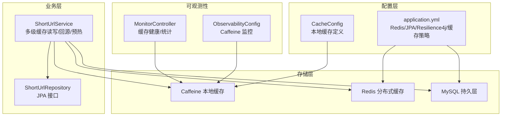
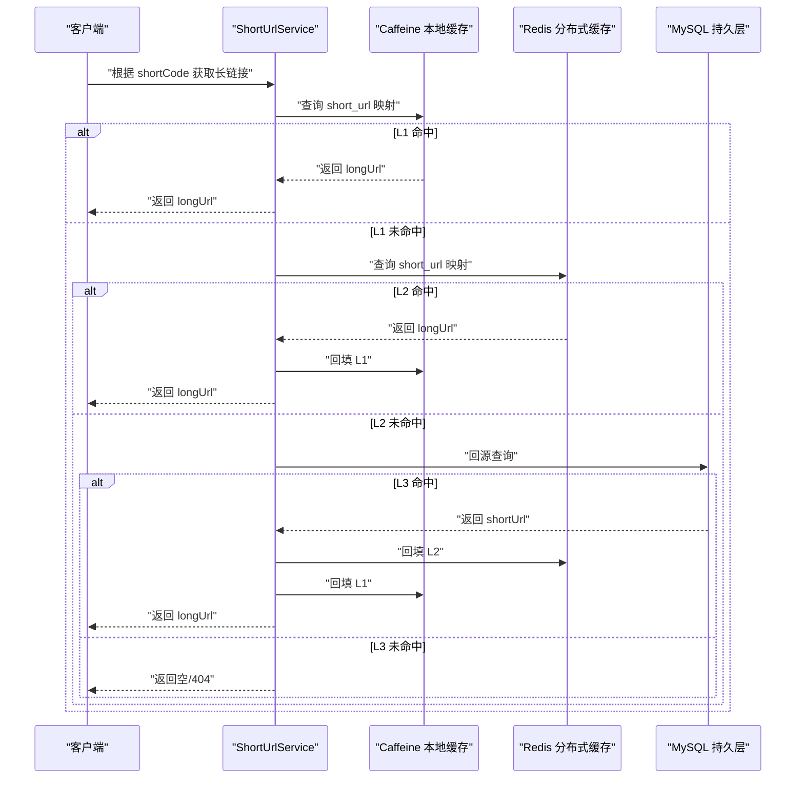
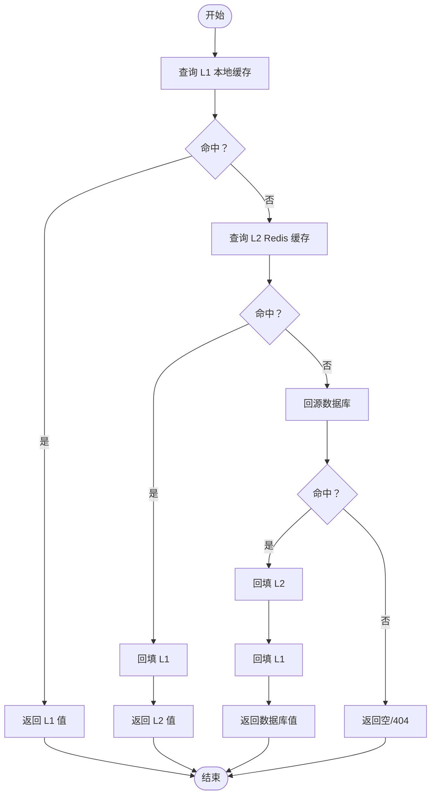
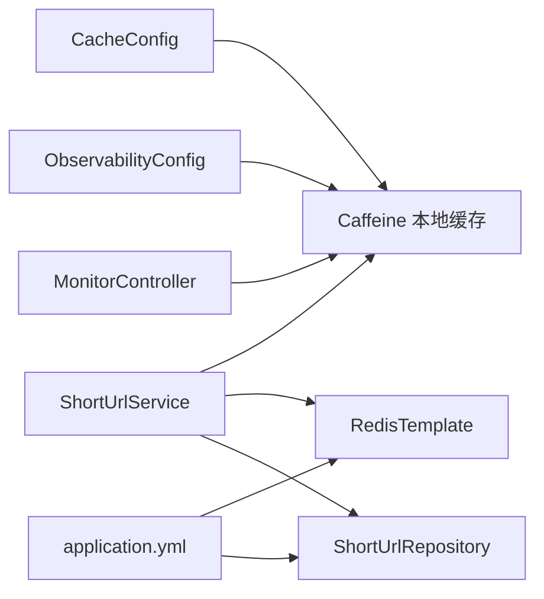
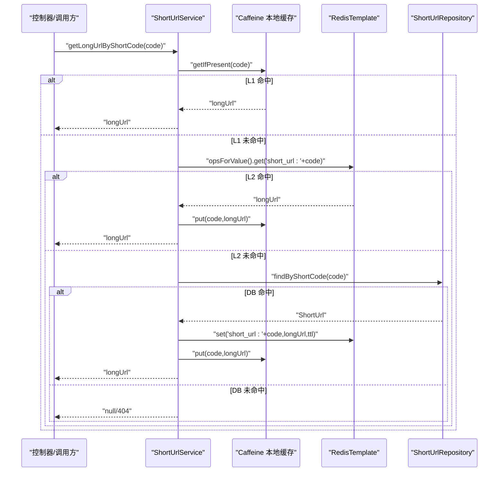

# 多级缓存架构

<cite>
**本文引用的文件**
- [CacheConfig.java](file://src/main/java/com/layor/tinyflow/config/CacheConfig.java)
- [application.yml](file://src/main/resources/application.yml)
- [ShortUrlService.java](file://src/main/java/com/layor/tinyflow/service/ShortUrlService.java)
- [ShortUrlRepository.java](file://src/main/java/com/layor/tinyflow/repository/ShortUrlRepository.java)
- [ObservabilityConfig.java](file://src/main/java/com/layor/tinyflow/config/ObservabilityConfig.java)
- [MonitorController.java](file://src/main/java/com/layor/tinyflow/Controller/MonitorController.java)
- [CircuitBreakerEventListener.java](file://src/main/java/com/layor/tinyflow/listener/CircuitBreakerEventListener.java)
- [ShortUrlServiceTest.java](file://src/test/java/com/layor/tinyflow/service/ShortUrlServiceTest.java)
</cite>

## 目录
1. [简介](#简介)
2. [项目结构](#项目结构)
3. [核心组件](#核心组件)
4. [架构总览](#架构总览)
5. [详细组件分析](#详细组件分析)
6. [依赖关系分析](#依赖关系分析)
7. [性能考量](#性能考量)
8. [故障排查指南](#故障排查指南)
9. [结论](#结论)
10. [附录](#附录)

## 简介
本文件系统性梳理 TinyFlow 的多级缓存架构，覆盖 L1（Caffeine 本地缓存）、L2（Redis 分布式缓存）与 L3（MySQL 持久层）的协同工作机制。重点解析：
- CacheConfig 中 localUrlCache 的配置项与性能影响
- 缓存读取流程：先 L1，未命中则 L2，再未命中回源数据库，并逐层写回
- application.yml 中缓存策略与弹性治理配置
- 面向缓存穿透、击穿、雪崩的工程化对策
- 结合 ShortUrlService 的缓存操作逻辑，给出命中率优化实践
- 缓存预热机制设计思路与高并发下的性能表现建议

## 项目结构
围绕缓存的关键模块与文件如下：
- 配置层：CacheConfig 定义本地缓存；application.yml 提供 Redis、JPA、Resilience4j 等配置
- 业务层：ShortUrlService 实现多级缓存读写与回源逻辑
- 存储层：ShortUrlRepository 提供数据库访问接口
- 可观测性：ObservabilityConfig 注册 Caffeine 监控；MonitorController 提供缓存健康与统计接口
- 弹性治理：application.yml 中的熔断、限流、重试配置；CircuitBreakerEventListener 记录熔断状态

图表来源
- [CacheConfig.java](file://src/main/java/com/layor/tinyflow/config/CacheConfig.java#L1-L19)
- [application.yml](file://src/main/resources/application.yml#L1-L218)
- [ShortUrlService.java](file://src/main/java/com/layor/tinyflow/service/ShortUrlService.java#L1-L789)
- [ShortUrlRepository.java](file://src/main/java/com/layor/tinyflow/repository/ShortUrlRepository.java#L1-L68)
- [ObservabilityConfig.java](file://src/main/java/com/layor/tinyflow/config/ObservabilityConfig.java#L36-L59)
- [MonitorController.java](file://src/main/java/com/layor/tinyflow/Controller/MonitorController.java#L68-L113)

章节来源
- [CacheConfig.java](file://src/main/java/com/layor/tinyflow/config/CacheConfig.java#L1-L19)
- [application.yml](file://src/main/resources/application.yml#L1-L218)
- [ShortUrlService.java](file://src/main/java/com/layor/tinyflow/service/ShortUrlService.java#L1-L789)
- [ShortUrlRepository.java](file://src/main/java/com/layor/tinyflow/repository/ShortUrlRepository.java#L1-L68)
- [ObservabilityConfig.java](file://src/main/java/com/layor/tinyflow/config/ObservabilityConfig.java#L36-L59)
- [MonitorController.java](file://src/main/java/com/layor/tinyflow/Controller/MonitorController.java#L68-L113)

## 核心组件
- 本地缓存（L1）：通过 Caffeine 在应用进程内缓存短链映射，降低跨进程访问开销
- 分布式缓存（L2）：通过 Redis 缓存热点短链，支撑多实例共享与横向扩展
- 持久层（L3）：MySQL 存储短链与点击事件等数据，作为最终一致性来源
- 业务服务（ShortUrlService）：实现多级缓存读取、回源与逐层写回，提供预热与降级能力
- 配置与弹性治理：application.yml 提供缓存规格、Redis 连接池、Resilience4j 熔断/限流/重试；ObservabilityConfig 注册 Caffeine 监控；MonitorController 提供缓存健康与统计

章节来源
- [CacheConfig.java](file://src/main/java/com/layor/tinyflow/config/CacheConfig.java#L1-L19)
- [application.yml](file://src/main/resources/application.yml#L1-L218)
- [ShortUrlService.java](file://src/main/java/com/layor/tinyflow/service/ShortUrlService.java#L1-L789)
- [ObservabilityConfig.java](file://src/main/java/com/layor/tinyflow/config/ObservabilityConfig.java#L36-L59)
- [MonitorController.java](file://src/main/java/com/layor/tinyflow/Controller/MonitorController.java#L68-L113)

## 架构总览
多级缓存的读取顺序与回源策略如下：
- L1（Caffeine）优先命中
- L1 未命中则查询 L2（Redis）
- L2 未命中则回源 L3（MySQL）
- 回源后按顺序回填 L2、L1，形成“逐层写回”的闭环
- 异常路径采用 Resilience4j 熔断与降级，避免级联故障

图表来源
- [ShortUrlService.java](file://src/main/java/com/layor/tinyflow/service/ShortUrlService.java#L288-L366)
- [ShortUrlRepository.java](file://src/main/java/com/layor/tinyflow/repository/ShortUrlRepository.java#L1-L68)

章节来源
- [ShortUrlService.java](file://src/main/java/com/layor/tinyflow/service/ShortUrlService.java#L288-L366)

## 详细组件分析

### 本地缓存配置与性能影响（CacheConfig）
- 配置入口：通过 application.yml 的 cache.caffeine.spec 注入 Caffeine 规格字符串
- 默认规格示例：maximumSize=50000、expireAfterWrite=30m、recordStats
- Bean 名称：localUrlCache，供 ShortUrlService 注入使用
- 性能影响要点：
  - maximumSize 控制本地缓存容量上限，影响内存占用与命中率
  - expireAfterWrite 决定写入后的过期时间，有助于控制陈旧数据
  - recordStats 开启后可采集命中率、淘汰数等指标，便于容量与过期策略优化

章节来源
- [CacheConfig.java](file://src/main/java/com/layor/tinyflow/config/CacheConfig.java#L1-L19)
- [application.yml](file://src/main/resources/application.yml#L141-L147)

### 缓存读取流程与逐层写回（ShortUrlService）
- 读取流程：
  - 先查 L1（localCache.getIfPresent）
  - 再查 L2（StringRedisTemplate.opsForValue().get）
  - 最后回源 L3（ShortUrlRepository.findByShortCode）
- 回源后逐层写回：
  - L2：redisTemplate.opsForValue().set(key, longUrl, TTL)
  - L1：localCache.put(shortCode, longUrl)
- 降级与容错：
  - 使用 @CircuitBreaker(redisBreaker) 与 fallbackMethod，Redis 故障时直接走数据库
  - 使用 @Retry(redisRetry) 对 Redis 异常进行指数退避重试
- 预热机制：
  - 应用启动时从数据库拉取 TopN 热点短链，同时填充 L1 与 L2
  - 可通过 cache.warmup.enabled 与 cache.warmup.size 控制开关与规模

图表来源
- [ShortUrlService.java](file://src/main/java/com/layor/tinyflow/service/ShortUrlService.java#L288-L366)

章节来源
- [ShortUrlService.java](file://src/main/java/com/layor/tinyflow/service/ShortUrlService.java#L162-L200)
- [ShortUrlService.java](file://src/main/java/com/layor/tinyflow/service/ShortUrlService.java#L288-L366)
- [ShortUrlRepository.java](file://src/main/java/com/layor/tinyflow/repository/ShortUrlRepository.java#L1-L68)

### 缓存策略与弹性治理（application.yml）
- 缓存规格：cache.caffeine.spec
- 预热：cache.warmup.enabled、cache.warmup.size
- Redis 连接与池化：spring.data.redis.*
- JPA/MySQL：spring.datasource、spring.jpa
- 限流：resilience4j.ratelimiter.redirectLimit
- 熔断：resilience4j.circuitbreaker.redisBreaker、dbBreaker
- 重试：resilience4j.retry.redisRetry
- 舱壁隔离：resilience4j.bulkhead.redisBulkhead

章节来源
- [application.yml](file://src/main/resources/application.yml#L1-L218)

### 可观测性与监控（ObservabilityConfig、MonitorController）
- Caffeine 监控：注册 CaffeineCacheMetrics，标签区分 cache=l1
- 缓存健康与统计：MonitorController 提供 /monitor/cache/stats、/monitor/cache/clear 等端点
- 测试验证：单元测试覆盖 L1/L2 命中、数据库回源、不存在等场景

章节来源
- [ObservabilityConfig.java](file://src/main/java/com/layor/tinyflow/config/ObservabilityConfig.java#L36-L59)
- [MonitorController.java](file://src/main/java/com/layor/tinyflow/Controller/MonitorController.java#L68-L113)
- [ShortUrlServiceTest.java](file://src/test/java/com/layor/tinyflow/service/ShortUrlServiceTest.java#L247-L315)

### 熔断与降级（CircuitBreakerEventListener）
- 记录熔断状态变化，OPEN/CLOSED 状态告警
- 与 ShortUrlService 的 @CircuitBreaker 配合，保障 Redis 不可用时的稳定性

章节来源
- [CircuitBreakerEventListener.java](file://src/main/java/com/layor/tinyflow/listener/CircuitBreakerEventListener.java#L1-L57)
- [application.yml](file://src/main/resources/application.yml#L148-L211)
- [ShortUrlService.java](file://src/main/java/com/layor/tinyflow/service/ShortUrlService.java#L302-L366)

## 依赖关系分析
- 组件耦合：
  - ShortUrlService 依赖本地缓存（Caffeine）、RedisTemplate、JPA Repository
  - CacheConfig 仅负责本地缓存 Bean 的装配
  - application.yml 为各组件提供统一配置
- 外部依赖：
  - Redis 与 MySQL 通过 Spring Data 集成
  - Resilience4j 提供限流、熔断、重试、舱壁隔离
- 潜在风险：
  - L2（Redis）异常时需确保降级逻辑有效
  - L3（数据库）压力过大时需配合限流与熔断

图表来源
- [ShortUrlService.java](file://src/main/java/com/layor/tinyflow/service/ShortUrlService.java#L1-L789)
- [CacheConfig.java](file://src/main/java/com/layor/tinyflow/config/CacheConfig.java#L1-L19)
- [application.yml](file://src/main/resources/application.yml#L1-L218)
- [ObservabilityConfig.java](file://src/main/java/com/layor/tinyflow/config/ObservabilityConfig.java#L36-L59)
- [MonitorController.java](file://src/main/java/com/layor/tinyflow/Controller/MonitorController.java#L68-L113)

章节来源
- [ShortUrlService.java](file://src/main/java/com/layor/tinyflow/service/ShortUrlService.java#L1-L789)
- [CacheConfig.java](file://src/main/java/com/layor/tinyflow/config/CacheConfig.java#L1-L19)
- [application.yml](file://src/main/resources/application.yml#L1-L218)
- [ObservabilityConfig.java](file://src/main/java/com/layor/tinyflow/config/ObservabilityConfig.java#L36-L59)
- [MonitorController.java](file://src/main/java/com/layor/tinyflow/Controller/MonitorController.java#L68-L113)

## 性能考量
- 命中率优化实践（基于 ShortUrlService 的实现）：
  - 启用预热：在应用启动时加载 TopN 热点短链至 L1 与 L2，减少冷启动抖动
  - 合理设置 L1 容量与过期时间：通过 cache.caffeine.spec 调整 maximumSize 与 expireAfterWrite
  - 逐层写回：回源后立即写回 L2/L1，提升后续请求命中率
  - 降级与限流：对 Redis 异常启用熔断与重试，防止级联故障
- 高并发场景建议：
  - 适度提高 Redis 连接池与线程池大小（参考 application.yml 中的连接池配置）
  - 使用 Resilience4j 限流保护下游（redirectLimit）
  - 通过 Micrometer 监控 Caffeine 命中率与延迟，动态调整 cache.caffeine.spec
- 性能表现数据：
  - 文档未提供具体数值，建议通过压测工具与监控指标（Prometheus/Micrometer）持续跟踪命中率、P95/P99 延迟、Redis/DB 负载等

[本节为通用性能指导，不直接分析具体文件]

## 故障排查指南
- 缓存命中率低
  - 检查 Caffeine 配置（maximumSize、expireAfterWrite）与实际负载是否匹配
  - 查看 /monitor/cache/stats 与 Micrometer 指标，定位 L1/L2 命中情况
  - 确认预热是否生效（cache.warmup.enabled、cache.warmup.size）
- Redis 异常
  - 关注熔断器状态变化（CircuitBreakerEventListener），必要时临时关闭熔断以验证问题
  - 检查 Redis 连接池配置与超时设置
- 数据库压力大
  - 启用限流与熔断（application.yml 中 ratelimiter、circuitbreaker、retry）
  - 评估是否需要扩大 L2 缓存规模或缩短过期时间
- 缓存穿透/击穿/雪崩
  - 缓存穿透：对不存在的 key 设置短期空值缓存，避免频繁回源
  - 缓存击穿：热点 key 过期时使用互斥锁（如 Redis SET key value NX EX ttl）或单飞队列串行回源
  - 缓存雪崩：为不同 key 设置差异化过期时间（如在过期时间基础上加随机抖动）

章节来源
- [MonitorController.java](file://src/main/java/com/layor/tinyflow/Controller/MonitorController.java#L68-L113)
- [application.yml](file://src/main/resources/application.yml#L148-L211)
- [CircuitBreakerEventListener.java](file://src/main/java/com/layor/tinyflow/listener/CircuitBreakerEventListener.java#L1-L57)

## 结论
本项目通过 L1（Caffeine）、L2（Redis）、L3（MySQL）的多级缓存架构，结合 Resilience4j 的限流、熔断与重试，实现了高可用与高性能的短链重定向服务。通过预热、逐层写回与可观测性监控，能够有效提升命中率并稳定系统表现。针对缓存穿透、击穿与雪崩，建议在现有架构基础上补充空值缓存、互斥锁与差异化过期策略，进一步增强抗压能力。

[本节为总结性内容，不直接分析具体文件]

## 附录

### 缓存读取流程（代码级序列图）

图表来源
- [ShortUrlService.java](file://src/main/java/com/layor/tinyflow/service/ShortUrlService.java#L288-L366)
- [ShortUrlRepository.java](file://src/main/java/com/layor/tinyflow/repository/ShortUrlRepository.java#L1-L68)