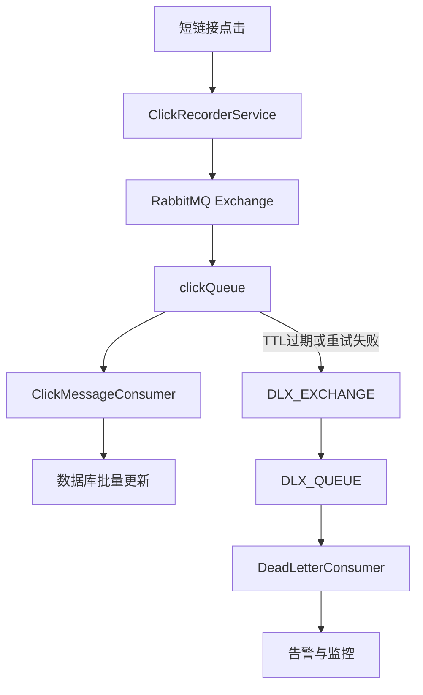
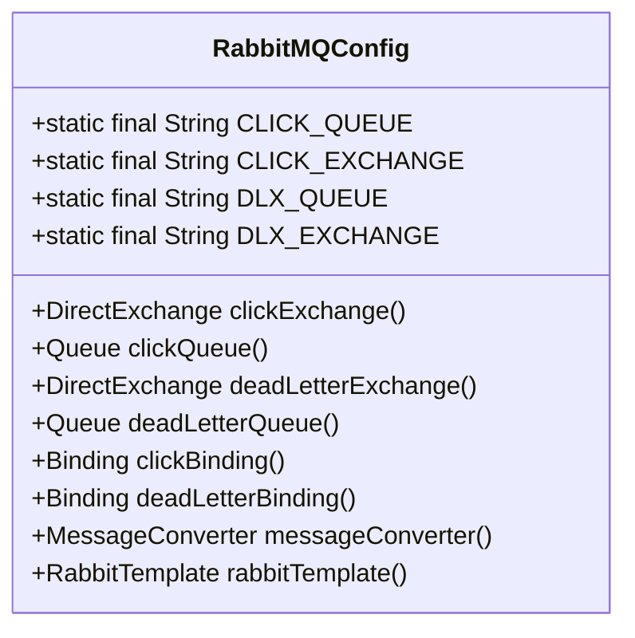
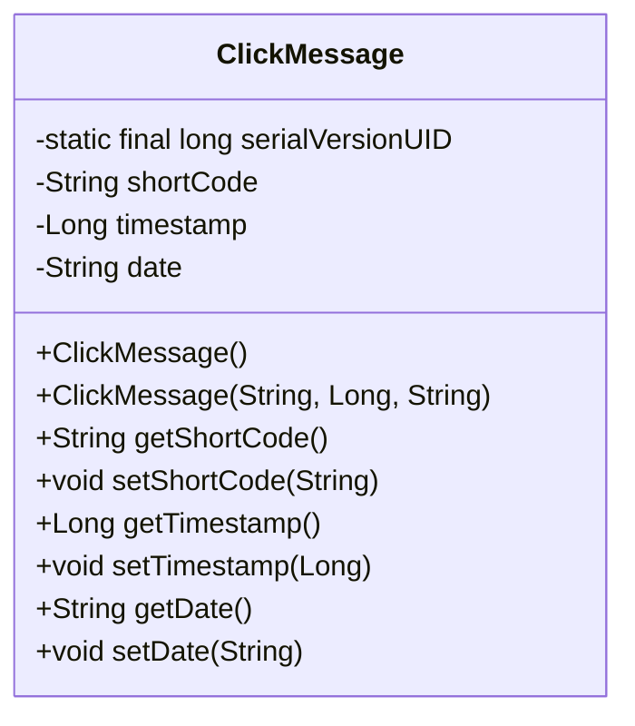
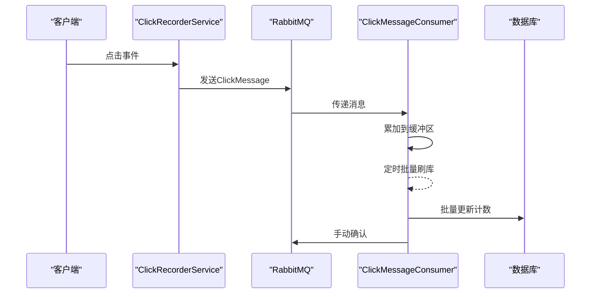
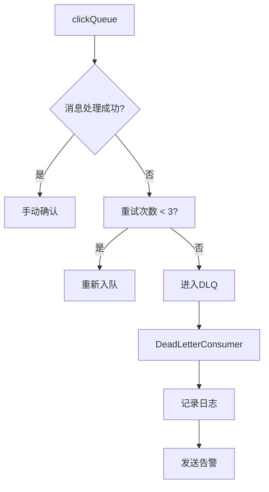
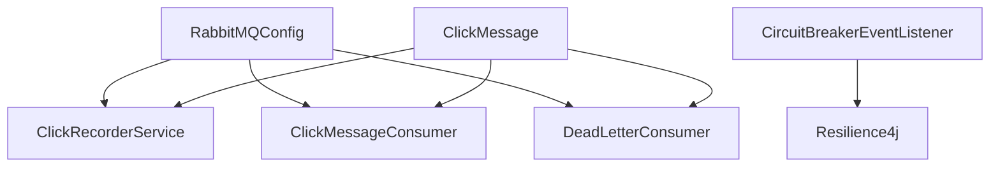

# 消息队列架构

<cite>
**本文档引用文件**  
- [RabbitMQConfig.java](file://src/main/java/com/layor/tinyflow/config/RabbitMQConfig.java)
- [ClickMessage.java](file://src/main/java/com/layor/tinyflow/entity/ClickMessage.java)
- [ClickRecorderService.java](file://src/main/java/com/layor/tinyflow/service/ClickRecorderService.java)
- [ClickMessageConsumer.java](file://src/main/java/com/layor/tinyflow/service/ClickMessageConsumer.java)
- [DeadLetterConsumer.java](file://src/main/java/com/layor/tinyflow/service/DeadLetterConsumer.java)
- [CircuitBreakerEventListener.java](file://src/main/java/com/layor/tinyflow/listener/CircuitBreakerEventListener.java)
- [application.yml](file://src/main/resources/application.yml)
</cite>

## 目录
1. [引言](#引言)
2. [核心组件](#核心组件)
3. [架构概览](#架构概览)
4. [详细组件分析](#详细组件分析)
5. [依赖分析](#依赖分析)
6. [性能考量](#性能考量)
7. [故障排查指南](#故障排查指南)
8. [结论](#结论)

## 引言
本文件全面阐述了TinyFlow系统中基于RabbitMQ的消息队列架构设计。文档详细说明了`clickExchange`、`clickQueue`及其与死信交换机（DLX）和死信队列（DLQ）的绑定关系，分析了消息的可靠传递与失败重试机制，以及在熔断降级场景下的作用。

## 核心组件
本系统的核心消息队列组件包括：`clickExchange`（点击事件交换机）、`clickQueue`（点击事件队列）、`DLX_EXCHANGE`（死信交换机）和`DLX_QUEUE`（死信队列）。这些组件协同工作，确保点击事件的异步处理和可靠传递。

**核心组件**
- [RabbitMQConfig.java](file://src/main/java/com/layor/tinyflow/config/RabbitMQConfig.java#L22-L30)

## 架构概览
系统采用异步消息处理模式，将点击事件从主业务流程中解耦。当用户点击短链接时，`ClickRecorderService`会将`ClickMessage`对象异步发送到`clickExchange`，由`clickQueue`接收并由`ClickMessageConsumer`消费，最终批量更新数据库。若消息处理失败，则通过死信机制进入`DLQ`进行告警。

**图表来源**
- [RabbitMQConfig.java](file://src/main/java/com/layor/tinyflow/config/RabbitMQConfig.java#L22-L88)
- [ClickRecorderService.java](file://src/main/java/com/layor/tinyflow/service/ClickRecorderService.java#L67-L76)
- [ClickMessageConsumer.java](file://src/main/java/com/layor/tinyflow/service/ClickMessageConsumer.java#L47-L87)

## 详细组件分析

### RabbitMQ配置分析
`RabbitMQConfig`类定义了消息队列的核心配置，包括交换机、队列、绑定关系和消息转换器。

#### 队列与交换机配置

**图表来源**
- [RabbitMQConfig.java](file://src/main/java/com/layor/tinyflow/config/RabbitMQConfig.java#L22-L88)

#### 消息传递序列化
`Jackson2JsonMessageConverter`被配置为消息转换器，负责将`ClickMessage`对象序列化为JSON格式进行传输。`ClickMessage`实体类实现了`Serializable`接口，包含`shortCode`、`timestamp`和`date`三个字段，确保了消息在网络传输中的完整性和可读性。

**图表来源**
- [RabbitMQConfig.java](file://src/main/java/com/layor/tinyflow/config/RabbitMQConfig.java#L93-L96)
- [ClickMessage.java](file://src/main/java/com/layor/tinyflow/entity/ClickMessage.java#L18-L36)

#### 发送确认与退回回调
`RabbitTemplate`配置了`ConfirmCallback`和`ReturnsCallback`以确保消息不丢失。`ConfirmCallback`在消息未成功到达交换机时触发，记录错误日志；`ReturnsCallback`在消息无法路由到任何队列时触发，提供详细的返回原因。

**组件来源**
- [RabbitMQConfig.java](file://src/main/java/com/layor/tinyflow/config/RabbitMQConfig.java#L101-L123)

### 消息生产与消费流程
`ClickRecorderService`通过`RabbitTemplate`异步发送`ClickMessage`到`clickExchange`。`ClickMessageConsumer`监听`clickQueue`，使用手动确认模式处理消息，确保消息处理成功后再确认，防止消息丢失。

**图表来源**
- [ClickRecorderService.java](file://src/main/java/com/layor/tinyflow/service/ClickRecorderService.java#L67-L76)
- [ClickMessageConsumer.java](file://src/main/java/com/layor/tinyflow/service/ClickMessageConsumer.java#L47-L74)

### 死信队列与熔断降级
`clickQueue`配置了`x-message-ttl=30000ms`（30秒TTL）和`x-dead-letter-exchange`参数。当消息在30秒内未被消费，或消费者处理失败且重试次数超过3次时，消息将被自动路由到死信队列（DLQ）。`DeadLetterConsumer`消费DLQ中的消息，记录错误并触发告警。`CircuitBreakerEventListener`监听熔断器状态变化，在熔断打开时发送告警，实现系统的熔断降级。

**图表来源**
- [RabbitMQConfig.java](file://src/main/java/com/layor/tinyflow/config/RabbitMQConfig.java#L70-L77)
- [ClickMessageConsumer.java](file://src/main/java/com/layor/tinyflow/service/ClickMessageConsumer.java#L78-L85)
- [DeadLetterConsumer.java](file://src/main/java/com/layor/tinyflow/service/DeadLetterConsumer.java#L29-L57)
- [CircuitBreakerEventListener.java](file://src/main/java/com/layor/tinyflow/listener/CircuitBreakerEventListener.java#L37-L48)

## 依赖分析
系统依赖于Spring AMQP、RabbitMQ客户端和Jackson库。`RabbitMQConfig`是核心配置类，被`ClickRecorderService`和`ClickMessageConsumer`所依赖。`ClickMessage`作为消息载体，被生产者和消费者共同依赖。

**图表来源**
- [pom.xml](file://pom.xml#L110-L113)
- [RabbitMQConfig.java](file://src/main/java/com/layor/tinyflow/config/RabbitMQConfig.java)
- [ClickRecorderService.java](file://src/main/java/com/layor/tinyflow/service/ClickRecorderService.java)
- [ClickMessageConsumer.java](file://src/main/java/com/layor/tinyflow/service/ClickMessageConsumer.java)

## 性能考量
系统通过批量消费（`prefetch=100`）和定时批量刷库（每2秒一次）来优化性能。`ClickMessageConsumer`将消息累积到内存缓冲区，当达到100条或定时器触发时，才进行一次数据库批量更新，显著减少了数据库的I/O压力。

## 故障排查指南
### 常见问题
1.  **消息积压**：检查`ClickMessageConsumer`是否正常运行，确认消费者并发数和预取数量配置。
2.  **死信队列增长**：检查`ClickMessageConsumer`处理逻辑是否存在异常，查看日志中是否有`[MQ CONSUMER ERROR]`记录。
3.  **消息丢失**：确认`RabbitTemplate`的`ConfirmCallback`和`ReturnsCallback`是否正常工作，检查网络连接。

### 运维监控指标
-   **队列长度**：监控`clickQueue`和`DLX_QUEUE`的长度。
-   **消息速率**：监控消息的发布和消费速率。
-   **消费者状态**：监控消费者的连接和处理状态。
-   **死信率**：计算进入DLQ的消息占总消息的比例。

**组件来源**
- [ClickMessageConsumer.java](file://src/main/java/com/layor/tinyflow/service/ClickMessageConsumer.java#L92-L132)
- [DeadLetterConsumer.java](file://src/main/java/com/layor/tinyflow/service/DeadLetterConsumer.java#L31-L47)

## 结论
TinyFlow的消息队列架构设计合理，通过RabbitMQ实现了点击事件的异步处理，保证了系统的高可用性和可扩展性。死信队列和熔断器的结合使用，为系统提供了强大的容错和降级能力，确保了在异常情况下的稳定运行。