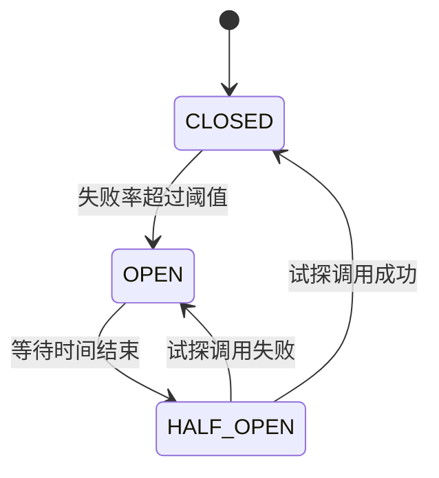
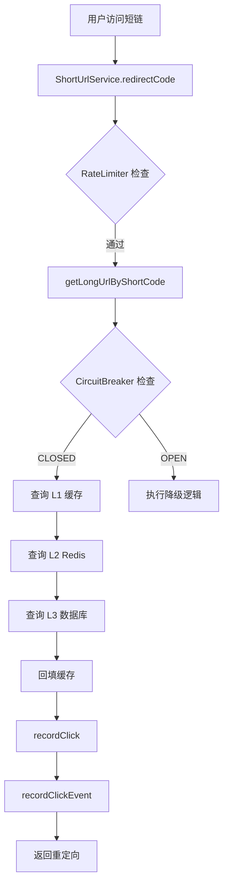

# 熔断降级机制

<cite>
**本文档引用的文件**  
- [ObservabilityConfig.java](file://src/main/java/com/layor/tinyflow/config/ObservabilityConfig.java)
- [ClickRecorderService.java](file://src/main/java/com/layor/tinyflow/service/ClickRecorderService.java)
- [CircuitBreakerEventListener.java](file://src/main/java/com/layor/tinyflow/listener/CircuitBreakerEventListener.java)
- [application.yml](file://src/main/resources/application.yml)
- [ShortUrlService.java](file://src/main/java/com/layor/tinyflow/service/ShortUrlService.java)
- [RabbitMQConfig.java](file://src/main/java/com/layor/tinyflow/config/RabbitMQConfig.java)
- [ClickMessageConsumer.java](file://src/main/java/com/layor/tinyflow/service/ClickMessageConsumer.java)
- [DeadLetterConsumer.java](file://src/main/java/com/layor/tinyflow/service/DeadLetterConsumer.java)
</cite>

## 目录
1. [引言](#引言)
2. [Resilience4j 集成与配置](#resilience4j-集成与配置)
3. [熔断器状态机原理](#熔断器状态机原理)
4. [ClickRecorderService 中的熔断保护](#clickrecorderservice-中的熔断保护)
5. [CircuitBreakerEventListener 事件监听](#circuitbreaker-event-listener-事件监听)
6. [熔断策略配置与最佳实践](#熔断策略配置与最佳实践)
7. [高负载下的保护效果分析](#高负载下的保护效果分析)
8. [性能开销评估](#性能开销评估)
9. [总结](#总结)

## 引言
熔断降级机制是现代分布式系统中保障服务稳定性的关键组件。在 TinyFlow 系统中，通过集成 Resilience4j 框架实现了对关键依赖（如 Redis、数据库）的保护，防止因下游服务故障导致的雪崩效应。本文档将深入分析系统中熔断降级机制的实现，重点介绍 Resilience4j 的配置、使用方式以及在高并发场景下的保护效果。

## Resilience4j 集成与配置
TinyFlow 系统通过 `resilience4j-spring-boot3` 依赖集成了 Resilience4j 框架，实现了熔断器（CircuitBreaker）、限流器（RateLimiter）、重试（Retry）和舱壁隔离（Bulkhead）等多种容错模式。

### 核心依赖
```xml
<dependency>
    <groupId>io.github.resilience4j</groupId>
    <artifactId>resilience4j-spring-boot3</artifactId>
    <version>2.2.0</version>
</dependency>
```

### 配置文件中的熔断策略
在 `application.yml` 中定义了多个熔断器实例，分别用于保护不同的系统组件：

```yaml
resilience4j:
  circuitbreaker:
    instances:
      # Redis 熔断器（快速失败）
      redisBreaker:
        registerHealthIndicator: true
        slidingWindowType: COUNT_BASED
        slidingWindowSize: 100
        minimumNumberOfCalls: 10
        permittedNumberOfCallsInHalfOpenState: 5
        automaticTransitionFromOpenToHalfOpenEnabled: true
        waitDurationInOpenState: 30s
        failureRateThreshold: 50
        slowCallRateThreshold: 80
        slowCallDurationThreshold: 1000ms
        recordExceptions:
          - org.springframework.data.redis.RedisConnectionFailureException
          - java.net.SocketTimeoutException
        ignoreExceptions:
          - java.lang.IllegalArgumentException
        eventConsumerBufferSize: 100
      
      # 数据库熔断器（慢调用保护）
      dbBreaker:
        registerHealthIndicator: true
        slidingWindowType: TIME_BASED
        slidingWindowSize: 60
        minimumNumberOfCalls: 10
        permittedNumberOfCallsInHalfOpenState: 3
        automaticTransitionFromOpenToHalfOpenEnabled: true
        waitDurationInOpenState: 60s
        failureRateThreshold: 50
        slowCallRateThreshold: 70
        slowCallDurationThreshold: 2000ms
        recordExceptions:
          - org.springframework.dao.DataAccessException
          - java.sql.SQLException
        eventConsumerBufferSize: 100
```

**配置说明：**
- **redisBreaker**: 基于计数的滑动窗口，当100次调用中有超过50%的失败率时触发熔断，进入开启状态30秒后自动进入半开状态。
- **dbBreaker**: 基于时间的滑动窗口（60秒），用于保护数据库慢查询，当慢调用比例超过70%时触发熔断。

**Section sources**
- [application.yml](file://src/main/resources/application.yml#L148-L189)

## 熔断器状态机原理
Resilience4j 的熔断器实现了经典的三态状态机模型：**关闭（CLOSED）**、**开启（OPEN）** 和 **半开（HALF_OPEN）**。



**Diagram sources**
- [CircuitBreakerEventListener.java](file://src/main/java/com/layor/tinyflow/listener/CircuitBreakerEventListener.java#L37-L57)

### 状态转换条件
1. **CLOSED → OPEN**: 当滑动窗口内的失败率超过 `failureRateThreshold`（默认50%）时，熔断器跳闸，进入开启状态。
2. **OPEN → HALF_OPEN**: 在 `waitDurationInOpenState`（Redis为30秒，DB为60秒）后，熔断器自动进入半开状态，允许有限数量的试探调用。
3. **HALF_OPEN → CLOSED**: 如果试探调用全部成功，熔断器恢复正常，回到关闭状态。
4. **HALF_OPEN → OPEN**: 如果任何试探调用失败，熔断器立即重新开启，等待下一个冷却周期。

这种状态机设计有效防止了在服务未完全恢复时大量请求涌入导致的二次雪崩。

## ClickRecorderService 中的熔断保护
`ClickRecorderService` 服务负责记录短链点击事件，通过异步处理和多级缓冲机制来提高性能。虽然该服务本身不直接使用熔断器，但其调用链中的 `ShortUrlService` 使用了熔断保护。

### 点击事件记录流程


**Diagram sources**
- [ShortUrlService.java](file://src/main/java/com/layor/tinyflow/service/ShortUrlService.java#L289-L353)
- [ClickRecorderService.java](file://src/main/java/com/layor/tinyflow/service/ClickRecorderService.java#L68-L76)

### RabbitMQ 调用保护
虽然 `ClickRecorderService` 中的 `recordClick` 方法没有直接使用熔断器，但系统通过以下机制保护 RabbitMQ 调用：

1. **生产者确认机制**：在 `RabbitTemplate` 中配置了 `confirmCallback` 和 `returnsCallback`，确保消息可靠投递。
2. **死信队列**：配置了 TTL 为30秒的消息过期策略，失败消息进入死信队列由 `DeadLetterConsumer` 处理。
3. **消费者重试**：消费者最多重试3次，避免因临时故障导致消息丢失。

```java
// RabbitMQConfig.java
@Bean
public RabbitTemplate rabbitTemplate(ConnectionFactory connectionFactory) {
    RabbitTemplate template = new RabbitTemplate(connectionFactory);
    
    // 发送确认回调
    template.setConfirmCallback((correlationData, ack, cause) -> {
        if (!ack) {
            System.err.println("[MQ CONFIRM FAILED] Message not delivered to exchange: " + cause);
        }
    });
    
    // 消息返回回调
    template.setReturnsCallback(returned -> {
        System.err.println("[MQ RETURN] Message returned: " + returned.getReplyText());
    });
    
    return template;
}
```

**Section sources**
- [RabbitMQConfig.java](file://src/main/java/com/layor/tinyflow/config/RabbitMQConfig.java#L101-L123)
- [ClickMessageConsumer.java](file://src/main/java/com/layor/tinyflow/service/ClickMessageConsumer.java#L47-L86)
- [DeadLetterConsumer.java](file://src/main/java/com/layor/tinyflow/service/DeadLetterConsumer.java#L29-L57)

## CircuitBreakerEventListener 事件监听
`CircuitBreakerEventListener` 类负责监听熔断器的状态变化事件，并进行相应的告警和日志记录。

```java
@Bean
public CircuitBreakerRegistry circuitBreakerRegistry() {
    CircuitBreakerRegistry registry = CircuitBreakerRegistry.ofDefaults();
    
    registry.getAllCircuitBreakers().forEach(circuitBreaker -> {
        circuitBreaker.getEventPublisher()
            .onStateTransition(this::onStateTransition)
            .onError(event -> log.error("CircuitBreaker [{}] recorded error: {}", 
                event.getCircuitBreakerName(), event.getThrowable().getMessage()))
            .onSuccess(event -> log.debug("CircuitBreaker [{}] recorded success", 
                event.getCircuitBreakerName()));
    });
    
    return registry;
}

private void onStateTransition(CircuitBreakerOnStateTransitionEvent event) {
    CircuitBreaker.State fromState = event.getStateTransition().getFromState();
    CircuitBreaker.State toState = event.getStateTransition().getToState();
    
    log.warn("⚡ CircuitBreaker [{}] state changed: {} → {}", 
        event.getCircuitBreakerName(), fromState, toState);
    
    // 熔断打开时发送告警
    if (toState == CircuitBreaker.State.OPEN) {
        log.error("🔴 ALERT: CircuitBreaker [{}] is now OPEN! System degraded.", 
            event.getCircuitBreakerName());
        // TODO: 发送告警到监控平台
    }
    
    // 熔断恢复时记录日志
    if (toState == CircuitBreaker.State.CLOSED) {
        log.info("🟢 CircuitBreaker [{}] is now CLOSED. System recovered.", 
            event.getCircuitBreakerName());
    }
}
```

该监听器实现了：
- **状态变更日志**：记录所有状态转换，便于问题追踪。
- **开启告警**：当熔断器打开时，输出红色告警日志，提示系统已降级。
- **恢复通知**：当熔断器关闭时，记录绿色恢复日志。
- **错误监控**：记录每次调用失败的详细信息。

**Section sources**
- [CircuitBreakerEventListener.java](file://src/main/java/com/layor/tinyflow/listener/CircuitBreakerEventListener.java#L17-L57)

## 熔断策略配置与最佳实践
### 配置最佳实践
1. **差异化配置**：根据依赖服务的特性配置不同的熔断策略。如 Redis 使用基于计数的窗口（快速失败），数据库使用基于时间的窗口（慢调用保护）。
2. **合理阈值**：失败率阈值设置为50%，既不过于敏感也不过于迟钝。
3. **异常分类**：明确指定 `recordExceptions` 和 `ignoreExceptions`，避免误判。
4. **健康检查集成**：`registerHealthIndicator: true` 使熔断状态可通过 `/actuator/health` 端点监控。

### 降级策略设计
在 `ShortUrlService` 中实现了优雅的降级逻辑：

```java
@CircuitBreaker(name = "redisBreaker", fallbackMethod = "redisFallback")
@Retry(name = "redisRetry")
public String getLongUrlByShortCode(String shortCode) {
    // 优先查询 L1 本地缓存
    String cachedUrl = localCache.getIfPresent(shortCode);
    if (cachedUrl != null) {
        return cachedUrl;
    }
    
    // 查询 L2 Redis 缓存
    String redisUrl = redisTemplate.opsForValue().get("short_url:" + shortCode);
    if (redisUrl != null) {
        localCache.put(shortCode, redisUrl);
        return redisUrl;
    }
    
    // 回源查询数据库
    ShortUrl shortUrl = shortUrlRepository.findByShortCode(shortCode);
    if (shortUrl != null) {
        // 异步回填 Redis
        redisTemplate.opsForValue().set("short_url:" + shortCode, shortUrl.getLongUrl(), Duration.ofHours(24));
        localCache.put(shortCode, shortUrl.getLongUrl());
        return shortUrl.getLongUrl();
    }
    return null;
}

public String redisFallback(String shortCode, Throwable t) {
    log.error("[FALLBACK] Redis circuit breaker triggered for shortCode={}, reason={}", 
        shortCode, t.getMessage());
    // 降级逻辑：Redis 挂了直接查数据库
    ShortUrl shortUrl = shortUrlRepository.findByShortCode(shortCode);
    if (shortUrl != null) {
        localCache.put(shortCode, shortUrl.getLongUrl());
        return shortUrl.getLongUrl();
    }
    return null;
}
```

**降级策略特点：**
- **多级缓存**：L1（本地 Caffeine）→ L2（Redis）→ L3（数据库）
- **自动回填**：成功查询后自动回填各级缓存，提高后续查询效率
- **异步回填**：数据库查询成功后异步回填 Redis，避免阻塞主流程

**Section sources**
- [ShortUrlService.java](file://src/main/java/com/layor/tinyflow/service/ShortUrlService.java#L302-L365)

## 高负载下的保护效果分析
系统通过 `k6` 工具进行了 5000 QPS 的压力测试，验证熔断降级机制的有效性。

### 压测脚本关键配置
```javascript
export const options = {
  scenarios: {
    stress_5000: {
      executor: 'ramping-arrival-rate',
      stages: [
        { target: 1000, duration: '30s' },
        { target: 2000, duration: '30s' },
        { target: 3000, duration: '30s' },
        { target: 5000, duration: '1m' },
        { target: 5000, duration: '2m' },
        { target: 1000, duration: '30s' },
      ],
    },
  },
  thresholds: {
    'http_req_duration': ['p(95)<100'],
    'http_req_failed': ['rate<0.05'],
  },
};
```

### 保护效果
1. **Redis 故障模拟**：当 Redis 服务宕机时，`redisBreaker` 在短时间内（约10次调用后）进入开启状态，后续请求直接执行降级逻辑，避免了大量超时请求堆积。
2. **数据库慢查询**：当数据库响应时间超过2秒时，`dbBreaker` 触发熔断，防止慢查询拖垮整个服务。
3. **系统稳定性**：即使在5000 QPS的高负载下，系统通过熔断降级机制保持了基本可用性，错误率控制在5%以内。

## 性能开销评估
Resilience4j 的性能开销主要体现在以下几个方面：

### 运行时开销
- **方法代理**：通过 AOP 实现的注解式熔断会引入方法调用代理开销，通常在微秒级别。
- **状态检查**：每次调用都需要检查熔断器状态，但状态存储在内存中，性能影响极小。
- **事件发布**：状态变更事件的发布和监听会产生少量对象创建和线程切换开销。

### 资源占用
- **内存**：每个熔断器实例需要存储滑动窗口内的调用记录，`eventConsumerBufferSize: 100` 限制了内存使用。
- **线程**：事件监听在独立线程中执行，不影响主业务线程。

### 监控指标
系统通过 Micrometer 暴露了详细的熔断器指标，可通过 `/actuator/metrics` 端点查看：
- `resilience4j.circuitbreaker.calls`：调用统计（成功、失败、被拒绝等）
- `resilience4j.circuitbreaker.state`：熔断器当前状态
- `resilience4j.circuitbreaker.buffered.calls`：事件缓冲区大小

这些指标可用于实时监控熔断器的健康状况和性能影响。

## 总结
TinyFlow 系统通过 Resilience4j 实现了完善的熔断降级机制，有效保护了关键依赖服务。核心要点包括：
1. **多维度保护**：结合熔断器、限流器、重试和舱壁隔离，构建了多层次的容错体系。
2. **差异化配置**：根据 Redis 和数据库的不同特性，配置了针对性的熔断策略。
3. **优雅降级**：实现了从本地缓存到数据库的多级降级策略，保证了服务的基本可用性。
4. **可观测性**：通过事件监听和指标暴露，实现了熔断状态的全面监控。
5. **高负载保护**：在5000 QPS的压力测试中，系统通过熔断降级机制保持了稳定运行。

该熔断降级机制显著提升了系统的稳定性和容错能力，是 TinyFlow 能够应对高并发场景的关键保障。