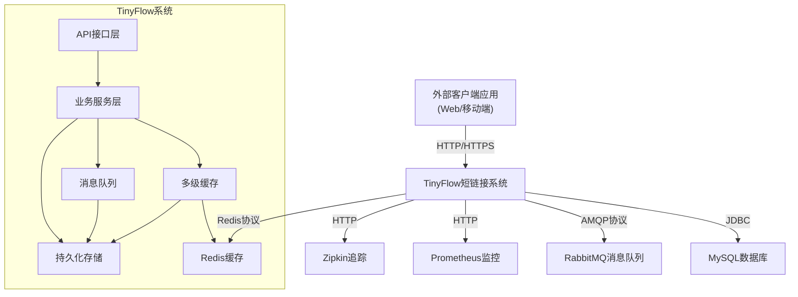
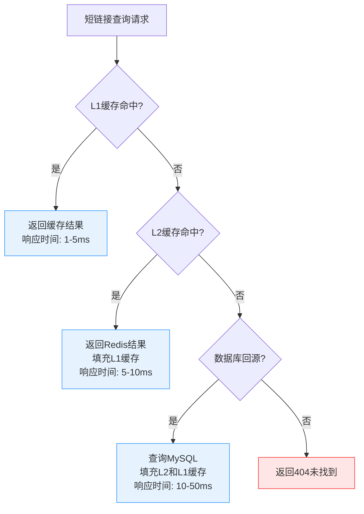
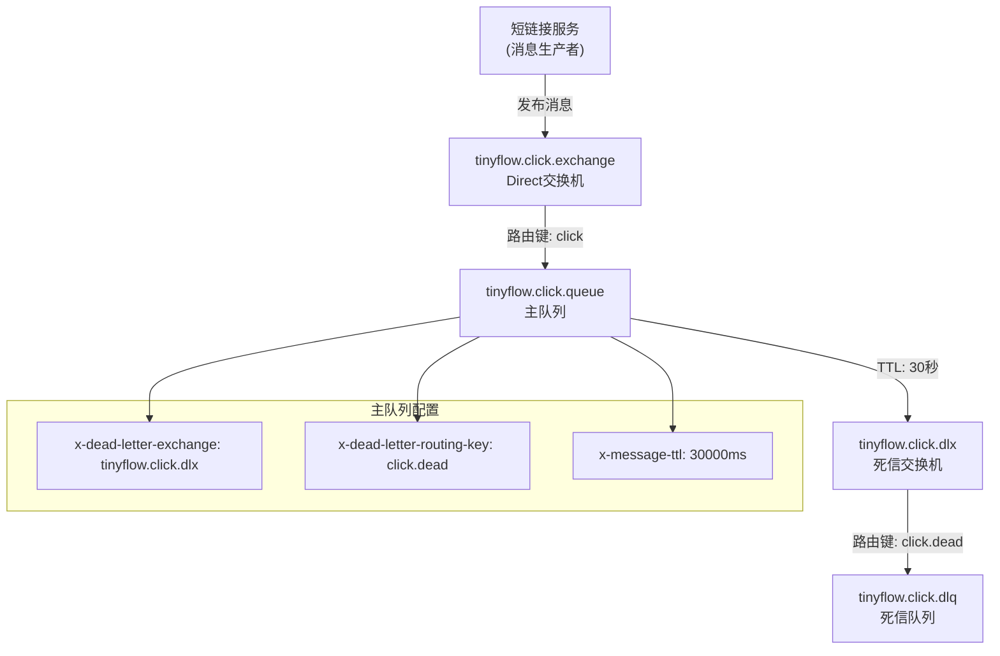
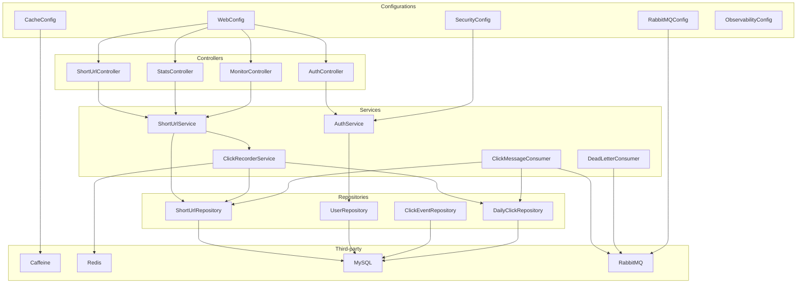

# 系统架构

<cite>
**本文档引用的文件**
- [CacheConfig.java](file://src/main/java/com/layor/tinyflow/config/CacheConfig.java)
- [RabbitMQConfig.java](file://src/main/java/com/layor/tinyflow/config/RabbitMQConfig.java)
- [PerformanceMonitorAspect.java](file://src/main/java/com/layor/tinyflow/aspect/PerformanceMonitorAspect.java)
- [application.yml](file://src/main/resources/application.yml)
- [TinyFlowApplication.java](file://src/main/java/com/layor/tinyflow/TinyFlowApplication.java)
- [CircuitBreakerEventListener.java](file://src/main/java/com/layor/tinyflow/listener/CircuitBreakerEventListener.java)
- [ClickRecorderService.java](file://src/main/java/com/layor/tinyflow/service/ClickRecorderService.java)
- [ClickMessageConsumer.java](file://src/main/java/com/layor/tinyflow/service/ClickMessageConsumer.java)
- [DeadLetterConsumer.java](file://src/main/java/com/layor/tinyflow/service/DeadLetterConsumer.java)
- [ShortUrlService.java](file://src/main/java/com/layor/tinyflow/service/ShortUrlService.java)
- [SecurityConfig.java](file://src/main/java/com/layor/tinyflow/config/SecurityConfig.java)
- [WebConfig.java](file://src/main/java/com/layor/tinyflow/config/WebConfig.java)
</cite>

## 目录
1. [系统上下文图](#系统上下文图)
2. [多级缓存架构](#多级缓存架构)
3. [消息队列架构](#消息队列架构)
4. [熔断降级机制](#熔断降级机制)
5. [性能监控AOP](#性能监控aop)
6. [组件集成配置](#组件集成配置)
7. [组件图](#组件图)

## 系统上下文图

该系统是一个短链接服务，为外部用户提供短链接创建、重定向和统计功能。系统通过REST API与客户端应用交互，使用多种中间件和服务来确保高可用性和高性能。



**图源**
- [TinyFlowApplication.java](file://src/main/java/com/layor/tinyflow/TinyFlowApplication.java)
- [application.yml](file://src/main/resources/application.yml)

## 多级缓存架构

系统采用三级缓存架构（L1 Caffeine → L2 Redis → L3 MySQL）来优化短链接查询性能，通过缓存预热、穿透/击穿/雪崩防护等策略确保缓存的高可用性。

### L1 Caffeine本地缓存

L1缓存使用Caffeine作为本地内存缓存，提供最快的访问速度。在`CacheConfig`中通过`@Bean("localUrlCache")`定义了名为`localUrlCache`的缓存实例，其配置通过`application.yml`中的`cache.caffeine.spec`属性进行控制。



**图源**
- [CacheConfig.java](file://src/main/java/com/layor/tinyflow/config/CacheConfig.java)
- [ShortUrlService.java](file://src/main/java/com/layor/tinyflow/service/ShortUrlService.java)

### 缓存配置与预热

在`application.yml`中，缓存配置为`maximumSize=50000,expireAfterWrite=30m,recordStats`，表示最大容量50000条，写入后30分钟过期，并记录统计信息。系统启动时会执行缓存预热，从数据库加载热门短链接到L1和L2缓存中，减少冷启动时的数据库压力。

```java
// 缓存预热逻辑
int l1Loaded = 0, l2Loaded = 0;
for (ShortUrl url : hotUrls.getContent()) {
    // 填充L1本地缓存
    localCache.put(shortCode, longUrl);
    l1Loaded++;
    
    // 同时填充L2 Redis缓存
    redisTemplate.opsForValue().set(
        "short_url:" + shortCode, 
        longUrl, 
        Duration.ofHours(24)
    );
    l2Loaded++;
}
```

**图源**
- [application.yml](file://src/main/resources/application.yml)
- [CacheConfig.java](file://src/main/java/com/layor/tinyflow/config/CacheConfig.java)

### 缓存穿透/击穿/雪崩应对

系统通过多种策略应对缓存常见问题：
- **缓存穿透**：对不存在的短链接查询，不进行缓存，依赖数据库查询返回404
- **缓存击穿**：热点数据过期时，通过Redis作为二级缓存层，避免直接冲击数据库
- **缓存雪崩**：采用随机过期时间策略，避免大量缓存同时失效

**节源**
- [ShortUrlService.java](file://src/main/java/com/layor/tinyflow/service/ShortUrlService.java)
- [ClickRecorderService.java](file://src/main/java/com/layor/tinyflow/service/ClickRecorderService.java)

## 消息队列架构

系统使用RabbitMQ作为消息队列，通过交换机、队列和死信队列的配置确保统计消息的可靠传递，防止消息丢失。

### RabbitMQ配置

`RabbitMQConfig`类中定义了点击事件的交换机、队列和死信队列。系统配置了`tinyflow.click.queue`作为主队列，`tinyflow.click.dlq`作为死信队列，通过TTL（30秒）机制将未及时处理的消息转移到死信队列。



**图源**
- [RabbitMQConfig.java](file://src/main/java/com/layor/tinyflow/config/RabbitMQConfig.java)

### 消息可靠性保障

系统通过多种机制确保消息的可靠传递：
- **生产者确认**：配置`publisher-confirm-type: correlated`，确保消息到达交换机
- **消息返回**：配置`mandatory: true`，确保消息能路由到队列
- **消费者确认**：使用手动确认模式，处理成功后才确认消息
- **重试机制**：消费者最多重试3次，失败后进入死信队列

```java
// 消费者手动确认
channel.basicAck(amqpMessage.getMessageProperties().getDeliveryTag(), false);

// 死信队列处理
@RabbitListener(queues = RabbitMQConfig.DLX_QUEUE)
public void consumeDeadLetter(ClickMessage message, Channel channel, Message amqpMessage) {
    log.error("[DLQ] Dead letter received: shortCode={}, timestamp={}", 
        message.getShortCode(), message.getTimestamp());
    // 手动确认，从死信队列移除
    channel.basicAck(amqpMessage.getMessageProperties().getDeliveryTag(), false);
}
```

**节源**
- [RabbitMQConfig.java](file://src/main/java/com/layor/tinyflow/config/RabbitMQConfig.java)
- [ClickMessageConsumer.java](file://src/main/java/com/layor/tinyflow/service/ClickMessageConsumer.java)
- [DeadLetterConsumer.java](file://src/main/java/com/layor/tinyflow/service/DeadLetterConsumer.java)

## 熔断降级机制

系统使用Resilience4j实现熔断降级，保护下游的Redis和数据库服务，防止因依赖服务故障导致系统雪崩。

### Redis熔断器

`redisBreaker`配置为基于计数的滑动窗口，当100次调用中有超过50%的失败率或80%的慢调用率时，熔断器打开，直接返回降级结果，避免继续调用故障的Redis服务。

```yaml
resilience4j:
  circuitbreaker:
    instances:
      redisBreaker:
        slidingWindowType: COUNT_BASED
        slidingWindowSize: 100
        failureRateThreshold: 50
        slowCallRateThreshold: 80
        slowCallDurationThreshold: 1000ms
        waitDurationInOpenState: 30s
```

### 数据库熔断器

`dbBreaker`配置为基于时间的滑动窗口，当60秒内调用失败率超过50%时，熔断器打开，保护数据库不被过多请求压垮。

```java
@CircuitBreaker(name = "redisBreaker", fallbackMethod = "redisFallback")
@Retry(name = "redisRetry")
public String getLongUrlByShortCode(String shortCode) {
    // L1: 本地Caffeine缓存
    String cachedUrl = localCache.getIfPresent(shortCode);
    if (cachedUrl != null) {
        return cachedUrl;
    }
    
    // L2: Redis缓存
    String redisUrl = redisTemplate.opsForValue().get("short_url:" + shortCode);
    if (redisUrl != null) {
        // 填充L1缓存
        localCache.put(shortCode, redisUrl);
        return redisUrl;
    }
    
    // L3: 数据库回源
    ShortUrl shortUrl = shortUrlRepository.findByShortCode(shortCode);
    if (shortUrl != null) {
        // 填充L2和L1缓存
        redisTemplate.opsForValue().set("short_url:" + shortCode, shortUrl.getLongUrl(), Duration.ofHours(24));
        localCache.put(shortCode, shortUrl.getLongUrl());
        return shortUrl.getLongUrl();
    }
    
    return null;
}
```

**节源**
- [application.yml](file://src/main/resources/application.yml)
- [ShortUrlService.java](file://src/main/java/com/layor/tinyflow/service/ShortUrlService.java)
- [CircuitBreakerEventListener.java](file://src/main/java/com/layor/tinyflow/listener/CircuitBreakerEventListener.java)

## 性能监控AOP

系统使用AOP（面向切面编程）实现性能监控，通过`PerformanceMonitorAspect`切面记录Controller和Service层方法的执行时间，识别慢请求。

### 监控切面实现

`PerformanceMonitorAspect`使用`@Around`注解定义环绕通知，监控`com.layor.tinyflow.Controller`和`com.layor.tinyflow.service`包下的所有方法。当方法执行时间超过100ms时，记录为慢请求。

```java
@Aspect
@Component
@Slf4j
public class PerformanceMonitorAspect {
    private static final long SLOW_THRESHOLD_MS = 100; // 慢请求阈值：100ms
    
    @Around("execution(* com.layor.tinyflow.Controller..*(..))")
    public Object monitorController(ProceedingJoinPoint joinPoint) throws Throwable {
        return monitor(joinPoint, "Controller");
    }
    
    @Around("execution(* com.layor.tinyflow.service..*(..))")
    public Object monitorService(ProceedingJoinPoint joinPoint) throws Throwable {
        return monitor(joinPoint, "Service");
    }
    
    private Object monitor(ProceedingJoinPoint joinPoint, String layer) throws Throwable {
        String methodName = joinPoint.getSignature().toShortString();
        long startTime = System.currentTimeMillis();
        
        try {
            Object result = joinPoint.proceed();
            long duration = System.currentTimeMillis() - startTime;
            
            // 记录慢请求
            if (duration > SLOW_THRESHOLD_MS) {
                PERF_LOG.warn("[{}] SLOW - {} took {}ms", layer, methodName, duration);
            } else {
                log.debug("[{}] {} took {}ms", layer, methodName, duration);
            }
            
            return result;
        } catch (Exception e) {
            long duration = System.currentTimeMillis() - startTime;
            PERF_LOG.error("[{}] ERROR - {} failed after {}ms: {}", 
                    layer, methodName, duration, e.getMessage());
            throw e;
        }
    }
}
```

**节源**
- [PerformanceMonitorAspect.java](file://src/main/java/com/layor/tinyflow/aspect/PerformanceMonitorAspect.java)

## 组件集成配置

系统通过`application.yml`文件集中配置各组件的集成参数，包括数据库连接池、Redis连接池、线程池等，确保系统在高并发下的稳定运行。

### 核心配置参数

| 组件 | 配置项 | 值 | 说明 |
|------|------|-----|------|
| 数据库 | 最大连接池大小 | 100 | HikariCP连接池最大连接数 |
| Redis | 最大活跃连接 | 600 | Letture连接池最大活跃连接数 |
| Tomcat | 最大线程数 | 600 | Tomcat线程池最大线程数 |
| Tomcat | 最大连接数 | 30000 | Tomcat最大连接数 |
| 限流器 | 限流周期 | 1秒 | 每秒最多3500次重定向请求 |
| 限流器 | 限流阈值 | 3500 | 每秒最多3500次重定向请求 |

```yaml
spring:
  datasource:
    hikari:
      maximum-pool-size: 100
      minimum-idle: 20
  data:
    redis:
      lettuce:
        pool:
          max-active: 600
          max-idle: 200
  server:
    tomcat:
      threads:
        max: 600
        min-spare: 50
      max-connections: 30000
resilience4j:
  ratelimiter:
    instances:
      redirectLimit:
        limitForPeriod: 3500
        limitRefreshPeriod: 1s
```

**节源**
- [application.yml](file://src/main/resources/application.yml)
- [TinyFlowApplication.java](file://src/main/java/com/layor/tinyflow/TinyFlowApplication.java)

## 组件图

系统组件图展示了各主要组件之间的关系和依赖，包括控制器、服务、仓库、配置和第三方依赖。



**图源**
- [TinyFlowApplication.java](file://src/main/java/com/layor/tinyflow/TinyFlowApplication.java)
- [application.yml](file://src/main/resources/application.yml)