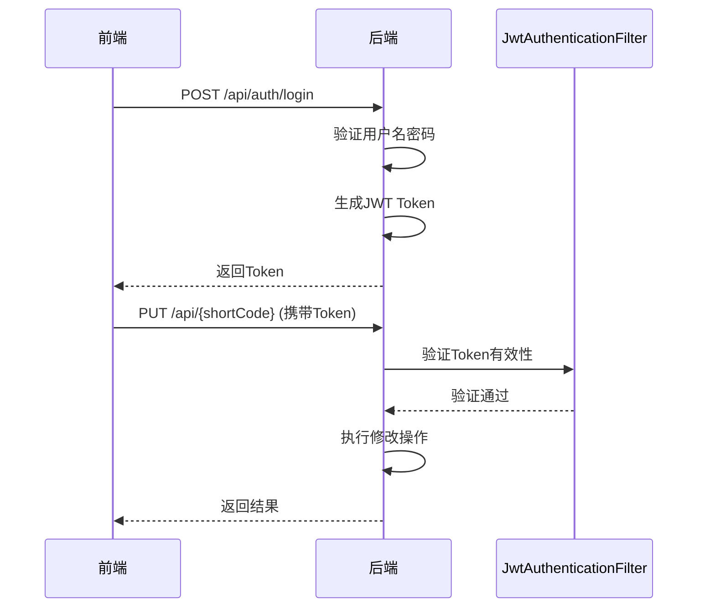
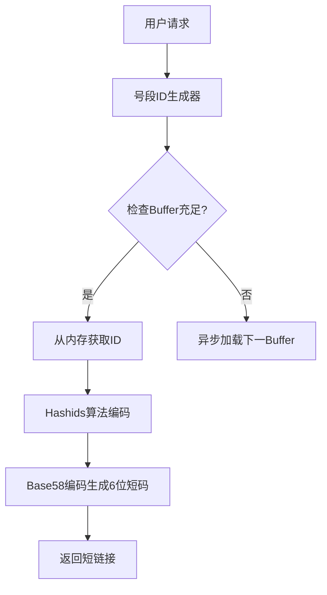
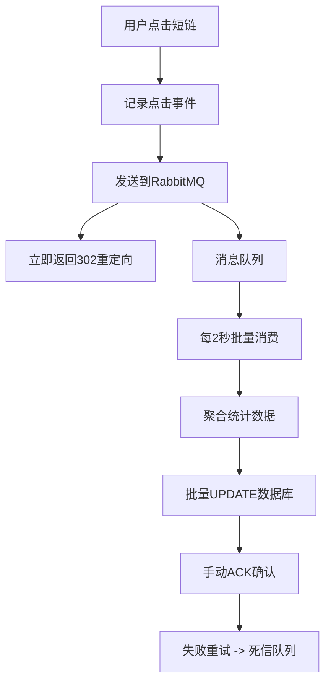

# 系统概述

<cite>
**本文档引用文件**  
- [README.md](file://README.md)
- [TinyFlowApplication.java](file://src/main/java/com/layor/tinyflow/TinyFlowApplication.java)
- [application.yml](file://src/main/resources/application.yml)
- [ShortUrlController.java](file://src/main/java/com/layor/tinyflow/Controller/ShortUrlController.java)
- [ShortUrlService.java](file://src/main/java/com/layor/tinyflow/service/ShortUrlService.java)
- [ClickRecorderService.java](file://src/main/java/com/layor/tinyflow/service/ClickRecorderService.java)
- [SecurityConfig.java](file://src/main/java/com/layor/tinyflow/config/SecurityConfig.java)
- [ObservabilityConfig.java](file://src/main/java/com/layor/tinyflow/config/ObservabilityConfig.java)
- [ShortUrl.java](file://src/main/java/com/layor/tinyflow/entity/ShortUrl.java)
- [JwtUtil.java](file://src/main/java/com/layor/tinyflow/security/JwtUtil.java)
</cite>

## 目录

1. [系统简介](#系统简介)
2. [核心特性](#核心特性)
3. [技术架构](#技术架构)
4. [主要功能模块](#主要功能模块)
5. [性能与可靠性](#性能与可靠性)
6. [数据流动路径](#数据流动路径)

## 系统简介

TinyFlow 是一款面向高并发场景的高性能短链接生成与统计系统，其设计哲学源于“雨滴汇聚成河流”的自然现象——每一个独一无二的短链接如同雨滴，无数次的点击汇聚成数据洪流。系统采用**号段模式 + 多级缓存 + 消息队列**的先进架构，有效解决了传统短链系统在高并发下的性能瓶颈问题。

系统核心定位为提供稳定、快速、可扩展的短链接服务，不仅满足基础的链接缩短需求，更通过精细化的访问统计与分析，为营销活动、社交媒体推广、App分发等场景提供数据支持。其设计初衷是打造一个兼具高性能与高可用性的现代化短链接平台，适用于学习高并发系统设计或作为生产环境的可靠解决方案。

**Section sources**
- [README.md](file://README.md#L1-L726)

## 核心特性

TinyFlow 系统具备以下核心功能与技术特性：

### 用户功能
- **自定义别名**：支持用户自定义短链后缀，增强品牌一致性与可读性。
- **一键生成**：输入长链接，系统秒级响应并生成短链接。
- **二维码生成**：为每个短链接自动生成二维码，支持下载与分享。
- **历史记录管理**：提供分页、筛选、编辑别名与删除条目的完整管理功能。
- **访问统计分析**：提供点击趋势、来源分布、设备统计等多维度数据可视化。
- **多语言支持**：内置中英文切换功能，提升国际化用户体验。

### 技术特性
- **高性能**：经压测验证，可稳定支撑 **3000+ QPS**，P99 延迟 **< 100ms**。
- **无冲突短码**：采用号段模式 + Hashids + Base58 算法，稳定生成6位短码，避免ID冲突。
- **多级缓存**：构建 Caffeine (L1) + Redis (L2) + MySQL (L3) 的三级缓存架构，缓存命中率高达85%以上，显著降低数据库压力。
- **异步统计**：利用 RabbitMQ 消息队列实现点击统计的异步解耦，消息丢失率低于0.01%，确保跳转请求的低延迟。
- **熔断降级**：集成 Resilience4j 实现熔断与降级策略，当 Redis 或 MySQL 故障时，系统可自动降级，保障核心功能的可用性。
- **可观测性**：集成 Prometheus、Grafana 和 Zipkin，提供全链路监控、指标采集与链路追踪能力。

**Section sources**
- [README.md](file://README.md#L62-L98)

## 技术架构

TinyFlow 采用前后端分离的现代化架构，前端与后端各自独立部署，通过清晰的API接口进行通信。

### 前端技术栈
前端基于 **Vue 3 + Vite** 构建，采用 Composition API 提供响应式编程体验。Vite 作为构建工具，提供了极速的热更新开发体验。UI 框架采用 Tailwind CSS 进行原子化样式开发，结合 ECharts 实现数据可视化，整体界面风格现代、简洁、响应式。

### 后端技术栈
后端基于 **Spring Boot** 框架，结合一系列成熟的技术组件：
- **数据访问**：Spring Data JPA
- **数据库**：MySQL 8.0
- **缓存**：Redis 7.x (分布式缓存) + Caffeine 3.x (本地缓存)
- **消息队列**：RabbitMQ 3.x
- **安全**：Spring Security + JWT
- **可观测性**：Prometheus + Grafana + Zipkin
- **容错**：Resilience4j

### 系统整体架构图

```mermaid
graph TB
subgraph "用户端"
Client[用户端 (Web/Mobile)]
end
subgraph "网关层"
Nginx[Nginx 反向代理 + 负载均衡]
end
subgraph "应用层"
Frontend[Vue 3 前端 (静态资源)]
Backend[Spring Boot 后端服务]
end
subgraph "中间件层"
Caffeine[Caffeine (L1 本地缓存)]
Redis[Redis (L2 分布式缓存)]
RabbitMQ[RabbitMQ (消息队列)]
end
subgraph "数据层"
MySQL[MySQL (持久化层)]
Consumer[统计消费者 (批量写入)]
end
Client --> Nginx
Nginx --> Frontend
Nginx --> Backend
Backend --> Caffeine
Backend --> Redis
Backend --> RabbitMQ
Caffeine --> Redis
Redis --> MySQL
RabbitMQ --> Consumer
Consumer --> MySQL
```

**Diagram sources**
- [README.md](file://README.md#L170-L198)

**Section sources**
- [README.md](file://README.md#L114-L140)
- [TinyFlowApplication.java](file://src/main/java/com/layor/tinyflow/TinyFlowApplication.java#L1-L47)

## 主要功能模块

### 短链生成与跳转
- **生成**：用户通过 `POST /api/shorten` 接口提交长链接，后端服务生成唯一的短码并返回短链接。
- **跳转**：用户访问短链接（如 `GET /api/redirect/{code}`），后端服务通过多级缓存快速查询原始长链接，并返回 `302` 重定向响应。

### 访问统计分析
- **异步记录**：每次跳转请求会触发一个点击事件，该事件被异步发送到 RabbitMQ 消息队列。
- **批量聚合**：后台消费者服务定时（每2秒）从队列中批量消费消息，聚合统计信息，并批量更新数据库。
- **数据查询**：提供 `GET /api/urls/click-stats` 等接口，供前端查询特定短链的访问趋势、来源、设备等详细统计信息。

### 用户认证
系统采用 JWT (JSON Web Token) 进行用户身份认证。用户登录后，服务端生成一个包含用户信息的 JWT Token 并返回给前端。前端在后续请求中携带此 Token，由 `JwtAuthenticationFilter` 进行验证，确保操作的安全性。未登录用户可匿名创建短链，登录用户则可管理自己的短链。



**Diagram sources**
- [SecurityConfig.java](file://src/main/java/com/layor/tinyflow/config/SecurityConfig.java#L1-L146)
- [JwtUtil.java](file://src/main/java/com/layor/tinyflow/security/JwtUtil.java#L1-L149)

### 系统监控与可观测性
系统集成了全面的可观测性能力：
- **指标监控**：通过 Micrometer 将性能指标（如QPS、延迟、缓存命中率）暴露给 Prometheus。
- **链路追踪**：通过 Zipkin 追踪请求的完整调用链路，便于性能分析与故障排查。
- **日志管理**：使用 Logback 进行结构化日志输出，包含 TraceId 用于请求追踪。
- **熔断监控**：Resilience4j 提供熔断器状态监控，可通过 `/actuator/circuitbreakers` 端点查询。

**Section sources**
- [application.yml](file://src/main/resources/application.yml#L88-L132)
- [ObservabilityConfig.java](file://src/main/java/com/layor/tinyflow/config/ObservabilityConfig.java#L1-L60)

## 性能与可靠性

TinyFlow 系统在高并发场景下表现出卓越的性能和可靠性。

### 性能目标
- **高吞吐量**：压测环境下可稳定支撑 **3000+ QPS**。
- **低延迟**：P99 延迟控制在 **100ms** 以内，P95 延迟低于 50ms。
- **高缓存命中率**：L1+L2 缓存总命中率超过 85%，有效保护数据库。

### 可靠性设计
- **多级缓存**：三级缓存架构确保了热点数据的快速访问，即使L2 Redis故障，L1本地缓存仍能提供服务。
- **熔断降级**：Resilience4j 配置了针对 Redis 和 MySQL 的熔断器。当 Redis 故障时，系统会降级到直接查询数据库，避免级联故障。
- **异步解耦**：通过 RabbitMQ 将点击统计与跳转请求解耦，即使统计系统暂时不可用，也不会影响用户的跳转体验。
- **数据持久化**：采用“本地内存计数 -> Redis快照 -> 数据库持久化”的两阶段方案，确保统计数据不丢失。

**Section sources**
- [README.md](file://README.md#L286-L316)
- [OBSERVABILITY.md](file://OBSERVABILITY.md#L1-L257)

## 数据流动路径

以下是用户请求在系统中的完整数据流动路径：

### 短码生成流程


**Diagram sources**
- [README.md](file://README.md#L204-L224)
- [ShortUrlService.java](file://src/main/java/com/layor/tinyflow/service/ShortUrlService.java#L140-L148)

### 多级缓存读取流程
```mermaid
flowchart TD
A[用户访问短链] --> B[L1 Caffeine本地缓存]
B --> C{命中?}
C --> |是| D[返回 (最快)]
C --> |否| E[L2 Redis分布式缓存]
E --> F{命中?}
F --> |是| G[回填L1 -> 返回]
F --> |否| H[L3 MySQL数据库]
H --> I{查询成功?}
I --> |是| J[回填L2 -> 回填L1 -> 返回]
I --> |否| K[返回404]
```

**Diagram sources**
- [README.md](file://README.md#L229-L252)
- [ShortUrlService.java](file://src/main/java/com/layor/tinyflow/service/ShortUrlService.java#L304-L353)

### 异步统计流程


**Diagram sources**
- [README.md](file://README.md#L257-L280)
- [ClickRecorderService.java](file://src/main/java/com/layor/tinyflow/service/ClickRecorderService.java#L67-L253)