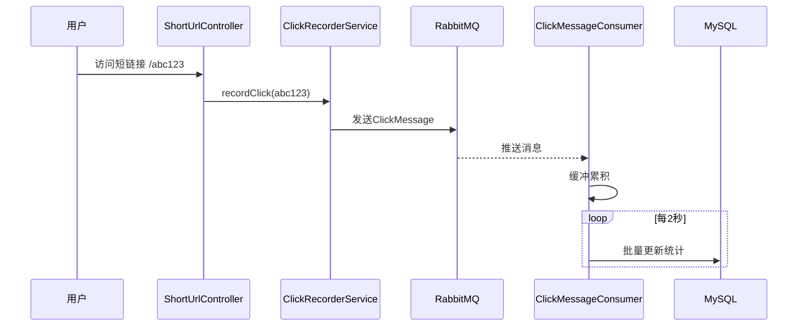
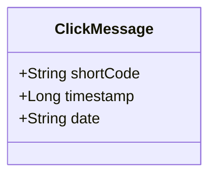
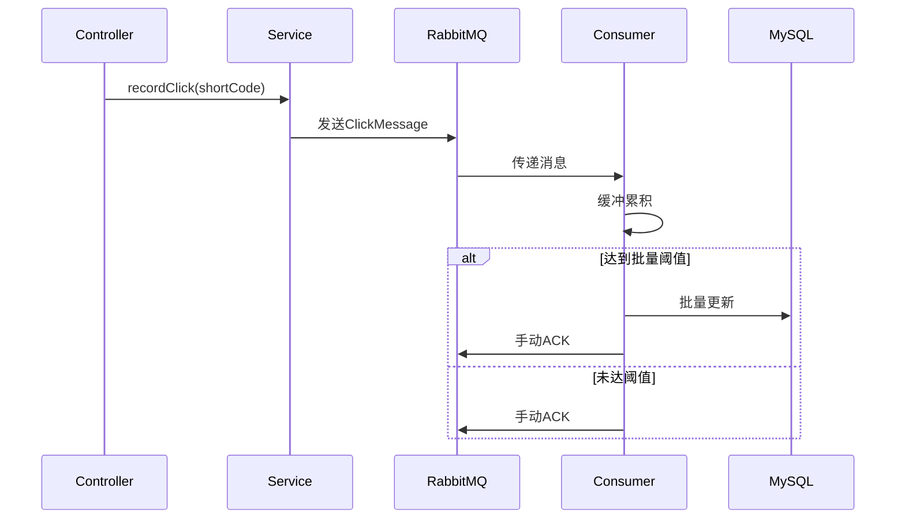
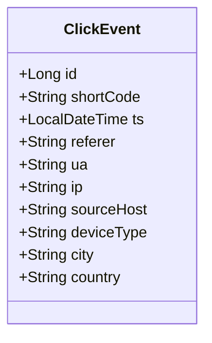
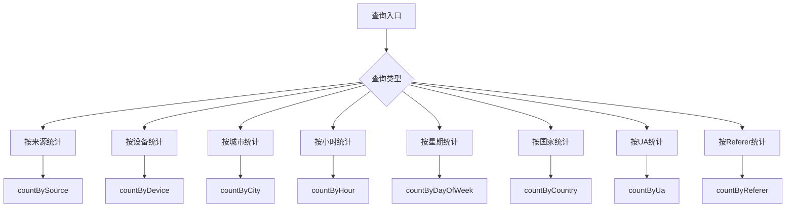
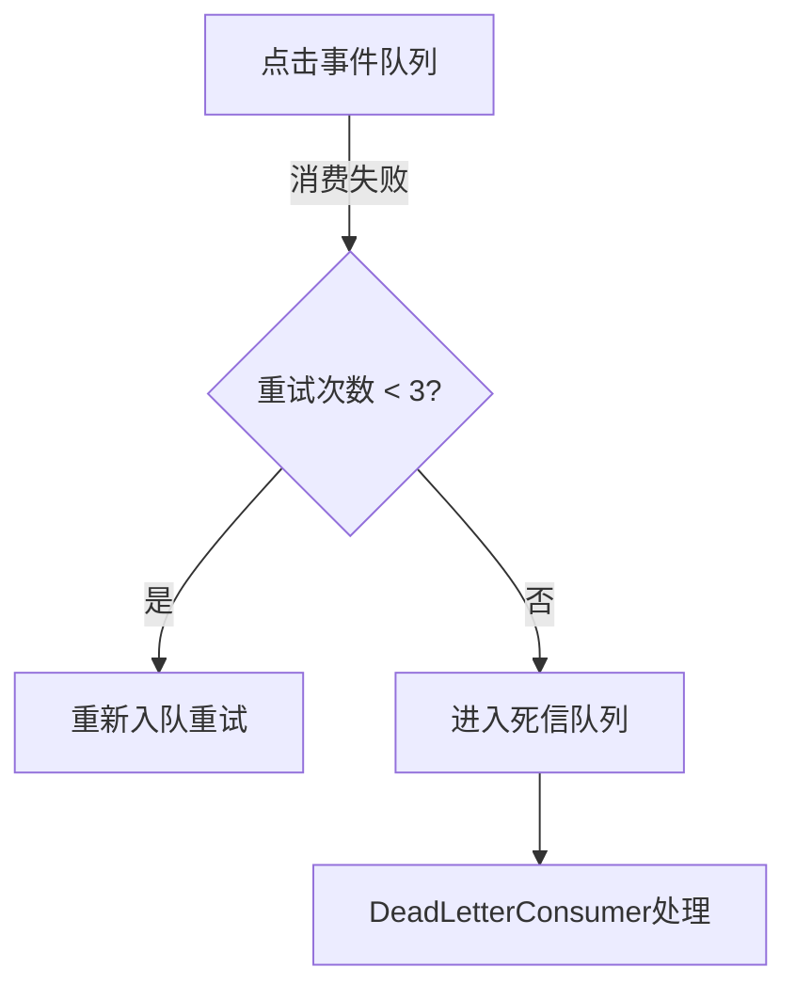
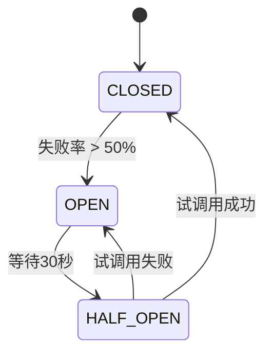
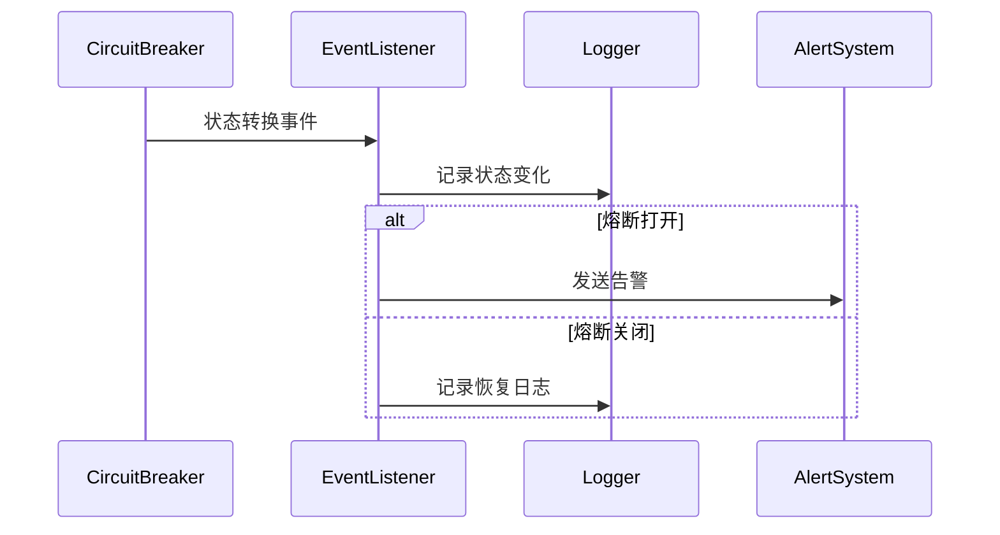

# 异步统计流程

<cite>
**本文档引用文件**  
- [ClickEvent.java](file://src/main/java/com/layor/tinyflow/entity/ClickEvent.java)
- [ClickMessage.java](file://src/main/java/com/layor/tinyflow/entity/ClickMessage.java)
- [ClickRecorderService.java](file://src/main/java/com/layor/tinyflow/service/ClickRecorderService.java)
- [ClickMessageConsumer.java](file://src/main/java/com/layor/tinyflow/service/ClickMessageConsumer.java)
- [DeadLetterConsumer.java](file://src/main/java/com/layor/tinyflow/service/DeadLetterConsumer.java)
- [ClickEventRepository.java](file://src/main/java/com/layor/tinyflow/repository/ClickEventRepository.java)
- [RabbitMQConfig.java](file://src/main/java/com/layor/tinyflow/config/RabbitMQConfig.java)
- [CircuitBreakerEventListener.java](file://src/main/java/com/layor/tinyflow/listener/CircuitBreakerEventListener.java)
- [ShortUrlService.java](file://src/main/java/com/layor/tinyflow/service/ShortUrlService.java)
- [application.yml](file://src/main/resources/application.yml)
</cite>

## 目录
1. [简介](#简介)
2. [异步统计流程架构](#异步统计流程架构)
3. [核心组件分析](#核心组件分析)
4. [ClickEvent实体与数据库设计](#clickevent实体与数据库设计)
5. [消息可靠性保障机制](#消息可靠性保障机制)
6. [服务韧性与熔断降级](#服务韧性与熔断降级)
7. [性能调优建议](#性能调优建议)
8. [总结](#总结)

## 简介
本项目通过异步统计流程实现短链接点击事件的高效处理。当用户访问短链接时，系统将点击事件封装为消息发送至RabbitMQ消息队列，由消费者服务异步处理并持久化到MySQL数据库。该设计实现了请求处理与统计记录的解耦，提升了系统吞吐量和响应速度。整个流程包含消息发布、消费、批量处理、异常重试、死信处理和熔断降级等完整机制，确保了统计链路的高可靠性和服务韧性。

## 异步统计流程架构


**图示来源**  
- [ClickRecorderService.java](file://src/main/java/com/layor/tinyflow/service/ClickRecorderService.java#L68-L76)
- [ClickMessageConsumer.java](file://src/main/java/com/layor/tinyflow/service/ClickMessageConsumer.java#L47-L87)
- [RabbitMQConfig.java](file://src/main/java/com/layor/tinyflow/config/RabbitMQConfig.java)

## 核心组件分析

### 消息实体与传输
系统定义了`ClickMessage`作为RabbitMQ消息传输的载体，包含短链接码、时间戳和日期三个核心字段。该实体实现了`Serializable`接口，确保可在网络中序列化传输。



**类图来源**  
- [ClickMessage.java](file://src/main/java/com/layor/tinyflow/entity/ClickMessage.java)

### 消息生产与消费
当用户点击短链接时，`ShortUrlController`调用`ShortUrlService`的`redirectCode`方法进行重定向，同时触发点击统计。`ClickRecorderService`负责将点击事件封装为`ClickMessage`并发送至RabbitMQ队列。

消息消费者`ClickMessageConsumer`采用手动ACK确认模式，确保消息处理成功后再确认。消费者使用本地缓冲区累积消息，当达到100条或定时器触发（每2秒）时，批量更新数据库。



**流程图来源**  
- [ClickRecorderService.java](file://src/main/java/com/layor/tinyflow/service/ClickRecorderService.java#L68-L76)
- [ClickMessageConsumer.java](file://src/main/java/com/layor/tinyflow/service/ClickMessageConsumer.java#L47-L87)

**本节来源**  
- [ClickRecorderService.java](file://src/main/java/com/layor/tinyflow/service/ClickRecorderService.java)
- [ClickMessageConsumer.java](file://src/main/java/com/layor/tinyflow/service/ClickMessageConsumer.java)

## ClickEvent实体与数据库设计
`ClickEvent`实体用于存储详细的点击事件信息，包含IP、UA、来源、设备类型等丰富属性，支持多维度统计分析。



**类图来源**  
- [ClickEvent.java](file://src/main/java/com/layor/tinyflow/entity/ClickEvent.java#L8-L48)

### 数据库表设计
在MySQL中，`click_event`表设计如下：

| 字段名 | 类型 | 说明 |
|-------|------|------|
| id | BIGINT | 主键，自增 |
| short_code | VARCHAR(255) | 短链接码 |
| ts | DATETIME | 点击时间戳 |
| referer | TEXT | 来源页面 |
| ua | TEXT | 用户代理 |
| ip | VARCHAR(45) | IP地址 |
| source_host | VARCHAR(255) | 来源主机 |
| device_type | VARCHAR(50) | 设备类型 |
| city | VARCHAR(100) | 城市 |
| country | VARCHAR(100) | 国家 |

### 索引优化
表上创建了复合索引`idx_code_ts(short_code, ts)`，优化基于短码和时间范围的查询性能。该索引支持高效的按短链接码和时间区间查询点击事件。

### 自定义JPQL查询方法
`ClickEventRepository`提供了丰富的JPQL查询方法，支持多维度统计分析：



**流程图来源**  
- [ClickEventRepository.java](file://src/main/java/com/layor/tinyflow/repository/ClickEventRepository.java)

**本节来源**  
- [ClickEvent.java](file://src/main/java/com/layor/tinyflow/entity/ClickEvent.java)
- [ClickEventRepository.java](file://src/main/java/com/layor/tinyflow/repository/ClickEventRepository.java)

## 消息可靠性保障机制

### 手动ACK确认
消息消费者采用手动ACK模式，确保消息处理成功后再确认。这避免了自动ACK模式下消费者崩溃导致消息丢失的问题。

```java
// 手动确认消息
channel.basicAck(amqpMessage.getMessageProperties().getDeliveryTag(), false);
```

### 死信队列配置
系统配置了死信队列机制，当消息消费失败达到最大重试次数（3次）后，消息将被路由到死信队列。



**图示来源**  
- [RabbitMQConfig.java](file://src/main/java/com/layor/tinyflow/config/RabbitMQConfig.java#L70-L77)
- [ClickMessageConsumer.java](file://src/main/java/com/layor/tinyflow/service/ClickMessageConsumer.java#L79-L85)

### 重试策略
消费者实现指数退避重试策略，消息消费失败时重新入队，最多重试3次。重试次数通过检查消息头中的`x-death`字段获取。

```java
private int getRetryCount(Message message) {
    List<Map<String, ?>> xDeathHeader = (List<Map<String, ?>>) message.getMessageProperties()
        .getHeaders().get("x-death");
    // ...
}
```

### 熔断降级处理
系统通过Resilience4j实现熔断降级，当数据库或Redis出现故障时，自动切换到降级策略，保证核心功能可用。



**状态图来源**  
- [application.yml](file://src/main/resources/application.yml#L156-L189)

**本节来源**  
- [ClickMessageConsumer.java](file://src/main/java/com/layor/tinyflow/service/ClickMessageConsumer.java)
- [RabbitMQConfig.java](file://src/main/java/com/layor/tinyflow/config/RabbitMQConfig.java)
- [application.yml](file://src/main/resources/application.yml)

## 服务韧性与熔断降级

### CircuitBreakerEventListener监听
`CircuitBreakerEventListener`监听熔断器状态变化事件，当熔断器状态改变时记录日志并发送告警。



**序列图来源**  
- [CircuitBreakerEventListener.java](file://src/main/java/com/layor/tinyflow/listener/CircuitBreakerEventListener.java#L37-L57)

### 熔断器配置
系统配置了两个熔断器实例：

1. **redisBreaker**：针对Redis操作，基于计数的滑动窗口，100次调用内失败率超过50%则熔断
2. **dbBreaker**：针对数据库操作，基于时间的滑动窗口，60秒内失败率超过50%则熔断

熔断器配置支持自动半开状态转换，熔断打开后等待指定时间（30秒/60秒）自动进入半开状态进行试探。

**本节来源**  
- [CircuitBreakerEventListener.java](file://src/main/java/com/layor/tinyflow/listener/CircuitBreakerEventListener.java)
- [application.yml](file://src/main/resources/application.yml)

## 性能调优建议

### 批量插入优化
系统采用批量插入策略，`ClickEvent`消费者累积100条消息后批量写入数据库，显著减少数据库I/O操作。

```java
// 批量保存
clickEventRepository.saveAll(batch);
```

### 连接池配置
在`application.yml`中配置了HikariCP连接池参数：

- 最大连接数：100
- 最小空闲连接：20
- 连接超时：3秒
- 最大生命周期：30分钟

### 事务控制
批量写入操作使用`@Transactional`注解确保事务完整性，同时避免长时间持有事务锁。

### 缓存策略
系统采用多级缓存策略：
- L1：Caffeine本地缓存
- L2：Redis分布式缓存
- 启动时预热热点数据

### 消费者并发
RabbitMQ消费者配置并发数为4-8，预取数量为100，平衡了吞吐量和内存占用。

**本节来源**  
- [ClickRecorderService.java](file://src/main/java/com/layor/tinyflow/service/ClickRecorderService.java#L128-L157)
- [application.yml](file://src/main/resources/application.yml)

## 总结
本异步统计流程通过RabbitMQ实现了点击事件的异步处理，确保了高并发场景下的系统稳定性。通过手动ACK、死信队列、重试策略和熔断降级等多重机制，保障了消息的可靠传递和处理。`ClickEvent`实体设计支持丰富的统计分析需求，配合索引优化和批量插入，实现了高性能的数据持久化。系统整体架构体现了高可用、高可靠和高性能的设计原则，为短链接服务提供了坚实的统计基础。