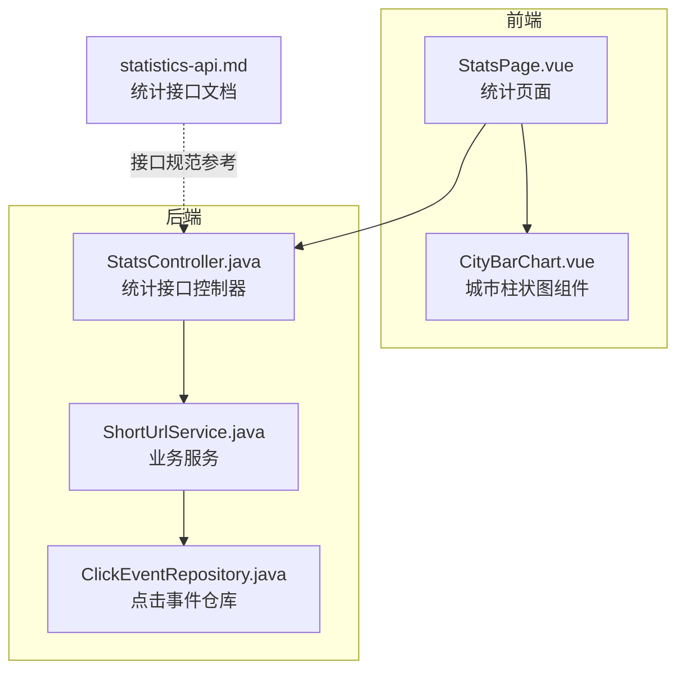
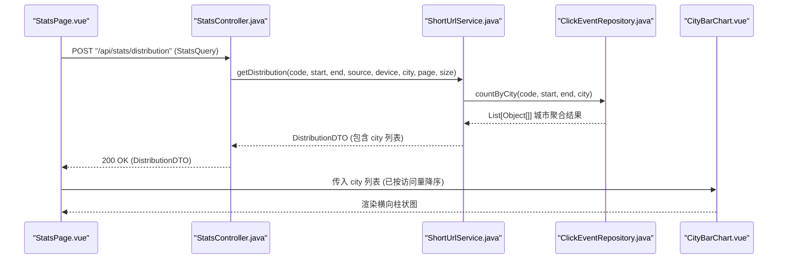
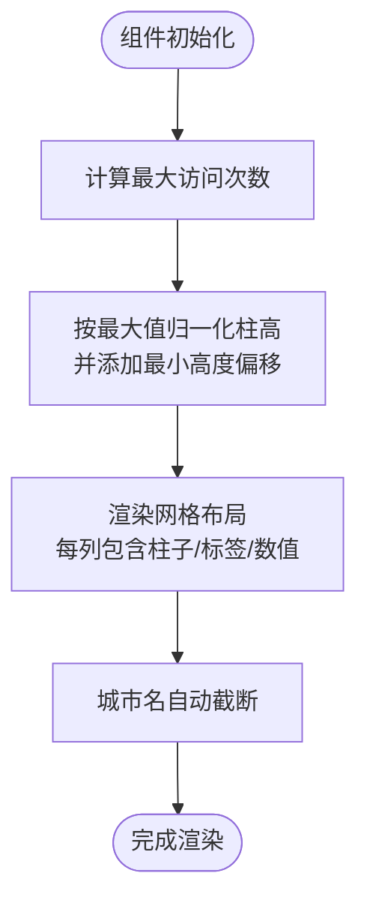
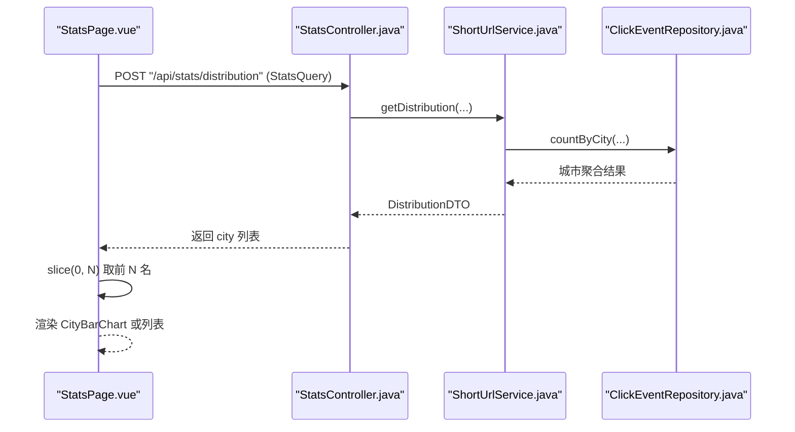
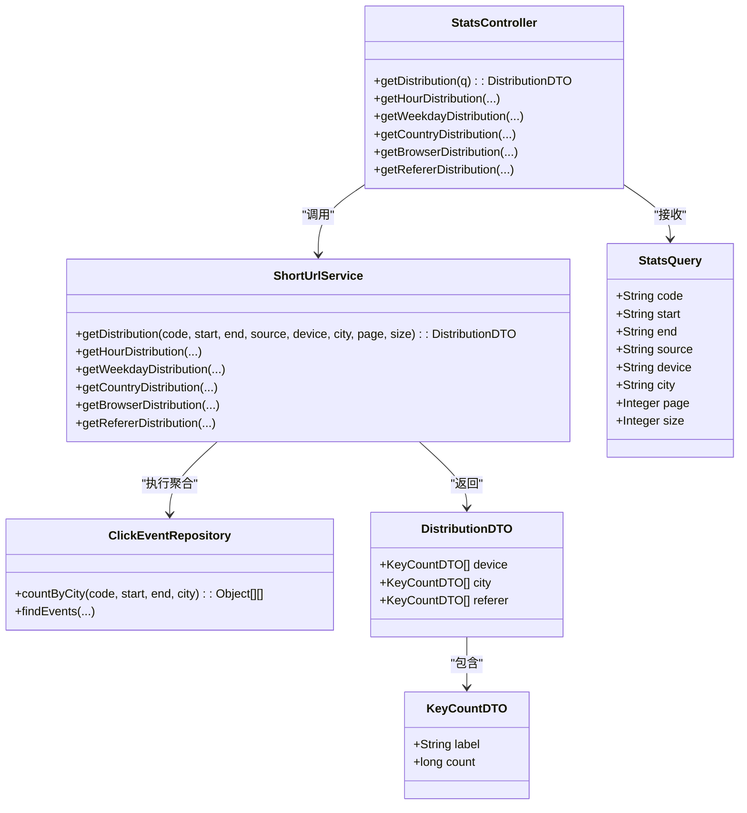
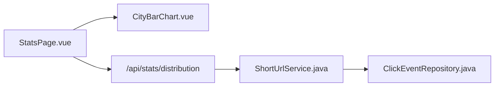

# 城市分布柱状图组件 (CityBarChart)

<cite>
**本文引用的文件**
- [CityBarChart.vue](file://web/src/components/charts/CityBarChart.vue)
- [StatsPage.vue](file://web/src/pages/StatsPage.vue)
- [StatsController.java](file://src/main/java/com/layor/tinyflow/Controller/StatsController.java)
- [ShortUrlService.java](file://src/main/java/com/layor/tinyflow/service/ShortUrlService.java)
- [ClickEventRepository.java](file://src/main/java/com/layor/tinyflow/repository/ClickEventRepository.java)
- [DistributionDTO.java](file://src/main/java/com/layor/tinyflow/entity/DistributionDTO.java)
- [KeyCountDTO.java](file://src/main/java/com/layor/tinyflow/entity/KeyCountDTO.java)
- [StatsQuery.java](file://src/main/java/com/layor/tinyflow/dto/StatsQuery.java)
- [statistics-api.md](file://web/docs/statistics-api.md)
</cite>

## 目录
1. [简介](#简介)
2. [项目结构](#项目结构)
3. [核心组件](#核心组件)
4. [架构总览](#架构总览)
5. [详细组件分析](#详细组件分析)
6. [依赖关系分析](#依赖关系分析)
7. [性能考量](#性能考量)
8. [故障排查指南](#故障排查指南)
9. [结论](#结论)
10. [附录](#附录)

## 简介
本文件系统性文档化 CityBarChart 组件的技术实现，重点覆盖以下方面：
- 横向柱状图布局与城市访问量排名展示
- 组件如何接收排序后的城市统计数据，并配置 Y 轴类目（城市名）与 X 轴数值（访问次数）
- 自动截断过长标签的策略
- 数据可视化中的性能优化措施（仅渲染前 N 个主要城市）
- 使用示例：从前端页面通过后端接口获取数据并渲染成响应式图表
- 坐标轴样式定制、颜色渐变应用及空数据提示的 UI 处理

## 项目结构
CityBarChart 是一个轻量级纯前端组件，采用 Vue 3 Composition API 与内联样式实现。它不依赖外部图表库，而是通过原生 HTML/CSS 实现横向柱状图布局，适合在统计页面中快速展示城市访问量排名。

图表来源
- [StatsPage.vue](file://web/src/pages/StatsPage.vue#L174-L202)
- [CityBarChart.vue](file://web/src/components/charts/CityBarChart.vue#L1-L21)
- [StatsController.java](file://src/main/java/com/layor/tinyflow/Controller/StatsController.java#L52-L57)
- [ShortUrlService.java](file://src/main/java/com/layor/tinyflow/service/ShortUrlService.java#L410-L426)
- [ClickEventRepository.java](file://src/main/java/com/layor/tinyflow/repository/ClickEventRepository.java#L27-L40)
- [statistics-api.md](file://web/docs/statistics-api.md#L95-L128)

章节来源
- [CityBarChart.vue](file://web/src/components/charts/CityBarChart.vue#L1-L21)
- [StatsPage.vue](file://web/src/pages/StatsPage.vue#L174-L202)

## 核心组件
- CityBarChart.vue：接收城市统计数据数组，按访问量生成横向柱状图，自动截断过长城市名标签，按最大值归一化柱高。
- StatsPage.vue：统计页面，负责从后端拉取分布数据并切片展示前 N 名（例如城市 TOP 10），同时演示了空数据提示与 UI 样式。
- 后端接口：StatsController 提供 /api/stats/distribution 接口，ShortUrlService 调用 ClickEventRepository 执行按城市聚合统计，返回 DistributionDTO。

章节来源
- [CityBarChart.vue](file://web/src/components/charts/CityBarChart.vue#L1-L21)
- [StatsPage.vue](file://web/src/pages/StatsPage.vue#L174-L202)
- [StatsController.java](file://src/main/java/com/layor/tinyflow/Controller/StatsController.java#L52-L57)
- [ShortUrlService.java](file://src/main/java/com/layor/tinyflow/service/ShortUrlService.java#L410-L426)
- [ClickEventRepository.java](file://src/main/java/com/layor/tinyflow/repository/ClickEventRepository.java#L27-L40)
- [DistributionDTO.java](file://src/main/java/com/layor/tinyflow/entity/DistributionDTO.java#L1-L14)
- [KeyCountDTO.java](file://src/main/java/com/layor/tinyflow/entity/KeyCountDTO.java#L1-L11)
- [StatsQuery.java](file://src/main/java/com/layor/tinyflow/dto/StatsQuery.java#L1-L16)

## 架构总览
下图展示了从前端页面到后端接口的数据流与组件交互关系。

图表来源
- [StatsPage.vue](file://web/src/pages/StatsPage.vue#L388-L413)
- [StatsController.java](file://src/main/java/com/layor/tinyflow/Controller/StatsController.java#L52-L57)
- [ShortUrlService.java](file://src/main/java/com/layor/tinyflow/service/ShortUrlService.java#L410-L426)
- [ClickEventRepository.java](file://src/main/java/com/layor/tinyflow/repository/ClickEventRepository.java#L27-L40)
- [CityBarChart.vue](file://web/src/components/charts/CityBarChart.vue#L1-L21)

## 详细组件分析

### CityBarChart 组件实现要点
- 输入数据结构：接收一个数组，每个元素包含城市名与访问次数字段（组件内部使用 count 字段进行计算）。
- 横向柱状图布局：使用 CSS Grid 布局，每列展示一个城市的柱子、标签与数值。
- Y 轴类目与 X 轴数值：
  - Y 轴类目：城市名，使用文本截断策略保证可读性。
  - X 轴数值：访问次数，通过最大值归一化计算柱高，确保视觉比例一致。
- 自动截断过长标签：城市名文本使用截断样式，避免标签溢出影响布局。
- 颜色与样式：柱子背景色为浅色系，标签与数值采用语义化配色，整体风格与统计页面保持一致。
- 空数据提示：组件本身未内置空数据提示，可在父组件中根据数据长度显示“暂无数据”。

图表来源
- [CityBarChart.vue](file://web/src/components/charts/CityBarChart.vue#L1-L21)

章节来源
- [CityBarChart.vue](file://web/src/components/charts/CityBarChart.vue#L1-L21)

### 数据获取与页面集成
- 页面通过 StatsController 的 /api/stats/distribution 接口获取分布数据，解析 city 字段为城市访问量列表。
- 页面对城市列表进行切片（例如取前 10），避免图表拥挤，提升可读性与性能。
- 空数据场景：当 city 列表为空时，页面显示“暂无数据”提示。

图表来源
- [StatsPage.vue](file://web/src/pages/StatsPage.vue#L388-L413)
- [StatsController.java](file://src/main/java/com/layor/tinyflow/Controller/StatsController.java#L52-L57)
- [ShortUrlService.java](file://src/main/java/com/layor/tinyflow/service/ShortUrlService.java#L410-L426)
- [ClickEventRepository.java](file://src/main/java/com/layor/tinyflow/repository/ClickEventRepository.java#L27-L40)

章节来源
- [StatsPage.vue](file://web/src/pages/StatsPage.vue#L388-L413)
- [StatsPage.vue](file://web/src/pages/StatsPage.vue#L174-L202)

### 后端聚合逻辑
- 接口：StatsController 提供 /api/stats/distribution，接收 StatsQuery，返回 DistributionDTO。
- 业务：ShortUrlService 调用 ClickEventRepository.countByCity，按城市分组并统计访问次数，返回 KeyCountDTO 列表。
- 数据模型：KeyCountDTO 定义 label 与 count；DistributionDTO 包含 device、city、referer 三类分布。

图表来源
- [StatsController.java](file://src/main/java/com/layor/tinyflow/Controller/StatsController.java#L52-L57)
- [ShortUrlService.java](file://src/main/java/com/layor/tinyflow/service/ShortUrlService.java#L410-L426)
- [ClickEventRepository.java](file://src/main/java/com/layor/tinyflow/repository/ClickEventRepository.java#L27-L40)
- [DistributionDTO.java](file://src/main/java/com/layor/tinyflow/entity/DistributionDTO.java#L1-L14)
- [KeyCountDTO.java](file://src/main/java/com/layor/tinyflow/entity/KeyCountDTO.java#L1-L11)
- [StatsQuery.java](file://src/main/java/com/layor/tinyflow/dto/StatsQuery.java#L1-L16)

章节来源
- [StatsController.java](file://src/main/java/com/layor/tinyflow/Controller/StatsController.java#L52-L57)
- [ShortUrlService.java](file://src/main/java/com/layor/tinyflow/service/ShortUrlService.java#L410-L426)
- [ClickEventRepository.java](file://src/main/java/com/layor/tinyflow/repository/ClickEventRepository.java#L27-L40)
- [DistributionDTO.java](file://src/main/java/com/layor/tinyflow/entity/DistributionDTO.java#L1-L14)
- [KeyCountDTO.java](file://src/main/java/com/layor/tinyflow/entity/KeyCountDTO.java#L1-L11)
- [StatsQuery.java](file://src/main/java/com/layor/tinyflow/dto/StatsQuery.java#L1-L16)

## 依赖关系分析
- 组件耦合度低：CityBarChart 仅依赖传入的 data 数组，不直接依赖后端接口或服务层，便于复用。
- 数据来源：StatsPage.vue 作为容器组件，负责数据获取与切片，再将数据传递给 CityBarChart。
- 后端依赖：StatsController 依赖 ShortUrlService，后者依赖 ClickEventRepository 执行数据库聚合。

图表来源
- [StatsPage.vue](file://web/src/pages/StatsPage.vue#L388-L413)
- [CityBarChart.vue](file://web/src/components/charts/CityBarChart.vue#L1-L21)
- [StatsController.java](file://src/main/java/com/layor/tinyflow/Controller/StatsController.java#L52-L57)
- [ShortUrlService.java](file://src/main/java/com/layor/tinyflow/service/ShortUrlService.java#L410-L426)
- [ClickEventRepository.java](file://src/main/java/com/layor/tinyflow/repository/ClickEventRepository.java#L27-L40)

章节来源
- [StatsPage.vue](file://web/src/pages/StatsPage.vue#L388-L413)
- [CityBarChart.vue](file://web/src/components/charts/CityBarChart.vue#L1-L21)
- [StatsController.java](file://src/main/java/com/layor/tinyflow/Controller/StatsController.java#L52-L57)
- [ShortUrlService.java](file://src/main/java/com/layor/tinyflow/service/ShortUrlService.java#L410-L426)
- [ClickEventRepository.java](file://src/main/java/com/layor/tinyflow/repository/ClickEventRepository.java#L27-L40)

## 性能考量
- 仅渲染前 N 个城市：页面通过切片方式限制渲染数量，避免大量节点导致的布局与绘制开销。
- 归一化柱高：基于最大值进行比例缩放，减少极端值对视觉比例的影响，同时避免过高的柱子造成布局失衡。
- 无外部图表库：纯 DOM + CSS 实现，减少第三方依赖带来的包体积与运行时开销。
- 响应式布局：使用 CSS Grid 与内联样式，适配不同屏幕尺寸，降低复杂度。

章节来源
- [StatsPage.vue](file://web/src/pages/StatsPage.vue#L174-L202)
- [CityBarChart.vue](file://web/src/components/charts/CityBarChart.vue#L1-L21)

## 故障排查指南
- 数据为空：检查后端接口是否正确返回 city 列表；确认前端解析逻辑是否将后端字段映射为组件期望的结构。
- 标签溢出：若城市名过长，建议在上游数据层进行截断或在组件层增加更严格的截断策略。
- 颜色与样式问题：组件使用浅色背景，若与主题冲突，可在父组件中注入样式或通过作用域样式覆盖。
- 接口错误：确认请求体格式与后端 StatsQuery 字段一致，避免因字段缺失导致聚合异常。

章节来源
- [StatsController.java](file://src/main/java/com/layor/tinyflow/Controller/StatsController.java#L52-L57)
- [StatsPage.vue](file://web/src/pages/StatsPage.vue#L388-L413)
- [statistics-api.md](file://web/docs/statistics-api.md#L95-L128)

## 结论
CityBarChart 通过简洁的布局与归一化算法，实现了城市访问量的横向柱状图展示。配合页面侧的切片策略与空数据提示，能够在保证性能的同时提供清晰的可视化效果。该组件设计低耦合、易复用，适合在多种统计场景中使用。

## 附录

### 使用示例：从前端获取数据并渲染
- 步骤概览
  1) 在页面中发起 POST 请求到 /api/stats/distribution，携带 StatsQuery。
  2) 后端返回 DistributionDTO，其中包含 city 列表。
  3) 页面将 city 列表按访问量降序排列并切片（例如取前 N 名）。
  4) 将切片后的数据传入 CityBarChart 渲染横向柱状图。
- 关键点
  - 数据结构：组件期望数组元素包含 count 字段用于柱高计算；城市名字段在组件中使用 city 进行展示。
  - 空数据提示：可在父组件中根据数据长度显示“暂无数据”。
  - 接口规范：参考 statistics-api.md 中的分布接口定义。

章节来源
- [StatsPage.vue](file://web/src/pages/StatsPage.vue#L388-L413)
- [StatsController.java](file://src/main/java/com/layor/tinyflow/Controller/StatsController.java#L52-L57)
- [statistics-api.md](file://web/docs/statistics-api.md#L95-L128)