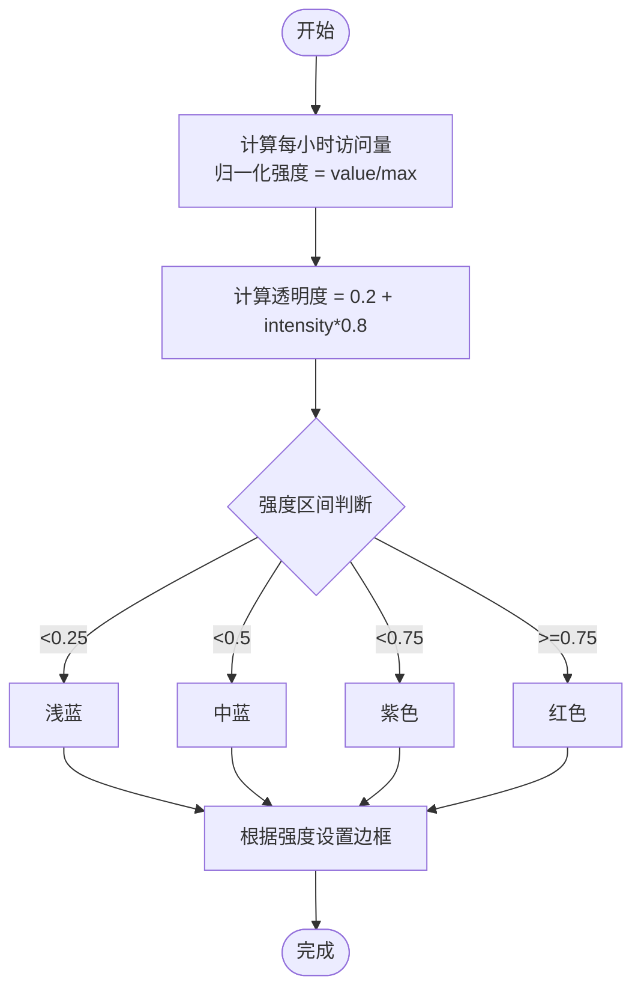

# 小时热度图组件 (HeatmapChart)

<cite>
**本文引用的文件**
- [HeatmapChart.vue](file://web/src/components/charts/HeatmapChart.vue)
- [StatsPage.vue](file://web/src/pages/StatsPage.vue)
- [useStats.js](file://web/src/composables/useStats.js)
- [DailyVisitTrendDTO.java](file://src/main/java/com/layor/tinyflow/entity/DailyVisitTrendDTO.java)
- [TrendChart.vue](file://web/src/components/TrendChart.vue)
</cite>

## 目录
1. [简介](#简介)
2. [项目结构](#项目结构)
3. [核心组件](#核心组件)
4. [架构总览](#架构总览)
5. [详细组件分析](#详细组件分析)
6. [依赖关系分析](#依赖关系分析)
7. [性能考量](#性能考量)
8. [故障排查指南](#故障排查指南)
9. [结论](#结论)
10. [附录](#附录)

## 简介
本文件系统性文档化前端“小时热度图组件”（HeatmapChart），说明其如何以可视化方式呈现每日各小时的访问密度。尽管组件名称包含“Heatmap”，但当前实现并非基于 ECharts 的 heatmap 坐标系，而是通过纯 DOM + CSS 实现的栅格化热力单元格，用于突出每小时的访问量强度。文档同时解释数据结构、从后端 DTO 的转换路径、颜色梯度映射、坐标轴标签与工具提示的实现细节，并给出在趋势分析面板中的使用示例与响应式布局策略，以及大数据量下的性能优化建议。

## 项目结构
- 前端组件位于 web/src/components/charts/HeatmapChart.vue
- 趋势分析页面位于 web/src/pages/StatsPage.vue
- 统一数据获取组合式函数位于 web/src/composables/useStats.js
- 后端 DTO 类型定义位于 src/main/java/com/layor/tinyflow/entity/DailyVisitTrendDTO.java
- 对比参考：趋势折线图组件 TrendChart.vue

**图表来源**
- [HeatmapChart.vue](file://web/src/components/charts/HeatmapChart.vue#L1-L242)
- [StatsPage.vue](file://web/src/pages/StatsPage.vue#L1-L954)
- [useStats.js](file://web/src/composables/useStats.js#L1-L255)
- [DailyVisitTrendDTO.java](file://src/main/java/com/layor/tinyflow/entity/DailyVisitTrendDTO.java#L1-L10)
- [TrendChart.vue](file://web/src/components/TrendChart.vue#L1-L238)

**章节来源**
- [HeatmapChart.vue](file://web/src/components/charts/HeatmapChart.vue#L1-L242)
- [StatsPage.vue](file://web/src/pages/StatsPage.vue#L1-L954)
- [useStats.js](file://web/src/composables/useStats.js#L1-L255)
- [DailyVisitTrendDTO.java](file://src/main/java/com/layor/tinyflow/entity/DailyVisitTrendDTO.java#L1-L10)
- [TrendChart.vue](file://web/src/components/TrendChart.vue#L1-L238)

## 核心组件
- HeatmapChart.vue：以 24 小时为 X 轴、访问量为强度的栅格热力图，支持加载态与空态，内置颜色梯度映射与悬停样式。
- StatsPage.vue：趋势分析面板，负责拉取事件列表与分布数据，但未直接使用 HeatmapChart 进行“一周访问热力图”的展示（见后续章节）。
- useStats.js：封装通用的 API 请求与数据兼容逻辑，便于在页面中复用。
- TrendChart.vue：对比参考的 SVG 趋势图，展示如何在前端实现坐标轴、网格线、工具提示等。

**章节来源**
- [HeatmapChart.vue](file://web/src/components/charts/HeatmapChart.vue#L1-L242)
- [StatsPage.vue](file://web/src/pages/StatsPage.vue#L1-L954)
- [useStats.js](file://web/src/composables/useStats.js#L1-L255)
- [TrendChart.vue](file://web/src/components/TrendChart.vue#L1-L238)

## 架构总览
HeatmapChart 的职责是接收事件级数据，按小时聚合并渲染为热力栅格。它不依赖 ECharts 的 heatmap 坐标系，而是通过计算最大值、归一化强度、选择颜色区间与透明度，实现视觉化的密度映射。

**图表来源**
- [StatsPage.vue](file://web/src/pages/StatsPage.vue#L387-L473)
- [useStats.js](file://web/src/composables/useStats.js#L210-L238)
- [HeatmapChart.vue](file://web/src/components/charts/HeatmapChart.vue#L34-L101)

## 详细组件分析

### 数据结构与转换
- 后端 DTO：DailyVisitTrendDTO（字段 date、visits）。该 DTO 用于“每日访问趋势”场景，而非“小时维度”的二维热力图。
- 前端 HeatmapChart：期望接收事件级数据（包含时间戳字段 ts），按小时聚合为 24 个单元格的访问量数组。
- 转换流程：
  - 页面通过事件接口获取事件列表（含 ts 字段）
  - HeatmapChart 内部对事件按小时进行统计，形成 [hour, count] 的小时分布
  - 最大值用于归一化，决定颜色强度与边框样式

注意：仓库中未发现直接的“周维度（星期×小时）二维热力图”数据结构或后端接口。HeatmapChart 当前实现聚焦于“24小时分布”，而非“一周七天×24小时”的二维热力图。

**章节来源**
- [DailyVisitTrendDTO.java](file://src/main/java/com/layor/tinyflow/entity/DailyVisitTrendDTO.java#L1-L10)
- [StatsPage.vue](file://web/src/pages/StatsPage.vue#L387-L473)
- [HeatmapChart.vue](file://web/src/components/charts/HeatmapChart.vue#L45-L70)

### 颜色梯度映射（visualMap）
- 归一化：以当前小时分布的最大值作为基准，计算每个小时的强度。
- 透明度：最小 0.2，最大 1.0，随强度线性增加。
- 颜色区间：
  - 强度 < 0.25：浅蓝
  - 强度 < 0.5：中蓝
  - 强度 < 0.75：紫色
  - 强度 ≥ 0.75：红色
- 边框：当强度 > 0.5 时使用较深边框，否则使用浅色边框，增强对比。

**图表来源**
- [HeatmapChart.vue](file://web/src/components/charts/HeatmapChart.vue#L72-L101)

**章节来源**
- [HeatmapChart.vue](file://web/src/components/charts/HeatmapChart.vue#L72-L101)

### 坐标轴标签与布局
- X 轴标签：小时文本格式为 HH:00，按 0-23 顺序排列。
- Y 轴：HeatmapChart 当前未展示星期维度，因此不存在 Y 轴标签。
- 响应式布局：
  - 容器网格采用自适应列宽与间距，小屏下减小单元格尺寸与字体大小，保持可读性。
  - 使用媒体查询在窄屏下调整网格列数与字体尺寸。

**章节来源**
- [HeatmapChart.vue](file://web/src/components/charts/HeatmapChart.vue#L76-L101)
- [HeatmapChart.vue](file://web/src/components/charts/HeatmapChart.vue#L227-L241)

### 工具提示（tooltip）
- HeatmapChart 当前未实现悬浮提示。组件提供 hover 放大与阴影效果，但未展示具体数值或时间信息。
- 若需增强交互体验，可在 hover 时引入局部提示层，展示小时与对应访问量。

**章节来源**
- [HeatmapChart.vue](file://web/src/components/charts/HeatmapChart.vue#L190-L214)

### 在趋势分析面板中的使用示例
- StatsPage.vue 展示了事件列表与分布数据的获取与渲染，但并未直接使用 HeatmapChart 进行“一周访问热力图”。组件内部通过事件接口获取数据，HeatmapChart 会基于事件 ts 字段统计每小时访问量。
- 使用步骤（概念性流程）：
  1) 页面初始化时调用事件接口，获取事件列表。
  2) 将事件列表作为 props.data 传递给 HeatmapChart。
  3) HeatmapChart 自动计算每小时访问量并渲染热力栅格。
  4) 如需切换时间范围，可通过筛选器或组合式函数重新请求数据并刷新。

**图表来源**
- [StatsPage.vue](file://web/src/pages/StatsPage.vue#L428-L473)
- [useStats.js](file://web/src/composables/useStats.js#L210-L238)
- [HeatmapChart.vue](file://web/src/components/charts/HeatmapChart.vue#L34-L70)

**章节来源**
- [StatsPage.vue](file://web/src/pages/StatsPage.vue#L387-L473)
- [useStats.js](file://web/src/composables/useStats.js#L210-L238)
- [HeatmapChart.vue](file://web/src/components/charts/HeatmapChart.vue#L34-L70)

### 关于“一周访问热力图”的澄清
- 当前仓库未提供“星期×小时”的二维热力图数据结构或后端接口。
- HeatmapChart 的输入为事件级数据（按小时聚合），输出为 24 小时的热力栅格。
- 若需要“一周访问热力图”，需：
  - 后端提供二维数组数据（如 [dayOfWeek, hour, count]）
  - 前端扩展 HeatmapChart，支持 Y 轴星期标签与二维渲染
- 本仓库未实现上述能力，故不提供相应示例。

**章节来源**
- [HeatmapChart.vue](file://web/src/components/charts/HeatmapChart.vue#L45-L70)
- [DailyVisitTrendDTO.java](file://src/main/java/com/layor/tinyflow/entity/DailyVisitTrendDTO.java#L1-L10)

## 依赖关系分析
- HeatmapChart.vue 依赖：
  - props.data：事件数组（包含时间戳字段 ts）
  - props.loading：加载状态
- StatsPage.vue 依赖：
  - useStats.js 的事件接口封装
  - TrendChart.vue（对比参考）
- 后端 DTO：
  - DailyVisitTrendDTO：用于“每日访问趋势”，非“小时维度”二维热力图

**图表来源**
- [StatsPage.vue](file://web/src/pages/StatsPage.vue#L387-L473)
- [useStats.js](file://web/src/composables/useStats.js#L210-L238)
- [HeatmapChart.vue](file://web/src/components/charts/HeatmapChart.vue#L34-L70)
- [DailyVisitTrendDTO.java](file://src/main/java/com/layor/tinyflow/entity/DailyVisitTrendDTO.java#L1-L10)
- [TrendChart.vue](file://web/src/components/TrendChart.vue#L1-L238)

**章节来源**
- [StatsPage.vue](file://web/src/pages/StatsPage.vue#L387-L473)
- [useStats.js](file://web/src/composables/useStats.js#L210-L238)
- [HeatmapChart.vue](file://web/src/components/charts/HeatmapChart.vue#L34-L70)
- [DailyVisitTrendDTO.java](file://src/main/java/com/layor/tinyflow/entity/DailyVisitTrendDTO.java#L1-L10)
- [TrendChart.vue](file://web/src/components/TrendChart.vue#L1-L238)

## 性能考量
- 数据规模与渲染开销
  - HeatmapChart 对事件数组进行一次遍历统计，复杂度 O(n)，n 为事件数量。
  - 归一化与颜色映射为常数时间操作，整体开销与事件数量线性相关。
- DOM 与样式
  - 使用 CSS Grid 布局，单元格数量固定为 24，渲染成本较低。
  - hover 效果通过过渡与阴影实现，开销可控。
- 大数据量优化建议
  - 限制事件列表长度：通过筛选器减少请求的数据量。
  - 虚拟滚动：若未来扩展为更大规模的二维热力图，可考虑虚拟化渲染。
  - 防抖/节流：在频繁筛选或缩放时，对数据刷新进行节流。
  - 懒加载：仅在用户可见区域渲染，或延迟初始化图表。
  - 缓存：对已计算的最大值与强度进行缓存，避免重复计算。

[本节为通用性能指导，不直接分析特定文件]

## 故障排查指南
- 无数据或空白
  - 检查事件接口是否成功返回数据（查看网络面板与控制台错误）。
  - 确认事件对象包含有效的时间戳字段 ts。
- 颜色异常
  - 检查最大值计算是否为 0（此时会默认分母为 1，避免除零）。
  - 确认强度区间与颜色映射逻辑未被外部样式覆盖。
- 响应式问题
  - 检查媒体查询是否生效，确认容器宽度变化时网格列数与字体大小按预期调整。
- 交互缺失
  - HeatmapChart 当前未实现悬浮提示，如需展示具体数值，可扩展 hover 逻辑。

**章节来源**
- [HeatmapChart.vue](file://web/src/components/charts/HeatmapChart.vue#L15-L27)
- [HeatmapChart.vue](file://web/src/components/charts/HeatmapChart.vue#L72-L101)
- [StatsPage.vue](file://web/src/pages/StatsPage.vue#L428-L473)

## 结论
- HeatmapChart 当前实现聚焦于“24小时分布”的热力栅格，通过简单而高效的算法完成小时聚合与颜色映射。
- 仓库未提供“一周访问热力图”的二维数据结构与后端接口，因此无法直接展示星期×小时的二维热力图。
- 若需扩展为真正的二维热力图，需后端提供二维数组数据与前端组件扩展（坐标轴、颜色映射、工具提示）。
- 在大数据量场景下，建议通过筛选、缓存与懒加载等手段优化渲染性能。

[本节为总结性内容，不直接分析特定文件]

## 附录

### API 与数据兼容说明（参考）
- useStats.js 中的事件接口封装展示了如何处理后端返回的多种列表结构与字段差异，便于在页面中统一消费数据。

**章节来源**
- [useStats.js](file://web/src/composables/useStats.js#L210-L238)