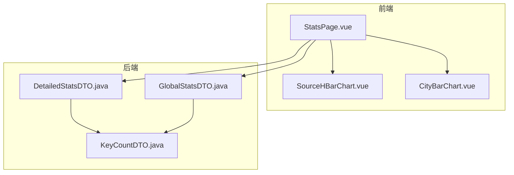
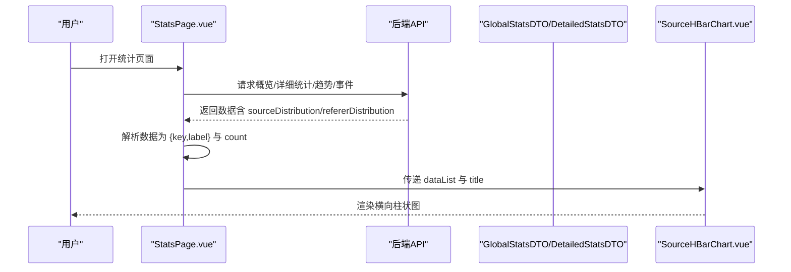
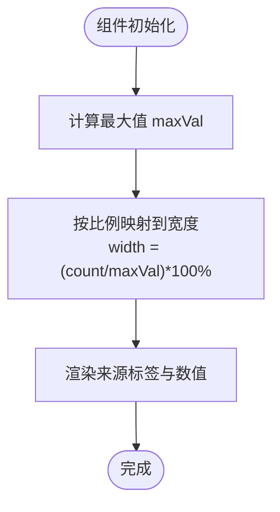
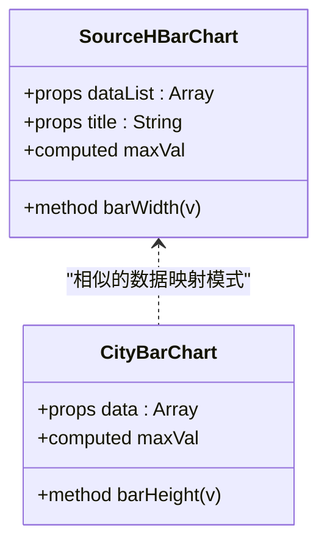
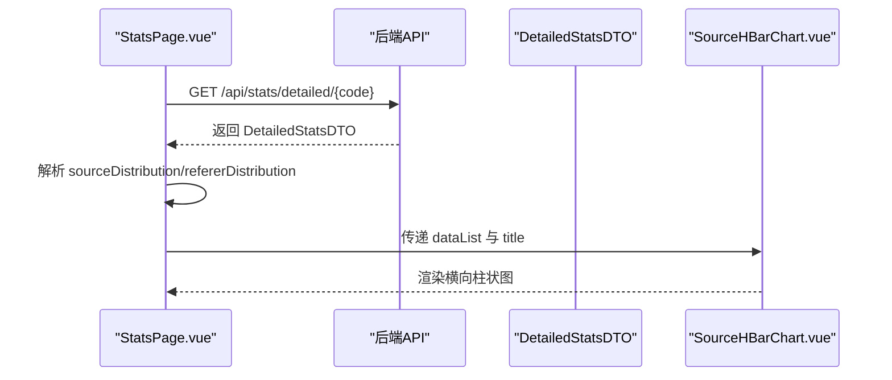
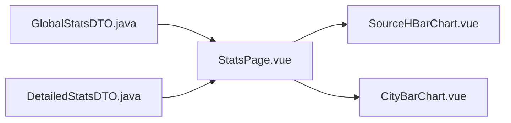

# 来源分布横向柱状图组件 (SourceHBarChart)

<cite>
**本文引用的文件**
- [SourceHBarChart.vue](file://web/src/components/charts/SourceHBarChart.vue)
- [CityBarChart.vue](file://web/src/components/charts/CityBarChart.vue)
- [StatsPage.vue](file://web/src/pages/StatsPage.vue)
- [useStats.js](file://web/src/composables/useStats.js)
- [GlobalStatsDTO.java](file://src/main/java/com/layor/tinyflow/entity/GlobalStatsDTO.java)
- [DetailedStatsDTO.java](file://src/main/java/com/layor/tinyflow/entity/DetailedStatsDTO.java)
- [KeyCountDTO.java](file://src/main/java/com/layor/tinyflow/entity/KeyCountDTO.java)
</cite>

## 目录
1. [简介](#简介)
2. [项目结构](#项目结构)
3. [核心组件](#核心组件)
4. [架构总览](#架构总览)
5. [详细组件分析](#详细组件分析)
6. [依赖关系分析](#依赖关系分析)
7. [性能考量](#性能考量)
8. [故障排查指南](#故障排查指南)
9. [结论](#结论)
10. [附录](#附录)

## 简介
本文件系统性地文档化 SourceHBarChart 组件，用于在统计页面中以横向柱状图的形式可视化“流量来源”（如搜索引擎、社交媒体等）的分布情况。文档重点说明：
- 与 CityBarChart 的共通设计模式与差异点（数据分类逻辑、标签位置调整）
- 组件 props 接口定义（dataList、title）
- 在 ECharts 中对反向 Y 轴排序的支持说明（本仓库未使用 ECharts 实现 SourceHBarChart，但提供 ECharts 配置思路）
- 数值标签在柱条末端的精确对齐实现（本仓库未使用 ECharts 实现 SourceHBarChart，但提供实现思路）
- 在统计页面集成该组件的实战代码路径（从 GlobalStatsDTO/ DetailedStatsDTO 提取来源数据）
- 动态数据更新与动画过渡效果的处理机制说明（本仓库未使用 ECharts 实现 SourceHBarChart，但提供实现思路）

## 项目结构
- 前端 Vue 组件位于 web/src/components/charts 下，包含 SourceHBarChart.vue、CityBarChart.vue 等
- 统计页面位于 web/src/pages/StatsPage.vue，负责拉取后端数据并渲染各类图表
- 后端 DTO 定义位于 src/main/java/com/layor/tinyflow/entity 下，包括 GlobalStatsDTO、DetailedStatsDTO、KeyCountDTO

**图表来源**
- [StatsPage.vue](file://web/src/pages/StatsPage.vue#L1-L120)
- [SourceHBarChart.vue](file://web/src/components/charts/SourceHBarChart.vue#L1-L23)
- [CityBarChart.vue](file://web/src/components/charts/CityBarChart.vue#L1-L21)
- [GlobalStatsDTO.java](file://src/main/java/com/layor/tinyflow/entity/GlobalStatsDTO.java#L1-L34)
- [DetailedStatsDTO.java](file://src/main/java/com/layor/tinyflow/entity/DetailedStatsDTO.java#L1-L43)
- [KeyCountDTO.java](file://src/main/java/com/layor/tinyflow/entity/KeyCountDTO.java#L1-L11)

**章节来源**
- [StatsPage.vue](file://web/src/pages/StatsPage.vue#L1-L120)
- [SourceHBarChart.vue](file://web/src/components/charts/SourceHBarChart.vue#L1-L23)
- [CityBarChart.vue](file://web/src/components/charts/CityBarChart.vue#L1-L21)
- [GlobalStatsDTO.java](file://src/main/java/com/layor/tinyflow/entity/GlobalStatsDTO.java#L1-L34)
- [DetailedStatsDTO.java](file://src/main/java/com/layor/tinyflow/entity/DetailedStatsDTO.java#L1-L43)
- [KeyCountDTO.java](file://src/main/java/com/layor/tinyflow/entity/KeyCountDTO.java#L1-L11)

## 核心组件
- SourceHBarChart.vue：以纯前端方式实现横向柱状图，基于 props.data 渲染，计算最大值并按比例设置宽度，支持标题（title）传入
- CityBarChart.vue：与 SourceHBarChart 类似的横向柱状图实现，但使用高度映射而非宽度映射，并在标签位置上采用网格布局

两者共同点：
- 均通过 props.data 接收数组，数组元素包含键值对（如 key/label 与 count）
- 均通过计算最大值来归一化映射到可视维度（宽度/高度）
- 均在模板中进行简单布局与样式控制

差异点：
- SourceHBarChart 使用宽度百分比映射，标签位于柱条右侧；CityBarChart 使用高度映射，标签位于柱条下方
- SourceHBarChart 支持 title 属性（当前实现未使用），CityBarChart 未显式声明 title

**章节来源**
- [SourceHBarChart.vue](file://web/src/components/charts/SourceHBarChart.vue#L1-L23)
- [CityBarChart.vue](file://web/src/components/charts/CityBarChart.vue#L1-L21)

## 架构总览
统计页面通过 API 拉取后端数据，解析为前端可用的分布数据结构，再将数据传递给各图表组件进行渲染。对于来源分布，统计页面会从后端 DTO 中提取 sourceDistribution 或 refererDistribution 字段，转换为组件可消费的数组格式。

**图表来源**
- [StatsPage.vue](file://web/src/pages/StatsPage.vue#L388-L413)
- [GlobalStatsDTO.java](file://src/main/java/com/layor/tinyflow/entity/GlobalStatsDTO.java#L23-L33)
- [DetailedStatsDTO.java](file://src/main/java/com/layor/tinyflow/entity/DetailedStatsDTO.java#L23-L41)
- [SourceHBarChart.vue](file://web/src/components/charts/SourceHBarChart.vue#L1-L23)

## 详细组件分析

### SourceHBarChart 组件分析
- 组件职责：接收数据数组，计算最大值，按比例映射到宽度，渲染每条来源的标签与数值
- props 接口：
  - dataList：数组，元素包含键值对（如 key/label 与 count）
  - title：字符串，用于显示图表标题（当前实现未使用）
- 数据分类逻辑：组件内部通过 Math.max 计算最大 count，再对每个条目按比例映射到百分比宽度
- 标签位置：来源名称与数值分别显示在柱条左侧与右侧，形成横向布局

**图表来源**
- [SourceHBarChart.vue](file://web/src/components/charts/SourceHBarChart.vue#L1-L23)

**章节来源**
- [SourceHBarChart.vue](file://web/src/components/charts/SourceHBarChart.vue#L1-L23)

### 与 CityBarChart 的共通设计模式与差异点
- 共同点：均通过 props.data 接收数据；均计算最大值并进行归一化映射；均在模板中进行基础布局
- 差异点：
  - 映射维度不同：SourceHBarChart 使用宽度映射，CityBarChart 使用高度映射
  - 标签位置不同：SourceHBarChart 标签在柱条右侧，CityBarChart 标签在柱条下方
  - 数据结构兼容：两者均兼容 key/label 与 count 的混合形态

**图表来源**
- [SourceHBarChart.vue](file://web/src/components/charts/SourceHBarChart.vue#L1-L23)
- [CityBarChart.vue](file://web/src/components/charts/CityBarChart.vue#L1-L21)

**章节来源**
- [SourceHBarChart.vue](file://web/src/components/charts/SourceHBarChart.vue#L1-L23)
- [CityBarChart.vue](file://web/src/components/charts/CityBarChart.vue#L1-L21)

### ECharts 配置中的反向 Y 轴排序支持（概念性说明）
- 本仓库未使用 ECharts 实现 SourceHBarChart，但若采用 ECharts，可通过以下方式实现反向 Y 轴排序与数值标签对齐：
  - 反向 Y 轴：在坐标轴配置中设置 inverse 为 true，使数值从高到低排列
  - 数值标签对齐：在系列配置中启用 label 的 show 与 position（如 'right'），并结合 formatter 控制文本内容
  - 动画过渡：通过 animationDuration、animationEasing 等参数控制入场/更新动画
- 注意：以上为通用 ECharts 配置建议，非本仓库实际实现

[本节为概念性说明，不对应具体源码文件]

### 数值标签在柱条末端的精确对齐（概念性说明）
- 在横向柱状图中，确保数值标签与柱条末端精确对齐的关键在于：
  - 使用坐标轴的 offset 或 label 的 x/y 偏移，使文本锚点与柱条末端对齐
  - 结合 formatter 输出固定宽度的数值文本，避免宽度抖动
  - 对于 ECharts，可使用 series.label 的 distance 与 align 控制位置
- 注意：以上为通用实现建议，非本仓库实际实现

[本节为概念性说明，不对应具体源码文件]

### 在统计页面集成 SourceHBarChart 的实战代码路径
- 从后端 DTO 提取来源数据：
  - GlobalStatsDTO：包含 sourceTop10 字段，适合展示来源 Top10
  - DetailedStatsDTO：包含 sourceDistribution 与 refererDistribution 字段，适合展示来源域名分布与 Referer 详情
- 统计页面解析逻辑：
  - 通过 API 返回的 sourceDistribution 或 refererDistribution，将其映射为 { key/label, count } 形式的数组
  - 将数组作为 dataList 传递给 SourceHBarChart
- 关键路径参考：
  - 数据解析与传递：[StatsPage.vue](file://web/src/pages/StatsPage.vue#L404-L411)
  - DTO 字段定义：[GlobalStatsDTO.java](file://src/main/java/com/layor/tinyflow/entity/GlobalStatsDTO.java#L23-L33)，[DetailedStatsDTO.java](file://src/main/java/com/layor/tinyflow/entity/DetailedStatsDTO.java#L23-L41)

**图表来源**
- [StatsPage.vue](file://web/src/pages/StatsPage.vue#L388-L413)
- [DetailedStatsDTO.java](file://src/main/java/com/layor/tinyflow/entity/DetailedStatsDTO.java#L23-L41)
- [SourceHBarChart.vue](file://web/src/components/charts/SourceHBarChart.vue#L1-L23)

**章节来源**
- [StatsPage.vue](file://web/src/pages/StatsPage.vue#L388-L413)
- [GlobalStatsDTO.java](file://src/main/java/com/layor/tinyflow/entity/GlobalStatsDTO.java#L23-L33)
- [DetailedStatsDTO.java](file://src/main/java/com/layor/tinyflow/entity/DetailedStatsDTO.java#L23-L41)

### 动态数据更新与动画过渡效果（概念性说明）
- 动态数据更新：
  - 当筛选条件变化或定时刷新时，统计页面重新拉取数据并更新组件的 dataList
  - 组件内部通过计算属性重新计算 maxVal 并更新映射
- 动画过渡：
  - 若采用 ECharts，可通过 animationDuration、animationEasing 控制更新动画
  - 若采用纯前端实现（如本仓库），可在宽度/高度变更时添加过渡样式（transition），以平滑显示更新
- 注意：以上为通用实现建议，非本仓库实际实现

[本节为概念性说明，不对应具体源码文件]

## 依赖关系分析
- 组件依赖：
  - SourceHBarChart 依赖 props.data 的结构（key/label 与 count）
  - StatsPage 依赖后端 DTO 字段（sourceTop10、sourceDistribution、refererDistribution）
- 数据流向：
  - 后端 DTO -> StatsPage 解析 -> SourceHBarChart 渲染

**图表来源**
- [GlobalStatsDTO.java](file://src/main/java/com/layor/tinyflow/entity/GlobalStatsDTO.java#L23-L33)
- [DetailedStatsDTO.java](file://src/main/java/com/layor/tinyflow/entity/DetailedStatsDTO.java#L23-L41)
- [StatsPage.vue](file://web/src/pages/StatsPage.vue#L388-L413)
- [SourceHBarChart.vue](file://web/src/components/charts/SourceHBarChart.vue#L1-L23)
- [CityBarChart.vue](file://web/src/components/charts/CityBarChart.vue#L1-L21)

**章节来源**
- [GlobalStatsDTO.java](file://src/main/java/com/layor/tinyflow/entity/GlobalStatsDTO.java#L23-L33)
- [DetailedStatsDTO.java](file://src/main/java/com/layor/tinyflow/entity/DetailedStatsDTO.java#L23-L41)
- [StatsPage.vue](file://web/src/pages/StatsPage.vue#L388-L413)
- [SourceHBarChart.vue](file://web/src/components/charts/SourceHBarChart.vue#L1-L23)
- [CityBarChart.vue](file://web/src/components/charts/CityBarChart.vue#L1-L21)

## 性能考量
- 数据归一化计算：maxVal 与映射函数在每次数据更新时重新计算，复杂度 O(n)
- DOM 更新：纯前端实现通过响应式绑定更新宽度/高度，避免重绘开销
- 建议：
  - 对大数据集，可考虑虚拟滚动或分页展示
  - 减少不必要的重排与重绘，保持样式计算最小化

[本节为通用指导，不对应具体源码文件]

## 故障排查指南
- 数据为空或未显示：
  - 检查后端返回字段是否正确映射为 { key/label, count }
  - 确认 dataList 是否传入且非空
- 标签错位：
  - 确认容器布局与文本对齐方式（如右对齐）
- 动画缺失：
  - 若采用纯前端实现，检查是否添加了过渡样式
  - 若采用 ECharts，检查动画参数配置

[本节为通用指导，不对应具体源码文件]

## 结论
- SourceHBarChart 采用简洁的纯前端实现，通过归一化映射与响应式更新，快速展示来源分布
- 与 CityBarChart 具有相似的设计模式，但在映射维度与标签位置上存在差异
- 本仓库未使用 ECharts 实现 SourceHBarChart，但提供了 ECharts 配置与实现思路供扩展参考
- 在统计页面中，通过 StatsPage 对后端 DTO 的解析与传递，即可完成来源分布的可视化集成

[本节为总结性内容，不对应具体源码文件]

## 附录
- 关键实现路径参考：
  - [SourceHBarChart.vue](file://web/src/components/charts/SourceHBarChart.vue#L1-L23)
  - [CityBarChart.vue](file://web/src/components/charts/CityBarChart.vue#L1-L21)
  - [StatsPage.vue](file://web/src/pages/StatsPage.vue#L388-L413)
  - [GlobalStatsDTO.java](file://src/main/java/com/layor/tinyflow/entity/GlobalStatsDTO.java#L23-L33)
  - [DetailedStatsDTO.java](file://src/main/java/com/layor/tinyflow/entity/DetailedStatsDTO.java#L23-L41)
  - [KeyCountDTO.java](file://src/main/java/com/layor/tinyflow/entity/KeyCountDTO.java#L1-L11)

[本节为补充说明，不对应具体源码文件]