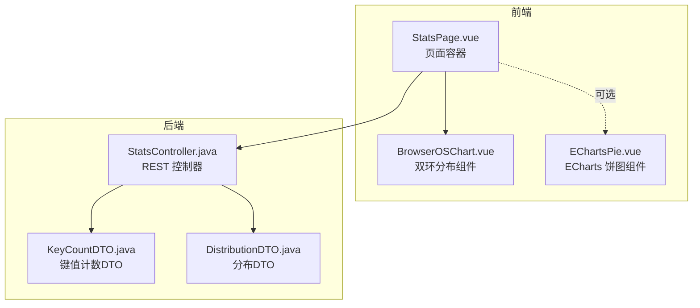
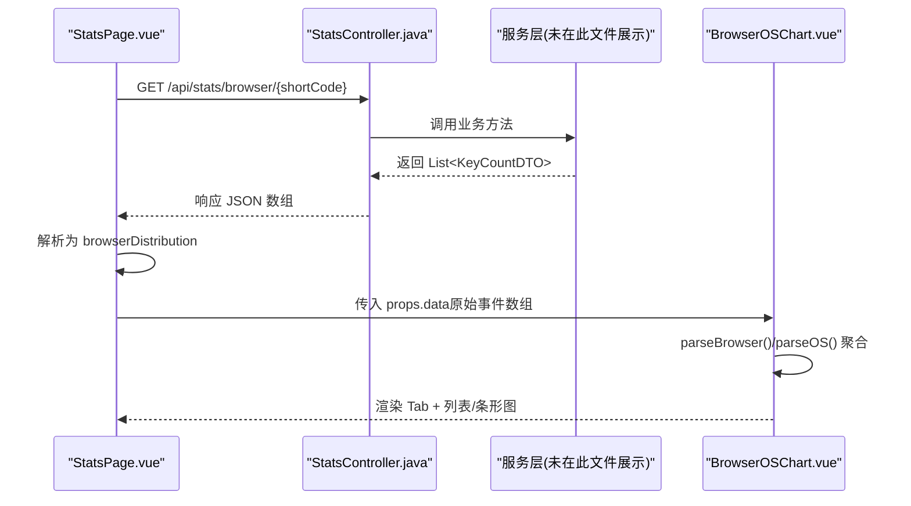
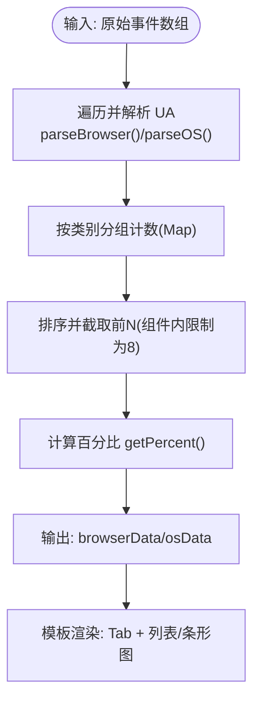
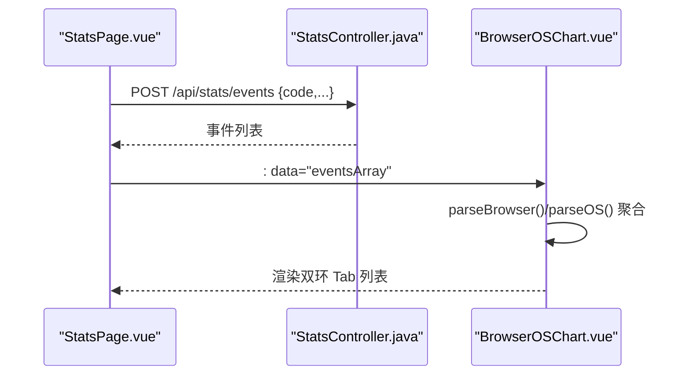
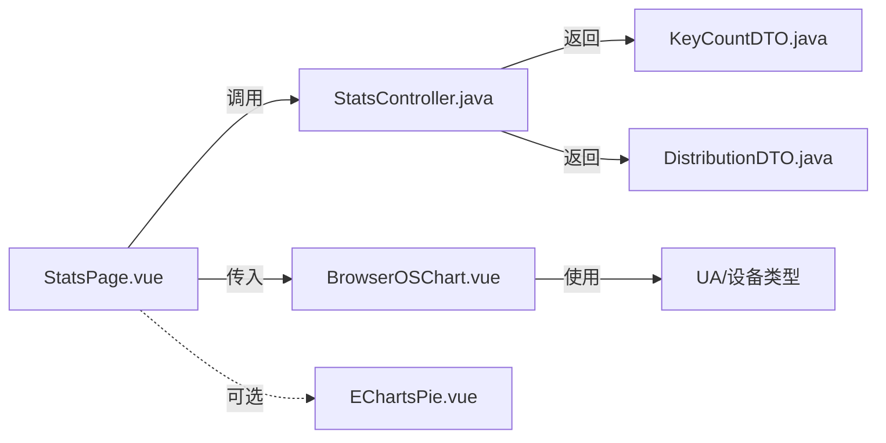

# 浏览器与操作系统分布图组件 (BrowserOSChart)

<cite>
**本文引用的文件**
- [BrowserOSChart.vue](file://web/src/components/charts/BrowserOSChart.vue)
- [StatsPage.vue](file://web/src/pages/StatsPage.vue)
- [StatsController.java](file://src/main/java/com/layor/tinyflow/Controller/StatsController.java)
- [KeyCountDTO.java](file://src/main/java/com/layor/tinyflow/entity/KeyCountDTO.java)
- [DistributionDTO.java](file://src/main/java/com/layor/tinyflow/entity/DistributionDTO.java)
- [EChartsPie.vue](file://web/src/components/charts/EChartsPie.vue)
</cite>

## 目录
1. [简介](#简介)
2. [项目结构](#项目结构)
3. [核心组件](#核心组件)
4. [架构总览](#架构总览)
5. [详细组件分析](#详细组件分析)
6. [依赖关系分析](#依赖关系分析)
7. [性能考量](#性能考量)
8. [故障排查指南](#故障排查指南)
9. [结论](#结论)
10. [附录](#附录)

## 简介
本文件面向前端与后端开发者，系统性说明 BrowserOSChart 组件如何实现“浏览器与操作系统市场份额”的双环分布展示。该组件采用双环设计：
- 内环：操作系统分布（Windows、macOS、Linux、Android、iOS 等）
- 外环：浏览器分布（Chrome、Safari、Firefox、Edge、Opera、IE 等）

组件通过用户代理字符串（UA）解析，将原始事件数据聚合为两类维度的占比，并提供 Tab 切换、图标与渐变色映射、百分比计算与空态提示等能力。同时，文档给出在 StatsPage 中绑定后端 UrlDistributionDTO 数据的完整示例，以及颜色映射、加载状态、错误处理与交互反馈的实现要点。

## 项目结构
BrowserOSChart 位于前端 web 层的 charts 组件目录，StatsPage 作为页面容器负责拉取后端数据并传入组件。

图表来源
- [BrowserOSChart.vue](file://web/src/components/charts/BrowserOSChart.vue#L1-L181)
- [StatsPage.vue](file://web/src/pages/StatsPage.vue#L1-L200)
- [StatsController.java](file://src/main/java/com/layor/tinyflow/Controller/StatsController.java#L1-L180)
- [KeyCountDTO.java](file://src/main/java/com/layor/tinyflow/entity/KeyCountDTO.java#L1-L11)
- [DistributionDTO.java](file://src/main/java/com/layor/tinyflow/entity/DistributionDTO.java#L1-L14)

章节来源
- file://web/src/components/charts/BrowserOSChart.vue#L1-L181
- file://web/src/pages/StatsPage.vue#L1-L200
- file://src/main/java/com/layor/tinyflow/Controller/StatsController.java#L1-L180
- file://src/main/java/com/layor/tinyflow/entity/KeyCountDTO.java#L1-L11
- file://src/main/java/com/layor/tinyflow/entity/DistributionDTO.java#L1-L14

## 核心组件
- BrowserOSChart.vue
  - 功能：基于传入的原始事件数组 data，解析 UA 并聚合为浏览器与操作系统两类分布，支持 Tab 切换与可视化列表展示。
  - 关键点：parseBrowser、parseOS、getBrowserColor、getOSColor、getPercent、tabs、activeTab。
- StatsPage.vue
  - 功能：页面容器，负责调用后端接口，解析并组装分布数据（hour、weekday、device、browser、city、country、source、referer），并将 browserDistribution 传给页面内的浏览器分布卡片。
  - 注意：当前页面中浏览器分布卡片使用的是纯列表渲染，而非 BrowserOSChart 组件；若要使用 BrowserOSChart，需在页面中引入并传入 data。
- StatsController.java
  - 功能：提供 /api/stats/browser/{shortCode} 等接口，返回浏览器分布 KeyCountDTO 列表；另有 /api/stats/distribution 返回 DistributionDTO（包含 device、city、referer 等）。
- KeyCountDTO.java / DistributionDTO.java
  - 数据模型：label、count；以及包含多类分布集合的 DTO。

章节来源
- file://web/src/components/charts/BrowserOSChart.vue#L65-L181
- file://web/src/pages/StatsPage.vue#L150-L175
- file://src/main/java/com/layor/tinyflow/Controller/StatsController.java#L132-L142
- file://src/main/java/com/layor/tinyflow/entity/KeyCountDTO.java#L1-L11
- file://src/main/java/com/layor/tinyflow/entity/DistributionDTO.java#L1-L14

## 架构总览
BrowserOSChart 的数据流与控制流如下：

图表来源
- [StatsPage.vue](file://web/src/pages/StatsPage.vue#L388-L413)
- [StatsController.java](file://src/main/java/com/layor/tinyflow/Controller/StatsController.java#L132-L142)
- [BrowserOSChart.vue](file://web/src/components/charts/BrowserOSChart.vue#L82-L129)

## 详细组件分析

### BrowserOSChart 组件分析
- 双环设计结构
  - 内环：操作系统分布（osData）
  - 外环：浏览器分布（browserData）
  - 通过 activeTab 切换，分别渲染对应的数据列表与条形进度。
- 数据聚合逻辑
  - 输入：props.data（原始事件数组，每个元素包含 UA 或 deviceType 字段）
  - 聚合步骤：
    1) 遍历 data，调用 parseBrowser/parseOS 解析 UA，得到类别名
    2) 使用 Map 统计每类出现次数
    3) 转为数组并排序，取前 N 类（组件内部限制为前 8）
    4) 计算每类占总数的百分比
  - 输出：browserData、osData 两个数组，供模板渲染。
- ECharts 配置项说明（组件未使用 ECharts）
  - 当前组件未使用 ECharts，而是采用纯 DOM 列表与条形图展示。若需要环形/饼图，可参考 EChartsPie.vue 的 series、legend、label 配置思路：
    - series：type='pie'，radius=['40%','70%']，label 显示百分比与数值
    - legend：右侧垂直布局，formatter 显示名称与数值
    - label：默认隐藏，emphasis 时显示大字号
    - color：自定义颜色数组
  - 若要在 BrowserOSChart 中集成环形图，建议：
    - 保留现有 parseBrowser/parseOS 逻辑，输出两组 series 数据
    - series[0] 对应操作系统，series[1] 对应浏览器
    - legend 与 label 配置同 EChartsPie.vue
- Props 定义
  - data: Array，默认 []，用于传入原始事件数组
- 数据预处理流程
  - parseBrowser/parseOS：基于 UA 字符串匹配关键词，归类到 Chrome、Safari、Firefox、Edge、Opera、IE、Windows、macOS、Linux、Android、iOS 等；其余归为“其他”
  - getPercent：计算百分比并保留一位小数
  - getBrowserIcon/getOSIcon：为每类分配图标
  - getBrowserColor/getOSColor：为每类分配渐变色背景
- 加载状态、空态与交互
  - 空态：当某类数据为空时显示“暂无数据”提示
  - 交互：Tab 切换、条形图宽度过渡动画、列表项 hover 效果
- 颜色映射与可读性
  - 为浏览器与操作系统分别提供品牌色系的渐变色，提升识别度与一致性

图表来源
- [BrowserOSChart.vue](file://web/src/components/charts/BrowserOSChart.vue#L82-L129)
- [BrowserOSChart.vue](file://web/src/components/charts/BrowserOSChart.vue#L177-L181)

章节来源
- file://web/src/components/charts/BrowserOSChart.vue#L65-L181

### StatsPage 中绑定后端 UrlDistributionDTO 数据的完整示例
- 后端接口
  - GET /api/stats/browser/{shortCode}：返回浏览器分布 KeyCountDTO 列表
  - POST /api/stats/distribution：返回 DistributionDTO（包含 device、city、referer 等）
- 页面数据解析
  - 在 StatsPage.vue 的 fetchDetailedStats 中，将后端返回的各分布数组映射为 {key, count} 结构，赋值到 browserDistribution 等 ref。
- 绑定 BrowserOSChart 的方式
  - 若希望使用 BrowserOSChart 的双环展示，需传入原始事件数组（而非浏览器分布结果），即：
    - 在 StatsPage.vue 中，调用 /api/stats/events 接口获取事件列表（包含 UA 或 deviceType 字段）
    - 将事件数组作为 props.data 传给 BrowserOSChart
  - 若仍使用页面内浏览器分布卡片，则保持现有逻辑不变。

图表来源
- [StatsPage.vue](file://web/src/pages/StatsPage.vue#L428-L434)
- [StatsController.java](file://src/main/java/com/layor/tinyflow/Controller/StatsController.java#L65-L70)
- [BrowserOSChart.vue](file://web/src/components/charts/BrowserOSChart.vue#L82-L129)

章节来源
- file://web/src/pages/StatsPage.vue#L388-L413
- file://web/src/pages/StatsPage.vue#L428-L434
- file://src/main/java/com/layor/tinyflow/Controller/StatsController.java#L65-L70

### ECharts 配置项（对比参考）
- series
  - type: 'pie'
  - radius: ['40%', '70%']（形成环形）
  - label: 默认隐藏，emphasis 时显示名称与数值
  - labelLine: 默认隐藏
  - itemStyle: 边框与圆角
- legend
  - orient: 'vertical'
  - right: 10
  - top: 'center'
  - formatter: 显示名称与数值
- tooltip
  - trigger: 'item'
  - formatter: 名称、数值、百分比
- color
  - 自定义颜色数组

章节来源
- file://web/src/components/charts/EChartsPie.vue#L26-L56

## 依赖关系分析
- 组件耦合
  - BrowserOSChart 依赖于传入的 data 数组，内部不直接依赖后端 API
  - StatsPage 通过 axios 调用后端接口，解析数据后传入组件
- 数据模型
  - KeyCountDTO：label、count
  - DistributionDTO：包含 device、city、referer 等分布列表
- 外部依赖
  - EChartsPie.vue：若采用环形图，需引入 ECharts 并按上述配置项构建 option

图表来源
- [BrowserOSChart.vue](file://web/src/components/charts/BrowserOSChart.vue#L65-L181)
- [StatsPage.vue](file://web/src/pages/StatsPage.vue#L388-L413)
- [StatsController.java](file://src/main/java/com/layor/tinyflow/Controller/StatsController.java#L132-L142)
- [KeyCountDTO.java](file://src/main/java/com/layor/tinyflow/entity/KeyCountDTO.java#L1-L11)
- [DistributionDTO.java](file://src/main/java/com/layor/tinyflow/entity/DistributionDTO.java#L1-L14)

章节来源
- file://web/src/components/charts/BrowserOSChart.vue#L65-L181
- file://web/src/pages/StatsPage.vue#L388-L413
- file://src/main/java/com/layor/tinyflow/Controller/StatsController.java#L132-L142
- file://src/main/java/com/layor/tinyflow/entity/KeyCountDTO.java#L1-L11
- file://src/main/java/com/layor/tinyflow/entity/DistributionDTO.java#L1-L14

## 性能考量
- 数据聚合复杂度
  - parseBrowser/parseOS：O(N)，N 为事件数量
  - Map 计数与排序：O(K log K)，K 为类别数（组件限制为前 8）
- 渲染优化
  - 使用 computed 缓存 browserData/osData，减少重复计算
  - 列表渲染使用 v-for + key，避免不必要的重排
- 图表渲染
  - 若采用 EChartsPie，建议在 mounted/watch 中按需初始化与更新，避免频繁重建实例
- 网络请求
  - StatsPage 中 Promise.all 并发拉取多个接口，减少等待时间

[本节为通用指导，无需特定文件来源]

## 故障排查指南
- 空数据与空态
  - 当某类数据为空时，组件会显示“暂无数据”，检查后端是否返回空数组或过滤逻辑是否正确
- UA 解析不准确
  - 若 UA 中包含 Edge 且同时包含 chrome 关键字，可能被识别为 Chrome；请根据实际需求调整 parseBrowser 的匹配优先级
- 颜色与图标不匹配
  - 确认 getBrowserColor/getOSColor 与 getBrowserIcon/getOSIcon 的键名一致
- 交互反馈
  - 列表项 hover 与条形图填充动画为默认行为；如需增强，可在组件中添加更多 hover 提示或过渡效果
- 错误处理
  - StatsPage 中对 API 请求使用 try/catch 打印错误日志；建议在组件中增加 loading/error 状态并在模板中展示

章节来源
- file://web/src/components/charts/BrowserOSChart.vue#L1-L63
- file://web/src/pages/StatsPage.vue#L388-L413

## 结论
BrowserOSChart 通过 UA 解析与聚合，实现了浏览器与操作系统双环分布的直观展示。组件具备良好的可读性与交互体验，适合在 StatsPage 中作为替代型图表使用。若需更丰富的交互与视觉效果，可参考 EChartsPie.vue 的配置思路，将组件升级为环形/饼图。在 StatsPage 中绑定后端数据时，建议优先使用 /api/stats/events 获取原始事件，再交由组件进行解析与聚合，从而获得更贴近真实来源的分布视图。

[本节为总结，无需特定文件来源]

## 附录

### Props 与数据模型速查
- BrowserOSChart.props
  - data: Array（原始事件数组）
- KeyCountDTO
  - label: string
  - count: number
- DistributionDTO
  - device: KeyCountDTO[]
  - city: KeyCountDTO[]
  - referer: KeyCountDTO[]

章节来源
- file://web/src/components/charts/BrowserOSChart.vue#L68-L73
- file://src/main/java/com/layor/tinyflow/entity/KeyCountDTO.java#L1-L11
- file://src/main/java/com/layor/tinyflow/entity/DistributionDTO.java#L1-L14