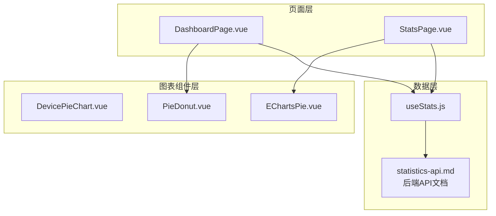
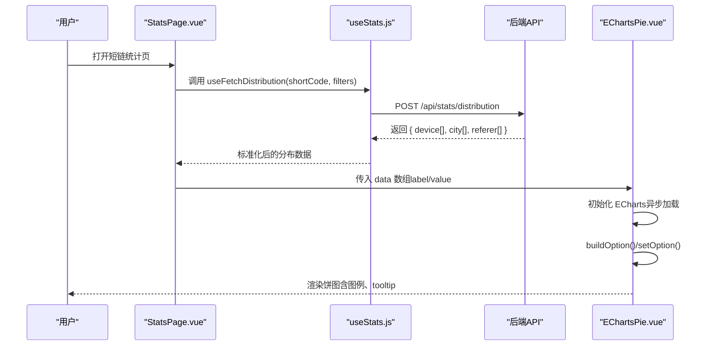
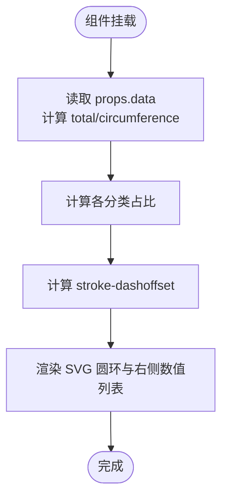
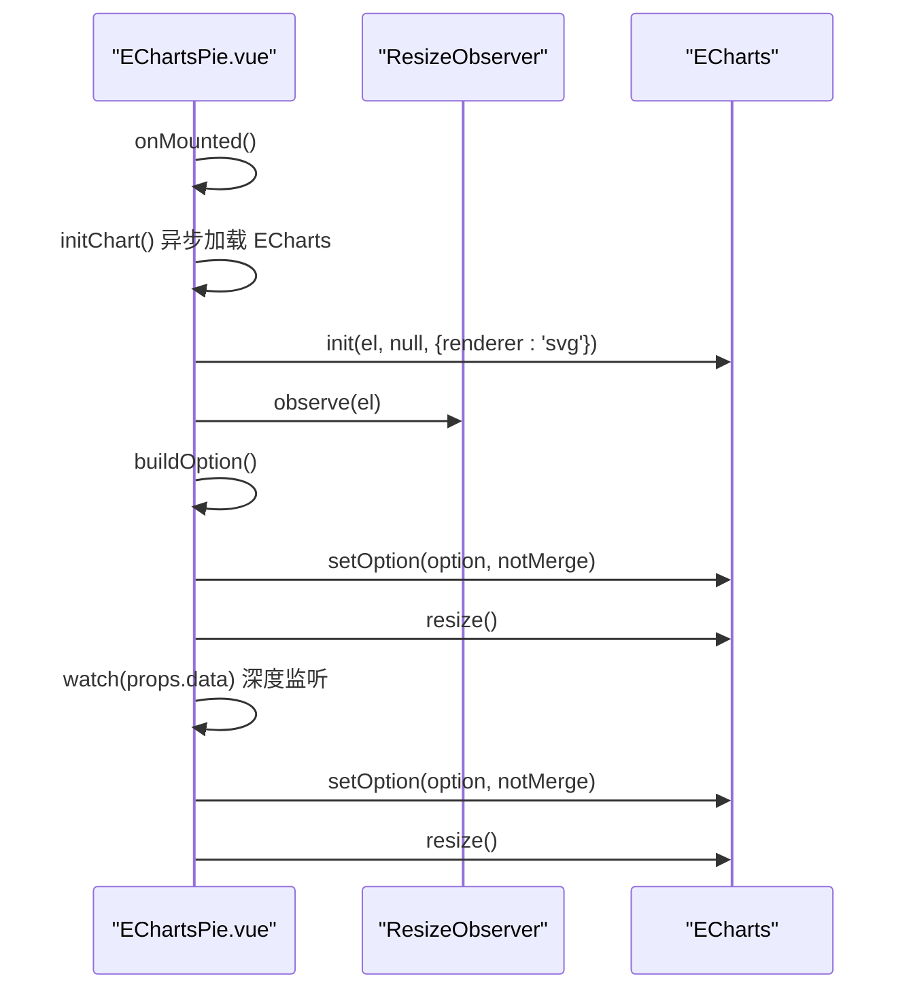
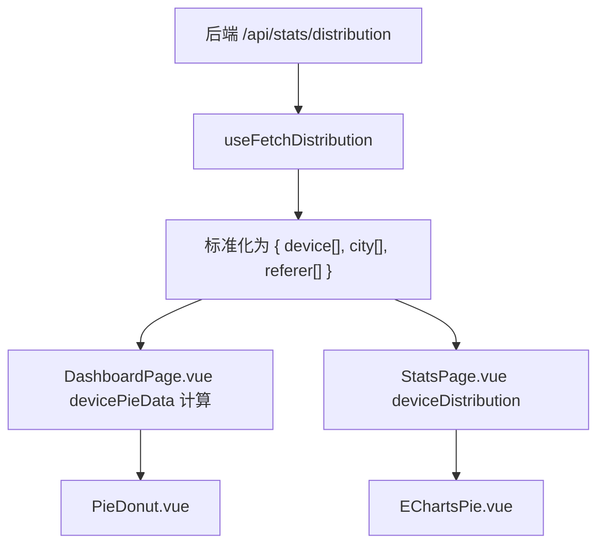
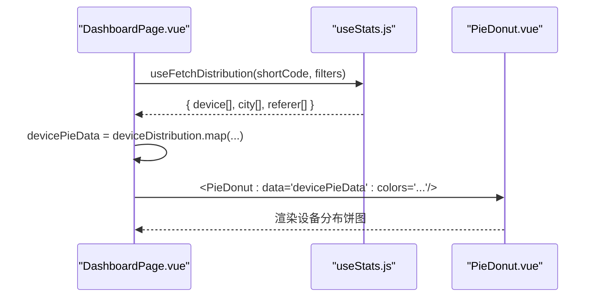
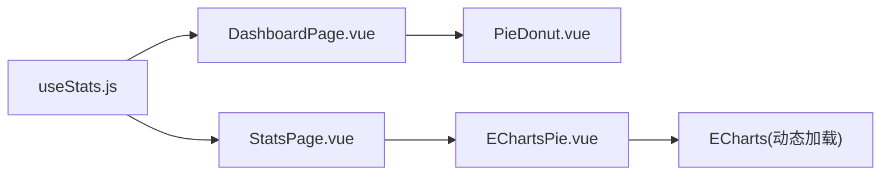

# 设备分布饼图组件 (DevicePieChart)

<cite>
**本文引用的文件**
- [DevicePieChart.vue](file://web/src/components/charts/DevicePieChart.vue)
- [EChartsPie.vue](file://web/src/components/charts/EChartsPie.vue)
- [PieDonut.vue](file://web/src/components/charts/PieDonut.vue)
- [useStats.js](file://web/src/composables/useStats.js)
- [DashboardPage.vue](file://web/src/pages/DashboardPage.vue)
- [StatsPage.vue](file://web/src/pages/StatsPage.vue)
- [router/index.js](file://web/src/router/index.js)
- [statistics-api.md](file://web/docs/statistics-api.md)
</cite>

## 目录
1. [简介](#简介)
2. [项目结构](#项目结构)
3. [核心组件](#核心组件)
4. [架构总览](#架构总览)
5. [详细组件分析](#详细组件分析)
6. [依赖关系分析](#依赖关系分析)
7. [性能考虑](#性能考虑)
8. [故障排查指南](#故障排查指南)
9. [结论](#结论)
10. [附录](#附录)

## 简介
本文件面向“设备分布饼图组件”的实现进行深入文档化，重点覆盖以下方面：
- 组件职责与数据形态：如何接收并呈现用户设备类型（移动端、桌面端、平板等）的分布比例。
- 数据格式转换逻辑：从后端返回的分布数据到组件可消费的结构之间的映射与兼容。
- 主题与配色：颜色主题配置与标签映射。
- 交互行为：图例点击隐藏系列的行为说明与实现依据。
- 在统计面板中的动态加载与使用示例：如何在仪表盘与详情页中动态拉取并展示设备分布。
- 与 useStats.composables 的集成方式：如何通过组合式函数获取分布数据。
- 响应式设计与小屏适配策略：组件尺寸、布局与交互在不同屏幕下的表现。
- 性能优化建议：大数据量下的渲染降级与优化思路。

## 项目结构
本项目前端采用 Vue 3 + Vite 构建，图表组件位于 web/src/components/charts 下，页面组件位于 web/src/pages 下，数据获取通过 web/src/composables/useStats.js 提供的组合式函数完成。

**图表来源**
- [DashboardPage.vue](file://web/src/pages/DashboardPage.vue#L38-L69)
- [StatsPage.vue](file://web/src/pages/StatsPage.vue#L1-L200)
- [DevicePieChart.vue](file://web/src/components/charts/DevicePieChart.vue#L1-L55)
- [EChartsPie.vue](file://web/src/components/charts/EChartsPie.vue#L1-L126)
- [PieDonut.vue](file://web/src/components/charts/PieDonut.vue#L1-L89)
- [useStats.js](file://web/src/composables/useStats.js#L119-L142)
- [statistics-api.md](file://web/docs/statistics-api.md#L95-L185)

**章节来源**
- [DashboardPage.vue](file://web/src/pages/DashboardPage.vue#L38-L69)
- [StatsPage.vue](file://web/src/pages/StatsPage.vue#L1-L200)
- [DevicePieChart.vue](file://web/src/components/charts/DevicePieChart.vue#L1-L55)
- [EChartsPie.vue](file://web/src/components/charts/EChartsPie.vue#L1-L126)
- [PieDonut.vue](file://web/src/components/charts/PieDonut.vue#L1-L89)
- [useStats.js](file://web/src/composables/useStats.js#L119-L142)
- [statistics-api.md](file://web/docs/statistics-api.md#L95-L185)

## 核心组件
- DevicePieChart.vue：基于 SVG 的纯前端饼图组件，接收对象型数据，计算百分比并绘制环形进度条与右侧数值列表。
- EChartsPie.vue：基于 ECharts 的通用饼图组件，支持动态初始化、ResizeObserver 自适应、图例格式化与交互。
- PieDonut.vue：基于 SVG 的环形扇形饼图组件，支持悬停高亮、百分比显示与右侧列表。
- useStats.js：提供 useFetchDistribution 等组合式函数，用于从后端拉取分布数据并标准化为前端可用结构。
- DashboardPage.vue / StatsPage.vue：页面容器，负责调用 useStats 并将数据传递给图表组件。

**章节来源**
- [DevicePieChart.vue](file://web/src/components/charts/DevicePieChart.vue#L1-L55)
- [EChartsPie.vue](file://web/src/components/charts/EChartsPie.vue#L1-L126)
- [PieDonut.vue](file://web/src/components/charts/PieDonut.vue#L1-L89)
- [useStats.js](file://web/src/composables/useStats.js#L119-L142)
- [DashboardPage.vue](file://web/src/pages/DashboardPage.vue#L38-L69)
- [StatsPage.vue](file://web/src/pages/StatsPage.vue#L1-L200)

## 架构总览
设备分布数据从后端 API 返回，经 useStats.js 的 useFetchDistribution 标准化后，分别在仪表盘与详情页中以不同形式展示：
- 仪表盘：使用 PieDonut（SVG 饼图）展示设备分布。
- 详情页：使用 EChartsPie（ECharts 饼图）展示设备分布。

**图表来源**
- [StatsPage.vue](file://web/src/pages/StatsPage.vue#L388-L413)
- [useStats.js](file://web/src/composables/useStats.js#L119-L142)
- [EChartsPie.vue](file://web/src/components/charts/EChartsPie.vue#L26-L56)
- [statistics-api.md](file://web/docs/statistics-api.md#L95-L185)

## 详细组件分析

### DevicePieChart 组件分析
- 数据输入：接收一个对象型 props，包含 ios/android/pc 三类计数，默认值为全零对象。
- 计算逻辑：计算总数、圆周长、各分类占比，并据此计算 stroke-dashoffset，从而绘制环形进度条。
- 视觉呈现：左侧 SVG 圆环按类别绘制，右侧显示类别标签与数值；整体旋转以统一起始角度。
- 主题与配色：内置颜色映射（iOS、Android、PC），标签映射（iOS、Android、PC）。

**图表来源**
- [DevicePieChart.vue](file://web/src/components/charts/DevicePieChart.vue#L28-L55)

**章节来源**
- [DevicePieChart.vue](file://web/src/components/charts/DevicePieChart.vue#L1-L55)

### EChartsPie 组件分析
- 初始化流程：异步加载 ECharts 模块，等待容器尺寸有效后初始化图表实例，注册 ResizeObserver 实现自适应。
- 数据构建：过滤无效值，标准化为 [{label, value}] 结构，计算总和与百分比映射。
- 选项配置：启用 tooltip、图例、标题（无数据时显示）、系列半径、标签与强调态等。
- 交互能力：图例 formatter 支持显示名称与数值；Series 支持强调态显示大字号标签。
- 生命周期：mounted 时初始化并更新；watch props.data 深度监听变化后重新 setOption。

**图表来源**
- [EChartsPie.vue](file://web/src/components/charts/EChartsPie.vue#L58-L105)

**章节来源**
- [EChartsPie.vue](file://web/src/components/charts/EChartsPie.vue#L1-L126)

### PieDonut 组件分析
- 数据输入：接收数组型 props，每个元素包含 label/value。
- 计算逻辑：计算总数、生成扇形路径（arcPath）、计算百分比、悬停索引与高亮颜色。
- 视觉呈现：中心显示“总点击”或当前项标签与数值，右侧列表显示每项的标签、数值与百分比。
- 交互能力：鼠标悬停在图例或扇形区域时切换 hoverItem，高亮对应颜色。

**章节来源**
- [PieDonut.vue](file://web/src/components/charts/PieDonut.vue#L1-L89)

### 数据格式转换与 useStats 集成
- 后端 API 文档定义了分布数据的返回结构，包含 device、city、referer 三个数组，每项为 {label, value}。
- useFetchDistribution 将后端返回的 data/result 包裹结构标准化为 { device[], city[], referer[] }，其中 device 数组即为前端饼图所需的数据源。
- 在仪表盘页面，DashboardPage.vue 将全局统计返回的 deviceDistribution 转换为 ECharts 饼图所需的 [{label,value}] 形态。
- 在详情页，StatsPage.vue 将 detailedStats 返回的 deviceDistribution 转换为 PieDonut 或 EChartsPie 的数据形态。

**图表来源**
- [useStats.js](file://web/src/composables/useStats.js#L119-L142)
- [statistics-api.md](file://web/docs/statistics-api.md#L95-L185)
- [DashboardPage.vue](file://web/src/pages/DashboardPage.vue#L241-L246)
- [StatsPage.vue](file://web/src/pages/StatsPage.vue#L395-L413)

**章节来源**
- [useStats.js](file://web/src/composables/useStats.js#L119-L142)
- [statistics-api.md](file://web/docs/statistics-api.md#L95-L185)
- [DashboardPage.vue](file://web/src/pages/DashboardPage.vue#L241-L246)
- [StatsPage.vue](file://web/src/pages/StatsPage.vue#L395-L413)

### 图例交互行为（点击隐藏系列）
- EChartsPie.vue 中通过 legend.formatter 可以在图例中显示名称与数值；Series.emphasis.label 可在强调态显示大字号标签。
- 图例默认交互（如点击隐藏系列）由 ECharts 内置行为控制，无需额外代码即可实现。
- 若需自定义图例交互，可在 buildOption 中扩展 legend 的相关配置（例如 formatter、selected 状态等）。

**章节来源**
- [EChartsPie.vue](file://web/src/components/charts/EChartsPie.vue#L36-L56)

### 在统计面板中动态加载设备统计数据的使用示例
- 仪表盘（DashboardPage.vue）：通过 useFetchDistribution 获取设备分布数据，再将 deviceDistribution 转换为 [{label,value}] 传给 PieDonut。
- 详情页（StatsPage.vue）：在 fetchDetailedStats 中解析 deviceDistribution，将其传给 EChartsPie 或 PieDonut。

**图表来源**
- [DashboardPage.vue](file://web/src/pages/DashboardPage.vue#L241-L246)
- [PieDonut.vue](file://web/src/components/charts/PieDonut.vue#L1-L89)
- [useStats.js](file://web/src/composables/useStats.js#L119-L142)

**章节来源**
- [DashboardPage.vue](file://web/src/pages/DashboardPage.vue#L241-L246)
- [PieDonut.vue](file://web/src/components/charts/PieDonut.vue#L1-L89)
- [useStats.js](file://web/src/composables/useStats.js#L119-L142)

### 响应式设计与小屏适配策略
- 容器尺寸：EChartsPie.vue 使用 ResizeObserver 监听容器尺寸变化并自动 resize，确保在窗口大小变化时保持正确渲染。
- 页面布局：DashboardPage.vue 与 StatsPage.vue 使用栅格布局与卡片容器，保证在小屏下内容仍可阅读与交互。
- 图表尺寸：EChartsPie.vue 容器高度固定为 280px，配合 ResizeObserver 适配不同宽度；PieDonut.vue 使用固定宽高（240x240）的 viewBox，适合在卡片内居中展示。
- DevicePieChart.vue：通过 props.size 控制 SVG 尺寸，右侧数值列表在小屏下仍可清晰显示。

**章节来源**
- [EChartsPie.vue](file://web/src/components/charts/EChartsPie.vue#L82-L105)
- [DashboardPage.vue](file://web/src/pages/DashboardPage.vue#L501-L511)
- [PieDonut.vue](file://web/src/components/charts/PieDonut.vue#L10-L29)
- [DevicePieChart.vue](file://web/src/components/charts/DevicePieChart.vue#L28-L34)

## 依赖关系分析
- 组件耦合：DevicePieChart 为纯展示组件，不依赖外部库；EChartsPie 依赖 ECharts 模块，运行时异步加载；PieDonut 为纯 SVG 组件。
- 数据流：useStats.js 作为数据层，向上游提供标准化的数据；页面层负责数据转换与传递。
- 外部依赖：EChartsPie.vue 通过 import('echarts') 动态加载，避免打包体积过大；DashboardPage.vue 与 StatsPage.vue 通过 Suspense 异步加载图表组件，提升首屏性能。

**图表来源**
- [useStats.js](file://web/src/composables/useStats.js#L119-L142)
- [DashboardPage.vue](file://web/src/pages/DashboardPage.vue#L213-L215)
- [StatsPage.vue](file://web/src/pages/StatsPage.vue#L315-L323)
- [PieDonut.vue](file://web/src/components/charts/PieDonut.vue#L1-L89)
- [EChartsPie.vue](file://web/src/components/charts/EChartsPie.vue#L72-L81)

**章节来源**
- [useStats.js](file://web/src/composables/useStats.js#L119-L142)
- [DashboardPage.vue](file://web/src/pages/DashboardPage.vue#L213-L215)
- [StatsPage.vue](file://web/src/pages/StatsPage.vue#L315-L323)
- [PieDonut.vue](file://web/src/components/charts/PieDonut.vue#L1-L89)
- [EChartsPie.vue](file://web/src/components/charts/EChartsPie.vue#L72-L81)

## 性能考虑
- 按需加载与懒编译：EChartsPie.vue 通过动态 import 加载 ECharts，避免在首屏引入重型依赖；DashboardPage.vue 与 StatsPage.vue 使用 defineAsyncComponent 与 Suspense 异步加载图表组件，减少初始包体。
- 渲染降级建议：
  - 当设备分布数据量较大时，优先使用 PieDonut（SVG）或 DevicePieChart（SVG）以降低内存占用。
  - 对于超大数据集，可考虑聚合小类（如将“平板”合并到“其他”）后再渲染。
  - 在 EChartsPie 中，可通过减少 series 数量、禁用不必要的动画与阴影来降低渲染成本。
- 尺寸与缩放：使用 ResizeObserver 自动 resize，避免手动触发导致的重复渲染。
- 数据过滤：在 EChartsPie.buildOption 中已过滤 value<=0 的项，减少无效渲染。

**章节来源**
- [EChartsPie.vue](file://web/src/components/charts/EChartsPie.vue#L72-L105)
- [PieDonut.vue](file://web/src/components/charts/PieDonut.vue#L63-L75)
- [DevicePieChart.vue](file://web/src/components/charts/DevicePieChart.vue#L36-L47)

## 故障排查指南
- ECharts 未加载：确认 initChart() 是否成功执行，检查容器尺寸是否为 0 并等待 nextTick；若 import('echarts') 抛错，检查网络与 CDN 配置。
- 图表不显示：检查 props.data 是否为空或全零；EChartsPie.vue 在无数据时会显示“暂无数据”提示。
- 图例交互异常：确认 legend.formatter 与 series.emphasis.label 配置是否正确；如需自定义图例行为，可在 buildOption 中扩展。
- 数据格式不匹配：确保传入 EChartsPie 的 data 为 [{label,value}] 数组；若后端返回 {key,value}，需在页面层转换。

**章节来源**
- [EChartsPie.vue](file://web/src/components/charts/EChartsPie.vue#L20-L24)
- [EChartsPie.vue](file://web/src/components/charts/EChartsPie.vue#L36-L56)
- [EChartsPie.vue](file://web/src/components/charts/EChartsPie.vue#L58-L105)

## 结论
DevicePieChart 作为轻量级 SVG 饼图组件，适合在仪表盘与详情页中以简洁直观的方式展示设备分布。与 useStats.js 的组合式函数配合，能够快速完成从后端 API 到前端图表的数据链路。对于需要更强交互与复杂样式的场景，可选用 EChartsPie；对于大数据量或对性能敏感的场景，可优先考虑 PieDonut 或 DevicePieChart。通过合理的异步加载、尺寸自适应与数据过滤，组件在不同屏幕与数据规模下均能稳定运行。

## 附录
- 后端 API 文档：设备分布数据接口返回结构与示例。
- 路由入口：仪表盘与统计页路由定义，便于定位组件使用位置。

**章节来源**
- [statistics-api.md](file://web/docs/statistics-api.md#L95-L185)
- [router/index.js](file://web/src/router/index.js#L1-L21)