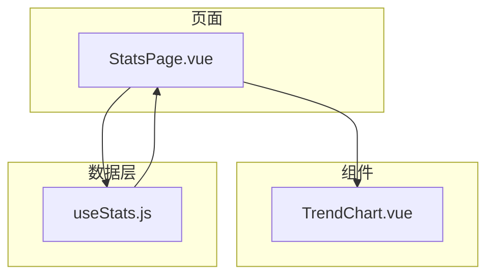
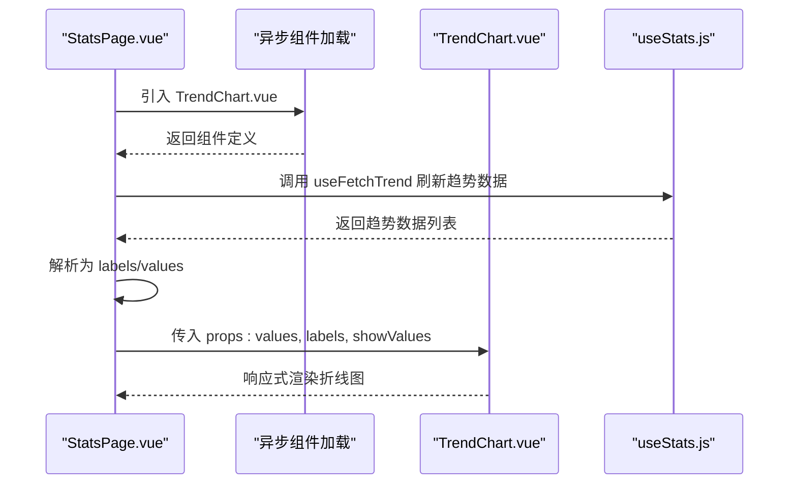
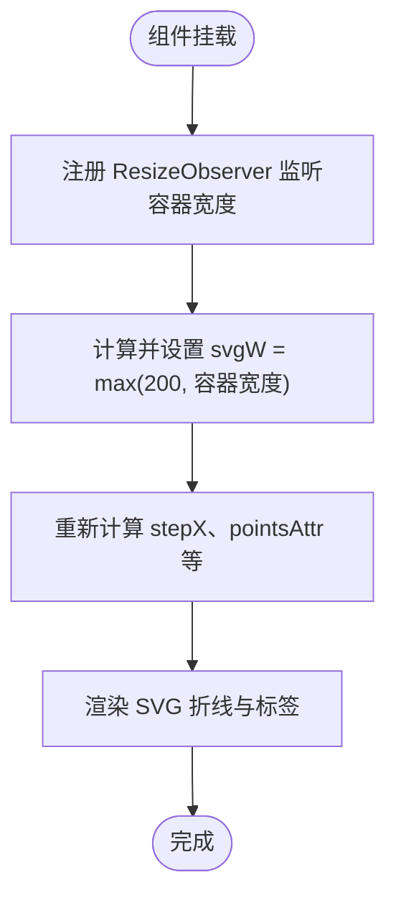
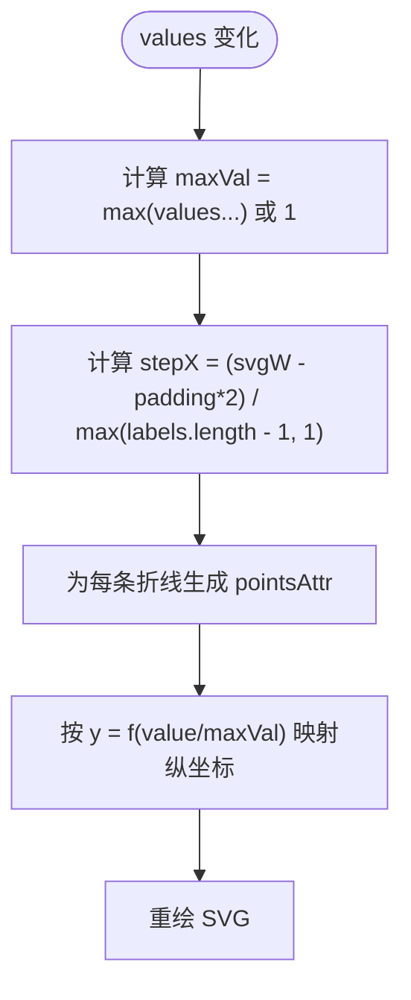
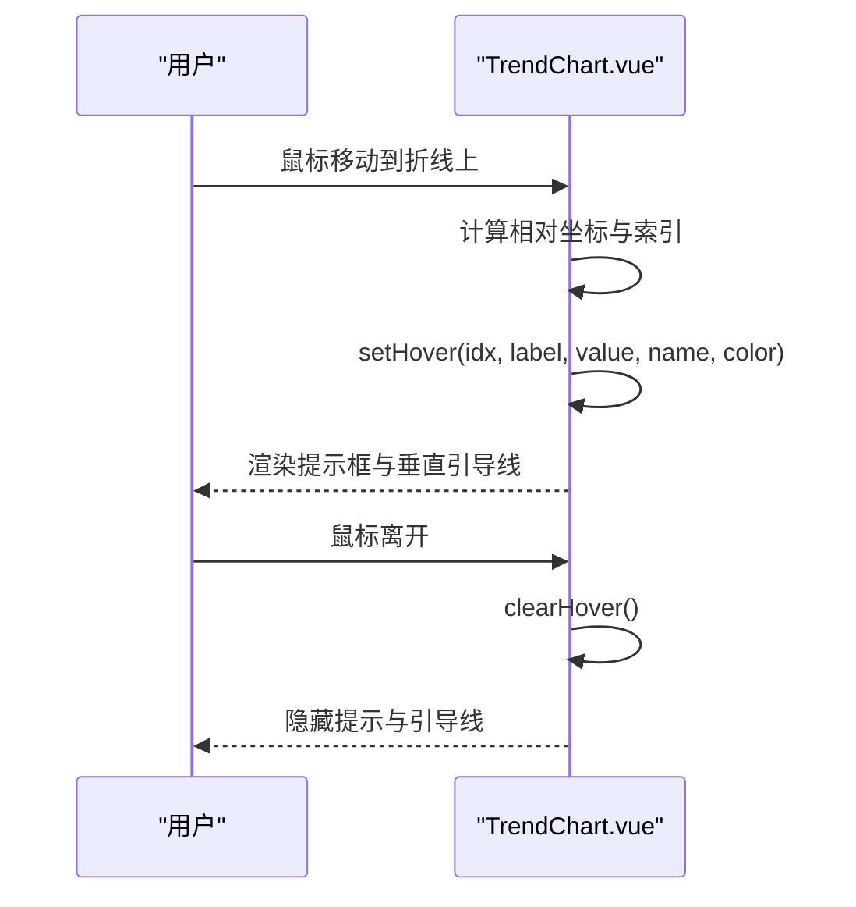
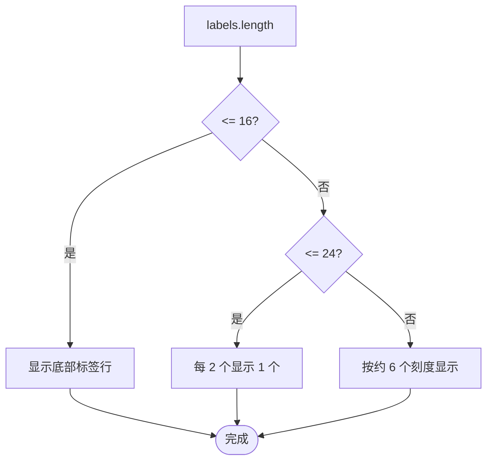
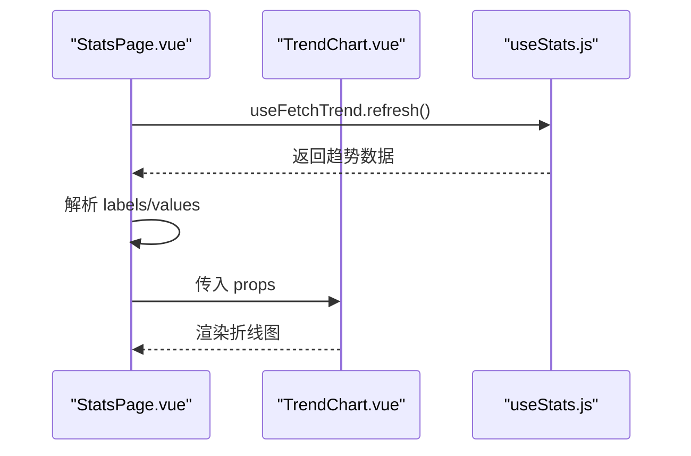
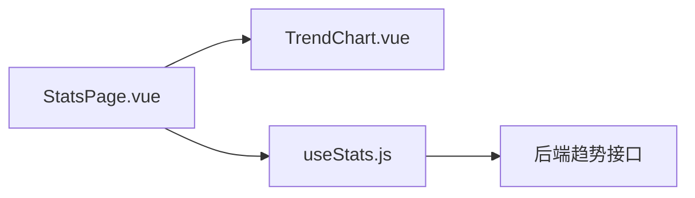

# 趋势折线图组件 (TrendLineChart)

<cite>
**本文引用的文件**
- [TrendChart.vue](file://web/src/components/TrendChart.vue)
- [StatsPage.vue](file://web/src/pages/StatsPage.vue)
- [useStats.js](file://web/src/composables/useStats.js)
- [style.css](file://web/src/style.css)
</cite>

## 目录
1. [简介](#简介)
2. [项目结构](#项目结构)
3. [核心组件](#核心组件)
4. [架构总览](#架构总览)
5. [组件详细分析](#组件详细分析)
6. [依赖关系分析](#依赖关系分析)
7. [性能考量](#性能考量)
8. [故障排查指南](#故障排查指南)
9. [结论](#结论)
10. [附录](#附录)

## 简介
本文件面向前端开发者与产品同学，系统化说明 TrendLineChart 组件（当前仓库中以 TrendChart.vue 提供）如何渲染时间序列趋势折线图。文档覆盖：
- 组件如何接收数据（values、labels、multi、series、showValues、width、height 等 props 的数据结构与作用）
- 内部如何基于 SVG 渲染折线、坐标轴、网格线、悬浮提示与交互
- 如何在 StatsPage.vue 中集成该组件并从 useStats.js 获取趋势数据
- 自适应布局、标签密度控制、悬浮交互与空数据状态处理
- 支持的事件与使用场景
- 常见问题排查（图表不渲染、数据更新失效等）

注意：当前仓库未包含名为 TrendLineChart.vue 的组件文件；实际实现为 TrendChart.vue。本文将围绕 TrendChart.vue 进行完整说明，并指出与 StatsPage.vue 的集成方式。

## 项目结构
TrendChart.vue 位于 web/src/components 目录下，StatsPage.vue 位于 web/src/pages 目录下，二者通过异步组件方式集成，配合 useStats.js 提供的数据获取能力共同完成趋势数据的加载与展示。

**图表来源**
- [StatsPage.vue](file://web/src/pages/StatsPage.vue#L315-L330)
- [TrendChart.vue](file://web/src/components/TrendChart.vue#L1-L20)
- [useStats.js](file://web/src/composables/useStats.js#L85-L117)

**章节来源**
- [StatsPage.vue](file://web/src/pages/StatsPage.vue#L315-L330)
- [TrendChart.vue](file://web/src/components/TrendChart.vue#L1-L20)
- [useStats.js](file://web/src/composables/useStats.js#L85-L117)

## 核心组件
TrendChart.vue 是一个纯 SVG 实现的趋势折线图组件，具备以下关键特性：
- 响应式宽度：基于 ResizeObserver 监听容器宽度变化，动态调整 SVG 宽度
- 自动缩放：根据最大值动态计算纵轴范围，确保折线比例合理
- 交互提示：鼠标悬停时显示悬浮提示与垂直引导线
- 标签密度控制：根据标签数量自动减少 X 轴标签密度，避免拥挤
- 多系列支持：支持多条折线并行展示，带图例
- 空数据状态：当 labels/values 为空时，组件仍保持布局稳定

**章节来源**
- [TrendChart.vue](file://web/src/components/TrendChart.vue#L69-L120)
- [TrendChart.vue](file://web/src/components/TrendChart.vue#L120-L170)
- [TrendChart.vue](file://web/src/components/TrendChart.vue#L170-L238)

## 架构总览
TrendChart.vue 作为纯前端组件，不依赖外部图表库，通过 Vue 响应式系统与 SVG 原生元素实现渲染与交互。在 StatsPage.vue 中，通过异步组件加载 TrendChart.vue，并将趋势数据（labels、values）传递给组件。

**图表来源**
- [StatsPage.vue](file://web/src/pages/StatsPage.vue#L315-L330)
- [StatsPage.vue](file://web/src/pages/StatsPage.vue#L415-L426)
- [useStats.js](file://web/src/composables/useStats.js#L85-L117)
- [TrendChart.vue](file://web/src/components/TrendChart.vue#L69-L120)

## 组件详细分析

### Props 与数据结构
- values: 数值数组，表示每个时间点的访问量/计数
- labels: 字符串数组，表示每个时间点的标签（如日期）
- multi: 是否多系列模式（默认 false）
- series: 多系列模式下的数据结构，形如 [{ name, color, series:[{label,value}] }]
- width/height: 初始画布尺寸（组件内部会根据容器宽度自适应）
- showValues: 是否在点位上方显示数值

这些 props 决定了组件的渲染内容与交互行为。values 与 labels 必须一一对应，multi 为 true 时，series 结构用于多条折线并行展示。

**章节来源**
- [TrendChart.vue](file://web/src/components/TrendChart.vue#L71-L79)

### 初始化与响应式布局
- 组件在挂载时通过 ResizeObserver 监听容器 clientWidth，动态更新 SVG 宽度，最小宽度限制为 200px
- 宽度变化会触发重新计算折线点位与标签密度，确保在不同屏幕尺寸下保持良好可读性

**图表来源**
- [TrendChart.vue](file://web/src/components/TrendChart.vue#L86-L100)
- [TrendChart.vue](file://web/src/components/TrendChart.vue#L112-L121)

**章节来源**
- [TrendChart.vue](file://web/src/components/TrendChart.vue#L86-L100)
- [TrendChart.vue](file://web/src/components/TrendChart.vue#L112-L121)

### 数据更新与缩放
- 最大值 maxVal 动态计算，确保纵轴范围随数据变化而自适应
- 折线点位通过公式映射到 SVG 坐标系，保证折线平滑且比例合理
- 当 values 为空时，maxVal 至少为 1，避免除零与布局异常

**图表来源**
- [TrendChart.vue](file://web/src/components/TrendChart.vue#L106-L121)

**章节来源**
- [TrendChart.vue](file://web/src/components/TrendChart.vue#L106-L121)

### 交互与提示
- 悬停交互：鼠标移动到折线上时，计算当前索引并设置 hoverIdx、hoverLabel、hoverName、hoverValue
- 悬停提示：在当前点位附近绘制提示框，显示标签与数值
- 垂直引导线：悬停时显示一条垂直虚线，帮助对齐到对应日期
- 多系列场景：当标签区间较宽时，采用“宽命中区域”策略，按列选择该列数值最大的系列进行展示

**图表来源**
- [TrendChart.vue](file://web/src/components/TrendChart.vue#L153-L204)
- [TrendChart.vue](file://web/src/components/TrendChart.vue#L205-L218)
- [TrendChart.vue](file://web/src/components/TrendChart.vue#L219-L233)

**章节来源**
- [TrendChart.vue](file://web/src/components/TrendChart.vue#L153-L204)
- [TrendChart.vue](file://web/src/components/TrendChart.vue#L205-L218)
- [TrendChart.vue](file://web/src/components/TrendChart.vue#L219-L233)

### 标签密度与布局策略
- 根据 labels 长度自动决定标签密度：≤16 时全部显示；17~24 时每 2 个显示 1 个；更长时按约 6 个刻度显示
- 短范围标签显示在图下方，长范围标签显示在 SVG 内，避免重叠与拥挤

**图表来源**
- [TrendChart.vue](file://web/src/components/TrendChart.vue#L140-L151)

**章节来源**
- [TrendChart.vue](file://web/src/components/TrendChart.vue#L140-L151)

### 多系列与图例
- multi 为 true 时，series 接收多条折线数据，每条折线包含 name、color、series（含 label/value）
- 组件为每条折线绘制折线、点位与数值文本，并在底部显示图例

**章节来源**
- [TrendChart.vue](file://web/src/components/TrendChart.vue#L101-L104)
- [TrendChart.vue](file://web/src/components/TrendChart.vue#L23-L35)
- [TrendChart.vue](file://web/src/components/TrendChart.vue#L53-L59)

### 主题与样式
- 组件使用 CSS 变量控制颜色：线色、坐标轴、网格线、文字次要色等
- 样式变量来源于全局样式文件，确保与整体设计系统一致

**章节来源**
- [TrendChart.vue](file://web/src/components/TrendChart.vue#L123-L128)
- [style.css](file://web/src/style.css#L1-L40)

### 在 StatsPage.vue 中的集成
- 使用 defineAsyncComponent 异步引入 TrendChart.vue
- 通过 useStats.js 的 useFetchTrend 获取趋势数据，解析为 labels 与 values
- 将 values、labels、showValues 传递给 TrendChart.vue
- 通过按钮切换天数（7/14/30），watch 监听 selectedDays 变化并重新拉取数据

**图表来源**
- [StatsPage.vue](file://web/src/pages/StatsPage.vue#L315-L330)
- [StatsPage.vue](file://web/src/pages/StatsPage.vue#L415-L426)
- [useStats.js](file://web/src/composables/useStats.js#L85-L117)

**章节来源**
- [StatsPage.vue](file://web/src/pages/StatsPage.vue#L315-L330)
- [StatsPage.vue](file://web/src/pages/StatsPage.vue#L415-L426)
- [useStats.js](file://web/src/composables/useStats.js#L85-L117)

## 依赖关系分析
- TrendChart.vue 依赖 Vue 响应式系统与 SVG 原生元素，不依赖外部图表库
- StatsPage.vue 通过异步组件加载 TrendChart.vue，并通过 useStats.js 获取数据
- useStats.js 提供 useFetchTrend，封装趋势数据请求与兼容处理

**图表来源**
- [StatsPage.vue](file://web/src/pages/StatsPage.vue#L315-L330)
- [useStats.js](file://web/src/composables/useStats.js#L85-L117)
- [TrendChart.vue](file://web/src/components/TrendChart.vue#L1-L20)

**章节来源**
- [StatsPage.vue](file://web/src/pages/StatsPage.vue#L315-L330)
- [useStats.js](file://web/src/composables/useStats.js#L85-L117)
- [TrendChart.vue](file://web/src/components/TrendChart.vue#L1-L20)

## 性能考量
- SVG 渲染：组件使用原生 SVG，避免额外依赖，渲染开销低
- 响应式更新：通过 computed 与 ResizeObserver 控制重绘频率，避免频繁全量重排
- 标签密度控制：长序列自动降采样，减少 DOM 节点与渲染压力
- 多系列优化：宽命中区域策略在长序列下提升交互体验，同时避免过多 hover 计算

[本节为通用性能建议，无需特定文件引用]

## 故障排查指南
- 图表不渲染
  - 检查容器是否可见且 clientWidth > 0（组件会在挂载时尝试获取容器宽度）
  - 确认 props.values 与 props.labels 长度一致
  - 若使用多系列，请确认 series 结构正确
  - 参考路径：[TrendChart.vue](file://web/src/components/TrendChart.vue#L86-L100)

- 数据更新失效
  - 确认父组件已将新的 values/labels 传入组件
  - 在 StatsPage.vue 中，确保 selectedDays 变化后触发了 fetchTrend 并更新了 trendValues/trendLabels
  - 参考路径：[StatsPage.vue](file://web/src/pages/StatsPage.vue#L440-L445)

- 悬停提示不显示
  - 检查鼠标事件绑定是否生效（onLineMove、setHover、clearHover）
  - 确认 hoverIdx 不为 null 且 hoverName 存在
  - 参考路径：[TrendChart.vue](file://web/src/components/TrendChart.vue#L153-L204)

- 标签拥挤或重叠
  - 减少 labels 数量或等待组件自动降采样
  - 短范围标签会自动显示在底部，长范围标签显示在 SVG 内
  - 参考路径：[TrendChart.vue](file://web/src/components/TrendChart.vue#L140-L151)

- 多系列显示异常
  - 确认 series 数组中每条折线的 series 长度与 labels 一致
  - 确认每条折线的 name 与 color 设置正确
  - 参考路径：[TrendChart.vue](file://web/src/components/TrendChart.vue#L101-L104)

**章节来源**
- [TrendChart.vue](file://web/src/components/TrendChart.vue#L86-L100)
- [TrendChart.vue](file://web/src/components/TrendChart.vue#L140-L151)
- [TrendChart.vue](file://web/src/components/TrendChart.vue#L153-L204)
- [StatsPage.vue](file://web/src/pages/StatsPage.vue#L440-L445)

## 结论
TrendChart.vue 以纯 SVG 实现了轻量、可交互、响应式的趋势折线图，具备良好的自适应与交互体验。在 StatsPage.vue 中通过异步组件与 useStats.js 的数据流，实现了从后端接口到前端可视化的完整闭环。对于时间序列趋势展示，该组件提供了简洁可靠的实现方案。

[本节为总结性内容，无需特定文件引用]

## 附录

### Props 定义与说明
- values: 数值数组，长度需与 labels 一致
- labels: 标签数组，通常为日期字符串
- multi: 是否启用多系列模式
- series: 多系列数据结构，包含 name、color、series（含 label/value）
- width/height: 初始画布尺寸，组件内部会根据容器宽度自适应
- showValues: 是否在点位上方显示数值

**章节来源**
- [TrendChart.vue](file://web/src/components/TrendChart.vue#L71-L79)

### 事件与使用场景
- 鼠标进入/移动/离开折线：用于计算 hoverIdx 与 setHover，显示提示框与垂直引导线
- 宽命中区域：在长序列下按列选择数值最大的系列进行展示
- 使用场景：趋势对比、日均访问量、峰值访问量等时间序列可视化

**章节来源**
- [TrendChart.vue](file://web/src/components/TrendChart.vue#L23-L35)
- [TrendChart.vue](file://web/src/components/TrendChart.vue#L153-L204)
- [TrendChart.vue](file://web/src/components/TrendChart.vue#L205-L218)

### 在 StatsPage.vue 中的集成要点
- 异步加载组件：defineAsyncComponent 引入 TrendChart.vue
- 数据准备：useFetchTrend 返回数据后解析为 labels/values
- 交互控制：按钮切换天数，watch 监听 selectedDays 变化并刷新数据
- 展示区域：Suspense 包裹，提供 fallback 占位

**章节来源**
- [StatsPage.vue](file://web/src/pages/StatsPage.vue#L315-L330)
- [StatsPage.vue](file://web/src/pages/StatsPage.vue#L415-L426)
- [StatsPage.vue](file://web/src/pages/StatsPage.vue#L78-L96)