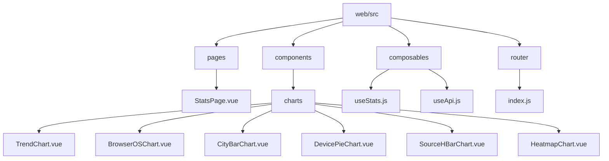
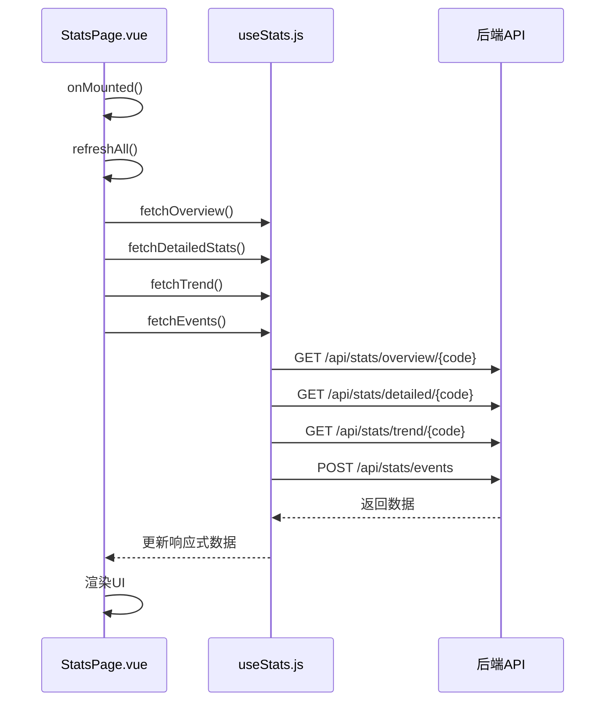
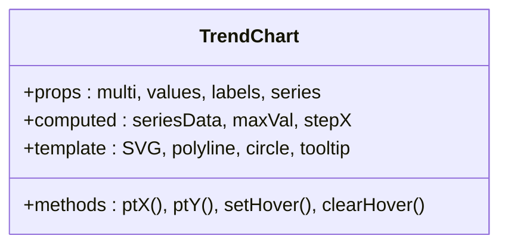
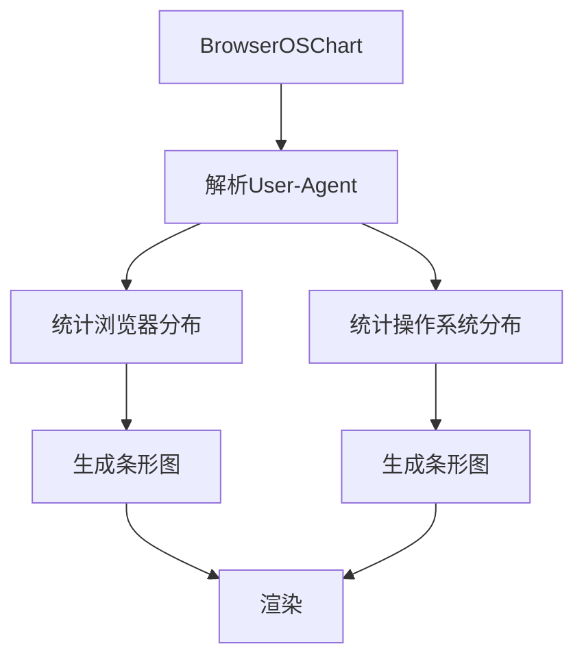

# 前端可视化组件

<cite>
**本文档引用的文件**
- [StatsPage.vue](file://web/src/pages/StatsPage.vue)
- [useStats.js](file://web/src/composables/useStats.js)
- [useApi.js](file://web/src/composables/useApi.js)
- [TrendChart.vue](file://web/src/components/TrendChart.vue)
- [BrowserOSChart.vue](file://web/src/components/charts/BrowserOSChart.vue)
- [CityBarChart.vue](file://web/src/components/charts/CityBarChart.vue)
- [DevicePieChart.vue](file://web/src/components/charts/DevicePieChart.vue)
- [SourceHBarChart.vue](file://web/src/components/charts/SourceHBarChart.vue)
- [HeatmapChart.vue](file://web/src/components/charts/HeatmapChart.vue)
- [shortBase.js](file://web/src/composables/shortBase.js)
- [main.js](file://web/src/main.js)
</cite>

## 目录
1. [项目结构](#项目结构)
2. [核心数据流与API协调](#核心数据流与api协调)
3. [图表组件详解](#图表组件详解)
4. [UI交互组件](#ui交互组件)
5. [响应式更新与错误处理](#响应式更新与错误处理)

## 项目结构

前端统计可视化功能主要集中在 `web/src` 目录下，其核心结构如下：

**Diagram sources**
- [StatsPage.vue](file://web/src/pages/StatsPage.vue)
- [useStats.js](file://web/src/composables/useStats.js)
- [TrendChart.vue](file://web/src/components/TrendChart.vue)
- [BrowserOSChart.vue](file://web/src/components/charts/BrowserOSChart.vue)
- [CityBarChart.vue](file://web/src/components/charts/CityBarChart.vue)
- [DevicePieChart.vue](file://web/src/components/charts/DevicePieChart.vue)
- [SourceHBarChart.vue](file://web/src/components/charts/SourceHBarChart.vue)
- [HeatmapChart.vue](file://web/src/components/charts/HeatmapChart.vue)

**Section sources**
- [StatsPage.vue](file://web/src/pages/StatsPage.vue)
- [useStats.js](file://web/src/composables/useStats.js)

## 核心数据流与API协调

`StatsPage.vue` 页面是统计功能的入口，它通过组合式函数 `useStats.js` 协调调用多个后端API来获取数据。

### 数据获取流程

`StatsPage.vue` 在页面加载时，通过 `refreshAll` 函数并行调用四个核心API：

**Diagram sources**
- [StatsPage.vue](file://web/src/pages/StatsPage.vue#L436-L438)
- [useStats.js](file://web/src/composables/useStats.js#L65-L117)

**Section sources**
- [StatsPage.vue](file://web/src/pages/StatsPage.vue#L388-L438)
- [useStats.js](file://web/src/composables/useStats.js#L65-L117)

### API调用函数解析

`useStats.js` 提供了多个组合式函数来封装API调用：

| 函数名 | 用途 | API端点 | 请求方式 |
| :--- | :--- | :--- | :--- |
| `useFetchOverview` | 获取短链概览数据 | `/api/stats/overview/{code}` | GET |
| `useFetchTrend` | 获取访问趋势数据 | `/api/stats/trend/{code}` | GET |
| `useFetchDistribution` | 获取分布数据 | `/api/stats/distribution` | POST |
| `useFetchEvents` | 获取访问事件列表 | `/api/stats/events` | POST |
| `exportStats` | 导出统计数据 | `/api/stats/export` | POST |

这些函数都遵循统一的响应式状态管理模式，返回包含 `data`, `loading`, `error` 和 `refresh` 方法的对象。

**Section sources**
- [useStats.js](file://web/src/composables/useStats.js#L65-L255)

## 图表组件详解

### 趋势折线图 (TrendLineChart)

`TrendChart.vue` 组件使用原生SVG渲染时间趋势折线图，具有高度的交互性。

**核心特性：**
- **响应式设计**：通过 `ResizeObserver` 监听容器大小变化。
- **悬停交互**：鼠标悬停时显示精确数值和提示框。
- **多系列支持**：可同时展示多条趋势线。
- **智能标签**：根据数据点数量自动调整X轴标签密度。

**Diagram sources**
- [TrendChart.vue](file://web/src/components/TrendChart.vue#L71-L79)

**Section sources**
- [TrendChart.vue](file://web/src/components/TrendChart.vue)

### 设备与浏览器分布图 (DevicePieChart & BrowserOSChart)

#### DevicePieChart (环形图)
- 使用SVG的 `circle` 元素和 `stroke-dasharray` 属性实现环形进度条效果。
- 通过计算 `circumference` 和 `offset` 来控制每个扇区的长度。
- 支持iOS、Android和PC三种设备类型。

#### BrowserOSChart (条形图)
- 一个组件内包含“浏览器”和“操作系统”两个标签页。
- 通过正则表达式从 `User-Agent` 字符串中解析浏览器和操作系统信息。
- 使用渐变色和图标增强视觉效果。

**Diagram sources**
- [DevicePieChart.vue](file://web/src/components/charts/DevicePieChart.vue)
- [BrowserOSChart.vue](file://web/src/components/charts/BrowserOSChart.vue)

**Section sources**
- [DevicePieChart.vue](file://web/src/components/charts/DevicePieChart.vue)
- [BrowserOSChart.vue](file://web/src/components/charts/BrowserOSChart.vue)

### 横向柱状图 (CityBarChart & SourceHBarChart)

这两个组件都实现了横向柱状图，用于展示城市和来源域名的分布。

**共同特点：**
- 使用 `div` 元素的 `width` CSS属性来表示数据比例。
- 通过 `Math.max` 计算最大值，确保所有柱子的长度是相对的。
- 简洁的布局，突出数据本身。

| 组件 | 特点 |
| :--- | :--- |
| `CityBarChart` | 网格布局，每个城市一个柱子，高度可变 |
| `SourceHBarChart` | 垂直堆叠布局，每个来源一行，宽度可变 |

**Section sources**
- [CityBarChart.vue](file://web/src/components/charts/CityBarChart.vue)
- [SourceHBarChart.vue](file://web/src/components/charts/SourceHBarChart.vue)

### 小时热度图 (HeatmapChart)

`HeatmapChart.vue` 组件将访问事件按小时分组，生成24小时访问热力图。

**实现逻辑：**
1. 在 `computed` 中创建一个包含24小时（0-23）的Map，并初始化计数为0。
2. 遍历 `props.data` 中的每个事件，解析其时间戳，提取小时数，并在Map中对应小时的计数加1。
3. 根据最终的计数生成一个包含24个对象的数组，每个对象包含 `hour` 和 `value`。
4. 使用 `getCellStyle` 函数根据访问量的相对强度计算每个单元格的背景色和边框色。

**视觉设计：**
- 使用从浅蓝到红色的渐变来表示访问量的高低。
- 单元格具有悬停动画效果，提升交互体验。
- 响应式设计，适配移动设备。

**Section sources**
- [HeatmapChart.vue](file://web/src/components/charts/HeatmapChart.vue)

## UI交互组件

### 筛选弹窗

`StatsPage.vue` 中的筛选弹窗允许用户根据日期、来源、设备类型和城市等条件过滤数据。

**交互流程：**
1. 用户点击“筛选”按钮，`showFilter` 状态变为 `true`。
2. 弹窗显示，用户填写筛选条件。
3. 用户点击“应用”按钮，触发 `applyFilters` 函数。
4. `applyFilters` 函数关闭弹窗并调用 `refreshAll` 重新获取数据。

**Section sources**
- [StatsPage.vue](file://web/src/pages/StatsPage.vue#L271-L310)

### 导出功能

`exportCsv` 函数通过 `axios.post` 请求后端的 `/api/stats/export` 接口，以CSV格式导出统计数据。

**实现细节：**
- 设置 `responseType: 'blob'` 以接收二进制文件流。
- 使用 `URL.createObjectURL()` 创建一个临时的URL。
- 创建一个隐藏的 `<a>` 元素，设置其 `href` 为临时URL，并设置 `download` 属性。
- 通过 `click()` 方法触发下载。
- 下载完成后，使用 `setTimeout` 清理临时URL和DOM元素。

**Section sources**
- [StatsPage.vue](file://web/src/pages/StatsPage.vue#L462-L473)
- [useStats.js](file://web/src/composables/useStats.js#L241-L255)

### 指标卡片

页面顶部的指标卡片（如总PV、总UV）通过 `detailedStats` 和 `overview` 两个响应式对象获取数据。

**数据绑定：**
- 使用 `{{ detailedStats?.pv ?? overview?.totalVisits ?? '-' }}` 这种链式可选操作符确保数据安全。
- 计算属性 `avgVisits` 和 `peakVisits` 用于计算日均PV和峰值PV。

**Section sources**
- [StatsPage.vue](file://web/src/pages/StatsPage.vue#L18-L43)

## 响应式更新与错误处理

### 响应式更新

整个页面基于Vue 3的响应式系统构建：
- 所有数据状态（如 `overview`, `detailedStats`, `trendValues`）都使用 `ref()` 定义。
- 计算属性（如 `avgVisits`, `peakVisits`）会自动根据依赖的数据变化而重新计算。
- 当 `selectedDays` 变化时，通过 `watch` 监听器自动触发 `fetchTrend()`，实现趋势图的动态更新。

### 错误处理

代码中实现了多层级的错误处理：
- **API调用层**：每个 `fetch` 函数都使用 `try-catch` 捕获网络请求错误，并将错误信息存储在 `error` 状态中。
- **数据解析层**：在处理后端返回数据时，使用可选链操作符 `?.` 和空值合并操作符 `??` 防止因数据结构不一致导致的运行时错误。
- **全局处理**：在 `main.js` 中通过 `setupAxiosInterceptors()` 配置了Axios拦截器，可以统一处理认证失败等全局性错误。

**Section sources**
- [StatsPage.vue](file://web/src/pages/StatsPage.vue#L388-L438)
- [useStats.js](file://web/src/composables/useStats.js#L67-L81)
- [main.js](file://web/src/main.js#L9)