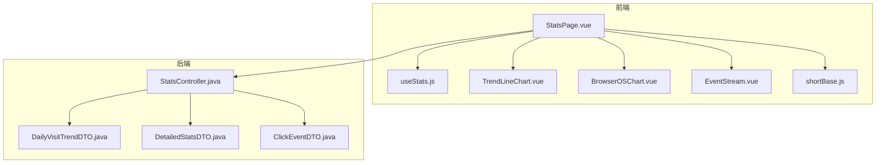
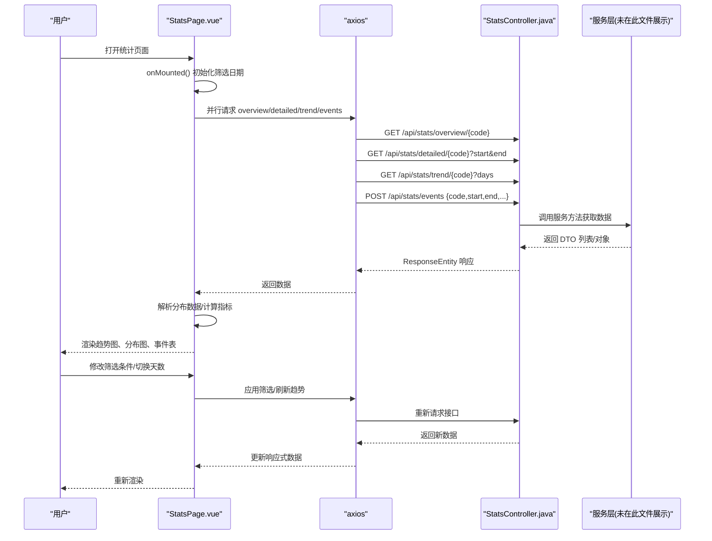
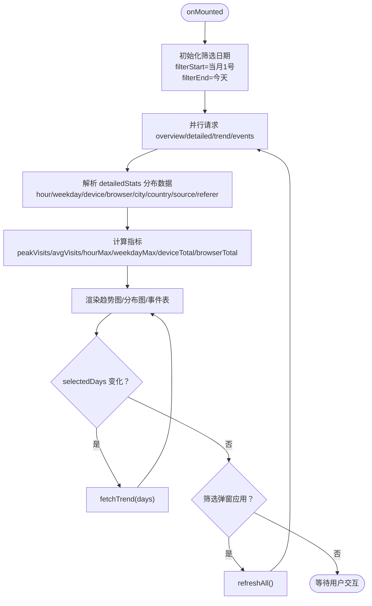
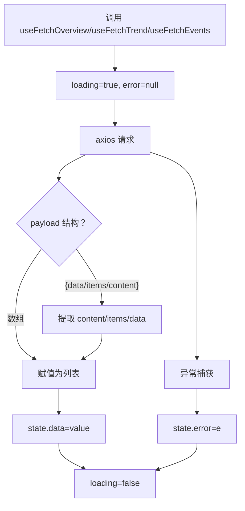
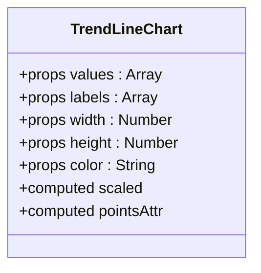
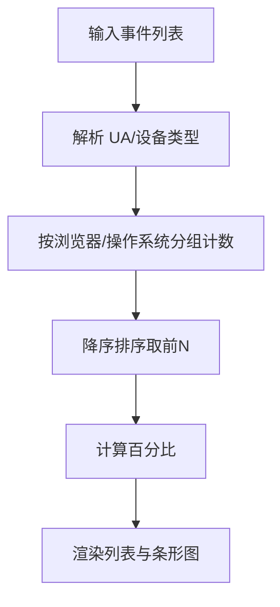
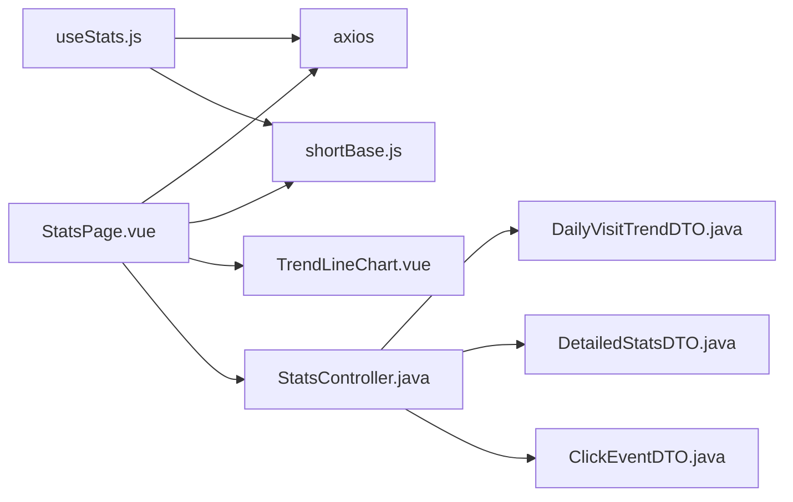

# 核心统计页面

<cite>
**本文引用的文件**
- [StatsPage.vue](file://web/src/pages/StatsPage.vue)
- [useStats.js](file://web/src/composables/useStats.js)
- [StatsController.java](file://src/main/java/com/layor/tinyflow/Controller/StatsController.java)
- [TrendLineChart.vue](file://web/src/components/charts/TrendLineChart.vue)
- [BrowserOSChart.vue](file://web/src/components/charts/BrowserOSChart.vue)
- [EventStream.vue](file://web/src/components/charts/EventStream.vue)
- [shortBase.js](file://web/src/composables/shortBase.js)
- [DailyVisitTrendDTO.java](file://src/main/java/com/layor/tinyflow/entity/DailyVisitTrendDTO.java)
- [DetailedStatsDTO.java](file://src/main/java/com/layor/tinyflow/entity/DetailedStatsDTO.java)
- [ClickEventDTO.java](file://src/main/java/com/layor/tinyflow/entity/ClickEventDTO.java)
</cite>

## 目录
1. [简介](#简介)
2. [项目结构](#项目结构)
3. [核心组件](#核心组件)
4. [架构总览](#架构总览)
5. [详细组件分析](#详细组件分析)
6. [依赖关系分析](#依赖关系分析)
7. [性能考量](#性能考量)
8. [故障排查指南](#故障排查指南)
9. [结论](#结论)

## 简介
本文件深入文档化核心统计页面 StatsPage.vue 的实现，阐明其作为统计功能入口的角色，如何整合多个数据可视化组件，并通过组合式函数 useStats.js 或直接使用 axios 协调调用后端 API（getOverview、getDetailedStats、getTrend、getEvents）来获取数据。文档覆盖响应式数据流（overview、detailedStats、trendValues 等）、生命周期钩子 onMounted 的数据加载、watch 监听器对筛选条件变化的响应、页面内导航、筛选、导出 CSV 等交互逻辑，并补充错误处理、加载状态管理与数据兼容性处理等高级主题。

## 项目结构
StatsPage.vue 位于前端 web/src/pages 目录下，是统计页面的主入口；后端控制器位于 Java 后端 src/main/java/com/layor/tinyflow/Controller 下的 StatsController.java，提供 /api/stats 开头的统计接口；页面使用若干可视化组件（如 TrendLineChart.vue、BrowserOSChart.vue、EventStream.vue）进行数据展示；数据兼容与 API 基础地址由 shortBase.js 提供；后端 DTO 定义位于 src/main/java/com/layor/tinyflow/entity 下。



**图表来源**
- [StatsPage.vue](file://web/src/pages/StatsPage.vue#L1-L120)
- [useStats.js](file://web/src/composables/useStats.js#L1-L40)
- [TrendLineChart.vue](file://web/src/components/charts/TrendLineChart.vue#L1-L38)
- [BrowserOSChart.vue](file://web/src/components/charts/BrowserOSChart.vue#L1-L60)
- [EventStream.vue](file://web/src/components/charts/EventStream.vue#L1-L60)
- [shortBase.js](file://web/src/composables/shortBase.js#L1-L15)
- [StatsController.java](file://src/main/java/com/layor/tinyflow/Controller/StatsController.java#L1-L120)
- [DailyVisitTrendDTO.java](file://src/main/java/com/layor/tinyflow/entity/DailyVisitTrendDTO.java#L1-L10)
- [DetailedStatsDTO.java](file://src/main/java/com/layor/tinyflow/entity/DetailedStatsDTO.java#L1-L43)
- [ClickEventDTO.java](file://src/main/java/com/layor/tinyflow/entity/ClickEventDTO.java#L1-L50)

**章节来源**
- [StatsPage.vue](file://web/src/pages/StatsPage.vue#L1-L120)
- [StatsController.java](file://src/main/java/com/layor/tinyflow/Controller/StatsController.java#L1-L120)

## 核心组件
- StatsPage.vue：统计页面主入口，负责组织布局、响应式数据、筛选、导出、导航与 API 调用。
- useStats.js：封装通用的 API 请求状态与数据解析逻辑，提供 useFetchOverview、useFetchTrend、useFetchEvents 等可复用能力。
- TrendLineChart.vue：基于 SVG 的折线趋势图，接收 labels 和 values 渲染。
- BrowserOSChart.vue：浏览器/操作系统分布的双标签页图表，解析 UA 并聚合展示。
- EventStream.vue：事件流组件，用于展示最近访问事件列表。
- shortBase.js：提供 SHORT_BASE 与 API_BASE，支持环境变量注入与短链/接口基础地址解析。

**章节来源**
- [StatsPage.vue](file://web/src/pages/StatsPage.vue#L1-L120)
- [useStats.js](file://web/src/composables/useStats.js#L65-L117)
- [TrendLineChart.vue](file://web/src/components/charts/TrendLineChart.vue#L1-L38)
- [BrowserOSChart.vue](file://web/src/components/charts/BrowserOSChart.vue#L1-L60)
- [EventStream.vue](file://web/src/components/charts/EventStream.vue#L1-L60)
- [shortBase.js](file://web/src/composables/shortBase.js#L1-L15)

## 架构总览
前端通过 axios 直接调用后端 /api/stats 接口，后端控制器根据路径与参数返回对应 DTO 列表或对象。StatsPage.vue 在 onMounted 生命周期中初始化筛选条件并并行拉取 overview、detailed、trend、events 数据；watch 监听 selectedDays 变化以刷新趋势；筛选弹窗应用后触发 refreshAll 并重新渲染图表与表格。



**图表来源**
- [StatsPage.vue](file://web/src/pages/StatsPage.vue#L387-L459)
- [StatsController.java](file://src/main/java/com/layor/tinyflow/Controller/StatsController.java#L18-L120)

## 详细组件分析

### StatsPage.vue：统计页面入口与数据流
- 路由参数与短链构造：从路由 params 中读取 shortCode，并拼接 SHORT_BASE 形成短链地址。
- 响应式状态：
  - overview：概览数据（总PV、UV、今日PV、创建时间等）
  - detailedStats：详细统计（小时/星期分布、设备/浏览器/城市/国家/来源/Referer分布、首末次访问时间等）
  - eventsList：最近访问事件列表
  - trendLabels/trendValues：趋势图所需标签与数值
  - selectedDays：趋势天数选择（7/14/30）
  - 多个分布数组：hour、weekday、device、browser、city、country、source、referer
  - 筛选条件：showFilter、filterStart、filterEnd、filterSource、filterDevice、filterCity
- 计算属性：
  - peakVisits：趋势最大值
  - avgVisits：趋势平均值
  - hourMax、weekdayMax：柱状图最大值
  - deviceTotal、browserTotal：分布总数
- API 调用与数据解析：
  - fetchOverview：GET /api/stats/overview/{code}
  - fetchDetailedStats：GET /api/stats/detailed/{code}?start&end；解析 detailedStats 的多维分布数组，统一 key/label 与 count/value 字段
  - fetchTrend：GET /api/stats/trend/{code}?days；按日期排序，映射 visits/count 字段到 trendValues
  - fetchEvents：POST /api/stats/events；限制 size=100，截取前 50 行展示
  - refreshAll：Promise.all 并行拉取四个接口
- 生命周期与监听：
  - onMounted：初始化筛选日期（当月1号至当天），随后调用 refreshAll
  - watch(selectedDays)：天数变化时自动刷新趋势
- 交互逻辑：
  - openFilter/closeFilter/resetFilters/applyFilters：弹窗筛选与应用
  - selectDays：切换趋势天数
  - exportCsv：POST /api/stats/export?format=csv，下载 Blob 文件
  - 导航：goHome/goDashboard
  - 工具函数：formatDate、getBarWidth、getPercent、copy



**图表来源**
- [StatsPage.vue](file://web/src/pages/StatsPage.vue#L387-L459)

**章节来源**
- [StatsPage.vue](file://web/src/pages/StatsPage.vue#L315-L459)

### useStats.js：组合式函数与数据兼容
- API 基础地址：若存在 API_BASE，则设置 axios.defaults.baseURL，便于集中配置后端地址。
- useFetchOverview：GET /api/stats/overview/{code}，兼容 payload.data/result 或直接对象。
- useFetchTrend：GET /api/stats/trend/{code}?days，兼容数组、payload.items/data/content 等多种结构。
- useFetchEvents：POST /api/stats/events，兼容数组、payload.data/items/content 等结构。
- exportStats：POST /api/stats/export?format=csv/json，返回 Blob 并触发浏览器下载。



**图表来源**
- [useStats.js](file://web/src/composables/useStats.js#L65-L117)
- [useStats.js](file://web/src/composables/useStats.js#L210-L238)

**章节来源**
- [useStats.js](file://web/src/composables/useStats.js#L1-L40)
- [useStats.js](file://web/src/composables/useStats.js#L65-L117)
- [useStats.js](file://web/src/composables/useStats.js#L210-L238)

### TrendLineChart.vue：趋势折线图
- 接收 props：values、labels、width、height、color
- 计算缩放比例与点位坐标，绘制折线与圆点
- 适用于 StatsPage.vue 的 trendLabels/trendValues 数据



**图表来源**
- [TrendLineChart.vue](file://web/src/components/charts/TrendLineChart.vue#L1-L38)

**章节来源**
- [TrendLineChart.vue](file://web/src/components/charts/TrendLineChart.vue#L1-L38)

### BrowserOSChart.vue：浏览器/操作系统分布
- 双标签页：浏览器分布与操作系统分布
- 通过 UA 解析浏览器与操作系统，聚合前 N 名展示
- 支持百分比与颜色渐变条形图



**图表来源**
- [BrowserOSChart.vue](file://web/src/components/charts/BrowserOSChart.vue#L82-L129)

**章节来源**
- [BrowserOSChart.vue](file://web/src/components/charts/BrowserOSChart.vue#L1-L181)

### EventStream.vue：事件流组件
- 展示最近访问事件，支持时间格式化、设备类型分类、地区格式化
- 适合与 StatsPage.vue 的 eventsList 对接

**章节来源**
- [EventStream.vue](file://web/src/components/charts/EventStream.vue#L1-L120)

### shortBase.js：短链与 API 基础地址
- 提供 SHORT_BASE 与 API_BASE，优先读取 VITE_* 环境变量，否则回退到 window.origin 或默认地址
- 提供 cleanShortUrl 辅助函数

**章节来源**
- [shortBase.js](file://web/src/composables/shortBase.js#L1-L15)

### 后端接口与数据模型
- StatsController.java 提供以下接口：
  - GET /api/stats/overview/{shortCode}
  - GET /api/stats/detailed/{shortCode}?start&end
  - GET /api/stats/trend/{shortCode}?days
  - POST /api/stats/events（Body：code/start/end/source/device/city/page/size）
  - POST /api/stats/export?format=csv/json
- 对应 DTO：
  - DailyVisitTrendDTO：date、visits
  - DetailedStatsDTO：pv、uv、pvUvRatio、hourDistribution、weekdayDistribution、countryDistribution、cityDistribution、deviceDistribution、browserDistribution、sourceDistribution、refererDistribution、firstClick、lastClick
  - ClickEventDTO：ts、ip、sourceHost、deviceType、city、country、ua、referer

```mermaid
erDiagram
DAILY_VISIT_TREND_DTO {
string date
int visits
}
DETAILED_STATS_DTO {
long pv
long uv
double pvUvRatio
datetime firstClick
datetime lastClick
}
CLICK_EVENT_DTO {
datetime ts
string ip
string sourceHost
string deviceType
string city
string country
string ua
string referer
}
STATS_CONTROLLER {
string GET /api/stats/overview/{shortCode}
string GET /api/stats/detailed/{shortCode}?start&end
string GET /api/stats/trend/{shortCode}?days
string POST /api/stats/events
string POST /api/stats/export?format=csv/json
}
STATS_CONTROLLER ||--o{ DAILY_VISIT_TREND_DTO : "返回趋势"
STATS_CONTROLLER ||--o{ DETAILED_STATS_DTO : "返回详细统计"
STATS_CONTROLLER ||--o{ CLICK_EVENT_DTO : "返回事件列表"
```

**图表来源**
- [StatsController.java](file://src/main/java/com/layor/tinyflow/Controller/StatsController.java#L18-L120)
- [DailyVisitTrendDTO.java](file://src/main/java/com/layor/tinyflow/entity/DailyVisitTrendDTO.java#L1-L10)
- [DetailedStatsDTO.java](file://src/main/java/com/layor/tinyflow/entity/DetailedStatsDTO.java#L1-L43)
- [ClickEventDTO.java](file://src/main/java/com/layor/tinyflow/entity/ClickEventDTO.java#L1-L50)

**章节来源**
- [StatsController.java](file://src/main/java/com/layor/tinyflow/Controller/StatsController.java#L18-L120)
- [DailyVisitTrendDTO.java](file://src/main/java/com/layor/tinyflow/entity/DailyVisitTrendDTO.java#L1-L10)
- [DetailedStatsDTO.java](file://src/main/java/com/layor/tinyflow/entity/DetailedStatsDTO.java#L1-L43)
- [ClickEventDTO.java](file://src/main/java/com/layor/tinyflow/entity/ClickEventDTO.java#L1-L50)

## 依赖关系分析
- StatsPage.vue 依赖：
  - axios：直接发起 API 请求
  - shortBase.js：解析 API_BASE 与 SHORT_BASE
  - TrendLineChart.vue：异步组件懒加载
  - 后端接口：/api/stats/*
- useStats.js 依赖：
  - axios：封装请求与状态
  - shortBase.js：在 useStats.js 中动态导入 SHORT_BASE 以修正短链显示
- 后端依赖：
  - StatsController.java：提供统计接口
  - DTO：DailyVisitTrendDTO、DetailedStatsDTO、ClickEventDTO



**图表来源**
- [StatsPage.vue](file://web/src/pages/StatsPage.vue#L315-L340)
- [useStats.js](file://web/src/composables/useStats.js#L1-L20)
- [StatsController.java](file://src/main/java/com/layor/tinyflow/Controller/StatsController.java#L18-L120)

**章节来源**
- [StatsPage.vue](file://web/src/pages/StatsPage.vue#L315-L340)
- [useStats.js](file://web/src/composables/useStats.js#L1-L20)
- [StatsController.java](file://src/main/java/com/layor/tinyflow/Controller/StatsController.java#L18-L120)

## 性能考量
- 并行请求：使用 Promise.all 并行拉取 overview/detailed/trend/events，减少总等待时间。
- 懒加载图表：TrendChart 使用 defineAsyncComponent 进行异步加载，降低首屏体积。
- 本地计算：趋势最大值、平均值、分布总数等在前端计算，避免额外网络请求。
- 事件列表限制：fetchEvents 默认 size=100，表格只展示前 50 条，控制 DOM 与渲染成本。
- 数据兼容：后端返回结构可能多样化，前端通过 useStats.js 与 StatsPage.vue 的解析逻辑兼容不同字段命名（如 key/label、count/value）。

[本节为通用建议，无需特定文件引用]

## 故障排查指南
- API 请求失败：
  - 检查 API_BASE 是否正确设置（shortBase.js），确保 axios.defaults.baseURL 生效。
  - 查看浏览器 Network 面板，确认 /api/stats/* 请求是否返回 2xx。
- 数据为空或字段缺失：
  - detailedStats 的分布数组字段命名可能为 key/label 或 count/value，StatsPage.vue 已做兼容映射；若后端变更字段名，需同步修改解析逻辑。
  - trendValues 依赖 visits/count 字段，若后端返回结构变化，需调整映射。
- 导出 CSV 失败：
  - exportCsv 使用 responseType: 'blob'，若后端未正确设置 Content-Type 或下载头，可能导致下载失败。检查后端 /api/stats/export 的响应头。
- 事件流不更新：
  - 确认筛选条件已应用并触发 refreshAll；检查 eventsList 的长度与内容。
- 趋势图不刷新：
  - 确认 watch(selectedDays) 是否生效；手动调用 fetchTrend 验证接口可用。

**章节来源**
- [StatsPage.vue](file://web/src/pages/StatsPage.vue#L387-L459)
- [useStats.js](file://web/src/composables/useStats.js#L240-L255)
- [StatsController.java](file://src/main/java/com/layor/tinyflow/Controller/StatsController.java#L73-L83)

## 结论
StatsPage.vue 作为统计功能入口，通过清晰的响应式数据流与并行 API 调用，整合了趋势、分布与事件等多维度可视化组件。其生命周期与 watch 机制保证了筛选与天数切换的即时响应；useStats.js 提供了可复用的数据获取与兼容逻辑。结合后端 DTO 与接口契约，页面实现了稳定、可扩展的统计展示能力。建议在后端数据结构演进时，同步更新前端解析逻辑，确保兼容性与用户体验。