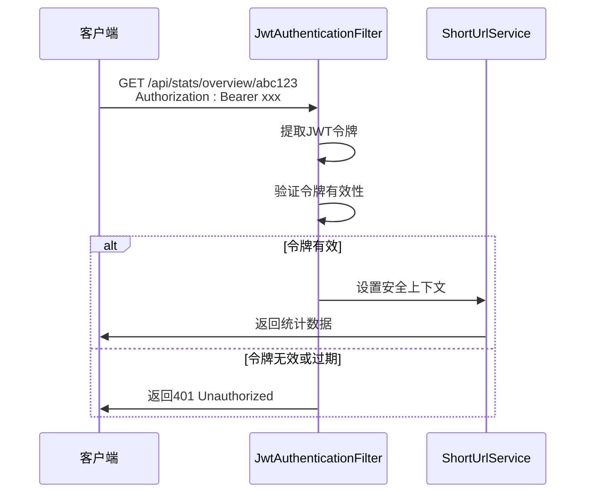
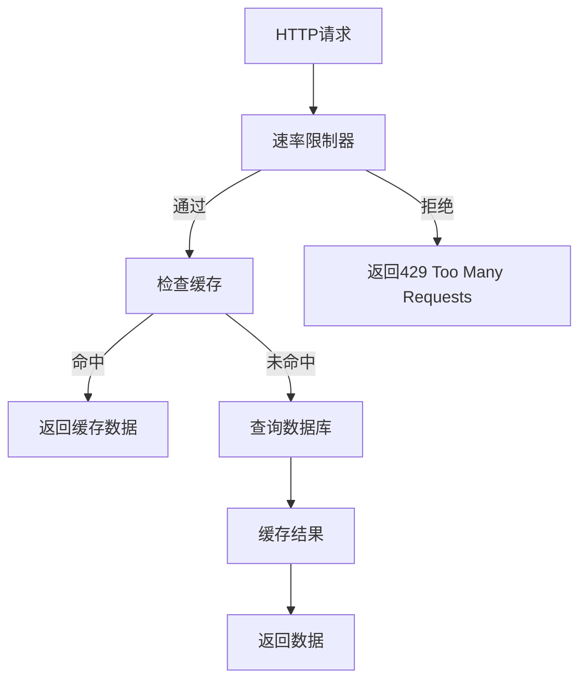

# 统计API接口

<cite>
**本文档引用的文件**  
- [StatsController.java](file://src/main/java/com/layor/tinyflow/Controller/StatsController.java)
- [StatsQuery.java](file://src/main/java/com/layor/tinyflow/dto/StatsQuery.java)
- [ShortUrlService.java](file://src/main/java/com/layor/tinyflow/service/ShortUrlService.java)
- [ShortUrlOverviewDTO.java](file://src/main/java/com/layor/tinyflow/entity/ShortUrlOverviewDTO.java)
- [DailyVisitTrendDTO.java](file://src/main/java/com/layor/tinyflow/entity/DailyVisitTrendDTO.java)
- [DistributionDTO.java](file://src/main/java/com/layor/tinyflow/entity/DistributionDTO.java)
- [ClickEventDTO.java](file://src/main/java/com/layor/tinyflow/entity/ClickEventDTO.java)
- [GlobalStatsDTO.java](file://src/main/java/com/layor/tinyflow/entity/GlobalStatsDTO.java)
- [DetailedStatsDTO.java](file://src/main/java/com/layor/tinyflow/entity/DetailedStatsDTO.java)
- [KeyCountDTO.java](file://src/main/java/com/layor/tinyflow/entity/KeyCountDTO.java)
- [PageResponseDTO.java](file://src/main/java/com/layor/tinyflow/entity/PageResponseDTO.java)
- [JwtAuthenticationFilter.java](file://src/main/java/com/layor/tinyflow/security/JwtAuthenticationFilter.java)
- [application.yml](file://src/main/resources/application.yml)
- [statistics-api.md](file://web/docs/statistics-api.md)
- [StatsControllerTest.java](file://src/test/java/com/layor/tinyflow/Controller/StatsControllerTest.java)
</cite>

## 目录
1. [简介](#简介)
2. [认证与安全](#认证与安全)
3. [通用响应格式](#通用响应格式)
4. [端点详情](#端点详情)
   1. [/overview/{shortCode} - 短链概览](#overviewshortcode---短链概览)
   2. [/trend/{shortCode} - 访问趋势](#trendshortcode---访问趋势)
   3. [/compare - 多链对比](#compare---多链对比)
   4. [/distribution - 分布统计](#distribution---分布统计)
   5. [/events - 事件详情](#events---事件详情)
   6. [/export - 数据导出](#export---数据导出)
   7. [/detailed/{shortCode} - 详细统计](#detailedshortcode---详细统计)
   8. [/global - 全局统计](#global---全局统计)
   9. [维度分布接口](#维度分布接口)
5. [性能优化与限流](#性能优化与限流)
6. [错误处理与常见问题](#错误处理与常见问题)

## 简介

本文档详细描述了TinyFlow系统中统计API的所有端点。这些接口位于`/api/stats`基础路径下，提供对短链接访问数据的全面分析功能，包括概览、趋势、分布、事件详情等。所有接口均返回JSON格式数据，通过HTTP状态码表示请求结果。

**Section sources**
- [StatsController.java](file://src/main/java/com/layor/tinyflow/Controller/StatsController.java#L1-L180)
- [statistics-api.md](file://web/docs/statistics-api.md#L1-L185)

## 认证与安全

所有统计API端点均需要JWT（JSON Web Token）认证。客户端必须在HTTP请求头中包含有效的认证令牌。

- **认证方式**: Bearer Token
- **请求头**: `Authorization: Bearer <your-jwt-token>`
- **令牌获取**: 通过`/api/auth/login`端点登录后获取
- **令牌有效期**: 7天（可配置）

未提供有效令牌的请求将返回`401 Unauthorized`状态码。



**Diagram sources**
- [JwtAuthenticationFilter.java](file://src/main/java/com/layor/tinyflow/security/JwtAuthenticationFilter.java#L1-L91)
- [StatsController.java](file://src/main/java/com/layor/tinyflow/Controller/StatsController.java#L1-L180)

## 通用响应格式

所有成功响应均返回HTTP `200 OK`状态码，并在响应体中包含JSON格式的数据。错误响应通过HTTP状态码和可能的错误消息来表示。

### 成功响应示例
```json
{
  "totalVisits": 1000,
  "todayVisits": 50,
  "createdAt": "2025-12-01T08:00:00Z"
}
```

### 错误响应格式
```json
{
  "timestamp": "2025-12-25T10:00:00Z",
  "status": 400,
  "error": "Bad Request",
  "message": "参数错误: 短码不能为空",
  "path": "/api/stats/overview/"
}
```

**Section sources**
- [StatsController.java](file://src/main/java/com/layor/tinyflow/Controller/StatsController.java#L1-L180)
- [statistics-api.md](file://web/docs/statistics-api.md#L1-L185)

## 端点详情

### /overview/{shortCode} - 短链概览

获取指定短链接的基本统计概览信息。

- **HTTP方法**: `GET`
- **URL路径**: `/api/stats/overview/{shortCode}`
- **认证要求**: 是 (JWT)
- **路径参数**:
  - `shortCode`: 短链接码（必需）

#### 响应格式 (200 OK)
```json
{
  "totalVisits": 1000,
  "todayVisits": 50,
  "createdAt": "2025-12-01T08:00:00Z"
}
```

#### 错误响应
- `404 Not Found`: 短码不存在
- `403 Forbidden`: 无权访问该短链数据

**Section sources**
- [StatsController.java](file://src/main/java/com/layor/tinyflow/Controller/StatsController.java#L20-L25)
- [ShortUrlOverviewDTO.java](file://src/main/java/com/layor/tinyflow/entity/ShortUrlOverviewDTO.java#L1-L17)
- [StatsControllerTest.java](file://src/test/java/com/layor/tinyflow/Controller/StatsControllerTest.java#L53-L71)

### /trend/{shortCode} - 访问趋势

获取指定短链接的每日访问趋势数据。

- **HTTP方法**: `GET`
- **URL路径**: `/api/stats/trend/{shortCode}`
- **认证要求**: 是 (JWT)
- **路径参数**:
  - `shortCode`: 短链接码（必需）
- **查询参数**:
  - `days`: 天数（可选，默认为7）

#### 响应格式 (200 OK)
```json
[
  {
    "date": "2025-12-25",
    "visits": 100
  },
  {
    "date": "2025-12-24",
    "visits": 80
  }
]
```

#### 错误响应
- `404 Not Found`: 短码不存在

**Section sources**
- [StatsController.java](file://src/main/java/com/layor/tinyflow/Controller/StatsController.java#L26-L33)
- [DailyVisitTrendDTO.java](file://src/main/java/com/layor/tinyflow/entity/DailyVisitTrendDTO.java#L1-L10)
- [StatsControllerTest.java](file://src/test/java/com/layor/tinyflow/Controller/StatsControllerTest.java#L73-L108)

### /compare - 多链对比

对比多个短链接的访问趋势。

- **HTTP方法**: `GET`
- **URL路径**: `/api/stats/compare`
- **认证要求**: 是 (JWT)
- **查询参数**:
  - `trends`: 短码列表，逗号分隔（必需）
  - `days`: 天数（可选，默认为7）

#### 响应格式 (200 OK)
```json
{
  "code1": [
    {
      "date": "2025-12-25",
      "visits": 100
    }
  ],
  "code2": [
    {
      "date": "2025-12-25",
      "visits": 200
    }
  ]
}
```

#### 错误响应
- `400 Bad Request`: 短码列表为空

**Section sources**
- [StatsController.java](file://src/main/java/com/layor/tinyflow/Controller/StatsController.java#L35-L44)
- [StatsControllerTest.java](file://src/test/java/com/layor/tinyflow/Controller/StatsControllerTest.java#L110-L129)

### /distribution - 分布统计

获取指定短链接的多维度访问分布统计信息。此端点使用POST方法和StatsQuery对象进行复杂查询。

- **HTTP方法**: `POST`
- **URL路径**: `/api/stats/distribution`
- **认证要求**: 是 (JWT)
- **请求体**: `StatsQuery` 对象

#### StatsQuery 请求体参数
```json
{
  "code": "abc123",
  "start": "2025-12-01",
  "end": "2025-12-25",
  "source": "google.com",
  "device": "mobile",
  "city": "北京",
  "page": 0,
  "size": 20
}
```

| 字段 | 类型 | 描述 |
|------|------|------|
| `code` | 字符串 | 短链接码（必需） |
| `start` | 字符串 | 开始日期（YYYY-MM-DD格式） |
| `end` | 字符串 | 结束日期（YYYY-MM-DD格式） |
| `source` | 字符串 | 来源主机过滤 |
| `device` | 字符串 | 设备类型过滤 |
| `city` | 字符串 | 城市过滤 |
| `page` | 整数 | 页码（从0开始） |
| `size` | 整数 | 每页大小 |

#### 响应格式 (200 OK)
```json
{
  "referer": [
    {
      "label": "google.com",
      "count": 50
    }
  ],
  "device": [
    {
      "label": "mobile",
      "count": 30
    },
    {
      "label": "desktop",
      "count": 70
    }
  ],
  "city": [
    {
      "label": "北京",
      "count": 40
    }
  ]
}
```

#### 错误响应
- `400 Bad Request`: 请求参数无效
- `404 Not Found`: 短码不存在

**Section sources**
- [StatsController.java](file://src/main/java/com/layor/tinyflow/Controller/StatsController.java#L52-L57)
- [StatsQuery.java](file://src/main/java/com/layor/tinyflow/dto/StatsQuery.java#L1-L16)
- [DistributionDTO.java](file://src/main/java/com/layor/tinyflow/entity/DistributionDTO.java#L1-L14)
- [StatsControllerTest.java](file://src/test/java/com/layor/tinyflow/Controller/StatsControllerTest.java#L131-L158)

### /events - 事件详情

获取指定短链接的点击事件详情列表。

- **HTTP方法**: `POST`
- **URL路径**: `/api/stats/events`
- **认证要求**: 是 (JWT)
- **请求体**: `StatsQuery` 对象（同/distribution端点）
- **分页**: 支持分页，通过`page`和`size`参数控制

#### 响应格式 (200 OK)
```json
[
  {
    "ts": "2025-12-25T10:00:00",
    "ip": "192.168.1.1",
    "sourceHost": "google.com",
    "deviceType": "mobile",
    "city": "北京",
    "country": "中国",
    "ua": "Mozilla/5.0",
    "referer": "https://google.com"
  }
]
```

#### 错误响应
- `400 Bad Request`: 请求参数无效

**Section sources**
- [StatsController.java](file://src/main/java/com/layor/tinyflow/Controller/StatsController.java#L65-L70)
- [ClickEventDTO.java](file://src/main/java/com/layor/tinyflow/entity/ClickEventDTO.java#L1-L50)
- [StatsControllerTest.java](file://src/test/java/com/layor/tinyflow/Controller/StatsControllerTest.java#L160-L188)

### /export - 数据导出

将指定短链接的统计数据显示导出为CSV或JSON格式文件。

- **HTTP方法**: `POST`
- **URL路径**: `/api/stats/export`
- **认证要求**: 是 (JWT)
- **请求体**: `StatsQuery` 对象
- **查询参数**:
  - `format`: 导出格式（可选，默认为`csv`，支持`csv`和`json`）

#### 响应格式 (200 OK)
- **Content-Type**: `text/csv` 或 `application/json`
- **Content-Disposition**: 附件下载头，包含文件名
- **响应体**: CSV或JSON格式的字节数据

#### curl 示例
```bash
curl -H "Authorization: Bearer <token>" \
  -X POST \
  -H "Content-Type: application/json" \
  -d '{"code": "abc123", "start": "2025-12-01", "end": "2025-12-25"}' \
  "http://localhost:8080/api/stats/export?format=csv" \
  --output stats-abc123.csv
```

**Section sources**
- [StatsController.java](file://src/main/java/com/layor/tinyflow/Controller/StatsController.java#L73-L83)
- [ShortUrlService.java](file://src/main/java/com/layor/tinyflow/service/ShortUrlService.java#L462-L486)
- [StatsControllerTest.java](file://src/test/java/com/layor/tinyflow/Controller/StatsControllerTest.java#L436-L482)

### /detailed/{shortCode} - 详细统计

获取指定短链接的详细统计数据，包含所有维度的完整信息。

- **HTTP方法**: `GET`
- **URL路径**: `/api/stats/detailed/{shortCode}`
- **认证要求**: 是 (JWT)
- **路径参数**:
  - `shortCode`: 短链接码（必需）
- **查询参数**:
  - `start`: 开始日期（可选）
  - `end`: 结束日期（可选）

#### 响应格式 (200 OK)
```json
{
  "pv": 1000,
  "uv": 500,
  "pvUvRatio": 2.0,
  "hourDistribution": [
    {
      "label": "10:00",
      "count": 50
    }
  ],
  "weekdayDistribution": [
    {
      "label": "周一",
      "count": 100
    }
  ],
  "countryDistribution": [
    {
      "label": "中国",
      "count": 800
    }
  ],
  "cityDistribution": [
    {
      "label": "北京",
      "count": 300
    }
  ],
  "deviceDistribution": [
    {
      "label": "mobile",
      "count": 600
    }
  ],
  "browserDistribution": [
    {
      "label": "Chrome",
      "count": 700
    }
  ],
  "sourceDistribution": [
    {
      "label": "google.com",
      "count": 200
    }
  ],
  "refererDistribution": [
    {
      "label": "https://google.com/search",
      "count": 150
    }
  ],
  "firstClick": "2025-12-01T10:00:00",
  "lastClick": "2025-12-25T15:30:00"
}
```

**Section sources**
- [StatsController.java](file://src/main/java/com/layor/tinyflow/Controller/StatsController.java#L88-L95)
- [DetailedStatsDTO.java](file://src/main/java/com/layor/tinyflow/entity/DetailedStatsDTO.java#L1-L43)
- [StatsControllerTest.java](file://src/test/java/com/layor/tinyflow/Controller/StatsControllerTest.java#L191-L248)

### /global - 全局统计

获取系统的全局统计数据。

- **HTTP方法**: `GET`
- **URL路径**: `/api/stats/global`
- **认证要求**: 是 (JWT)
- **查询参数**:
  - `start`: 开始日期（可选）
  - `end`: 结束日期（可选）

#### 响应格式 (200 OK)
```json
{
  "totalUrls": 100,
  "totalClicks": 50000,
  "totalUniqueIps": 20000,
  "todayClicks": 500,
  "activeUrls": 30,
  "dailyTrend": [
    {
      "label": "2025-12-25",
      "count": 500
    }
  ],
  "deviceDistribution": [
    {
      "label": "mobile",
      "count": 30000
    }
  ],
  "cityTop10": [
    {
      "label": "北京",
      "count": 10000
    }
  ],
  "sourceTop10": [
    {
      "label": "google.com",
      "count": 5000
    }
  ],
  "topUrls": [
    {
      "shortCode": "abc123",
      "longUrl": "https://example.com",
      "clicks": 1000,
      "rank": 1
    }
  ]
}
```

**Section sources**
- [StatsController.java](file://src/main/java/com/layor/tinyflow/Controller/StatsController.java#L100-L106)
- [GlobalStatsDTO.java](file://src/main/java/com/layor/tinyflow/entity/GlobalStatsDTO.java#L1-L34)
- [StatsControllerTest.java](file://src/test/java/com/layor/tinyflow/Controller/StatsControllerTest.java#L250-L283)

### 维度分布接口

提供按特定维度的访问分布数据。

#### /hour/{shortCode} - 小时分布
- **方法**: `GET`
- **路径**: `/api/stats/hour/{shortCode}`
- **参数**: `shortCode`, `start`, `end`
- **响应**: `List<KeyCountDTO>`，label为"HH:MM"格式

#### /weekday/{shortCode} - 星期分布
- **方法**: `GET`
- **路径**: `/api/stats/weekday/{shortCode}`
- **参数**: `shortCode`, `start`, `end`
- **响应**: `List<KeyCountDTO>`，label为"周一"至"周日"

#### /browser/{shortCode} - 浏览器分布
- **方法**: `GET`
- **路径**: `/api/stats/browser/{shortCode}`
- **参数**: `shortCode`, `start`, `end`
- **响应**: `List<KeyCountDTO>`，label为浏览器名称

#### /country/{shortCode} - 国家分布
- **方法**: `GET`
- **路径**: `/api/stats/country/{shortCode}`
- **参数**: `shortCode`, `start`, `end`
- **响应**: `List<KeyCountDTO>`，label为国家名称

#### /referer/{shortCode} - Referer分布
- **方法**: `GET`
- **路径**: `/api/stats/referer/{shortCode}`
- **参数**: `shortCode`, `start`, `end`
- **响应**: `List<KeyCountDTO>`，label为来源URL

#### /pvuv/{shortCode} - PV/UV数据
- **方法**: `GET`
- **路径**: `/api/stats/pvuv/{shortCode}`
- **参数**: `shortCode`, `start`, `end`
- **响应**: `Map<String, Long>`，包含"pv"和"uv"键

所有维度分布接口均返回`List<KeyCountDTO>`格式的数据：
```json
[
  {
    "label": "Chrome",
    "count": 700
  }
]
```

**Section sources**
- [StatsController.java](file://src/main/java/com/layor/tinyflow/Controller/StatsController.java#L111-L178)
- [KeyCountDTO.java](file://src/main/java/com/layor/tinyflow/entity/KeyCountDTO.java#L1-L11)
- [StatsControllerTest.java](file://src/test/java/com/layor/tinyflow/Controller/StatsControllerTest.java#L286-L434)

## 性能优化与限流

系统采用多种机制确保统计API的高性能和稳定性。

### 缓存策略
- **缓存实现**: Caffeine本地缓存 + Redis
- **缓存配置**: 最大50000条记录，写入后30分钟过期
- **缓存键**: 基于短码、时间范围和查询参数生成
- **缓存命中率**: 通过`cache.warmup.enabled=true`预热缓存提高命中率

### 限流机制
使用Resilience4j实现速率限制，防止API被滥用。



**Diagram sources**
- [application.yml](file://src/main/resources/application.yml#L148-L155)
- [resilience4j](https://resilience4j.readme.io/)

### 熔断与重试
- **Redis熔断器**: 当失败率超过50%时开启，30秒后半开状态
- **数据库熔断器**: 当慢调用率超过70%时开启，60秒后半开状态
- **重试机制**: Redis操作失败时最多重试3次，采用指数退避策略

**Section sources**
- [application.yml](file://src/main/resources/application.yml#L148-L211)

## 错误处理与常见问题

### 常见错误码
| 状态码 | 错误类型 | 原因 | 解决方案 |
|--------|----------|------|----------|
| `400` | Bad Request | 请求参数无效或缺失 | 检查请求参数格式和必填项 |
| `401` | Unauthorized | 未提供或无效的JWT令牌 | 确保在Authorization头中提供有效令牌 |
| `403` | Forbidden | 无权访问资源 | 确认用户有权限访问该短链数据 |
| `404` | Not Found | 短码不存在 | 检查短码是否正确 |
| `429` | Too Many Requests | 请求频率超过限制 | 降低请求频率或联系管理员调整限流策略 |
| `500` | Internal Server Error | 服务器内部错误 | 检查服务器日志并重试 |

### 调试建议
1. 使用`/actuator/health`检查系统健康状态
2. 查看`/actuator/metrics`监控API性能指标
3. 检查日志文件中的错误详情
4. 确认Redis和数据库服务正常运行

**Section sources**
- [statistics-api.md](file://web/docs/statistics-api.md#L12-L18)
- [application.yml](file://src/main/resources/application.yml#L88-L132)