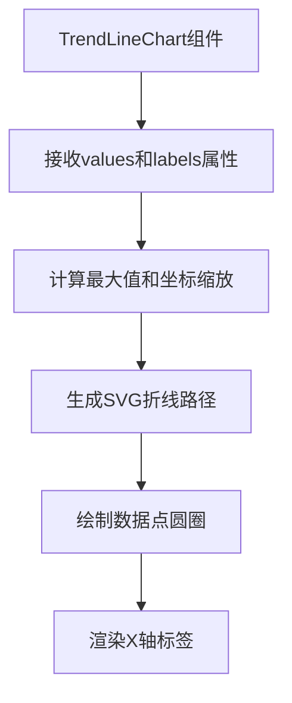
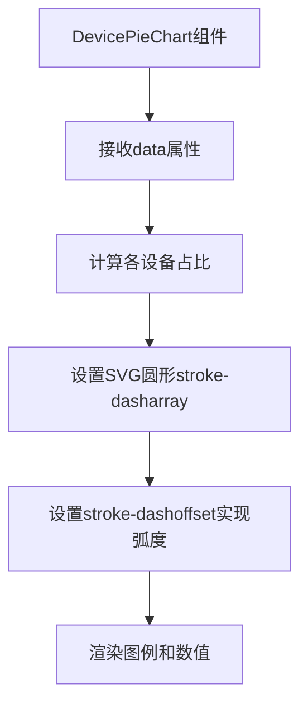
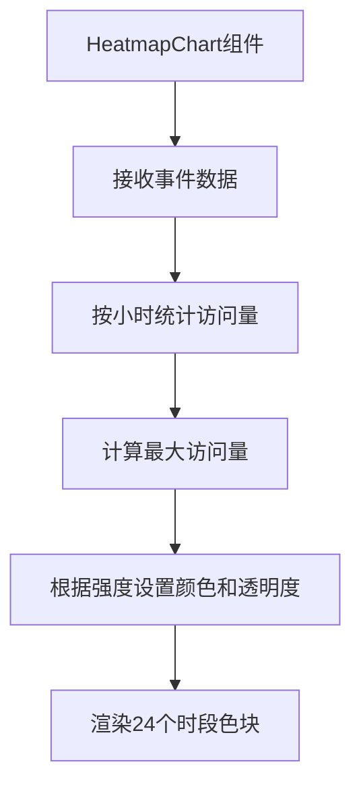

# 统计分析与可视化

<cite>
**本文档引用文件**  
- [StatsController.java](file://src/main/java/com/layor/tinyflow/Controller/StatsController.java)
- [StatsQuery.java](file://src/main/java/com/layor/tinyflow/dto/StatsQuery.java)
- [DetailedStatsDTO.java](file://src/main/java/com/layor/tinyflow/entity/DetailedStatsDTO.java)
- [DistributionDTO.java](file://src/main/java/com/layor/tinyflow/entity/DistributionDTO.java)
- [StatsPage.vue](file://web/src/pages/StatsPage.vue)
- [useStats.js](file://web/src/composables/useStats.js)
- [TrendLineChart.vue](file://web/src/components/charts/TrendLineChart.vue)
- [DevicePieChart.vue](file://web/src/components/charts/DevicePieChart.vue)
- [HeatmapChart.vue](file://web/src/components/charts/HeatmapChart.vue)
</cite>

## 目录
1. [系统概述](#系统概述)
2. [后端统计API接口](#后端统计api接口)
3. [查询参数与数据传输对象](#查询参数与数据传输对象)
4. [前端页面架构](#前端页面架构)
5. [图表组件集成与数据绑定](#图表组件集成与数据绑定)
6. [前后端交互示例](#前后端交互示例)
7. [常见问题排查指南](#常见问题排查指南)

## 系统概述

本系统实现了完整的短链接访问统计分析与前端可视化功能。后端通过 `StatsController` 提供多种统计API端点，支持按时间、设备、地域、来源等多维度的数据查询。前端通过 `StatsPage.vue` 页面集成多种ECharts风格的图表组件，实现数据的可视化展示。系统采用前后端分离架构，通过RESTful API进行数据交互，支持筛选、导出等交互功能。

## 后端统计API接口

`StatsController` 类定义了多个统计相关的API端点，均位于 `/api/stats` 路径下，提供丰富的统计分析功能。

### 趋势分析接口
- **端点**: `GET /trend/{shortCode}`
- **功能**: 获取指定短链接在指定天数内的每日访问趋势数据
- **参数**: `shortCode`（短码），`days`（天数，默认7天）
- **返回**: `List<DailyVisitTrendDTO>`，包含日期和访问量的列表

### 分布统计接口
- **端点**: `POST /distribution`
- **功能**: 获取指定短链接的访问分布统计信息，支持多维度筛选
- **参数**: `StatsQuery` 对象，包含短码、时间范围、来源、设备、城市等筛选条件
- **返回**: `DistributionDTO`，包含Referer、设备、城市等分布数据

### 事件详情接口
- **端点**: `POST /events`
- **功能**: 获取指定短链接的点击事件详情列表
- **参数**: `StatsQuery` 对象，支持分页和多维度筛选
- **返回**: `List<ClickEventDTO>`，包含详细的点击事件信息

### 全局统计接口
- **端点**: `GET /global`
- **功能**: 获取系统的全局统计数据
- **参数**: 可选的时间范围（start, end）
- **返回**: `GlobalStatsDTO`，包含系统级别的统计指标

### 维度分布接口
系统提供多个维度的分布统计接口，均通过 `GET` 方法访问：
- **小时分布**: `/hour/{shortCode}` - 返回24小时访问分布
- **星期分布**: `/weekday/{shortCode}` - 返回一周七天的访问分布
- **设备分布**: `/device/{shortCode}` - 返回移动、桌面等设备访问分布
- **浏览器分布**: `/browser/{shortCode}` - 返回各浏览器访问分布
- **国家分布**: `/country/{shortCode}` - 返回国家/地区访问分布
- **来源分布**: `/referer/{shortCode}` - 返回Referer详细分布
- **PV/UV数据**: `/pvuv/{shortCode}` - 返回页面访问量和独立访客数

**Section sources**
- [StatsController.java](file://src/main/java/com/layor/tinyflow/Controller/StatsController.java#L26-L178)

## 查询参数与数据传输对象

### StatsQuery查询参数对象
`StatsQuery` 类定义了统计查询的通用参数结构，作为POST请求的请求体。

```java
@Data
public class StatsQuery {
    private String code;      // 短链接码
    private String start;     // 开始时间
    private String end;       // 结束时间
    private String source;    // 来源筛选
    private String device;    // 设备筛选
    private String city;      // 城市筛选
    private Integer page;     // 页码
    private Integer size;     // 每页大小
}
```

该对象支持灵活的过滤逻辑，前端可通过组合不同的筛选条件进行数据查询。所有字段均为可选，未提供的字段将不参与筛选。

### 数据传输对象（DTO）
系统使用多种DTO来封装返回的统计数据：

#### DetailedStatsDTO
包含所有维度的详细统计数据：
- 基础指标：PV、UV、PV/UV比率
- 时间分布：小时分布、星期分布
- 地理分布：国家分布、城市分布
- 技术分布：设备分布、浏览器分布
- 来源分布：来源域名分布、Referer详细分布
- 时间信息：首次访问时间、最后访问时间

#### DistributionDTO
用于分布统计接口的返回数据：
- `referer`: Referer分布列表
- `device`: 设备分布列表
- `city`: 城市分布列表

每个分布列表由 `KeyCountDTO` 对象组成，包含键（key）和计数（count）。

**Section sources**
- [StatsQuery.java](file://src/main/java/com/layor/tinyflow/dto/StatsQuery.java#L6-L15)
- [DetailedStatsDTO.java](file://src/main/java/com/layor/tinyflow/entity/DetailedStatsDTO.java#L17-L42)
- [DistributionDTO.java](file://src/main/java/com/layor/tinyflow/entity/DistributionDTO.java#L10-L13)

## 前端页面架构

`StatsPage.vue` 是统计分析功能的核心前端页面，采用Vue 3组合式API架构，通过 `useStats.js` 组合式函数与后端API进行交互。

### 页面结构
页面采用响应式布局，包含以下主要区域：
- **顶部操作栏**: 返回首页、数据看板、筛选、导出等操作按钮
- **核心指标卡片**: 展示总PV、总UV、今日PV、PV/UV比等关键指标
- **短链信息卡片**: 显示短码、短链地址、创建时间、原始链接等信息
- **趋势图表**: 使用折线图展示访问趋势
- **分布图表网格**: 包含小时分布、星期分布、设备分布、浏览器分布等多个分布图表
- **访问事件列表**: 显示最近的访问记录表格
- **筛选弹窗**: 提供时间、来源、设备、城市等筛选条件

### 数据流管理
页面通过多个响应式引用（ref）管理数据状态：
- `overview`: 短链概览数据
- `detailedStats`: 详细统计数据
- `eventsList`: 事件列表数据
- `trendLabels` 和 `trendValues`: 趋势图的标签和数值
- 各种分布数据：`hourDistribution`、`deviceDistribution` 等

### 组合式函数集成
页面通过 `useStats.js` 提供的组合式函数进行数据获取：
- `useFetchOverview`: 获取短链概览数据
- `useFetchTrend`: 获取趋势数据
- `useFetchDistribution`: 获取分布数据
- `useFetchEvents`: 获取事件列表数据
- `useCompareTrend`: 获取多短码趋势对比数据

**Section sources**
- [StatsPage.vue](file://web/src/pages/StatsPage.vue#L1-L800)
- [useStats.js](file://web/src/composables/useStats.js#L7-L255)

## 图表组件集成与数据绑定

### TrendLineChart时间趋势图
`TrendLineChart.vue` 组件用于展示时间趋势数据，采用SVG实现折线图。



**数据绑定机制**:
- `values`: 趋势数值数组，驱动折线高度
- `labels`: 标签数组，显示在X轴
- 组件通过 `computed` 属性自动计算坐标缩放和SVG路径

**Diagram sources**
- [TrendLineChart.vue](file://web/src/components/charts/TrendLineChart.vue#L1-L38)

### DevicePieChart设备占比图
`DevicePieChart.vue` 组件使用SVG圆形进度条实现设备占比的饼图展示。



**数据绑定机制**:
- `data`: 包含ios、android、pc等设备访问量的对象
- 组件通过计算 `offsets` 值来控制各设备弧度的起始位置
- 使用不同的颜色区分设备类型

**Diagram sources**
- [DevicePieChart.vue](file://web/src/components/charts/DevicePieChart.vue#L1-L55)

### HeatmapChart小时热度图
`HeatmapChart.vue` 组件用于展示24小时访问热力图，通过颜色深浅表示访问强度。



**数据绑定机制**:
- `data`: 点击事件列表，包含时间戳
- 组件内部通过 `computed` 属性 `hours` 按小时聚合数据
- `getCellStyle` 函数根据访问量强度返回相应的背景色和边框色

**Diagram sources**
- [HeatmapChart.vue](file://web/src/components/charts/HeatmapChart.vue#L1-L242)

### 其他图表组件
系统还包含其他专用图表组件：
- `BrowserOSChart.vue`: 浏览器和操作系统分布，通过UA字符串解析并统计
- `CityBarChart.vue`: 城市TOP10柱状图，使用CSS高度表示访问量
- `SourceHBarChart.vue`: 来源域名分布，水平条形图展示

**Section sources**
- [TrendLineChart.vue](file://web/src/components/charts/TrendLineChart.vue#L1-L38)
- [DevicePieChart.vue](file://web/src/components/charts/DevicePieChart.vue#L1-L55)
- [HeatmapChart.vue](file://web/src/components/charts/HeatmapChart.vue#L1-L242)
- [BrowserOSChart.vue](file://web/src/components/charts/BrowserOSChart.vue#L1-L308)
- [CityBarChart.vue](file://web/src/components/charts/CityBarChart.vue#L1-L21)

## 前后端交互示例

### 请求格式
#### 趋势分析请求
```
GET /api/stats/trend/demo123?days=7
```

#### 分布统计请求
```json
POST /api/stats/distribution
{
  "code": "demo123",
  "start": "2025-01-01",
  "end": "2025-01-31",
  "device": "mobile",
  "city": "上海",
  "page": 0,
  "size": 10
}
```

### 响应结构
#### 趋势数据响应
```json
[
  {"date": "2025-01-25", "visits": 121},
  {"date": "2025-01-26", "visits": 98},
  {"date": "2025-01-27", "visits": 156}
]
```

#### 分布数据响应
```json
{
  "referer": [
    {"key": "wechat", "count": 540},
    {"key": "direct", "count": 410}
  ],
  "device": [
    {"key": "mobile", "count": 860},
    {"key": "desktop", "count": 412}
  ],
  "city": [
    {"key": "上海", "count": 320},
    {"key": "北京", "count": 280}
  ]
}
```

### 错误处理
系统定义了标准的错误处理机制：
- `400 Bad Request`: 参数错误或缺失
- `401 Unauthorized`: 未登录或认证失败
- `403 Forbidden`: 无权访问该资源
- `404 Not Found`: 短码不存在
- `500 Internal Server Error`: 服务器内部错误

前端在 `useStats.js` 中统一处理错误，设置 `error` 状态并记录日志。

**Section sources**
- [StatsController.java](file://src/main/java/com/layor/tinyflow/Controller/StatsController.java#L26-L178)
- [useStats.js](file://web/src/composables/useStats.js#L7-L255)

## 常见问题排查指南

### 数据延迟问题
**现象**: 最新访问数据未及时显示
**排查步骤**:
1. 检查后端服务是否正常运行
2. 确认消息队列（RabbitMQ）是否正常工作
3. 检查ClickRecorderService是否正常消费消息
4. 验证缓存配置，确认是否因缓存导致延迟
5. 查看日志文件 `logback-spring.xml` 配置的日志输出

### 图表渲染异常
**现象**: 图表不显示或显示错误
**排查步骤**:
1. 检查网络请求是否成功，查看浏览器开发者工具的Network面板
2. 确认API返回数据格式是否正确
3. 检查组件的props绑定是否正确
4. 验证数据是否为空或格式错误
5. 查看控制台是否有JavaScript错误

### 筛选功能失效
**现象**: 应用筛选条件后数据未更新
**排查步骤**:
1. 检查筛选弹窗的表单数据绑定
2. 确认`applyFilters`方法是否正确调用`refreshAll`
3. 验证`StatsQuery`对象是否正确构建并传递
4. 检查后端接口是否正确处理筛选参数
5. 确认时间格式是否符合ISO 8601标准

### 导出功能问题
**现象**: CSV导出失败或文件内容错误
**排查步骤**:
1. 检查`exportStats`函数的`responseType`是否为`blob`
2. 确认后端`/export`接口是否正确设置`Content-Type`和`Content-Disposition`
3. 验证文件名编码是否正确处理
4. 检查浏览器是否阻止了自动下载
5. 确认后端是否有足够的内存处理大数据量导出

**Section sources**
- [StatsPage.vue](file://web/src/pages/StatsPage.vue#L271-L310)
- [useStats.js](file://web/src/composables/useStats.js#L241-L255)
- [StatsController.java](file://src/main/java/com/layor/tinyflow/Controller/StatsController.java#L73-L83)