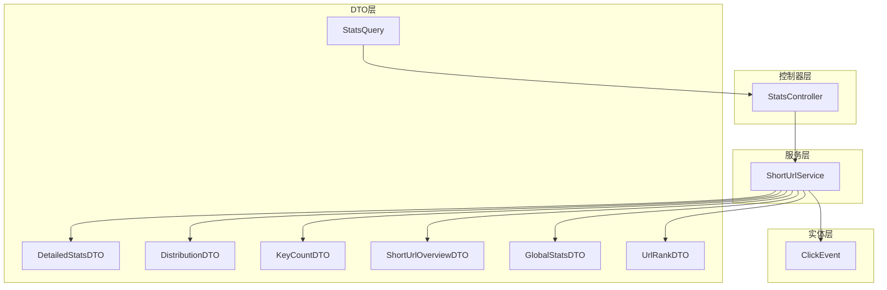
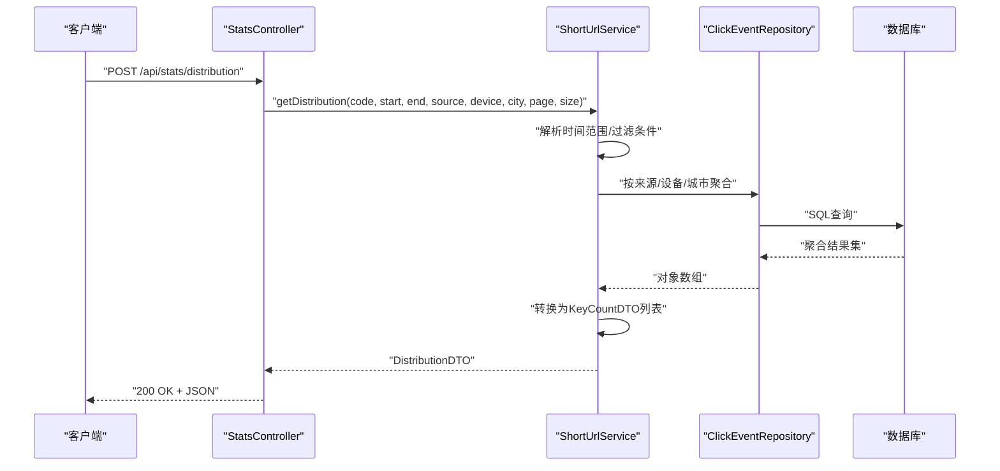
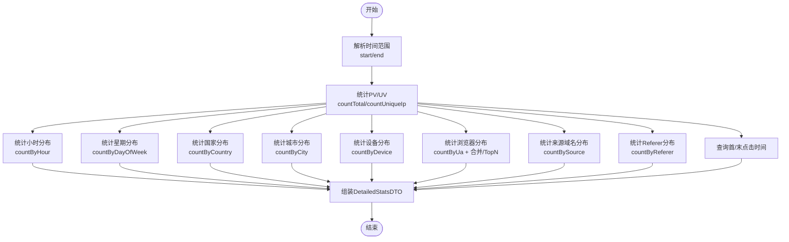
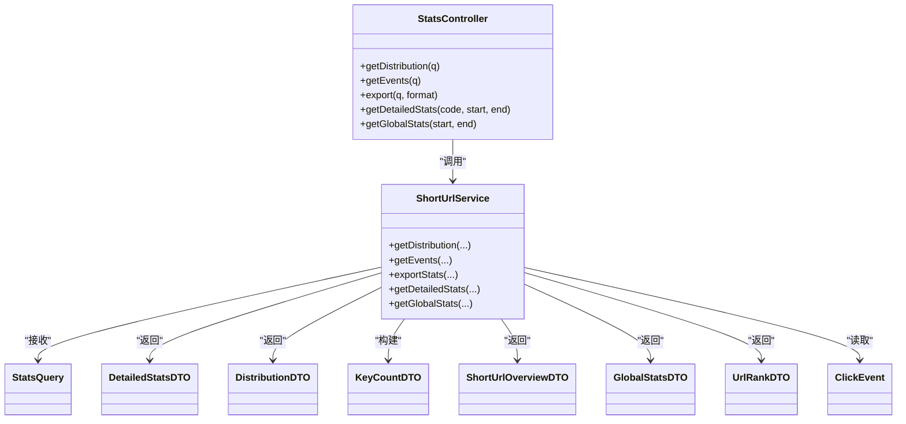

# 统计数据模型

<cite>
**本文引用的文件**
- [StatsQuery.java](file://src/main/java/com/layor/tinyflow/dto/StatsQuery.java)
- [DetailedStatsDTO.java](file://src/main/java/com/layor/tinyflow/entity/DetailedStatsDTO.java)
- [DistributionDTO.java](file://src/main/java/com/layor/tinyflow/entity/DistributionDTO.java)
- [KeyCountDTO.java](file://src/main/java/com/layor/tinyflow/entity/KeyCountDTO.java)
- [ShortUrlOverviewDTO.java](file://src/main/java/com/layor/tinyflow/entity/ShortUrlOverviewDTO.java)
- [GlobalStatsDTO.java](file://src/main/java/com/layor/tinyflow/entity/GlobalStatsDTO.java)
- [ClickEvent.java](file://src/main/java/com/layor/tinyflow/entity/ClickEvent.java)
- [UrlRankDTO.java](file://src/main/java/com/layor/tinyflow/entity/UrlRankDTO.java)
- [StatsController.java](file://src/main/java/com/layor/tinyflow/Controller/StatsController.java)
- [ShortUrlService.java](file://src/main/java/com/layor/tinyflow/service/ShortUrlService.java)
- [StatsControllerTest.java](file://src/test/java/com/layor/tinyflow/Controller/StatsControllerTest.java)
- [statistics-api.md](file://web/docs/statistics-api.md)
</cite>

## 目录
1. [简介](#简介)
2. [项目结构](#项目结构)
3. [核心组件](#核心组件)
4. [架构总览](#架构总览)
5. [详细组件分析](#详细组件分析)
6. [依赖分析](#依赖分析)
7. [性能考量](#性能考量)
8. [故障排查指南](#故障排查指南)
9. [结论](#结论)
10. [附录](#附录)

## 简介
本文件系统性梳理统计模块的数据传输对象（DTO）与查询参数载体，重点阐述：
- 各DTO字段、数据类型、语义与典型使用场景
- DetailedStatsDTO如何聚合多维度统计（PV/UV、小时、星期、设备、浏览器、城市、国家、来源、Referer分布）
- DistributionDTO如何封装多维度分布数据
- StatsQuery作为查询参数载体的结构设计
- KeyCountDTO作为通用计数数据结构在多个接口中的复用
- ShortUrlOverviewDTO与GlobalStatsDTO的简洁设计目的
- JSON序列化示例与与数据库实体（ClickEvent）的映射关系及数据聚合过程

## 项目结构
统计相关代码主要分布在以下位置：
- 控制器层：StatsController 提供对外接口
- 服务层：ShortUrlService 实现统计聚合逻辑
- DTO层：StatsQuery、DetailedStatsDTO、DistributionDTO、KeyCountDTO、ShortUrlOverviewDTO、GlobalStatsDTO、UrlRankDTO
- 实体层：ClickEvent 表示点击事件记录
- 文档：statistics-api.md 提供接口说明与示例

图表来源
- [StatsController.java](file://src/main/java/com/layor/tinyflow/Controller/StatsController.java#L1-L180)
- [ShortUrlService.java](file://src/main/java/com/layor/tinyflow/service/ShortUrlService.java#L403-L735)
- [StatsQuery.java](file://src/main/java/com/layor/tinyflow/dto/StatsQuery.java#L1-L16)
- [DetailedStatsDTO.java](file://src/main/java/com/layor/tinyflow/entity/DetailedStatsDTO.java#L1-L43)
- [DistributionDTO.java](file://src/main/java/com/layor/tinyflow/entity/DistributionDTO.java#L1-L14)
- [KeyCountDTO.java](file://src/main/java/com/layor/tinyflow/entity/KeyCountDTO.java#L1-L11)
- [ShortUrlOverviewDTO.java](file://src/main/java/com/layor/tinyflow/entity/ShortUrlOverviewDTO.java#L1-L17)
- [GlobalStatsDTO.java](file://src/main/java/com/layor/tinyflow/entity/GlobalStatsDTO.java#L1-L34)
- [UrlRankDTO.java](file://src/main/java/com/layor/tinyflow/entity/UrlRankDTO.java#L1-L19)
- [ClickEvent.java](file://src/main/java/com/layor/tinyflow/entity/ClickEvent.java#L1-L48)

章节来源
- [StatsController.java](file://src/main/java/com/layor/tinyflow/Controller/StatsController.java#L1-L180)
- [ShortUrlService.java](file://src/main/java/com/layor/tinyflow/service/ShortUrlService.java#L403-L735)

## 核心组件
本节概述各DTO与查询参数的职责与典型用法。

- StatsQuery：查询参数载体，承载短码、起止时间、来源、设备、城市、分页参数，用于过滤点击事件与导出数据。
- KeyCountDTO：通用计数结构，包含 label 与 count，广泛用于分布类统计的统一输出。
- DetailedStatsDTO：聚合型统计DTO，包含基础指标（PV/UV、比率）、时间分布（小时、星期）、地理分布（国家、城市）、技术分布（设备、浏览器）、来源分布（来源域名、Referer）与时间信息（首次/最后点击）。
- DistributionDTO：分布数据容器，封装 referer、device、city 三类分布。
- ShortUrlOverviewDTO：短链概览，包含总访问量、今日访问量与创建时间。
- GlobalStatsDTO：全局统计概览，包含总量、今日量、活跃短链、日趋势、设备分布、城市Top10、来源Top10、热门短链Top10。
- UrlRankDTO：热门短链排行项，包含短码、原始URL、总点击、今日点击。
- ClickEvent：点击事件实体，包含短码、时间戳、Referer、UA、IP、来源主机、设备类型、城市、国家等字段。

章节来源
- [StatsQuery.java](file://src/main/java/com/layor/tinyflow/dto/StatsQuery.java#L1-L16)
- [KeyCountDTO.java](file://src/main/java/com/layor/tinyflow/entity/KeyCountDTO.java#L1-L11)
- [DetailedStatsDTO.java](file://src/main/java/com/layor/tinyflow/entity/DetailedStatsDTO.java#L1-L43)
- [DistributionDTO.java](file://src/main/java/com/layor/tinyflow/entity/DistributionDTO.java#L1-L14)
- [ShortUrlOverviewDTO.java](file://src/main/java/com/layor/tinyflow/entity/ShortUrlOverviewDTO.java#L1-L17)
- [GlobalStatsDTO.java](file://src/main/java/com/layor/tinyflow/entity/GlobalStatsDTO.java#L1-L34)
- [UrlRankDTO.java](file://src/main/java/com/layor/tinyflow/entity/UrlRankDTO.java#L1-L19)
- [ClickEvent.java](file://src/main/java/com/layor/tinyflow/entity/ClickEvent.java#L1-L48)

## 架构总览
统计接口从控制器进入，经由服务层聚合ClickEvent数据，最终返回各类DTO。查询参数通过StatsQuery传入，服务层解析时间范围、过滤条件并执行聚合。

图表来源
- [StatsController.java](file://src/main/java/com/layor/tinyflow/Controller/StatsController.java#L52-L70)
- [ShortUrlService.java](file://src/main/java/com/layor/tinyflow/service/ShortUrlService.java#L403-L420)
- [ClickEvent.java](file://src/main/java/com/layor/tinyflow/entity/ClickEvent.java#L1-L48)

## 详细组件分析

### StatsQuery：查询参数载体
- 字段与类型
  - code: 字符串，短码
  - start: 字符串，起始日期（YYYY-MM-DD）
  - end: 字符串，结束日期（YYYY-MM-DD）
  - source: 字符串，来源主机过滤
  - device: 字符串，设备类型过滤
  - city: 字符串，城市过滤
  - page: 整数，页码（默认0）
  - size: 整数，每页大小（默认20）
- 设计要点
  - 统一承载过滤条件，便于服务层解析与传递
  - 支持分页参数，满足事件列表与导出场景
- 使用场景
  - 分布统计、事件列表、导出、详细统计、全局统计等

章节来源
- [StatsQuery.java](file://src/main/java/com/layor/tinyflow/dto/StatsQuery.java#L1-L16)
- [StatsController.java](file://src/main/java/com/layor/tinyflow/Controller/StatsController.java#L52-L83)
- [ShortUrlService.java](file://src/main/java/com/layor/tinyflow/service/ShortUrlService.java#L422-L435)

### KeyCountDTO：通用计数结构
- 字段与类型
  - label: 字符串，键标签（如设备类型、城市名、浏览器名、小时字符串等）
  - count: 长整型，计数值
- 设计要点
  - 统一输出格式，便于前端组件直接消费
  - 广泛用于分布统计的列表输出
- 使用场景
  - 小时分布、星期分布、国家/城市TopN、设备分布、浏览器分布、来源TopN、Referer分布、日趋势等

章节来源
- [KeyCountDTO.java](file://src/main/java/com/layor/tinyflow/entity/KeyCountDTO.java#L1-L11)
- [StatsControllerTest.java](file://src/test/java/com/layor/tinyflow/Controller/StatsControllerTest.java#L286-L389)

### DetailedStatsDTO：聚合型统计DTO
- 字段与类型
  - 基础指标
    - pv: 长整型，页面访问量
    - uv: 长整型，独立访客数
    - pvUvRatio: 双精度，PV/UV比率
  - 时间分布
    - hourDistribution: 列表<KeyCountDTO>，24小时分布
    - weekdayDistribution: 列表<KeyCountDTO>，星期分布
  - 地理分布
    - countryDistribution: 列表<KeyCountDTO>，国家分布（限制TopN）
    - cityDistribution: 列表<KeyCountDTO>，城市分布（限制TopN）
  - 技术分布
    - deviceDistribution: 列表<KeyCountDTO>，设备分布
    - browserDistribution: 列表<KeyCountDTO>，浏览器分布（限制TopN）
  - 来源分布
    - sourceDistribution: 列表<KeyCountDTO>，来源域名分布（限制TopN）
    - refererDistribution: 列表<KeyCountDTO>，Referer详细分布（限制TopN）
  - 时间信息
    - firstClick: 时间戳，首次访问时间
    - lastClick: 时间戳，最后访问时间
- 聚合逻辑要点
  - 基础指标：通过ClickEventRepository统计总点击与唯一IP
  - 时间分布：按小时与星期聚合，格式化为“HH:00”与“周一/周二…”
  - 地理分布：按国家/城市聚合，限制TopN
  - 技术分布：按设备与UA聚合，浏览器合并与TopN限制
  - 来源分布：按来源主机与Referer聚合，限制TopN
  - 时间信息：查询首尾点击时间
- 使用场景
  - 详情页综合统计面板

图表来源
- [ShortUrlService.java](file://src/main/java/com/layor/tinyflow/service/ShortUrlService.java#L554-L594)
- [ClickEvent.java](file://src/main/java/com/layor/tinyflow/entity/ClickEvent.java#L1-L48)

章节来源
- [DetailedStatsDTO.java](file://src/main/java/com/layor/tinyflow/entity/DetailedStatsDTO.java#L1-L43)
- [ShortUrlService.java](file://src/main/java/com/layor/tinyflow/service/ShortUrlService.java#L554-L594)
- [StatsControllerTest.java](file://src/test/java/com/layor/tinyflow/Controller/StatsControllerTest.java#L190-L248)

### DistributionDTO：多维度分布容器
- 字段与类型
  - referer: 列表<KeyCountDTO>，Referer分布
  - device: 列表<KeyCountDTO>，设备分布
  - city: 列表<KeyCountDTO>，城市分布
- 设计要点
  - 以三类分布为核心，便于前端按需渲染
  - 与StatsQuery配合，支持来源、设备、城市过滤
- 使用场景
  - 分布统计接口返回

章节来源
- [DistributionDTO.java](file://src/main/java/com/layor/tinyflow/entity/DistributionDTO.java#L1-L14)
- [ShortUrlService.java](file://src/main/java/com/layor/tinyflow/service/ShortUrlService.java#L403-L413)
- [StatsControllerTest.java](file://src/test/java/com/layor/tinyflow/Controller/StatsControllerTest.java#L131-L158)

### ShortUrlOverviewDTO：短链概览
- 字段与类型
  - totalVisits: 长整型，总访问量
  - todayVisits: 整型，今日访问量
  - createdAt: 时间戳，创建时间
- 设计要点
  - 简洁直观，适合顶部卡片展示
- 使用场景
  - 详情页概览卡片

章节来源
- [ShortUrlOverviewDTO.java](file://src/main/java/com/layor/tinyflow/entity/ShortUrlOverviewDTO.java#L1-L17)
- [ShortUrlService.java](file://src/main/java/com/layor/tinyflow/service/ShortUrlService.java#L367-L384)
- [StatsControllerTest.java](file://src/test/java/com/layor/tinyflow/Controller/StatsControllerTest.java#L53-L71)

### GlobalStatsDTO：全局统计概览
- 字段与类型
  - 基础汇总
    - totalUrls: 长整型，总短链数
    - totalClicks: 长整型，总点击数（PV）
    - totalUniqueIps: 长整型，总独立访客（UV）
    - todayClicks: 长整型，今日点击
    - activeUrls: 长整型，活跃短链数（今日有点击）
  - 趋势数据
    - dailyTrend: 列表<KeyCountDTO>，日趋势
  - 分布数据
    - deviceDistribution: 列表<KeyCountDTO>，设备分布
    - cityTop10: 列表<KeyCountDTO>，城市Top10
    - sourceTop10: 列表<KeyCountDTO>，来源Top10
  - 排行榜
    - topUrls: 列表<UrlRankDTO>，热门短链Top10
- 设计要点
  - 覆盖全局视角的关键指标与TopN，便于仪表盘展示
- 使用场景
  - 仪表盘/全局看板

章节来源
- [GlobalStatsDTO.java](file://src/main/java/com/layor/tinyflow/entity/GlobalStatsDTO.java#L1-L34)
- [ShortUrlService.java](file://src/main/java/com/layor/tinyflow/service/ShortUrlService.java#L599-L641)
- [StatsControllerTest.java](file://src/test/java/com/layor/tinyflow/Controller/StatsControllerTest.java#L250-L283)

### UrlRankDTO：热门短链排行项
- 字段与类型
  - shortCode: 字符串，短码
  - longUrl: 字符串，原始URL
  - totalClicks: 长整型，总点击数
  - todayClicks: 整型，今日点击数
- 设计要点
  - 与GlobalStatsDTO的topUrls配合，形成榜单
- 使用场景
  - 全局TopN排行

章节来源
- [UrlRankDTO.java](file://src/main/java/com/layor/tinyflow/entity/UrlRankDTO.java#L1-L19)
- [GlobalStatsDTO.java](file://src/main/java/com/layor/tinyflow/entity/GlobalStatsDTO.java#L1-L34)

### ClickEvent：点击事件实体
- 字段与类型
  - id: 长整型，主键
  - shortCode: 字符串，短码
  - ts: 时间戳，点击时间
  - referer: 字符串，Referer
  - ua: 字符串，User-Agent
  - ip: 字符串，IP
  - sourceHost: 字符串，来源主机
  - deviceType: 字符串，设备类型
  - city: 字符串，城市
  - country: 字符串，国家
- 设计要点
  - 与统计维度一一对应，是聚合的基础数据源
  - 索引优化（如按short_code与ts组合索引）
- 使用场景
  - 所有统计聚合的原始数据来源

章节来源
- [ClickEvent.java](file://src/main/java/com/layor/tinyflow/entity/ClickEvent.java#L1-L48)

## 依赖分析
- 控制器到服务层：StatsController 通过ShortUrlService暴露接口，接收StatsQuery并返回DTO
- 服务层到仓库：ShortUrlService调用ClickEventRepository执行聚合查询
- DTO复用：KeyCountDTO贯穿小时/星期/国家/城市/设备/浏览器/来源/Referer等分布输出
- 全局与详情：GlobalStatsDTO与DetailedStatsDTO分别覆盖全局与单短链的聚合视图

图表来源
- [StatsController.java](file://src/main/java/com/layor/tinyflow/Controller/StatsController.java#L1-L180)
- [ShortUrlService.java](file://src/main/java/com/layor/tinyflow/service/ShortUrlService.java#L403-L735)
- [StatsQuery.java](file://src/main/java/com/layor/tinyflow/dto/StatsQuery.java#L1-L16)
- [DetailedStatsDTO.java](file://src/main/java/com/layor/tinyflow/entity/DetailedStatsDTO.java#L1-L43)
- [DistributionDTO.java](file://src/main/java/com/layor/tinyflow/entity/DistributionDTO.java#L1-L14)
- [KeyCountDTO.java](file://src/main/java/com/layor/tinyflow/entity/KeyCountDTO.java#L1-L11)
- [ShortUrlOverviewDTO.java](file://src/main/java/com/layor/tinyflow/entity/ShortUrlOverviewDTO.java#L1-L17)
- [GlobalStatsDTO.java](file://src/main/java/com/layor/tinyflow/entity/GlobalStatsDTO.java#L1-L34)
- [UrlRankDTO.java](file://src/main/java/com/layor/tinyflow/entity/UrlRankDTO.java#L1-L19)
- [ClickEvent.java](file://src/main/java/com/layor/tinyflow/entity/ClickEvent.java#L1-L48)

章节来源
- [StatsController.java](file://src/main/java/com/layor/tinyflow/Controller/StatsController.java#L1-L180)
- [ShortUrlService.java](file://src/main/java/com/layor/tinyflow/service/ShortUrlService.java#L403-L735)

## 性能考量
- 时间范围解析：服务层对start/end进行默认值处理，避免无效查询
- 过滤条件：空字符串转为null，减少无效过滤
- 分页：事件列表与导出默认最大条目限制，避免超大数据集
- TopN限制：国家/城市/来源/浏览器等分布限制TopN，控制响应体积
- 缓存策略：服务层具备缓存回填与降级逻辑，有助于提升热点短链的响应速度

章节来源
- [ShortUrlService.java](file://src/main/java/com/layor/tinyflow/service/ShortUrlService.java#L482-L510)
- [StatsController.java](file://src/main/java/com/layor/tinyflow/Controller/StatsController.java#L52-L83)

## 故障排查指南
- 参数校验
  - 短链不存在：返回404
  - 无权限访问：返回403
  - 参数为空：服务层对空字符串转null，避免误过滤
- 导出格式
  - 默认CSV；format=json时返回JSON数组
- 常见问题定位
  - 分布数据为空：确认过滤条件（source/device/city）是否过于严格
  - 事件列表为空：确认时间范围与分页参数
  - 全局统计异常：检查数据库连接与索引

章节来源
- [StatsController.java](file://src/main/java/com/layor/tinyflow/Controller/StatsController.java#L1-L180)
- [StatsControllerTest.java](file://src/test/java/com/layor/tinyflow/Controller/StatsControllerTest.java#L1-L200)

## 结论
本统计模型以StatsQuery为入口，通过KeyCountDTO统一计数输出，结合DetailedStatsDTO与GlobalStatsDTO分别覆盖单短链与全局视角的聚合视图。DistributionDTO聚焦三类关键分布，配合ClickEvent实体实现高效、可扩展的统计能力。整体设计兼顾易用性与性能，适配企业级统计场景。

## 附录

### JSON序列化示例（基于测试与接口文档）
- 短链概览
  - 请求：GET /api/stats/overview/{shortCode}
  - 响应示例（对象）：
    - totalVisits: 数字
    - todayVisits: 数字
    - createdAt: ISO时间戳
- 详细统计（部分字段）
  - 请求：GET /api/stats/detailed/{shortCode}?start=YYYY-MM-DD&end=YYYY-MM-DD
  - 响应示例（对象，节选字段）：
    - pv: 数字
    - uv: 数字
    - pvUvRatio: 数字
    - hourDistribution: 数组（元素为{label, count}）
    - weekdayDistribution: 数组（元素为{label, count}）
    - countryDistribution: 数组（元素为{label, count}）
    - cityDistribution: 数组（元素为{label, count}）
    - deviceDistribution: 数组（元素为{label, count}）
    - browserDistribution: 数组（元素为{label, count}）
    - sourceDistribution: 数组（元素为{label, count}）
    - refererDistribution: 数组（元素为{label, count}）
    - firstClick: ISO时间戳
    - lastClick: ISO时间戳
- 全局统计
  - 请求：GET /api/stats/global
  - 响应示例（对象）：
    - totalUrls: 数字
    - totalClicks: 数字
    - totalUniqueIps: 数字
    - todayClicks: 数字
    - activeUrls: 数字
    - dailyTrend: 数组（元素为{label, count}）
    - deviceDistribution: 数组（元素为{label, count}）
    - cityTop10: 数组（元素为{label, count}）
    - sourceTop10: 数组（元素为{label, count}）
    - topUrls: 数组（元素为{shortCode, longUrl, totalClicks, todayClicks}）

章节来源
- [StatsControllerTest.java](file://src/test/java/com/layor/tinyflow/Controller/StatsControllerTest.java#L53-L71)
- [StatsControllerTest.java](file://src/test/java/com/layor/tinyflow/Controller/StatsControllerTest.java#L190-L248)
- [StatsControllerTest.java](file://src/test/java/com/layor/tinyflow/Controller/StatsControllerTest.java#L250-L283)
- [statistics-api.md](file://web/docs/statistics-api.md#L54-L128)

### 与数据库实体的映射关系与聚合过程
- ClickEvent字段与统计维度映射
  - shortCode → 短码过滤
  - ts → 时间维度（小时、星期、日趋势）
  - sourceHost → 来源域名
  - deviceType → 设备类型
  - city/country → 地理分布
  - referer → Referer分布
  - ua → 浏览器分布（解析User-Agent）
- 聚合过程
  - 服务层根据StatsQuery解析时间范围与过滤条件
  - 通过ClickEventRepository执行SQL聚合（按维度分组、计数）
  - 将聚合结果映射为KeyCountDTO列表
  - 组装为DetailedStatsDTO、DistributionDTO、GlobalStatsDTO等

章节来源
- [ClickEvent.java](file://src/main/java/com/layor/tinyflow/entity/ClickEvent.java#L1-L48)
- [ShortUrlService.java](file://src/main/java/com/layor/tinyflow/service/ShortUrlService.java#L403-L735)