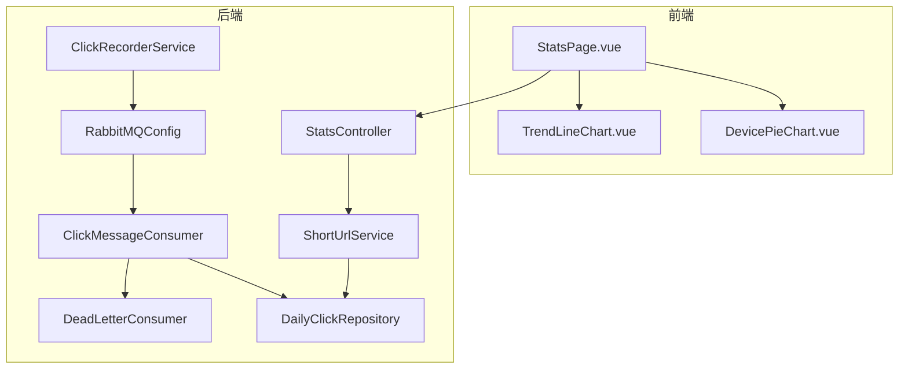
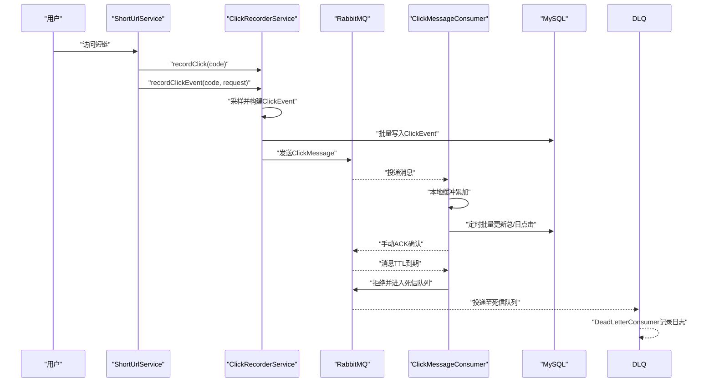
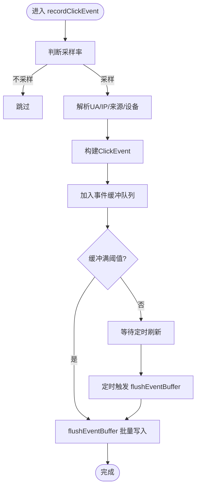
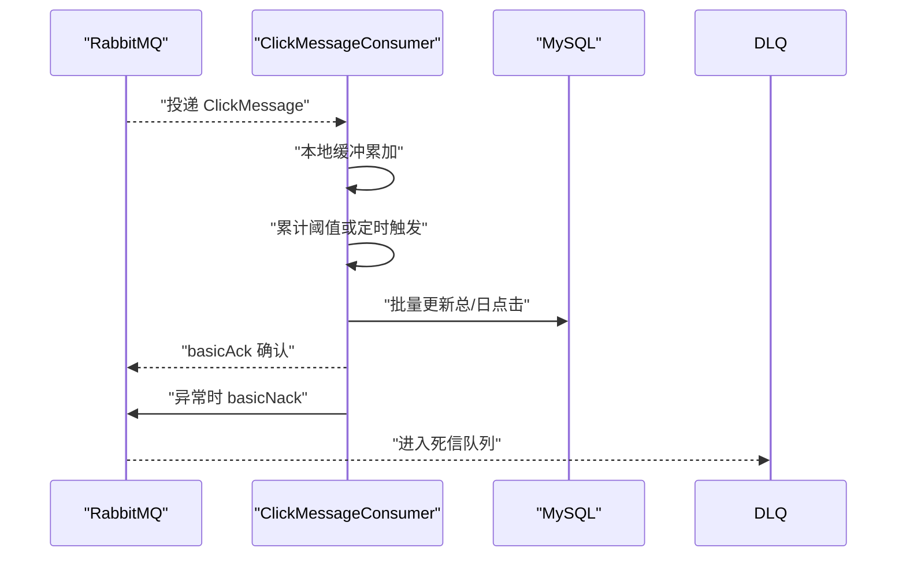
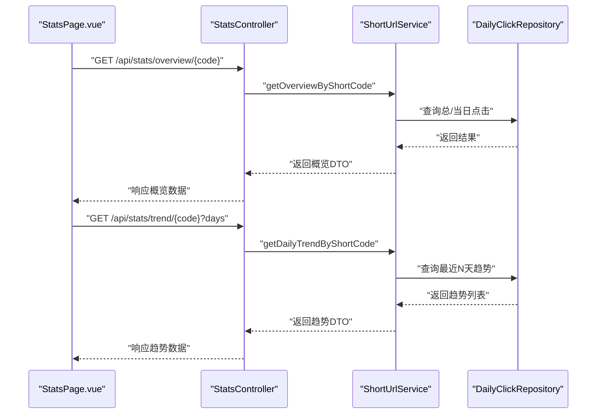
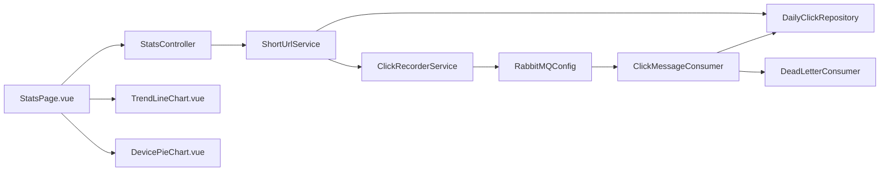

# 统计服务

<cite>
**本文引用的文件**
- [StatsController.java](file://src/main/java/com/layor/tinyflow/Controller/StatsController.java)
- [ShortUrlService.java](file://src/main/java/com/layor/tinyflow/service/ShortUrlService.java)
- [ClickRecorderService.java](file://src/main/java/com/layor/tinyflow/service/ClickRecorderService.java)
- [ClickMessageConsumer.java](file://src/main/java/com/layor/tinyflow/service/ClickMessageConsumer.java)
- [DeadLetterConsumer.java](file://src/main/java/com/layor/tinyflow/service/DeadLetterConsumer.java)
- [RabbitMQConfig.java](file://src/main/java/com/layor/tinyflow/config/RabbitMQConfig.java)
- [ClickMessage.java](file://src/main/java/com/layor/tinyflow/entity/ClickMessage.java)
- [DailyClickRepository.java](file://src/main/java/com/layor/tinyflow/repository/DailyClickRepository.java)
- [application.yml](file://src/main/resources/application.yml)
- [StatsPage.vue](file://web/src/pages/StatsPage.vue)
- [TrendLineChart.vue](file://web/src/components/charts/TrendLineChart.vue)
- [DevicePieChart.vue](file://web/src/components/charts/DevicePieChart.vue)
- [CircuitBreakerEventListener.java](file://src/main/java/com/layor/tinyflow/listener/CircuitBreakerEventListener.java)
</cite>

## 目录
1. [简介](#简介)
2. [项目结构](#项目结构)
3. [核心组件](#核心组件)
4. [架构总览](#架构总览)
5. [详细组件分析](#详细组件分析)
6. [依赖关系分析](#依赖关系分析)
7. [性能与可靠性](#性能与可靠性)
8. [故障排查指南](#故障排查指南)
9. [结论](#结论)
10. [附录](#附录)

## 简介
本文件系统性介绍统计服务的架构与功能，覆盖从用户点击短链触发事件，经 RabbitMQ 异步投递到 ClickRecorderService 进行处理，再到 MySQL 的持久化闭环；说明如何利用死信队列与手动 ACK 保障消息不丢失；详述 StatsController 提供的多维统计查询 API；以及前端 StatsPage.vue 与图表组件（如 TrendLineChart、DevicePieChart）如何消费 API 并进行可视化展示；同时涵盖 CircuitBreakerEventListener 在统计链路故障时的降级与告警处理。

## 项目结构
统计服务横跨后端 Spring Boot 与前端 Vue 两部分：
- 后端模块
  - 控制层：StatsController 提供统计查询接口
  - 业务层：ShortUrlService 聚合统计计算与数据聚合
  - 事件处理：ClickRecorderService 负责点击计数与事件采样、Redis 快照与定时落库；ClickMessageConsumer 负责 MQ 消费与批量刷库
  - 配置：RabbitMQConfig 定义队列、死信队列与消息转换器；application.yml 提供运行时开关与熔断/限流配置
  - 存储：DailyClickRepository 等 JPA 仓库负责每日点击与趋势查询
- 前端模块
  - 页面：StatsPage.vue 负责筛选、拉取数据、渲染指标与图表
  - 图表：TrendLineChart.vue、DevicePieChart.vue 等组件负责可视化

**图表来源**
- [StatsPage.vue](file://web/src/pages/StatsPage.vue#L383-L473)
- [StatsController.java](file://src/main/java/com/layor/tinyflow/Controller/StatsController.java#L1-L180)
- [ShortUrlService.java](file://src/main/java/com/layor/tinyflow/service/ShortUrlService.java#L367-L789)
- [ClickRecorderService.java](file://src/main/java/com/layor/tinyflow/service/ClickRecorderService.java#L1-L253)
- [ClickMessageConsumer.java](file://src/main/java/com/layor/tinyflow/service/ClickMessageConsumer.java#L1-L149)
- [DeadLetterConsumer.java](file://src/main/java/com/layor/tinyflow/service/DeadLetterConsumer.java#L1-L57)
- [RabbitMQConfig.java](file://src/main/java/com/layor/tinyflow/config/RabbitMQConfig.java#L1-L125)
- [DailyClickRepository.java](file://src/main/java/com/layor/tinyflow/repository/DailyClickRepository.java#L1-L51)

**章节来源**
- [StatsController.java](file://src/main/java/com/layor/tinyflow/Controller/StatsController.java#L1-L180)
- [ShortUrlService.java](file://src/main/java/com/layor/tinyflow/service/ShortUrlService.java#L367-L789)
- [ClickRecorderService.java](file://src/main/java/com/layor/tinyflow/service/ClickRecorderService.java#L1-L253)
- [ClickMessageConsumer.java](file://src/main/java/com/layor/tinyflow/service/ClickMessageConsumer.java#L1-L149)
- [DeadLetterConsumer.java](file://src/main/java/com/layor/tinyflow/service/DeadLetterConsumer.java#L1-L57)
- [RabbitMQConfig.java](file://src/main/java/com/layor/tinyflow/config/RabbitMQConfig.java#L1-L125)
- [DailyClickRepository.java](file://src/main/java/com/layor/tinyflow/repository/DailyClickRepository.java#L1-L51)
- [StatsPage.vue](file://web/src/pages/StatsPage.vue#L383-L473)
- [TrendLineChart.vue](file://web/src/components/charts/TrendLineChart.vue#L1-L38)
- [DevicePieChart.vue](file://web/src/components/charts/DevicePieChart.vue#L1-L55)

## 核心组件
- StatsController：提供按短链码、时间范围、来源、设备、城市等维度的访问趋势、分布与事件明细查询，并支持导出 CSV/JSON。
- ShortUrlService：实现统计聚合、趋势计算、分布统计、导出、全局统计等；内部协调 ClickRecorderService 与数据库。
- ClickRecorderService：本地计数 + Redis 快照 + 定时落库；支持采样记录详细点击事件并批量入库。
- ClickMessageConsumer：MQ 消费者，批量累加并定时刷库，配合手动 ACK 与死信队列确保可靠性。
- DeadLetterConsumer：消费死信队列消息，记录日志并告警，避免堆积。
- RabbitMQConfig：定义点击队列、死信队列、消息转换器与发送确认回调。
- DailyClickRepository：JPA 仓库，提供每日点击、趋势查询与增量更新。
- StatsPage.vue：前端页面，封装筛选、API 调用、数据解析与图表渲染。
- TrendLineChart.vue、DevicePieChart.vue：通用图表组件，用于趋势与设备分布可视化。

**章节来源**
- [StatsController.java](file://src/main/java/com/layor/tinyflow/Controller/StatsController.java#L1-L180)
- [ShortUrlService.java](file://src/main/java/com/layor/tinyflow/service/ShortUrlService.java#L367-L789)
- [ClickRecorderService.java](file://src/main/java/com/layor/tinyflow/service/ClickRecorderService.java#L1-L253)
- [ClickMessageConsumer.java](file://src/main/java/com/layor/tinyflow/service/ClickMessageConsumer.java#L1-L149)
- [DeadLetterConsumer.java](file://src/main/java/com/layor/tinyflow/service/DeadLetterConsumer.java#L1-L57)
- [RabbitMQConfig.java](file://src/main/java/com/layor/tinyflow/config/RabbitMQConfig.java#L1-L125)
- [DailyClickRepository.java](file://src/main/java/com/layor/tinyflow/repository/DailyClickRepository.java#L1-L51)
- [StatsPage.vue](file://web/src/pages/StatsPage.vue#L383-L473)
- [TrendLineChart.vue](file://web/src/components/charts/TrendLineChart.vue#L1-L38)
- [DevicePieChart.vue](file://web/src/components/charts/DevicePieChart.vue#L1-L55)

## 架构总览
统计链路从“用户点击短链”开始，分为两条路径：
- MQ 路径：用户请求短链触发 ClickRecorderService.recordClickEvent，构建 ClickEvent 并写入数据库；同时向 RabbitMQ 发送 ClickMessage，消费者批量刷库并持久化到 MySQL。
- 本地/Redis 路径：ClickRecorderService.recordClick 采用本地计数 + Redis 快照 + 定时落库策略，保障高并发下的低延迟与高吞吐。

**图表来源**
- [ShortUrlService.java](file://src/main/java/com/layor/tinyflow/service/ShortUrlService.java#L288-L300)
- [ClickRecorderService.java](file://src/main/java/com/layor/tinyflow/service/ClickRecorderService.java#L82-L123)
- [ClickMessageConsumer.java](file://src/main/java/com/layor/tinyflow/service/ClickMessageConsumer.java#L47-L87)
- [DeadLetterConsumer.java](file://src/main/java/com/layor/tinyflow/service/DeadLetterConsumer.java#L29-L56)
- [RabbitMQConfig.java](file://src/main/java/com/layor/tinyflow/config/RabbitMQConfig.java#L69-L78)

**章节来源**
- [ShortUrlService.java](file://src/main/java/com/layor/tinyflow/service/ShortUrlService.java#L288-L300)
- [ClickRecorderService.java](file://src/main/java/com/layor/tinyflow/service/ClickRecorderService.java#L82-L123)
- [ClickMessageConsumer.java](file://src/main/java/com/layor/tinyflow/service/ClickMessageConsumer.java#L47-L87)
- [DeadLetterConsumer.java](file://src/main/java/com/layor/tinyflow/service/DeadLetterConsumer.java#L29-L56)
- [RabbitMQConfig.java](file://src/main/java/com/layor/tinyflow/config/RabbitMQConfig.java#L69-L78)

## 详细组件分析

### StatsController：统计查询 API
- 概览与趋势
  - GET /api/stats/overview/{shortCode}：总访问量、今日访问量等概览
  - GET /api/stats/trend/{shortCode}?days=N：近 N 天访问趋势
  - GET /api/stats/compare：多短链对比趋势
- 分布统计
  - POST /api/stats/distribution：来源、设备、城市等分布
  - GET /api/stats/hour/{shortCode}、/api/stats/weekday/{shortCode}、/api/stats/browser/{shortCode}、/api/stats/country/{shortCode}、/api/stats/referer/{shortCode}
- 事件明细与导出
  - POST /api/stats/events：点击事件列表（支持分页与筛选）
  - POST /api/stats/export?format=csv|json：导出 CSV/JSON
- 详细统计与全局统计
  - GET /api/stats/detailed/{shortCode}?start&end：详细 PV/UV、小时/星期分布、浏览器/国家/城市/来源/Referer 等
  - GET /api/stats/global?start&end：全局指标与趋势
- PV/UV
  - GET /api/stats/pvuv/{shortCode}?start&end：返回 pv、uv

这些接口均由 StatsController 调用 ShortUrlService 的对应方法实现，后者完成数据聚合与查询。

**章节来源**
- [StatsController.java](file://src/main/java/com/layor/tinyflow/Controller/StatsController.java#L20-L179)
- [ShortUrlService.java](file://src/main/java/com/layor/tinyflow/service/ShortUrlService.java#L367-L789)

### ClickRecorderService：事件采样与本地/Redis/数据库三段式持久化
- 采样记录点击事件
  - recordClickEvent：根据采样率生成 ClickEvent，解析 UA、IP、来源主机、设备类型，地理位置解析（可选），加入批量缓冲队列，超过阈值或定时触发 flushEventBuffer 写入数据库。
- 本地计数与 Redis 快照
  - recordClick：本地原子计数；每 10 秒 snapshotToRedis 将本地计数快照写入 Redis Hash，作为冷备份。
- 定时落库
  - 每 60 秒 syncFromRedisToDB 读取 Redis 快照，批量更新数据库，成功后清空快照。
- 采样率与模式
  - 采样率由 events.sampleRate 控制；clicks.mode 支持 local/redis/mq 等模式（当前以本地+Redis快照为主）。

**图表来源**
- [ClickRecorderService.java](file://src/main/java/com/layor/tinyflow/service/ClickRecorderService.java#L82-L157)

**章节来源**
- [ClickRecorderService.java](file://src/main/java/com/layor/tinyflow/service/ClickRecorderService.java#L1-L253)
- [application.yml](file://src/main/resources/application.yml#L133-L140)

### ClickMessageConsumer：MQ 消费与批量刷库
- 批量消费与手动 ACK
  - RabbitListener 监听 CLICK_QUEUE；每次累加本地缓冲，累计达阈值或定时触发 flushToDatabase；成功后 basicAck 手动确认。
- 重试与死信队列
  - 消费异常时 basicNack 并按 x-death 头部重试次数决定是否重新入队或发送至 DLQ。
- 刷库策略
  - 总点击与日点击分别批量更新，减少数据库压力。

**图表来源**
- [ClickMessageConsumer.java](file://src/main/java/com/layor/tinyflow/service/ClickMessageConsumer.java#L47-L148)
- [RabbitMQConfig.java](file://src/main/java/com/layor/tinyflow/config/RabbitMQConfig.java#L69-L78)

**章节来源**
- [ClickMessageConsumer.java](file://src/main/java/com/layor/tinyflow/service/ClickMessageConsumer.java#L1-L149)
- [RabbitMQConfig.java](file://src/main/java/com/layor/tinyflow/config/RabbitMQConfig.java#L1-L125)

### DeadLetterConsumer：死信队列处理
- 消费 DLX_QUEUE 中的消息，记录详细日志与头部信息，便于排障；完成后 basicAck 确认。
- 该组件在消息多次重试失败后介入，避免死信队列堆积。

**章节来源**
- [DeadLetterConsumer.java](file://src/main/java/com/layor/tinyflow/service/DeadLetterConsumer.java#L1-L57)

### RabbitMQConfig：队列、死信与确认
- 定义 CLICK_QUEUE 与 DLX_QUEUE，配置死信交换机与 TTL（30 秒）。
- 配置 Jackson2JsonMessageConverter 与 RabbitTemplate Confirm/Returns 回调，提升可靠性。

**章节来源**
- [RabbitMQConfig.java](file://src/main/java/com/layor/tinyflow/config/RabbitMQConfig.java#L1-L125)

### DailyClickRepository：每日点击与趋势查询
- 提供按短链码与日期查询、最近 N 天趋势、当日点击、批量增量更新等能力，支撑趋势与分布统计。

**章节来源**
- [DailyClickRepository.java](file://src/main/java/com/layor/tinyflow/repository/DailyClickRepository.java#L1-L51)

### StatsPage.vue 与图表组件：前端消费与可视化
- 数据拉取
  - fetchOverview、fetchDetailedStats、fetchTrend、fetchEvents：分别调用后端概览、详细统计、趋势、事件接口。
  - 支持筛选：开始/结束日期、来源、设备、城市；导出 CSV。
- 可视化
  - 访问趋势：TrendLineChart.vue 渲染折线图。
  - 设备分布：DevicePieChart.vue 渲染饼图。
  - 其他分布：页面内使用纯 HTML/样式实现柱状/列表/排行榜等。

**图表来源**
- [StatsPage.vue](file://web/src/pages/StatsPage.vue#L383-L473)
- [StatsController.java](file://src/main/java/com/layor/tinyflow/Controller/StatsController.java#L20-L179)
- [ShortUrlService.java](file://src/main/java/com/layor/tinyflow/service/ShortUrlService.java#L367-L401)
- [DailyClickRepository.java](file://src/main/java/com/layor/tinyflow/repository/DailyClickRepository.java#L15-L23)

**章节来源**
- [StatsPage.vue](file://web/src/pages/StatsPage.vue#L383-L473)
- [TrendLineChart.vue](file://web/src/components/charts/TrendLineChart.vue#L1-L38)
- [DevicePieChart.vue](file://web/src/components/charts/DevicePieChart.vue#L1-L55)

### CircuitBreakerEventListener：降级与告警
- 监听所有熔断器状态转换事件，当熔断打开/关闭时输出日志；可在 OPEN 时接入告警通道。
- 与 ShortUrlService 的 Redis 熔断器配合，实现快速失败与降级回退。

**章节来源**
- [CircuitBreakerEventListener.java](file://src/main/java/com/layor/tinyflow/listener/CircuitBreakerEventListener.java#L1-L58)
- [ShortUrlService.java](file://src/main/java/com/layor/tinyflow/service/ShortUrlService.java#L302-L366)
- [application.yml](file://src/main/resources/application.yml#L148-L211)

## 依赖关系分析
- 控制层依赖业务层；业务层依赖仓库与 ClickRecorderService；ClickRecorderService 依赖 RabbitTemplate 与 RedisTemplate；ClickMessageConsumer 依赖仓库与 Channel；RabbitMQConfig 为 MQ 与 DLQ 提供基础设施。
- 前端 StatsPage.vue 通过 axios 调用后端 API，图表组件独立于后端，仅依赖 props 数据。

**图表来源**
- [StatsController.java](file://src/main/java/com/layor/tinyflow/Controller/StatsController.java#L1-L180)
- [ShortUrlService.java](file://src/main/java/com/layor/tinyflow/service/ShortUrlService.java#L367-L789)
- [ClickRecorderService.java](file://src/main/java/com/layor/tinyflow/service/ClickRecorderService.java#L1-L253)
- [ClickMessageConsumer.java](file://src/main/java/com/layor/tinyflow/service/ClickMessageConsumer.java#L1-L149)
- [DeadLetterConsumer.java](file://src/main/java/com/layor/tinyflow/service/DeadLetterConsumer.java#L1-L57)
- [RabbitMQConfig.java](file://src/main/java/com/layor/tinyflow/config/RabbitMQConfig.java#L1-L125)
- [DailyClickRepository.java](file://src/main/java/com/layor/tinyflow/repository/DailyClickRepository.java#L1-L51)
- [StatsPage.vue](file://web/src/pages/StatsPage.vue#L383-L473)
- [TrendLineChart.vue](file://web/src/components/charts/TrendLineChart.vue#L1-L38)
- [DevicePieChart.vue](file://web/src/components/charts/DevicePieChart.vue#L1-L55)

**章节来源**
- 同上

## 性能与可靠性
- 异步解耦
  - 用户点击短链后立即返回，统计处理异步进行，降低请求延迟。
- 批量与缓冲
  - MQ 消费者批量缓冲与定时刷库；事件详细记录使用队列缓冲与阈值触发，减少数据库写放大。
- 本地/Redis 快照
  - ClickRecorderService 的本地计数与 Redis 快照在高并发下显著降低数据库压力。
- 手动 ACK 与死信队列
  - 消费者手动确认，异常消息进入死信队列，避免重复消费与堆积。
- 熔断与降级
  - Redis 熔断器在异常时快速失败并降级回退，结合 CircuitBreakerEventListener 输出告警日志。
- 采样控制
  - 通过 events.sampleRate 控制详细事件采样比例，平衡存储成本与分析价值。

[本节为通用指导，无需特定文件来源]

## 故障排查指南
- MQ 消息丢失
  - 检查 RabbitTemplate Confirm/Returns 回调日志；确认队列与死信队列配置；查看 ClickMessageConsumer 的 basicAck 与 basicNack 行为。
- 死信队列堆积
  - 查看 DeadLetterConsumer 是否正常消费；核对日志中消息头与正文；必要时临时放宽重试次数或调整 TTL。
- 数据不一致
  - 检查 ClickRecorderService 的 snapshotToRedis 与 syncFromRedisToDB 是否按预期执行；核对 Redis 快照键空间与清理逻辑。
- Redis 异常
  - 观察 CircuitBreakerEventListener 的熔断状态变化；确认 ShortUrlService 的 redisFallback 是否生效。
- 前端数据为空
  - 检查 StatsPage.vue 的筛选条件与 API 请求参数；确认后端接口返回的数据结构与字段映射。

**章节来源**
- [ClickMessageConsumer.java](file://src/main/java/com/layor/tinyflow/service/ClickMessageConsumer.java#L47-L148)
- [DeadLetterConsumer.java](file://src/main/java/com/layor/tinyflow/service/DeadLetterConsumer.java#L29-L56)
- [ClickRecorderService.java](file://src/main/java/com/layor/tinyflow/service/ClickRecorderService.java#L160-L246)
- [CircuitBreakerEventListener.java](file://src/main/java/com/layor/tinyflow/listener/CircuitBreakerEventListener.java#L1-L58)
- [StatsPage.vue](file://web/src/pages/StatsPage.vue#L383-L473)

## 结论
统计服务通过“本地计数 + Redis 快照 + 定时落库”的双通道设计，结合 RabbitMQ 的批量消费、手动 ACK 与死信队列，实现了高并发下的低延迟与高可靠性。后端 StatsController 提供丰富的统计 API，前端 StatsPage.vue 与图表组件将数据可视化，形成从采集、处理、存储到可视化的完整闭环。同时，Resilience4j 熔断与 CircuitBreakerEventListener 为链路稳定性提供了可观测与告警基础。

[本节为总结，无需特定文件来源]

## 附录
- 关键配置项
  - events.sampleRate：详细事件采样率
  - clicks.mode：点击计数模式（local/redis/mq）
  - resilience4j：熔断、重试、舱壁隔离配置
- 常用接口清单
  - GET /api/stats/overview/{shortCode}
  - GET /api/stats/trend/{shortCode}?days
  - GET /api/stats/detailed/{shortCode}?start&end
  - GET /api/stats/global?start&end
  - GET /api/stats/pvuv/{shortCode}?start&end
  - GET /api/stats/hour/{shortCode}?start&end
  - GET /api/stats/weekday/{shortCode}?start&end
  - GET /api/stats/browser/{shortCode}?start&end
  - GET /api/stats/country/{shortCode}?start&end
  - GET /api/stats/referer/{shortCode}?start&end
  - POST /api/stats/distribution
  - POST /api/stats/events
  - POST /api/stats/export?format=csv|json

[本节为概览，无需特定文件来源]