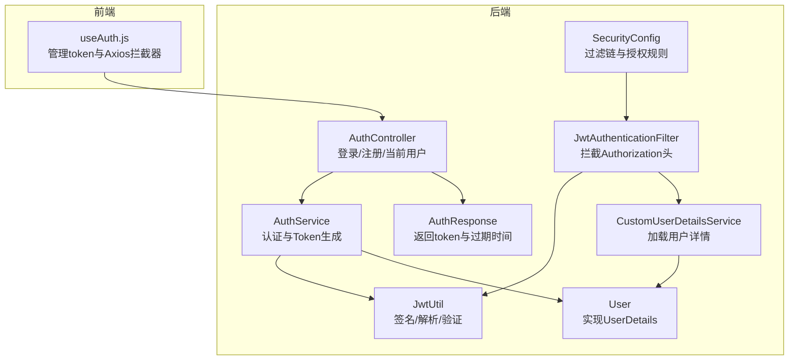
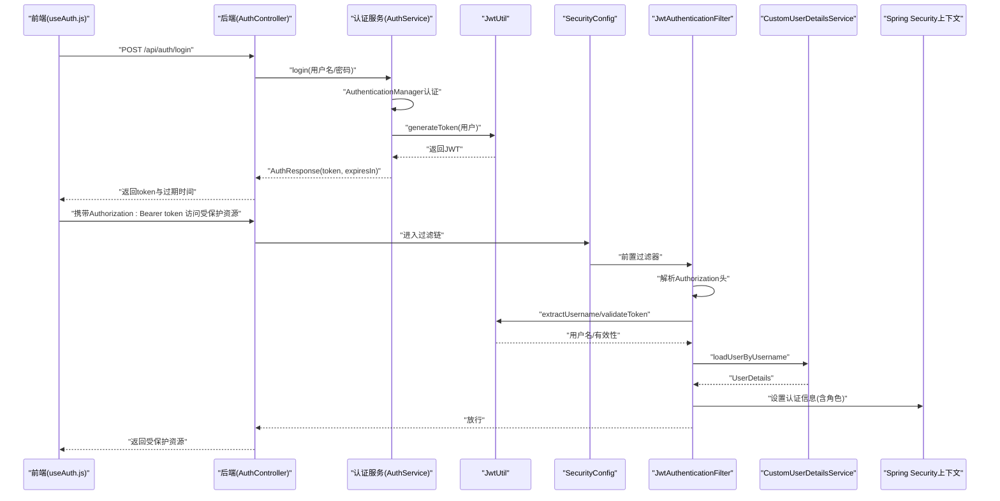
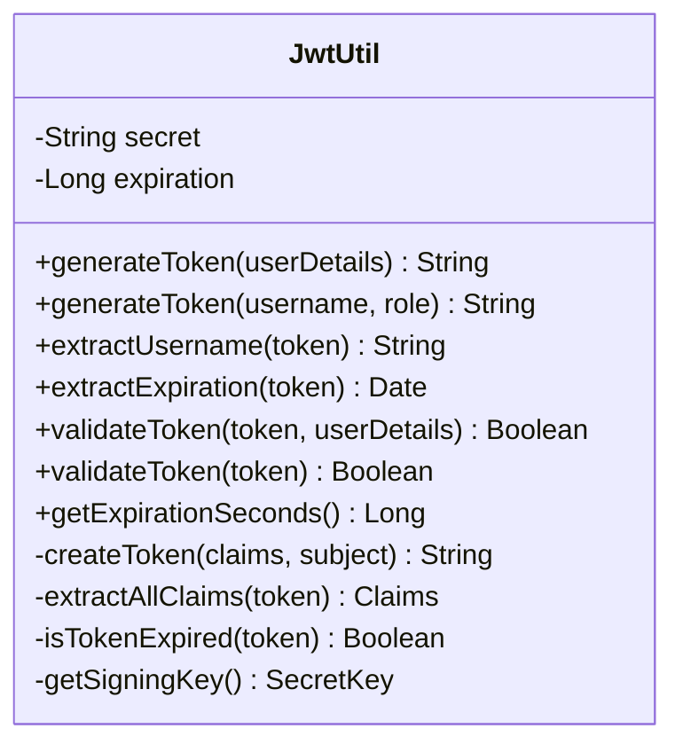
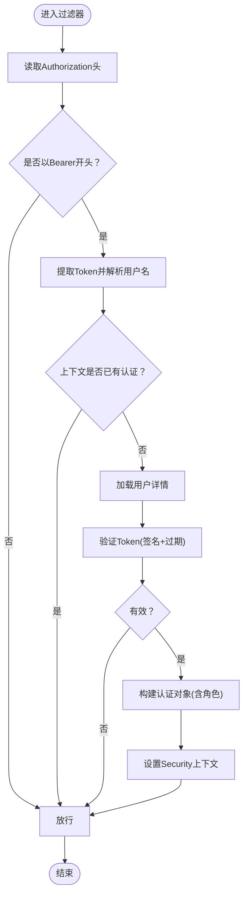
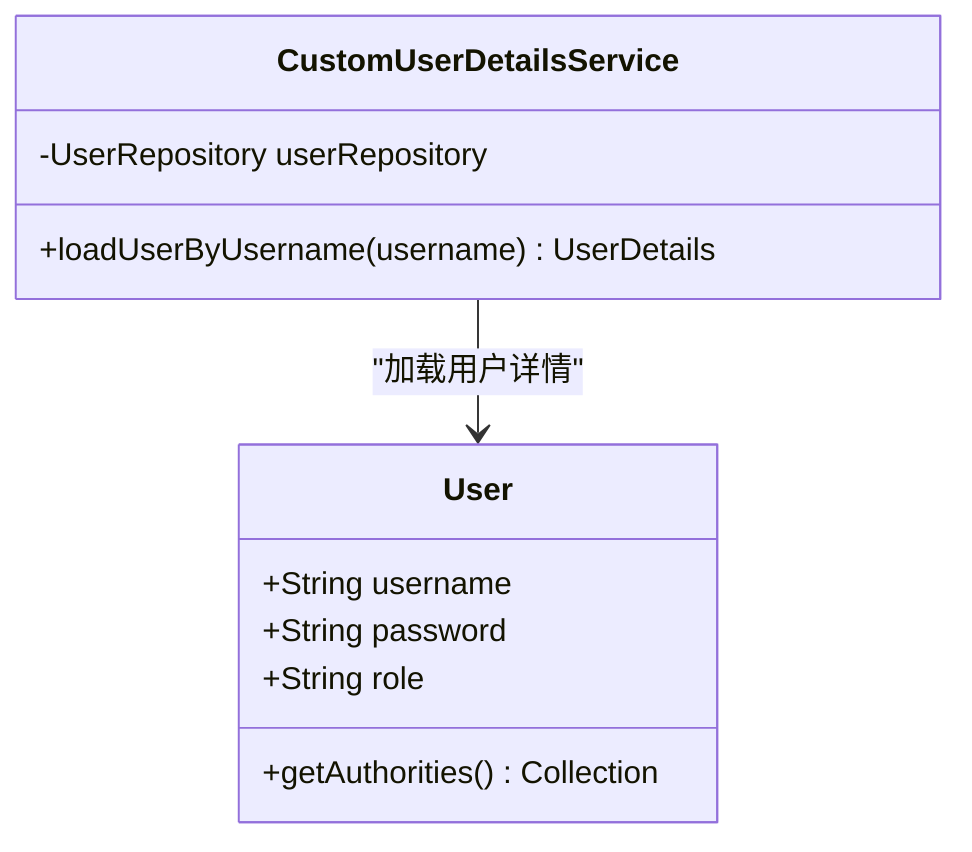
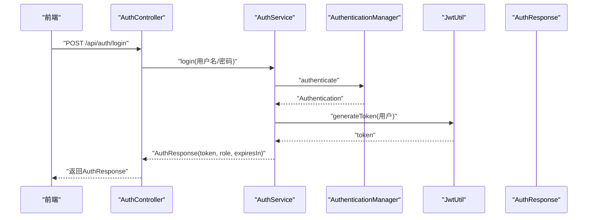
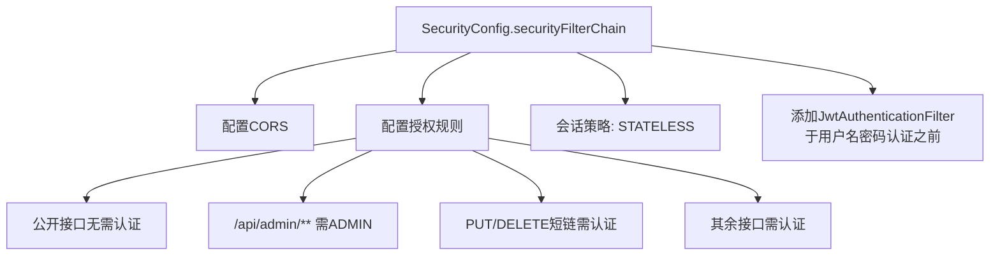
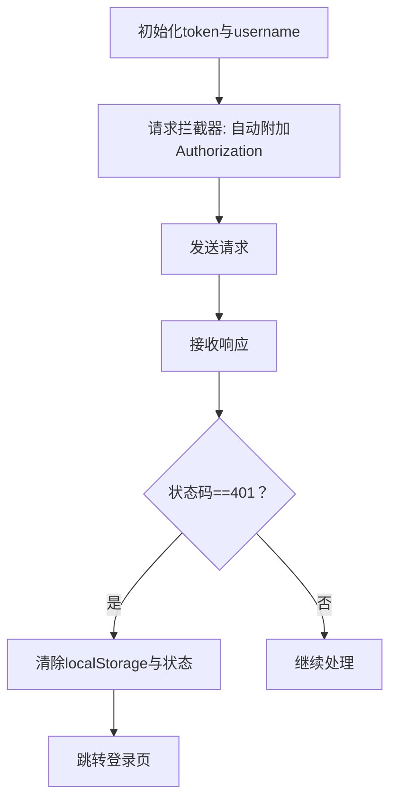
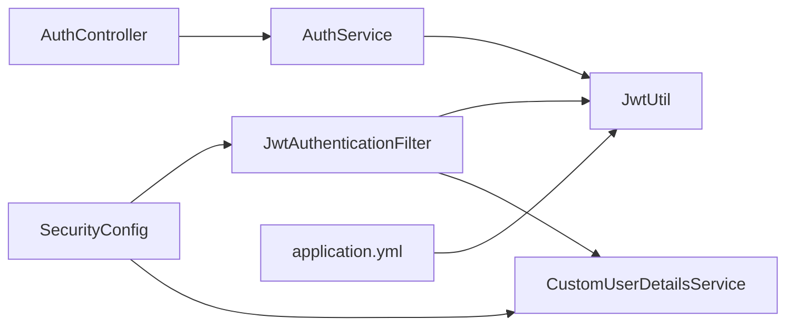

# JWT认证流程

<cite>
**本文引用的文件**
- [JwtUtil.java](file://src/main/java/com/layor/tinyflow/security/JwtUtil.java)
- [JwtAuthenticationFilter.java](file://src/main/java/com/layor/tinyflow/security/JwtAuthenticationFilter.java)
- [CustomUserDetailsService.java](file://src/main/java/com/layor/tinyflow/service/CustomUserDetailsService.java)
- [AuthController.java](file://src/main/java/com/layor/tinyflow/Controller/AuthController.java)
- [AuthService.java](file://src/main/java/com/layor/tinyflow/service/AuthService.java)
- [SecurityConfig.java](file://src/main/java/com/layor/tinyflow/config/SecurityConfig.java)
- [application.yml](file://src/main/resources/application.yml)
- [useAuth.js](file://web/src/composables/useAuth.js)
- [User.java](file://src/main/java/com/layor/tinyflow/entity/User.java)
- [AuthResponse.java](file://src/main/java/com/layor/tinyflow/entity/AuthResponse.java)
</cite>

## 目录
1. [引言](#引言)
2. [项目结构](#项目结构)
3. [核心组件](#核心组件)
4. [架构总览](#架构总览)
5. [详细组件分析](#详细组件分析)
6. [依赖关系分析](#依赖关系分析)
7. [性能与安全考量](#性能与安全考量)
8. [故障排查指南](#故障排查指南)
9. [结论](#结论)
10. [附录](#附录)

## 引言
本文件围绕“基于JWT的无状态认证流程”展开，完整覆盖从前端登录到后端鉴权、再到受保护资源访问的全过程。重点说明：
- 前端通过组合式函数管理认证状态与HTTP拦截器自动附加Authorization头；
- 后端控制器调用认证服务生成JWT，包含用户名与角色声明；
- 过滤器拦截请求解析Bearer Token，验证签名与有效期，并通过用户详情服务加载用户信息，完成安全上下文设置；
- 展示完整的时序图与流程图，给出关键代码片段路径；
- 涵盖过期处理策略与前端Token安全存储与自动附加机制；
- 强调HS512签名算法与配置化过期时间（jwt.expiration）等安全实践。

## 项目结构
后端采用Spring Security + Spring MVC + JPA，前端使用Vue 3 + Axios。认证相关的核心文件如下：
- 后端安全组件：JwtUtil、JwtAuthenticationFilter、CustomUserDetailsService、SecurityConfig
- 认证控制器与服务：AuthController、AuthService
- 配置与实体：application.yml、User、AuthResponse

**图表来源**
- [useAuth.js](file://web/src/composables/useAuth.js#L1-L72)
- [AuthController.java](file://src/main/java/com/layor/tinyflow/Controller/AuthController.java#L1-L173)
- [AuthService.java](file://src/main/java/com/layor/tinyflow/service/AuthService.java#L1-L141)
- [SecurityConfig.java](file://src/main/java/com/layor/tinyflow/config/SecurityConfig.java#L1-L146)
- [JwtAuthenticationFilter.java](file://src/main/java/com/layor/tinyflow/security/JwtAuthenticationFilter.java#L1-L91)
- [JwtUtil.java](file://src/main/java/com/layor/tinyflow/security/JwtUtil.java#L1-L149)
- [CustomUserDetailsService.java](file://src/main/java/com/layor/tinyflow/service/CustomUserDetailsService.java#L1-L34)
- [User.java](file://src/main/java/com/layor/tinyflow/entity/User.java#L1-L132)
- [AuthResponse.java](file://src/main/java/com/layor/tinyflow/entity/AuthResponse.java#L1-L43)

**章节来源**
- [SecurityConfig.java](file://src/main/java/com/layor/tinyflow/config/SecurityConfig.java#L46-L95)
- [application.yml](file://src/main/resources/application.yml#L212-L218)

## 核心组件
- JwtUtil：负责密钥解析、Token生成、解析与验证（签名、过期时间），并暴露过期时间秒数。
- JwtAuthenticationFilter：拦截请求，从Authorization头提取Bearer Token，解析用户名，加载用户详情并验证Token，最终设置Spring Security上下文。
- CustomUserDetailsService：根据用户名加载User实体（实现UserDetails），供过滤器与认证流程使用。
- AuthController：提供注册/登录接口，调用AuthService处理业务。
- AuthService：执行用户名密码认证，生成JWT并返回AuthResponse。
- SecurityConfig：配置无状态过滤链、CORS、授权规则、认证提供者与JWT过滤器位置。
- application.yml：提供jwt.secret与jwt.expiration等安全配置。
- useAuth.js：前端状态管理与Axios拦截器，自动附加Authorization头并处理401。

**章节来源**
- [JwtUtil.java](file://src/main/java/com/layor/tinyflow/security/JwtUtil.java#L26-L149)
- [JwtAuthenticationFilter.java](file://src/main/java/com/layor/tinyflow/security/JwtAuthenticationFilter.java#L20-L91)
- [CustomUserDetailsService.java](file://src/main/java/com/layor/tinyflow/service/CustomUserDetailsService.java#L16-L34)
- [AuthController.java](file://src/main/java/com/layor/tinyflow/Controller/AuthController.java#L22-L173)
- [AuthService.java](file://src/main/java/com/layor/tinyflow/service/AuthService.java#L1-L141)
- [SecurityConfig.java](file://src/main/java/com/layor/tinyflow/config/SecurityConfig.java#L34-L95)
- [application.yml](file://src/main/resources/application.yml#L212-L218)
- [useAuth.js](file://web/src/composables/useAuth.js#L1-L72)

## 架构总览
下图展示了从登录到受保护资源访问的端到端流程，包括前端拦截器、后端控制器与服务、安全过滤链与用户详情加载。

**图表来源**
- [AuthController.java](file://src/main/java/com/layor/tinyflow/Controller/AuthController.java#L90-L135)
- [AuthService.java](file://src/main/java/com/layor/tinyflow/service/AuthService.java#L76-L112)
- [JwtUtil.java](file://src/main/java/com/layor/tinyflow/security/JwtUtil.java#L81-L114)
- [SecurityConfig.java](file://src/main/java/com/layor/tinyflow/config/SecurityConfig.java#L46-L95)
- [JwtAuthenticationFilter.java](file://src/main/java/com/layor/tinyflow/security/JwtAuthenticationFilter.java#L32-L91)
- [CustomUserDetailsService.java](file://src/main/java/com/layor/tinyflow/service/CustomUserDetailsService.java#L23-L32)
- [useAuth.js](file://web/src/composables/useAuth.js#L36-L72)

## 详细组件分析

### 组件A：JwtUtil（签名与Token生命周期）
- 密钥来源：从配置读取jwt.secret并Base64解码，生成HMAC密钥。
- Token生成：将用户名作为subject，角色作为自定义声明role，设置签发时间与过期时间，使用密钥签名。
- 解析与验证：解析签名、提取声明、检查过期；提供validateToken重载用于格式校验与用户校验。
- 过期时间：从配置jwt.expiration（毫秒）转换为秒，供前端显示与刷新策略参考。

**图表来源**
- [JwtUtil.java](file://src/main/java/com/layor/tinyflow/security/JwtUtil.java#L26-L149)
- [application.yml](file://src/main/resources/application.yml#L212-L218)

**章节来源**
- [JwtUtil.java](file://src/main/java/com/layor/tinyflow/security/JwtUtil.java#L26-L149)
- [application.yml](file://src/main/resources/application.yml#L212-L218)

### 组件B：JwtAuthenticationFilter（请求拦截与上下文设置）
- 从Authorization头提取Bearer Token，若为空或格式不正确则放行。
- 解析用户名并判断当前上下文是否已有认证信息，避免重复设置。
- 通过CustomUserDetailsService加载用户详情，再调用JwtUtil.validateToken进行签名与有效期校验。
- 成功后创建UsernamePasswordAuthenticationToken，设置details与authorities，写入SecurityContextHolder。

**图表来源**
- [JwtAuthenticationFilter.java](file://src/main/java/com/layor/tinyflow/security/JwtAuthenticationFilter.java#L32-L91)
- [CustomUserDetailsService.java](file://src/main/java/com/layor/tinyflow/service/CustomUserDetailsService.java#L23-L32)
- [JwtUtil.java](file://src/main/java/com/layor/tinyflow/security/JwtUtil.java#L116-L140)

**章节来源**
- [JwtAuthenticationFilter.java](file://src/main/java/com/layor/tinyflow/security/JwtAuthenticationFilter.java#L20-L91)
- [CustomUserDetailsService.java](file://src/main/java/com/layor/tinyflow/service/CustomUserDetailsService.java#L16-L34)
- [JwtUtil.java](file://src/main/java/com/layor/tinyflow/security/JwtUtil.java#L116-L140)

### 组件C：CustomUserDetailsService（用户详情加载）
- 根据用户名查询User实体，若不存在抛出异常。
- User实现UserDetails，返回角色对应的GrantedAuthority（ROLE_前缀）。

**图表来源**
- [CustomUserDetailsService.java](file://src/main/java/com/layor/tinyflow/service/CustomUserDetailsService.java#L16-L34)
- [User.java](file://src/main/java/com/layor/tinyflow/entity/User.java#L95-L100)

**章节来源**
- [CustomUserDetailsService.java](file://src/main/java/com/layor/tinyflow/service/CustomUserDetailsService.java#L16-L34)
- [User.java](file://src/main/java/com/layor/tinyflow/entity/User.java#L95-L100)

### 组件D：AuthController与AuthService（登录与Token下发）
- AuthController提供登录接口，参数校验后委托AuthService处理。
- AuthService使用AuthenticationManager进行用户名密码认证，成功后生成JWT并返回AuthResponse（包含token、type、username、role、expiresIn）。
- 登录成功后将认证信息写入SecurityContext，便于后续接口使用。

**图表来源**
- [AuthController.java](file://src/main/java/com/layor/tinyflow/Controller/AuthController.java#L90-L135)
- [AuthService.java](file://src/main/java/com/layor/tinyflow/service/AuthService.java#L76-L112)
- [JwtUtil.java](file://src/main/java/com/layor/tinyflow/security/JwtUtil.java#L81-L114)
- [AuthResponse.java](file://src/main/java/com/layor/tinyflow/entity/AuthResponse.java#L1-L43)

**章节来源**
- [AuthController.java](file://src/main/java/com/layor/tinyflow/Controller/AuthController.java#L90-L135)
- [AuthService.java](file://src/main/java/com/layor/tinyflow/service/AuthService.java#L76-L112)
- [AuthResponse.java](file://src/main/java/com/layor/tinyflow/entity/AuthResponse.java#L1-L43)

### 组件E：SecurityConfig（无状态过滤链与授权规则）
- 禁用CSRF，配置CORS，设置会话策略为STATELESS。
- 授权规则：公开接口（认证、短链跳转、统计等）无需认证；管理员接口需ADMIN角色；PUT/DELETE短链相关操作需认证；其他接口全部认证。
- 将JwtAuthenticationFilter添加到用户名密码认证过滤器之前，确保在认证前完成Token解析与上下文设置。

**图表来源**
- [SecurityConfig.java](file://src/main/java/com/layor/tinyflow/config/SecurityConfig.java#L46-L95)

**章节来源**
- [SecurityConfig.java](file://src/main/java/com/layor/tinyflow/config/SecurityConfig.java#L46-L95)

### 组件F：前端useAuth.js（状态管理与拦截器）
- 使用localStorage保存token与username，提供setToken与logout。
- 配置Axios请求拦截器：自动在Authorization头附加Bearer token。
- 配置响应拦截器：捕获401未授权，清除本地token并跳转登录页。

**图表来源**
- [useAuth.js](file://web/src/composables/useAuth.js#L1-L72)

**章节来源**
- [useAuth.js](file://web/src/composables/useAuth.js#L1-L72)

## 依赖关系分析
- JwtAuthenticationFilter依赖JwtUtil与CustomUserDetailsService，用于解析与验证Token及加载用户详情。
- SecurityConfig装配JwtAuthenticationFilter与CustomUserDetailsService，并配置过滤链顺序。
- AuthService依赖JwtUtil与AuthenticationManager，用于生成Token与认证。
- AuthController依赖AuthService，对外提供REST接口。
- application.yml提供jwt.secret与jwt.expiration，影响JwtUtil的密钥与过期时间。

**图表来源**
- [JwtAuthenticationFilter.java](file://src/main/java/com/layor/tinyflow/security/JwtAuthenticationFilter.java#L20-L91)
- [JwtUtil.java](file://src/main/java/com/layor/tinyflow/security/JwtUtil.java#L26-L149)
- [CustomUserDetailsService.java](file://src/main/java/com/layor/tinyflow/service/CustomUserDetailsService.java#L16-L34)
- [SecurityConfig.java](file://src/main/java/com/layor/tinyflow/config/SecurityConfig.java#L46-L95)
- [AuthService.java](file://src/main/java/com/layor/tinyflow/service/AuthService.java#L1-L141)
- [AuthController.java](file://src/main/java/com/layor/tinyflow/Controller/AuthController.java#L1-L173)
- [application.yml](file://src/main/resources/application.yml#L212-L218)

**章节来源**
- [JwtAuthenticationFilter.java](file://src/main/java/com/layor/tinyflow/security/JwtAuthenticationFilter.java#L20-L91)
- [JwtUtil.java](file://src/main/java/com/layor/tinyflow/security/JwtUtil.java#L26-L149)
- [CustomUserDetailsService.java](file://src/main/java/com/layor/tinyflow/service/CustomUserDetailsService.java#L16-L34)
- [SecurityConfig.java](file://src/main/java/com/layor/tinyflow/config/SecurityConfig.java#L46-L95)
- [AuthService.java](file://src/main/java/com/layor/tinyflow/service/AuthService.java#L1-L141)
- [AuthController.java](file://src/main/java/com/layor/tinyflow/Controller/AuthController.java#L1-L173)
- [application.yml](file://src/main/resources/application.yml#L212-L218)

## 性能与安全考量
- HS512签名算法：JwtUtil内部使用HMAC-SHA512进行签名与验证，密钥来源于配置jwt.secret并Base64解码，满足高强度安全需求。
- 配置化过期时间：jwt.expiration（毫秒）控制Token有效期，JwtUtil提供getExpirationSeconds()供前端展示与刷新策略参考。
- 无状态会话：SecurityConfig设置SessionCreationPolicy.STATELESS，结合JwtAuthenticationFilter在每次请求时解析Token，避免服务端会话存储。
- 授权粒度：SecurityConfig对不同路径设置明确的授权规则，减少不必要的认证开销。
- 前端安全存储：useAuth.js使用localStorage存储token与username，建议在生产环境考虑HttpOnly Cookie与更严格的存储策略（例如加密存储或短期内存存储）以降低泄露风险。
- 令牌刷新机制：当前代码未实现专用的刷新接口。建议在生产环境中提供独立的刷新端点，使用短期access token与长期refresh token配合，结合黑名单或白名单策略提升安全性。

[本节为通用指导，不直接分析具体文件]

## 故障排查指南
- 登录成功但访问受保护资源返回401：
  - 检查Authorization头是否正确附加Bearer token。
  - 确认JwtUtil.validateToken返回true（签名有效且未过期）。
  - 查看JwtAuthenticationFilter日志，确认是否成功加载用户详情并设置SecurityContext。
- Token格式错误或过期：
  - 响应拦截器会自动清除localStorage并跳转登录页，检查401处理逻辑。
- 用户不存在或角色不匹配：
  - CustomUserDetailsService在找不到用户时抛出异常，确认用户名正确且角色已正确映射。

**章节来源**
- [JwtAuthenticationFilter.java](file://src/main/java/com/layor/tinyflow/security/JwtAuthenticationFilter.java#L32-L91)
- [useAuth.js](file://web/src/composables/useAuth.js#L52-L72)

## 结论
该系统采用Spring Security + JWT实现无状态认证，前后端职责清晰：前端负责状态管理与请求拦截，后端负责认证与Token签发，过滤器负责拦截与上下文设置。通过配置化过期时间与HS512签名，满足基本安全需求。建议在生产环境中补充令牌刷新机制与更严格的前端存储策略，进一步提升安全性与用户体验。

[本节为总结性内容，不直接分析具体文件]

## 附录
- 关键代码片段路径（仅路径，不含代码内容）：
  - 登录接口与响应：[AuthController.java](file://src/main/java/com/layor/tinyflow/Controller/AuthController.java#L90-L135)、[AuthResponse.java](file://src/main/java/com/layor/tinyflow/entity/AuthResponse.java#L1-L43)
  - 认证服务与Token生成：[AuthService.java](file://src/main/java/com/layor/tinyflow/service/AuthService.java#L76-L112)、[JwtUtil.java](file://src/main/java/com/layor/tinyflow/security/JwtUtil.java#L81-L114)
  - 安全过滤链与授权规则：[SecurityConfig.java](file://src/main/java/com/layor/tinyflow/config/SecurityConfig.java#L46-L95)
  - 请求拦截与上下文设置：[JwtAuthenticationFilter.java](file://src/main/java/com/layor/tinyflow/security/JwtAuthenticationFilter.java#L32-L91)、[CustomUserDetailsService.java](file://src/main/java/com/layor/tinyflow/service/CustomUserDetailsService.java#L23-L32)
  - 前端拦截器与状态管理：[useAuth.js](file://web/src/composables/useAuth.js#L1-L72)
  - 安全配置（密钥与过期时间）：[application.yml](file://src/main/resources/application.yml#L212-L218)