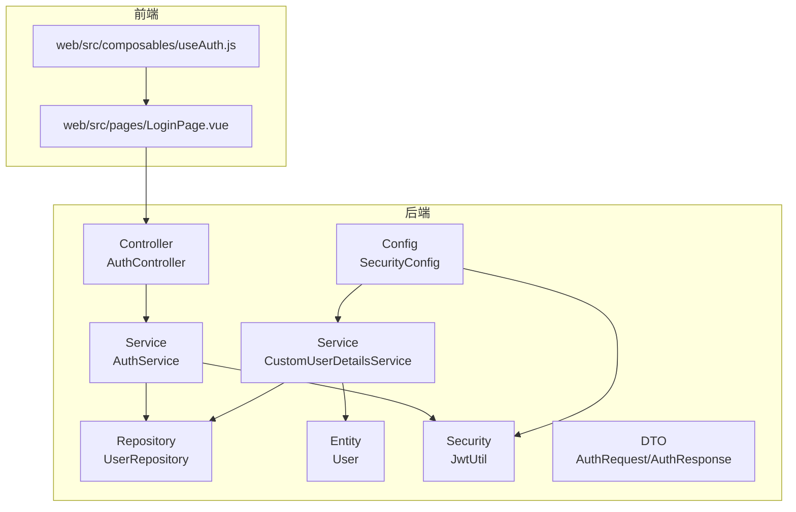
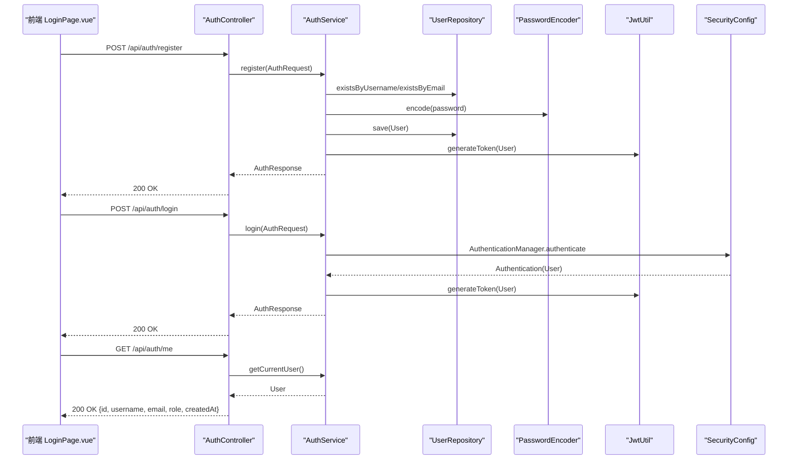
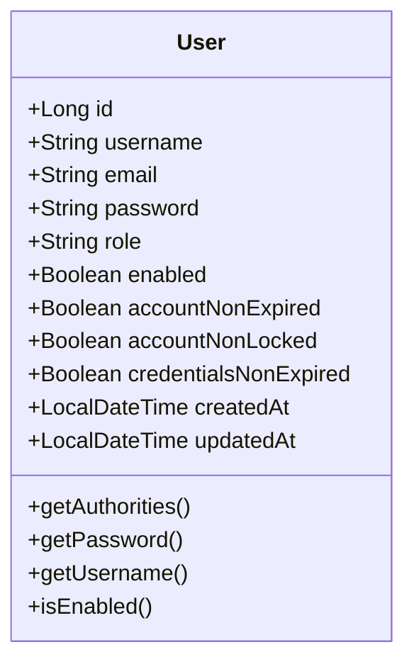
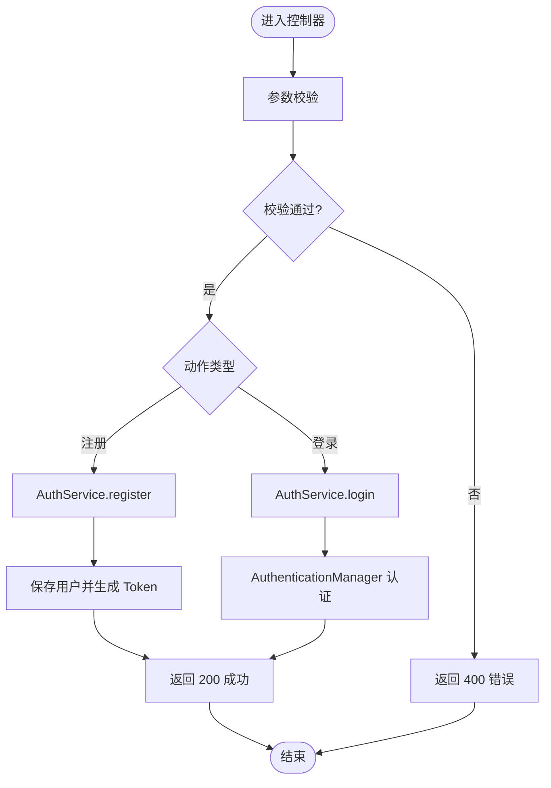
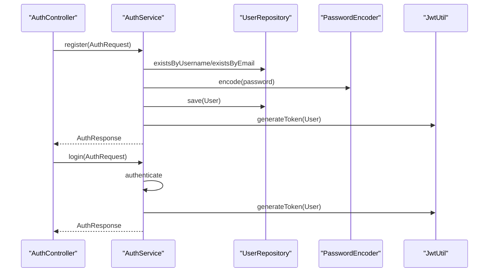
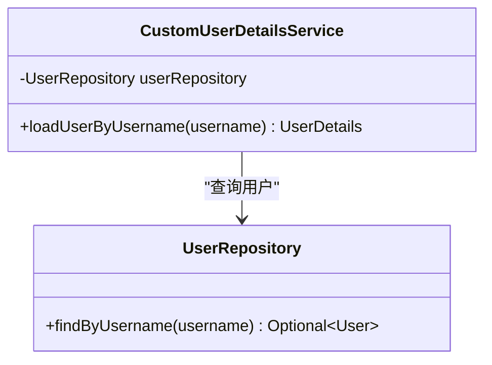
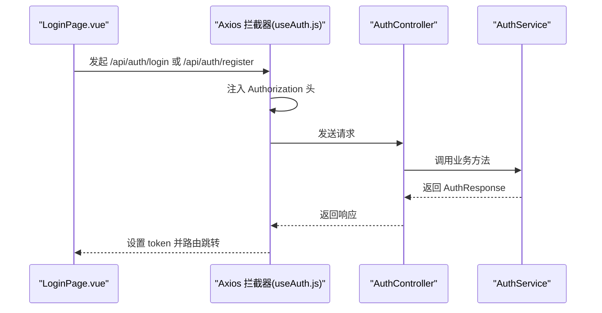
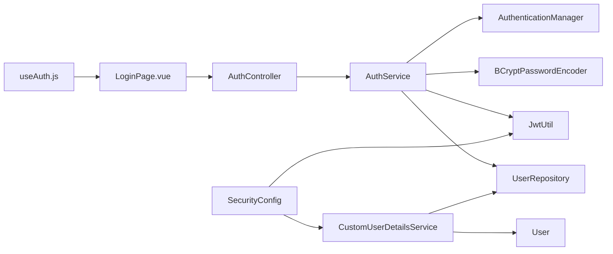

# 用户管理

<cite>
**本文引用的文件**
- [User.java](file://src/main/java/com/layor/tinyflow/entity/User.java)
- [AuthController.java](file://src/main/java/com/layor/tinyflow/Controller/AuthController.java)
- [AuthService.java](file://src/main/java/com/layor/tinyflow/service/AuthService.java)
- [CustomUserDetailsService.java](file://src/main/java/com/layor/tinyflow/service/CustomUserDetailsService.java)
- [UserRepository.java](file://src/main/java/com/layor/tinyflow/repository/UserRepository.java)
- [AuthRequest.java](file://src/main/java/com/layor/tinyflow/entity/AuthRequest.java)
- [AuthResponse.java](file://src/main/java/com/layor/tinyflow/entity/AuthResponse.java)
- [SecurityConfig.java](file://src/main/java/com/layor/tinyflow/config/SecurityConfig.java)
- [JwtUtil.java](file://src/main/java/com/layor/tinyflow/security/JwtUtil.java)
- [useAuth.js](file://web/src/composables/useAuth.js)
- [LoginPage.vue](file://web/src/pages/LoginPage.vue)
- [application.yml](file://src/main/resources/application.yml)
- [AuthServiceTest.java](file://src/test/java/com/layor/tinyflow/service/AuthServiceTest.java)
</cite>

## 目录
1. [简介](#简介)
2. [项目结构](#项目结构)
3. [核心组件](#核心组件)
4. [架构总览](#架构总览)
5. [详细组件分析](#详细组件分析)
6. [依赖关系分析](#依赖关系分析)
7. [性能考虑](#性能考虑)
8. [故障排查指南](#故障排查指南)
9. [结论](#结论)
10. [附录](#附录)

## 简介
本章节面向系统“用户管理”能力，围绕以下目标展开：
- 全面阐述 User 实体类的结构与字段语义（ID、用户名、邮箱、密码哈希、角色、创建时间等）
- 描述 AuthController 暴露的 /api/auth/register 与 /api/auth/login 端点如何处理注册与登录请求，包括参数校验、密码加密存储（Spring Security 的 PasswordEncoder）、异常处理
- 解释 CustomUserDetailsService 如何实现 UserDetailsService 接口，通过 UserRepository 从数据库加载用户凭证用于认证
- 提供用户注册表单的前端集成示例，说明 /api/auth/me 端点如何返回当前认证用户的基本信息
- 讨论用户数据的安全性，包括密码加密与敏感信息过滤

## 项目结构
用户管理相关代码主要分布在后端的 entity、Controller、service、repository、config、security 包，以及前端 web 目录下的页面与组合式函数。

图表来源
- [AuthController.java](file://src/main/java/com/layor/tinyflow/Controller/AuthController.java#L1-L173)
- [AuthService.java](file://src/main/java/com/layor/tinyflow/service/AuthService.java#L1-L141)
- [CustomUserDetailsService.java](file://src/main/java/com/layor/tinyflow/service/CustomUserDetailsService.java#L1-L34)
- [UserRepository.java](file://src/main/java/com/layor/tinyflow/repository/UserRepository.java#L1-L35)
- [User.java](file://src/main/java/com/layor/tinyflow/entity/User.java#L1-L132)
- [SecurityConfig.java](file://src/main/java/com/layor/tinyflow/config/SecurityConfig.java#L1-L146)
- [JwtUtil.java](file://src/main/java/com/layor/tinyflow/security/JwtUtil.java#L1-L149)
- [AuthRequest.java](file://src/main/java/com/layor/tinyflow/entity/AuthRequest.java#L1-L27)
- [AuthResponse.java](file://src/main/java/com/layor/tinyflow/entity/AuthResponse.java#L1-L43)
- [LoginPage.vue](file://web/src/pages/LoginPage.vue#L1-L340)
- [useAuth.js](file://web/src/composables/useAuth.js#L1-L72)

章节来源
- [AuthController.java](file://src/main/java/com/layor/tinyflow/Controller/AuthController.java#L1-L173)
- [AuthService.java](file://src/main/java/com/layor/tinyflow/service/AuthService.java#L1-L141)
- [CustomUserDetailsService.java](file://src/main/java/com/layor/tinyflow/service/CustomUserDetailsService.java#L1-L34)
- [UserRepository.java](file://src/main/java/com/layor/tinyflow/repository/UserRepository.java#L1-L35)
- [User.java](file://src/main/java/com/layor/tinyflow/entity/User.java#L1-L132)
- [SecurityConfig.java](file://src/main/java/com/layor/tinyflow/config/SecurityConfig.java#L1-L146)
- [JwtUtil.java](file://src/main/java/com/layor/tinyflow/security/JwtUtil.java#L1-L149)
- [AuthRequest.java](file://src/main/java/com/layor/tinyflow/entity/AuthRequest.java#L1-L27)
- [AuthResponse.java](file://src/main/java/com/layor/tinyflow/entity/AuthResponse.java#L1-L43)
- [LoginPage.vue](file://web/src/pages/LoginPage.vue#L1-L340)
- [useAuth.js](file://web/src/composables/useAuth.js#L1-L72)

## 核心组件
- User 实体类：承载用户基本信息与 Spring Security 用户细节接口实现；包含用户名、邮箱、密码哈希、角色、启用状态、过期状态、创建/更新时间等字段，并在持久化前后自动填充时间戳。
- AuthController 控制器：提供注册、登录与获取当前用户信息的 REST 接口，负责参数校验、异常处理与统一响应包装。
- AuthService 服务：实现业务逻辑，包括注册时的用户名/邮箱唯一性检查、密码加密、JWT 令牌签发；登录时委托 AuthenticationManager 完成认证并签发令牌；提供当前用户查询。
- CustomUserDetailsService：实现 Spring Security 的 UserDetailsService，按用户名从数据库加载用户，供认证流程使用。
- UserRepository：JPA 数据访问接口，提供按用户名/邮箱查询与存在性检查。
- SecurityConfig：Spring Security 配置，开启无状态会话、CORS、公开认证接口、JWT 过滤器链、密码编码器等。
- JwtUtil：JWT 工具，负责令牌生成、解析、验证与过期时间计算。
- 前端 LoginPage.vue 与 useAuth.js：前端登录/注册表单与全局 Axios 拦截器，自动注入 Authorization 头并处理 401 未授权。

章节来源
- [User.java](file://src/main/java/com/layor/tinyflow/entity/User.java#L1-L132)
- [AuthController.java](file://src/main/java/com/layor/tinyflow/Controller/AuthController.java#L1-L173)
- [AuthService.java](file://src/main/java/com/layor/tinyflow/service/AuthService.java#L1-L141)
- [CustomUserDetailsService.java](file://src/main/java/com/layor/tinyflow/service/CustomUserDetailsService.java#L1-L34)
- [UserRepository.java](file://src/main/java/com/layor/tinyflow/repository/UserRepository.java#L1-L35)
- [SecurityConfig.java](file://src/main/java/com/layor/tinyflow/config/SecurityConfig.java#L1-L146)
- [JwtUtil.java](file://src/main/java/com/layor/tinyflow/security/JwtUtil.java#L1-L149)
- [LoginPage.vue](file://web/src/pages/LoginPage.vue#L1-L340)
- [useAuth.js](file://web/src/composables/useAuth.js#L1-L72)

## 架构总览
用户管理采用“控制器-服务-数据访问-安全配置”的分层架构，结合 Spring Security 与 JWT 实现无状态认证。

图表来源
- [AuthController.java](file://src/main/java/com/layor/tinyflow/Controller/AuthController.java#L1-L173)
- [AuthService.java](file://src/main/java/com/layor/tinyflow/service/AuthService.java#L1-L141)
- [UserRepository.java](file://src/main/java/com/layor/tinyflow/repository/UserRepository.java#L1-L35)
- [SecurityConfig.java](file://src/main/java/com/layor/tinyflow/config/SecurityConfig.java#L1-L146)
- [JwtUtil.java](file://src/main/java/com/layor/tinyflow/security/JwtUtil.java#L1-L149)
- [LoginPage.vue](file://web/src/pages/LoginPage.vue#L1-L340)

## 详细组件分析

### User 实体类结构
- 字段与约束
  - id：自增主键
  - username：非空、唯一、长度限制
  - email：非空、唯一、邮箱格式
  - password：非空，存储为哈希值
  - role：非空，角色字符串（如 USER、ADMIN）
  - enabled/accountNonExpired/accountNonLocked/credentialsNonExpired：Spring Security 用户状态字段，默认启用且不过期
  - createdAt/updatedAt：自动维护时间戳
- Spring Security 集成
  - 实现 UserDetails 接口，getAuthorities 返回 ROLE_* 形式的权限集合
  - 提供 getUsername/getPassword/isEnabled 等方法供认证使用
- 时间戳管理
  - @PrePersist/@PreUpdate 自动设置创建与更新时间

图表来源
- [User.java](file://src/main/java/com/layor/tinyflow/entity/User.java#L1-L132)

章节来源
- [User.java](file://src/main/java/com/layor/tinyflow/entity/User.java#L1-L132)

### AuthController：注册与登录端点
- /api/auth/register
  - 参数校验：@Valid + BindingResult 汇总错误；额外校验邮箱必填
  - 异常处理：参数错误返回 400；业务异常返回 400；其他异常返回 500
  - 返回：Result<AuthResponse>，包含 token、类型、用户名、角色、过期时间
- /api/auth/login
  - 参数校验：同上
  - 异常处理：凭据错误返回 401；其他异常返回 500
  - 返回：Result<AuthResponse>
- /api/auth/me
  - 返回当前认证用户的基本信息（id、username、email、role、createdAt）
  - 未登录返回 401

图表来源
- [AuthController.java](file://src/main/java/com/layor/tinyflow/Controller/AuthController.java#L1-L173)
- [AuthService.java](file://src/main/java/com/layor/tinyflow/service/AuthService.java#L1-L141)

章节来源
- [AuthController.java](file://src/main/java/com/layor/tinyflow/Controller/AuthController.java#L1-L173)

### AuthService：注册、登录与当前用户
- 注册流程
  - 检查用户名/邮箱唯一性，否则抛出非法参数异常
  - 使用 PasswordEncoder 对明文密码进行哈希存储
  - 保存用户并生成 JWT，返回 AuthResponse
- 登录流程
  - 使用 AuthenticationManager.authenticate 进行用户名/密码认证
  - 认证成功后设置 SecurityContext，并生成 JWT
  - 凭据错误抛出 BadCredentialsException
- 当前用户
  - 从 SecurityContextHolder 获取认证主体 User，提供 ID/用户名查询

图表来源
- [AuthService.java](file://src/main/java/com/layor/tinyflow/service/AuthService.java#L1-L141)
- [UserRepository.java](file://src/main/java/com/layor/tinyflow/repository/UserRepository.java#L1-L35)
- [JwtUtil.java](file://src/main/java/com/layor/tinyflow/security/JwtUtil.java#L1-L149)

章节来源
- [AuthService.java](file://src/main/java/com/layor/tinyflow/service/AuthService.java#L1-L141)

### CustomUserDetailsService：认证凭证加载
- 通过 UserRepository.findByUsername 加载用户
- 若不存在则抛出 UsernameNotFoundException
- 返回 User 实例供 Spring Security 使用

图表来源
- [CustomUserDetailsService.java](file://src/main/java/com/layor/tinyflow/service/CustomUserDetailsService.java#L1-L34)
- [UserRepository.java](file://src/main/java/com/layor/tinyflow/repository/UserRepository.java#L1-L35)

章节来源
- [CustomUserDetailsService.java](file://src/main/java/com/layor/tinyflow/service/CustomUserDetailsService.java#L1-L34)
- [UserRepository.java](file://src/main/java/com/layor/tinyflow/repository/UserRepository.java#L1-L35)

### 前端集成：注册/登录表单与 /api/auth/me
- LoginPage.vue
  - 表单字段：username、email（注册时）、password
  - 提交逻辑：根据 isLogin 切换 /api/auth/login 或 /api/auth/register
  - 成功后从响应头或响应体提取 token，调用 useAuth.setToken 写入 localStorage
  - 错误处理：优先读取后端返回的 message，网络错误提示明确
- useAuth.js
  - 维护 token 与 username 的响应式状态
  - setupAxiosInterceptors：请求自动附加 Authorization: Bearer token；响应拦截器处理 401，清理本地存储并跳转登录
- /api/auth/me
  - 返回当前认证用户的基本信息（id、username、email、role、createdAt）

图表来源
- [LoginPage.vue](file://web/src/pages/LoginPage.vue#L1-L340)
- [useAuth.js](file://web/src/composables/useAuth.js#L1-L72)
- [AuthController.java](file://src/main/java/com/layor/tinyflow/Controller/AuthController.java#L1-L173)
- [AuthService.java](file://src/main/java/com/layor/tinyflow/service/AuthService.java#L1-L141)

章节来源
- [LoginPage.vue](file://web/src/pages/LoginPage.vue#L1-L340)
- [useAuth.js](file://web/src/composables/useAuth.js#L1-L72)

### 安全性与敏感信息过滤
- 密码加密
  - SecurityConfig 配置 BCryptPasswordEncoder
  - AuthService 在注册时对明文密码进行编码存储
  - 登录时使用 AuthenticationManager 与 DaoAuthenticationProvider 完成凭据匹配
- JWT 令牌
  - JwtUtil 负责生成、解析与验证，包含角色声明
  - SecurityConfig 将 JWT 过滤器置于用户名密码过滤器之前
- 敏感信息过滤
  - /api/auth/me 返回用户基本信息，不包含密码字段
  - 前端仅保存 token 与用户名，避免在 UI 显示敏感字段

章节来源
- [SecurityConfig.java](file://src/main/java/com/layor/tinyflow/config/SecurityConfig.java#L1-L146)
- [AuthService.java](file://src/main/java/com/layor/tinyflow/service/AuthService.java#L1-L141)
- [JwtUtil.java](file://src/main/java/com/layor/tinyflow/security/JwtUtil.java#L1-L149)
- [AuthController.java](file://src/main/java/com/layor/tinyflow/Controller/AuthController.java#L1-L173)

## 依赖关系分析
- 控制器依赖服务，服务依赖仓库、密码编码器、JWT 工具与认证管理器
- 自定义用户详情服务依赖仓库与实体
- 安全配置依赖用户详情服务、JWT 过滤器与密码编码器
- 前端依赖控制器与拦截器

图表来源
- [AuthController.java](file://src/main/java/com/layor/tinyflow/Controller/AuthController.java#L1-L173)
- [AuthService.java](file://src/main/java/com/layor/tinyflow/service/AuthService.java#L1-L141)
- [UserRepository.java](file://src/main/java/com/layor/tinyflow/repository/UserRepository.java#L1-L35)
- [CustomUserDetailsService.java](file://src/main/java/com/layor/tinyflow/service/CustomUserDetailsService.java#L1-L34)
- [SecurityConfig.java](file://src/main/java/com/layor/tinyflow/config/SecurityConfig.java#L1-L146)
- [JwtUtil.java](file://src/main/java/com/layor/tinyflow/security/JwtUtil.java#L1-L149)
- [LoginPage.vue](file://web/src/pages/LoginPage.vue#L1-L340)
- [useAuth.js](file://web/src/composables/useAuth.js#L1-L72)

章节来源
- [AuthService.java](file://src/main/java/com/layor/tinyflow/service/AuthService.java#L1-L141)
- [SecurityConfig.java](file://src/main/java/com/layor/tinyflow/config/SecurityConfig.java#L1-L146)

## 性能考虑
- 无状态认证：JWT 无服务器会话，降低服务器压力
- 密码编码：BCrypt 开销较高，建议在注册/登录高峰时段关注认证延迟
- 数据访问：UserRepository 提供索引字段（username、email），减少查询成本
- 前端拦截器：统一注入 Authorization，避免重复逻辑，减少网络往返

## 故障排查指南
- 注册失败（用户名已存在/邮箱已存在）
  - 现象：返回 400，message 指示用户名或邮箱冲突
  - 排查：确认数据库唯一约束与 UserRepository.exists* 方法
- 登录失败（凭据错误）
  - 现象：返回 401，message 指示用户名或密码错误
  - 排查：确认用户名存在、密码编码一致、JWT 生成正常
- 未登录访问受保护资源
  - 现象：返回 401
  - 排查：确认前端已正确设置 Authorization 头，后端 JWT 过滤器生效
- 前端 401 自动跳转
  - 现象：响应拦截器清除本地 token 并跳转登录页
  - 排查：检查 useAuth.js 的拦截器逻辑与路由配置

章节来源
- [AuthServiceTest.java](file://src/test/java/com/layor/tinyflow/service/AuthServiceTest.java#L1-L197)
- [AuthController.java](file://src/main/java/com/layor/tinyflow/Controller/AuthController.java#L1-L173)
- [useAuth.js](file://web/src/composables/useAuth.js#L1-L72)

## 结论
本系统通过清晰的分层设计与 Spring Security/JWT 集成，实现了安全、可扩展的用户管理能力。User 实体承载用户信息并实现认证接口；AuthController 提供统一的注册、登录与当前用户查询接口；AuthService 负责业务逻辑与安全策略；CustomUserDetailsService 与 UserRepository 完成用户凭证加载；前端通过 LoginPage.vue 与 useAuth.js 实现表单与认证态管理。整体具备良好的安全性与可维护性。

## 附录
- 配置要点
  - application.yml 中包含 JWT 密钥与过期时间配置项，生产环境需通过环境变量注入
  - SecurityConfig 中开启无状态会话、CORS、公开认证接口与 JWT 过滤器链

章节来源
- [application.yml](file://src/main/resources/application.yml#L212-L218)
- [SecurityConfig.java](file://src/main/java/com/layor/tinyflow/config/SecurityConfig.java#L1-L146)