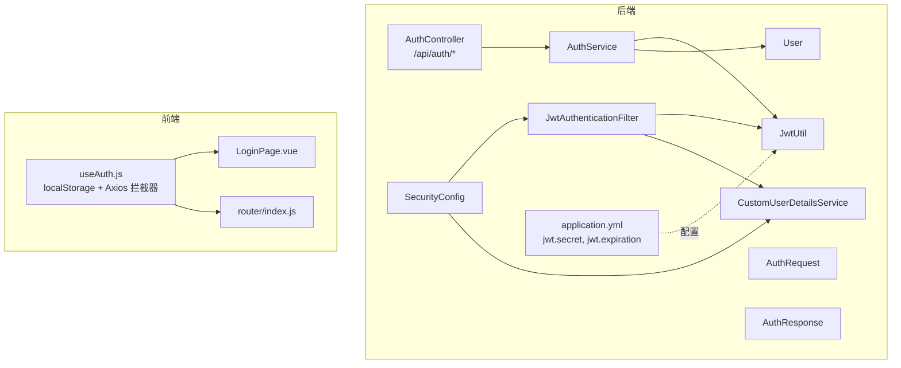
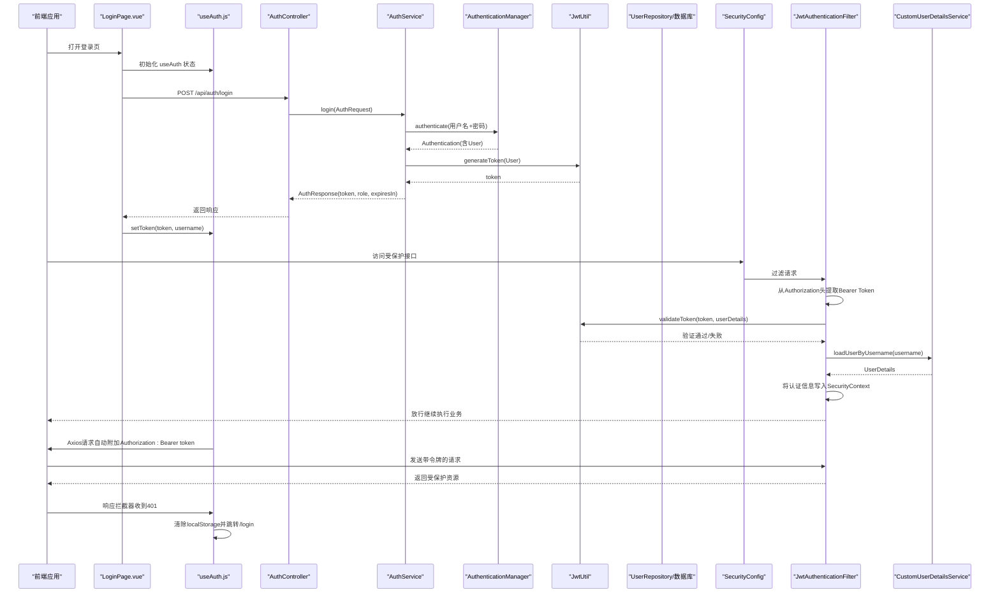
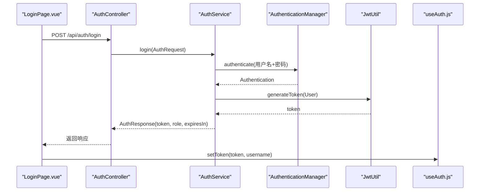
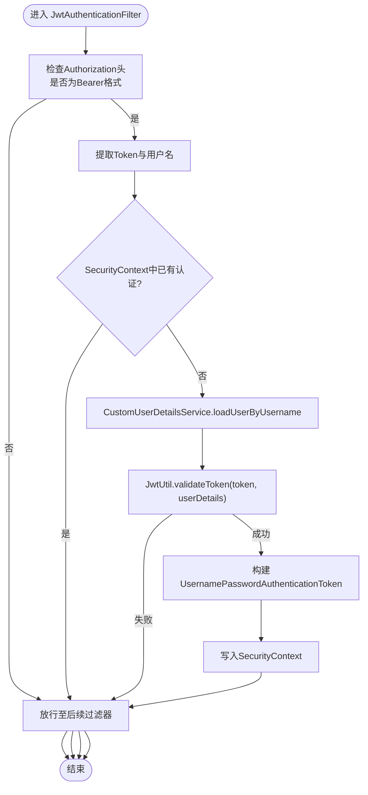
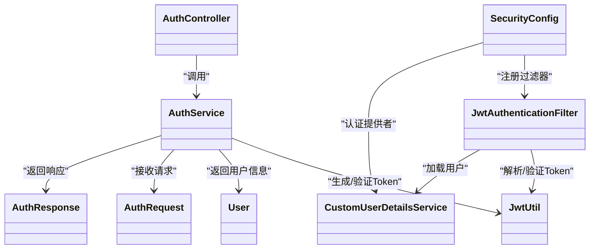

# 认证服务

<cite>
**本文引用的文件**
- [AuthController.java](file://src/main/java/com/layor/tinyflow/Controller/AuthController.java)
- [AuthService.java](file://src/main/java/com/layor/tinyflow/service/AuthService.java)
- [JwtUtil.java](file://src/main/java/com/layor/tinyflow/security/JwtUtil.java)
- [JwtAuthenticationFilter.java](file://src/main/java/com/layor/tinyflow/security/JwtAuthenticationFilter.java)
- [CustomUserDetailsService.java](file://src/main/java/com/layor/tinyflow/service/CustomUserDetailsService.java)
- [SecurityConfig.java](file://src/main/java/com/layor/tinyflow/config/SecurityConfig.java)
- [User.java](file://src/main/java/com/layor/tinyflow/entity/User.java)
- [AuthRequest.java](file://src/main/java/com/layor/tinyflow/entity/AuthRequest.java)
- [AuthResponse.java](file://src/main/java/com/layor/tinyflow/entity/AuthResponse.java)
- [application.yml](file://src/main/resources/application.yml)
- [useAuth.js](file://web/src/composables/useAuth.js)
- [LoginPage.vue](file://web/src/pages/LoginPage.vue)
- [router/index.js](file://web/src/router/index.js)
</cite>

## 目录
1. [简介](#简介)
2. [项目结构](#项目结构)
3. [核心组件](#核心组件)
4. [架构总览](#架构总览)
5. [详细组件分析](#详细组件分析)
6. [依赖关系分析](#依赖关系分析)
7. [性能与安全考量](#性能与安全考量)
8. [故障排查指南](#故障排查指南)
9. [结论](#结论)
10. [附录](#附录)

## 简介
本文件系统化阐述 TinyFlow 的用户认证机制，围绕基于 JWT 的无状态认证展开，覆盖登录、注册、登出、令牌刷新等流程；说明后端如何通过 AuthController、AuthService、JwtUtil、JwtAuthenticationFilter、CustomUserDetailsService 协作完成认证与授权；同时给出前端 useAuth.js 的集成方式与最佳实践，并重点强调安全性设计（令牌过期时间、加密算法、密钥管理、无状态策略等）。

## 项目结构
认证相关代码主要分布在后端 Java 层与前端 Vue 层：
- 后端
  - 控制层：AuthController
  - 业务层：AuthService
  - 安全工具：JwtUtil、JwtAuthenticationFilter、CustomUserDetailsService
  - 安全配置：SecurityConfig
  - 实体与 DTO：User、AuthRequest、AuthResponse
  - 配置：application.yml（JWT 密钥与过期时间）
- 前端
  - 认证状态与拦截器：useAuth.js
  - 登录页面：LoginPage.vue
  - 路由与访客跳转：router/index.js

图表来源
- [AuthController.java](file://src/main/java/com/layor/tinyflow/Controller/AuthController.java#L1-L173)
- [AuthService.java](file://src/main/java/com/layor/tinyflow/service/AuthService.java#L1-L141)
- [JwtUtil.java](file://src/main/java/com/layor/tinyflow/security/JwtUtil.java#L1-L149)
- [JwtAuthenticationFilter.java](file://src/main/java/com/layor/tinyflow/security/JwtAuthenticationFilter.java#L1-L91)
- [CustomUserDetailsService.java](file://src/main/java/com/layor/tinyflow/service/CustomUserDetailsService.java#L1-L34)
- [SecurityConfig.java](file://src/main/java/com/layor/tinyflow/config/SecurityConfig.java#L1-L146)
- [User.java](file://src/main/java/com/layor/tinyflow/entity/User.java#L1-L132)
- [AuthRequest.java](file://src/main/java/com/layor/tinyflow/entity/AuthRequest.java#L1-L27)
- [AuthResponse.java](file://src/main/java/com/layor/tinyflow/entity/AuthResponse.java#L1-L43)
- [application.yml](file://src/main/resources/application.yml#L212-L218)
- [useAuth.js](file://web/src/composables/useAuth.js#L1-L72)
- [LoginPage.vue](file://web/src/pages/LoginPage.vue#L230-L303)
- [router/index.js](file://web/src/router/index.js#L1-L37)

章节来源
- [AuthController.java](file://src/main/java/com/layor/tinyflow/Controller/AuthController.java#L1-L173)
- [SecurityConfig.java](file://src/main/java/com/layor/tinyflow/config/SecurityConfig.java#L1-L146)
- [application.yml](file://src/main/resources/application.yml#L212-L218)
- [useAuth.js](file://web/src/composables/useAuth.js#L1-L72)

## 核心组件
- AuthController：对外暴露 /api/auth/register、/api/auth/login、/api/auth/me 等接口，负责参数校验、调用 AuthService 执行业务逻辑并返回 Result 包装结果。
- AuthService：实现注册与登录的核心业务，使用 AuthenticationManager 进行凭据认证，使用 JwtUtil 生成令牌，使用 UserRepository 和 PasswordEncoder 管理用户与密码。
- JwtUtil：封装 JWT 的生成、解析、验证与过期判断，读取 application.yml 中的 jwt.secret 与 jwt.expiration。
- JwtAuthenticationFilter：拦截请求，从 Authorization 头提取 Bearer Token，调用 JwtUtil 解析与验证，再通过 CustomUserDetailsService 加载用户详情，最终将认证信息写入 SecurityContext。
- CustomUserDetailsService：实现 UserDetailsService，从数据库加载用户并返回 UserDetails，供 Spring Security 使用。
- SecurityConfig：配置无状态会话策略、CORS、公开与受保护接口、认证提供者与 JWT 过滤器插入顺序。
- User：实现 UserDetails，承载用户凭据、角色与账户状态。
- AuthRequest/AuthResponse：认证请求与响应 DTO。
- 前端 useAuth.js：管理 token 与 username 的本地存储，统一注入 Authorization 头，处理 401 自动登出与跳转。

章节来源
- [AuthController.java](file://src/main/java/com/layor/tinyflow/Controller/AuthController.java#L1-L173)
- [AuthService.java](file://src/main/java/com/layor/tinyflow/service/AuthService.java#L1-L141)
- [JwtUtil.java](file://src/main/java/com/layor/tinyflow/security/JwtUtil.java#L1-L149)
- [JwtAuthenticationFilter.java](file://src/main/java/com/layor/tinyflow/security/JwtAuthenticationFilter.java#L1-L91)
- [CustomUserDetailsService.java](file://src/main/java/com/layor/tinyflow/service/CustomUserDetailsService.java#L1-L34)
- [SecurityConfig.java](file://src/main/java/com/layor/tinyflow/config/SecurityConfig.java#L1-L146)
- [User.java](file://src/main/java/com/layor/tinyflow/entity/User.java#L1-L132)
- [AuthRequest.java](file://src/main/java/com/layor/tinyflow/entity/AuthRequest.java#L1-L27)
- [AuthResponse.java](file://src/main/java/com/layor/tinyflow/entity/AuthResponse.java#L1-L43)
- [useAuth.js](file://web/src/composables/useAuth.js#L1-L72)

## 架构总览
下图展示了认证从“前端发起请求”到“后端完成鉴权”的整体流程，包括登录、注册、携带令牌访问受保护资源以及 401 自动登出的闭环。

图表来源
- [AuthController.java](file://src/main/java/com/layor/tinyflow/Controller/AuthController.java#L88-L171)
- [AuthService.java](file://src/main/java/com/layor/tinyflow/service/AuthService.java#L76-L112)
- [JwtUtil.java](file://src/main/java/com/layor/tinyflow/security/JwtUtil.java#L81-L140)
- [JwtAuthenticationFilter.java](file://src/main/java/com/layor/tinyflow/security/JwtAuthenticationFilter.java#L32-L90)
- [CustomUserDetailsService.java](file://src/main/java/com/layor/tinyflow/service/CustomUserDetailsService.java#L23-L32)
- [SecurityConfig.java](file://src/main/java/com/layor/tinyflow/config/SecurityConfig.java#L46-L95)
- [useAuth.js](file://web/src/composables/useAuth.js#L36-L72)
- [LoginPage.vue](file://web/src/pages/LoginPage.vue#L251-L303)

## 详细组件分析

### 登录与注册流程
- 登录
  - 前端 LoginPage.vue 调用 /api/auth/login，提交 AuthRequest。
  - AuthController 对参数进行基础校验，随后调用 AuthService.login。
  - AuthService 使用 AuthenticationManager 进行用户名/密码认证，成功后生成 JWT 并返回 AuthResponse。
  - 前端 useAuth.js 将 token 与 username 写入 localStorage，并通过 Axios 请求拦截器自动附加 Authorization: Bearer token。
- 注册
  - 前端调用 /api/auth/register，提交 AuthRequest。
  - AuthController 校验参数后调用 AuthService.register。
  - AuthService 检查用户名/邮箱唯一性，保存用户并使用 PasswordEncoder 编码密码，然后生成 JWT 并返回 AuthResponse。

图表来源
- [AuthController.java](file://src/main/java/com/layor/tinyflow/Controller/AuthController.java#L88-L135)
- [AuthService.java](file://src/main/java/com/layor/tinyflow/service/AuthService.java#L76-L112)
- [JwtUtil.java](file://src/main/java/com/layor/tinyflow/security/JwtUtil.java#L81-L114)
- [LoginPage.vue](file://web/src/pages/LoginPage.vue#L251-L303)
- [useAuth.js](file://web/src/composables/useAuth.js#L1-L35)

章节来源
- [AuthController.java](file://src/main/java/com/layor/tinyflow/Controller/AuthController.java#L88-L135)
- [AuthService.java](file://src/main/java/com/layor/tinyflow/service/AuthService.java#L36-L112)
- [AuthRequest.java](file://src/main/java/com/layor/tinyflow/entity/AuthRequest.java#L1-L27)
- [AuthResponse.java](file://src/main/java/com/layor/tinyflow/entity/AuthResponse.java#L1-L43)
- [LoginPage.vue](file://web/src/pages/LoginPage.vue#L251-L303)
- [useAuth.js](file://web/src/composables/useAuth.js#L1-L35)

### 令牌验证与安全上下文注入
- 请求拦截
  - JwtAuthenticationFilter 从 Authorization 头提取 Bearer Token。
  - 若存在且 SecurityContext 中尚未有认证信息，则调用 JwtUtil.extractUsername 与 JwtUtil.validateToken 进行验证。
  - 通过 CustomUserDetailsService.loadUserByUsername 加载用户详情，构造 UsernamePasswordAuthenticationToken 并写入 SecurityContext。
- 授权规则
  - SecurityConfig 配置了公开接口与受保护接口，采用 STATELESS 会话策略，确保无状态认证。
  - CORS 允许开发与部署域名，便于前后端联调。

图表来源
- [JwtAuthenticationFilter.java](file://src/main/java/com/layor/tinyflow/security/JwtAuthenticationFilter.java#L32-L90)
- [JwtUtil.java](file://src/main/java/com/layor/tinyflow/security/JwtUtil.java#L116-L140)
- [CustomUserDetailsService.java](file://src/main/java/com/layor/tinyflow/service/CustomUserDetailsService.java#L23-L32)
- [SecurityConfig.java](file://src/main/java/com/layor/tinyflow/config/SecurityConfig.java#L46-L95)

章节来源
- [JwtAuthenticationFilter.java](file://src/main/java/com/layor/tinyflow/security/JwtAuthenticationFilter.java#L32-L90)
- [SecurityConfig.java](file://src/main/java/com/layor/tinyflow/config/SecurityConfig.java#L46-L95)

### 当前用户信息查询
- /api/auth/me 接口用于获取当前登录用户信息。
- AuthController 调用 AuthService.getCurrentUser，从 SecurityContext 中取出认证主体 User 并返回。

章节来源
- [AuthController.java](file://src/main/java/com/layor/tinyflow/Controller/AuthController.java#L137-L171)
- [AuthService.java](file://src/main/java/com/layor/tinyflow/service/AuthService.java#L114-L140)

### 前端集成要点
- useAuth.js
  - 使用 localStorage 存储 token 与 username。
  - Axios 请求拦截器自动附加 Authorization: Bearer token。
  - 响应拦截器监听 401，清除本地存储并跳转到 /login（非登录页时）。
- LoginPage.vue
  - 根据 isLogin 切换 /api/auth/login 或 /api/auth/register。
  - 成功后调用 setToken 并导航首页。
- router/index.js
  - 首次访问且未登录时自动跳转 /login。

章节来源
- [useAuth.js](file://web/src/composables/useAuth.js#L1-L72)
- [LoginPage.vue](file://web/src/pages/LoginPage.vue#L230-L303)
- [router/index.js](file://web/src/router/index.js#L1-L37)

## 依赖关系分析
- 组件耦合
  - AuthController 依赖 AuthService；AuthService 依赖 JwtUtil、AuthenticationManager、UserRepository、PasswordEncoder。
  - JwtAuthenticationFilter 依赖 JwtUtil 与 CustomUserDetailsService。
  - SecurityConfig 注入 JwtAuthenticationFilter 与 CustomUserDetailsService，并配置过滤器链。
- 关键依赖链
  - 登录链路：AuthController → AuthService → AuthenticationManager → JwtUtil → AuthResponse
  - 请求链路：JwtAuthenticationFilter → JwtUtil → CustomUserDetailsService → SecurityContext

图表来源
- [AuthController.java](file://src/main/java/com/layor/tinyflow/Controller/AuthController.java#L1-L173)
- [AuthService.java](file://src/main/java/com/layor/tinyflow/service/AuthService.java#L1-L141)
- [JwtUtil.java](file://src/main/java/com/layor/tinyflow/security/JwtUtil.java#L1-L149)
- [JwtAuthenticationFilter.java](file://src/main/java/com/layor/tinyflow/security/JwtAuthenticationFilter.java#L1-L91)
- [CustomUserDetailsService.java](file://src/main/java/com/layor/tinyflow/service/CustomUserDetailsService.java#L1-L34)
- [SecurityConfig.java](file://src/main/java/com/layor/tinyflow/config/SecurityConfig.java#L1-L146)
- [User.java](file://src/main/java/com/layor/tinyflow/entity/User.java#L1-L132)
- [AuthRequest.java](file://src/main/java/com/layor/tinyflow/entity/AuthRequest.java#L1-L27)
- [AuthResponse.java](file://src/main/java/com/layor/tinyflow/entity/AuthResponse.java#L1-L43)

章节来源
- [SecurityConfig.java](file://src/main/java/com/layor/tinyflow/config/SecurityConfig.java#L46-L95)
- [AuthService.java](file://src/main/java/com/layor/tinyflow/service/AuthService.java#L1-L141)

## 性能与安全考量
- 无状态认证
  - SecurityConfig 设置 SessionCreationPolicy.STATELESS，避免服务器端会话存储，提升横向扩展能力。
- 令牌有效期与刷新
  - application.yml 中 jwt.expiration 指定令牌过期时间（毫秒）。当前实现未提供专用“刷新令牌”接口，建议在前端引入 refresh token 机制或缩短 jwt.expiration 以降低风险。
- 加密与密钥
  - JwtUtil 使用对称密钥（HMAC-SHA）签名，密钥来自 jwt.secret。生产环境务必使用强密钥（至少 256 位）并通过环境变量注入，避免硬编码。
- 密码安全
  - SecurityConfig 使用 BCryptPasswordEncoder，AuthService 注册时对密码进行编码存储，符合安全最佳实践。
- 授权与公开接口
  - SecurityConfig 明确区分公开接口与受保护接口，减少不必要的认证开销。
- 前端安全
  - useAuth.js 将 token 存储于 localStorage，建议配合 HttpOnly Cookie 与 SameSite 策略进一步增强防护；若需跨域，确保 CORS 配置最小化暴露。

章节来源
- [SecurityConfig.java](file://src/main/java/com/layor/tinyflow/config/SecurityConfig.java#L83-L95)
- [application.yml](file://src/main/resources/application.yml#L212-L218)
- [JwtUtil.java](file://src/main/java/com/layor/tinyflow/security/JwtUtil.java#L1-L149)
- [AuthService.java](file://src/main/java/com/layor/tinyflow/service/AuthService.java#L36-L74)

## 故障排查指南
- 登录失败（用户名或密码错误）
  - AuthService 在认证失败时抛出 BadCredentialsException，AuthController 返回 401。
  - 前端 LoginPage.vue 会根据响应提示错误信息。
- 401 未授权
  - useAuth.js 的响应拦截器会在收到 401 时清除本地 token 并跳转 /login。
- Token 无效或过期
  - JwtAuthenticationFilter 在 validateToken 失败时不会设置 SecurityContext，请求被放行但无法获得认证上下文。
  - 建议前端在 401 时引导重新登录，并在必要时实现 refresh token 机制。
- CORS 问题
  - SecurityConfig 已配置 CORS，若前端跨域失败，请核对 allowedOrigins 与请求头。

章节来源
- [AuthService.java](file://src/main/java/com/layor/tinyflow/service/AuthService.java#L108-L112)
- [AuthController.java](file://src/main/java/com/layor/tinyflow/Controller/AuthController.java#L119-L134)
- [useAuth.js](file://web/src/composables/useAuth.js#L52-L72)
- [SecurityConfig.java](file://src/main/java/com/layor/tinyflow/config/SecurityConfig.java#L97-L117)

## 结论
本认证体系以 Spring Security 为核心，结合 JWT 实现无状态认证。后端通过 AuthController、AuthService、JwtUtil、JwtAuthenticationFilter、CustomUserDetailsService 形成清晰的职责边界；前端通过 useAuth.js 统一管理令牌与请求头，配合路由守卫与 401 自动登出，形成完整的用户体验闭环。建议在生产环境中强化密钥管理、引入 refresh token 机制，并评估 HttpOnly Cookie 与更严格的 CORS 策略以提升安全性。

## 附录
- API 接口清单
  - POST /api/auth/register：注册用户，返回 AuthResponse（包含 token、role、expiresIn）
  - POST /api/auth/login：登录用户，返回 AuthResponse
  - GET /api/auth/me：获取当前登录用户信息
- 前端集成步骤
  - 登录页调用对应接口，成功后 setToken(token, username)
  - Axios 请求拦截器自动附加 Authorization: Bearer token
  - 响应拦截器处理 401，清除本地存储并跳转 /login
- 安全配置参考
  - application.yml 中 jwt.secret 与 jwt.expiration
  - SecurityConfig 中 CORS、公开/受保护接口、STATELESS 会话策略

章节来源
- [AuthController.java](file://src/main/java/com/layor/tinyflow/Controller/AuthController.java#L33-L171)
- [useAuth.js](file://web/src/composables/useAuth.js#L36-L72)
- [application.yml](file://src/main/resources/application.yml#L212-L218)
- [SecurityConfig.java](file://src/main/java/com/layor/tinyflow/config/SecurityConfig.java#L46-L95)