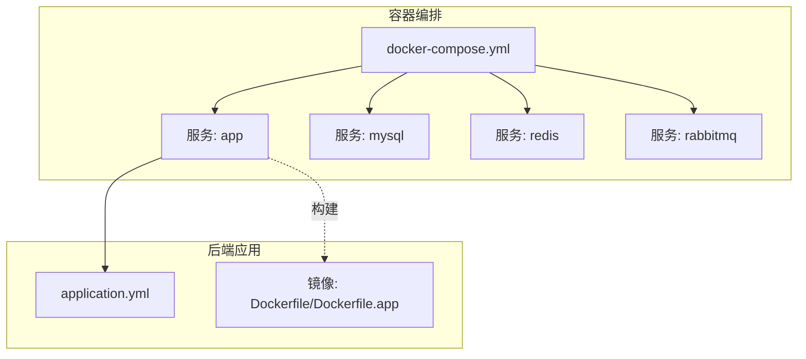
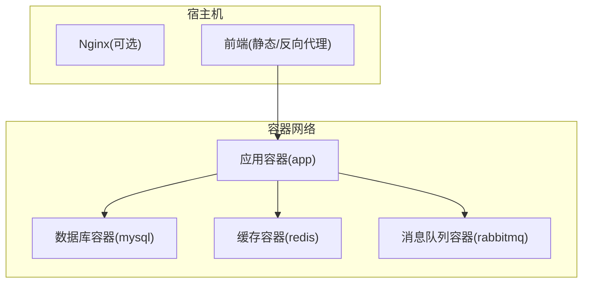
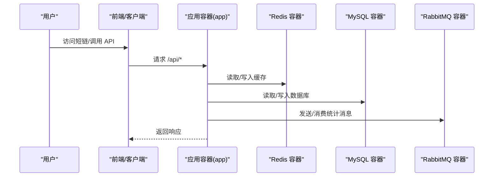
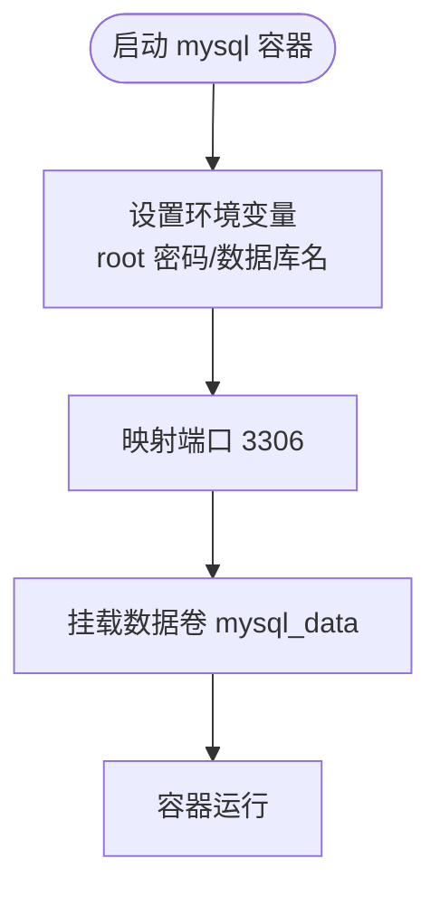
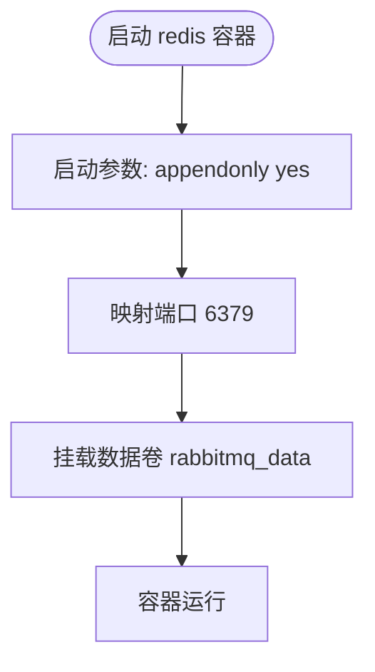
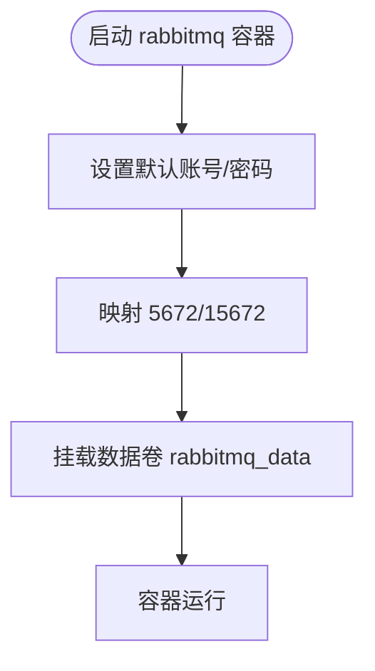
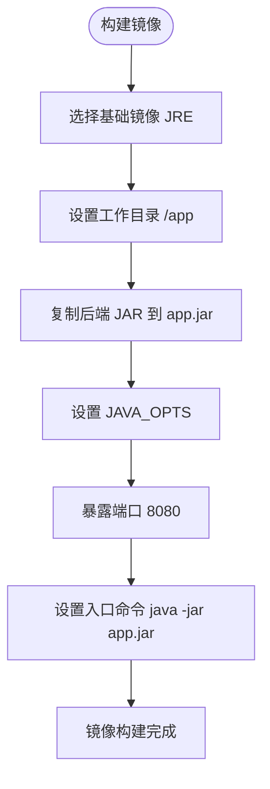
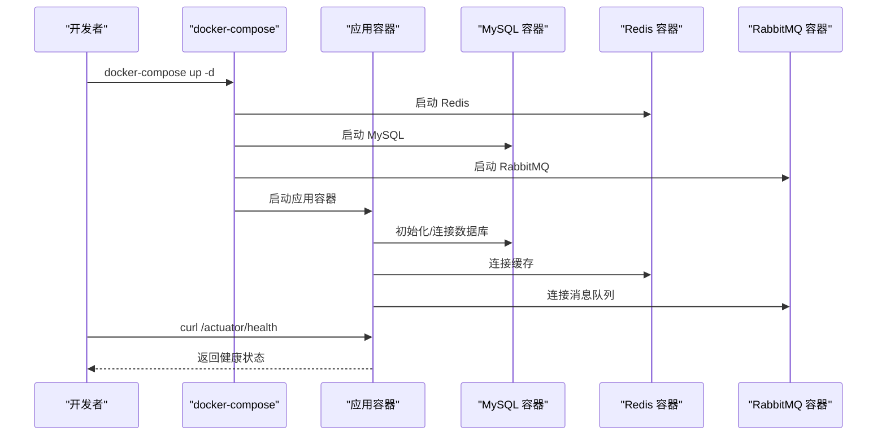
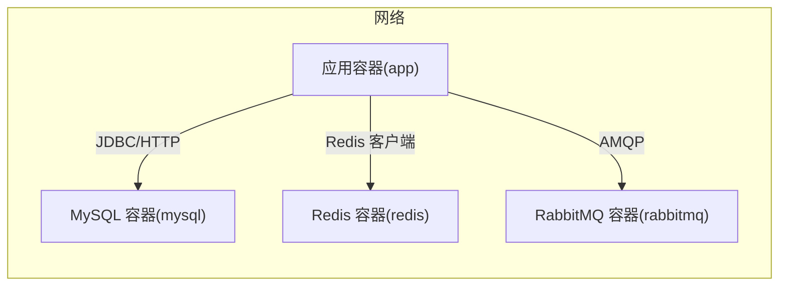
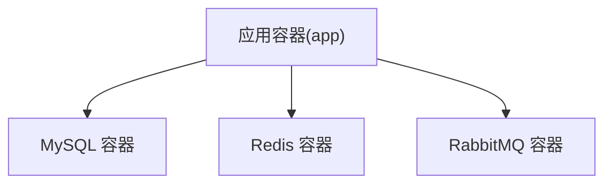

# 容器化部署

<cite>
**本文引用的文件**
- [docker-compose.yml](file://docker-compose.yml)
- [Dockerfile](file://Dockerfile)
- [Dockerfile.app](file://Dockerfile.app)
- [application.yml](file://src/main/resources/application.yml)
- [README.md](file://README.md)
- [deploy.sh](file://deploy.sh)
- [DEPLOY_ALIYUN.md](file://DEPLOY_ALIYUN.md)
</cite>

## 目录
1. [引言](#引言)
2. [项目结构](#项目结构)
3. [核心组件](#核心组件)
4. [架构总览](#架构总览)
5. [详细组件分析](#详细组件分析)
6. [依赖关系分析](#依赖关系分析)
7. [性能考虑](#性能考虑)
8. [故障排查指南](#故障排查指南)
9. [结论](#结论)
10. [附录](#附录)

## 引言
本章节面向希望使用 docker-compose.yml 文件进行一键部署的用户，系统讲解如何基于仓库中的编排文件启动应用、MySQL、Redis、RabbitMQ 四类服务，并说明 Dockerfile 的构建流程、镜像制作与启动命令、服务间网络通信与数据卷挂载、以及如何在生产环境中调整容器资源限制（CPU、内存）以满足性能与稳定性需求。

## 项目结构
本项目采用前后端分离与后端微服务化的组织方式，容器化部署主要围绕后端服务与三大依赖服务（MySQL、Redis、RabbitMQ）展开。关键文件如下：
- docker-compose.yml：定义服务编排、网络、卷、环境变量与资源策略
- Dockerfile/Dockerfile.app：定义后端镜像构建流程与运行参数
- src/main/resources/application.yml：后端应用的连接配置（开发/默认）
- README.md：包含一键启动与 Docker 部署的参考命令
- deploy.sh：自动化部署脚本（生产环境 systemd 方案）
- DEPLOY_ALIYUN.md：阿里云部署指南（生产环境配置）

**图表来源**
- [docker-compose.yml](file://docker-compose.yml#L1-L67)
- [Dockerfile](file://Dockerfile#L1-L7)
- [Dockerfile.app](file://Dockerfile.app#L1-L6)
- [application.yml](file://src/main/resources/application.yml#L1-L218)

**章节来源**
- [docker-compose.yml](file://docker-compose.yml#L1-L67)
- [Dockerfile](file://Dockerfile#L1-L7)
- [Dockerfile.app](file://Dockerfile.app#L1-L6)
- [application.yml](file://src/main/resources/application.yml#L1-L218)

## 核心组件
- 应用服务（app）
  - 基于 Dockerfile.app 构建镜像，暴露 8080 端口，通过环境变量连接 MySQL、Redis、RabbitMQ
  - 依赖关系：先启动 redis、mysql、rabbitmq，再启动 app
- MySQL 服务
  - 使用官方镜像，设置 root 密码与数据库名称，映射 3306 端口，使用命名卷持久化数据
- Redis 服务
  - 使用官方镜像，启用 AOF 持久化，映射 6379 端口，使用命名卷持久化数据
- RabbitMQ 服务
  - 使用官方镜像（带管理界面），设置默认账号密码，映射 AMQP 与管理端口，使用命名卷持久化数据

**章节来源**
- [docker-compose.yml](file://docker-compose.yml#L1-L67)

## 架构总览
下图展示了容器化部署的整体拓扑与服务间通信路径。

**图表来源**
- [docker-compose.yml](file://docker-compose.yml#L1-L67)

## 详细组件分析

### 应用服务（app）
- 构建与运行
  - 使用 Dockerfile.app 构建镜像，工作目录为 /app，拷贝后端 JAR 包到 app.jar，设置 JAVA_OPTS，入口命令为 java -jar app.jar
  - 暴露 8080 端口，映射到宿主机 8080
- 环境变量
  - 数据源连接：通过 JDBC URL 指向 mysql 容器的 tiny-flow 数据库
  - Redis 连接：host 指向 redis 容器，端口 6379，超时 100ms
  - RabbitMQ 连接：host 指向 rabbitmq 容器，端口 5672，默认账号 guest/guest
  - 服务器端口：8080
- 依赖关系
  - 通过 depends_on 确保在 redis、mysql、rabbitmq 启动后再启动 app
- 健康检查
  - 可通过 /actuator/health 进行健康检查（参考 README 的验证命令）

**图表来源**
- [docker-compose.yml](file://docker-compose.yml#L37-L60)
- [application.yml](file://src/main/resources/application.yml#L1-L218)

**章节来源**
- [Dockerfile.app](file://Dockerfile.app#L1-L6)
- [docker-compose.yml](file://docker-compose.yml#L37-L60)
- [application.yml](file://src/main/resources/application.yml#L1-L218)

### MySQL 服务
- 镜像与版本：mysql:8.0
- 环境变量：设置 root 密码与数据库名称
- 端口映射：3306 -> 3306
- 数据卷：mysql_data（持久化 /var/lib/mysql）
- 启动参数：指定认证插件为 mysql_native_password

**图表来源**
- [docker-compose.yml](file://docker-compose.yml#L10-L21)

**章节来源**
- [docker-compose.yml](file://docker-compose.yml#L10-L21)

### Redis 服务
- 镜像与版本：redis:7
- 启动参数：开启 AOF 持久化
- 端口映射：6379 -> 6379
- 数据卷：rabbitmq_data（持久化 /var/lib/rabbitmq）

**图表来源**
- [docker-compose.yml](file://docker-compose.yml#L1-L9)

**章节来源**
- [docker-compose.yml](file://docker-compose.yml#L1-L9)

### RabbitMQ 服务
- 镜像与版本：rabbitmq:3.13-management
- 环境变量：默认用户名/密码
- 端口映射：5672（AMQP）、15672（管理界面）
- 数据卷：rabbitmq_data（持久化 /var/lib/rabbitmq）

**图表来源**
- [docker-compose.yml](file://docker-compose.yml#L23-L35)

**章节来源**
- [docker-compose.yml](file://docker-compose.yml#L23-L35)

### Dockerfile 构建流程
- 基础镜像：openjdk:17-jre-slim（或 eclipse-temurin:17-jre，取决于具体使用的 Dockerfile）
- 工作目录：/app
- 依赖安装：镜像内仅包含 JRE，无需额外安装依赖
- 应用打包：将本地打包好的可执行 JAR 复制到镜像内（target/*.jar -> app.jar）
- 启动命令：通过 ENTRYPOINT 执行 java -jar app.jar，并设置 JAVA_OPTS（如最小/最大堆大小）

**图表来源**
- [Dockerfile.app](file://Dockerfile.app#L1-L6)
- [Dockerfile](file://Dockerfile#L1-L7)

**章节来源**
- [Dockerfile.app](file://Dockerfile.app#L1-L6)
- [Dockerfile](file://Dockerfile#L1-L7)

### 一键部署命令示例
- 使用 docker-compose 一键启动（包含 MySQL、Redis、RabbitMQ、应用）
  - 命令：docker-compose up -d
  - 说明：后台启动所有服务，首次运行会拉取镜像并创建网络与卷
- 验证健康状态
  - 命令：curl http://localhost:8080/actuator/health
  - 说明：访问后端健康检查端点，确认应用已就绪
- 生成短链接与跳转验证
  - 命令：参考 README 的 curl 示例，POST /api/shorten 与 GET /{code}

**图表来源**
- [docker-compose.yml](file://docker-compose.yml#L1-L67)
- [README.md](file://README.md#L377-L401)

**章节来源**
- [docker-compose.yml](file://docker-compose.yml#L1-L67)
- [README.md](file://README.md#L377-L401)

### 服务间网络通信与数据卷挂载
- 网络通信
  - 应用容器通过服务名作为主机名访问依赖服务：mysql、redis、rabbitmq
  - 应用容器暴露 8080 端口供外部访问
- 数据卷挂载
  - mysql_data：持久化 MySQL 数据目录
  - rabbitmq_data：持久化 RabbitMQ 数据目录
- 环境变量
  - 应用容器通过环境变量配置数据源、Redis、RabbitMQ 的主机名、端口与凭据

**图表来源**
- [docker-compose.yml](file://docker-compose.yml#L37-L60)

**章节来源**
- [docker-compose.yml](file://docker-compose.yml#L1-L67)

### 生产环境资源限制调整
- CPU 与内存限制
  - 可在 docker-compose.yml 中为 app 服务添加 deploy.resources 配置，限制 CPU 与内存
  - 也可在 docker run 命令中使用 --cpus 与 -m 参数进行限制
- JVM 内存参数
  - Dockerfile 中通过 JAVA_OPTS 设置最小/最大堆大小，可根据容器内存上限适当调整
- 端口与安全
  - 生产环境建议通过反向代理（如 Nginx）对外暴露 80/443，并配置 TLS
  - 限制对管理端口（如 RabbitMQ 15672）的访问范围

**章节来源**
- [Dockerfile.app](file://Dockerfile.app#L1-L6)
- [docker-compose.yml](file://docker-compose.yml#L37-L60)

## 依赖关系分析
- 组件耦合
  - 应用容器强依赖 MySQL、Redis、RabbitMQ 的可用性
  - 通过 depends_on 保证启动顺序，但不保证服务真正可用，建议配合健康检查
- 外部依赖
  - MySQL、Redis、RabbitMQ 官方镜像
  - JDK 运行时（JRE）镜像
- 接口契约
  - 应用容器通过环境变量与依赖服务建立连接，遵循标准 JDBC、Redis、AMQP 协议

**图表来源**
- [docker-compose.yml](file://docker-compose.yml#L1-L67)

**章节来源**
- [docker-compose.yml](file://docker-compose.yml#L1-L67)

## 性能考虑
- 连接池与线程
  - application.yml 中配置了 Hikari 连接池参数、Tomcat 线程池参数，建议结合容器资源上限进行调优
- 缓存与数据库
  - Redis 作为二级缓存，建议合理设置连接池与超时，避免阻塞
- 消息队列
  - RabbitMQ 的并发与预取参数影响吞吐，建议结合业务峰值进行压测与调优
- JVM 堆大小
  - Dockerfile 中设置了 JAVA_OPTS，建议与容器内存上限匹配，避免 OOM

**章节来源**
- [application.yml](file://src/main/resources/application.yml#L1-L218)
- [Dockerfile.app](file://Dockerfile.app#L1-L6)

## 故障排查指南
- 健康检查
  - 通过 /actuator/health 检查后端服务状态
- 日志定位
  - docker-compose logs -f app 查看应用日志
  - docker-compose logs -f mysql/redis/rabbitmq 查看依赖服务日志
- 端口占用
  - 确认宿主机 8080、3306、6379、5672、15672 未被占用
- 数据持久化
  - 检查 mysql_data 与 rabbitmq_data 卷是否存在且权限正确
- 环境变量
  - 确认 JDBC URL、Redis/RabbitMQ 主机名与凭据正确

**章节来源**
- [docker-compose.yml](file://docker-compose.yml#L1-L67)
- [README.md](file://README.md#L453-L466)

## 结论
通过 docker-compose.yml 可以快速搭建包含应用与三大依赖服务的完整环境。Dockerfile/Dockerfile.app 简洁高效地将后端 JAR 打包进镜像并设置运行参数。生产环境中应结合资源限制、连接池与 JVM 堆大小进行综合调优，并通过反向代理与 TLS 提升安全性与可用性。

## 附录
- 一键启动命令参考（来自 README）
  - docker-compose up -d
  - curl http://localhost:8080/actuator/health
  - curl -X POST http://localhost:8080/api/shorten ... 与 curl -I http://localhost:8080/{code}
- 生产环境 systemd 部署脚本（deploy.sh）可用于更贴近生产的真实部署流程
- 阿里云部署指南（DEPLOY_ALIYUN.md）提供了更详细的生产配置与运维建议

**章节来源**
- [README.md](file://README.md#L377-L466)
- [deploy.sh](file://deploy.sh#L556-L595)
- [DEPLOY_ALIYUN.md](file://DEPLOY_ALIYUN.md#L201-L842)