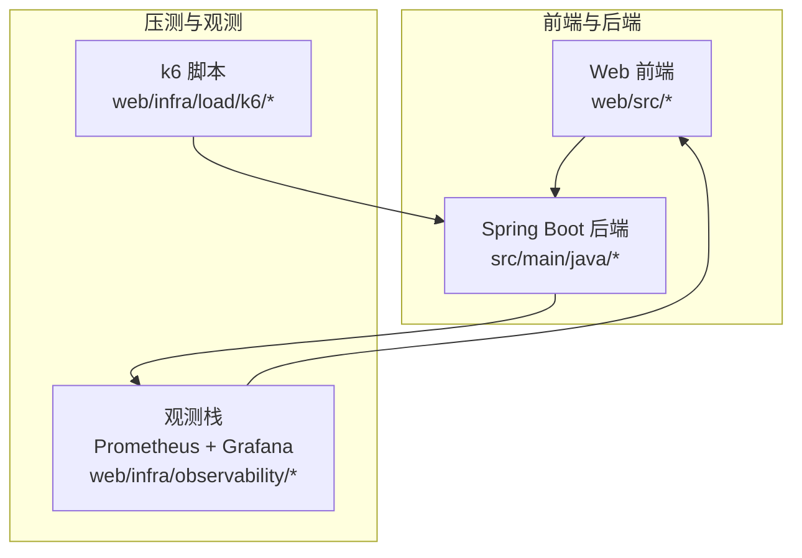
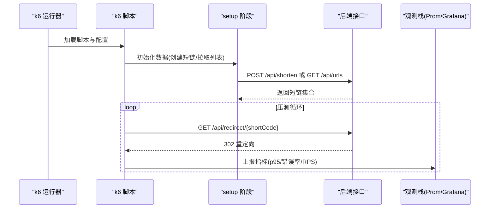
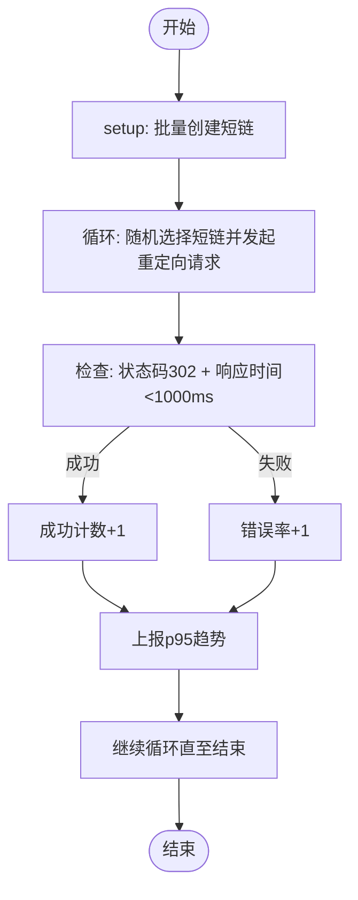
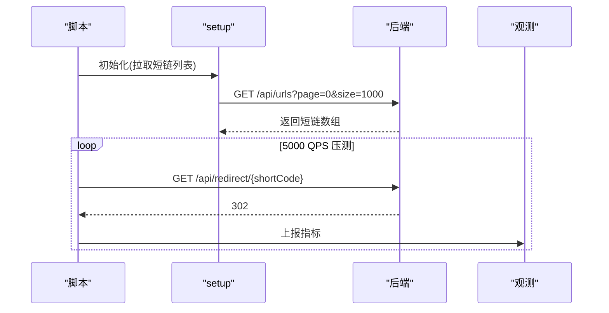
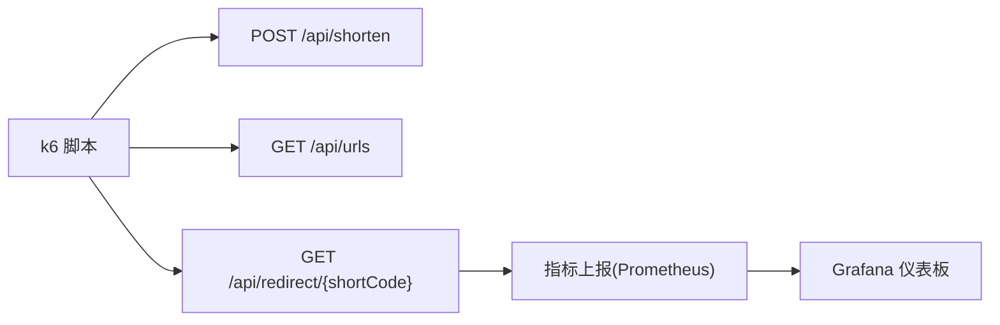

# 性能压测

<cite>
**本文引用的文件**
- [max-qps-test.js](file://web/infra/load/k6/max-qps-test.js)
- [stress-5000qps.js](file://web/infra/load/k6/stress-5000qps.js)
- [verify-1000qps.js](file://web/infra/load/k6/verify-1000qps.js)
- [verify-3000qps.js](file://web/infra/load/k6/verify-3000qps.js)
- [real-qps-test.js](file://web/infra/load/k6/real-qps-test.js)
- [shortener.js](file://web/infra/load/k6/shortener.js)
- [perf-optimization.md](file://web/docs/perf-optimization.md)
- [README.md](file://web/README.md)
- [docker-compose.yml](file://web/infra/observability/docker-compose.yml)
- [k6-load-results.json](file://web/infra/observability/dashboards/k6-load-results.json)
- [ShortUrlController.java](file://src/main/java/com/layor/tinyflow/Controller/ShortUrlController.java)
</cite>

## 目录
1. [简介](#简介)
2. [项目结构](#项目结构)
3. [核心组件](#核心组件)
4. [架构总览](#架构总览)
5. [详细组件分析](#详细组件分析)
6. [依赖关系分析](#依赖关系分析)
7. [性能考量](#性能考量)
8. [故障排查指南](#故障排查指南)
9. [结论](#结论)
10. [附录](#附录)

## 简介
本文件面向使用 k6 对后端短链服务进行性能压测的读者，系统性讲解 web/infra/load/k6 目录下的多个测试脚本，包括：
- 最大 QPS 测试：max-qps-test.js
- 高负载压力测试：stress-5000qps.js
- 稳定性验证（1000 QPS）：verify-1000qps.js
- 稳定性验证（3000 QPS）：verify-3000qps.js
- 真实场景流量：real-qps-test.js
- 综合样例：shortener.js

内容涵盖运行方式、指标阈值、测试流程、结果解读与基于结果的系统优化建议。

## 项目结构
k6 压测脚本位于 web/infra/load/k6，配合可观测性栈（Prometheus + Grafana）进行压测期间与回归阶段的可视化监控。README 提供了启动后端、启动观测栈、运行压测脚本的步骤指引。

**章节来源**
- file://web/README.md#L345-L366
- file://web/infra/observability/docker-compose.yml#L1-L21

## 核心组件
- k6 场景与执行器
  - 常量到达率（constant-arrival-rate）：稳定 QPS，适合验证稳定性。
  - 梯度到达率（ramping-arrival-rate）：逐步升压，逼近系统极限。
- 指标与阈值
  - p95 延迟、错误率、成功计数等，用于判断系统健康度。
- 数据准备与复用
  - 通过 setup 阶段批量创建短链，压测阶段随机选取短链进行重定向，提高复用效率。
- API 接口
  - /api/shorten 创建短链
  - /api/urls 列表查询（用于压测前获取已有短链）
  - /api/redirect/{shortCode} 重定向接口（压测目标）

**章节来源**
- file://web/infra/load/k6/max-qps-test.js#L1-L117
- file://web/infra/load/k6/stress-5000qps.js#L1-L93
- file://web/infra/load/k6/verify-1000qps.js#L1-L85
- file://web/infra/load/k6/verify-3000qps.js#L1-L88
- file://web/infra/load/k6/real-qps-test.js#L1-L89
- file://web/infra/load/k6/shortener.js#L1-L65
- file://src/main/java/com/layor/tinyflow/Controller/ShortUrlController.java#L1-L82

## 架构总览
下图展示压测脚本、后端接口与观测栈之间的交互关系。

**图表来源**
- [max-qps-test.js](file://web/infra/load/k6/max-qps-test.js#L1-L117)
- [stress-5000qps.js](file://web/infra/load/k6/stress-5000qps.js#L1-L93)
- [verify-1000qps.js](file://web/infra/load/k6/verify-1000qps.js#L1-L85)
- [verify-3000qps.js](file://web/infra/load/k6/verify-3000qps.js#L1-L88)
- [real-qps-test.js](file://web/infra/load/k6/real-qps-test.js#L1-L89)
- [shortener.js](file://web/infra/load/k6/shortener.js#L1-L65)
- [ShortUrlController.java](file://src/main/java/com/layor/tinyflow/Controller/ShortUrlController.java#L1-L82)

## 详细组件分析

### 最大 QPS 测试：max-qps-test.js
- 场景与执行器
  - 使用梯度到达率（ramping-arrival-rate），从 500 QPS 逐步提升至 4000 QPS，包含预热、爬坡、持续与冷却阶段。
- 指标与阈值
  - p95 延迟阈值：p(95) < 1000ms
  - 错误率阈值：失败率与自定义错误率均 < 5%
- 数据准备
  - setup 阶段批量创建 1000 个短链，供压测阶段随机选取。
- 关键行为
  - GET /api/redirect/{shortCode}，期望 302 且响应时间 < 1000ms。
  - 上报自定义趋势指标 http_req_duration_p95 与成功计数。

**图表来源**
- [max-qps-test.js](file://web/infra/load/k6/max-qps-test.js#L1-L117)

**章节来源**
- file://web/infra/load/k6/max-qps-test.js#L1-L117

### 高负载压力测试：stress-5000qps.js
- 场景与执行器
  - 使用梯度到达率，从 1000 QPS 爬升至 5000 QPS 并持续一段时间，随后降压。
- 指标与阈值
  - p95 延迟阈值：p(95) < 100ms
  - 错误率阈值：失败率与自定义错误率均 < 5%
- 数据准备
  - setup 阶段通过 GET /api/urls?page=0&size=1000 获取现有短链列表，提高压测效率。
- 关键行为
  - GET /api/redirect/{shortCode}，期望 302 且响应时间 < 100ms。

**图表来源**
- [stress-5000qps.js](file://web/infra/load/k6/stress-5000qps.js#L1-L93)
- [ShortUrlController.java](file://src/main/java/com/layor/tinyflow/Controller/ShortUrlController.java#L46-L68)

**章节来源**
- file://web/infra/load/k6/stress-5000qps.js#L1-L93

### 稳定性验证（1000 QPS）：verify-1000qps.js
- 场景与执行器
  - 使用常量到达率（constant-arrival-rate），稳定 1000 QPS，持续 2 分钟。
- 指标与阈值
  - p95 延迟阈值：p(95) < 500ms
  - 错误率阈值：失败率与自定义错误率均 < 1%
- 数据准备
  - setup 阶段批量创建 500 个短链，供压测阶段使用。
- 关键行为
  - GET /api/redirect/{shortCode}，期望 302 且响应时间 < 500ms。

**章节来源**
- file://web/infra/load/k6/verify-1000qps.js#L1-L85

### 稳定性验证（3000 QPS）：verify-3000qps.js
- 场景与执行器
  - 使用常量到达率，稳定 3000 QPS，持续 5 分钟。
- 指标与阈值
  - p95 延迟阈值：p(95) < 50ms 与 p(99) < 100ms
  - 错误率阈值：失败率 < 1%
- 数据准备
  - setup 阶段通过 GET /api/urls?page=0&size=1000 获取现有短链列表。
- 关键行为
  - GET /api/redirect/{shortCode}，期望 302 且响应时间满足阈值。

**章节来源**
- file://web/infra/load/k6/verify-3000qps.js#L1-L88

### 真实场景流量：real-qps-test.js
- 场景与执行器
  - 使用常量到达率，稳定 1000 QPS，持续 2 分钟。
- 指标与阈值
  - p95 延迟阈值：p(95) < 500ms
  - 错误率阈值：失败率与自定义错误率均 < 5%
- 数据准备
  - setup 阶段通过 GET /api/urls?page=0&size=1000 获取现有短链列表。
- 关键行为
  - GET /api/redirect/{shortCode}，期望 302 且响应时间 < 500ms。

**章节来源**
- file://web/infra/load/k6/real-qps-test.js#L1-L89

### 综合样例：shortener.js
- 场景与执行器
  - 两个场景：常量到达率（重定向）与梯度到达率（创建短链突刺）。
- 指标与阈值
  - 重定向场景：p(95) < 300ms
  - 创建短链突刺场景：p(95) < 800ms
- 数据准备
  - setup 阶段批量创建 100 个短链，供重定向场景使用。
- 关键行为
  - GET /api/redirect/{shortCode}，期望 302。

**章节来源**
- file://web/infra/load/k6/shortener.js#L1-L65

## 依赖关系分析
- 脚本依赖
  - 所有脚本均依赖后端提供的 /api/shorten、/api/urls、/api/redirect/{shortCode} 接口。
  - setup 阶段依赖 /api/shorten 或 /api/urls 获取短链集合。
- 指标上报与观测
  - k6 将指标写入 Prometheus，Grafana 导入仪表板进行可视化。
- 运行环境
  - 通过环境变量 BASE_URL 指向后端地址，默认 http://localhost:8080。

**图表来源**
- [max-qps-test.js](file://web/infra/load/k6/max-qps-test.js#L1-L117)
- [stress-5000qps.js](file://web/infra/load/k6/stress-5000qps.js#L1-L93)
- [verify-1000qps.js](file://web/infra/load/k6/verify-1000qps.js#L1-L85)
- [verify-3000qps.js](file://web/infra/load/k6/verify-3000qps.js#L1-L88)
- [real-qps-test.js](file://web/infra/load/k6/real-qps-test.js#L1-L89)
- [shortener.js](file://web/infra/load/k6/shortener.js#L1-L65)
- [ShortUrlController.java](file://src/main/java/com/layor/tinyflow/Controller/ShortUrlController.java#L1-L82)
- [k6-load-results.json](file://web/infra/observability/dashboards/k6-load-results.json#L1-L40)

**章节来源**
- file://web/infra/observability/dashboards/k6-load-results.json#L1-L40
- file://web/infra/observability/docker-compose.yml#L1-L21

## 性能考量
- 指标与 SLO
  - 重定向接口：p95 < 300ms；错误率 < 1%；吞吐 ≥ 200 RPS 稳定。
  - 创建接口：p95 < 800ms。
- 观测与可视化
  - Grafana 导入 shortener-overview.json 与 k6-load-results.json，关注 RPS、p95 延迟、错误率。
- 逐步升压
  - 建议从较低 QPS 开始，逐步爬升，避免对本机资源造成过载。
- 数据准备策略
  - 使用 setup 阶段批量创建短链，减少压测过程中的网络往返与创建开销。
- 结果解读
  - p95 升高：关注数据库交互、阻塞调用、线程池饱和。
  - 错误率上升：确认异常类型与超时中断。
  - RPS 波动：排查队列堆积、连接池限制、GC 抖动。

**章节来源**
- file://web/docs/perf-optimization.md#L1-L45

## 故障排查指南
- 常见问题与处理
  - 后端不可达：确认 BASE_URL 是否正确，端口是否开放。
  - 短链列表为空：检查 /api/urls 是否返回正常数据，或在 setup 中创建短链。
  - 压测失败率偏高：检查阈值设置是否过于严格，或是否存在网络抖动。
  - 观测数据缺失：确认 Prometheus 与 Grafana 已启动，且抓取目标正确。
- 日志与调试
  - 脚本内打印初始化进度与错误信息，便于定位问题。
  - 结合 Grafana 面板查看 p95、RPS 与错误率趋势。

**章节来源**
- file://web/infra/load/k6/max-qps-test.js#L1-L117
- file://web/infra/load/k6/stress-5000qps.js#L1-L93
- file://web/infra/load/k6/verify-1000qps.js#L1-L85
- file://web/infra/load/k6/verify-3000qps.js#L1-L88
- file://web/infra/load/k6/real-qps-test.js#L1-L89
- file://web/infra/observability/docker-compose.yml#L1-L21

## 结论
- 通过多类脚本覆盖从稳定验证到极限逼近的完整压测谱系，结合 Grafana 可视化，可形成“压测 → 观测 → 瓶颈定位 → 优化 → 回归验证”的闭环。
- 建议优先使用 verify-* 脚本建立基线，再用 stress-* 逼近极限，最后用 real-qps-test.js 验证真实流量场景。
- 优化方向包括连接池、阻塞操作、SQL/N+1、线程池与限流、统计异步化等。

## 附录

### 如何运行这些脚本
- 启动后端（默认端口 8080）
  - 在后端根目录执行：mvn spring-boot:run
- 启动观测栈（Prometheus + Grafana）
  - 在 web 目录执行：docker compose -f infra/observability/docker-compose.yml up -d
  - 打开 Grafana：http://localhost:3000（默认账号密码 admin/admin）
  - 导入仪表：infra/observability/dashboards/shortener-overview.json 与 k6-load-results.json
- 运行压测
  - 设置 BASE_URL（如需）后执行：k6 run infra/load/k6/<脚本名>.js
  - 示例：BASE_URL=http://localhost:8080 k6 run infra/load/k6/shortener.js

**章节来源**
- file://web/README.md#L345-L366

### 如何解读测试结果
- 指标关注点
  - p95 延迟：是否满足 SLO（重定向 p95 < 300ms，创建 p95 < 800ms）
  - 错误率：是否低于阈值（通常 < 1%~5%）
  - RPS：稳定波动范围与峰值
- 可视化面板
  - Grafana 仪表板提供 RPS、p95 延迟、错误率等关键指标的时间序列图，便于趋势分析。

**章节来源**
- file://web/docs/perf-optimization.md#L1-L45
- file://web/infra/observability/dashboards/k6-load-results.json#L1-L40