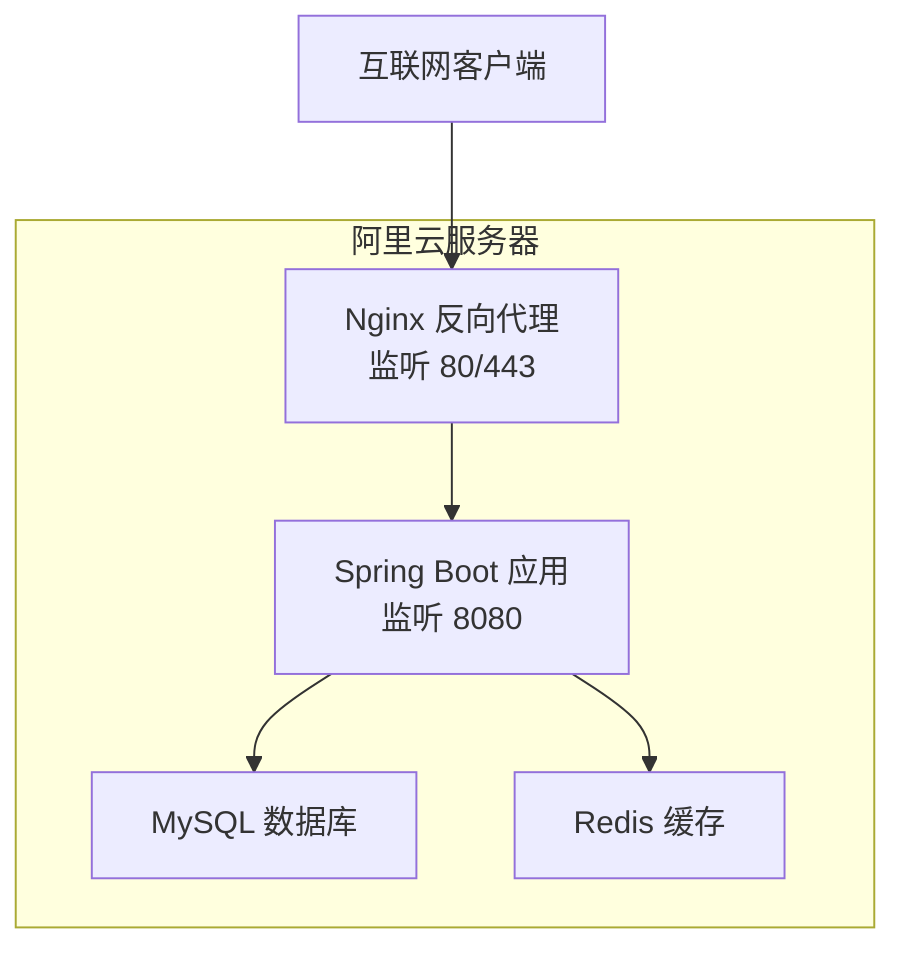
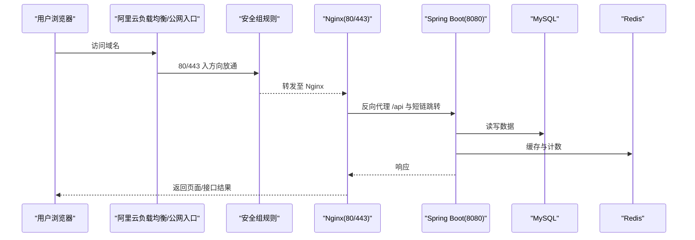
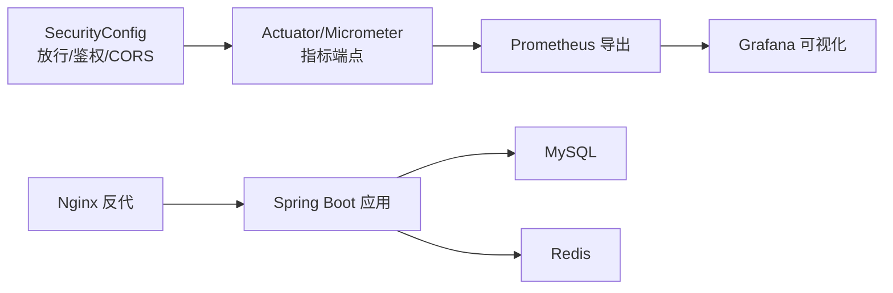

# 云平台部署配置

<cite>
**本文引用的文件**
- [DEPLOY_ALIYUN.md](file://DEPLOY_ALIYUN.md)
- [deploy.sh](file://deploy.sh)
- [application.yml](file://src/main/resources/application.yml)
- [SecurityConfig.java](file://src/main/java/com/layor/tinyflow/config/SecurityConfig.java)
- [ObservabilityConfig.java](file://src/main/java/com/layor/tinyflow/config/ObservabilityConfig.java)
- [OBSERVABILITY.md](file://OBSERVABILITY.md)
- [OPERATIONS.md](file://OPERATIONS.md)
</cite>

## 目录
1. [简介](#简介)
2. [项目结构](#项目结构)
3. [核心组件](#核心组件)
4. [架构总览](#架构总览)
5. [详细组件分析](#详细组件分析)
6. [依赖关系分析](#依赖关系分析)
7. [性能注意事项](#性能注意事项)
8. [故障排查指南](#故障排查指南)
9. [结论](#结论)
10. [附录](#附录)

## 简介
本文件基于仓库中的“阿里云部署指南”文档，面向在阿里云环境中部署与运维 TinyFlow 的读者，提供安全组、域名解析、系统监控与 HTTPS 配置的实操指引，并结合项目中的配置与可观测性能力，帮助快速完成上线与稳定运行。

## 项目结构
- 后端采用 Spring Boot，通过 Systemd 管理服务，Nginx 作为反向代理。
- 前端构建产物放置于 web/dist，由 Nginx 提供静态资源与 API 代理。
- 部署脚本负责自动化安装与配置，包含数据库、缓存、构建与服务注册等步骤。
- 安全配置对公开接口放行，对管理接口进行角色校验，同时开启无状态会话与 CORS 支持。
- 可观测性通过 Actuator、Micrometer、Prometheus、Grafana 等实现指标采集与可视化。

图表来源
- [DEPLOY_ALIYUN.md](file://DEPLOY_ALIYUN.md#L388-L456)
- [application.yml](file://src/main/resources/application.yml#L65-L78)

章节来源
- [DEPLOY_ALIYUN.md](file://DEPLOY_ALIYUN.md#L388-L456)
- [application.yml](file://src/main/resources/application.yml#L65-L78)

## 核心组件
- 安全组规则：在阿里云控制台为 ECS 实例配置入方向规则，开放 80/443（公网访问），限制 22（仅允许指定 IP）。
- 域名解析：在云解析 DNS 中添加 A 记录，将域名指向服务器公网 IP。
- 系统监控：通过阿里云控制台查看 CPU、内存、网络等指标；结合应用内置的 Actuator/Micrometer 指标端点与 Grafana 可视化。
- HTTPS 配置：使用 Certbot 为域名申请并自动配置 Let's Encrypt 证书，支持自动续期。

章节来源
- [DEPLOY_ALIYUN.md](file://DEPLOY_ALIYUN.md#L503-L527)
- [DEPLOY_ALIYUN.md](file://DEPLOY_ALIYUN.md#L732-L775)
- [DEPLOY_ALIYUN.md](file://DEPLOY_ALIYUN.md#L778-L800)
- [OBSERVABILITY.md](file://OBSERVABILITY.md#L1-L257)

## 架构总览
下图展示了从公网到应用的典型访问链路，以及安全组与 HTTPS 的关键节点。

图表来源
- [DEPLOY_ALIYUN.md](file://DEPLOY_ALIYUN.md#L388-L456)
- [DEPLOY_ALIYUN.md](file://DEPLOY_ALIYUN.md#L503-L527)
- [DEPLOY_ALIYUN.md](file://DEPLOY_ALIYUN.md#L778-L800)

## 详细组件分析

### 安全组配置步骤
- 登录阿里云控制台，进入 ECS 实例详情页，找到“更多 > 网络和安全组 > 安全组配置”，点击“配置规则”并“添加安全组规则”。
- 入方向规则建议：
  - TCP 80/80 允许 0.0.0.0/0（HTTP 公网访问）
  - TCP 443/443 允许 0.0.0.0/0（HTTPS 公网访问）
  - TCP 22/22 允许 你的IP/32（SSH 管理，限制为特定 IP）
- 重要提示：不要开放 3306（MySQL）、6379（Redis）、8080（后端）给公网，避免暴露内部服务端口。

章节来源
- [DEPLOY_ALIYUN.md](file://DEPLOY_ALIYUN.md#L503-L527)

### 域名解析配置
- 登录阿里云控制台，进入“云解析 DNS”，为域名添加 A 记录，记录值为服务器公网 IP，TTL 建议 10 分钟。
- 修改 Nginx 站点配置中的 server_name，使其匹配你的域名。
- 修改应用配置中的 app.domain，确保短链跳转与前端路由正确。
- 重启 Nginx 与应用服务，使变更生效。

章节来源
- [DEPLOY_ALIYUN.md](file://DEPLOY_ALIYUN.md#L732-L775)

### 系统监控配置
- 阿里云控制台监控：
  - 在 ECS 控制台查看 CPU、内存、网络、磁盘 IO 等指标，结合告警规则进行预警。
- 应用内监控：
  - Actuator 暴露健康检查、指标、熔断器、限流器等端点，便于快速诊断。
  - Micrometer 指标导出为 Prometheus 格式，可配合 Grafana 导入仪表板进行可视化。
  - 可观测性文档提供了端点清单、关键指标与告警建议，便于建立监控体系。

章节来源
- [OBSERVABILITY.md](file://OBSERVABILITY.md#L1-L257)
- [application.yml](file://src/main/resources/application.yml#L88-L132)

### HTTPS 配置流程（Let's Encrypt）
- 安装 Certbot 与 Nginx 插件。
- 使用 certbot --nginx 为域名申请证书，并自动配置 Nginx。
- 测试自动续期，确保证书到期前自动续期。
- 若需手动续期，可使用 certbot renew --dry-run 进行验证。

章节来源
- [DEPLOY_ALIYUN.md](file://DEPLOY_ALIYUN.md#L778-L800)

### 部署脚本与服务管理（参考）
- 部署脚本会自动安装系统依赖、构建前后端、配置 Nginx 与 Systemd 服务，并等待服务健康检查。
- 服务管理可通过 systemctl 控制，包括启动、停止、重启、开机自启与状态查看。
- 日志查看可通过 journalctl 与 Nginx 访问/错误日志进行定位。

章节来源
- [deploy.sh](file://deploy.sh#L556-L596)
- [OPERATIONS.md](file://OPERATIONS.md#L47-L122)

## 依赖关系分析
- 应用层依赖：
  - Spring Security 对公开接口放行，对管理接口进行角色校验，无状态会话与 CORS 支持。
  - Actuator/Micrometer 提供指标导出，便于 Prometheus/Grafana 可视化。
- 网络层依赖：
  - Nginx 作为统一入口，代理 /api 与短链跳转，限制 /actuator 仅本地访问。
  - 安全组规则控制公网访问面，避免内部端口外泄。

图表来源
- [SecurityConfig.java](file://src/main/java/com/layor/tinyflow/config/SecurityConfig.java#L46-L95)
- [ObservabilityConfig.java](file://src/main/java/com/layor/tinyflow/config/ObservabilityConfig.java#L1-L60)
- [application.yml](file://src/main/resources/application.yml#L88-L132)
- [DEPLOY_ALIYUN.md](file://DEPLOY_ALIYUN.md#L388-L456)

章节来源
- [SecurityConfig.java](file://src/main/java/com/layor/tinyflow/config/SecurityConfig.java#L46-L95)
- [ObservabilityConfig.java](file://src/main/java/com/layor/tinyflow/config/ObservabilityConfig.java#L1-L60)
- [application.yml](file://src/main/resources/application.yml#L88-L132)
- [DEPLOY_ALIYUN.md](file://DEPLOY_ALIYUN.md#L388-L456)

## 性能注意事项
- 通过 Nginx 启用 Gzip 压缩与静态资源缓存，降低带宽与延迟。
- 合理设置 JVM 参数与 Tomcat 线程池参数，避免高并发下的连接积压。
- 使用 Redis 作为缓存与计数中间层，减少数据库压力。
- 结合 Prometheus 与 Grafana 的关键指标（P95/P99、熔断器状态、缓存命中率）进行持续优化。

章节来源
- [DEPLOY_ALIYUN.md](file://DEPLOY_ALIYUN.md#L388-L456)
- [OBSERVABILITY.md](file://OBSERVABILITY.md#L140-L160)

## 故障排查指南
- 服务无法启动：查看 journalctl -u tinyflow -n 50，检查端口占用与配置文件，必要时直接运行 jar 包验证。
- 数据库连接失败：检查 MySQL 状态、用户权限与连接日志。
- Redis 连接失败：检查 Redis 状态、密码与配置，查看 info stats。
- 前端访问失败：检查 Nginx 状态与配置、静态资源是否存在、后端 API 可用性。
- 性能问题：使用 htop、iftop、iostat 等工具观察 CPU/网络/IO；结合应用指标定位瓶颈。

章节来源
- [OPERATIONS.md](file://OPERATIONS.md#L161-L238)
- [OPERATIONS.md](file://OPERATIONS.md#L241-L280)

## 结论
通过在阿里云控制台正确配置安全组与域名解析，结合 Nginx 反向代理与 Spring Boot 应用的可观测性能力，可快速搭建稳定、可监控、可扩展的短链服务。HTTPS 证书的自动化申请与续期进一步提升了安全性与用户体验。

## 附录
- 快速命令速查：服务管理、日志查看、健康检查、备份与更新部署等常用命令。
- 常见问题 FAQ：针对服务未自启、磁盘空间不足、内存不足、访问统计与重置项目的常见处理方式。

章节来源
- [OPERATIONS.md](file://OPERATIONS.md#L685-L715)