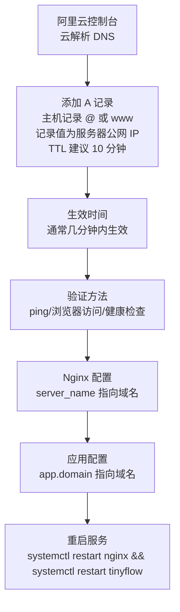
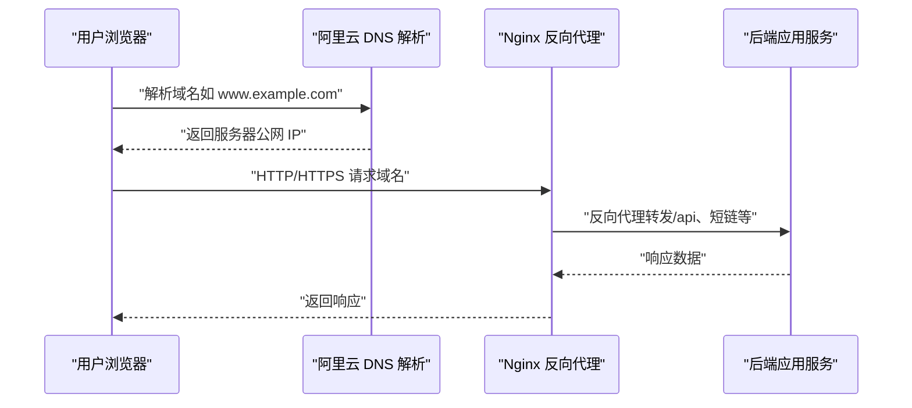
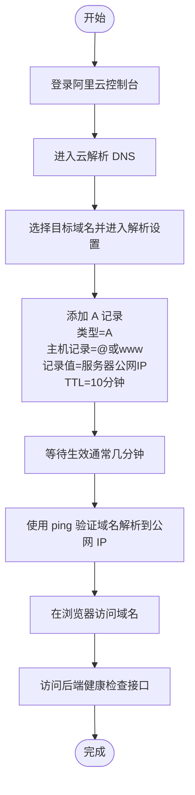
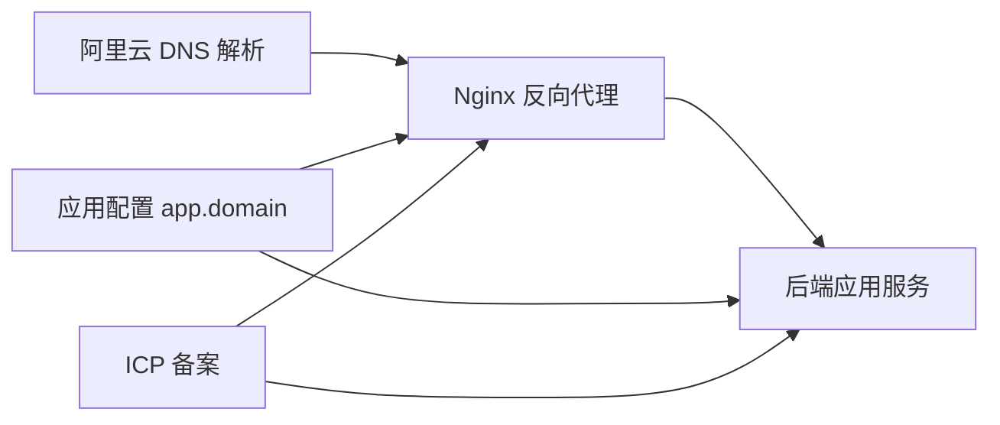

# 域名解析配置

<cite>
**本文引用的文件**
- [DEPLOY_ALIYUN.md](file://DEPLOY_ALIYUN.md)
</cite>

## 目录
1. [简介](#简介)
2. [项目结构](#项目结构)
3. [核心组件](#核心组件)
4. [架构总览](#架构总览)
5. [详细组件分析](#详细组件分析)
6. [依赖分析](#依赖分析)
7. [性能考虑](#性能考虑)
8. [故障排查指南](#故障排查指南)
9. [结论](#结论)
10. [附录](#附录)

## 简介
本章节面向在阿里云上部署并使用域名访问服务的用户，基于仓库中的部署文档，给出在阿里云“云解析 DNS”中完成域名解析设置的完整操作指引。内容涵盖登录控制台、进入目标域名解析页面、添加 A 记录、主机记录选择、记录值指向服务器公网 IP、TTL 建议值、记录生效时间与验证方法，以及使用域名访问必须完成 ICP 备案的重要提醒（否则 80/443 端口无法正常访问）。

## 项目结构
本项目包含后端 Spring Boot 应用与前端 Vue 应用，并提供一键部署脚本与详细的阿里云部署指南。域名解析配置位于部署指南的“域名配置”章节，涉及：
- 在阿里云控制台的“云解析 DNS”中添加 A 记录
- 修改 Nginx 站点配置中的 server_name
- 修改应用配置中的 app.domain
- 重启 Nginx 与后端服务使配置生效

图表来源
- [DEPLOY_ALIYUN.md](file://DEPLOY_ALIYUN.md#L732-L775)

章节来源
- [DEPLOY_ALIYUN.md](file://DEPLOY_ALIYUN.md#L732-L775)

## 核心组件
- 阿里云“云解析 DNS”
  - 作用：将域名解析到服务器公网 IP，实现通过域名访问服务。
  - 关键步骤：登录控制台 → 进入目标域名解析页面 → 添加 A 记录（主机记录 @ 或 www，记录值为服务器公网 IP，TTL 建议 10 分钟）。
- Nginx
  - 作用：作为反向代理，接收来自域名的请求并转发至后端服务端口。
  - 关键步骤：修改站点配置中的 server_name，使其与域名一致。
- 应用配置
  - 作用：提供应用内部使用的域名信息，确保短链跳转、回调等使用正确的域名。
  - 关键步骤：修改 app.domain 指向域名。
- 服务重启
  - 作用：使 Nginx 与后端服务加载新的配置。

章节来源
- [DEPLOY_ALIYUN.md](file://DEPLOY_ALIYUN.md#L732-L775)

## 架构总览
下图展示了从域名访问到后端服务的整体流程，以及域名解析配置在其中的位置：

图表来源
- [DEPLOY_ALIYUN.md](file://DEPLOY_ALIYUN.md#L388-L456)

章节来源
- [DEPLOY_ALIYUN.md](file://DEPLOY_ALIYUN.md#L388-L456)

## 详细组件分析

### 阿里云 DNS 解析配置
- 登录阿里云控制台
  - 步骤：登录阿里云控制台，进入“云解析 DNS”产品页面。
- 进入目标域名解析设置
  - 步骤：找到你的域名，点击“解析设置”。
- 添加 A 记录
  - 记录类型：A
  - 主机记录：@ 或 www
  - 记录值：你的服务器公网 IP
  - TTL：建议设置为 10 分钟
- 生效时间与验证
  - 生效时间：DNS 记录变更通常几分钟内生效。
  - 验证方法：
    - 使用 ping 命令解析域名，确认解析到正确的公网 IP。
    - 在浏览器中访问域名，观察能否打开前端页面。
    - 访问后端健康检查接口，确认服务正常。
- 备案提醒
  - 若使用域名访问，必须完成 ICP 备案；否则 80/443 端口将无法正常访问服务。

图表来源
- [DEPLOY_ALIYUN.md](file://DEPLOY_ALIYUN.md#L732-L775)

章节来源
- [DEPLOY_ALIYUN.md](file://DEPLOY_ALIYUN.md#L732-L775)

### Nginx 站点配置修改
- 修改 server_name
  - 将站点配置中的 server_name 指向你的域名（如 yourdomain.com 与 www.yourdomain.com），以便 Nginx 正确处理域名请求。
- 重启 Nginx
  - 修改配置后需重启 Nginx 使配置生效。

章节来源
- [DEPLOY_ALIYUN.md](file://DEPLOY_ALIYUN.md#L750-L775)

### 应用配置修改
- 修改 app.domain
  - 将应用配置中的 app.domain 指向你的域名，确保短链跳转、回调等使用正确的域名。
- 重启后端服务
  - 修改配置后需重启后端服务使配置生效。

章节来源
- [DEPLOY_ALIYUN.md](file://DEPLOY_ALIYUN.md#L759-L775)

## 依赖分析
- 控制台与 DNS 的耦合
  - 阿里云控制台负责维护 DNS 记录；DNS 记录决定域名解析结果。
- Nginx 与 DNS 的耦合
  - Nginx 的 server_name 必须与域名一致，否则无法正确处理域名请求。
- 应用与 Nginx 的耦合
  - 应用配置中的 app.domain 影响短链跳转与回调地址，需与 Nginx 的 server_name 保持一致。
- 备案与端口访问的关系
  - 未备案域名在阿里云默认拦截 80/443 端口，必须完成 ICP 备案后方可正常访问。

图表来源
- [DEPLOY_ALIYUN.md](file://DEPLOY_ALIYUN.md#L732-L775)
- [DEPLOY_ALIYUN.md](file://DEPLOY_ALIYUN.md#L561-L600)

章节来源
- [DEPLOY_ALIYUN.md](file://DEPLOY_ALIYUN.md#L561-L600)
- [DEPLOY_ALIYUN.md](file://DEPLOY_ALIYUN.md#L732-L775)

## 性能考虑
- TTL 值建议
  - 文档建议将 TTL 设为 10 分钟，便于快速切换解析记录，同时避免过短 TTL 对 DNS 服务器造成压力。
- 生效时间
  - DNS 记录变更通常几分钟内生效，建议在变更后尽快验证，减少业务中断时间。

章节来源
- [DEPLOY_ALIYUN.md](file://DEPLOY_ALIYUN.md#L732-L775)

## 故障排查指南
- 域名无法解析
  - 检查 DNS 记录是否正确添加（A 记录、主机记录、记录值、TTL）。
  - 使用 ping 或 nslookup 验证域名是否解析到正确的公网 IP。
- 浏览器访问异常
  - 确认 Nginx 的 server_name 已指向域名。
  - 确认应用配置中的 app.domain 已指向域名。
  - 重启 Nginx 与后端服务。
- 80/443 端口不可用
  - 若使用域名访问，必须完成 ICP 备案；否则阿里云默认拦截 80/443 端口。

章节来源
- [DEPLOY_ALIYUN.md](file://DEPLOY_ALIYUN.md#L561-L600)
- [DEPLOY_ALIYUN.md](file://DEPLOY_ALIYUN.md#L732-L775)

## 结论
通过在阿里云“云解析 DNS”中添加 A 记录（主机记录 @ 或 www，记录值为服务器公网 IP，TTL 建议 10 分钟），并配合修改 Nginx 与应用配置，即可实现通过域名访问服务。务必完成 ICP 备案，否则 80/443 端口将无法正常访问。建议在变更后尽快验证解析与服务状态，确保业务稳定运行。

## 附录
- 参考路径
  - 域名配置章节：[DEPLOY_ALIYUN.md](file://DEPLOY_ALIYUN.md#L732-L775)
  - 备案说明章节：[DEPLOY_ALIYUN.md](file://DEPLOY_ALIYUN.md#L561-L600)
  - Nginx 配置示例：[DEPLOY_ALIYUN.md](file://DEPLOY_ALIYUN.md#L388-L456)