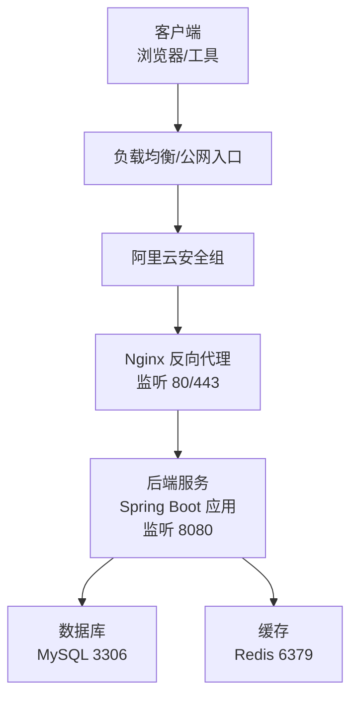
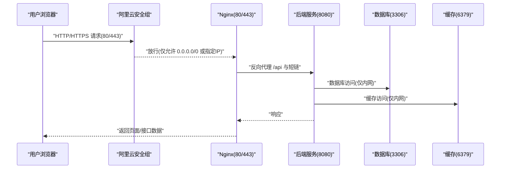
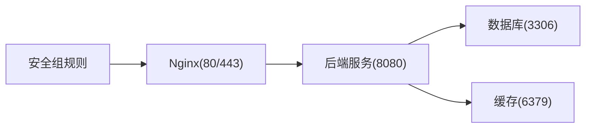

# 安全组配置

<cite>
**本文引用的文件**
- [DEPLOY_ALIYUN.md](file://DEPLOY_ALIYUN.md)
- [deploy.sh](file://deploy.sh)
- [application.yml](file://src/main/resources/application.yml)
</cite>

## 目录
1. [简介](#简介)
2. [项目结构](#项目结构)
3. [核心组件](#核心组件)
4. [架构总览](#架构总览)
5. [详细组件分析](#详细组件分析)
6. [依赖关系分析](#依赖关系分析)
7. [性能注意事项](#性能注意事项)
8. [故障排查指南](#故障排查指南)
9. [结论](#结论)
10. [附录](#附录)

## 简介
本章节围绕阿里云ECS实例的安全组配置展开，依据仓库中的部署文档，明确在阿里云控制台中如何为ECS实例添加入方向安全组规则，以实现：
- 对外开放HTTP（80端口）与HTTPS（443端口），便于公网访问；
- 仅允许特定IP访问SSH（22端口），提升运维与系统管理的安全性；
- 明确禁止开放数据库（3306）、Redis（6379）与后端服务（8080）等敏感端口，避免直接暴露带来的安全风险；
- 提供配置示例表格与操作步骤，帮助用户完成规则保存与验证。

## 项目结构
本项目采用前后端分离架构，后端通过Nginx反向代理将请求转发至本地8080端口的服务进程。安全组规则直接影响公网能否访问这些端口，因此需在阿里云控制台中进行精确配置。

图表来源
- [DEPLOY_ALIYUN.md](file://DEPLOY_ALIYUN.md#L388-L455)
- [application.yml](file://src/main/resources/application.yml#L65-L74)

章节来源
- [DEPLOY_ALIYUN.md](file://DEPLOY_ALIYUN.md#L388-L455)
- [application.yml](file://src/main/resources/application.yml#L65-L74)

## 核心组件
- 入方向安全组规则：用于控制公网对ECS实例的访问权限。
- 端口与用途：
  - 80端口：HTTP访问，用于前端页面与API代理；
  - 443端口：HTTPS访问，建议开启以保障传输安全；
  - 22端口：SSH管理，仅允许受信任的源IP访问；
  - 3306端口：数据库端口，不应直接对外暴露；
  - 6379端口：Redis端口，不应直接对外暴露；
  - 8080端口：后端服务端口，不应直接对外暴露。

章节来源
- [DEPLOY_ALIYUN.md](file://DEPLOY_ALIYUN.md#L503-L527)

## 架构总览
下图展示了公网访问到后端服务的典型路径，以及安全组在其中的关键作用。

图表来源
- [DEPLOY_ALIYUN.md](file://DEPLOY_ALIYUN.md#L388-L455)
- [application.yml](file://src/main/resources/application.yml#L65-L74)

## 详细组件分析

### 安全组规则配置步骤
- 登录阿里云控制台，进入ECS实例所在地域；
- 找到目标ECS实例，点击“更多” → “网络和安全组” → “安全组配置”；
- 点击“配置规则”，再点击“添加安全组规则”；
- 按下述示例表格添加入方向规则，完成后保存并生效。

配置示例表格（入方向）

| 规则方向 | 授权策略 | 协议类型 | 端口范围 | 授权对象 | 用途说明 |
|---|---|---|---|---|---|
| 入方向 | 允许 | TCP | 80/80 | 0.0.0.0/0 | 对外开放HTTP访问，便于浏览器访问前端与API代理 |
| 入方向 | 允许 | TCP | 443/443 | 0.0.0.0/0 | 对外开放HTTPS访问，建议开启以保障传输安全 |
| 入方向 | 允许 | TCP | 22/22 | 你的IP/32 | 仅允许特定IP访问SSH，提升运维安全性 |

章节来源
- [DEPLOY_ALIYUN.md](file://DEPLOY_ALIYUN.md#L503-L527)

### 禁止开放敏感端口
- 数据库端口：3306（MySQL）——严禁对外暴露，仅限内网访问；
- 缓存端口：6379（Redis）——严禁对外暴露，仅限内网访问；
- 后端服务端口：8080（Spring Boot）——严禁对外暴露，仅限Nginx反向代理访问。

章节来源
- [DEPLOY_ALIYUN.md](file://DEPLOY_ALIYUN.md#L523-L527)
- [application.yml](file://src/main/resources/application.yml#L65-L74)

### 规则保存与验证
- 保存规则后，等待安全组规则生效（通常即时生效）；
- 使用浏览器访问公网IP或域名，验证前端页面与API代理是否正常；
- 如需验证后端健康状态，可在内网通过本地回环地址访问健康检查端点（例如：/actuator/health），但该端口不应对外暴露。

章节来源
- [DEPLOY_ALIYUN.md](file://DEPLOY_ALIYUN.md#L528-L548)

### 与部署脚本的关系
- 一键部署脚本会自动创建Nginx站点配置，将80端口的请求代理到本地8080端口；
- 安全组规则必须允许80/443端口，否则公网无法访问；
- 若后续启用HTTPS，可在Nginx中配置证书并通过443端口对外提供服务。

章节来源
- [deploy.sh](file://deploy.sh#L362-L427)
- [DEPLOY_ALIYUN.md](file://DEPLOY_ALIYUN.md#L388-L455)

## 依赖关系分析
- Nginx监听80/443端口，负责接收公网请求；
- Nginx将/api与短链接路径代理到本地8080端口；
- 后端服务通过Spring Boot监听8080端口，内部访问数据库与缓存；
- 安全组规则决定公网能否到达Nginx与SSH端口。

图表来源
- [DEPLOY_ALIYUN.md](file://DEPLOY_ALIYUN.md#L388-L455)
- [application.yml](file://src/main/resources/application.yml#L65-L74)

章节来源
- [DEPLOY_ALIYUN.md](file://DEPLOY_ALIYUN.md#L388-L455)
- [application.yml](file://src/main/resources/application.yml#L65-L74)

## 性能注意事项
- 仅开放必要端口，减少攻击面；
- 通过Nginx统一入口与反向代理，集中处理静态资源与跨域；
- 将数据库与缓存限制在内网访问，避免不必要的网络开销与安全风险。

[本节为通用建议，无需引用具体文件]

## 故障排查指南
- 无法访问80/443端口：
  - 检查安全组是否已添加允许0.0.0.0/0或指定IP的TCP 80/443入方向规则；
  - 确认Nginx已启动且配置正确；
  - 使用内网回环地址访问后端健康检查端点，验证后端服务状态。
- SSH无法连接：
  - 确认安全组已添加允许你的IP访问TCP 22的入方向规则；
  - 检查服务器防火墙状态（Ubuntu默认未启用）。
- API返回异常或404：
  - 检查Nginx代理配置是否正确指向本地8080端口；
  - 查看Nginx错误日志定位问题。

章节来源
- [DEPLOY_ALIYUN.md](file://DEPLOY_ALIYUN.md#L995-L1092)

## 结论
通过在阿里云控制台为ECS实例配置入方向安全组规则，仅开放必要的HTTP（80）与HTTPS（443）端口，并严格限制SSH（22）端口的访问源，同时禁止开放数据库（3306）、Redis（6379）与后端服务（8080）等敏感端口，可有效提升服务器的整体安全性。结合Nginx反向代理与内网访问策略，既能满足公网访问需求，又能降低安全风险。

[本节为总结性内容，无需引用具体文件]

## 附录
- 安全组规则配置要点回顾：
  - 80/443：允许公网访问；
  - 22：仅允许特定IP访问；
  - 3306/6379/8080：禁止对外暴露。

章节来源
- [DEPLOY_ALIYUN.md](file://DEPLOY_ALIYUN.md#L503-L527)