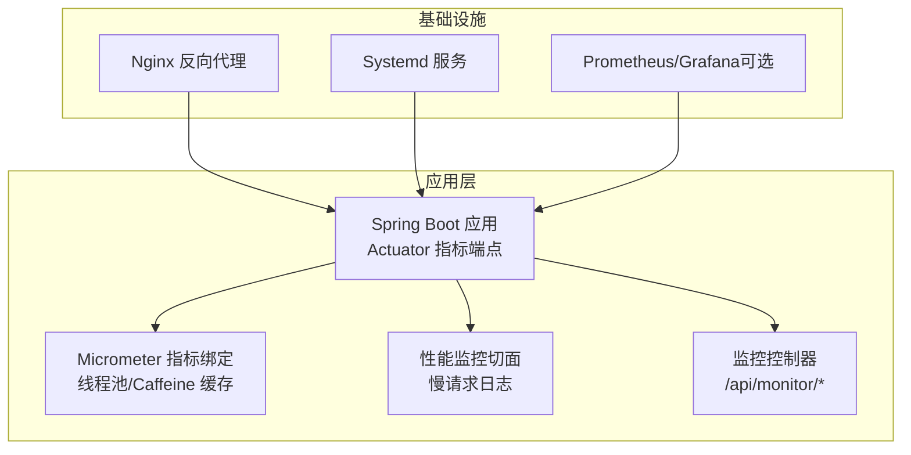
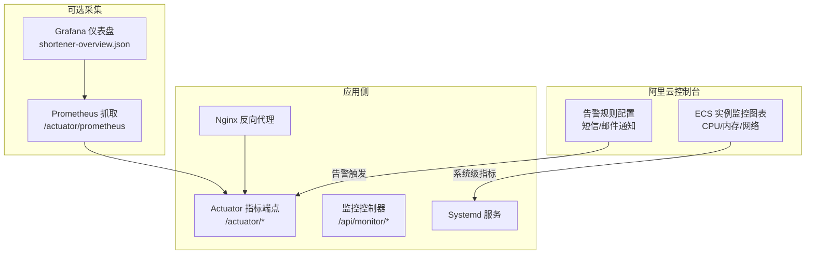
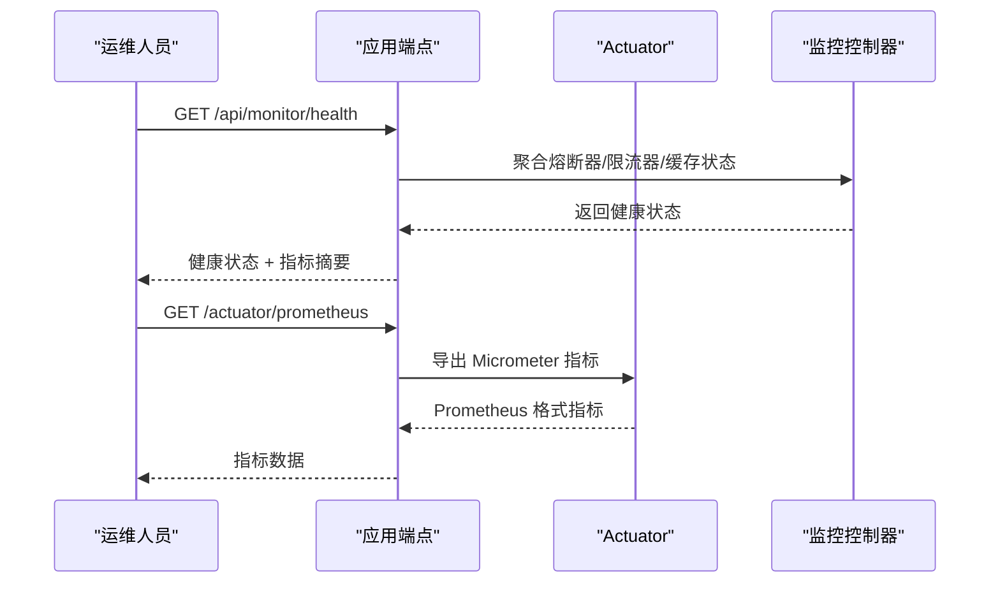
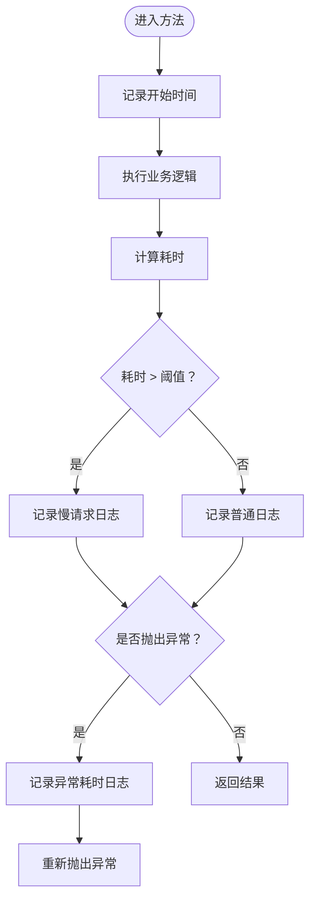
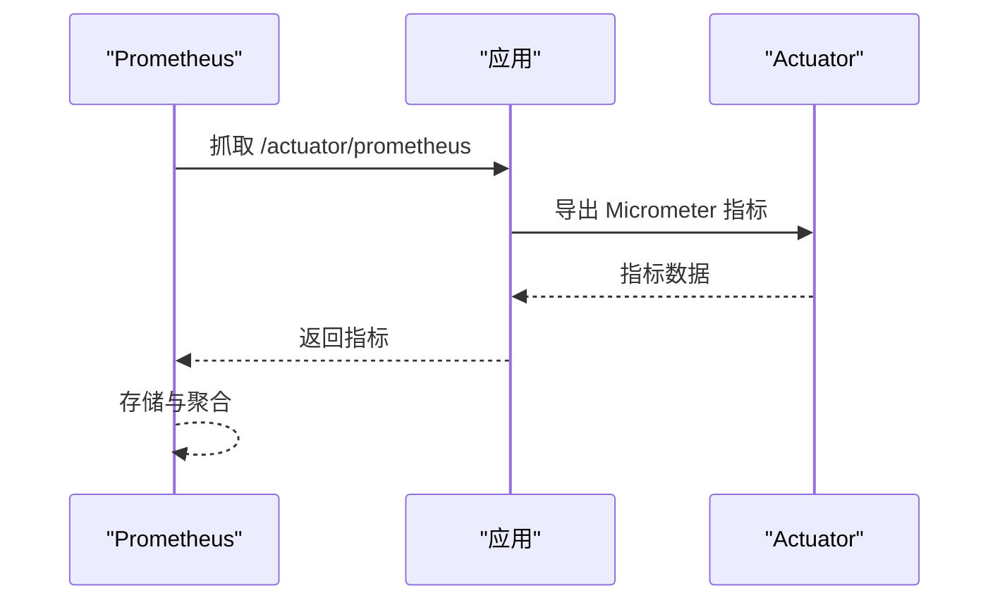
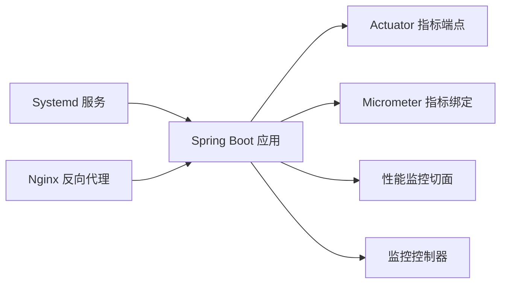

# 系统监控配置

<cite>
**本文引用的文件**
- [DEPLOY_ALIYUN.md](file://DEPLOY_ALIYUN.md)
- [OBSERVABILITY.md](file://OBSERVABILITY.md)
- [application.yml](file://src/main/resources/application.yml)
- [ObservabilityConfig.java](file://src/main/java/com/layor/tinyflow/config/ObservabilityConfig.java)
- [PerformanceMonitorAspect.java](file://src/main/java/com/layor/tinyflow/aspect/PerformanceMonitorAspect.java)
- [MonitorController.java](file://src/main/java/com/layor/tinyflow/Controller/MonitorController.java)
- [prometheus.yml](file://web/infra/observability/prometheus.yml)
- [shortener-overview.json](file://web/infra/observability/dashboards/shortener-overview.json)
- [deploy.sh](file://deploy.sh)
</cite>

## 目录
1. [简介](#简介)
2. [项目结构](#项目结构)
3. [核心组件](#核心组件)
4. [架构总览](#架构总览)
5. [详细组件分析](#详细组件分析)
6. [依赖关系分析](#依赖关系分析)
7. [性能考量](#性能考量)
8. [故障排查指南](#故障排查指南)
9. [结论](#结论)
10. [附录](#附录)

## 简介
本章节面向在阿里云 ECS 上部署并运维 TinyFlow 的工程师，围绕“系统级监控”目标，结合项目内置的可观测性能力与阿里云控制台的资源监控功能，给出可落地的操作指引。内容覆盖：
- 如何在阿里云控制台查看 ECS 实例的 CPU 使用率、内存占用、网络流入/流出带宽等核心指标
- 如何在监控图表中设置时间范围与采样粒度，并据此识别性能瓶颈
- 如何基于项目提供的监控端点与指标，配置基础告警规则（例如 CPU 持续超过阈值），并通过短信/邮件接收通知，实现主动运维

## 项目结构
为便于在阿里云控制台进行系统级监控，建议先理解应用侧的可观测性能力与暴露的监控端点，以及部署脚本中与系统服务相关的配置。

图表来源
- [application.yml](file://src/main/resources/application.yml#L88-L132)
- [ObservabilityConfig.java](file://src/main/java/com/layor/tinyflow/config/ObservabilityConfig.java#L1-L60)
- [PerformanceMonitorAspect.java](file://src/main/java/com/layor/tinyflow/aspect/PerformanceMonitorAspect.java#L1-L64)
- [MonitorController.java](file://src/main/java/com/layor/tinyflow/Controller/MonitorController.java#L1-L114)
- [prometheus.yml](file://web/infra/observability/prometheus.yml#L1-L9)

章节来源
- [application.yml](file://src/main/resources/application.yml#L88-L132)
- [deploy.sh](file://deploy.sh#L450-L520)

## 核心组件
- 应用指标与端点
  - Actuator 指标端点：包含健康检查、指标导出、熔断器/限流器状态等，便于统一采集与告警。
  - Micrometer 指标绑定：线程池与本地缓存的指标绑定，便于观察异步执行与缓存命中情况。
  - 性能监控切面：对 Controller 与 Service 层方法进行环绕监控，记录慢请求与异常耗时。
  - 监控控制器：提供 /api/monitor/health、/api/monitor/cache/stats 等便捷接口，便于快速诊断。
- 部署与服务
  - Systemd 服务：将应用作为系统服务运行，便于统一管理与日志采集。
  - Nginx 反向代理：将外部流量转发至应用端口，同时可配置健康检查路径。

章节来源
- [application.yml](file://src/main/resources/application.yml#L88-L132)
- [ObservabilityConfig.java](file://src/main/java/com/layor/tinyflow/config/ObservabilityConfig.java#L1-L60)
- [PerformanceMonitorAspect.java](file://src/main/java/com/layor/tinyflow/aspect/PerformanceMonitorAspect.java#L1-L64)
- [MonitorController.java](file://src/main/java/com/layor/tinyflow/Controller/MonitorController.java#L1-L114)
- [deploy.sh](file://deploy.sh#L450-L520)

## 架构总览
下图展示了从阿里云控制台系统监控到应用可观测性端点的整体关系，以及可选的 Prometheus/Grafana 采集链路。

图表来源
- [application.yml](file://src/main/resources/application.yml#L88-L132)
- [MonitorController.java](file://src/main/java/com/layor/tinyflow/Controller/MonitorController.java#L1-L114)
- [prometheus.yml](file://web/infra/observability/prometheus.yml#L1-L9)
- [shortener-overview.json](file://web/infra/observability/dashboards/shortener-overview.json#L1-L55)

## 详细组件分析

### 阿里云控制台系统级监控操作指南
- 登录阿里云控制台，进入 ECS 实例所在地域与资源组，选择目标实例。
- 在左侧导航中找到“监控与告警”下的“云监控”，进入“云监控图表”。
- 选择“实例监控”或“ECS 实例”维度，添加以下核心指标：
  - CPU 使用率：用于评估整体负载与热点时段
  - 内存占用：关注可用内存与使用率变化
  - 网络流入/流出带宽：识别流量高峰与异常波动
- 时间范围与采样粒度设置：
  - 时间范围：建议按“近1小时/近6小时/近24小时”进行对比分析，定位突发问题与趋势变化
  - 采样粒度：问题排查初期使用 1 分钟粒度，以便捕捉瞬态峰值；日常观察可切换为 5 分钟或更高粒度
- 识别性能瓶颈：
  - 若 CPU 使用率持续接近上限且网络带宽高，结合应用端点的延迟与错误率，判断是否为请求量激增或慢查询导致
  - 若内存占用持续上升，结合 GC 与堆使用情况，排查是否存在内存泄漏或缓存膨胀

章节来源
- [DEPLOY_ALIYUN.md](file://DEPLOY_ALIYUN.md#L503-L548)

### 基于应用端点的系统级监控
- Actuator 指标端点
  - 暴露范围：健康检查、指标导出、熔断器/限流器状态、线程转储、堆转储等
  - 指标导出：Prometheus 格式，便于外部采集
  - 配置要点：开启指标导出与百分位数统计，便于计算 P95/P99 延迟
- 监控控制器
  - /api/monitor/health：返回系统整体健康状态、熔断器与限流器状态、本地缓存统计
  - /api/monitor/cache/stats：返回缓存详细统计，便于评估缓存命中率与加载耗时
  - /api/monitor/cache/clear：清空本地缓存，可用于压测或故障恢复后的缓存预热验证

图表来源
- [MonitorController.java](file://src/main/java/com/layor/tinyflow/Controller/MonitorController.java#L1-L114)
- [application.yml](file://src/main/resources/application.yml#L88-L132)

章节来源
- [application.yml](file://src/main/resources/application.yml#L88-L132)
- [MonitorController.java](file://src/main/java/com/layor/tinyflow/Controller/MonitorController.java#L1-L114)

### Micrometer 指标绑定与性能监控切面
- 线程池指标绑定：对异步线程池进行指标绑定，便于观察队列长度、活跃线程数与拒绝情况
- 本地缓存指标绑定：对 L1 缓存进行命中率与淘汰统计，辅助定位缓存效率问题
- 性能监控切面：对 Controller 与 Service 方法进行环绕监控，记录慢请求与异常耗时，输出到独立性能日志

图表来源
- [PerformanceMonitorAspect.java](file://src/main/java/com/layor/tinyflow/aspect/PerformanceMonitorAspect.java#L1-L64)
- [ObservabilityConfig.java](file://src/main/java/com/layor/tinyflow/config/ObservabilityConfig.java#L1-L60)

章节来源
- [ObservabilityConfig.java](file://src/main/java/com/layor/tinyflow/config/ObservabilityConfig.java#L1-L60)
- [PerformanceMonitorAspect.java](file://src/main/java/com/layor/tinyflow/aspect/PerformanceMonitorAspect.java#L1-L64)

### 可选：Prometheus/Grafana 采集与仪表盘
- Prometheus 抓取配置：指向应用的 /actuator/prometheus 端点，抓取间隔与评估间隔可按需调整
- Grafana 仪表盘：导入 shortener-overview.json，包含请求吞吐、延迟分位数、错误率与重定向延迟等关键面板

图表来源
- [prometheus.yml](file://web/infra/observability/prometheus.yml#L1-L9)
- [application.yml](file://src/main/resources/application.yml#L88-L132)
- [shortener-overview.json](file://web/infra/observability/dashboards/shortener-overview.json#L1-L55)

章节来源
- [prometheus.yml](file://web/infra/observability/prometheus.yml#L1-L9)
- [shortener-overview.json](file://web/infra/observability/dashboards/shortener-overview.json#L1-L55)

## 依赖关系分析
- 应用对系统监控的依赖
  - Actuator 暴露指标，Micrometer 进行指标绑定，性能切面记录慢请求，监控控制器提供业务级健康视图
- 部署对系统监控的影响
  - Systemd 服务确保应用稳定运行，便于统一日志采集与系统级监控联动
  - Nginx 作为反向代理，其访问日志与健康检查路径可与应用端点配合，形成完整的可观测闭环

图表来源
- [deploy.sh](file://deploy.sh#L450-L520)
- [application.yml](file://src/main/resources/application.yml#L88-L132)
- [ObservabilityConfig.java](file://src/main/java/com/layor/tinyflow/config/ObservabilityConfig.java#L1-L60)
- [PerformanceMonitorAspect.java](file://src/main/java/com/layor/tinyflow/aspect/PerformanceMonitorAspect.java#L1-L64)
- [MonitorController.java](file://src/main/java/com/layor/tinyflow/Controller/MonitorController.java#L1-L114)

章节来源
- [deploy.sh](file://deploy.sh#L450-L520)
- [application.yml](file://src/main/resources/application.yml#L88-L132)

## 性能考量
- 指标粒度与范围
  - 排查问题时优先使用较短时间范围与较高粒度，以便捕捉瞬态峰值
  - 日常观察可采用较长范围与较低粒度，减少数据体量并观察趋势
- 指标关联分析
  - 结合应用端点的延迟与错误率，与系统级 CPU/内存/网络指标联动，定位瓶颈来源（应用层还是系统层）
- 缓存与线程池
  - 关注缓存命中率与淘汰统计，评估缓存策略有效性
  - 关注异步线程池队列长度与拒绝数，评估并发压力与资源配额

## 故障排查指南
- 快速健康检查
  - 通过 /api/monitor/health 获取系统整体健康状态、熔断器与限流器状态、本地缓存统计
- 慢请求定位
  - 通过性能日志定位慢请求，结合 TraceId 进行跨服务串联
- 熔断器与限流器
  - 通过 /actuator/circuitbreakers 与 /actuator/ratelimiters 查看状态，判断是否存在熔断或限流导致的异常
- 日志与系统服务
  - 使用 journalctl 查看应用日志，结合系统级监控图表定位异常时段

章节来源
- [MonitorController.java](file://src/main/java/com/layor/tinyflow/Controller/MonitorController.java#L1-L114)
- [OBSERVABILITY.md](file://OBSERVABILITY.md#L1-L257)
- [deploy.sh](file://deploy.sh#L520-L596)

## 结论
通过将阿里云控制台的系统级监控与应用侧的可观测性能力相结合，可以实现从“系统资源”到“应用指标”的全链路监控。建议在日常运维中：
- 使用阿里云控制台的 CPU/内存/网络指标进行宏观趋势观察
- 通过 /api/monitor/* 与 /actuator/* 快速定位应用层面的问题
- 基于系统级指标配置基础告警规则，实现主动运维与问题前置

## 附录

### 基础告警规则建议（CPU 持续超过阈值）
- 告警条件
  - CPU 使用率持续超过阈值（例如 80%）超过一定时长（例如 5 分钟）
- 通知方式
  - 通过阿里云控制台的告警规则配置短信与邮件通知
- 与应用指标联动
  - 当 CPU 高占用时，同步查看应用端点的延迟与错误率，判断是否由应用层压力导致

章节来源
- [DEPLOY_ALIYUN.md](file://DEPLOY_ALIYUN.md#L503-L548)
- [application.yml](file://src/main/resources/application.yml#L88-L132)