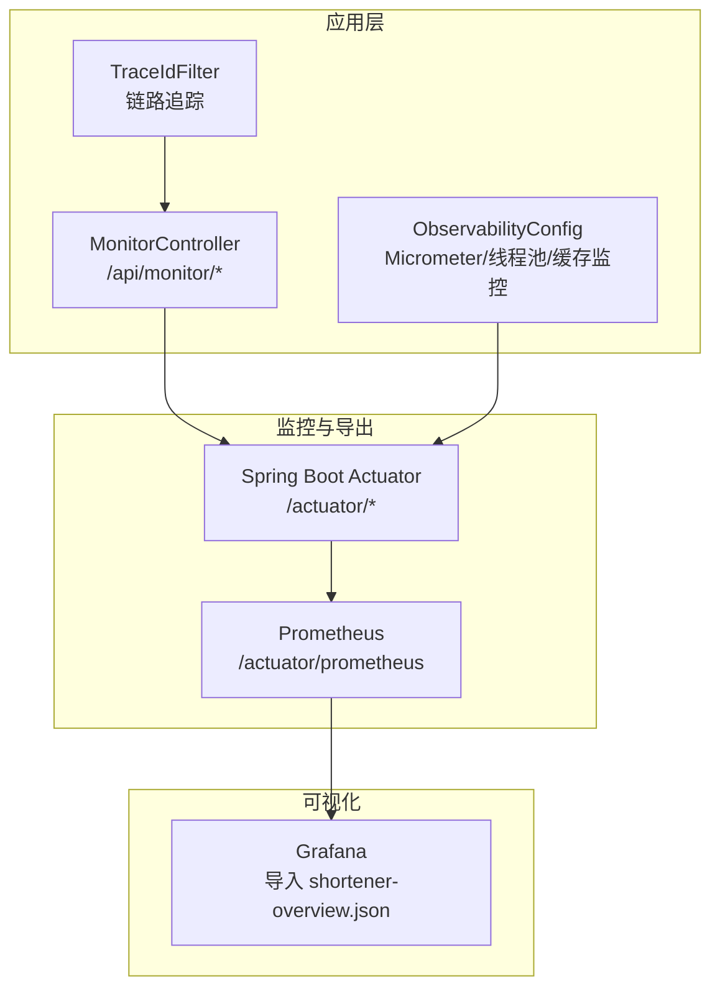
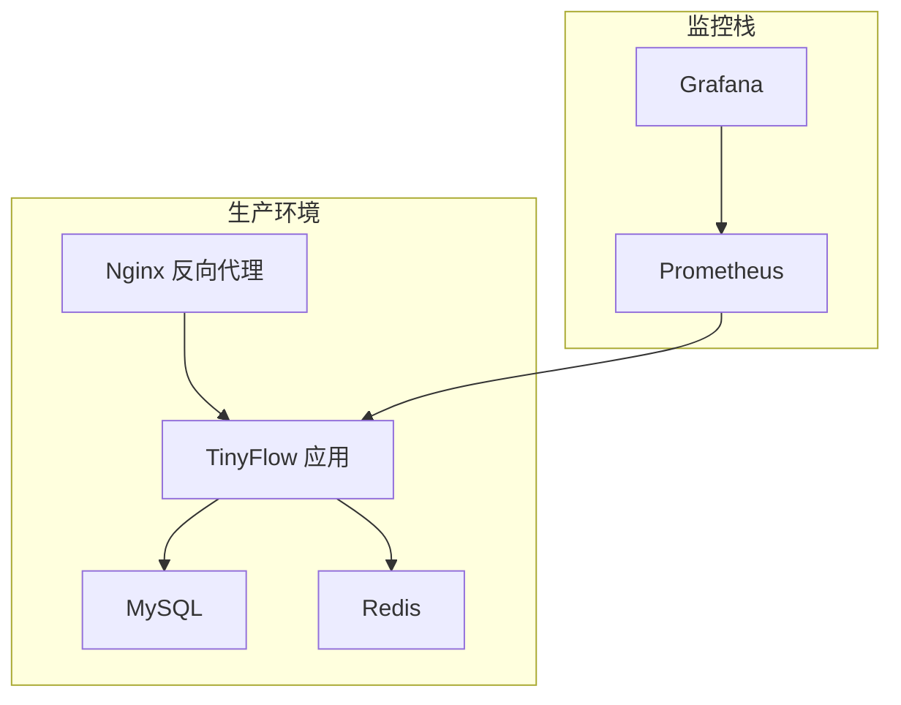
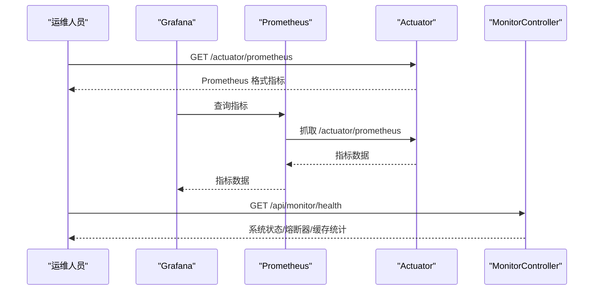
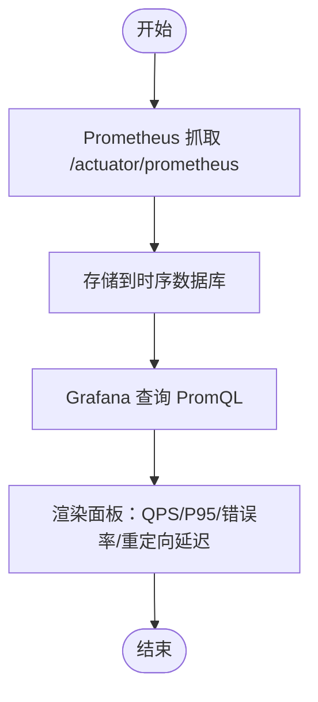
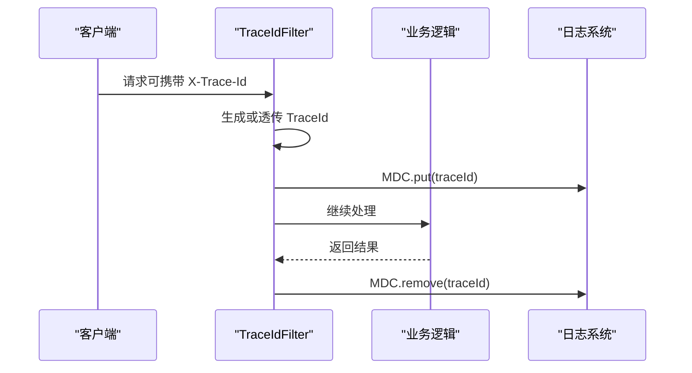
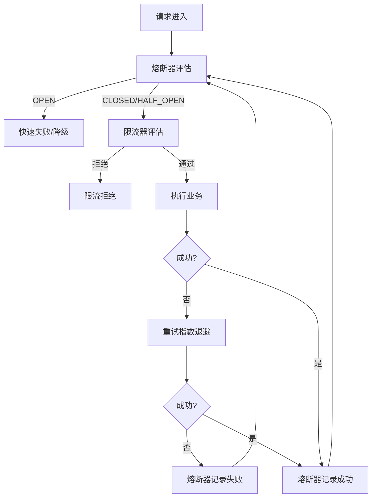
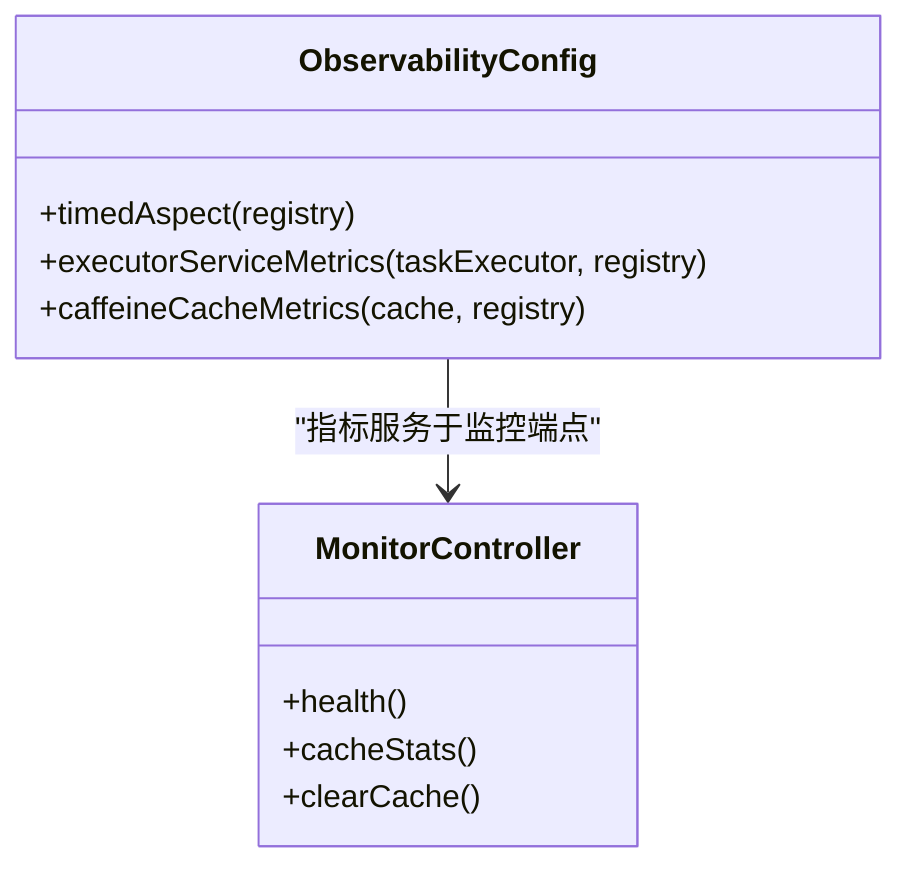
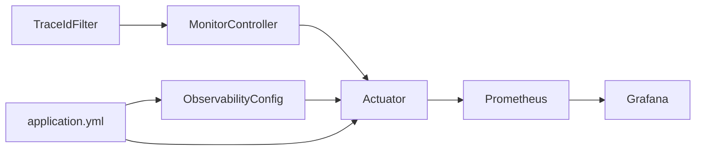

# 生产环境运维

<cite>
**本文引用的文件**
- [OBSERVABILITY.md](file://OBSERVABILITY.md)
- [OPERATIONS.md](file://OPERATIONS.md)
- [DEPLOY_ALIYUN.md](file://DEPLOY_ALIYUN.md)
- [application.yml](file://src/main/resources/application.yml)
- [ObservabilityConfig.java](file://src/main/java/com/layor/tinyflow/config/ObservabilityConfig.java)
- [MonitorController.java](file://src/main/java/com/layor/tinyflow/Controller/MonitorController.java)
- [TraceIdFilter.java](file://src/main/java/com/layor/tinyflow/filter/TraceIdFilter.java)
- [CircuitBreakerEventListener.java](file://src/main/java/com/layor/tinyflow/listener/CircuitBreakerEventListener.java)
- [shortener-overview.json](file://web/infra/observability/dashboards/shortener-overview.json)
- [prometheus.yml](file://web/infra/observability/prometheus.yml)
- [docker-compose.yml](file://web/infra/observability/docker-compose.yml)
</cite>

## 目录
1. [简介](#简介)
2. [项目结构](#项目结构)
3. [核心组件](#核心组件)
4. [架构总览](#架构总览)
5. [详细组件分析](#详细组件分析)
6. [依赖关系分析](#依赖关系分析)
7. [性能考量](#性能考量)
8. [故障排查指南](#故障排查指南)
9. [结论](#结论)
10. [附录](#附录)

## 简介
本文件面向生产环境运维，围绕监控体系、运维命令、阿里云部署与安全组配置、系统健康检查与关键指标解读展开。内容基于仓库内的可观测性文档、运维手册与部署指南，并结合后端监控端点、指标导出与可视化面板的实际实现，帮助读者建立完整的生产运维闭环。

## 项目结构
- 后端监控端点与可观测性配置位于 Spring Boot 应用中：
  - 监控端点：/api/monitor/*
  - 指标导出：/actuator/prometheus
  - 健康检查：/actuator/health
- 可观测性配置：
  - Micrometer 指标注册与线程池、缓存监控
  - 链路追踪 TraceId 过滤器
  - Resilience4j 熔断器与限流器配置
- 可视化与采集：
  - Prometheus 采集配置与 Grafana 仪表盘 JSON
  - 本地 Docker Compose 快速搭建监控栈

图表来源
- [MonitorController.java](file://src/main/java/com/layor/tinyflow/Controller/MonitorController.java#L1-L114)
- [ObservabilityConfig.java](file://src/main/java/com/layor/tinyflow/config/ObservabilityConfig.java#L1-L60)
- [TraceIdFilter.java](file://src/main/java/com/layor/tinyflow/filter/TraceIdFilter.java#L1-L55)
- [application.yml](file://src/main/resources/application.yml#L88-L132)
- [shortener-overview.json](file://web/infra/observability/dashboards/shortener-overview.json#L1-L55)
- [prometheus.yml](file://web/infra/observability/prometheus.yml#L1-L9)

章节来源
- [application.yml](file://src/main/resources/application.yml#L88-L132)
- [OBSERVABILITY.md](file://OBSERVABILITY.md#L40-L110)

## 核心组件
- 监控端点与健康检查
  - /api/monitor/health：聚合系统状态、熔断器与缓存统计
  - /api/monitor/cache/stats：缓存详细统计
  - /api/monitor/cache/clear：清空本地缓存
  - /actuator/health：Spring Boot 健康检查
  - /actuator/prometheus：Prometheus 指标导出
- 指标与可观测性
  - Micrometer 注册线程池与 Caffeine 缓存指标
  - TraceId 过滤器注入日志上下文
  - Resilience4j 熔断器与限流器配置
- 可视化与采集
  - Grafana 仪表盘 shortener-overview.json
  - Prometheus 采集后端指标
  - 本地 Docker Compose 快速搭建监控栈

章节来源
- [MonitorController.java](file://src/main/java/com/layor/tinyflow/Controller/MonitorController.java#L1-L114)
- [ObservabilityConfig.java](file://src/main/java/com/layor/tinyflow/config/ObservabilityConfig.java#L1-L60)
- [TraceIdFilter.java](file://src/main/java/com/layor/tinyflow/filter/TraceIdFilter.java#L1-L55)
- [application.yml](file://src/main/resources/application.yml#L88-L132)
- [OBSERVABILITY.md](file://OBSERVABILITY.md#L40-L110)

## 架构总览
下图展示了生产环境的监控与运维架构：应用通过 Actuator 暴露指标，Prometheus 拉取指标，Grafana 可视化；同时提供健康检查与运维命令支撑日常巡检与故障排查。

图表来源
- [application.yml](file://src/main/resources/application.yml#L88-L132)
- [prometheus.yml](file://web/infra/observability/prometheus.yml#L1-L9)
- [shortener-overview.json](file://web/infra/observability/dashboards/shortener-overview.json#L1-L55)

## 详细组件分析

### 监控端点与健康检查
- /api/monitor/health：返回系统状态、熔断器状态、限流器状态与缓存统计
- /api/monitor/cache/stats：返回缓存命中/缺失/淘汰等详细统计
- /api/monitor/cache/clear：清空本地缓存并记录移除条目数
- /actuator/health：Spring Boot 健康检查，包含组件详情
- /actuator/prometheus：导出 Micrometer 指标，供 Prometheus 抓取

图表来源
- [MonitorController.java](file://src/main/java/com/layor/tinyflow/Controller/MonitorController.java#L1-L114)
- [application.yml](file://src/main/resources/application.yml#L88-L132)
- [OBSERVABILITY.md](file://OBSERVABILITY.md#L40-L110)

章节来源
- [MonitorController.java](file://src/main/java/com/layor/tinyflow/Controller/MonitorController.java#L1-L114)
- [application.yml](file://src/main/resources/application.yml#L88-L132)
- [OBSERVABILITY.md](file://OBSERVABILITY.md#L40-L110)

### 指标导出与可视化
- Prometheus 抓取目标：/actuator/prometheus
- Grafana 仪表盘：导入 web/infra/observability/dashboards/shortener-overview.json
- 关键面板：请求吞吐量、响应延迟、熔断器状态、缓存命中率、线程池监控

图表来源
- [prometheus.yml](file://web/infra/observability/prometheus.yml#L1-L9)
- [shortener-overview.json](file://web/infra/observability/dashboards/shortener-overview.json#L1-L55)

章节来源
- [OBSERVABILITY.md](file://OBSERVABILITY.md#L163-L200)
- [shortener-overview.json](file://web/infra/observability/dashboards/shortener-overview.json#L1-L55)
- [prometheus.yml](file://web/infra/observability/prometheus.yml#L1-L9)

### 链路追踪与日志
- TraceIdFilter：为每个请求生成或透传 X-Trace-Id，注入 MDC，便于日志关联
- 日志级别与落盘：生产环境 INFO 输出至文件，慢请求与错误日志分离
- 熔断器事件：状态变化与错误事件记录，便于告警与定位

图表来源
- [TraceIdFilter.java](file://src/main/java/com/layor/tinyflow/filter/TraceIdFilter.java#L1-L55)
- [OBSERVABILITY.md](file://OBSERVABILITY.md#L26-L73)

章节来源
- [TraceIdFilter.java](file://src/main/java/com/layor/tinyflow/filter/TraceIdFilter.java#L1-L55)
- [OBSERVABILITY.md](file://OBSERVABILITY.md#L26-L73)

### 熔断器与限流配置
- Redis 熔断器：滑动窗口、失败率阈值、慢调用阈值、熔断等待时间
- 数据库熔断器：时间窗口、失败率阈值、慢调用阈值、熔断等待时间
- 重试机制：最大重试次数、等待时间、指数退避
- 限流器：redirectLimit 的权限数与等待线程数

图表来源
- [application.yml](file://src/main/resources/application.yml#L148-L212)
- [OBSERVABILITY.md](file://OBSERVABILITY.md#L1-L39)

章节来源
- [application.yml](file://src/main/resources/application.yml#L148-L212)
- [OBSERVABILITY.md](file://OBSERVABILITY.md#L1-L39)

### 缓存与线程池监控
- Caffeine 缓存：命中/缺失/淘汰/大小等统计
- 异步线程池：注册 Micrometer 指标，监控队列长度与执行情况

图表来源
- [ObservabilityConfig.java](file://src/main/java/com/layor/tinyflow/config/ObservabilityConfig.java#L1-L60)
- [MonitorController.java](file://src/main/java/com/layor/tinyflow/Controller/MonitorController.java#L1-L114)

章节来源
- [ObservabilityConfig.java](file://src/main/java/com/layor/tinyflow/config/ObservabilityConfig.java#L1-L60)
- [MonitorController.java](file://src/main/java/com/layor/tinyflow/Controller/MonitorController.java#L1-L114)

## 依赖关系分析
- 监控端点依赖 Actuator 暴露的健康与指标
- Prometheus 依赖 /actuator/prometheus 指标导出
- Grafana 依赖 Prometheus 数据源
- 熔断器与限流器配置来自 application.yml
- TraceId 过滤器贯穿请求生命周期，影响日志与追踪

图表来源
- [MonitorController.java](file://src/main/java/com/layor/tinyflow/Controller/MonitorController.java#L1-L114)
- [ObservabilityConfig.java](file://src/main/java/com/layor/tinyflow/config/ObservabilityConfig.java#L1-L60)
- [TraceIdFilter.java](file://src/main/java/com/layor/tinyflow/filter/TraceIdFilter.java#L1-L55)
- [application.yml](file://src/main/resources/application.yml#L88-L132)
- [prometheus.yml](file://web/infra/observability/prometheus.yml#L1-L9)
- [shortener-overview.json](file://web/infra/observability/dashboards/shortener-overview.json#L1-L55)

章节来源
- [application.yml](file://src/main/resources/application.yml#L88-L132)
- [OBSERVABILITY.md](file://OBSERVABILITY.md#L163-L200)

## 性能考量
- Tomcat 线程池与连接参数：最大线程、最小空闲、接受队列、最大连接数
- 连接池参数：HikariCP 最大池大小、空闲超时、最大生命周期
- Redis 连接池：最大并发、空闲、等待与最小空闲
- 缓存预热与统计：Caffeine 规格与预热大小
- 指标直方图与分位数：P50/P95/P99/P999，支持 SLO 配置

章节来源
- [application.yml](file://src/main/resources/application.yml#L65-L87)
- [application.yml](file://src/main/resources/application.yml#L9-L15)
- [application.yml](file://src/main/resources/application.yml#L21-L33)
- [application.yml](file://src/main/resources/application.yml#L141-L147)
- [application.yml](file://src/main/resources/application.yml#L105-L126)

## 故障排查指南
- 服务管理与状态检查
  - systemctl start/stop/restart/status tinyflow/nginx/mysql/redis
  - journalctl -u tinyflow -f 查看实时日志
- 健康检查与端点验证
  - curl http://localhost:8080/actuator/health
  - curl http://localhost:8080/api/monitor/health
- 数据库与缓存连通性
  - mysql -u tinyflow -p tiny-flow
  - redis-cli -a ... ping
- 日志定位
  - journalctl -u tinyflow --since today | grep -i error
  - grep "traceId" logs/tinyflow.log
  - grep "CircuitBreaker" logs/tinyflow.log
- 磁盘与内存
  - df -h、free -h、htop、iftop、iostat -x 1
- 备份与恢复
  - mysqldump、cp /var/lib/redis/dump.rdb

章节来源
- [OPERATIONS.md](file://OPERATIONS.md#L47-L123)
- [OPERATIONS.md](file://OPERATIONS.md#L125-L200)
- [OPERATIONS.md](file://OPERATIONS.md#L241-L280)
- [OPERATIONS.md](file://OPERATIONS.md#L283-L326)
- [OBSERVABILITY.md](file://OBSERVABILITY.md#L180-L207)

## 结论
通过完善的监控端点、指标导出与可视化面板，结合链路追踪与熔断限流配置，TinyFlow 在生产环境下具备可观测、可告警、可恢复的能力。配合运维手册中的命令与流程，可高效完成日常巡检、故障定位与应急处置。

## 附录

### 阿里云部署与安全组配置
- 安全组规则（入方向）：
  - TCP 80/80 允许 0.0.0.0/0（HTTP）
  - TCP 443/443 允许 0.0.0.0/0（HTTPS，可选）
  - TCP 22/22 允许 你的IP/32（SSH）
  - 不要开放 3306（MySQL）、6379（Redis）、8080（后端）
- 健康检查与 API 访问：
  - /actuator 仅允许本地访问（Nginx 限制）
  - 前端静态资源与 /api 代理至后端 8080
- 域名解析与 HTTPS：
  - A 记录指向服务器 IP
  - 使用 certbot 申请 Let's Encrypt 证书

章节来源
- [DEPLOY_ALIYUN.md](file://DEPLOY_ALIYUN.md#L503-L548)
- [DEPLOY_ALIYUN.md](file://DEPLOY_ALIYUN.md#L732-L800)

### 监控体系配置清单
- Prometheus 抓取配置：job_name、metrics_path、targets
- Grafana 导入：shortener-overview.json
- 关键告警建议（PromQL）：
  - 熔断器打开：resilience4j_circuitbreaker_state{state="open"} == 1
  - 错误率 >1%：rate(http_server_requests_seconds_count{status=~"5.."}[1m]) > 0.01
  - P95 延迟 >100ms：http_server_requests_seconds{quantile="0.95"} > 0.1
  - 缓存命中率 <90%：命中/（命中+缺失）

章节来源
- [prometheus.yml](file://web/infra/observability/prometheus.yml#L1-L9)
- [OBSERVABILITY.md](file://OBSERVABILITY.md#L163-L200)
- [OBSERVABILITY.md](file://OBSERVABILITY.md#L210-L218)

### 本地监控栈快速搭建
- docker-compose 启动 Prometheus 与 Grafana
- Prometheus 配置挂载 web/infra/observability/prometheus.yml
- Grafana 默认管理员密码：admin

章节来源
- [docker-compose.yml](file://web/infra/observability/docker-compose.yml#L1-L21)
- [prometheus.yml](file://web/infra/observability/prometheus.yml#L1-L9)